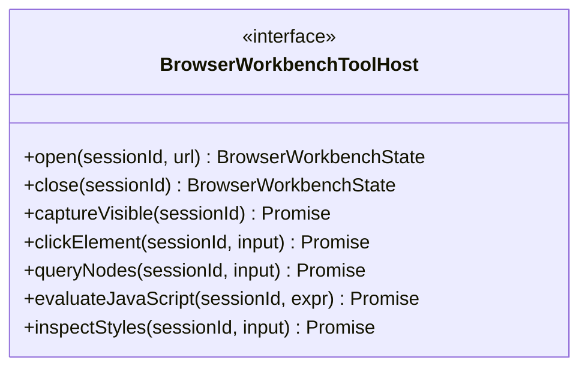
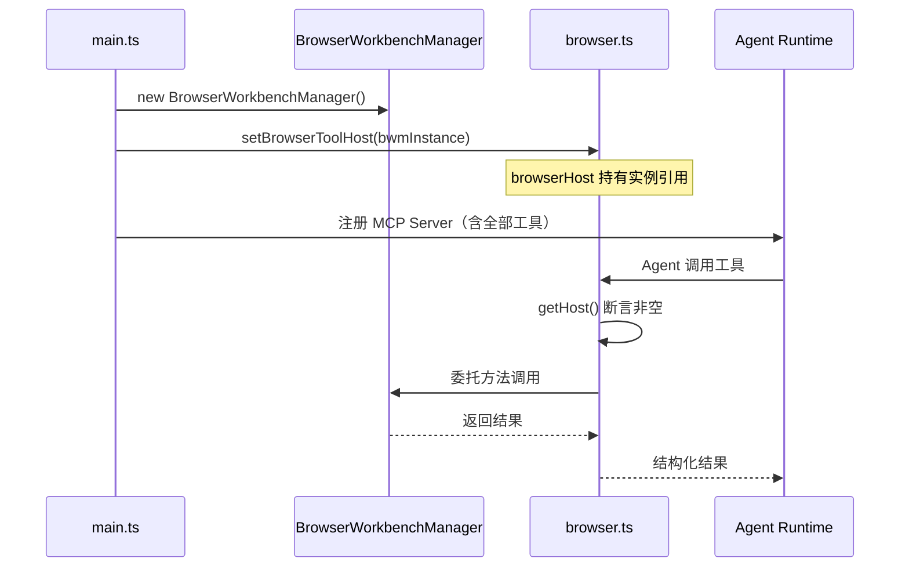

# 浏览器工作台

> 浏览器工作台是 tech-cc-hub 将 Electron BrowserView 的导航、截图、DOM 查询和元素交互能力封装为 MCP 工具的核心模块。它通过 `BrowserWorkbenchToolHost` 接口隔离 UI 组件，让 Agent 可以在不感知窗口生命周期的前提下操控浏览器。

<cite>

**本文引用的文件**

- [src/electron/libs/mcp-tools/browser.ts](file=src/electron/libs/mcp-tools/browser.ts#L1-L380)
- [src/electron/libs/mcp-tools/README.md](file=src/electron/libs/mcp-tools/README.md#L1-L23)
- [src/electron/libs/git/index.ts](file=src/electron/libs/git/index.ts#L1-L4)
- [src/electron/libs/skill-manager/index.ts](file=src/electron/libs/skill-manager/index.ts#L1-L88)
- [src/electron/libs/task/index.ts](file=src/electron/libs/task/index.ts#L1-L37)
- [src/electron/main.ts](file=src/electron/main.ts#L39-L120)
- [src/electron/libs/mcp-tools/admin.ts](file=src/electron/libs/mcp-tools/admin.ts#L1-L100)
- [src/electron/libs/mcp-tools/cron.ts](file=src/electron/libs/mcp-tools/cron.ts#L1-L222)
- [src/electron/libs/mcp-tools/design.ts](file=src/electron/libs/mcp-tools/design.ts#L1-L100)

</cite>

---

## 目录

- [职责边界](#职责边界)
- [核心类型定义](#核心类型定义)
- [工具清单与分类](#工具清单与分类)
- [初始化流程与 Host 注入](#初始化流程与-host-注入)
- [调用链与数据流](#调用链与数据流)
- [字段规范化与路径操作](#字段规范化与路径操作)
- [安全常量与限制](#安全常量与限制)
- [扩展点与定制方向](#扩展点与定制方向)
- [常见失败模式与排查](#常见失败模式与排查)
- [回归验证清单](#回归验证清单)

---

## 职责边界

浏览器工作台模块的职责是将右侧 BrowserView 的底层能力**选择性地暴露给 Agent**。它有两条硬性设计约束：

1. **不直接依赖 React UI**：只通过 `BrowserWorkbenchToolHost` 接口访问主进程维护的 BrowserView 实例。
2. **不返回大图或敏感数据**：截图以 data URL 或文件路径形式返回；console logs 有长度截断；凭证信息不出现在返回结构中。

> 章节来源：[browser.ts 第 1-3 行](file=src/electron/libs/mcp-tools/browser.ts#L1-L3)

---

## 核心类型定义

### BrowserWorkbenchToolHost

这是 MCP 工具与主进程之间的唯一桥梁。接口定义在 [browser.ts 第 88-168 行](file=src/electron/libs/mcp-tools/browser.ts#L88-L168)，包含 22 个方法，按功能分为 5 组：

| 方法分组 | 关键方法 | 返回类型 |
|---------|---------|---------|
| 导航控制 | `open`, `close`, `navigate`, `reload`, `goBack`, `goForward` | `BrowserWorkbenchState` |
| 截图与文件 | `captureVisible`, `saveScreenshot`, `savePdf`, `extractPageSnapshot` | `Promise<{ success, dataUrl?, path?, error? }>` |
| 元素交互 | `clickElement`, `fillElement`, `runElementAction`, `evaluateJavaScript` | `Promise<{ success, result?, error? }>` |
| DOM 查询 | `queryNodes`, `inspectStyles`, `inspectAtPoint`, `getDomStats` | `Promise<{ success, snapshot?, stats?, error? }>` |
| 键盘鼠标 | `sendKeyEvent`, `sendKeyboardText`, `sendMouseEvent`, `scrollPage` | 同步或 `Promise` 结果 |



> 图表来源：[browser.ts 第 88-168 行](file=src/electron/libs/mcp-tools/browser.ts#L88-L168)

---

## 工具清单与分类

`BROWSER_TOOL_NAMES` 常量（第 42-85 行）列出 43 个工具名称，分 6 大类：

### 1. 页面导航（6 个）
```
browser_open_page      → 打开 URL
browser_close_page      → 关闭标签
browser_navigate        → 跳转到 URL
browser_reload          → 刷新
browser_get_state       → 获取当前状态
browser_set_annotation_mode → 标注模式切换
```

### 2. 截图与导出（3 个）
```
browser_capture_visible → 当前视口截图（data URL）
browser_save_screenshot → 保存截图到文件
browser_save_pdf        → 导出 PDF
```

### 3. DOM 查询与快照（5 个）
```
browser_get_dom_stats      → 页面元素统计
browser_snapshot_interactive → 可交互元素快照
browser_query_nodes        → CSS/XPath/Ref 查询节点
browser_inspect_styles     → 查询 ComputedStyle
browser_get_element        → 获取元素属性信息
```

### 4. 元素操作（14 个）
覆盖点击、悬停、聚焦、输入、勾选、滚动等行为。策略参数支持 `auto`、`ref`、`selector`、`xpath`。

```
browser_click_element      browser_dblclick_element
browser_focus_element       browser_hover_element
browser_type_element        browser_fill_element
browser_select_element      browser_check_element
browser_uncheck_element     browser_scroll_into_view
```

### 5. 键盘与鼠标（4 个）
```
browser_press_key    browser_key_down/up
browser_keyboard_type, browser_keyboard_insert_text
browser_mouse        → 移动/点击/拖拽
browser_scroll_page  → 页面滚动
```

### 6. 网络与脚本（4 个）
```
http_ping            → HTTP 可达性检测
diagnose_port        → 本地端口诊断
bash_batch           → 批量 shell 命令
browser_eval         → 执行 JS 表达式
browser_wait_for     → 条件等待（load/selector/text/url/time/function）
```

> 章节来源：[browser.ts 第 42-85 行](file=src/electron/libs/mcp-tools/browser.ts#L42-L85)

---

## 初始化流程与 Host 注入

### 初始化时序



### 关键代码路径

**入口**：`setBrowserToolHost(host)` 定义于 [第 186-188 行](file=src/electron/libs/mcp-tools/browser.ts#L186-L188)。main.ts 在 BrowserWorkbenchManager 创建后立即调用（第 39 行），cleanup 时传 `null` 防止旧窗口残留。

**访问检查**：`getHost()` 定义于 [第 194-199 行](file=src/electron/libs/mcp-tools/browser.ts#L194-L199)。任何工具调用前都会先检查 `browserHost` 是否为空，为空则抛出 `Error("浏览器工作台尚未初始化，无法执行浏览器工具。")`。

**多会话支持**：`browserMcpServersBySessionId` Map（[第 183 行](file=src/electron/libs/mcp-tools/browser.ts#L183)）按会话 ID 管理 MCP 服务实例，允许同一进程内多个独立的浏览器工作台会话。

> 图表来源：[browser.ts 第 183, 186-199 行](file=src/electron/libs/mcp-tools/browser.ts#L183)

---

## 调用链与数据流

### 典型工具调用链

以 `browser_query_nodes` 为例：

```
Agent 调用 tool("browser_query_nodes", ...)
  → validate input against Zod schema
  → getHost().queryNodes(sessionId, input)
  → BrowserWorkbenchManager 内部执行 CDP 命令
  → 过滤字段（filterNodeQueryResult）
  → 格式化结果（toTextToolResult）
  → 返回给 Agent
```

### 输入参数结构（query_nodes 为例）

```typescript
{
  strategy?: "auto" | "ref" | "selector" | "xpath"  // 默认 auto
  query: string                                       // CSS selector / XPath / ref
  maxResults?: number                                 // 默认 80，最大 300
  includeStyles?: boolean                             // 是否包含 ComputedStyle
  styleProps?: string[]                               // 指定样式属性列表
}
```

### 返回结构

```typescript
{
  url: string
  title: string
  strategy: string
  query: string
  total: number
  returned: number
  matches?: Array<{
    index: number
    tagName?: string
    textContent?: string
    boundingBox?: { x, y, width, height }
    computedStyle?: Record<string, string>
    cssVariables?: Record<string, string>
    // ... 按 fields 参数过滤
  }>
}
```

> 章节来源：[browser.ts 第 152-158 行](file=src/electron/libs/mcp-tools/browser.ts#L152-L158)

---

## 字段规范化与路径操作

### normalizeFieldParts

将字段路径字符串（如 `"node.computedStyle.fontSize"`）切分为数组，并做别名展开：

| 输入 | 输出 |
|------|------|
| `box` | `["boundingBox"]` |
| `computed` | `["computedStyle"]` |
| `vars` | `["cssVariables"]` |
| `node.boundingBox` | `["node", "boundingBox"]` |

别名表定义于 [第 203-212 行](file=src/electron/libs/mcp-tools/browser.ts#L203-L212)。

### getPathValue / setPathValue

递归访问和写入嵌套 JSON 路径，处理数组展平：

```typescript
// 读取
getPathValue(result, ["matches", "0", "computedStyle", "fontSize"])
// 写入
setPathValue(target, ["node", "inlineStyle", "color"], "red")
```

### 字段过滤函数

| 函数 | 用途 | 输入限制 |
|------|------|---------|
| `filterNodeQueryResult` | 按 fields 参数过滤 query_nodes 结果 | 字段白名单 |
| `filterStyleInspection` | 按 fields 参数过滤 inspect_styles 结果 | 字段白名单 |
| `normalizeFields` | 去重+去空格 | 任意字段列表 |

> 章节来源：[browser.ts 第 225-353 行](file=src/electron/libs/mcp-tools/browser.ts#L225-L353)

---

## 安全常量与限制

以下是模块内的硬性上限，用于防止 Agent 误用或恶意请求：

| 常量 | 默认值 | 最大值 | 用途 |
|------|--------|--------|------|
| `MAX_CAPTURE_SNIPPET` | 4096 | - | 截图摘要字符数 |
| `DEFAULT_HTTP_PING_TIMEOUT_MS` | 3000 | 15000 | HTTP 检测超时 |
| `DEFAULT_CONSOLE_WAIT_TIMEOUT_MS` | 10000 | 60000 | 控制台日志等待超时 |
| `CONSOLE_WAIT_INTERVAL_MS` | 150 | - | 轮询间隔 |
| `MAX_BATCH_COMMANDS` | 20 | - | bash_batch 最大命令数 |
| `DEFAULT_BATCH_COMMAND_TIMEOUT_MS` | 30000 | 120000 | 批量命令总超时 |

`clampInteger`（[第 355-361 行](file=src/electron/libs/mcp-tools/browser.ts#L355-L361)）和 `clampDuration`（[第 363-369 行](file=src/electron/libs/mcp-tools/browser.ts#L363-L369)）用于在工具层做边界约束。

> 章节来源：[browser.ts 第 172-180 行](file=src/electron/libs/mcp-tools/browser.ts#L172-L180)

---

## 扩展点与定制方向

### 新增工具

1. 在 `BROWSER_TOOL_NAMES` 数组末尾追加工具名称
2. 在 `createSdkMcpServer` 的 tools 参数中添加对应 handler
3. 如需新 Host 方法，在 `BrowserWorkbenchToolHost` 接口中声明

### 新增查询策略

在 `BrowserWorkbenchQueryStrategy` 类型中扩展策略标识，`queryNodes` 方法自动支持。

### 调整超时限制

修改对应常量后，需同步更新 Zod schema 中的 `.min()/.max()` 约束（如果有）。

### 与设计工具联动

`design.ts`（[第 111-121 行](file=src/electron/libs/mcp-tools/design.ts#L111-L121)）复用了 `captureVisible` 方法。修改 BrowserView 截图逻辑时需注意对 design 工具的影响。

> 章节来源：[browser.ts 第 42-85, 88-168 行](file=src/electron/libs/mcp-tools/browser.ts#L42-L85)

---

## 常见失败模式与排查

### 1. "浏览器工作台尚未初始化"

**原因**：`setBrowserToolHost` 未被调用，或 cleanup 时传了 `null`。

**排查步骤**：
1. 检查 main.ts 是否在 BrowserWorkbenchManager 创建后调用了 `setBrowserToolHost`
2. 检查是否有 cleanup 逻辑错误传入了 `null`
3. 确认会话 ID 有效（针对多会话场景）

### 2. 截图返回 `success: false`

**常见原因**：
- BrowserView 未就绪（页面还在加载）
- URL 是 `file://` 协议（可能受限）
- 截图格式参数无效

**排查步骤**：
1. 先调用 `browser_get_state` 确认 URL 和 title
2. 检查 `browser_wait_for` 使用 `"load"` 条件等待页面完成
3. 验证 `saveScreenshot` 的 `format` 参数是否为 `"png"` 或 `"jpeg"`

### 3. query_nodes 无匹配结果

**常见原因**：
- 策略选择不当（`auto` 可能在某些页面失效）
- selector 语法与目标页面不匹配
- 页面有 Shadow DOM（需要 `ref` 策略）

**排查步骤**：
1. 用 `browser_snapshot_interactive` 获取可交互元素列表
2. 尝试 `strategy: "ref"` 配合已知元素索引
3. 检查 `maxResults` 是否过小导致漏掉目标

### 4. 工具调用超时

**原因**：网络诊断类工具（`http_ping`, `diagnose_port`, `bash_batch`）有自己的超时限制。

**解决方案**：参考 [安全常量与限制](#安全常量与限制) 表格，确认请求参数未超过最大值。

> 章节来源：[browser.ts 第 194-199, 371-380 行](file=src/electron/libs/mcp-tools/browser.ts#L194-L199)

---

## 回归验证清单

### 必测场景

| 场景 | 预期结果 |
|------|---------|
| 调用工具前未初始化 | 抛出 "浏览器工作台尚未初始化" 错误 |
| `browser_open_page` 打开有效 URL | 返回 success: true，state.url 匹配 |
| `browser_navigate` 到新页面 | state.url 和 state.title 更新 |
| `browser_capture_visible` | 返回 data URL 或文件路径，格式正确 |
| `browser_query_nodes` 按 CSS 查询 | matches 数组非空，字段按 fields 过滤 |
| `browser_inspect_styles` 查询样式 | 返回 computedStyle 和 cssVariables |
| `browser_fill_element` 输入文本 | 元素 value 属性更新 |
| `browser_wait_for` 条件满足 | Promise resolve，返回 success: true |
| `bash_batch` 执行 20+ 命令 | 返回错误 "MAX_BATCH_COMMANDS exceeded" |
| 多会话隔离 | 各 sessionId 独立，tool host 正确路由 |

### 冒烟测试命令（开发者控制台）

```javascript
// 验证工具注册
const toolNames = [
  "browser_open_page",
  "browser_capture_visible",
  "browser_query_nodes",
  "browser_inspect_styles",
  "http_ping"
];
// 逐个调用，确认无报错
```

---

## 关联文档

| 文档 | 说明 |
|------|------|
| [MCP 工具目录](../mcp-tools/README.md) | 同目录下其他工具（admin、cron、design）的设计约束 |
| [browser-manager.ts](../browser-manager.md) | BrowserWorkbenchManager 完整实现 |
| [设计还原工具](./design.md) | 与 browser.ts 共享截图能力的下游模块 |
| [electron-ipc 规范](../40-engineering/electron-ipc/spec.md) | 主进程与渲染进程的 IPC 通信规范 |

---

*最后更新：2024-12*  
*维护者：Frontend Platform Team*