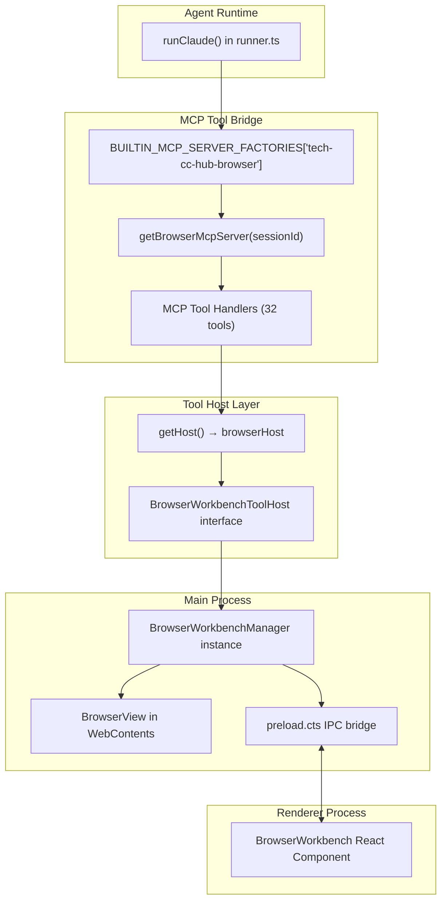

# 浏览器工作台

<cite>

**本文引用的文件**

- [src/electron/libs/mcp-tools/browser.ts](file://src/electron/libs/mcp-tools/browser.ts)
- [src/shared/builtin-mcp-registry.ts](file://src/shared/builtin-mcp-registry.ts)
- [src/electron/libs/builtin-mcp-servers.ts](file://src/electron/libs/builtin-mcp-servers.ts)
- [src/electron/libs/mcp-tools/knowledge.ts](file://src/electron/libs/mcp-tools/knowledge.ts)
- [src/electron/libs/mcp-tools/plan.ts](file://src/electron/libs/mcp-tools/plan.ts)
- [src/electron/libs/mcp-tools/cron.ts](file://src/electron/libs/mcp-tools/cron.ts)
- [src/electron/libs/mcp-tools/admin.ts](file://src/electron/libs/mcp-tools/admin.ts)
- [src/electron/libs/mcp-tools/tool-result.ts](file://src/electron/libs/mcp-tools/tool-result.ts)
- [src/electron/libs/runner.ts](file://src/electron/libs/runner.ts)
- [src/electron/libs/runner-reuse.ts](file://src/electron/libs/runner-reuse.ts)
- [src/electron/libs/system-prompt-presets.ts](file://src/electron/libs/system-prompt-presets.ts)
- [src/ui/components/settings/McpSettingsPage.tsx](file://src/ui/components/settings/McpSettingsPage.tsx)
- [test/electron/builtin-mcp-registry.test.ts](file://test/electron/builtin-mcp-registry.test.ts)
- [src/electron/main.ts](file://src/electron/main.ts)
- [src/electron/preload.cts](file://src/electron/preload.cts)
- [src/electron/libs/mcp-tools/figma-rest.ts](file://src/electron/libs/mcp-tools/figma-rest.ts)
- [src/electron/libs/mcp-tools/idea.ts](file://src/electron/libs/mcp-tools/idea.ts)
- [src/electron/libs/mcp-tools/README.md](file://src/electron/libs/mcp-tools/README.md)

</cite>

---

## 目录

- [职责定位](#职责定位)
- [入口与初始化](#入口与初始化)
- [核心接口 BrowserWorkbenchToolHost](#核心接口-browserworkbenchtoolhost)
- [MCP 工具清单与分类](#mcp-工具清单与分类)
- [调用链路与数据流](#调用链路与数据流)
- [前后端桥接点](#前后端桥接点)
- [运行时状态与生命周期](#运行时状态与生命周期)
- [常见失败模式](#常见失败模式)
- [扩展点与变更注意事项](#扩展点与变更注意事项)
- [Agent 改代码地图](#agent-改代码地图)
- [回归验证方式](#回归验证方式)

---

## 职责定位

浏览器工作台（Browser Workbench）是 tech-cc-hub 右侧面板的 BrowserView 自动化能力抽象层。它的核心职责：

1. **隔离 UI 与工具层**：MCP 工具通过 `BrowserWorkbenchToolHost` 接口访问 BrowserView，不直接依赖 React 组件。
2. **统一工具命名空间**：所有浏览器相关能力以 `mcp__tech-cc-hub-browser__*` 格式暴露给 Agent。
3. **会话级隔离**：`browserMcpServersBySessionId` Map 确保不同会话使用独立的 MCP 服务实例。

> 章节来源：[browser.ts#L1-L3](file://src/electron/libs/mcp-tools/browser.ts#L1-L3)

---

## 入口与初始化

### 模块导出

| 符号 | 文件位置 | 用途 |
|------|----------|------|
| `setBrowserToolHost` | browser.ts:186 | main.ts 调用，注入 BrowserWorkbenchToolHost 实例 |
| `getBrowserMcpServer` | browser.ts:内部 | 根据 sessionId 返回或创建 MCP 服务实例 |
| `BROWSER_TOOL_NAMES` | browser.ts:42-85 | 32 个工具名的只读数组 |
| `getBrowserToolNames` | browser.ts:189 | 工具名列表（向后兼容） |

### main.ts 初始化顺序

```typescript
// main.ts 行 39：导入
import { setBrowserToolHost } from "./libs/mcp-tools/browser.js";

// main.ts 行 73：导入 BrowserWorkbenchManager
import { BrowserWorkbenchManager } from "./browser-manager.js";

// main.ts 行 115：会话级 BrowserWorkbenchManager Map
const browserWorkbenches = new Map<string, BrowserWorkbenchManager>();

// 初始化时创建 global session 的 manager
const globalManager = new BrowserWorkbenchManager(DEFAULT_BROWSER_WORKBENCH_SESSION_ID);
browserWorkbenches.set(DEFAULT_BROWSER_WORKBENCH_SESSION_ID, globalManager);
setBrowserToolHost(globalManager); // 注入 host
```

> 章节来源：[main.ts#L39](file://src/electron/main.ts#L39)、[main.ts#L100](file://src/electron/main.ts#L100)、[main.ts#L115](file://src/electron/main.ts#L115)

---

## 核心接口 BrowserWorkbenchToolHost

`BrowserWorkbenchToolHost` 是工具层与 BrowserView 之间的协议契约，定义在 browser.ts:88-168：

```typescript
export type BrowserWorkbenchToolHost = {
  // 页面生命周期
  open: (sessionId: string, url: string) => BrowserWorkbenchState;
  close: (sessionId: string) => BrowserWorkbenchState;
  reload: (sessionId: string) => BrowserWorkbenchState;
  goBack: (sessionId: string) => BrowserWorkbenchState;
  goForward: (sessionId: string) => BrowserWorkbenchState;
  getState: (sessionId: string) => BrowserWorkbenchState;

  // 页面读取
  extractPageSnapshot: (sessionId: string) => Promise<...>;
  captureVisible: (sessionId: string) => Promise<{ dataUrl?: string }>;
  getConsoleLogs: (sessionId: string, limit?: number) => BrowserWorkbenchConsoleLog[];
  getDomStats: (sessionId: string) => Promise<...>;

  // 元素交互
  clickElement: (sessionId: string, input: {...}) => Promise<...>;
  runElementAction: (sessionId: string, input: {...}) => Promise<...>;
  fillElement: (sessionId: string, input: {...}) => Promise<...>;
  getElementInfo: (sessionId: string, input: {...}) => Promise<...>;

  // 键盘鼠标
  pressKey: (sessionId: string, key: string) => {...};
  sendMouseEvent: (sessionId: string, input: BrowserWorkbenchMouseInput) => BrowserWorkbenchMouseResult;

  // 样式与标注
  queryNodes: (sessionId: string, input: {...}) => Promise<...>;
  inspectStyles: (sessionId: string, input: {...}) => Promise<...>;
  applyStyles: (sessionId: string, input: {...}) => Promise<...>;
  setAnnotationMode: (sessionId: string, enabled: boolean) => Promise<BrowserWorkbenchState>;

  // 持久化
  saveScreenshot: (sessionId: string, input: {...}) => Promise<...>;
  savePdf: (sessionId: string, input: {...}) => Promise<...>;
  manageCookies: (sessionId: string, input: {...}) => Promise<...>;
  manageStorage: (sessionId: string, input: {...}) => Promise<...>;
};
```

> 章节来源：[browser.ts#L88-168](file://src/electron/libs/mcp-tools/browser.ts#L88-168)

### Host 访问守卫

```typescript
function getHost(): BrowserWorkbenchToolHost {
  if (!browserHost) {
    throw new Error("浏览器工作台尚未初始化，无法执行浏览器工具。");
  }
  return browserHost;
}
```

所有工具 handler 都通过 `getHost()` 获取实际 host，确保在未初始化时给出明确错误。

> 章节来源：[browser.ts#L194-199](file://src/electron/libs/mcp-tools/browser.ts#L194-199)

---

## MCP 工具清单与分类

### 工具名常量 BROWSER_TOOL_NAMES

定义于 browser.ts:42-85，共 32 个工具，分 4 大类：

| 工具组 | 工具名 | 核心功能 |
|--------|--------|----------|
| **导航与状态** | `browser_open_page`, `browser_close_page`, `browser_get_state`, `browser_navigate`, `browser_reload`, `browser_wait_for` | 页面生命周期控制 |
| **读取与诊断** | `browser_extract_page`, `browser_get_element`, `browser_get_dom_stats`, `browser_snapshot_interactive`, `browser_query_nodes`, `browser_inspect_styles`, `browser_inspect_at_point`, `browser_console_logs`, `browser_eval`, `http_ping`, `diagnose_port`, `bash_batch` | 页面内容采集 |
| **元素交互** | `browser_click_element`, `browser_dblclick_element`, `browser_focus_element`, `browser_hover_element`, `browser_type_element`, `browser_fill_element`, `browser_select_element`, `browser_check_element`, `browser_uncheck_element`, `browser_scroll_into_view` | DOM 操作 |
| **键鼠与截图** | `browser_press_key`, `browser_key_down`, `browser_key_up`, `browser_keyboard_type`, `browser_keyboard_insert_text`, `browser_mouse`, `browser_scroll_page`, `browser_capture_visible`, `browser_save_screenshot`, `browser_save_pdf`, `browser_cookies`, `browser_storage`, `browser_set_annotation_mode` | 输入与持久化 |

> 章节来源：[browser.ts#L42-85](file://src/electron/libs/mcp-tools/browser.ts#L42-85)

### 工具 Schema 示例

以 `browser_navigate` 为例：

```typescript
tool(
  "browser_navigate",
  "Go back or forward in browser history.",
  {
    direction: z.enum(["back", "forward"]).describe("Navigation direction"),
    sessionId: z.string().optional().describe("Target session ID"),
  },
  async (input) => {
    const host = getHost();
    const sessionId = input.sessionId ?? "global";
    const method = input.direction === "back" ? host.goBack : host.goForward;
    const state = method(sessionId);
    return toTextToolResult({ success: true, state });
  }
);
```

> 章节来源：[browser.ts 导航工具定义段](file://src/electron/libs/mcp-tools/browser.ts)

---

## 调用链路与数据流



### 关键路径

1. **工具发现**：runner.ts 调用 `getBuiltinMcpServers(context, enabledNames)` → builtin-mcp-servers.ts → 路由到 `getBrowserMcpServer`
2. **Host 注入**：main.ts 创建 `BrowserWorkbenchManager` 后调用 `setBrowserToolHost(manager)`
3. **工具执行**：Agent 调用 `mcp__tech-cc-hub-browser__browser_xxx` → handler 调用 `getHost().method(sessionId, input)`
4. **Cleanup**：窗口销毁时 `setBrowserToolHost(null)`，后续工具调用抛出 "浏览器工作台尚未初始化"

> 图表来源：[browser.ts 整体结构](file://src/electron/libs/mcp-tools/browser.ts)、[builtin-mcp-servers.ts 路由逻辑](file://src/electron/libs/builtin-mcp-servers.ts#L23-L24)、[main.ts 初始化](file://src/electron/main.ts#L39-L115)

---

## 前后端桥接点

### IPC Channels（preload.cts 暴露）

| Channel | 方向 | 用途 |
|---------|------|------|
| `browser-open` | renderer → main | 打开指定 URL |
| `browser-close` | renderer → main | 关闭页面 |
| `browser-set-bounds` | renderer → main | 设置 BrowserView 尺寸 |
| `browser-state` | renderer → main | 获取当前状态 |
| `browser-capture-visible` | renderer → main | 截图返回 dataURL |
| `browser-inspect-at-point` | renderer → main | 坐标反查 DOM |

> 章节来源：[preload.cts#L130-153](file://src/electron/preload.cts#L130-153)

### System Prompt 提示词

`buildBrowserWorkbenchPromptAppend()` 在 system-prompt-presets.ts:12-18 生成工具使用引导：

```typescript
export function buildBrowserWorkbenchPromptAppend(): string {
  return [
    "BrowserView rule: for current-page browsing, scraping, debugging, annotations, screenshots, cookies, storage, console logs, URL checks, and DOM inspection, use the built-in tech-cc-hub browser MCP tools instead of external browser skills.",
    "Use focused browser helpers when possible: http_ping/diagnose_port for service checks, browser_console_logs(waitFor) for HMR/build waits, browser_query_nodes/browser_get_element/browser_inspect_styles for DOM/style evidence...",
  ].join("\n");
}
```

> 章节来源：[system-prompt-presets.ts#L12-18](file://src/electron/libs/system-prompt-presets.ts#L12-18)

---

## 运行时状态与生命周期

### 全局变量

```typescript
// browser.ts:182-183
let browserHost: BrowserWorkbenchToolHost | null = null;
const browserMcpServersBySessionId = new Map<string, McpSdkServerConfigWithInstance>();
```

### 会话隔离机制

- `browserMcpServersBySessionId` Map：每个 sessionId 独立缓存 MCP 服务实例
- 同一 session 多次调用 `getBrowserMcpServer` 返回相同实例
- 不同 session 有独立的 tool host context

> 章节来源：[browser.ts#L182-183](file://src/electron/libs/mcp-tools/browser.ts#L182-183)

### Host 生命周期

```
main.ts 启动
  ↓
new BrowserWorkbenchManager(sessionId) + setBrowserToolHost(host)
  ↓
Agent 可调用浏览器工具
  ↓
窗口关闭 / session 清理
  ↓
setBrowserToolHost(null) ← host 被置空
  ↓
后续工具调用抛出错误 → "浏览器工作台尚未初始化"
```

> 章节来源：[main.ts 初始化与 cleanup 逻辑](file://src/electron/main.ts)

---

## 常见失败模式

### 1. Host 未初始化

**症状**：`"浏览器工作台尚未初始化，无法执行浏览器工具。"`

**原因**：`setBrowserToolHost` 未被调用（main.ts 初始化顺序问题）或已被传入 null（窗口已关闭）。

**排查步骤**：
1. 检查 main.ts 中 `setBrowserToolHost` 调用位置是否在 BrowserWorkbenchManager 创建之后
2. 确认 session 是否已 cleanup

### 2. Session ID 不匹配

**症状**：工具执行成功但页面状态不符合预期。

**原因**：`browserMcpServersBySessionId` 中不同 session 有不同 host context，但 Agent 可能传错 sessionId。

**排查步骤**：
1. 检查工具调用的 `sessionId` 参数
2. 确认使用的是 `"global"` 还是实际 sessionId

### 3. MCP 服务未注册

**症状**：`mcp__tech-cc-hub-browser__xxx` 工具不可用。

**原因**：`tech-cc-hub-browser` 未在 `BUILTIN_MCP_SERVER_FACTORIES` 中注册，或 `enabledNames` 过滤掉了该服务器。

**排查步骤**：
1. 检查 builtin-mcp-servers.ts:23-24 的工厂映射
2. 检查 runner 调用 `getBuiltinMcpServers` 时的 `enabledServerNames` 参数

### 4. 浏览器进程崩溃

**症状**：`browser_get_state` 返回异常或 promise reject。

**原因**：BrowserView 对应的 WebContents 被销毁或崩溃。

**排查步骤**：
1. 检查 BrowserWorkbenchManager 的 error handler
2. 查看主进程日志是否有 WebContents 崩溃记录

> 章节来源：[browser.ts#L194-199](file://src/electron/libs/mcp-tools/browser.ts#L194-199)、[builtin-mcp-servers.ts#L23-32](file://src/electron/libs/builtin-mcp-servers.ts#L23-32)

---

## 扩展点与变更注意事项

### 添加新工具

1. 在 `BROWSER_TOOL_NAMES` 数组末尾添加工具名
2. 定义 Zod schema
3. 使用 `tool()` 创建 handler，通过 `getHost()` 调用 host 方法
4. 在 builtin-mcp-registry.ts 的 `toolGroups` 中添加描述

### Host 接口变更

如果 `BrowserWorkbenchToolHost` 接口新增方法，需要同步修改：
1. `BrowserWorkbenchManager` 实现该方法
2. 所有调用 `getHost()` 的 handler 更新
3. 测试覆盖

### 新增诊断工具示例

```typescript
// 在 browser.ts 添加
const DIAGNOSE_SCHEMA = {
  url: z.string().url().describe("Target URL"),
  sessionId: z.string().optional(),
};

// 在工具定义区域添加
tool(
  "diagnose_network",
  "Diagnose network request timing for the given URL.",
  DIAGNOSE_SCHEMA,
  async (input) => {
    const host = getHost();
    // 调用 host 方法
    return toTextToolResult({ success: true });
  }
);
```

> 章节来源：[browser.ts 工具定义模式](file://src/electron/libs/mcp-tools/browser.ts)、[builtin-mcp-registry.ts 工具注册](file://src/shared/builtin-mcp-registry.ts#L64-126)

---

## Agent 改代码地图

### 先读文件

| 优先级 | 文件 | 读哪几行 | 为什么读 |
|--------|------|----------|----------|
| 1 | browser.ts | 42-85, 88-168, 186-199 | 工具名常量、Host 接口、访问守卫 |
| 2 | builtin-mcp-servers.ts | 23-32, 34-43 | 工厂映射、工具名数组 |
| 3 | builtin-mcp-registry.ts | 52-128 | 服务器元数据、UI 设置页展示 |
| 4 | system-prompt-presets.ts | 12-18 | Agent 提示词引导 |
| 5 | runner.ts | 828-873 | 工具白名单过滤逻辑 |
| 6 | runner-reuse.ts | 51-74, 107-118 | 复用 Key 的 builtinMcpServers 字段 |

> 章节来源：[browser.ts 核心符号位置](file://src/electron/libs/mcp-tools/browser.ts#L42-L199)、[builtin-mcp-servers.ts 路由](file://src/electron/libs/builtin-mcp-servers.ts#L23-L43)

### 关键符号速查

| 符号 | 文件:行 | 类型 | 用途 |
|------|---------|------|------|
| `BROWSER_TOOL_NAMES` | browser.ts:42 | const readonly array | 32 个工具名 |
| `BrowserWorkbenchToolHost` | browser.ts:88 | type | Host 接口契约 |
| `setBrowserToolHost` | browser.ts:186 | function | 注入点（main.ts 调用） |
| `getHost` | browser.ts:194 | function | 访问守卫（内部使用） |
| `getBrowserMcpServer` | browser.ts 内部 | function | session 级 MCP 服务工厂 |
| `BUILTIN_MCP_SERVER_FACTORIES` | builtin-mcp-servers.ts:23 | Record | 服务器名→工厂函数映射 |
| `BUILTIN_MCP_TOOL_NAMES` | builtin-mcp-servers.ts:34 | Record | 服务器名→工具名数组映射 |
| `"tech-cc-hub-browser"` | builtin-mcp-registry.ts:2 | string literal | 服务器唯一标识 |
| `buildBrowserWorkbenchPromptAppend` | system-prompt-presets.ts:12 | function | Agent 系统提示词 |
| `browserWorkbenches` | main.ts:115 | Map | session→Manager 实例 |

> 章节来源：[browser.ts 导出符号](file://src/electron/libs/mcp-tools/browser.ts)、[builtin-mcp-servers.ts 导出符号](file://src/electron/libs/builtin-mcp-servers.ts)

### 修改入口

#### 添加新工具

```typescript
// 1. browser.ts: 在 BROWSER_TOOL_NAMES 添加工具名
export const BROWSER_TOOL_NAMES = [
  // ... 已有工具
  "browser_new_tool",  // ← 新增
] as const;

// 2. browser.ts: 定义 schema 和 handler
const NEW_TOOL_SCHEMA = { /* Zod schema */ };

tool(
  "browser_new_tool",
  "工具描述",
  NEW_TOOL_SCHEMA,
  async (input) => {
    const host = getHost();
    // 调用 host 方法
    return toTextToolResult({ success: true });
  }
);

// 3. browser.ts: 在 getBrowserMcpServer 的 tools 数组中添加

// 4. builtin-mcp-registry.ts: 在 toolGroups 中添加元数据
{
  name: "browser_new_tool",
  description: "工具描述"
}

// 5. McpSettingsPage.tsx: 在 BUILTIN_TOOL_GROUPS 中添加 UI 展示
```

#### 修改 Host 接口

```typescript
// 1. browser.ts: BrowserWorkbenchToolHost 新增方法
export type BrowserWorkbenchToolHost = {
  // ... 已有方法
  newMethod: (sessionId: string, input: NewInput) => Promise<NewResult>;  // ← 新增
};

// 2. BrowserWorkbenchManager: 实现该方法
// 3. 所有调用 getHost() 的 handler 更新
```

### 验证命令

```bash
# 1. TypeScript 编译检查
npx tsc --noEmit src/electron/libs/mcp-tools/browser.ts

# 2. 运行 builtin MCP registry 测试
npx vitest run test/electron/builtin-mcp-registry.test.ts

# 3. 检查工具名唯一性
node -e "
  const { BUILTIN_MCP_TOOL_NAMES } = require('./dist/electron/libs/builtin-mcp-servers.js');
  const names = Object.values(BUILTIN_MCP_TOOL_NAMES).flat();
  const unique = new Set(names);
  console.log('Total tools:', names.length, 'Unique:', unique.size);
  if (names.length !== unique.size) console.error('DUPLICATE FOUND');
"

# 4. 手动端到端验证（Electron 开发模式）
npm run dev
# 打开 DevTools → Console
# 输入: window.electron.openBrowserWorkbench('https://example.com')
# 检查右侧面板是否加载页面
```

> 章节来源：[browser.ts 整体结构](file://src/electron/libs/mcp-tools/browser.ts)、[test/builtin-mcp-registry.test.ts](file://test/electron/builtin-mcp-registry.test.ts)

### 常见回归风险

| 风险 | 触发条件 | 预防 |
|------|----------|------|
| 工具名重复 | 在 BROWSER_TOOL_NAMES 添加已存在的工具名 | 运行工具名唯一性检查 |
| Host 未注入 | setBrowserToolHost 调用位置错误 | 检查 main.ts 初始化顺序 |
| Schema 不兼容 | 修改工具参数但 Agent 仍用旧参数调用 | 更新 registry 元数据，保持向后兼容 |
| Session 隔离失效 | 多个 session 共用同一个 MCP 服务实例 | 确认 browserMcpServersBySessionId 正确按 sessionId 隔离 |
| Prompt 提示词过时 | 添加新工具但 system-prompt-presets.ts 未更新 | 新工具加入后同步更新 prompt 引导 |

> 章节来源：[browser.ts#L182-183](file://src/electron/libs/mcp-tools/browser.ts#L182-183)、[system-prompt-presets.ts#L12-18](file://src/electron/libs/system-prompt-presets.ts#L12-18)

---

## 回归验证方式

### 单元测试

**工具名唯一性测试**：

```typescript
// test/electron/builtin-mcp-registry.test.ts 已有
test("built-in MCP registry tool names stay unique", () => {
  const toolNames = listBuiltinMcpToolNames();
  const uniqueToolNames = new Set(toolNames);
  assert.equal(uniqueToolNames.size, toolNames.length);
});
```

> 章节来源：[test/electron/builtin-mcp-registry.test.ts#L29-34](file://test/electron/builtin-mcp-registry.test.ts#L29-34)

**工具元数据完整性测试**：

```typescript
test("built-in MCP registry contains displayable tool metadata", () => {
  for (const server of BUILTIN_MCP_SERVERS) {
    assert.ok(server.description.trim(), `${server.name} needs a description`);
    assert.ok(server.highlights.length > 0, `${server.name} needs highlights`);
    assert.ok(server.toolGroups.length > 0, `${server.name} needs at least one tool group`);
  }
});
```

> 章节来源：[test/electron/builtin-mcp-registry.test.ts#L20-26](file://test/electron/builtin-mcp-registry.test.ts#L20-26)

### 集成验证检查清单

1. **工具发现**：Agent 调用 `tools/list` 时返回 `tech-cc-hub-browser` 服务器下的 32 个工具
2. **工具执行**：`browser_open_page` → 右侧面板加载 URL → `browser_get_state` 返回正确 URL
3. **Host 访问**：窗口关闭后调用工具 → 抛出 "浏览器工作台尚未初始化"
4. **Session 隔离**：会话 A 的 browser 状态不影响会话 B
5. **UI 一致性**：McpSettingsPage.tsx 展示的工具列表与 `BROWSER_TOOL_NAMES` 一致

### 手工回归测试步骤

```
1. 启动 Electron 应用
2. 新建会话 → 右侧面板加载空白页
3. 在输入框输入：打开 https://example.com
4. Agent 调用 browser_open_page → 页面加载
5. 输入：截图保存
6. Agent 调用 browser_save_screenshot → 文件生成
7. 关闭会话 → 重新打开新会话
8. 输入：获取页面状态
9. 验证：新会话不会复用旧会话的浏览器状态
```

> 章节来源：[McpSettingsPage.tsx 工具分组定义](file://src/ui/components/settings/McpSettingsPage.tsx#L68-140)、[builtin-mcp-registry.ts 工具元数据](file://src/shared/builtin-mcp-registry.ts#L52-128)

---

## 参考与引用

| 文档 | 路径 | 用途 |
|------|------|------|
| MCP 工具目录说明 | [src/electron/libs/mcp-tools/README.md](file://src/electron/libs/mcp-tools/README.md) | 模块设计原则 |
| MCP 注册表规范 | [doc/20-contracts/MCP 规范相关章节](file://doc/) | 工具注册契约 |
| 设计还原规范 | [doc/40-engineering/preview-workbench/spec.md](file://doc/40-engineering/preview-workbench/spec.md) | BrowserView 与设计工具联动 |
| Electron IPC 规范 | [doc/40-engineering/electron-ipc/spec.md](file://doc/40-engineering/electron-ipc/spec.md) | 前后端通信协议 |
| 浏览器工作台开发计划 | [doc/40-product/1.0.0/70-browser-workbench-dev-plan.md](file://doc/40-product/1.0.0/70-browser-workbench-dev-plan.md) | 功能规划与路线图 |