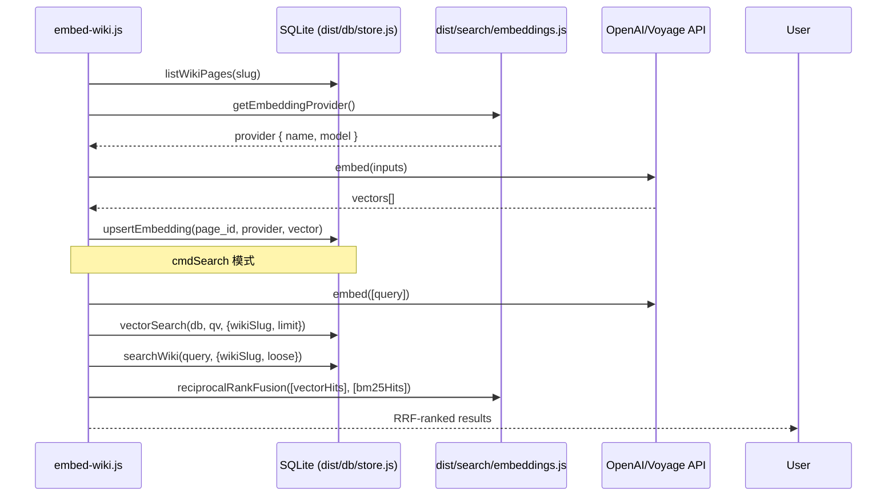

# Pro Workflow 自动化总览

<cite>
**本文引用的文件**
- [pro-workflow/README.md](file://pro-workflow/README.md)
- [pro-workflow/package.json](file://pro-workflow/package.json)
- [pro-workflow/scripts/commit-validate.js](file://pro-workflow/scripts/commit-validate.js)
- [pro-workflow/scripts/config-watcher.js](file://pro-workflow/scripts/config-watcher.js)
- [pro-workflow/scripts/cwd-changed.js](file://pro-workflow/scripts/cwd-changed.js)
- [pro-workflow/scripts/drift-detector.js](file://pro-workflow/scripts/drift-detector.js)
- [pro-workflow/scripts/embed-wiki.js](file://pro-workflow/scripts/embed-wiki.js)
- [pro-workflow/scripts/file-changed.js](file://pro-workflow/scripts/file-changed.js)
- [pro-workflow/config.json](file://pro-workflow/config.json)
- [pro-workflow/tsconfig.json](file://pro-workflow/tsconfig.json)
- [pro-workflow/mcp-config.example.json](file://pro-workflow/mcp-config.example.json)
- [pro-workflow/package-lock.json](file://pro-workflow/package-lock.json)
- [pro-workflow/settings.example.json](file://pro-workflow/settings.example.json)
- [pro-workflow/scripts/research-tick.js](file://pro-workflow/scripts/research-tick.js)
</cite>

---

## 目录

- [模块定位与核心职责](#模块定位与核心职责)
- [入口文件与事件触发链](#入口文件与事件触发链)
- [核心脚本协作图](#核心脚本协作图)
- [数据结构与 SQLite 存储](#数据结构与-sqlite-存储)
- [配置系统](#配置系统)
- [质量门禁体系](#质量门禁体系)
- [知识平面与 Research Loop](#知识平面与-research-loop)
- [扩展点与插件机制](#扩展点与插件机制)
- [常见改造路径](#常见改造路径)
- [验证与排障命令](#验证与排障命令)
- [Agent 改代码地图](#agent-改代码地图)

---

## 模块定位与核心职责

`module-pro-workflow` 是 `tech-cc-hub` 中负责 **AI 编程助手的自进化与质量保障** 的核心模块。它通过三个平面实现价值：

1. **自纠正记忆平面** — 将每次人工纠正持久化为可检索规则，Claude 永不再犯
2. **知识平面** — FTS5 索引的研究维基，支持 BM25 + 向量混合检索
3. **质量门禁平面** — LLM 驱动的 Hook、Git 守卫、上下文压缩感知

> 章节来源：[pro-workflow/README.md#L30-L38](file://pro-workflow/README.md#L30-L38)

### 技能体系概览

| 技能类别 | 代表技能 | 核心功能 |
|---------|---------|---------|
| **知识平面** | `wiki-builder`, `wiki-query`, `wiki-research-loop` | FTS5 索引、BM25 检索、自动研究 |
| **质量门禁** | `smart-commit`, `llm-gate`, `compact-guard` | Conventional Commits、AI 审核、状态保留 |
| **记忆学习** | `learn-rule`, `replay-learnings`, `wrap-up` | 纠正捕获、会话回顾 |
| **编排工程** | `orchestrate`, `agent-teams`, `parallel-worktrees` | 多阶段开发、并行工作树 |

> 章节来源：[pro-workflow/README.md#L163-L218](file://pro-workflow/README.md#L163-L218)

---

## 入口文件与事件触发链

Pro Workflow 的自动化由 **24 个 Hook 事件** 驱动，每个事件对应一个 `scripts/` 下的脚本。

### 核心脚本入口矩阵

| 脚本 | 触发事件 | 输入来源 | 输出行为 |
|-----|---------|---------|---------|
| `cwd-changed.js` | `DirectoryChanged` | `input.cwd` | 检测 Git/Node/Rust/Go/Python 项目类型，写入 `CLAUDE_ENV_FILE` |
| `file-changed.js` | `FileChanged` | `input.file_path` | 检测重要配置变更，触发 wiki seed 入队 |
| `config-watcher.js` | `ConfigChange` | `input.config_file` | 记录变更到 `~/.pro-workflow/config-changes.log` |
| `commit-validate.js` | `PreCommit` | `input.tool_input.command` | 验证 Conventional Commits 格式 |
| `drift-detector.js` | `UserPromptSubmit` | `input.prompt` | 检测编辑漂移，6次编辑后触发意图重置 |
| `embed-wiki.js` | CLI 调用 | 命令行参数 | 向量嵌入生成与混合检索 |
| `research-tick.js` | Cron 调度 | wiki.config.md | 运行自动研究循环 |

> 章节来源：[pro-workflow/scripts/cwd-changed.js#L10-L15](file://pro-workflow/scripts/cwd-changed.js#L10-L15)

### stdin/stdout 契约

所有 Hook 脚本遵循统一契约：

```javascript
// 输入: JSON from stdin
const input = JSON.parse(data);

// 输出: stdout 必须是原始 JSON (pass-through)
// 诊断信息: stderr
console.error('[ProWorkflow] ...');  // 日志
console.log(data);                   // 必须传递原始数据
```

> 章节来源：[pro-workflow/scripts/config-watcher.js#L37-L79](file://pro-workflow/scripts/config-watcher.js#L37-L79)

---

## 核心脚本协作图

```mermaid
flowchart TD
    subgraph "Session 生命周期"
        A["SessionStart"] --> B["cwd-changed.js<br/>检测项目类型"]
        B --> C["加载 learnings + wikis 列表"]
    end

    subgraph "UserPromptSubmit 事件"
        D["UserPromptSubmit"] --> E["drift-detector.js<br/>意图追踪"]
        E --> F{"漂移检测<br/>edits ≥ 6 & relevance < 0.2?"}
        F -->|是| G["提示用户重聚焦"]
        F -->|否| H["Auto-inject wiki hits"]
    end

    subgraph "文件变更事件"
        I["FileChanged"] --> J["file-changed.js"]
        J --> K{"重要配置文件?"}
        K -->|package.json| L["提示 npm install"]
        K -->|.env| M["警告敏感变更"]
        K -->|wiki/*.md| N["enqueueSeed() 入队验证"]
    end

    subgraph "PreCommit 事件"
        O["PreCommit"] --> P["commit-validate.js"]
        P --> Q{"Conventional Commits?"}
        Q -->|失败| R["exit 2 → 阻止提交"]
        Q -->|通过| S["exit 0 → 放行"]
    end

    subgraph "自动研究循环"
        T["Cron Tick"] --> U["research-tick.js"]
        U --> V["读取 wiki.config.md"]
        V --> W{"auto_research.enabled?"}
        W -->|是| X["spawn research-loop.js"]
        X --> Y["BM25 + 向量更新"]
    end

    style G fill:#ff6b6b
    style R fill:#ff6b6b
    style L fill:#51cf66
    style M fill:#fcc419
```



> 图表来源：[pro-workflow/scripts/drift-detector.js#L62-L66](file://pro-workflow/scripts/drift-detector.js#L62-L66)

---

## 数据结构与 SQLite 存储

### 核心依赖

```json
{
  "dependencies": {
    "better-sqlite3": "^12.6.2"
  }
}
```

> 章节来源：[pro-workflow/package.json#L44-L46](file://pro-workflow/package.json#L44-L46)

### 数据库路径与初始化

| 配置项 | 值 |
|-------|-----|
| 数据库路径 | `~/.pro-workflow/data.db` |
| 自动初始化 | `config.json` 中 `database.auto_init: true` |
| 构建目标 | `dist/db/store.js` |
| Schema 文件 | `src/db/schema.sql` → `dist/db/schema.sql` |

> 章节来源：[pro-workflow/config.json#L2-L5](file://pro-workflow/config.json#L2-L5)
> 章节来源：[pro-workflow/package.json#L8](file://pro-workflow/package.json#L8)

### Wiki 相关数据表

从代码推断的核心表结构：

| 表名 | 用途 |
|-----|-----|
| `wikis` | Wiki 元数据 (slug, title, root_path, flavor) |
| `wiki_pages` + FTS5 | 页面内容全文搜索 |
| `wiki_sources` | 外部来源记录 |
| `wiki_claims` | 提取的论断 |
| `wiki_seeds` | 研究种子队列 (`status: pending/running/done`) |
| `wiki_embeddings` | 向量嵌入 (model, embedding blob) |
| `learnings` | 自纠正规则 |
| `learnings_wiki` | 规则与 wiki 的关联 |

> 章节来源：[pro-workflow/scripts/embed-wiki.js#L39](file://pro-workflow/scripts/embed-wiki.js#L39)
> 章节来源：[pro-workflow/scripts/research-tick.js#L54](file://pro-workflow/scripts/research-tick.js#L54)

### 临时文件存储

```javascript
const getTempDir = () => path.join(os.tmpdir(), 'pro-workflow');
```

| 临时文件 | 用途 |
|---------|-----|
| `intent-{sessionId}` | 意图追踪状态 |
| `edit-log-{sessionId}` | 编辑历史 |
| `config-changes.log` | 配置变更审计 |
| `tick.log` | 研究循环执行日志 |

> 章节来源：[pro-workflow/scripts/drift-detector.js#L6-L8](file://pro-workflow/scripts/drift-detector.js#L6-L8)

---

## 配置系统

### config.json 主配置

```json
{
  "database": { "path": "~/.pro-workflow/data.db", "auto_init": true },
  "search": { "default_limit": 10, "highlight_matches": true },
  "self_correction": {
    "enabled": true,
    "auto_update_claude_md": false,
    "require_approval": true,
    "learned_file": "~/.claude/LEARNED.md"
  },
  "plan_mode": {
    "threshold_files": 3,
    "threshold_tool_calls": 10,
    "require_explicit_approval": true
  },
  "quality_gates": {
    "run_lint": true,
    "run_typecheck": true,
    "run_tests": true,
    "lint_command": "npm run lint",
    "typecheck_command": "npm run typecheck",
    "test_command": "npm test -- --related"
  },
  "wrap_up": {
    "check_uncommitted": true,
    "verify_tests": true,
    "update_claude_md": true,
    "create_summary": true
  },
  "parallel_sessions": {
    "suggest_worktrees": true,
    "worktree_prefix": "../",
    "native_worktree": true
  },
  "model_preferences": {
    "quick_fixes": "haiku",
    "features": "sonnet",
    "refactors": "opus",
    "architecture": "opus",
    "debugging": "opus"
  }
}
```

> 章节来源：[pro-workflow/config.json#L1-L47](file://pro-workflow/config.json#L1-L47)

### settings.example.json 权限配置

```json
{
  "permissions": {
    "deny": [
      "Bash(rm -rf *)",
      "Bash(curl * | bash)",
      "Edit(/vendor/**)",
      "Edit(/node_modules/**)"
    ],
    "ask": [
      "Bash(git push *)",
      "Bash(git reset *)",
      "Bash(npm publish *)"
    ],
    "allow": [
      "Read", "Glob", "Grep", "Edit", "Write",
      "Bash(npm run *)",
      "MCP(github:*)",
      "MCP(context7:*)",
      "Task(*)",
      "Agent(*)"
    ]
  }
}
```

> 章节来源：[pro-workflow/settings.example.json#L3-L49](file://pro-workflow/settings.example.json#L3-L49)

### MCP 服务器配置

```json
{
  "mcpServers": {
    "context7": { "command": "npx", "args": ["-y", "@upstash/context7-mcp@latest"] },
    "playwright": { "command": "npx", "args": ["-y", "@anthropic/mcp-playwright"] },
    "github": { "command": "npx", "args": ["-y", "@modelcontextprotocol/server-github"] }
  }
}
```

> 章节来源：[pro-workflow/mcp-config.example.json#L3-L21](file://pro-workflow/mcp-config.example.json#L3-L21)

---

## 质量门禁体系

### Conventional Commits 验证

`commit-validate.js` 通过正则验证提交信息：

```javascript
const TYPES = ['feat', 'fix', 'refactor', 'test', 'docs', 'chore', 'perf', 'ci', 'style', 'build', 'revert'];
const PATTERN = new RegExp(`^(${TYPES.join('|')})(\\([\\w\\-.,/ ]+\\))?!?: .+`);
const MAX_SUMMARY = 72;
```

> 章节来源：[pro-workflow/scripts/commit-validate.js#L2-L4](file://pro-workflow/scripts/commit-validate.js#L2-L4)

**验证流程**：

1. 解析 `-m "..."`、`--message="..."`、Heredoc 或 `--file`
2. 提取第一行，与 `PATTERN` 匹配
3. 检查摘要长度 ≤ 72 字符
4. 通过 → `exit 0`；失败 → `exit 2`

> 章节来源：[pro-workflow/scripts/commit-validate.js#L47-L57](file://pro-workflow/scripts/commit-validate.js#L47-L57)

### 意图漂移检测

```javascript
// 当 editsSinceLastTouch ≥ 6 且 relevance < 0.2 时触发
if (state.editsSinceLastTouch >= 6 && relevance < 0.2) {
  log(`[ProWorkflow] Drift check: ${state.editsSinceLastTouch} edits since original goal`);
  log('[ProWorkflow] Current work seems unrelated — refocusing or intentional tangent?');
  state.editsSinceLastTouch = 0;
}
```

> 章节来源：[pro-workflow/scripts/drift-detector.js#L62-L66](file://pro-workflow/scripts/drift-detector.js#L62-L66)

**关键词重叠度计算**：

```javascript
const overlap = intentKeywords.filter(k => promptKeywords.includes(k)).length;
const relevance = intentKeywords.length > 0 ? overlap / intentKeywords.length : 1;
```

> 章节来源：[pro-workflow/scripts/drift-detector.js#L59-L60](file://pro-workflow/scripts/drift-detector.js#L59-L60)

### 重要文件变更检测

```javascript
const importantPatterns = [
  /package\.json$/,
  /tsconfig.*\.json$/,
  /\.env$/,
  /Dockerfile/,
  /docker-compose/,
  /\.github\/workflows\//,
  /CLAUDE\.md$/,
  /\.claude\//,
  /Cargo\.toml$/,
  /pyproject\.toml$/,
  /go\.mod$/,
  /Makefile$/
];
```

> 章节来源：[pro-workflow/scripts/file-changed.js#L10-L23](file://pro-workflow/scripts/file-changed.js#L10-L23)

---

## 知识平面与 Research Loop

### Wiki 种子入队机制

当 wiki 内 Markdown 文件被修改时：

```javascript
const wikiMatch = filePath.match(/(?:^|\/)\.claude\/wikis\/([^/]+)\/wiki\/.+\.md$/) ||
                  filePath.match(/(?:^|\/)\.pro-workflow\/wikis\/([^/]+)\/wiki\/.+\.md$/);
if (wikiMatch) {
  store.enqueueSeed({ wiki_slug: slug, query: `verify edits in ${rel}`, depth: 0 });
}
```

> 章节来源：[pro-workflow/scripts/file-changed.js#L28-L44](file://pro-workflow/scripts/file-changed.js#L28-L44)

### 研究循环驱动

```javascript
const STOP_FILE = path.join(os.homedir(), '.pro-workflow', 'STOP');
const LOOP_SCRIPT = path.join(PRO_WORKFLOW_ROOT, 'skills', 'wiki-research-loop', 'scripts', 'research-loop.js');

function tick() {
  if (fs.existsSync(STOP_FILE)) { appendLog('skip: STOP file present'); return { skipped: 'stop' }; }
  // ... 查询 pending seeds
  const r = spawnSync('node', [LOOP_SCRIPT, 'run', target.slug, '--max-pages', '1'], {
    timeout: 10 * 60 * 1000,
    killSignal: 'SIGKILL'
  });
}
```

> 章节来源：[pro-workflow/scripts/research-tick.js#L8-L67](file://pro-workflow/scripts/research-tick.js#L8-L67)

### 向量嵌入与混合检索



> 图表来源：[pro-workflow/scripts/embed-wiki.js#L29-L102](file://pro-workflow/scripts/embed-wiki.js#L29-L102)

### Wiki 配置解析

```javascript
function readWikiConfig(rootPath) {
  const cfgPath = path.join(rootPath, 'wiki.config.md');
  const m = raw.match(/^---\s*\n([\s\S]*?)\n---/);
  // 解析 YAML frontmatter: auto_research.enabled
}
```

> 章节来源：[pro-workflow/scripts/research-tick.js#L18-L37](file://pro-workflow/scripts/research-tick.js#L18-L37)

---

## 扩展点与插件机制

### 技能扩展

技能存储在 `skills/` 目录，包含：

| 技能名 | 功能 |
|-------|-----|
| `wiki-builder` | 创建 FTS5 索引 wiki |
| `wiki-query` | BM25 检索 |
| `wiki-research-loop` | 预算限制的 BFS 研究 |
| `llm-council` | 多模型协商 |
| `smart-commit` | 智能提交 |
| `compact-guard` | 上下文压缩保护 |

### MCP 服务器扩展

```json
// 三大推荐 MCP
mcpServers: {
  "context7": "Live docs lookup",
  "playwright": "Browser E2E automation",
  "github": "PR/issue/code search"
}
```

> 章节来源：[pro-workflow/mcp-config.example.json#L23-L34](file://pro-workflow/mcp-config.example.json#L23-L34)

### Hook 事件扩展

可注册的新事件类型：

- `PreTool` — 工具执行前
- `PostTool` — 工具执行后
- `SessionStart` — 会话启动
- `SessionEnd` — 会话结束
- `UserPromptSubmit` — 用户提交前
- `PreCommit` — 提交前
- `DirectoryChanged` — 目录切换
- `ConfigChange` — 配置变更
- `FileChanged` — 文件变更

### 自定义质量门禁

```javascript
// 在 config.json 中扩展
"quality_gates": {
  "run_lint": true,
  "lint_command": "npm run lint",
  "custom_gate": "node scripts/my-custom-gate.js"
}
```

---

## 常见改造路径

### 改造 1: 添加新项目类型检测

**目标**: 让 `cwd-changed.js` 支持检测 Python Poetry 项目

**步骤**:

1. 在 `cwd-changed.js` 的 `type` 判断链中添加：

```javascript
: fs.existsSync(path.join(newCwd, 'pyproject.toml')) ? 'python'
: fs.existsSync(path.join(newCwd, 'poetry.lock')) ? 'python-poetry'  // 新增
```

2. 在 `CLAUDE_ENV_FILE` 写入时保持一致：

```javascript
fs.appendFileSync(process.env.CLAUDE_ENV_FILE, `export PRO_WORKFLOW_PROJECT_TYPE=${type}\n`);
```

> 章节来源：[pro-workflow/scripts/cwd-changed.js#L22-L32](file://pro-workflow/scripts/cwd-changed.js#L22-L32)

### 改造 2: 添加新的 Commit 类型

**目标**: 支持 `types` 数组中新增 `breaking` 或 `wip`

**步骤**:

在 `commit-validate.js` 第 2 行扩展：

```javascript
const TYPES = ['feat', 'fix', 'refactor', 'test', 'docs', 'chore', 'perf', 'ci', 'style', 'build', 'revert', 'breaking', 'wip'];
```

> 章节来源：[pro-workflow/scripts/commit-validate.js#L2](file://pro-workflow/scripts/commit-validate.js#L2)

### 改造 3: 调整漂移检测阈值

**目标**: 将默认 6 次编辑改为 10 次

**步骤**:

在 `drift-detector.js` 第 62 行：

```javascript
if (state.editsSinceLastTouch >= 10 && relevance < 0.2) {  // 6 → 10
```

> 章节来源：[pro-workflow/scripts/drift-detector.js#L62](file://pro-workflow/scripts/drift-detector.js#L62)

### 改造 4: 添加新的重要文件模式

**目标**: 检测 `.prettierrc` 和 `.eslintrc.js`

**步骤**:

在 `file-changed.js` 的 `importantPatterns` 数组添加：

```javascript
/\.prettierrc/,
/\.eslintrc\.js$/,
```

> 章节来源：[pro-workflow/scripts/file-changed.js#L10](file://pro-workflow/scripts/file-changed.js#L10)

### 改造 5: 修改默认模型偏好

**目标**: 将 quick_fixes 从 `haiku` 改为 `sonnet`

**步骤**:

在 `config.json` 修改：

```json
"model_preferences": {
  "quick_fixes": "sonnet"
}
```

> 章节来源：[pro-workflow/config.json#L40-L46](file://pro-workflow/config.json#L40-L46)

---

## 验证与排障命令

### 基础验证

```bash
# 1. 构建 TypeScript
npm run build

# 2. 初始化数据库
npm run db:init

# 3. 诊断配置
/wiki doctor

# 4. 查看 Wiki 状态
/wiki status

# 5. 测试 Commit 验证
echo '{"tool_input":{"command":"git commit -m \"feat(parser): add support"}}' | node scripts/commit-validate.js
# 期望: exit 0

echo '{"tool_input":{"command":"git commit -m \"oops fix\""}}' | node scripts/commit-validate.js
# 期望: exit 2
```

### 日志检查

```bash
# 配置变更日志
cat ~/.pro-workflow/config-changes.log

# 研究循环执行日志
cat ~/.pro-workflow/tick.log

# 临时目录清理
ls -la /tmp/pro-workflow/
rm -rf /tmp/pro-workflow/*
```

### 停止自动研究

```bash
# 创建停止文件
touch ~/.pro-workflow/STOP

# 移除恢复
rm ~/.pro-workflow/STOP
```

> 章节来源：[pro-workflow/scripts/research-tick.js#L8](file://pro-workflow/scripts/research-tick.js#L8)

### Wiki 向量检索测试

```bash
# 全文 BM25 检索
node scripts/embed-wiki.js search "episodic memory" --wiki agent-memory --mode bm25

# 向量检索
node scripts/embed-wiki.js search "episodic memory" --wiki agent-memory --mode vector

# 混合检索 (RRF)
node scripts/embed-wiki.js search "episodic memory" --wiki agent-memory --mode hybrid
```

> 章节来源：[pro-workflow/scripts/embed-wiki.js#L105-L109](file://pro-workflow/scripts/embed-wiki.js#L105-L109)

### 意图漂移状态检查

```bash
# 查看会话意图追踪
cat /tmp/pro-workflow/intent-{sessionId}

# 查看编辑计数
cat /tmp/pro-workflow/edit-log-{sessionId}
```

> 章节来源：[pro-workflow/scripts/drift-detector.js#L36-L37](file://pro-workflow/scripts/drift-detector.js#L36-L37)

---

## Agent 改代码地图

### 关键符号索引

| 符号名 | 类型 | 位置 | 用途 |
|-------|-----|------|-----|
| `TYPES` | 常量数组 | `commit-validate.js#L2` | Conventional Commits 类型白名单 |
| `PATTERN` | RegExp | `commit-validate.js#L3` | 提交信息格式校验 |
| `extractMessage()` | 函数 | `commit-validate.js#L15` | 解析 git commit 参数 |
| `validate()` | 函数 | `commit-validate.js#L47` | 格式 + 长度校验 |
| `readStdin()` | 函数 | `commit-validate.js#L6` | 读取 Claude Code 事件输入 |
| `getTempDir()` | 函数 | `config-watcher.js#L16` | 获取 `os.tmpdir()/pro-workflow` |
| `isSensitive` | 布尔 | `config-watcher.js#L49` | 是否为敏感配置 |
| `importantPatterns` | RegExp数组 | `file-changed.js#L10` | 重要文件检测规则 |
| `wikiMatch` | RegExp | `file-changed.js#L28` | Wiki 文件变更匹配 |
| `enqueueSeed()` | Store方法 | `file-changed.js#L43` | 入队研究种子 |
| `extractIntent()` | 函数 | `drift-detector.js#L86` | 从 prompt 提取意图句 |
| `extractKeywords()` | 函数 | `drift-detector.js#L92` | 停用词过滤 + 分词 |
| `isNewIntent()` | 函数 | `drift-detector.js#L112` | 新意图模式匹配 |
| `getStore()` | 函数 | `embed-wiki.js#L7` | 获取 SQLite store |
| `getEmbedHelpers()` | 函数 | `embed-wiki.js#L13` | 获取嵌入辅助函数 |
| `reciprocalRankFusion()` | 函数 | `embed-wiki.js#L90` | RRF 混合排序 |
| `STOP_FILE` | 常量路径 | `research-tick.js#L8` | 自动循环停止开关 |
| `LOOP_SCRIPT` | 常量路径 | `research-tick.js#L9` | research-loop.js 路径 |
| `readWikiConfig()` | 函数 | `research-tick.js#L18` | 解析 wiki.config.md |

### IPC / Hook 通道

| Channel | 数据格式 | 触发点 |
|---------|---------|-------|
| stdin → Hook | `JSON { config_file, changes }` | `config-watcher.js` |
| stdin → Hook | `JSON { cwd }` | `cwd-changed.js` |
| stdin → Hook | `JSON { file_path }` | `file-changed.js` |
| stdin → Hook | `JSON { prompt, session_id }` | `drift-detector.js` |
| stdin → Hook | `JSON { tool_input: { command } }` | `commit-validate.js` |
| stdout → Claude | 原始 JSON | 所有 Hook (pass-through) |
| stderr → UI | 诊断字符串 | 所有 Hook |

### 运行时刷新/重启边界

| 边界类型 | 触发条件 | 刷新方式 |
|---------|---------|---------|
| 配置热更新 | `ConfigChange` 事件 | `config-watcher.js` 记录但不自动重载 |
| Wiki 内容 | `FileChanged` 匹配 wiki 目录 | `enqueueSeed()` 入队，下次 tick 生效 |
| SQLite 数据 | 程序退出 | 重新 `createStore()` 读取 |
| MCP 服务器 | 修改 `.mcp.json` | 需重启 Claude Code 会话 |
| 环境变量 | 修改 `settings.json` | 需新会话生效 |

### 数据库表结构 (推断)

| 表名 | 主键 | 关键字段 |
|-----|-----|---------|
| `wikis` | `slug` | `title`, `root_path`, `flavor`, `created_at` |
| `wiki_pages` | `id` | `wiki_slug`, `rel_path`, `title`, `content`, `summary` |
| `wiki_seeds` | `id` | `wiki_slug`, `query`, `depth`, `status` |
| `wiki_embeddings` | `id` | `page_id`, `model`, `embedding` |
| `learnings` | `id` | `rule`, `context`, `approved_at` |

### 修改入口

| 场景 | 优先修改文件 |
|-----|-------------|
| 添加新文件检测 | `scripts/file-changed.js` |
| 修改提交验证 | `scripts/commit-validate.js` |
| 调整漂移阈值 | `scripts/drift-detector.js` |
| 新增项目类型 | `scripts/cwd-changed.js` |
| 配置变更处理 | `scripts/config-watcher.js` |
| 向量检索逻辑 | `scripts/embed-wiki.js` |
| 研究循环行为 | `scripts/research-tick.js` |
| 默认配置值 | `config.json` |

### 验证命令

```bash
# Hook 脚本语法检查
node --check scripts/commit-validate.js
node --check scripts/config-watcher.js
node --check scripts/cwd-changed.js
node --check scripts/drift-detector.js
node --check scripts/file-changed.js
node --check scripts/embed-wiki.js
node --check scripts/research-tick.js

# TypeScript 编译
npm run build

# Commit 验证测试
echo '{"tool_input":{"command":"git commit -m \"feat(core): add new feature\""}}' | node scripts/commit-validate.js
echo $?  # 期望 0

echo '{"tool_input":{"command":"git commit -m \"bad\""}}' | node scripts/commit-validate.js
echo $?  # 期望 2

# Wiki 向量状态
node scripts/embed-wiki.js all agent-memory --limit 10
```

### 常见回归风险

| 风险点 | 影响 | 缓解措施 |
|-------|-----|---------|
| stdout 未输出原始 JSON | Claude Code 事件链断裂 | 必须 `console.log(data)` |
| `process.exit(0)` 误用 | 阻止后续 Hook | 仅在明确放行时使用 |
| 异常未捕获 | 脚本崩溃 | 所有 Hook 有 try/catch + `process.exit(0)` |
| `better-sqlite3` 编译失败 | 数据库不可用 | 检查 Node 版本 ≥ 18 |
| STOP 文件存在 | 研究循环假阴性 | 测试后清理 `~/.pro-workflow/STOP` |
| 临时文件膨胀 | 磁盘空间 | 定期清理 `/tmp/pro-workflow/` |

---

## 附录：TypeScript 配置

```json
{
  "compilerOptions": {
    "target": "ES2022",
    "module": "Node16",
    "lib": ["ES2022"],
    "outDir": "./dist",
    "rootDir": "./src",
    "strict": true,
    "esModuleInterop": true,
    "skipLibCheck": true,
    "declaration": true,
    "declarationMap": true,
    "sourceMap": true
  }
}
```

> 章节来源：[pro-workflow/tsconfig.json#L1-L20](file://pro-workflow/tsconfig.json#L1-L20)
