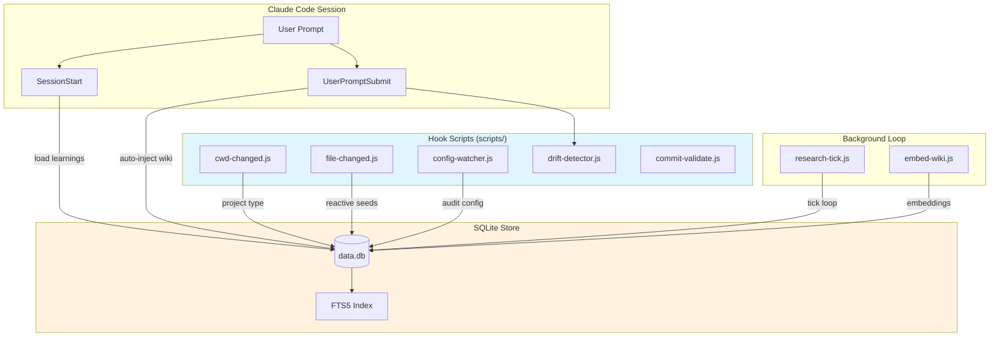

# Pro Workflow 自动化总览

<cite>

**本文引用的文件**

- [pro-workflow/README.md](file://pro-workflow/README.md)
- [pro-workflow/package.json](file://pro-workflow/package.json)
- [pro-workflow/scripts/commit-validate.js](file://pro-workflow/scripts/commit-validate.js)
- [pro-workflow/scripts/config-watcher.js](file://pro-workflow/scripts/config-watcher.js)
- [pro-workflow/scripts/cwd-changed.js](file://pro-workflow/scripts/cwd-changed.js)
- [pro-workflow/scripts/drift-detector.js](file://pro-workflow/scripts/drift-detector.js)
- [pro-workflow/scripts/embed-wiki.js](file://pro-workflow/scripts/embed-wiki.js)
- [pro-workflow/scripts/file-changed.js](file://pro-workflow/scripts/file-changed.js)
- [pro-workflow/config.json](file://pro-workflow/config.json)
- [pro-workflow/tsconfig.json](file://pro-workflow/tsconfig.json)
- [pro-workflow/mcp-config.example.json](file://pro-workflow/mcp-config.example.json)
- [pro-workflow/package-lock.json](file://pro-workflow/package-lock.json)
- [pro-workflow/settings.example.json](file://pro-workflow/settings.example.json)
- [pro-workflow/scripts/research-tick.js](file://pro-workflow/scripts/research-tick.js)

</cite>

## 目录

- [职责定位](#职责定位)
- [核心架构图](#核心架构图)
- [入口文件与调用链](#入口文件与调用链)
- [数据结构](#数据结构)
- [配置系统](#配置系统)
- [质量门禁与钩子](#质量门禁与钩子)
- [自动化脚本详解](#自动化脚本详解)
- [扩展点](#扩展点)
- [Agent 改代码地图](#agent-改代码地图)
- [常见问题与排障](#常见问题与排障)

---

## 职责定位

Pro Workflow 是 `tech-cc-hub` 的**自动化执行引擎**，位于项目根目录 `pro-workflow/`。它为 Claude Code Session 提供三层能力：

| 层级 | 能力 | 核心文件 |
|------|------|----------|
| **自修正记忆** | 捕获用户纠正 → 持久化为 SQLite 规则，下次自动复用 | `dist/db/store.js`（构建产物） |
| **知识平面** | FTS5 索引研究 Wiki，支持 BM25 + 向量混合检索 | `scripts/embed-wiki.js` |
| **质量门禁** | Commit 验证、配置变更监控、意图漂移检测 | `scripts/commit-validate.js`、`scripts/config-watcher.js`、`scripts/drift-detector.js` |

> 章节来源：[pro-workflow/README.md#L16-L18](file://pro-workflow/README.md#L16-L18)

**设计哲学**：正确一次，永不重复。通过 SQLite + FTS5 实现持久化记忆，通过钩子系统实现主动干预。

---

## 核心架构图



**图表来源**：基于 `pro-workflow/README.md` 第 16-18 行描述的架构

---

## 入口文件与调用链

### 1. 入口：Claude Code Hooks

所有自动化脚本通过 Claude Code 的 `hooks.json` 配置注册。典型触发链：

```
Claude Code Event → hooks.json → scripts/*.js → stdio 响应
```

**关键事件映射**（参考 `pro-workflow/README.md#L236-L251`）：

| 事件 | 触发脚本 | 职责 |
|------|----------|------|
| `SessionStart` | 内置 `learn-rule` 加载 | 从 SQLite 加载所有 learnings |
| `UserPromptSubmit` | 内置 `wiki-query` | BM25 检索 + 自动注入 top-3 结果 |
| `CwdChanged` | `scripts/cwd-changed.js` | 检测项目类型，写入 `CLAUDE_ENV_FILE` |
| `FileChanged` | `scripts/file-changed.js` | 重要配置变更告警 + Wiki seed 入队 |
| `ConfigChanged` | `scripts/config-watcher.js` | 敏感配置变更审计日志 |
| `PreCommit` | `scripts/commit-validate.js` | 校验 conventional commits 格式 |

> 章节来源：[pro-workflow/scripts/cwd-changed.js#L1-L8](file://pro-workflow/scripts/cwd-changed.js#L1-L8)

### 2. CLI 入口：`/wiki` 命令族

```bash
/wiki init <slug> --title "..." --flavor research   # 初始化 Wiki
/wiki page <slug> <path> --type concept           # 创建页面
/wiki ask "query" --wiki <slug>                    # BM25 检索
/wiki seed <slug> "query"                          # 入队研究种子
/wiki research <slug> --max-pages 5 --budget-usd 0.50  # 启动研究循环
/wiki embed <slug>                                 # 生成向量嵌入
/wiki hybrid "query" --wiki <slug>                 # BM25 + vector RRF
/wiki council "question" --wiki <slug>            # 多 LLM 商议
```

> 章节来源：[pro-workflow/README.md#L88-L116](file://pro-workflow/README.md#L88-L116)

### 3. 后台循环：`research-tick.js`

每分钟（cron 驱动）检查是否有 opted-in Wiki 带 pending seeds：

```javascript
// scripts/research-tick.js#L44-L72
function tick() {
  if (fs.existsSync(STOP_FILE)) return { skipped: 'stop' };
  const store = getStore();
  // 查找 auto_research.enabled 的 Wiki
  // 执行 research-loop.js --max-pages 1
}
```

**Kill Switch**：`touch ~/.pro-workflow/STOP` 可立即停止所有后台循环。

---

## 数据结构

### SQLite Schema（构建时从 `src/db/schema.sql` 复制）

核心表结构（基于 `pro-workflow/package.json#L8` 和代码推断）：

| 表名 | 用途 | 关键字段 |
|------|------|----------|
| `learnings` | 自修正规则 | `id`, `rule_text`, `created_at`, `source_session` |
| `wikis` | Wiki 元数据 | `slug`, `title`, `flavor`, `root_path`, `auto_research` |
| `wiki_pages` | Wiki 页面 + FTS5 | `id`, `wiki_slug`, `rel_path`, `title`, `content` |
| `wiki_seeds` | 研究种子队列 | `id`, `wiki_slug`, `query`, `depth`, `status` |
| `wiki_sources` | 引用来源 | `id`, `wiki_slug`, `url`, `title`, `accessed_at` |
| `wiki_claims` | 提取的论断 | `id`, `page_id`, `claim_text`, `source_id` |
| `wiki_embeddings` | 向量索引 | `page_id`, `model`, `vector`, `created_at` |
| `edit_logs` | 编辑历史 | `session_id`, `edit_count`, `intent_keywords` |

> 章节来源：[pro-workflow/package.json#L1-L12](file://pro-workflow/package.json#L1-L12)

### IPC 通道：stdin/stdout JSON

所有 Hook 脚本使用相同协议：

```javascript
// 输入：process.stdin → JSON
{
  "cwd": "/path/to/project",
  "session_id": "abc123",
  "prompt": "用户提示词",
  "file_path": "/changed/file",        // FileChanged 事件
  "config_file": "settings.json",      // ConfigChanged 事件
  "tool_input": { "command": "..." }   // PreCommit 事件
}

// 输出：process.stdout → 透传原始 JSON + 副作用
```

> 章节来源：[pro-workflow/scripts/config-watcher.js#L29-L39](file://pro-workflow/scripts/config-watcher.js#L29-L39)

---

## 配置系统

### `config.json` — 主配置

```json
// pro-workflow/config.json
{
  "database": {
    "path": "~/.pro-workflow/data.db",  // SQLite 路径
    "auto_init": true
  },
  "self_correction": {
    "enabled": true,
    "auto_update_claude_md": false,    // 不自动修改 CLAUDE.md
    "require_approval": true,           // 规则需用户确认
    "learned_file": "~/.claude/LEARNED.md"
  },
  "plan_mode": {
    "threshold_files": 3,
    "threshold_tool_calls": 10,
    "require_explicit_approval": true
  },
  "quality_gates": {
    "run_lint": true,
    "run_typecheck": true,
    "run_tests": true,
    "lint_command": "npm run lint",
    "typecheck_command": "npm run typecheck",
    "test_command": "npm test -- --related"
  },
  "model_preferences": {
    "quick_fixes": "haiku",
    "features": "sonnet",
    "refactors": "opus"
  }
}
```

> 章节来源：[pro-workflow/config.json#L1-L47](file://pro-workflow/config.json#L1-L47)

### `settings.example.json` — 权限配置

定义 Claude Code 权限策略，用于 `settings.json` 覆盖：

```json
{
  "permissions": {
    "deny": [
      "Bash(rm -rf *)",
      "Bash(curl * | bash)",
      "Edit(/vendor/**)"
    ],
    "ask": [
      "Bash(git push *)",
      "Bash(docker *)"
    ],
    "allow": [
      "Read", "Glob", "Grep",
      "Bash(npm run *)",
      "MCP(github:*)",
      "MCP(context7:*)",
      "Task(*)", "Agent(*)"
    ]
  }
}
```

> 章节来源：[pro-workflow/settings.example.json#L3-L49](file://pro-workflow/settings.example.json#L3-L49)

### `mcp-config.example.json` — MCP 服务器配置

推荐安装的 MCP 服务器：

```json
{
  "mcpServers": {
    "context7": {
      "command": "npx",
      "args": ["-y", "@upstash/context7-mcp@latest"],
      "_comment": "Live docs，避免过时 API 猜测"
    },
    "playwright": {
      "command": "npx",
      "args": ["-y", "@anthropic/mcp-playwright"],
      "_comment": "E2E 测试，13.7k tokens 平均开销"
    },
    "github": {
      "command": "npx",
      "args": ["-y", "@modelcontextprotocol/server-github"],
      "env": { "GITHUB_PERSONAL_ACCESS_TOKEN": "${GITHUB_TOKEN}" }
    }
  }
}
```

> 章节来源：[pro-workflow/mcp-config.example.json#L1-L22](file://pro-workflow/mcp-config.example.json#L1-L22)

---

## 质量门禁与钩子

### `commit-validate.js` — Commit 质量检查

**职责**：在 PreCommit 事件验证 commit message 符合 conventional commits 格式。

**关键符号**：

| 符号 | 行号 | 含义 |
|------|------|------|
| `TYPES` | L2 | 允许的 commit 类型：`feat, fix, refactor, test, docs, chore, perf, ci, style, build, revert` |
| `PATTERN` | L3 | 正则：`^(feat\|fix\|...)([\w\-.,/ ]+))?!?: .+` |
| `MAX_SUMMARY` | L4 | 摘要最大长度：72 字符 |
| `extractMessage()` | L15 | 解析 `git commit -m "..."` 或 heredoc |
| `validate()` | L46 | 核心校验逻辑 |

**校验规则**：

1. 首行必须匹配 `type(scope): summary` 格式
2. 摘要长度 ≤ 72 字符
3. 无 `-m` 参数时跳过（编辑器模式）

**退出码**：`0` = 通过，`2` = 拒绝

```javascript
// 调用示例
echo '{"tool_input": {"command": "git commit -m \"feat(auth): add login\"}}' | node scripts/commit-validate.js
```

> 章节来源：[pro-workflow/scripts/commit-validate.js#L1-L79](file://pro-workflow/scripts/commit-validate.js#L1-L79)

### `config-watcher.js` — 配置变更审计

**职责**：监控敏感配置（`settings.json`, `hooks.json`）变更并记录日志。

**敏感文件列表**：

```javascript
const sensitiveFiles = [
  'settings.json',
  'settings.local.json',
  'hooks.json',
  '.claudeignore'
];
```

**副作用**：变更记录到 `~/.pro-workflow/config-changes.log`，日志超过 100KB 时截断。

> 章节来源：[pro-workflow/scripts/config-watcher.js#L43-L76](file://pro-workflow/scripts/config-watcher.js#L43-L76)

### `drift-detector.js` — 意图漂移检测

**职责**：检测用户意图是否偏离原始任务，防止 Agent 陷入无关修改。

**关键符号**：

| 符号 | 行号 | 含义 |
|------|------|------|
| `extractIntent()` | L85 | 从首句提取意图（取前 200 字符） |
| `extractKeywords()` | L91 | 分词 + 停用词过滤 |
| `isNewIntent()` | L112 | 检测切换模式（`now let's`, `switch to`, `forget it`） |

**漂移判定**：`editsSinceLastTouch >= 6 && relevance < 0.2` 时告警。

**状态文件**：`~/.pro-workflow/intent-<sessionId>`、`edit-log-<sessionId>`

> 章节来源：[pro-workflow/scripts/drift-detector.js#L52-L67](file://pro-workflow/scripts/drift-detector.js#L52-L67)

### `cwd-changed.js` — 项目类型检测

**职责**：切换目录时检测项目类型，写入环境变量。

**检测逻辑**：

```javascript
const type = hasPackageJson ? 'node'
  : fs.existsSync('Cargo.toml') ? 'rust'
  : fs.existsSync('go.mod') ? 'go'
  : fs.existsSync('pyproject.toml') ? 'python'
  : null;
```

**输出**：如果 `CLAUDE_ENV_FILE` 存在，写入 `export PRO_WORKFLOW_PROJECT_TYPE=<type>`

> 章节来源：[pro-workflow/scripts/cwd-changed.js#L22-L33](file://pro-workflow/scripts/cwd-changed.js#L22-L33)

### `file-changed.js` — 重要文件监控 + Wiki Seed 触发

**职责**：两件事合一：

1. **重要配置告警**：检测 `package.json`, `tsconfig.json`, `.env` 等变更并提示验证命令
2. **Wiki Seed 入队**：编辑 `~/.claude/wikis/<slug>/wiki/*.md` 时自动入队 verify seed

**重要文件模式**：

```javascript
const importantPatterns = [
  /package\.json$/,
  /tsconfig.*\.json$/,
  /\.env$/,
  /Dockerfile/,
  /\.github\/workflows\//,
  /CLAUDE\.md$/,
  /\.claude\//
];
```

**Wiki seed 入队逻辑**（L28-L49）：

```javascript
const wikiMatch = filePath.match(
  /(?:^|\/)\.claude\/wikis\/([^/]+)\/wiki\/.+\.md$/ ||
  /(?:^|\/)\.pro-workflow\/wikis\/([^/]+)\/wiki\/.+\.md$/
);
// 找到 Wiki → store.enqueueSeed({ wiki_slug: slug, query: `verify edits in ${rel}`, depth: 0 })
```

> 章节来源：[pro-workflow/scripts/file-changed.js#L10-L49](file://pro-workflow/scripts/file-changed.js#L10-L49)

---

## 自动化脚本详解

### `embed-wiki.js` — 向量嵌入 + 混合检索

**两种模式**：

#### 模式 1：`embed-wiki.js all [<slug>]`

批量生成向量嵌入：

```javascript
async function cmdAll(args) {
  const provider = helpers.getEmbeddingProvider(); // OPENAI_API_KEY 或 VOYAGE_API_KEY
  const pages = slug ? store.listWikiPages(slug) : store.db.prepare('SELECT * FROM wiki_pages').all();

  // 批量处理，每批 16 个
  for (let i = 0; i < todo.length; i += batchSize) {
    const inputs = batch.map(p => `${p.title}\n\n${p.content.slice(0, 8000)}`);
    const vectors = await provider.embed(inputs);
    // 写入 wiki_embeddings 表
  }
}
```

#### 模式 2：`embed-wiki.js search "<query>"`

混合检索（RRF 融合）：

```javascript
async function cmdSearch(args) {
  const qv = await provider.embed([query]);
  const vectorHits = helpers.vectorSearch(store.db, qv, { wikiSlug: args.wiki, limit });
  const bm25Hits = store.searchWiki(query, { wikiSlug: args.wiki, limit, loose: true });

  // RRF (Reciprocal Rank Fusion)
  const fused = helpers.reciprocalRankFusion(
    [vectorHits, bm25Hits],
    (x) => String(x.page_id)
  );
}
```

**参数**：

| 参数 | 说明 |
|------|------|
| `--wiki <slug>` | 限定搜索范围 |
| `--limit <n>` | 结果数上限（默认 10） |
| `--mode hybrid\|vector\|bm25` | 检索模式 |
| `--force` | 强制重新嵌入 |

> 章节来源：[pro-workflow/scripts/embed-wiki.js#L29-L103](file://pro-workflow/scripts/embed-wiki.js#L29-L103)

### `research-tick.js` — 研究循环触发器

**工作流程**：

```mermaid
sequenceDiagram
    participant Cron as Cron Job
    participant Tick as research-tick.js
    participant Store as SQLite Store
    participant Loop as research-loop.js

    Cron->>Tick: 每分钟执行
    Tick->>Tick: 检查 ~/.pro-workflow/STOP
    Tick->>Store: listWikis()
    Store-->>Tick: wiki list
    loop 遍历 Wiki
        Tick->>Tick: readWikiConfig(root_path)
        alt auto_research.enabled && pending seeds
            Tick->>Loop: spawnSync(node, ['run', slug, '--max-pages', '1'])
            Loop-->>Tick: exit code
        else
            Tick->>Tick: skip: no-target
        end
    end
    Tick->>Tick: appendLog(tick.log)
```

**日志文件**：`~/.pro-workflow/tick.log`，每行前缀 `[ISO 时间戳]`

**超时配置**：10 分钟，超时发送 `SIGKILL`

> 章节来源：[pro-workflow/scripts/research-tick.js#L44-L73](file://pro-workflow/scripts/research-tick.js#L44-L73)

---

## 扩展点

### 1. 自定义 Hook 脚本

在 `hooks.json` 中注册新脚本：

```json
{
  "hooks": {
    "CustomEvent": {
      "after": "path/to/script.js"
    }
  }
}
```

脚本接收 `stdin` JSON，返回 `stdout` JSON（透传）。

### 2. 新 Wiki Flavor

支持 9 种 Flavor（`pro-workflow/README.md#L128`）：

| Flavor | 用途 |
|--------|------|
| `research` | 通用研究 |
| `paper` | 学术论文 |
| `domain` | 领域知识 |
| `product` | 产品规格 |
| `person` | 人物档案 |
| `organization` | 组织架构 |
| `project` | 项目文档 |
| `codebase` | 代码库知识 |
| `incident` | 故障复盘 |

### 3. 自定义 Embedding Provider

修改 `scripts/embed-wiki.js` 第 32 行：

```javascript
const provider = helpers.getEmbeddingProvider();
// 支持：OPENAI_API_KEY → text-embedding-3-small
//        VOYAGE_API_KEY → voyage-3
//        或实现自定义 provider
```

### 4. 新 LLM Council Provider

`llm-council` skill 支持 `Anthropic/OpenAI/OpenRouter/Fireworks/custom`，通过 `Promise.allSettled` 并行调用，任一失败不中止。

> 章节来源：[pro-workflow/README.md#L131](file://pro-workflow/README.md#L131)

### 5. 文件变化触发器

在 `scripts/file-changed.js` 的 `importantPatterns` 中添加新模式：

```javascript
const importantPatterns = [
  // ... 现有模式
  /\.my-config\.yaml$/,
  /requirements\.txt$/
];
```

---

## Agent 改代码地图

### 先读文件（按优先级）

| 优先级 | 文件 | 原因 |
|--------|------|------|
| 1 | `pro-workflow/config.json` | 主配置，所有默认值来源 |
| 2 | `pro-workflow/package.json` | 构建脚本 `npm run build` 定义 |
| 3 | `pro-workflow/scripts/commit-validate.js` | 质量门禁核心逻辑 |
| 4 | `pro-workflow/scripts/embed-wiki.js` | 检索逻辑（BM25 + RRF） |
| 5 | `pro-workflow/scripts/research-tick.js` | 后台循环入口 |
| 6 | `pro-workflow/settings.example.json` | 权限白名单 |

### 关键符号速查

| 符号 | 文件 | 行号 | 用途 |
|------|------|------|------|
| `TYPES` | commit-validate.js | L2 | commit 类型列表 |
| `PATTERN` | commit-validate.js | L3 | commit message 正则 |
| `MAX_SUMMARY` | commit-validate.js | L4 | 摘要最大长度 |
| `extractIntent()` | drift-detector.js | L85 | 意图提取 |
| `getStore()` | embed-wiki.js | L7 | 获取 SQLite store |
| `getEmbedHelpers()` | embed-wiki.js | L13 | 获取嵌入工具 |
| `STOP_FILE` | research-tick.js | L8 | 停止循环开关 |
| `LOOP_SCRIPT` | research-tick.js | L9 | 研究循环脚本路径 |
| `sensitiveFiles` | config-watcher.js | L43 | 敏感配置列表 |
| `importantPatterns` | file-changed.js | L10 | 重要文件模式 |
| `enqueueSeed()` | file-changed.js | L43 | Wiki seed 入队 |

### 修改入口

| 场景 | 修改文件 | 关键行 |
|------|----------|--------|
| 添加 commit 类型 | `scripts/commit-validate.js` | L2 `TYPES` 数组 |
| 修改摘要长度限制 | `scripts/commit-validate.js` | L4 `MAX_SUMMARY` |
| 添加漂移检测模式 | `scripts/drift-detector.js` | L112 `isNewIntent()` 正则 |
| 添加重要文件监控 | `scripts/file-changed.js` | L10 `importantPatterns` |
| 修改敏感配置列表 | `scripts/config-watcher.js` | L43 `sensitiveFiles` |
| 调整 batch size | `scripts/embed-wiki.js` | L50 `batchSize = 16` |
| 修改超时时间 | `scripts/research-tick.js` | L65 `timeout: 10 * 60 * 1000` |

### 验证命令

```bash
# 构建项目
cd pro-workflow && npm run build

# 验证 commit-validate
echo '{"tool_input": {"command": "git commit -m \"feat: add feature\""}}' | node scripts/commit-validate.js && echo "PASS" || echo "FAIL"

# 验证 embed-wiki（需先构建）
node scripts/embed-wiki.js all --limit 10

# 验证 research-tick（dry-run）
node scripts/research-tick.js

# 检查 SQLite 数据库
sqlite3 ~/.pro-workflow/data.db ".tables"
sqlite3 ~/.pro-workflow/data.db "SELECT * FROM learnings LIMIT 5;"
```

### 常见回归风险

| 风险 | 原因 | 缓解 |
|------|------|------|
| Hook 脚本 exit 非 0 导致 Session 中断 | `commit-validate.js` 校验失败返回 2 | 确保只有真正需要拒绝的场景返回非 0 |
| `getStore()` 失败阻塞后台循环 | `dist/db/store.js` 不存在时 `process.exit(1)` | 构建后检查 `npm run build` 成功 |
| 向量嵌入重复写入 | `wiki_embeddings` 表无 unique 约束 | `embed-wiki.js` L43 检查 `has` 后跳过 |
| 意图文件残留 | `drift-detector.js` 写 `~/.pro-workflow/intent-*` 后不清理 | Session 结束时清理或在 `SessionEnd` hook 处理 |

---

## 常见问题与排障

### Q1: Hook 脚本未触发

1. 检查 `hooks.json` 是否正确注册
2. 确认脚本有执行权限：`chmod +x scripts/*.js`
3. 检查 Claude Code 版本是否支持该事件

### Q2: `getStore()` 报 "build store first"

```bash
cd pro-workflow && npm install && npm run build
```

确保 `dist/db/store.js` 存在。

### Q3: 向量嵌入失败

```bash
# 检查环境变量
echo $OPENAI_API_KEY
echo $VOYAGE_API_KEY

# 如果都没有，设置其中一个
export OPENAI_API_KEY=sk-...
```

> 章节来源：[pro-workflow/scripts/embed-wiki.js#L33-L35](file://pro-workflow/scripts/embed-wiki.js#L33-L35)

### Q4: research-tick 持续执行但无效果

1. 检查 `~/.pro-workflow/STOP` 是否存在
2. 确认 Wiki 配置了 `auto_research.enabled: true`
3. 检查 `~/.pro-workflow/tick.log` 最新行

```bash
tail -20 ~/.pro-workflow/tick.log
```

### Q5: commit 被拒绝但格式看起来正确

检查是否有 `--allow-empty` 或 `-F` 参数（文件模式），这种情况下 `commit-validate.js` 会跳过校验返回 0。

> 章节来源：[pro-workflow/scripts/commit-validate.js#L66-L72](file://pro-workflow/scripts/commit-validate.js#L66-L72)

---

## 验证命令速查

| 命令 | 用途 |
|------|------|
| `npm run build` | 构建 TypeScript + 复制 schema.sql |
| `npm run clean` | 清理 dist 目录 |
| `node scripts/commit-validate.js < stdin` | 测试 commit 校验 |
| `node scripts/embed-wiki.js all` | 批量嵌入所有 Wiki 页面 |
| `node scripts/embed-wiki.js search "query" --limit 5` | 测试混合检索 |
| `node scripts/research-tick.js` | 触发研究循环 tick |
| `sqlite3 ~/.pro-workflow/data.db ".schema"` | 查看数据库 schema |
| `tail -f ~/.pro-workflow/tick.log` | 监控研究循环日志 |
| `tail -f ~/.pro-workflow/config-changes.log` | 监控配置变更 |
| `touch ~/.pro-workflow/STOP` | 停止所有后台循环 |

> 章节来源：[pro-workflow/package.json#L7-L11](file://pro-workflow/package.json#L7-L11)

---

**文档版本**：v1.0
**最后更新**：基于 pro-workflow v3.3.0
**维护者**：tech-cc-hub Team