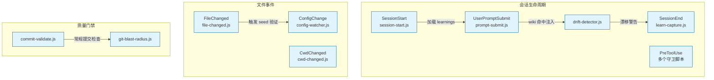
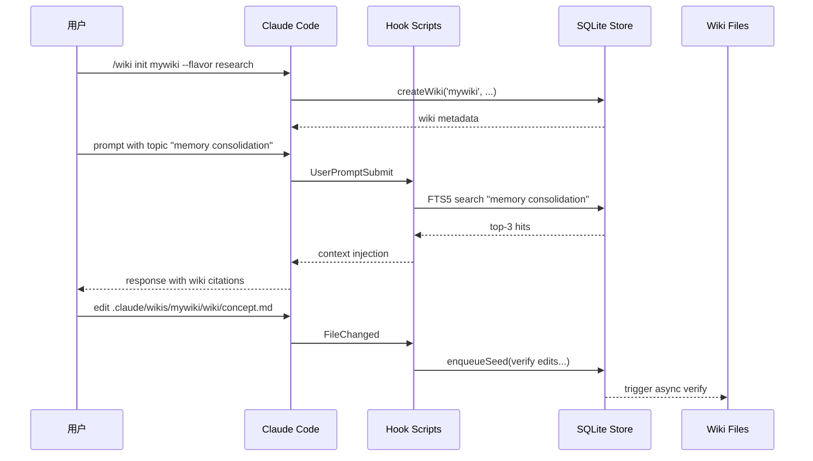

# Pro Workflow 自动化总览

<cite>
**本文引用的文件**
- [pro-workflow/README.md](file://pro-workflow/README.md)
- [pro-workflow/package.json](file://pro-workflow/package.json)
- [pro-workflow/scripts/commit-validate.js](file://pro-workflow/scripts/commit-validate.js)
- [pro-workflow/scripts/config-watcher.js](file://pro-workflow/scripts/config-watcher.js)
- [pro-workflow/scripts/cwd-changed.js](file://pro-workflow/scripts/cwd-changed.js)
- [pro-workflow/scripts/drift-detector.js](file://pro-workflow/scripts/drift-detector.js)
- [pro-workflow/scripts/embed-wiki.js](file://pro-workflow/scripts/embed-wiki.js)
- [pro-workflow/scripts/file-changed.js](file://pro-workflow/scripts/file-changed.js)
- [pro-workflow/scripts/git-blast-radius.js](file://pro-workflow/scripts/git-blast-radius.js)
</cite>

# Pro Workflow 自动化总览

## 目录

- [模块定位与职责边界](#模块定位与职责边界)
- [入口点与调用链](#入口点与调用链)
- [核心数据结构](#核心数据结构)
- [Hook 脚本详解](#hook-脚本详解)
- [配置与扩展点](#配置与扩展点)
- [数据流图](#数据流图)
- [常见失败模式与排障](#常见失败模式与排障)
- [验证命令参考](#验证命令参考)
- [改造路径指南](#改造路径指南)

---

## 模块定位与职责边界

Pro Workflow 是 tech-cc-hub 项目中 **跨 Agent 的持久化知识与质量门禁系统**。它解决的核心问题是：同一团队在多次会话中重复纠正相同的错误，学习无法跨会话累积。

该模块的核心职责：

| 职责 | 描述 |
|------|------|
| **自修正记忆** | 每次纠正转为 SQLite 规则，FTS5 索引，会话启动时自动加载 |
| **知识平面** | 持久化研究 Wiki + FTS5 影子索引，支持 BFS 自动增长 |
| **质量门禁** | LLM 驱动的 Commit Hook、Git 危险操作拦截、Secret 扫描 |
| **上下文保护** | Compaction 前后状态保存与恢复，漂移检测 |

[章节来源](file://pro-workflow/README.md#L24-L39)

---

## 入口点与调用链

### 入口层级

Pro Workflow 的自动化通过 **24 个 Hook 事件** 触发，覆盖完整的会话生命周期：



[图表来源](file://pro-workflow/README.md#L259)

### 关键调用链

#### 1. SessionStart → Wiki 自动加载

```
Claude Code 启动
  → Hook: SessionStart
  → scripts/session-start.js
  → 读取 SQLite learnings 表
  → 列出已注册 Wiki
  → 为 UserPromptSubmit 注册 wiki 命中回调
```

#### 2. UserPromptSubmit → Wiki 检索注入

```
用户提交 prompt
  → Hook: UserPromptSubmit
  → scripts/prompt-submit.js
  → FTS5 BM25 检索 top-3 命中
  → 将 Wiki 摘要注入 context
  → Claude 自动使用这些上下文
```

[章节来源](file://pro-workflow/README.md#L118)

---

## 核心数据结构

### SQLite Schema 概览

Pro Workflow 使用单一 SQLite 存储，位于 `~/.pro-workflow/store.db`，主要表：

| 表名 | 用途 | 索引 |
|------|------|------|
| `learnings` | 纠正规则，自修正记忆 | FTS5 on rule_text |
| `wikis` | Wiki 元数据（slug, title, flavor） | PRIMARY KEY |
| `wiki_pages` | Wiki 内容页 | FTS5 on title, content |
| `wiki_sources` | 外部来源（URL, title） | wiki_slug FK |
| `wiki_claims` | 页面中的断言 | page_id FK |
| `wiki_seeds` | 待验证的研究种子 | wiki_slug FK |
| `wiki_embeddings` | 向量嵌入 | (page_id, model) UNIQUE |

[章节来源](file://pro-workflow/package.json#L44-L46)

### 临时状态文件

部分脚本使用 `os.tmpdir()/pro-workflow/` 存储临时状态：

```
/tmp/pro-workflow/
├── intent-{sessionId}          # drift-detector 意图追踪
├── edit-log-{sessionId}        # drift-detector 编辑计数
├── config-changes.log          # config-watcher 变更日志
└── seed-queue.json             # 研究种子队列
```

[章节来源](file://pro-workflow/scripts/drift-detector.js#L32-L37)

---

## Hook 脚本详解

### 1. commit-validate.js — 提交信息验证

**职责**：在 `git commit` 执行前验证消息格式是否符合 Conventional Commits。

**调用链**：
```
PreToolUse(Bash) → commit-validate.js → stdin 接收 tool_input.command
```

**核心逻辑**（[file://pro-workflow/scripts/commit-validate.js#L46-L57](file://pro-workflow/scripts/commit-validate.js#L46-L57)）：

```javascript
// 有效类型：feat, fix, refactor, test, docs, chore, perf, ci, style, build, revert
const PATTERN = new RegExp(`^(${TYPES.join('|')})(\\([\\w\\-.,/ ]+\\))?!?: .+`);
// 摘要最大 72 字符
const MAX_SUMMARY = 72;
```

**消息解析顺序**（[file://pro-workflow/scripts/commit-validate.js#L15-L44](file://pro-workflow/scripts/commit-validate.js#L15-L44)）：
1. `-m "..."` 短标志
2. `--message=...` 长标志
3. Heredoc 首行 `<<EOF ... EOF`
4. `-F <file>` 文件模式 → 跳过验证（由编辑器处理）
5. 无显式消息 → 跳过验证（由编辑器处理）

**退出码**：
- `0` — 通过或跳过
- `2` — 格式错误，打印原因到 stderr

**常见失败**：
- 类型不在白名单 → 报错，退出码 2
- 摘要超过 72 字符 → 报错，退出码 2

---

### 2. git-blast-radius.js — 危险 Git 操作拦截

**职责**：阻止可能覆盖远程历史或丢失工作区的 Git 命令。

**拦截列表**（[file://pro-workflow/scripts/git-blast-radius.js#L8-L23](file://pro-workflow/scripts/git-blast-radius.js#L8-L23)）：

| 操作 | 危险等级 |
|------|---------|
| `git push --force` | 阻断 |
| `git push <remote> +<branch>` | 阻断 |
| `git push --delete` | 阻断 |
| `git reset --hard` | 阻断 |
| `git clean -f*` | 阻断 |
| `git branch -D` | 阻断 |
| `git checkout .` | 阻断 |
| `git rebase -i main` | 阻断 |
| `git stash drop/clear` | 阻断 |
| `git push --force-with-lease` | 仅警告 |

**跳过条件**：
```bash
export PRO_WORKFLOW_ALLOW_UNSAFE_GIT=1
```

**数据处理**：URL 中的凭证会被脱敏 `[file://pro-workflow/scripts/git-blast-radius.js#L38-L39](file://pro-workflow/scripts/git-blast-radius.js#L38-L39)`：
```javascript
command.replace(/(https?:\/\/)[^/@\s]+@/gi, '$1***@')
```

---

### 3. file-changed.js — 文件变更检测

**职责**：检测重要配置文件变更并给出上下文建议；对 Wiki 内编辑触发 seed 验证入队。

**重要性文件模式**（[file://pro-workflow/scripts/file-changed.js#L10-L23](file://pro-workflow/scripts/file-changed.js#L10-L23)）：
```
package.json      → 提示 run npm install
.env              → 警告检查 secrets
tsconfig*.json    → 提示 run tsc --noEmit
Dockerfile        → 提示 docker compose up --build
.github/workflows → 提示验证 CI
CLAUDE.md         → 提示上下文已更新
Cargo.toml        → 提示 run cargo check
pyproject.toml    → 提示 pip install -e .
go.mod            → 提示 go mod tidy
Makefile          → 提示验证 build targets
```

**Wiki 编辑检测**（[file://pro-workflow/scripts/file-changed.js#L27-L49](file://pro-workflow/scripts/file-changed.js#L27-L49)）：
```javascript
// 匹配路径: .claude/wikis/{slug}/wiki/*.md 或 .pro-workflow/wikis/{slug}/wiki/*.md
const wikiMatch = filePath.match(/(?:^|\/)\.claude\/wikis\/([^/]+)\/wiki\/.+\.md$/) ||
                  filePath.match(/(?:^|\/)\.pro-workflow\/wikis\/([^/]+)\/wiki\/.+\.md$/);
if (wikiMatch) {
  store.enqueueSeed({ wiki_slug: slug, query: `verify edits in ${rel}`, depth: 0 });
}
```

---

### 4. config-watcher.js — 配置变更监控

**职责**：监听 `settings.json`、`hooks.json` 等敏感配置文件的变更。

**监听范围**（[file://pro-workflow/scripts/config-watcher.js#L43-L48](file://pro-workflow/scripts/config-watcher.js#L43-L48)）：
```javascript
const sensitiveFiles = [
  'settings.json',
  'settings.local.json',
  'hooks.json',
  '.claudeignore'
];
```

**行为**：
- `hooks.json` 变更 → 警告质量门禁可能受影响
- `settings.json` 变更 → 警告权限设置可能受影响
- 写入 `/tmp/pro-workflow/config-changes.log`，日志超过 100KB 时截断

---

### 5. cwd-changed.js — 工作目录切换检测

**职责**：切换目录时检测项目类型和上下文标志。

**检测逻辑**（[file://pro-workflow/scripts/cwd-changed.js#L13-L27](file://pro-workflow/scripts/cwd-changed.js#L13-L27)）：
```javascript
const hasGit = fs.existsSync('.git');
const hasPackageJson = fs.existsSync('package.json');
const hasClaude = fs.existsSync('CLAUDE.md') || fs.existsSync('.claude');
```

**项目类型推断**：
- `package.json` → `node`
- `Cargo.toml` → `rust`
- `go.mod` → `go`
- `pyproject.toml` → `python`

**输出建议**：如果无 `CLAUDE.md`，提示考虑执行 `/auto-setup`。

---

### 6. drift-detector.js — 意图漂移检测

**职责**：追踪用户原始意图与当前编辑方向的偏离度。

**状态追踪**（[file://pro-workflow/scripts/drift-detector.js#L52-L67](file://pro-workflow/scripts/drift-detector.js#L52-L67)）：
```javascript
// 存储在 /tmp/pro-workflow/intent-{sessionId}
{
  original: prompt.slice(0, 500),  // 原始意图
  intent: "first sentence",        // 提取的意图摘要
  timestamp: Date.now(),
  editsSinceLastTouch: 0           // 自上次对齐后的编辑数
}
```

**漂移判定条件**（[file://pro-workflow/scripts/drift-detector.js#L62](file://pro-workflow/scripts/drift-detector.js#L62)）：
- 编辑数 ≥ 6
- 关键词重叠率 < 20%

**新意图检测模式**（[file://pro-workflow/scripts/drift-detector.js#L112-L120](file://pro-workflow/scripts/drift-detector.js#L112-L120)）：
```javascript
/^(now|next|also|okay|ok)\s+(let's|can you|please|i need)/i
/^(switch|move|pivot|change)\s+(to|focus)/i
/^(forget|skip|instead|actually)/i
/^new task/i
```

---

### 7. embed-wiki.js — 向量嵌入与混合检索

**职责**：为 Wiki 页面生成向量嵌入，支持 BM25 + vector 的 RRF 混合检索。

**命令用法**：
```bash
# 全量嵌入（需 OPENAI_API_KEY 或 VOYAGE_API_KEY）
node scripts/embed-wiki.js all [slug] [--limit 200] [--force]

# 混合搜索
node scripts/embed-wiki.js search "<query>" [--wiki slug] [--limit 10] [--mode hybrid|vector|bm25]
```

**混合检索流程**（[file://pro-workflow/scripts/embed-wiki.js#L66-L103](file://pro-workflow/scripts/embed-wiki.js#L66-L103)）：
1. 向量搜索获取 `vectorHits`
2. BM25 搜索获取 `bm25Hits`
3. Reciprocal Rank Fusion 融合结果
4. 输出按 `rrf_score` 排序的 page 列表

**批处理**：16 个 page 为一批，每完成一批输出进度 `[embed] done/total`。

---

## 配置与扩展点

### Hook 注册位置

Hook 在 Claude Code 的 `~/.claude/hooks.json` 中注册，格式：

```json
{
  "hooks": {
    "PreToolUse(Bash)": [
      "path/to/pro-workflow/scripts/commit-validate.js",
      "path/to/pro-workflow/scripts/git-blast-radius.js"
    ],
    "FileChanged": [
      "path/to/pro-workflow/scripts/file-changed.js"
    ],
    "CwdChanged": [
      "path/to/pro-workflow/scripts/cwd-changed.js"
    ]
  }
}
```

[章节来源](file://pro-workflow/README.md#L269)

### 环境变量

| 变量 | 用途 | 默认值 |
|------|------|--------|
| `PRO_WORKFLOW_ALLOW_UNSAFE_GIT` | 跳过 git-blast-radius 拦截 | `0` |
| `OPENAI_API_KEY` | Wiki 向量化 provider | — |
| `VOYAGE_API_KEY` | Wiki 向量化 provider（备选） | — |
| `CLAUDE_ENV_FILE` | cwd-changed 写入项目类型的路径 | — |

[章节来源](file://pro-workflow/scripts/git-blast-radius.js#L43)

### 扩展方式

1. **新增 Hook**：在 `hooks.json` 中添加新的事件触发点
2. **自定义 Seed 验证**：修改 `file-changed.js` 的 `enqueueSeed` 逻辑
3. **替换 Embedding Provider**：修改 `embed-wiki.js` 的 `getEmbeddingProvider()`
4. **扩展漂移模式**：在 `drift-detector.js` 的 `newIntentPatterns` 中添加正则

---

## 数据流图



[图表来源](file://pro-workflow/README.md#L40-L53)

---

## 常见失败模式与排障

### 1. Commit 验证持续失败

**症状**：`[pro-workflow] commit-validate: Commit message must follow...` 每次 commit 都被拒绝。

**排查步骤**：
```bash
# 1. 检查当前消息格式
git log -1 --format="%s"

# 2. 手动验证正则
node -e "const p = /^((?:feat|fix|refactor|test|docs|chore|perf|ci|style|build|revert))(\([\w\-.,/ ]+\))?!?: .+/; console.log(p.test('feat(api): add endpoint'))"

# 3. 如需绕过（不推荐）
export PRO_WORKFLOW_ALLOW_UNSAFE_GIT=1
```

[章节来源](file://pro-workflow/scripts/commit-validate.js#L47-L50)

### 2. Git 操作被误拦截

**症状**：`[pro-workflow] git-blast-radius: blocked "force push..."` 但你需要执行安全操作。

**原因**：命令匹配了 `git push --force` 或其他危险模式。

**解决**：
```bash
# 临时跳过（单次 shell）
export PRO_WORKFLOW_ALLOW_UNSAFE_GIT=1

# 使用 force-with-lease（安全替代）
git push --force-with-lease
```

[章节来源](file://pro-workflow/scripts/git-blast-radius.js#L25-L27)

### 3. Wiki 编辑未触发 Seed 验证

**症状**：修改 Wiki 文件后没有看到 `[ProWorkflow] enqueued verify seed`。

**排查**：
1. 确认路径匹配模式：`.claude/wikis/{slug}/wiki/*.md` 或 `.pro-workflow/wikis/{slug}/wiki/*.md`
2. 确认 `store.js` 已 build：`ls dist/db/store.js`
3. 检查 store 是否正常初始化：`node dist/db/index.js`

[章节来源](file://pro-workflow/scripts/file-changed.js#L27-L49)

### 4. 向量化失败

**症状**：`No embedding provider env set. OPENAI_API_KEY or VOYAGE_API_KEY required.`

**解决**：
```bash
export OPENAI_API_KEY=sk-...
# 或
export VOYAGE_API_KEY=voy-...

# 然后重试
node scripts/embed-wiki.js all mywiki
```

[章节来源](file://pro-workflow/scripts/embed-wiki.js#L32-L36)

### 5. Compaction 后上下文丢失

**症状**：Compaction 后 Wiki 搜索结果为空或 learns 丢失。

**排查**：
1. 检查 `pre-compact.js` 是否正确保存了上下文摘要
2. 检查 `post-compact.js` 是否正确恢复
3. 确认 SQLite 文件未被截断

---

## 验证命令参考

### 本地构建验证

```bash
# 1. 编译 TypeScript
cd pro-workflow && npm run build

# 2. 初始化数据库
npm run db:init

# 3. 验证 dist 文件存在
ls dist/db/store.js
ls dist/search/embeddings.js
```

[章节来源](file://pro-workflow/package.json#L7-L11)

### Hook 脚本单元测试

```bash
# 测试 commit 解析
echo '{"tool_input": {"command": "git commit -m \"feat(api): add login\""}}' \
  | node scripts/commit-validate.js
echo $?  # 应输出 0

# 测试危险命令拦截
echo '{"tool_input": {"command": "git push --force origin main"}}' \
  | node scripts/git-blast-radius.js
echo $?  # 应输出 2
```

### Wiki 功能验证

```bash
# 初始化 Wiki
/wiki init test-wiki --title "Test" --flavor research

# 添加页面
/wiki page test-wiki concepts/test.md --type concept

# 搜索（需先 build）
/wiki ask "test concept" --wiki test-wiki

# 向量化（需 API key）
/wiki embed test-wiki

# 混合搜索
/wiki hybrid "test" --wiki test-wiki --mode hybrid
```

[章节来源](file://pro-workflow/README.md#L87-L116)

---

## 改造路径指南

### 场景 1：添加新的常规提交类型

修改 `commit-validate.js` 第 2 行：
```javascript
const TYPES = ['feat', 'fix', 'refactor', 'test', 'docs', 'chore', 'perf', 'ci', 'style', 'build', 'revert', 'breaking'];
// 新增 'breaking' 类型
```

[章节来源](file://pro-workflow/scripts/commit-validate.js#L2)

### 场景 2：扩展漂移检测模式

在 `drift-detector.js` 的 `newIntentPatterns` 数组中添加新正则：
```javascript
/^never mind, (?:let's |can we )?/i,  // 放弃当前任务
/^actually, (?:i need|i want)/i,      // 意图切换
```

[章节来源](file://pro-workflow/scripts/drift-detector.js#L112-L120)

### 场景 3：新增重要文件监控

在 `file-changed.js` 的 `importantPatterns` 中添加：
```javascript
/\/kubernetes\/.*\.yaml$/,    // K8s 配置
/\.terraform\/\.tfstate$/,     // Terraform 状态（敏感）
```

[章节来源](file://pro-workflow/scripts/file-changed.js#L10-L23)

### 场景 4：切换 Embedding Provider

修改 `dist/search/embeddings.js` 的 `getEmbeddingProvider()`：
```javascript
function getEmbeddingProvider() {
  if (process.env.OPENAI_API_KEY) {
    return { name: 'openai', model: 'text-embedding-3-small', embed: openaiEmbed };
  }
  if (process.env.VOYAGE_API_KEY) {
    return { name: 'voyage', model: 'voyage-lite-2', embed: voyageEmbed };
  }
  return null;
}
```

[章节来源](file://pro-workflow/scripts/embed-wiki.js#L32-L36)

---

## 相关文档

- [Pro Workflow 主文档](file://pro-workflow/README.md)
- [Settings 配置指南](../doc/40-engineering/settings-skills/spec.md)
- [会话生命周期规范](../doc/20-contracts/session-lifecycle/spec.md)
- [上下文同步规范](../doc/20-specs/23-上下文同步与合并规范.md)