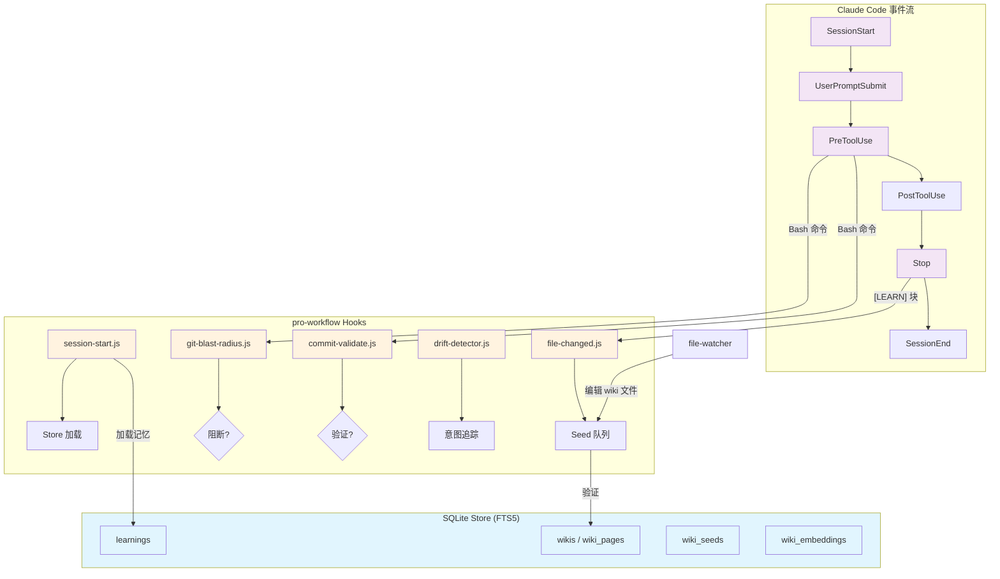
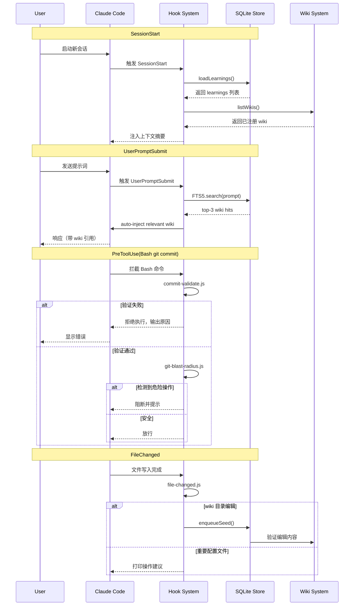
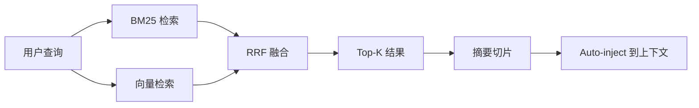

# Pro Workflow 自动化总览

<cite>

**本文引用的文件**

- [pro-workflow/README.md](file://pro-workflow/README.md)
- [pro-workflow/package.json](file://pro-workflow/package.json)
- [pro-workflow/scripts/commit-validate.js](file://pro-workflow/scripts/commit-validate.js)
- [pro-workflow/scripts/config-watcher.js](file://pro-workflow/scripts/config-watcher.js)
- [pro-workflow/scripts/cwd-changed.js](file://pro-workflow/scripts/cwd-changed.js)
- [pro-workflow/scripts/drift-detector.js](file://pro-workflow/scripts/drift-detector.js)
- [pro-workflow/scripts/embed-wiki.js](file://pro-workflow/scripts/embed-wiki.js)
- [pro-workflow/scripts/file-changed.js](file://pro-workflow/scripts/file-changed.js)
- [pro-workflow/scripts/git-blast-radius.js](file://pro-workflow/scripts/git-blast-radius.js)

</cite>

# Pro Workflow 自动化总览

> 本文档说明 `pro-workflow` 系统中 Hook 脚本与自动化机制的设计意图、调用链路、数据结构和扩展方式。

---

## 目录

1. [职责定位](#1-职责定位)
2. [核心架构](#2-核心架构)
3. [脚本详解](#3-脚本详解)
4. [调用链与状态流](#4-调用链与状态流)
5. [数据结构](#5-数据结构)
6. [扩展点与改造路径](#6-扩展点与改造路径)
7. [失败模式与排障](#7-失败模式与排障)
8. [验证命令](#8-验证命令)

---

## 1. 职责定位

`pro-workflow` 是面向 AI 编程助手（Claude Code、Cursor 等）的元级自动化框架，通过 SQLite + FTS5 持久化记忆，通过 Hook 脚本拦截会话生命周期事件，实现**自我修正、知识积累、质量门控**三位一体。

自动化脚本位于 `scripts/` 目录，分为两类：

| 类型 | 触发时机 | 代表脚本 |
|------|----------|----------|
| **生命周期钩子** | `SessionStart`、`Stop`、`UserPromptSubmit` 等 24 个事件 | `session-start.js`、`learn-capture.js` |
| **工具前置守卫** | `PreToolUse(Bash/Write)` | `commit-validate.js`、`git-blast-radius.js` |

> 章节来源：[pro-workflow/README.md#L257-L259](file://pro-workflow/README.md#L257-L259)

---

## 2. 核心架构



**数据流简述**：

1. `SessionStart` → `session-start.js` 从 SQLite 加载历史 learnings 和已注册的 wiki 列表
2. `UserPromptSubmit` → `prompt-submit.js` 根据提示词检索 FTS5 索引，自动注入 top-3 相关 wiki 片段
3. `PreToolUse(Bash)` → `git-blast-radius.js` + `commit-validate.js` 拦截危险操作和不符合规范的 commit
4. `FileChanged` → `file-changed.js` 检测重要配置文件变更并触发 wiki seed 入队
5. `Stop` → `learn-capture.js` 解析 `[LEARN]` 块并持久化到 SQLite

> 图表来源：[pro-workflow/README.md#L40-L42](file://pro-workflow/README.md#L40-L42) + 脚本调用模式归纳

---

## 3. 脚本详解

### 3.1 `commit-validate.js` — Commit 信息质量门控

**职责**：在 `git commit` 执行前验证消息格式符合 Conventional Commits 规范。

**输入**：从 stdin 读取 JSON `{ tool_input: { command: "..." } }`

**解析逻辑**（按优先级）：
```
1. -m "..."        → 提取引号内容
2. --message=...   → 同上
3. <<-EOF ... EOF  → 取 heredoc 第一行
4. -F <file>       → 跳过（消息在文件中）
5. 无显式消息      → 跳过（进入编辑器）
```

**验证规则**（来源：[commit-validate.js#L2-L4](file://pro-workflow/scripts/commit-validate.js#L2-L4)）：
```javascript
TYPES = ['feat', 'fix', 'refactor', 'test', 'docs', 'chore', 'perf', 'ci', 'style', 'build', 'revert']
PATTERN = /^($TYPES)(\([\w\-.,/ ]+\))?!?: .+/
MAX_SUMMARY = 72  // 字符上限
```

**退出码**：0 = 通过，2 = 失败并输出错误原因。

### 3.2 `config-watcher.js` — 配置变更感知

**职责**：当 `settings.json`、`hooks.json`、`.claudeignore` 等敏感配置变更时记录日志。

**输入**：`{ config_file, changes }`

**行为**（来源：[config-watcher.js#L43-L61](file://pro-workflow/scripts/config-watcher.js#L43-L61)）：

| 文件 | 日志级别 | 提示 |
|------|----------|------|
| `hooks.json` | info | Hooks 配置修改 — 质量门控可能受影响 |
| `settings.json` | warn | Settings 变更 — 确认权限配置符合预期 |

**状态持久化**：变更日志写入 `os.tmpdir()/pro-workflow/config-changes.log`，单文件超过 100KB 时截断重写。

### 3.3 `cwd-changed.js` — 项目类型自动检测

**职责**：切换工作目录后，检测是否为 Git 仓库、Node/Rust/Go/Python 项目，并建议 `/auto-setup`。

**输入**：`{ cwd }`

**检测优先级**（来源：[cwd-changed.js#L22-L33](file://pro-workflow/scripts/cwd-changed.js#L22-L33)）：

```
package.json    → node
Cargo.toml      → rust
go.mod          → go
pyproject.toml  → python
```

**环保写入**：若 `CLAUDE_ENV_FILE` 环境变量存在，追加 `export PRO_WORKFLOW_PROJECT_TYPE=<type>`。

### 3.4 `drift-detector.js` — 意图漂移检测

**职责**：防止用户提示与当前编辑目标逐渐偏离，超过阈值时提醒重新聚焦。

**状态文件**：`os.tmpdir()/pro-workflow/intent-<sessionId>`

**检测逻辑**（来源：[drift-detector.js#L39-L77](file://pro-workflow/scripts/drift-detector.js#L39-L77)）：

```
初始：extractIntent(prompt) → 写入 state.intent
累计：每次 tool call 后 state.editsSinceLastTouch++
阈值：editsSinceLastTouch >= 6 且 relevance < 0.2 → 警告
意图切换：isNewIntent(prompt) 匹配 /^(now|next|also|okay|ok)\s+/ → 重置
```

**关键词提取**：过滤 stop words 后返回长度 >2 的词干，用于重叠度计算。

### 3.5 `embed-wiki.js` — 向量嵌入与混合检索

**职责**：为 wiki 页面生成向量嵌入，支持 BM25 + 向量 RRF 混合搜索。

**命令**：

```bash
# 全量嵌入
node scripts/embed-wiki.js all [--wiki <slug>] [--limit 200] [--force]

# 搜索（默认 hybrid 模式）
node scripts/embed-wiki.js search "<query>" [--wiki <slug>] [--limit 10] [--mode hybrid|vector|bm25]
```

**依赖**：环境变量 `OPENAI_API_KEY` 或 `VOYAGE_API_KEY`

**批处理**：16 页/批，超出 `limit` 的页面跳过，已嵌入且非 `--force` 时跳过。

**RRF 融合公式**（来源：[embed-wiki.js#L90-L93](file://pro-workflow/scripts/embed-wiki.js#L90-L93)）：

```javascript
reciprocalRankFusion([vectorHits, bm25Hits], keyExtractor)
// k=60 时的 RRF 排名合并
```

### 3.6 `file-changed.js` — 重要文件变更感知

**职责**：检测关键配置文件变更并给出操作建议；检测 wiki 编辑并触发 seed 入队。

**重要文件模式**（来源：[file-changed.js#L10-L23](file://pro-workflow/scripts/file-changed.js#L10-L23)）：

| 模式 | 建议命令 |
|------|----------|
| `package.json` | `npm install` |
| `.env` | 警告：确认无 secrets 泄漏 |
| `tsconfig*.json` | `tsc --noEmit` |
| `Dockerfile` | `docker compose up --build` |
| `.github/workflows/` | 验证 pipeline |
| `CLAUDE.md` | 上下文已更新 |
| `Cargo.toml` | `cargo check` |
| `pyproject.toml` | `pip install -e .` |
| `go.mod` | `go mod tidy` |

**Wiki 编辑触发**：匹配 `wikis/([^/]+)/wiki/.+\.md$` 时调用 `store.enqueueSeed()` 入队验证 seed。

### 3.7 `git-blast-radius.js` — 破坏性 Git 操作拦截

**职责**：在执行危险 Git 命令前阻断，防止意外 force push、hard reset 等操作。

**阻断操作**（来源：[git-blast-radius.js#L8-L23](file://pro-workflow/scripts/git-blast-radius.js#L8-L23)）：

| 操作类型 | 匹配模式 |
|----------|----------|
| force push | `--force` / `-f`（非 `--force-with-lease`） |
| refspec 强制推送 | `push <remote> +<branch>` |
| 删除远程分支 | `:branch` / `--delete` |
| hard reset | `reset --hard` |
| 工作区清空 | `clean -f` |
| 强制删除分支 | `branch -D` |
| 丢弃当前变更 | `checkout .` / `restore .` |
| 保护分支交互变基 | `rebase -i (main\|master\|trunk\|release\/)` |

**覆盖方式**：

```bash
export PRO_WORKFLOW_ALLOW_UNSAFE_GIT=1
```

> 注意：设置后本次 shell 所有危险操作均放行，应仅在紧急恢复时使用。

---

## 4. 调用链与状态流

### 4.1 Hook 事件到脚本的映射



### 4.2 关键状态文件路径

| 用途 | 路径 |
|------|------|
| Intent 追踪 | `os.tmpdir()/pro-workflow/intent-<sessionId>` |
| Drift 日志 | `os.tmpdir()/pro-workflow/edit-log-<sessionId>` |
| 配置变更日志 | `os.tmpdir()/pro-workflow/config-changes.log` |
| Wiki 数据 | `~/.pro-workflow/wikis/<slug>/` |
| 主 Store | `~/.pro-workflow/pro-workflow.db` |

---

## 5. 数据结构

### 5.1 SQLite Schema 概览

`pro-workflow` 使用单个 SQLite 数据库（来源：[package.json#L8](file://pro-workflow/package.json#L8)），主要表：

| 表名 | 用途 | 关联 |
|------|------|------|
| `learnings` | 自我修正记忆 | 主表 |
| `wikis` | Wiki 元数据 | 主表 |
| `wiki_pages` | Wiki 页面内容 | FTS5 索引 |
| `wiki_sources` | 引用的来源 | 外键 wiki |
| `wiki_claims` | 提炼的论点 | 外键 page |
| `wiki_seeds` | 待验证的种子查询 | 外键 wiki |
| `wiki_embeddings` | 向量嵌入 | 外键 page |
| `learnings_wiki` | Learning-Wiki 关联 | 联合索引 |

### 5.2 FTS5 搜索流程



---

## 6. 扩展点与改造路径

### 6.1 新增 Hook 脚本

1. 在 `hooks.json` 中注册事件和脚本路径
2. 脚本接收 stdin JSON，输出 stdout JSON（透传）
3. 关键日志写入 `console.error`，用户可见

### 6.2 自定义验证器

参考 `commit-validate.js` 的模式：

```javascript
// 1. 解析 stdin JSON
const input = JSON.parse(raw);
const command = input?.tool_input?.command || '';

// 2. 实现验证逻辑
function validate(command) {
  // return { ok: false, reason: "..." }
}

// 3. 退出码 0=通过，2=拒绝
```

### 6.3 Wiki 扩展

添加新 flavor 或自定义 source fetcher：

1. 继承 `wiki-research-loop` 的 BFS 框架
2. 实现 `fetchPage(url)` 返回 `{ title, content, links }`
3. 注册到 `store.registerWiki(slug, { flavor, root_path })`

### 6.4 嵌入提供方

当前支持 `OPENAI_API_KEY` 和 `VOAGE_API_KEY`（来源：[embed-wiki.js#L33-L34](file://pro-workflow/scripts/embed-wiki.js#L33-L34)）。扩展方式：在 `dist/search/embeddings.js` 中添加 provider 适配器。

---

## 7. 失败模式与排障

### 7.1 Hook 未触发

**检查项**：
1. `hooks.json` 中事件名拼写正确（大小写敏感）
2. 脚本有执行权限 `chmod +x`
3. Node 版本 >=18（见 [package.json#L42](file://pro-workflow/package.json#L42)）

### 7.2 commit-validate 误报

**场景**：使用了 heredoc 或非标准 `-m` 格式

**诊断**：查看 [commit-validate.js#L30-L31](file://pro-workflow/scripts/commit-validate.js#L30-L31) 的解析优先级

**临时覆盖**：
```bash
# 使用 -F 指定消息文件
git commit -F message.txt
```

### 7.3 git-blast-radius 误阻断

**场景**：合法的 force-with-lease push 被放行，但其他含 `-f` 的合法命令被拦截

**诊断**：检查 [git-blast-radius.js#L9-L12](file://pro-workflow/scripts/git-blast-radius.js#L9-L12) 的正则模式

**临时覆盖**：`export PRO_WORKFLOW_ALLOW_UNSAFE_GIT=1`（见 [git-blast-radius.js#L43](file://pro-workflow/scripts/git-blast-radius.js#L43)）

### 7.4 embed-wiki 失败

**检查**：
1. 环境变量 `OPENAI_API_KEY` 或 `VOYAGE_API_KEY` 已设置
2. 执行 `npm run build` 生成 `dist/`（见 [package.json#L8](file://pro-workflow/package.json#L8)）
3. 网络可达 API 端点

### 7.5 drift-detector 状态错乱

**场景**：多 session 共享同一 session ID

**诊断**：确认 `CLAUDE_SESSION_ID` 环境变量唯一（见 [drift-detector.js#L31](file://pro-workflow/scripts/drift-detector.js#L31)）

**手动重置**：
```bash
rm /tmp/pro-workflow/intent-*
rm /tmp/pro-workflow/edit-log-*
```

---

## 8. 验证命令

```bash
# 1. 检查 Hooks 是否正确注册
cat .claude/hooks.json | jq '.[] | select(.events) | {name, events}'

# 2. 手动运行 commit-validate
echo '{"tool_input":{"command":"git commit -m \"fix: resolve bug\""}}' \
  | node scripts/commit-validate.js
echo $?  # 0=通过

# 3. 测试 git-blast-radius 阻断
echo '{"tool_input":{"command":"git push --force origin main"}}' \
  | node scripts/git-blast-radius.js
echo $?  # 2=阻断

# 4. 验证 config-watcher 日志
echo '{"config_file":"settings.json","changes":{}}' \
  | node scripts/config-watcher.js
cat /tmp/pro-workflow/config-changes.log

# 5. 构建并初始化数据库
npm run build
npm run db:init

# 6. 运行 doctor 检查完整性
/wiki doctor

# 7. 测试 drift-detector 触发
# 连续 6 次编辑后发送无关提示词，观察 stderr 输出
```

---

## 附录：文件清单

| 文件 | 行数 | 核心导出 |
|------|------|----------|
| `commit-validate.js` | 80 | `validate()`, `extractMessage()` |
| `config-watcher.js` | 91 | `main()`, `log()`, `ensureDir()` |
| `cwd-changed.js` | 40 | 内联逻辑，无导出 |
| `drift-detector.js` | 126 | `extractIntent()`, `extractKeywords()`, `isNewIntent()` |
| `embed-wiki.js` | 123 | `cmdAll()`, `cmdSearch()`, `parseArgs()` |
| `file-changed.js` | 85 | 内联逻辑，无导出 |
| `git-blast-radius.js` | 65 | `readStdin()`, `redact()`, `BLOCK` 正则数组 |