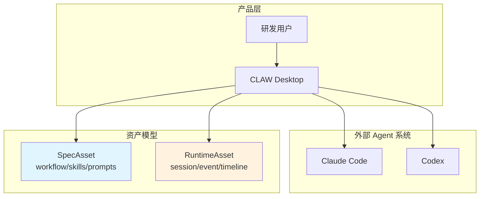
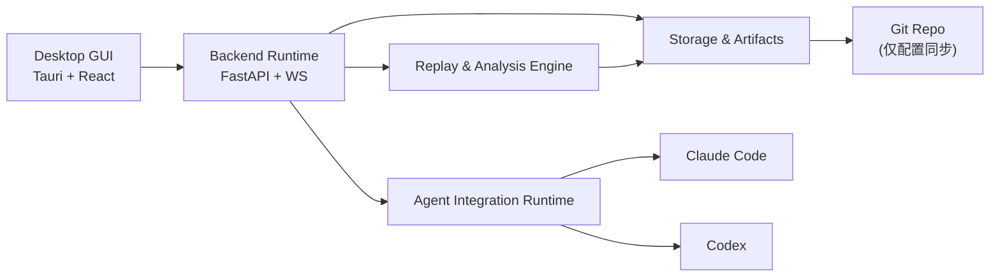
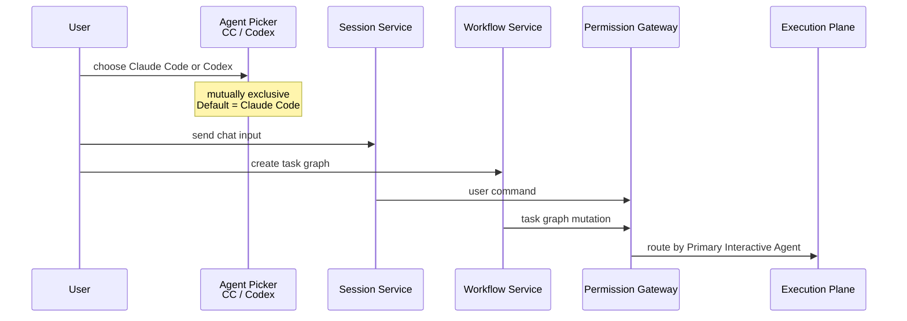
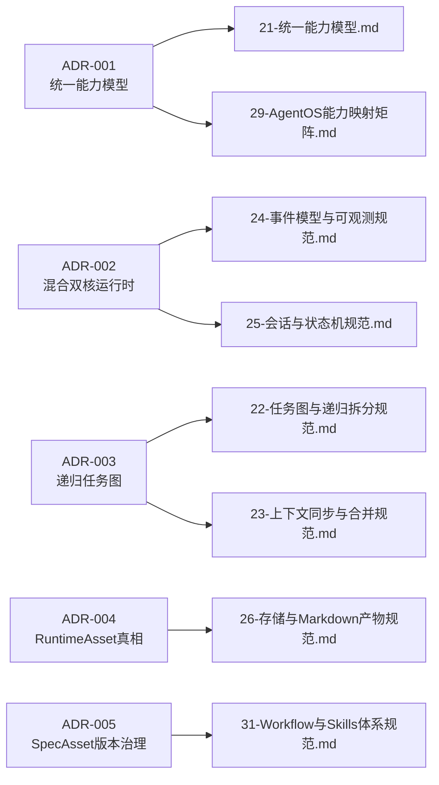
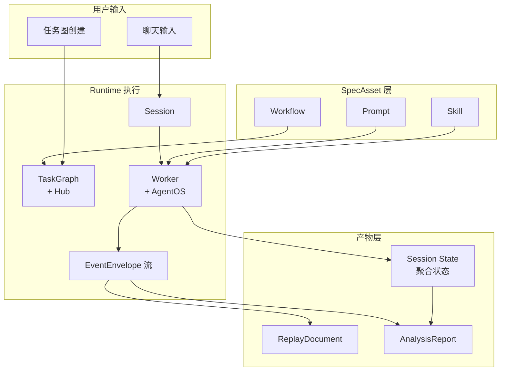

# 产品与工程文档总览

<cite>
**本文引用的文件**

- [doc/README.md](file://doc/README.md)
- [doc/adr/README.md](file://doc/adr/README.md)
- [doc/00-overview/00-产品定义.md](file://doc/00-overview/00-产品定义.md)
- [doc/00-overview/01-设计原则与非目标.md](file://doc/00-overview/01-设计原则与非目标.md)
- [doc/00-overview/02-术语表.md](file://doc/00-overview/02-术语表.md)
- [doc/00-overview/03-文档索引.md](file://doc/00-overview/03-文档索引.md)
- [doc/00-overview/04-问题定义与成功指标.md](file://doc/00-overview/04-问题定义与成功指标.md)
- [doc/10-architecture/10-系统上下文图.md](file://doc/10-architecture/10-系统上下文图.md)
- [doc/CLAW-v1.0-需求架构Spec.md](file://doc/CLAW-v1.0-需求架构Spec.md)
- [doc/CLAW-需求分析文档.md](file://doc/CLAW-需求分析文档.md)
- [doc/CLAW.md](file://doc/CLAW.md)
- [doc/adr/ADR-001-统一能力模型策略.md](file://doc/adr/ADR-001-统一能力模型策略.md)
- [doc/adr/ADR-002-混合双核运行时.md](file://doc/adr/ADR-002-混合双核运行时.md)
- [doc/adr/ADR-003-递归任务图预算与停止策略.md](file://doc/adr/ADR-003-递归任务图预算与停止策略.md)
- [doc/adr/ADR-004-RuntimeAsset真相来源.md](file://doc/adr/ADR-004-RuntimeAsset真相来源.md)
- [doc/adr/ADR-005-SpecAsset版本治理策略.md](file://doc/adr/ADR-005-SpecAsset版本治理策略.md)
- [doc/10-architecture/11-系统容器图.md](file://doc/10-architecture/11-系统容器图.md)
- [doc/10-architecture/12-控制平面组件图.md](file://doc/10-architecture/12-控制平面组件图.md)
</cite>

---

## 目录

1. [文档体系定位](#1-文档体系定位)
2. [分层结构总览](#2-分层结构总览)
3. [L0 总览层：产品边界与术语](#3-l0-总览层产品边界与术语)
4. [L1 架构层：系统蓝图](#4-l1-架构层系统蓝图)
5. [ADR 决策记录：架构红线](#5-adr-决策记录架构红线)
6. [CLAW 草稿与历史输入](#6-claw-草稿与历史输入)
7. [关键对象调用链](#7-关键对象调用链)
8. [Source-of-Truth 与存储边界](#8-source-of-truth-与存储边界)
9. [Agent 改代码地图](#9-agent-改代码地图)
10. [常见问题与排障](#10-常见问题与排障)

---

## 1. 文档体系定位

`doc/` 是 tech-cc-hub 项目的唯一文档入口，承载产品定义、架构蓝图、工程契约和运维规范。

**核心职责**：
- 为新成员提供渐进式披露路径（L0 → L1 → L2 → L3）
- 为实现者提供分层索引，避免在错误层级查找文档
- 记录架构决策（ADR）及其上下文，供后续追溯

**章节来源**：[doc/README.md#L1-L20](file://doc/README.md#L1-L20)

---

## 2. 分层结构总览

文档体系分为五层，每层定义明确边界：

| 层级 | 目录 | 说明 | 状态 |
|------|------|------|------|
| **L0** | `00-overview/` | 产品边界、术语、设计原则 | 活跃 |
| **L1** | `10-architecture/` | C1~C4 图、核心流程 | 活跃 |
| **L2** | `20-contracts/` + `20-specs/` | 协议、类型、状态机规范 | 部分完成 |
| **L3** | `30-operations/` + `40-engineering/` | UI、workflow、回放、开发规范 | 进行中 |
| **产品层** | `40-product/1.0.0/` | PRD、Epic、Story、追踪矩阵 | 旧编号体系 |

**章节来源**：[doc/README.md#L52-L88](file://doc/README.md#L52-L88)

---

## 3. L0 总览层：产品边界与术语

### 3.1 职责

L0 层定义产品是什么、服务谁、解决什么问题，是全部后续规范的**最高层约束**。

### 3.2 文件映射

| 文件 | 职责 | 关键输出 |
|------|------|----------|
| `00-产品定义.md` | 产品定位与边界 | `CLAW = 半托管控制层`、`AgentOS` 抽象 |
| `01-设计原则与非目标.md` | 架构红线 | "不造底层执行内核"、"local-first" |
| `02-术语表.md` | 统一名词 | 38 个核心术语 + Type Name |
| `03-文档索引.md` | 阅读路径 | 推荐阅读顺序、波次计划 |
| `04-问题定义与成功指标.md` | 价值假设 | JTBD、成功指标 (3/6/12 个月) |

### 3.3 核心概念



**关键定义来源**：
- `CLAW`: 构建在 Claude Code、Codex 等 AgentOS 之上的半托管控制层
- `AgentOS`: 提供底层推理、工具调用、会话执行和基础权限模型的外部系统
- `SpecAsset`: workflow、skills、prompts、policies、task templates 等可版本化资产
- `RuntimeAsset`: session、task、event、snapshot、timeline、replay、analysis 等运行资产

**章节来源**：[doc/00-overview/00-产品定义.md#L37-L46](file://doc/00-overview/00-产品定义.md#L37-L46)

### 3.4 设计原则（非目标）

| 原则 | 说明 |
|------|------|
| 上层软件层 | 不接管 LLM 推理或底层工具系统，只增强控制面和观测面 |
| 本地优先 | 本机文件系统是 v1 的事实真相 |
| 双中心 | SpecAsset 和 RuntimeAsset 并列为一等资产 |
| 统一优先 | 优先抽象 Claude Code 和 Codex 的通用能力，再保留扩展位 |
| 回放优先 | 先保证事件到回放闭环，再做高阶分析 |

**章节来源**：[doc/00-overview/01-设计原则与非目标.md#L35-L49](file://doc/00-overview/01-设计原则与非目标.md#L35-L49)

---

## 4. L1 架构层：系统蓝图

### 4.1 职责

L1 层定义系统边界（C1）、容器层级（C2）、组件交互（C3）和核心流程。

### 4.2 文件映射

| 文件 | 层级 | 说明 |
|------|------|------|
| `10-系统上下文图.md` | C1 | CLAW 与用户、AgentOS、本地存储的系统边界 |
| `11-系统容器图.md` | C2 | Desktop GUI、Backend Runtime、Agent Integration、Storage、Replay Engine |
| `12-控制平面组件图.md` | C3 | Chat Workspace、Task Graph、Session Service、Permission Gateway |
| `13-执行平面组件图.md` | C3 | Worker 调度、上下文分发、结果合并 |
| `14-数据与智能平面组件图.md` | C3 | SpecAsset/RuntimeAsset 存储、分析引擎 |
| `15-核心流程图.md` | 流程 | 用户输入 → 任务图 → AgentOS → 事件流 → 回放 → 分析 |

### 4.3 系统容器关系



**图表来源**：[doc/10-architecture/11-系统容器图.md#L43-L52](file://doc/10-architecture/11-系统容器图.md#L43-L52)

### 4.4 控制平面组件交互



**图表来源**：[doc/10-architecture/12-控制平面组件图.md#L46-L71](file://doc/10-architecture/12-控制平面组件图.md#L46-L71)

### 4.5 活跃工程模块

| 模块 | Spec | 入口代码 | 说明 |
|------|------|---------|------|
| Chat / Composer | `40-engineering/chat-composer/spec.md` | `src/ui/components/PromptInput.tsx` | 聊天输入与补全 |
| Preview / Browser Workbench | `40-engineering/preview-workbench/spec.md` | `src/ui/components/PreviewPanel.tsx` | 预览工作台 |
| Activity Rail / Trace | `40-engineering/activity-rail/spec.md` | `src/ui/components/ActivityRail.tsx` | 上下文与时间线 |
| Settings / Skills | `40-engineering/settings-skills/spec.md` | `src/ui/components/settings/` | 设置与 Skills |
| Electron Main / IPC | `40-engineering/electron-ipc/spec.md` | `src/electron/main.ts` | 进程间通信 |

**章节来源**：[doc/README.md#L79-L88](file://doc/README.md#L79-L88)

---

## 5. ADR 决策记录：架构红线

### 5.1 职责

ADR（Architecture Decision Records）记录不可逆的架构决策及其上下文，供后续实现者理解"为什么这样做"。

### 5.2 决策清单

| ID | 标题 | 核心结论 |
|----|------|----------|
| ADR-001 | 统一能力模型策略 | 核心产品流只依赖统一能力模型；无法抽平的能力进入 `extension`；不允许成为主流程硬依赖 |
| ADR-002 | 混合双核运行时 | `EventEnvelope` 为证据真相，`Session/Worker/Context` 聚合状态为产品真相；所有状态变更必须可回链到事件 |
| ADR-003 | 递归任务图预算与停止策略 | 每个 `TaskNode` 必须绑定 `ExecutionBudget`；子任务继承并收窄父任务预算；预算耗尽时必须停止拆分 |
| ADR-004 | RuntimeAsset 真相来源 | 本地文件系统为 v1 RuntimeAsset 事实真相；`runtime/` 保存会话/事件；`artifacts/` 保存回放/分析产物；Git 只同步 SpecAsset |
| ADR-005 | SpecAsset 版本治理策略 | 所有正式 SpecAsset 必须有 `asset_id` 和 `version`；每次改动必须记录 `change_reason`；Session 记录消费了哪些版本 |

### 5.3 ADR 与规范的对应关系



**章节来源**：[doc/adr/ADR-001-统一能力模型策略.md#L28-L33](file://doc/adr/ADR-001-统一能力模型策略.md#L28-L33)
**章节来源**：[doc/adr/ADR-002-混合双核运行时.md#L28-L33](file://doc/adr/ADR-002-混合双核运行时.md#L28-L33)
**章节来源**：[doc/adr/ADR-003-递归任务图预算与停止策略.md#L28-L33](file://doc/adr/ADR-003-递归任务图预算与停止策略.md#L28-L33)
**章节来源**：[doc/adr/ADR-004-RuntimeAsset真相来源.md#L28-L33](file://doc/adr/ADR-004-RuntimeAsset真相来源.md#L28-L33)
**章节来源**：[doc/adr/ADR-005-SpecAsset版本治理策略.md#L28-L33](file://doc/adr/ADR-005-SpecAsset版本治理策略.md#L28-L33)

---

## 6. CLAW 草稿与历史输入

### 6.1 状态说明

以下文档保留在 `doc/` 根目录，属于 CLAW 早期草稿，**不作为当前事实来源**：

| 文件 | 说明 |
|------|------|
| `CLAW.md` | 早期规划文档（v0.1），包含目录结构和数据模型 |
| `CLAW-需求分析文档.md` | 需求分析文档，记录问题域、用户故事、NFR |
| `CLAW-v1.0-需求架构Spec.md` | 需求+架构+Spec 综合文档，含 Hooks 事件定义 |

### 6.2 关键历史符号

**从 `CLAW-v1.0-需求架构Spec.md` 抽取**：

- `BaseAgentAdapter`: Agent 适配器基类，定义 `start()`、`send_message()`、`stop()`、`get_status()`
- `HookHandler`: Hooks 注册处理器
- `HooksConfig`: 返回 Agent 的 Hooks 配置
- `Hub`: 任务分解与 Worker 调度中心
- `WorkerRun`: 一次具体的 Agent 执行实例

**数据模型**：
- 执行日志：`data/logs/{session_id}.jsonl`
- Session 上下文：`data/sessions/{session_id}.md`
- 分析报告：`data/analysis/{session_id}.md`

**14 个 Hooks 事件**：

| 事件 | 捕获内容 |
|------|----------|
| SessionStart | git status、env、初始上下文 |
| UserPromptSubmit | 原始 prompt、长度、时间戳 |
| PreToolUse | 工具名、参数、上下文 |
| PostToolUse | 工具名、结果、耗时、成功状态 |
| PostToolUseFailure | 工具名、错误类型、堆栈 |
| PreCompact | 上下文大小、压缩原因 |
| PostCompact | 压缩后大小、丢失内容 |
| PermissionRequest | 命令详情、是否批准 |
| Notification | 通知内容、类型 |
| Stop | 停止原因、token 消耗 |
| SessionEnd | 最终统计、任务完成状态 |
| SubagentStart | agent 类型、任务描述 |
| SubagentStop | agent 类型、执行结果 |
| TaskCompleted | 任务描述、完成状态 |

**章节来源**：[doc/CLAW-v1.0-需求架构Spec.md#L91-L120](file://doc/CLAW-v1.0-需求架构Spec.md#L91-L120)
**章节来源**：[doc/CLAW-需求分析文档.md#L83-L101](file://doc/CLAW-需求分析文档.md#L83-L101)

---

## 7. 关键对象调用链

### 7.1 用户输入到回放的完整链路



### 7.2 核心类型与 Owner Spec 对应

| Term | Type Name | Owner Spec | 关键字段 |
|------|-----------|------------|----------|
| AgentOS | `AgentOS` | 20-AgentOS集成规范 | - |
| Agent 适配器 | `AgentAdapter` | 20-AgentOS集成规范 | `start()`, `send_message()`, `stop()`, `get_status()` |
| 能力 | `AgentCapability` | 21-统一能力模型 | capability matrix |
| 会话 | `Session` | 25-会话与状态机规范 | session_id, status, workers[] |
| 任务节点 | `TaskNode` | 22-任务图与递归拆分规范 | task_id, budget, dependencies[] |
| 主上下文快照 | `ContextSnapshot` | 23-上下文同步与合并规范 | snapshot_id, ts, full_context |
| 上下文差异 | `ContextDiff` | 23-上下文同步与合并规范 | diff_id, before, after, delta |
| 事件信封 | `EventEnvelope` | 24-事件模型与可观测规范 | ts, type, payload, source |
| 回放文档 | `ReplayDocument` | 32-回放与分析报告规范 | session_id, events[], timeline[] |
| 分析报告 | `AnalysisReport` | 32-回放与分析报告规范 | session_id, metrics[], recommendations[] |

**章节来源**：[doc/00-overview/02-术语表.md#L37-L51](file://doc/00-overview/02-术语表.md#L37-L51)

---

## 8. Source-of-Truth 与存储边界

### 8.1 真相层次

| 资产类型 | Source-of-Truth | 存储位置 | Git 同步 |
|----------|-----------------|----------|----------|
| `SpecAsset` | 本地文件系统（正式版本） | `~/.claw/specs/` | ✅ 配置类同步 |
| `RuntimeAsset` | 本地文件系统 | `~/.claw/runtime/` | ❌ 不入 Git |
| `Artifact` | 本地文件系统 | `~/.claw/artifacts/` | ❌ 不入 Git |
| 运行时状态 | 内存 + 事件流 | - | - |

**章节来源**：[doc/adr/ADR-004-RuntimeAsset真相来源.md#L28-L33](file://doc/adr/ADR-004-RuntimeAsset真相来源.md#L28-L33)

### 8.2 运行时刷新边界

| 组件 | 刷新机制 | 重启边界 |
|------|----------|----------|
| Session State | 内存聚合，变更写入 `EventEnvelope` | 应用重启后从事件流重建 |
| Task Graph | 内存 + 本地持久化 | 应用重启后加载最近快照 |
| SpecAsset | 本地文件系统读取 | 修改后需手动触发重载 |
| ReplayDocument | 从事件流生成 | 生成后不可变 |

### 8.3 前后端桥接点

| 通道 | 技术 | 用途 | 入口文件 |
|------|------|------|----------|
| HTTP REST | FastAPI | Session CRUD、SpecAsset 操作 | `src/electron/main.ts` |
| WebSocket | FastAPI WS | 实时日志流、事件推送 | `src/electron/main.ts` |
| Electron IPC | IPC Channel | 前端 ↔ Electron Main 通信 | `src/electron/main.ts` |

---

## 9. Agent 改代码地图

### 9.1 先读文件清单

| 优先级 | 文件 | 原因 |
|--------|------|------|
| P0 | `doc/README.md` | 文档体系入口，了解模块分布 |
| P0 | `doc/00-overview/02-术语表.md` | 统一术语，避免概念漂移 |
| P0 | `doc/10-architecture/12-控制平面组件图.md` | 组件关系和 IPC 路由 |
| P1 | `doc/40-engineering/*/spec.md` | 目标模块的详细契约 |
| P1 | `doc/adr/ADR-002-混合双核运行时.md` | EventEnvelope 与状态同步策略 |
| P2 | `doc/20-specs/24-事件模型与可观测规范.md` | 事件 schema 和类型定义 |

### 9.2 关键符号与 IPC 工具

| 类别 | 符号/工具 | 位置 | 说明 |
|------|-----------|------|------|
| 前端入口 | `PromptInput.tsx` | `src/ui/components/` | Chat Composer 入口 |
| 前端入口 | `PreviewPanel.tsx` | `src/ui/components/` | Browser Workbench |
| 前端入口 | `ActivityRail.tsx` | `src/ui/components/` | Context Rail |
| Electron 入口 | `main.ts` | `src/electron/` | IPC 通道定义 |
| 状态聚合 | `Session` | `doc/20-specs/25-会话与状态机规范.md` | Session 状态机 |
| 事件总线 | `EventEnvelope` | `doc/20-specs/24-事件模型与可观测规范.md` | 14 个 Hooks 事件 |

### 9.3 修改入口矩阵

| 修改目标 | 涉及文件 | 关键修改点 |
|----------|----------|------------|
| 新增 UI 组件 | `src/ui/components/*.tsx` | 注册到 `App.tsx`、添加 IPC handler |
| 新增 IPC 通道 | `src/electron/main.ts` | 定义 channel name、实现 handler |
| 新增事件类型 | `doc/20-specs/24-事件模型与可观测规范.md` | 定义 `EventEnvelope` payload schema |
| 新增 SpecAsset | `~/.claw/specs/` | 创建 `asset_id`、写入 `version` |
| 修改会话状态 | `doc/20-specs/25-会话与状态机规范.md` | 明确 State Transition |

### 9.4 验证命令

| 验证目标 | 命令/操作 |
|----------|----------|
| 前端构建 | `npm run build` |
| Electron 启动 | `npm run tauri dev` |
| 文档坏链检查 | `python doc/_tools/check_doc_links.py` |
| Frontmatter 校验 | `python doc/_tools/validate_frontmatter.py` |
| 事件流连通性 | 打开 DevTools → Network → WebSocket → 查看 `EventEnvelope` 消息 |

### 9.5 常见回归风险

| 风险 | 描述 | 缓解措施 |
|------|------|----------|
| EventEnvelope schema 变更 | 新增字段未同步到 `25-会话与状态机规范.md` | 维护 `28-关键对象最小Schema.md` |
| IPC channel 命名冲突 | 多模块使用相同 channel name | 统一 channel 命名规范（在 `12-控制平面组件图.md` 中定义） |
| SpecAsset 版本漂移 | 修改未记录 `change_reason` | 遵守 ADR-005，在 commit message 中注明 |
| Session State 与事件流不一致 | 聚合状态未反映最新事件 | 遵循 ADR-002，所有状态变更必须可回链到事件 |

---

## 10. 常见问题与排障

### 10.1 文档找不到目标文件

**症状**：在 `doc/` 下找不到某个模块的详细规范。

**排查步骤**：

1. 先检查 `doc/README.md` 的模块索引表格
2. 如果模块属于活跃工程（Chat/Preview/Activity Rail/Settings/Electron），查找 `doc/40-engineering/*/spec.md`
3. 如果涉及协议或类型定义，查找 `doc/20-contracts/` 或 `doc/20-specs/`
4. 如果确认模块不在任何索引中，标记为"孤儿文档"，使用 `doc/_tools/check_doc_links.py` 扫描

### 10.2 架构决策不清晰

**症状**：某个设计选择不知道原因。

**排查步骤**：

1. 在 `doc/adr/` 目录下搜索关键词
2. 检查该决策是否影响其他 ADR（查看 ADR Links 章节）
3. 如果是历史决策（CLAW 草稿时期），以 `doc/CLAW.md` 或 `doc/CLAW-v1.0-需求架构Spec.md` 为参考，但标注为"待验证"

### 10.3 Frontmatter 校验失败

**症状**：`validate_frontmatter.py` 报告格式错误。

**排查要点**：

- `doc_id`: 唯一标识符，不能重复
- `layer`: 必须是 `L0/L1/L2/L3` 或 `adr`
- `status`: 必须是 `active/draft/deprecated`
- `owners`: 至少一人

### 10.4 跨文档引用坏链

**症状**：文档中的链接指向的文件不存在。

**排查命令**：

```bash
python doc/_tools/check_doc_links.py
```

该脚本会扫描 `doc/` 下所有 Markdown 文件的链接，报告无效链接。

**章节来源**：[doc/README.md#L143-L144](file://doc/README.md#L143-L144)

---

## 附录 A：文档分层速查

```
doc/
├── 00-overview/         # L0: 产品边界 + 术语 + 阅读路径
├── 10-architecture/    # L1: C1~C4 图 + 核心流程
├── 20-contracts/        # L2: IPC/事件/配置/状态机 spec
├── 20-specs/            # L2: 能力模型/任务图/会话规范
├── 30-operations/       # L3: 前端信息架构/workflow/回放
├── 40-engineering/      # L3: 活跃模块详细 spec
├── 40-product/          # 产品层: PRD/Epic/Story
├── 50-quality/          # 质量与验收
├── 80-operations/       # 运维: 构建/发布/QA
├── 90-archive/          # 历史归档
├── adr/                 # 架构决策记录
├── _standards/          # 文档写作规范
├── _templates/          # 模板文件
└── _tools/              # 校验脚本
```

---

## 附录 B：快速导航

| 需求 | 入口文件 |
|------|----------|
| 理解产品定位 | `doc/00-overview/00-产品定义.md` |
| 了解系统架构 | `doc/10-architecture/10-系统上下文图.md` |
| 理解核心概念 | `doc/00-overview/02-术语表.md` |
| 查找某模块 spec | `doc/40-engineering/{module}/spec.md` |
| 理解架构决策 | `doc/adr/ADR-*.md` |
| 理解事件模型 | `doc/20-specs/24-事件模型与可观测规范.md` |
| 理解会话状态 | `doc/20-specs/25-会话与状态机规范.md` |

---

**文档元信息**

- `doc_id`: DOC-PRODUCT-ENGINEERING-OVERVIEW
- `layer`: `root`
- `status`: `active`
- `version`: `1.0.0`
- `last_updated`: `2026-05-01`
- `owners`: `tech-cc-hub Core`