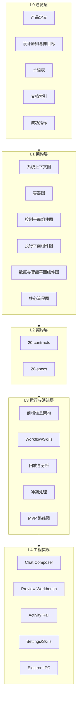
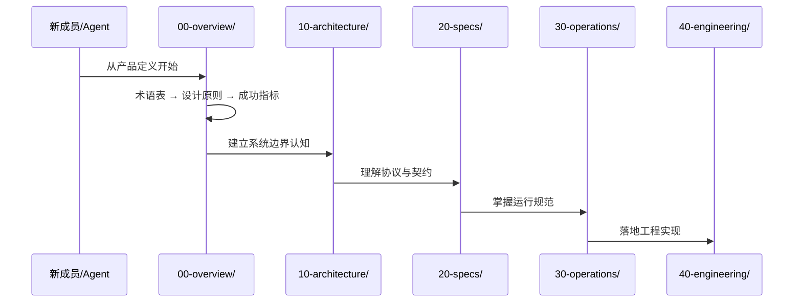
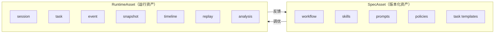

# 产品与工程文档总览

---
doc_id: "MODULE-DOCS-OVERVIEW"
title: "产品与工程文档总览"
doc_type: "module-wiki"
layer: "docs"
status: "active"
version: "1.0.0"
last_updated: "2026-05-01"
owners:
  - "tech-cc-hub Core"
tags:
  - "tech-cc-hub"
  - "docs"
  - "module-docs"
  - "overview"
---

# 产品与工程文档总览

<cite>

**本文引用的文件**

- [doc/README.md](file://doc/README.md)
- [doc/adr/README.md](file://doc/adr/README.md)
- [doc/00-overview/00-产品定义.md](file://doc/00-overview/00-产品定义.md)
- [doc/00-overview/01-设计原则与非目标.md](file://doc/00-overview/01-设计原则与非目标.md)
- [doc/00-overview/02-术语表.md](file://doc/00-overview/02-术语表.md)
- [doc/00-overview/03-文档索引.md](file://doc/00-overview/03-文档索引.md)
- [doc/00-overview/04-问题定义与成功指标.md](file://doc/00-overview/04-问题定义与成功指标.md)
- [doc/10-architecture/10-系统上下文图.md](file://doc/10-architecture/10-系统上下文图.md)
- [src/electron/libs/git/README.md](file://src/electron/libs/git/README.md)

</cite>

---

## 目录

- [1. 模块概述](#1-模块概述)
- [2. 分层架构与职责](#2-分层架构与职责)
- [3. 文档入口与调用链](#3-文档入口与调用链)
- [4. 核心数据结构](#4-核心数据结构)
- [5. 关键模块详解](#5-关键模块详解)
- [6. 扩展点与改造路径](#6-扩展点与改造路径)
- [7. 验证命令与排障指南](#7-验证命令与排障指南)
- [8. 小结](#8-小结)

---

## 1. 模块概述

本模块 (`doc/`) 承载 **tech-cc-hub** 产品的全部文档资产，涵盖产品定义、工程契约、架构蓝图、运行规范和版本化交付物。

**核心定位**：
- CLAW 是构建在 Claude Code、Codex 等 AgentOS 之上的**半托管控制层**
- 文档体系服务于 "把 Agent 使用过程变成可回放、可追责、可持续调优的系统" 这一核心价值

**文档范围**：

| 层级 | 目录 | 说明 |
|------|------|------|
| L0 | `00-overview/` | 产品边界、术语、设计原则、成功指标 |
| L1 | `10-architecture/` | 系统上下文图、容器图、组件图 |
| L2 | `20-contracts/`、 `20-specs/` | IPC、事件、状态机、能力模型、任务图等契约 |
| L3 | `30-operations/` | 前端信息架构、Workflow/Skills、回放分析、MVP 路线图 |
| L4 | `40-engineering/` | 各工程模块的 spec 文档（Chat、Preview、Activity Rail、Settings、Electron IPC） |
| 版本化产品 | `40-product/1.0.0/` | PRD、用户故事、Epic、交付计划、组件索引 |

> **章节来源**：[doc/README.md#L1-L27](file://doc/README.md#L1-L27)

---

## 2. 分层架构与职责

### 2.1 分层概览

文档体系采用四层 + 版本化产品的分层结构：



### 2.2 各层职责定义

**L0 总览层**：定义产品边界与术语统一

- `00-产品定义.md`：定义 CLAW 是什么、服务谁、v1 非目标 [doc/README.md#L31-L48](file://doc/README.md#L31-L48)
- `01-设计原则与非目标.md`：约束架构红线，防止"做平台"还是"做壳子"的摇摆 [doc/00-overview/01-设计原则与非目标.md#L1-L34](file://doc/00-overview/01-设计原则与非目标.md#L1-L34)
- `02-术语表.md`：统一核心对象命名，避免跨文档歧义 [doc/00-overview/02-术语表.md#L35-L60](file://doc/00-overview/02-术语表.md#L35-L60)
- `03-文档索引.md`：提供渐进式阅读路径与波次计划 [doc/00-overview/03-文档索引.md#L41-L73](file://doc/00-overview/03-文档索引.md#L41-L73)

**L1 架构层**：定义系统边界与组件关系

- `10-系统上下文图.md`：C1 级图，定义 CLAW 与用户、AgentOS、存储的关系 [doc/10-architecture/10-系统上下文图.md#L42-L50](file://doc/10-architecture/10-系统上下文图.md#L42-L50)
- `15-核心流程图.md`：主链路 `用户输入 -> 任务图 -> AgentOS 执行 -> 事件入流 -> 回放生成 -> 分析输出`

**L2 契约层**：定义协议、类型、状态机

- `20-contracts/INDEX.md`：IPC、事件、session-lifecycle、配置模型的规范入口
- `20-specs/20-AgentOS集成规范.md`：AgentAdapter 接口与 AgentOS 能力声明
- `20-specs/22-任务图与递归拆分规范.md`：TaskNode 定义与递归拆分策略
- `20-specs/24-事件模型与可观测规范.md`：EventEnvelope 格式与事件溯源
- `20-specs/25-会话与状态机规范.md`：Session 生命周期与状态机

**L4 工程实现层**：各模块规格文档

| 模块 | Spec 路径 | 入口代码 |
|------|----------|----------|
| Chat / Composer | [40-engineering/chat-composer/spec.md](file://doc/40-engineering/chat-composer/spec.md) | `src/ui/components/PromptInput.tsx` |
| Preview / Browser Workbench | [40-engineering/preview-workbench/spec.md](file://doc/40-engineering/preview-workbench/spec.md) | `src/ui/components/PreviewPanel.tsx` |
| Activity Rail / Trace | [40-engineering/activity-rail/spec.md](file://doc/40-engineering/activity-rail/spec.md) | `src/ui/components/ActivityRail.tsx` |
| Settings / Skills | [40-engineering/settings-skills/spec.md](file://doc/40-engineering/settings-skills/spec.md) | `src/ui/components/settings/` |
| Electron Main / IPC | [40-engineering/electron-ipc/spec.md](file://doc/40-engineering/electron-ipc/spec.md) | `src/electron/main.ts` |

> **章节来源**：[doc/README.md#L79-L88](file://doc/README.md#L79-L88)

---

## 3. 文档入口与调用链

### 3.1 主入口：doc/README.md

`doc/README.md` 是文档体系的唯一入口，定义各层索引表：

```text
Start Here
├── CLAUDE.md → 开发环境、命令、编码规范
├── AGENTS.md → 项目入口规则、Session 级决策
└── 软件工程文档体系规范 → 本文档体系规则定义

Architecture
├── 10-系统上下文图 → C1 系统边界
├── 11-系统容器图 → C2 容器层级
└── 15-核心流程图 → 核心流程

Engineering（活跃模块）
├── Chat / Composer
├── Preview / Browser Workbench
└── Electron Main / IPC
```

### 3.2 阅读路径调用链

新成员应按以下顺序阅读：



**推荐阅读顺序**（来自 [03-文档索引.md#L42-L73](file://doc/00-overview/03-文档索引.md#L42-L73)）：

1. **入门**：`00-产品定义` → `01-设计原则与非目标` → `04-问题定义与成功指标`
2. **架构**：`10-系统上下文图` → `11-系统容器图` → `15-核心流程图`
3. **运行时**：`20-AgentOS集成规范` → `22-任务图与递归拆分规范` → `24-事件模型` → `25-会话与状态机`
4. **前端**：`30-前端信息架构` → `31-Workflow与Skills体系` → `32-回放与分析报告`

### 3.3 文档间引用关系

- **自上而下**：L0 约束 L1，L1 约束 L2，L2 约束 L3/L4
- **横向协同**：`30-operations/35-ADR目录.md` 记录技术决策，ADR 文件位于 `doc/adr/`
- **版本关联**：`40-product/1.0.0/` 下的 PRD/Epic 与 L2 规范必须一一对应

---

## 4. 核心数据结构

### 4.1 核心对象术语（来自 [02-术语表.md#L35-L52](file://doc/00-overview/02-术语表.md#L35-L52)）

| 术语 | 类型名 | 定义 |
|------|--------|------|
| AgentOS | `AgentOS` | 提供底层执行能力的外部 Agent 系统 |
| Agent 适配器 | `AgentAdapter` | CLAW 对 AgentOS 的统一集成接口 |
| 能力 | `AgentCapability` | AgentOS 可声明的标准化能力集合 |
| 会话 | `Session` | 用户级执行上下文与生命周期容器 |
| 任务节点 | `TaskNode` | 任务图中的最小可调度单元 |
| Worker 执行 | `WorkerRun` | 一次具体的 Agent 执行实例 |
| 主上下文快照 | `ContextSnapshot` | 某时刻的上下文完整视图 |
| 上下文差异 | `ContextDiff` | 快照之间的增量同步对象 |
| 事件信封 | `EventEnvelope` | 所有运行时事件的统一承载格式 |
| 规范资产 | `SpecAsset` | workflow、skills、prompts、policies 等可版本化资产 |
| 运行资产 | `RuntimeAsset` | logs、state、timeline、report 等运行产生的资产 |

### 4.2 SpecAsset vs RuntimeAsset 的分层管理

根据 [01-设计原则与非目标.md#L48](file://doc/00-overview/01-设计原则与非目标.md#L48)，**SpecAsset 和 RuntimeAsset 必须分层管理、单独建模**：



> **图表来源**：[00-产品定义.md#L35-L46](file://doc/00-overview/00-产品定义.md#L35-L46)

---

## 5. 关键模块详解

### 5.1 Electron IPC 模块

**职责**：作为 Electron 主进程与渲染进程之间的唯一通信通道。

**边界文件**（来自 [src/electron/libs/git/README.md](file://src/electron/libs/git/README.md#L1-L14) 的模式参考）：

```
src/electron/libs/git/
├── types.ts      # 领域类型和 IPC payload/result
├── errors.ts     # 错误归一化
├── service.ts    # 唯一操作入口
├── history.ts    # commit history parser
├── graph.ts      # lightweight graph lane 生成
├── operation-log.ts  # 本地高影响操作日志
├── ipc.ts        # Electron IPC handler 注册
└── index.ts      # 对外统一出口
```

**调用链**：

```
Renderer (UI) → IPC invoke → Main Process Service → OS Operation
                ↑                              ↓
                ← IPC response ←──────────────┘
```

**IPC 通道类型**：

| 通道 | 用途 |
|------|------|
| `git:status` | 获取仓库状态 |
| `git:commit` | 执行提交 |
| `git:branch:*` | 分支操作 |
| `git:stash:*` | 暂存操作 |

### 5.2 Chat Composer 模块

**入口**：`src/ui/components/PromptInput.tsx`

**职责**：用户输入的统一入口，支持多模态（文字、文件上下文、命令）。

**关键状态流**：

```
User Input → PromptInput.tsx → ChatController → AgentAdapter → AgentOS
                                          ↓
                                   EventEnvelope 生成
                                          ↓
                                   ActivityRail 更新
```

### 5.3 Activity Rail / Trace 模块

**入口**：`src/ui/components/ActivityRail.tsx`

**职责**：呈现执行时间线、回放入口和状态轨迹。

**数据结构**（来自 [24-事件模型与可观测规范.md](file://doc/20-specs/24-%E4%BA%8B%E4%BB%B6%E6%A8%A1%E5%9E%8B%E4%B8%8E%E5%8F%AF%E8%A7%82%E6%B5%8B%E8%A7%84%E8%8C%83.md)）：

```typescript
interface EventEnvelope {
  id: string;           // 事件唯一标识
  sessionId: string;   // 所属会话
  timestamp: number;    // Unix 时间戳
  type: EventType;     // 事件类型
  payload: unknown;     // 事件数据
  source: 'user' | 'agent' | 'system';
}
```

---

## 6. 扩展点与改造路径

### 6.1 新增 Spec 的流程

1. 在 `02-术语表.md` 中新增术语定义
2. 在对应层级的 spec 目录创建规范文件
3. 在 `20-contracts/INDEX.md` 或 `40-engineering/INDEX.md` 中注册
4. 在 `03-文档索引.md` 中更新阅读路径

### 6.2 引入新 AgentOS 的扩展路径

根据 [20-AgentOS集成规范.md](file://doc/20-specs/20-AgentOS%E9%9B%86%E6%88%90%E8%A7%84%E8%8C%83.md)：

1. 实现 `AgentAdapter` 接口
2. 在 `21-统一能力模型.md` 中声明能力
3. 在 `29-AgentOS能力映射矩阵.md` 中添加映射关系
4. 更新 `12-执行平面组件图.md`

### 6.3 引入云端协作的改造路径

根据 [01-设计原则与非目标.md#L68-L69](file://doc/00-overview/01-设计原则与非目标.md#L68-L69)：

> v1 是 `local-first / single-user / desktop-first`。未来若决定引入云端协作，需要**单独新增 ADR**。

改造路径：
1. 新增 ADR 决策文档
2. 仅扩展 `10-系统上下文图.md`，不修改 v1 边界定义
3. 分离 SpecAsset 与 RuntimeAsset 的存储后端

### 6.4 非目标（避免的改造方向）

| 非目标 | 原因 | 来源 |
|--------|------|------|
| 不实现新的通用推理 runtime | CLAW 是控制层，不是执行内核 | [01-设计原则与非目标.md#L58-L59](file://doc/00-overview/01-设计原则与非目标.md#L58-L59) |
| 不在 v1 引入多租户 | 保持本地优先的简单性 | 同上 |
| 不将 RuntimeAsset 与 SpecAsset 混写 | 破坏回放与调优的可追踪性 | [00-产品定义.md#L73-L74](file://doc/00-overview/00-产品定义.md#L73-L74) |

---

## 7. 验证命令与排障指南

### 7.1 文档结构验证

```bash
# 检查 Frontmatter 规范
python doc/_tools/audit_frontmatter.py

# 检查文档链接完整性
python doc/_tools/check_doc_links.py
```

### 7.2 坏链检查脚本用法

来自 [doc/README.md#L143-L144](file://doc/README.md#L143-L144)：

```bash
# 检查所有文档的内部链接
python doc/_tools/check_doc_links.py --path doc/

# 输出格式：列出断链文件和具体行号
# 返回码：0 表示全部通过，1 表示有断链
```

### 7.3 文档迁移状态检查

查看 [doc/README.md#L147-L157](file://doc/README.md#L147-L157) 的迁移进度：

```text
- [x] 冻结旧编号增长（禁止 73+ 流水账）
- [x] 建立新目录骨架（00-90 层）
- [x] 创建 Initial INDEX
- [x] 重写 doc/README.md 为 v2 入口
- [x] 逐模块提取 spec（5/5 完成）
- [x] 补充 20-contracts 层独立 spec
- [ ] 迁移 80-operations 下的正式 runbook（待完成）
- [x] 补充坏链检查与孤儿文档检查脚本
```

### 7.4 常见问题排查

| 问题 | 检查项 | 来源 |
|------|--------|------|
| 新文档找不到入口 | 检查 `03-文档索引.md` 是否更新 | [03-文档索引.md#L127](file://doc/00-overview/03-文档索引.md#L127) |
| 术语有歧义 | 查阅 `02-术语表.md`，以 owner spec 为准 | [02-术语表.md#L62](file://doc/00-overview/02-术语表.md#L62) |
| 规范与实现脱节 | 检查 `40-engineering/` 下是否有对应 spec | [doc/README.md#L79-L88](file://doc/README.md#L79-L88) |

---

## 8. 小结

`doc/` 模块是 tech-cc-hub 的文档体系核心，通过四层结构（总览 → 架构 → 契约 → 运行与工程）实现渐进式披露：

| 分层 | 核心价值 | 入口文件 |
|------|----------|----------|
| L0 总览 | 建立统一认知基线 | `00-overview/00-产品定义.md` |
| L1 架构 | 定义系统边界与组件 | `10-architecture/10-系统上下文图.md` |
| L2 契约 | 约束协议与数据类型 | `20-contracts/INDEX.md` |
| L3 运行 | 指导 UI 与 workflow | `30-operations/30-前端信息架构.md` |
| L4 工程 | 落地工程实现 | `40-engineering/INDEX.md` |

**关键设计原则**（来自 [01-设计原则与非目标.md#L42-L50](file://doc/00-overview/01-设计原则与非目标.md#L42-L50)）：

1. CLAW 是 AgentOS 的**半托管控制层**，不是自研底层执行内核
2. v1 是 `local-first / single-user / desktop-first`
3. SpecAsset 和 RuntimeAsset 必须**分层管理、单独建模**
4. 递归任务图必须经过**策略层约束**，不能无边界失控
5. 同一概念只能有**一个主规范 owner**

> **图表来源**：[10-系统上下文图.md#L42-L50](file://doc/10-architecture/10-系统上下文图.md#L42-L50) - 系统上下文图定义 CLAW 与外部系统的交互边界

---

**关联文档**

- [CLAUDE.md](../CLAUDE.md) — 开发环境、命令、编码规范
- [AGENTS.md](../AGENTS.md) — 项目入口规则、Session 级决策
- [软件工程文档体系规范](_standards/软件工程文档体系规范.md) — 本文档体系的完整规则
- [文档贡献规范](_standards/文档贡献规范.md) — 旧版规范（部分内容待合并）

</markdown>