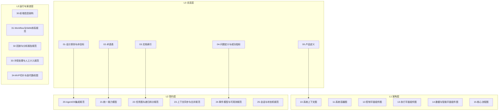
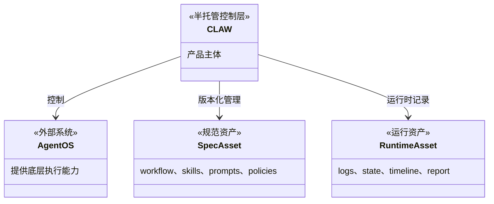
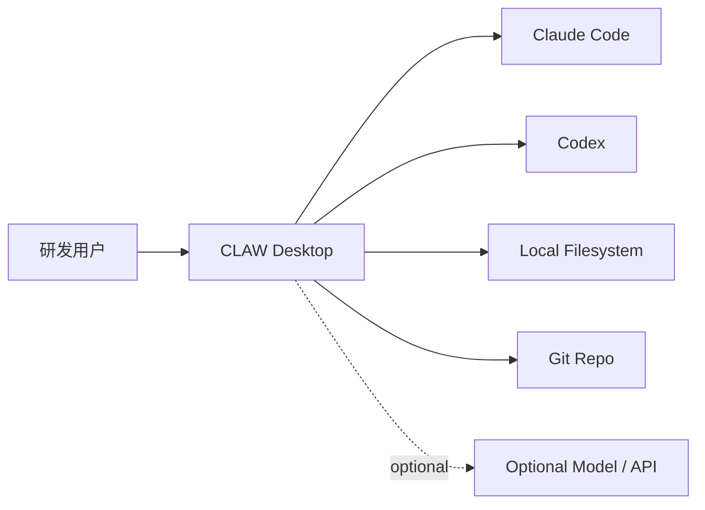
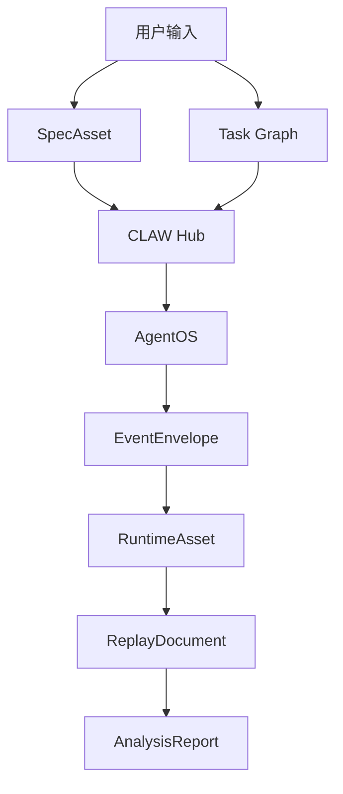
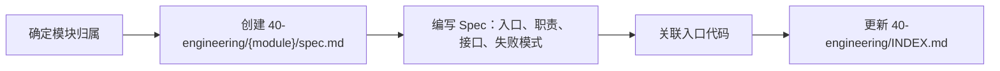

# 产品与工程文档总览

<cite>

**本文引用的文件**

- [doc/README.md](file://doc/README.md)
- [doc/adr/README.md](file://doc/adr/README.md)
- [doc/00-overview/00-产品定义.md](file://doc/00-overview/00-产品定义.md)
- [doc/00-overview/01-设计原则与非目标.md](file://doc/00-overview/01-设计原则与非目标.md)
- [doc/00-overview/02-术语表.md](file://doc/00-overview/02-术语表.md)
- [doc/00-overview/03-文档索引.md](file://doc/00-overview/03-文档索引.md)
- [doc/00-overview/04-问题定义与成功指标.md](file://doc/00-overview/04-问题定义与成功指标.md)
- [doc/10-architecture/10-系统上下文图.md](file://doc/10-architecture/10-系统上下文图.md)
- [src/electron/libs/git/README.md](file://src/electron/libs/git/README.md)

</cite>

---

## 目录

- [系统概述](#系统概述)
- [文档分层架构](#文档分层架构)
- [L0 总览层](#l0-总览层)
- [L1 架构层](#l1-架构层)
- [L2 契约层](#l2-契约层)
- [L3 运行与演进层](#l3-运行与演进层)
- [工程实现层](#工程实现层)
- [质量与运维层](#质量与运维层)
- [扩展点与改造路径](#扩展点与改造路径)
- [验证命令](#验证命令)

---

## 系统概述

`tech-cc-hub` 文档体系是一套分层治理的结构化文档系统，服务于 CLAW（半托管控制层）项目。该文档体系覆盖产品定义、架构设计、工程契约、实现方案和质量验收全链路。

文档体系的 **核心价值主张**：

> 让 Agent 使用过程从一次性执行，进化成可回放、可追责、可持续调优的系统。

章节来源：[doc/00-overview/00-产品定义.md#L44-L57](file://doc/00-overview/00-产品定义.md#L44-L57)

### 文档生态概览



图表来源：[doc/00-overview/03-文档索引.md#L75-L115](file://doc/00-overview/03-文档索引.md#L75-L115)

---

## 文档分层架构

文档体系采用 **L0-L3 + 版本化产品层** 的分层结构，每层有明确职责边界和演进规则。

| 层级 | 目录前缀 | 职责 | 状态 |
|------|----------|------|------|
| L0 | `00-overview/` | 产品定义、设计原则、术语、索引、成功指标 | 活跃 |
| L1 | `10-architecture/` | 系统上下文、容器图、组件图、核心流程 | 活跃 |
| L2 | `20-specs/` + `20-contracts/` | 协议规范、能力模型、事件模型、状态机 | 演进中 |
| L3 | `30-operations/` | 前端架构、Workflow、回放、冲突处理、路线图 | 演进中 |
| 产品层 | `40-product/` | 版本化 PRD、Epic、Story、开发计划 | 迁移中 |
| 工程层 | `40-engineering/` | 模块 Spec、入口代码、关联路径 | 活跃 |
| 质量层 | `50-quality/` | QA 规范、验收核对表 | 活跃 |
| 运维层 | `80-operations/` | 构建、打包、发布、自动更新 | 演进中 |
| 归档层 | `90-archive/` | 历史迭代计划、复盘、旧版文档 | 冻结 |

章节来源：[doc/README.md#L29-L156](file://doc/README.md#L29-L156)

---

## L0 总览层

### 职责

L0 层是文档体系的最高约束层，定义产品边界、架构红线、统一术语和成功指标。所有后续规范必须服从 L0 的约束。

### 入口文件

| 文件 | 职责 |
|------|------|
| `doc/00-overview/00-产品定义.md` | 定义 CLAW 产品定位、目标用户、核心价值、系统边界 |
| `doc/00-overview/01-设计原则与非目标.md` | 固定架构红线，明确"做什么"和"不做什么" |
| `doc/00-overview/02-术语表.md` | 统一核心术语，避免跨文档歧义 |
| `doc/00-overview/03-文档索引.md` | 提供渐进式披露的阅读路径 |
| `doc/00-overview/04-问题定义与成功指标.md` | 定义问题空间、JTBD、3/6/12 个月成功标准 |

### 核心概念



章节来源：[doc/00-overview/00-产品定义.md#L37-L46](file://doc/00-overview/00-产品定义.md#L37-L46)

### 设计原则（非目标）

1. **不接管底层执行内核**：CLAW 是 AgentOS 的半托管控制层，不是自研底层执行内核
2. **v1 约束**：local-first / single-user / desktop-first
3. **资产分层**：SpecAsset 和 RuntimeAsset 必须分层管理、单独建模
4. **递归边界**：任务图允许持续细拆，但必须经过策略层约束
5. **唯一规范 Owner**：同一概念只能有一个主规范 owner

章节来源：[doc/00-overview/01-设计原则与非目标.md#L42-L49](file://doc/00-overview/01-设计原则与非目标.md#L42-L49)

### 关键术语

| 术语 | 英文类型名 | 定义 | Owner |
|------|-----------|------|-------|
| AgentOS | `AgentOS` | 提供底层执行能力的外部 Agent 系统 | L2 |
| 能力 | `AgentCapability` | AgentOS 可声明的标准化能力集合 | L2 |
| 会话 | `Session` | 用户级执行上下文与生命周期容器 | L2 |
| 任务节点 | `TaskNode` | 任务图中的最小可调度单元 | L2 |
| 事件信封 | `EventEnvelope` | 所有运行时事件的统一承载格式 | L2 |
| 回放文档 | `ReplayDocument` | 由事件重建出的可读执行记录 | L3 |

章节来源：[doc/00-overview/02-术语表.md#L35-L52](file://doc/00-overview/02-术语表.md#L35-L52)

---

## L1 架构层

### 职责

L1 层定义 CLAW 的系统边界、容器层级、核心组件和执行流程。采用 C1-C3 架构视图方法论。

### 入口文件

| 文件 | 说明 |
|------|------|
| `doc/10-architecture/10-系统上下文图.md` | C1 系统边界，定义与外部系统的交互 |
| `doc/10-architecture/11-系统容器图.md` | C2 容器层级，展示应用进程划分 |
| `doc/10-architecture/12-控制平面组件图.md` | C3 控制平面组件 |
| `doc/10-architecture/13-执行平面组件图.md` | C3 执行平面组件 |
| `doc/10-architecture/14-数据与智能平面组件图.md` | C3 数据与智能平面组件 |
| `doc/10-architecture/15-核心流程图.md` | 核心业务链路 |

### 系统上下文



**关键约束**：

- User 与 CLAW 之间通过 Chat、Task Graph、Replay/Analysis 交互
- CLAW 与 AgentOS 之间通过 Session control、Message transport、Event normalization 交互
- CLAW 与存储之间通过 SpecAsset read/write、RuntimeAsset append/snapshot 交互
- Git Repo 负责同步配置类资产，**不承载 v1 全量运行时真相**

章节来源：[doc/10-architecture/10-系统上下文图.md#L41-L70](file://doc/10-architecture/10-系统上下文图.md#L41-L70)

### 组件关系

| 平面 | 职责 | 组件类型 |
|------|------|----------|
| 控制平面 | 用户控制、任务编排、权限决策、协同视图 | ChatComposer、TaskGraph、SessionSidebar |
| 执行平面 | 与 AgentOS 的会话桥接、Worker 调度、事件接入、结果回写 | AgentAdapter、WorkerPool、EventIngestion |
| 数据与智能平面 | SpecAsset 管理、RuntimeAsset 存储、分析与回放 | SpecStore、RuntimeStore、Analyzer |

---

## L2 契约层

### 职责

L2 层定义系统内部的协议契约、数据模型、状态机和持久化规范。是工程实现的直接指导。

### 入口文件

| 目录/文件 | 职责 |
|-----------|------|
| `doc/20-contracts/INDEX.md` | 契约层总入口 |
| `doc/20-contracts/config/spec.md` | 配置模型规范 |
| `doc/20-contracts/events/spec.md` | 事件模型规范 |
| `doc/20-contracts/ipc/spec.md` | IPC 协议规范 |
| `doc/20-contracts/session-lifecycle/spec.md` | 会话生命周期规范 |
| `doc/20-specs/20-AgentOS集成规范.md` | AgentOS 统一集成接口 |
| `doc/20-specs/21-统一能力模型.md` | AgentOS 能力标准化 |
| `doc/20-specs/22-任务图与递归拆分规范.md` | 任务图结构与拆分策略 |
| `doc/20-specs/24-事件模型与可观测规范.md` | 事件Envelope 定义 |
| `doc/20-specs/25-会话与状态机规范.md` | Session 状态流转 |

### 核心契约结构



### AgentOS 集成

CLAW 对 AgentOS 的集成通过 `AgentAdapter` 统一接口：

- **会话控制**：Session 创建、恢复、终止
- **消息传输**：Prompt/Context 的标准化封装
- **事件规范化**：将 AgentOS 事件转为 `EventEnvelope`

章节来源：[doc/00-overview/00-产品定义.md#L65-L69](file://doc/00-overview/00-产品定义.md#L65-L69)

### 事件模型

所有运行时事件使用统一 `EventEnvelope` 格式：

```
EventEnvelope {
  type: EventType        // 事件类型
  timestamp: number      // 事件时间戳
  sessionId: string      // 所属会话
  payload: EventPayload   // 事件负载
  source: string          // 事件来源
}
```

章节来源：[doc/00-overview/02-术语表.md#L47](file://doc/00-overview/02-术语表.md#L47)

---

## L3 运行与演进层

### 职责

L3 层定义 UI 信息架构、Workflow 体系、回放分析、冲突处理和迭代路线图。是产品化的直接指导。

### 入口文件

| 文件 | 职责 |
|------|------|
| `doc/30-operations/30-前端信息架构.md` | UI 层级、信息流、组件划分 |
| `doc/30-operations/31-Workflow与Skills体系规范.md` | 规范资产管理体系 |
| `doc/30-operations/32-回放与分析报告规范.md` | 回放文档与分析报告格式 |
| `doc/30-operations/33-冲突处理与人工介入规范.md` | 权限冲突与人工决策链 |
| `doc/30-operations/34-MVP切片与迭代路线图.md` | 3/6/12 个月路线图 |

### 四大工作区

| 工作区 | 入口 | 职责 |
|--------|------|------|
| Chat Workspace | `ChatComposer` | 聊天式任务发起与控制 |
| Task Graph Workspace | `TaskGraphCanvas` | 可视化任务编排与依赖管理 |
| Replay / Analysis Workspace | `ActivityRail` | 执行回放与结果分析 |
| SpecAsset Workspace | `SpecAssetPanel` | 规范资产浏览与调优 |

章节来源：[doc/00-overview/00-产品定义.md#L60-L63](file://doc/00-overview/00-产品定义.md#L60-L63)

---

## 工程实现层

### 职责

`40-engineering/` 定义各模块的 Spec、入口代码和关联路径。是工程实现的直接参考。

### 活跃模块

| 模块 | Spec | 入口代码 |
|------|------|----------|
| Chat / Composer | [spec](doc/40-engineering/chat-composer/spec.md) | `src/ui/components/PromptInput.tsx` |
| Preview / Browser Workbench | [spec](doc/40-engineering/preview-workbench/spec.md) | `src/ui/components/PreviewPanel.tsx` |
| Activity Rail / Trace | [spec](doc/40-engineering/activity-rail/spec.md) | `src/ui/components/ActivityRail.tsx` |
| Settings / Skills | [spec](doc/40-engineering/settings-skills/spec.md) | `src/ui/components/settings/` |
| Electron Main / IPC | [spec](doc/40-engineering/electron-ipc/spec.md) | `src/electron/main.ts` |

章节来源：[doc/README.md#L81-L87](file://doc/README.md#L81-L87)

### Electron IPC 架构

Electron Main 和 Renderer 通过 IPC 通信，入口文件 `src/electron/main.ts` 注册所有 handler。

**模块边界**：

- `types.ts`：Git 工作台领域类型和 IPC payload/result
- `errors.ts`：Git 错误归一化
- `service.ts`：唯一 Git 操作入口
- `history.ts`：commit history parser
- `graph.ts`：lightweight graph lane 生成
- `operation-log.ts`：本地高影响操作日志
- `ipc.ts`：Electron IPC handler 注册

**Renderer 调用约束**：只能通过 IPC 调用 Main，不直接执行 git。

章节来源：[src/electron/libs/git/README.md#L1-L14](file://src/electron/libs/git/README.md#L1-L14)

### Git 模块 v1 能力

**允许的操作**：

- status / diff
- stage / unstage
- commit
- ordinary push
- create / checkout branch
- stash save / apply / drop
- recent history / lightweight graph

**禁止的操作**：

- reset、rebase、cherry-pick、force push、amend、squash、interactive rebase

章节来源：[src/electron/libs/git/README.md#L16-L34](file://src/electron/libs/git/README.md#L16-L34)

---

## 质量与运维层

### 质量层（50-quality）

| 文件 | 职责 |
|------|------|
| `doc/50-quality/INDEX.md` | QA 规范、验收核对表入口 |
| `doc/50-quality/trace-workbench-screenshot-checklist.md` | Trace Workbench 截图验收清单 |

### 运维层（80-operations）

| 文件 | 职责 |
|------|------|
| `doc/80-operations/INDEX.md` | 构建、打包、发布、自动更新入口 |
| `doc/80-operations/development-flow-standards.md` | 开发流程标准 |
| `doc/80-operations/electron-client-qa-runbook.md` | Electron 客户端 QA Runbook |
| `doc/80-operations/github-release-autoupdate-runbook.md` | 自动更新 Runbook |

章节来源：[doc/README.md#L91-L96](file://doc/README.md#L91-L96)

---

## 扩展点与改造路径

### 文档扩展

新增文档必须遵守以下规则：

1. **Frontmatter 规范**：必须包含 `doc_id`、`title`、`doc_type`、`layer`、`status`、`version`、`last_updated`、`owners`
2. **Layer 归属**：根据职责归属对应层级目录
3. **索引更新**：新增后必须更新对应 INDEX 或入口文档
4. **术语对齐**：核心概念必须先进入 `02-术语表.md`，再进入专属规范

章节来源：[doc/README.md#L25-L27](file://doc/README.md#L25-L27)

### 工程模块扩展

新增工程模块的标准路径：



### ADR 扩展

架构决策记录必须：

1. 使用模板 `doc/_templates/ADR-000-模板.md`
2. 放入 `doc/adr/` 目录
3. 命名为 `ADR-NNN-标题.md`
4. 更新 `doc/adr/README.md` 索引

当前 ADR 列表：ADR-001 至 ADR-005

章节来源：[doc/adr/README.md#L18-L30](file://doc/adr/README.md#L18-L30)

---

## 验证命令

### 文档坏链检查

```bash
python doc/_tools/check_doc_links.py
```

检查所有文档中的链接是否有效，输出坏链报告。

章节来源：[doc/README.md#L157](file://doc/README.md#L157)

### Frontmatter 校验

```bash
python doc/_tools/audit_frontmatter.py
```

校验所有文档的 Frontmatter 格式是否符合规范。

章节来源：[doc/README.md#L143](file://doc/README.md#L143)

### 文档索引验证

```bash
# 检查 03-文档索引.md 中的所有链接
# 验证推荐阅读顺序的正确性
```

---

## 常见问题

### 问题 1：文档应该放哪个 Layer？

**判断逻辑**：

- L0：只定义"是什么"和"不做什么"
- L1：定义组件边界和交互，不涉及协议细节
- L2：定义协议、类型、状态机，是实现的直接指导
- L3：定义 UI、workflow、回放、路线图，是产品化的直接指导

章节来源：[doc/00-overview/03-文档索引.md#L74-L78](file://doc/00-overview/03-文档索引.md#L74-L78)

### 问题 2：SpecAsset 和 RuntimeAsset 混用了怎么办？

这是架构红线错误。必须：

1. 将 SpecAsset（workflow、skills、prompts、policies）移至版本化管理
2. 将 RuntimeAsset（logs、state、timeline、report）移至运行时存储
3. 两者使用不同的持久化策略

章节来源：[doc/00-overview/00-产品定义.md#L72-L74](file://doc/00-overview/00-产品定义.md#L72-L74)

### 问题 3：AgentOS 适配器应该实现哪些接口？

`AgentAdapter` 必须实现：

- `connect(sessionId)`：建立会话
- `send(message)`：发送消息
- `onEvent(callback)`：订阅事件
- `disconnect()`：断开会话

章节来源：[doc/00-overview/00-产品定义.md#L65-L69](file://doc/00-overview/00-产品定义.md#L65-L69)

---

## 相关文档

- [CLAUDE.md](../CLAUDE.md)：开发环境、命令、编码规范、启动口径
- [AGENTS.md](../AGENTS.md)：项目入口规则、当前接力上下文、Session 级决策
- [软件工程文档体系规范](doc/_standards/软件工程文档体系规范.md)：本文档体系的完整规则
- [文档贡献规范](doc/_standards/文档贡献规范.md)：贡献流程（部分内容待合并）