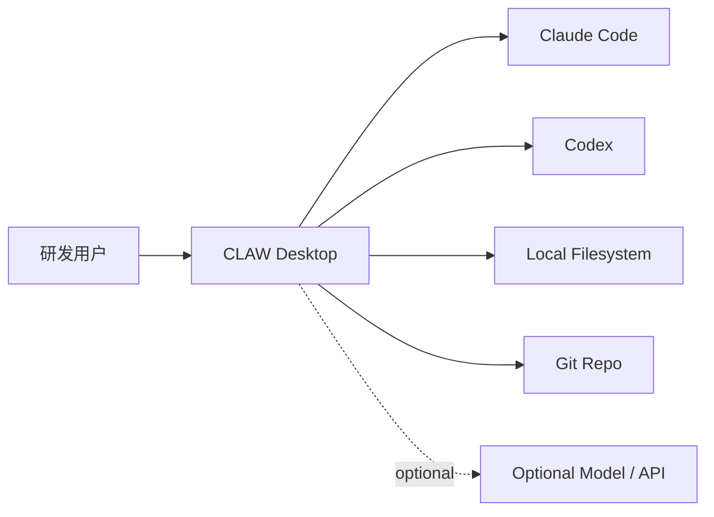
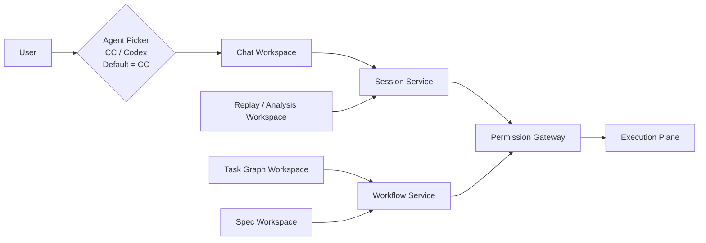
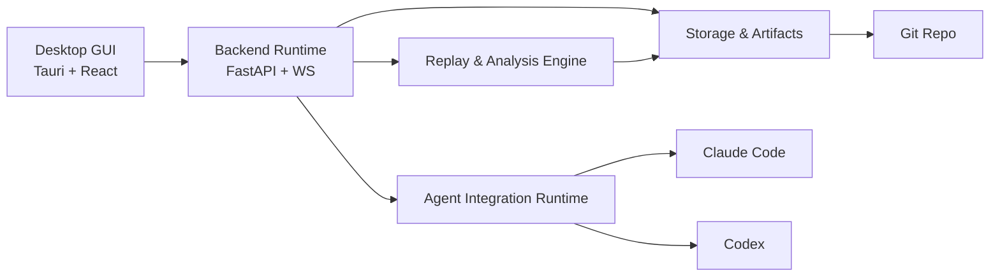

# 产品与工程文档总览

<cite>

**本文引用的文件**

- [doc/README.md](file://doc/README.md)
- [doc/adr/README.md](file://doc/adr/README.md)
- [doc/00-overview/00-产品定义.md](file://doc/00-overview/00-产品定义.md)
- [doc/00-overview/01-设计原则与非目标.md](file://doc/00-overview/01-设计原则与非目标.md)
- [doc/00-overview/02-术语表.md](file://doc/00-overview/02-术语表.md)
- [doc/00-overview/03-文档索引.md](file://doc/00-overview/03-文档索引.md)
- [doc/00-overview/04-问题定义与成功指标.md](file://doc/00-overview/04-问题定义与成功指标.md)
- [doc/10-architecture/10-系统上下文图.md](file://doc/10-architecture/10-系统上下文图.md)
- [doc/CLAW-v1.0-需求架构Spec.md](file://doc/CLAW-v1.0-需求架构Spec.md)
- [doc/CLAW-需求分析文档.md](file://doc/CLAW-需求分析文档.md)
- [doc/CLAW.md](file://doc/CLAW.md)
- [doc/adr/ADR-001-统一能力模型策略.md](file://doc/adr/ADR-001-统一能力模型策略.md)
- [doc/adr/ADR-002-混合双核运行时.md](file://doc/adr/ADR-002-混合双核运行时.md)
- [doc/adr/ADR-003-递归任务图预算与停止策略.md](file://doc/adr/ADR-003-递归任务图预算与停止策略.md)
- [doc/adr/ADR-004-RuntimeAsset真相来源.md](file://doc/adr/ADR-004-RuntimeAsset真相来源.md)
- [doc/adr/ADR-005-SpecAsset版本治理策略.md](file://doc/adr/ADR-005-SpecAsset版本治理策略.md)
- [doc/10-architecture/11-系统容器图.md](file://doc/10-architecture/11-系统容器图.md)
- [doc/10-architecture/12-控制平面组件图.md](file://doc/10-architecture/12-控制平面组件图.md)

</cite>

# 产品与工程文档总览

> **模块职责**：本文档是 tech-cc-hub 项目「产品与工程文档」模块的入口索引，涵盖 CLAW 产品的需求定义、设计原则、架构决策、系统设计规范，以及工程实现的组件地图、调用链和数据结构。目标是让新加入的开发者或代码 Agent 能快速定位到正确的文档，理解模块协作关系，并获得可执行的改代码指引。

---

## 目录

- [1. 模块定位与核心职责](#1-模块定位与核心职责)
- [2. 文档分层架构](#2-文档分层架构)
- [3. 关键术语与概念模型](#3-关键术语与概念模型)
- [4. 核心调用链与数据流](#4-核心调用链与数据流)
- [5. 架构决策记录（ADR）地图](#5-架构决策记录adr地图)
- [6. 系统容器与组件关系](#6-系统容器与组件关系)
- [7. 活跃工程模块规格](#7-活跃工程模块规格)
- [8. 前端信息架构](#8-前端信息架构)
- [9. Agent 改代码地图](#9-agent-改代码地图)
- [10. 常见改造路径与验证命令](#10-常见改造路径与验证命令)

---

## 1. 模块定位与核心职责

### 1.1 产品定位

**CLAW**（Coding Layer for Agent Workspace）是构建在 Claude Code、Codex 等 AgentOS 之上的**半托管控制层**，不是"再造一个 Agent"，而是"把 Agent 使用过程变成可治理的软件资产"。

**核心价值主张**：

- `执行不透明` → `全量可观测 + 事件回放`
- `调优不可沉淀` → `SpecAsset 版本化复用`
- `多任务协作不可控` → `递归任务图 + 预算策略`
- `结果无法形成证据闭环` → `ReplayDocument + AnalysisReport`

[章节来源](file://doc/00-overview/00-产品定义.md#L22-L23)

### 1.2 模块边界

tech-cc-hub 文档体系分为两大类：

| 类别 | 位置 | 职责 |
|------|------|------|
| **产品文档** | `doc/40-product/` | PRD、用户故事、需求追踪、Epic 拆解、开发计划 |
| **工程文档** | `doc/00-overview/` + `doc/10-architecture/` + `doc/20-specs/` | 架构规范、接口契约、组件设计、行为约束 |

**v2 入口文件**：`doc/README.md` 是文档体系的唯一入口，废弃了旧版 CLAW v1 编号体系，禁止在 `40-product/1.0.0/40-delivery/` 下追加 73+ 流水账编号。

[章节来源](file://doc/README.md#L24-L27)

---

## 2. 文档分层架构

### 2.1 L0–L3 四层结构

文档体系按渐进式披露方式组织为四层：

| 层级 | 名称 | 定位 | 代表文档 |
|------|------|------|----------|
| **L0** | 总览层 | 产品边界、术语、成功指标 | `00-overview/00-04` |
| **L1** | 架构层 | C1-C3 图、核心流程 | `10-architecture/10-15` |
| **L2** | 契约层 | 协议、类型、状态机、持久化 | `20-specs/20-31` |
| **L3** | 运行与演进层 | UI、workflow、回放、冲突处理 | `30-operations/30-38` |

### 2.2 推荐阅读顺序

```
新成员入门路径：
00-产品定义.md → 01-设计原则与非目标.md → 04-问题定义与成功指标.md
    → 10-系统上下文图.md → 11-系统容器图.md → 15-核心流程图.md

运行时实现路径：
20-AgentOS集成规范.md → 22-任务图与递归拆分规范.md
    → 24-事件模型与可观测规范.md → 25-会话与状态机规范.md

前端与调优路径：
30-前端信息架构.md → 31-Workflow与Skills体系规范.md
    → 32-回放与分析报告规范.md → 36-端到端场景样例.md
```

[章节来源](file://doc/00-overview/03-文档索引.md#L42-L73)

---

## 3. 关键术语与概念模型

### 3.1 核心概念定义

| 术语 | 类型名 | 定义 | Owner Spec |
|------|--------|------|------------|
| **AgentOS** | `AgentOS` | 提供底层执行能力的外部 Agent 系统 | `20` |
| **Agent 适配器** | `AgentAdapter` | CLAW 对 AgentOS 的统一集成接口 | `20` |
| **能力** | `AgentCapability` | AgentOS 可声明的标准化能力集合 | `21` |
| **会话** | `Session` | 用户级执行上下文与生命周期容器 | `25` |
| **任务节点** | `TaskNode` | 任务图中的最小可调度单元 | `22` |
| **Worker 执行** | `WorkerRun` | 一次具体的 Agent 执行实例 | `25` |
| **主上下文快照** | `ContextSnapshot` | 某时刻的上下文完整视图 | `23` |
| **上下文差异** | `ContextDiff` | 快照之间的增量同步对象 | `23` |
| **事件信封** | `EventEnvelope` | 所有运行时事件的统一承载格式 | `24` |
| **回放文档** | `ReplayDocument` | 由事件重建出的可读执行记录 | `32` |
| **分析报告** | `AnalysisReport` | 指标、结论和建议的结构化产物 | `32` |
| **规范资产** | `SpecAsset` | workflow、skills、prompts、policies 等 | `31` |
| **运行资产** | `RuntimeAsset` | logs、state、timeline、report 等 | `26` |

[章节来源](file://doc/00-overview/02-术语表.md#L37-L51)

### 3.2 双资产并列原则

CLAW 的两大一等资产是 **SpecAsset** 和 **RuntimeAsset**，必须分层管理、单独建模：

- **SpecAsset**：workflow、skills、prompts、policies、task templates 等可版本化资产
- **RuntimeAsset**：session、task、event、snapshot、timeline、replay、analysis 等运行资产

[章节来源](file://doc/00-overview/00-产品定义.md#L38-L41)

---

## 4. 核心调用链与数据流

### 4.1 系统上下文（C1）



**边界说明**：

- 用户与 CLAW 之间的接口：`Chat`、`Task Graph`、`Replay / Analysis`
- CLAW 与 AgentOS 之间的接口：`Session control`、`Message transport`、`Event normalization`
- CLAW 与存储之间的接口：`SpecAsset read/write`、`RuntimeAsset append/snapshot`
- **Git 只同步配置类资产，不承载 v1 全量运行时真相**

[图表来源](file://doc/10-architecture/10-系统上下文图.md#L42-L50)

### 4.2 主产品链路

```
用户通过聊天或任务图定义目标与约束
    → CLAW 将输入组织为 SpecAsset + Task Graph
        → Hub 将任务分派给 Claude Code、Codex 或未来 AgentOS
            → 底层执行返回事件、状态和产物，CLAW 统一记录为 RuntimeAsset
                → CLAW 根据事件重建时间线、回放文档和分析报告
                    → 用户根据回放与分析持续调优 spec、workflow 和 skills
```

[章节来源](file://doc/00-overview/00-产品定义.md#L48-L53)

### 4.3 控制平面组件交互



**聊天界面代理选择规则**：

- 同一时刻只允许一个活跃 AgentOS
- 可选项：`Claude Code` 或 `Codex`，默认选中 `Claude Code`
- 多 Agent 协作通过 `Task Graph + Hub` 实现，不通过聊天栏并列激活

[图表来源](file://doc/10-architecture/12-控制平面组件图.md#L47-L58)

### 4.4 混合双核运行时

CLAW 采用混合双核运行时设计，同时满足回放能力和产品交互性能：

| 真相类型 | 用途 | 约束 |
|----------|------|------|
| **EventEnvelope** | 证据真相，用于回放、分析和审计 | 所有状态变更必须可回链到事件 |
| **Session / Worker / Context 聚合状态** | 产品真相，用于 UI、调度和恢复 | 不允许只有状态没有事件，也不允许只有事件没有可查询状态 |

[章节来源](file://doc/adr/ADR-002-混合双核运行时.md#L28-L33)

---

## 5. 架构决策记录（ADR）地图

### 5.1 已落地 ADR 概览

| ADR 编号 | 标题 | 核心决策 | 影响范围 |
|----------|------|----------|----------|
| **ADR-001** | 统一能力模型策略 | 核心产品流只依赖统一能力模型，无法抽平的能力进入 `extension` | `AgentAdapter`、能力矩阵 |
| **ADR-002** | 混合双核运行时 | `EventEnvelope` + `Session/Worker/Context` 聚合状态并列 | 事件模型、会话状态机 |
| **ADR-003** | 递归任务图预算与停止策略 | 每个 `TaskNode` 必须绑定 `ExecutionBudget`，子任务继承并收窄父任务预算 | 任务图、Hub 调度 |
| **ADR-004** | RuntimeAsset 真相来源 | 本地文件系统为 v1 RuntimeAsset 事实真相，`runtime/` 保存会话/事件，`artifacts/` 保存产物 | 存储规范 |
| **ADR-005** | SpecAsset 版本治理策略 | 所有正式 `SpecAsset` 必须有 `asset_id` 和 `version`，Session 记录消费的 SpecAsset 版本 | Workflow/Skills 体系 |

[章节来源](file://doc/adr/README.md#L25-L30)

### 5.2 关键决策约束

**ADR-001 约束**：适配器必须声明能力矩阵，并在运行时回填真实支持度。`extension` 不允许成为主流程硬依赖。

**ADR-003 约束**：当预算耗尽、价值不再提升或用户显式阻止时，必须停止继续拆分。Hub 必须记录每次拆分原因和使用的策略。

**ADR-005 约束**：一次性的 prompt 成功经验不得直接升级为 workflow，必须经过显式的版本变更流程。

[章节来源](file://doc/adr/ADR-001-统一能力模型策略.md#L29-L32)

---

## 6. 系统容器与组件关系

### 6.1 一级容器（C2）



**五大容器职责**：

| 容器 | 技术栈 | 核心职责 |
|------|--------|----------|
| **Desktop GUI** | Tauri + React | 用户交互入口（Chat、Task Graph、Replay） |
| **Backend Runtime** | FastAPI + WebSocket | 控制平面、实时接口、Session 管理 |
| **Agent Integration Runtime** | Agent Adapter Layer | 对外接 Claude Code / Codex |
| **Storage & Artifacts** | Local Filesystem | SpecAsset 与 RuntimeAsset 持久化 |
| **Replay & Analysis Engine** | Event Processing | 从事件生成回放和报告 |

[图表来源](file://doc/10-architecture/11-系统容器图.md#L43-L52)

### 6.2 五大工作空间

CLAW 对用户暴露的一级能力（五大工作空间）：

| 工作空间 | 入口组件 | 关联服务 |
|----------|----------|----------|
| **Chat Workspace** | `ChatComposer` | `SessionService` |
| **Task Graph Workspace** | `TaskGraphCanvas` | `WorkflowService` |
| **Replay / Analysis Workspace** | `LiveTimelinePanel` | `ReplayEngine` |
| **Spec Workspace** | `SpecAssetController` | `WorkflowService` |
| **Agent Picker** | `AgentPicker` | `PermissionGateway` |

[章节来源](file://doc/10-architecture/12-控制平面组件图.md#L36-L44)

---

## 7. 活跃工程模块规格

### 7.1 五大活跃模块

| 模块 | Spec 文件 | 入口代码 | 核心职责 |
|------|----------|----------|----------|
| **Chat / Composer** | `40-engineering/chat-composer/spec.md` | `src/ui/components/PromptInput.tsx` | 聊天输入、消息渲染 |
| **Preview / Browser Workbench** | `40-engineering/preview-workbench/spec.md` | `src/ui/components/PreviewPanel.tsx` | 文件预览、执行结果展示 |
| **Activity Rail / Trace** | `40-engineering/activity-rail/spec.md` | `src/ui/components/ActivityRail.tsx` | 实时时间线、活动面板 |
| **Settings / Skills** | `40-engineering/settings-skills/spec.md` | `src/ui/components/settings/` | 配置管理、Skills 调优 |
| **Electron Main / IPC** | `40-engineering/electron-ipc/spec.md` | `src/electron/main.ts` | 桌面主进程、进程间通信 |

[章节来源](file://doc/README.md#L81-L87)

### 7.2 Agent Adapter Layer（后端核心）

```python
# backend/adapters/base.py
class BaseAgentAdapter(ABC):
    @abstractmethod
    async def start(self, session_id: str, config: AgentConfig) -> None:
        """启动 Agent Session"""
        pass

    @abstractmethod
    async def send_message(self, message: str) -> AgentResponse:
        """发送消息"""
        pass

    @abstractmethod
    async def stop(self) -> ExecutionSummary:
        """停止 Agent"""
        pass

    @abstractmethod
    async def get_status(self) -> AgentStatus:
        """获取状态"""
        pass

    @abstractmethod
    def register_hooks(self, hook_handler: HookHandler) -> None:
        """注册 Hooks"""
        pass
```

**配置驱动切换示例**：

```yaml
# config/active_agent.yaml
active_agent: claude

agents:
  claude:
    type: claude_code
    path: /usr/local/bin/claude
    hooks_enabled: true

  codex:
    type: codex
    api_endpoint: http://localhost:8080
    api_key: ${CODEX_API_KEY}
```

[章节来源](file://doc/CLAW-v1.0-需求架构Spec.md#L91-L139)

### 7.3 Hooks 事件模型

CLAW 捕获 Claude Code 的 14 个 Hooks 事件：

| 事件 | 捕获内容 | 用途 |
|------|----------|------|
| `SessionStart` | git status、env、初始上下文 | 初始化 RuntimeAsset |
| `UserPromptSubmit` | 原始 prompt、长度、时间戳 | 追踪用户意图 |
| `PreToolUse` | 工具名、参数、上下文 | 权限预检 |
| `PostToolUse` | 工具名、结果、耗时、成功状态 | 执行记录 |
| `PostToolUseFailure` | 工具名、错误类型、堆栈 | 失败分析 |
| `PreCompact` / `PostCompact` | 上下文压缩前后大小 | 资源追踪 |
| `PermissionRequest` | 命令详情、是否批准 | 人工介入记录 |
| `HumanIntervention` | 人工消息内容 | 干预证据链 |
| `SessionEnd` | 最终统计、任务完成状态 | 会话关闭 |

[章节来源](file://doc/CLAW-需求分析文档.md#L83-L101)

---

## 8. 前端信息架构

### 8.1 UI 组件索引

| 组件 ID | 组件名 | 控制器 | 主要功能 |
|---------|--------|--------|----------|
| `CMP-001` | SessionSidebar | `CTR-001-SessionController` | 会话列表管理 |
| `CMP-002` | AgentPicker | `CTR-001-SessionController` | Agent 选择（CC/Codex） |
| `CMP-003` | ChatComposer | `CTR-002-ChatController` | 消息输入与发送 |
| `CMP-004` | MessageStream | `CTR-002-ChatController` | 消息流渲染 |
| `CMP-005` | LiveTimelinePanel | `CTR-006-EventController` | 实时事件时间线 |
| `CMP-006` | ArtifactJumpPanel | `CTR-007-ReplayController` | 回放跳转面板 |
| `CMP-007` | TaskGraphCanvas | `CTR-003-TaskController` | 任务图可视化 |
| `CMP-008` | TaskNodeCard | `CTR-003-TaskController` | 任务节点卡片 |
| `CMP-009` | DependencyEditor | `CTR-004-TaskDependencyController` | 依赖关系编辑 |
| `CMP-010` | TaskInspectorDrawer | `CTR-003-TaskController` | 任务详情抽屉 |
| `CMP-011` | WorkerStatusBadge | `CTR-005-WorkerController` | Worker 状态徽章 |
| `CMP-012` | TaskResultPanel | `CTR-012-TaskResultController` | 任务结果面板 |

[章节来源](file://doc/40-product/1.0.0/40-delivery/48-组件索引.md)

### 8.2 Electron IPC 通道

| IPC Channel | 方向 | 用途 |
|-------------|------|------|
| `session:create` | Renderer → Main | 创建新会话 |
| `session:list` | Renderer → Main | 获取会话列表 |
| `session:state` | Main → Renderer | 会话状态变更推送 |
| `agent:send` | Renderer → Main | 发送消息到 Agent |
| `agent:event` | Main → Renderer | Agent 事件推送 |
| `file:read` | Renderer → Main | 读取工作区文件 |
| `file:write` | Renderer → Main | 写入工作区文件 |

---

## 9. Agent 改代码地图

### 9.1 先读文件清单

改代码前必须按顺序阅读以下文件，确保理解上下文：

| 顺序 | 文件路径 | 阅读目的 |
|------|----------|----------|
| 1 | `doc/00-overview/01-设计原则与非目标.md` | 理解架构红线、非目标 |
| 2 | `doc/00-overview/02-术语表.md` | 统一概念命名 |
| 3 | `doc/10-architecture/12-控制平面组件图.md` | 理解组件关系 |
| 4 | `doc/CLAW-v1.0-需求架构Spec.md` | 理解目录结构与数据模型 |
| 5 | 相关 ADR | 确认决策约束 |
| 6 | `40-engineering/{module}/spec.md` | 理解模块规格 |

### 9.2 关键符号与 IPC/MCP 工具

| 符号类型 | 名称 | 位置 | 用途 |
|----------|------|------|------|
| **类** | `BaseAgentAdapter` | `backend/adapters/base.py` | Agent 适配器基类 |
| **类** | `Hub` | `backend/hub/` | 任务分解与 Worker 调度 |
| **类** | `HookHandler` | `backend/hooks/handler.py` | 事件捕获处理器 |
| **接口** | `AgentResponse` | `backend/adapters/base.py` | Agent 响应类型 |
| **接口** | `AgentStatus` | `backend/adapters/base.py` | Agent 状态类型 |
| **配置** | `active_agent.yaml` | `config/` | 当前 Agent 配置 |
| **IPC** | `session:create` | `src/electron/main.ts` | 会话创建通道 |
| **IPC** | `agent:send` | `src/electron/main.ts` | 消息发送通道 |
| **事件类型** | `EventEnvelope` | `24-事件模型与可观测规范.md` | 事件信封格式 |
| **资产类型** | `SpecAsset` | `31-Workflow与Skills体系规范.md` | 规范资产定义 |

### 9.3 修改入口点

| 场景 | 修改入口 | 关键符号 |
|------|----------|----------|
| **新增 Agent 支持** | `backend/adapters/` | 实现 `BaseAgentAdapter` 子类 |
| **新增 UI 组件** | `src/ui/components/` | 继承 `React.Component` |
| **新增控制器** | `src/ui/controllers/` | 实现对应 Controller 接口 |
| **新增 Hook 事件** | `backend/hooks/events.py` | 添加 `EventType` 枚举 |
| **新增 SpecAsset 类型** | `doc/31-Workflow与Skills体系规范.md` | 定义 schema |

### 9.4 验证命令

| 验证目标 | 命令 | 检查点 |
|----------|------|--------|
| **前端构建** | `npm run build` | TypeScript 编译无错误 |
| **前端测试** | `npm test` | 所有测试通过 |
| **后端单元测试** | `pytest tests/unit/` | Hook 事件、适配器测试通过 |
| **后端集成测试** | `pytest tests/integration/` | Agent 通信、存储测试通过 |
| **文档链接检查** | `python doc/_tools/check_doc_links.py` | 无坏链 |
| **Frontmatter 校验** | `python doc/_tools/validate_frontmatter.py` | 所有文档通过校验 |
| **Electron 构建** | `npm run tauri build` | 生成可执行文件 |

### 9.5 常见回归风险

| 风险点 | 影响 | 预防措施 |
|--------|------|----------|
| **Agent 适配器接口变更** | 所有 Agent 实现需要同步更新 | 保持 `BaseAgentAdapter` 稳定，新增用 `extension` |
| **事件格式变更** | 回放和分析功能失效 | 新增 `EventEnvelope` 字段时保持向后兼容 |
| **SpecAsset 版本冲突** | 调优历史无法追踪 | 遵守 ADR-005 版本治理规范 |
| **IPC 通道协议变更** | 前后端通信断裂 | 通过 adapter 模式解耦，版本化 channel name |
| **GUI 直接操作 AgentOS** | 绕过统一观测和状态管理 | 所有 Agent 操作必须经过 Backend Runtime |

[章节来源](file://doc/10-architecture/11-系统容器图.md#L68-L70)

---

## 10. 常见改造路径与验证命令

### 10.1 改造路径 1：新增 AgentOS 支持

**场景**：需要接入除 Claude Code 和 Codex 之外的 Agent 系统

**步骤**：

1. 在 `backend/adapters/` 下创建新目录 `{agent_name}/connector.py`
2. 实现 `BaseAgentAdapter` 子类，重写所有抽象方法
3. 在 `config/active_agent.yaml` 添加配置
4. 在 `29-AgentOS能力映射矩阵.md` 填入能力声明
5. 更新 `AgentPicker` 组件，添加新选项

**验证**：

```bash
# 运行适配器单元测试
pytest tests/unit/adapters/test_{agent_name}_connector.py -v

# 验证配置加载
python -c "from backend.adapters import {AgentName}Connector; print('import ok')"
```

### 10.2 改造路径 2：新增 Hook 事件

**场景**：需要捕获新的执行事件

**步骤**：

1. 在 `backend/hooks/events.py` 添加新的 `EventType` 枚举值
2. 在 `backend/hooks/handler.py` 实现事件捕获逻辑
3. 更新 `doc/24-事件模型与可观测规范.md`
4. 在前端 `EventController` 添加事件处理

**验证**：

```bash
# 运行 Hook 集成测试
pytest tests/integration/hooks/test_event_capture.py -v

# 验证事件写入
tail -f data/logs/{session_id}.jsonl | grep "{new_event_type}"
```

### 10.3 改造路径 3：新增 SpecAsset 类型

**场景**：需要支持新的可版本化资产（如新的 Policy 类型）

**步骤**：

1. 在 `doc/31-Workflow与Skills体系规范.md` 定义新资产 schema
2. 在 `backend/storage/` 实现持久化逻辑
3. 在 `SpecAssetController` 添加 CRUD 接口
4. 遵守 ADR-005：添加 `asset_id` 和 `version` 字段

**验证**：

```bash
# 运行存储测试
pytest tests/unit/storage/test_spec_asset.py -v

# 验证版本记录
python -c "
from backend.storage import SpecAssetStore
store = SpecAssetStore()
asset = store.get('policy_new_type', version='1.0.0')
print(f'asset_id={asset.asset_id}, version={asset.version}')
"
```

### 10.4 改造路径 4：前端 UI 组件改造

**场景**：需要修改或新增 UI 组件

**步骤**：

1. 在 `src/ui/components/` 下创建或修改组件
2. 关联对应的 Controller（位于 `src/ui/controllers/`）
3. 在 `doc/30-前端信息架构.md` 更新组件规格
4. 遵守 `doc/40-product/1.0.0/40-delivery/51-前端UI风格规范.md`

**验证**：

```bash
# TypeScript 类型检查
npx tsc --noEmit

# 组件单元测试
npm test -- --testPathPattern="components/{ComponentName}"

# Storybook 可视化测试（如有）
npm run storybook
```

### 10.5 排障清单

| 问题症状 | 可能原因 | 排查命令 |
|----------|----------|----------|
| Agent 无响应 | 适配器未正确加载 | `pytest tests/unit/adapters/ -v` |
| 事件未写入 | Hook 处理器异常 | `tail data/logs/{session_id}.jsonl` |
| 回放生成失败 | 事件不完整 | `python doc/_tools/check_doc_links.py` |
| SpecAsset 冲突 | 版本号冲突 | `git log --oneline spec_assets/` |
| 前端构建失败 | TypeScript 类型错误 | `npx tsc --noEmit` |
| Electron 打包失败 | 资源路径错误 | `npm run tauri build --debug` |

---

## 附录：文档治理说明

### Frontmatter 规范

所有文档必须包含标准化的 Frontmatter 头信息：

```yaml
---
doc_id: "XX"
title: "文档标题"
doc_type: "overview|spec|decision|diagram|index"
layer: "L0|L1|L2|L3|adr"
status: "active|draft|deprecated"
version: "x.y.z"
last_updated: "YYYY-MM-DD"
owners:
  - "Owner Team"
tags:
  - "tech-cc-hub"
  - "docs"
---
```

**校验工具**：

- `doc/_tools/validate_frontmatter.py` — 校验 Frontmatter 格式
- `doc/_tools/check_doc_links.py` — 检查文档间链接有效性

[章节来源](file://doc/README.md#L143-L147)

### 迁移进度

当前已完成：

- ✅ 冻结旧编号增长（禁止 73+ 流水账）
- ✅ 建立新目录骨架（00-90 层）
- ✅ 创建 Initial INDEX
- ✅ 重写 doc/README.md 为 v2 入口
- ✅ 逐模块提取 spec（Chat、Preview、Activity Rail、Settings、Electron/IPC）
- ✅ 补充 20-contracts 层独立 spec 文档

待完成：

- ⬜ 迁移 80-operations 下的正式 runbook
- ⬜ 统一迁入 `doc/60-decisions/` 并建立索引

[章节来源](file://doc/README.md#L147-L157)

---

> **本文档由 tech-cc-hub Core 维护。如有疑问或修改建议，请提交 Issue 或 PR。**
