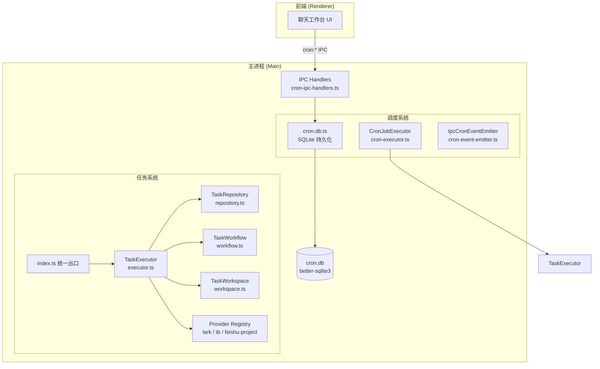
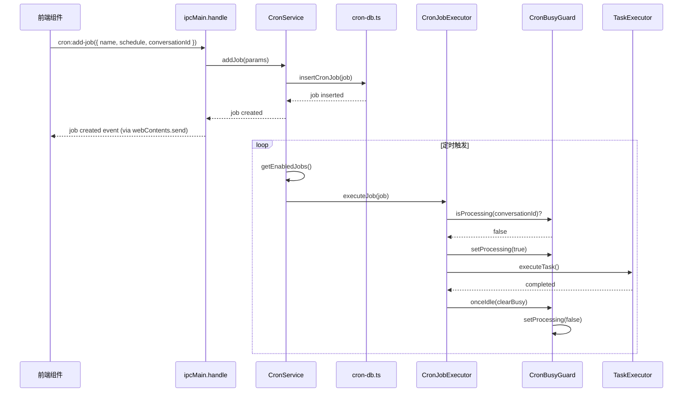

# 任务与调度系统总览

<cite>

**本文引用的文件**

- [src/electron/libs/task/README.md](file://src/electron/libs/task/README.md)
- [src/electron/libs/task/index.ts](file://src/electron/libs/task/index.ts)
- [pro-workflow/scripts/task-created.js](file://pro-workflow/scripts/task-created.js)
- [pro-workflow/scripts/task-completed.js](file://pro-workflow/scripts/task-completed.js)
- [src/electron/libs/cron-db.ts](file://src/electron/libs/cron-db.ts)
- [src/electron/libs/cron-event-emitter.ts](file://src/electron/libs/cron-event-emitter.ts)
- [src/electron/libs/cron-executor.ts](file://src/electron/libs/cron-executor.ts)
- [src/electron/libs/cron-ipc-handlers.ts](file://src/electron/libs/cron-ipc-handlers.ts)
- [scripts/dev.mjs](file://scripts/dev.mjs)

</cite>

## 目录

- [系统职责与边界](#系统职责与边界)
- [核心架构图](#核心架构图)
- [任务系统组件详解](#任务系统组件详解)
- [调度系统组件详解](#调度系统组件详解)
- [数据结构与类型定义](#数据结构与类型定义)
- [调用链与 IPC 通道](#调用链与-ipc-通道)
- [Provider 扩展点](#provider-扩展点)
- [ProWorkflow 质量门禁](#proworkflow-质量门禁)
- [常见改造路径](#常见改造路径)
- [验证与排障命令](#验证与排障命令)

---

## 系统职责与边界

任务与调度系统是 tech-cc-hub 的**执行平面核心**，承担两大职责：

1. **任务编排与执行**：管理外部任务（飞书、Trello、Feishu Project）的拉取、状态同步、自动执行和重试。
2. **定时调度**：支持 Cron 表达式、一次性触发和周期性触发，通过独立的 cron.db 持久化任务配置。

**关键设计原则**（来源：[src/electron/libs/task/README.md#L16-L22](file://src/electron/libs/task/README.md#L16-L22)）：

- External Provider 只负责把第三方任务映射成 `ExternalTask`，不直接改 UI 或会话。
- Repository 只做持久化，不启动 runner。
- **Executor 是唯一调度入口**，所有自动/手动执行都经过这里。
- 每个任务使用独立 workspace，避免互相污染。

---

## 核心架构图



**图表来源**：[src/electron/libs/task/README.md#L4-L14](file://src/electron/libs/task/README.md#L4-L14) + [src/electron/libs/cron-executor.ts](file://src/electron/libs/cron-executor.ts) 调用链

---

## 任务系统组件详解

### 1. 入口文件：`src/electron/libs/task/index.ts`

所有外部模块从这里 import，是任务系统的单一入口点。导出内容：

| 导出 | 来源文件 | 用途 |
|------|---------|------|
| `TaskExecutor` | executor.ts | 核心编排器 |
| `TaskRepository` | repository.ts | SQLite 持久化 |
| `registerTaskProvider` / `getTaskProvider` | provider-registry.ts | Provider 注册 |
| `loadTaskWorkflowConfig` / `computeRetryDueAt` | workflow.ts | 工作流配置 |
| `loadTaskSettings` / `saveTaskSettings` | settings.ts | 用户设置 |
| `LarkTaskProvider` / `TbTaskProvider` / `FeishuProjectTaskProvider` | providers/*.ts | 内置适配器 |

**章节来源**：[src/electron/libs/task/index.ts#L1-L37](file://src/electron/libs/task/index.ts#L1-L37)

### 2. TaskExecutor（编排器）

TaskExecutor 是任务系统的核心，职责：

- **同步**：从注册 Provider 拉取外部任务状态
- **自动执行**：根据工作流配置触发执行
- **并发控制**：限制同时运行的任务数
- **重试**：指数退避重试失败任务
- **恢复**：崩溃后重新加载任务状态
- **日志**：记录执行事件供回放

**章节来源**：[src/electron/libs/task/README.md#L12](file://src/electron/libs/task/README.md#L12)

### 3. TaskRepository（持久化）

- 定义 SQLite schema
- 持久化任务状态、执行记录和日志
- **不启动 runner**，纯数据操作
- Schema 变化优先保持代码简单，旧数据允许丢弃

### 4. TaskWorkflow（工作流配置）

- Symphony-style workflow 配置
- 轮询间隔、重试次数、stall 检测等默认参数
- 支持 `loadTaskWorkflowConfig` 加载和 `createDefaultTaskWorkflowConfig` 创建默认配置

### 5. TaskWorkspace（隔离环境）

- 每个任务创建独立 workspace
- 路径安全检查，防止穿越攻击
- 避免多个任务互相污染

### 6. Provider Registry（扩展点）

- 支持注册多个外部任务源
- 内置 Provider：Lark、Trello (tb)、Feishu Project
- Fallback provider 处理未知来源

---

## 调度系统组件详解

### 1. cron-db.ts：持久化层

**职责**：管理 cron.db SQLite 数据库，CRUD 定时任务。

**Schema 设计**（来源：[src/electron/libs/cron-db.ts#L27-L56](file://src/electron/libs/cron-db.ts#L27-L56)）：

```sql
CREATE TABLE cron_jobs (
  id TEXT PRIMARY KEY,
  name TEXT NOT NULL,
  schedule_kind TEXT NOT NULL,     -- 'cron' | 'at' | 'every'
  schedule_value TEXT NOT NULL,     -- cron 表达式或毫秒数
  payload_message TEXT NOT NULL,   -- 执行时发送的消息
  conversation_id TEXT NOT NULL,   -- 关联会话
  enabled INTEGER DEFAULT 1,
  next_run_at INTEGER,
  last_run_at INTEGER,
  last_status TEXT,                -- 'ok' | 'error' | 'skipped' | 'missed'
  last_error TEXT,
  run_count INTEGER DEFAULT 0,
  retry_count INTEGER DEFAULT 0,
  max_retries INTEGER DEFAULT 3,
  -- ... 其他字段
);
```

**关键函数**：

| 函数 | 用途 |
|------|------|
| `getCronDb()` | 获取单例数据库连接 |
| `insertCronJob(job)` | 创建新任务 |
| `updateCronJob(id, updates)` | 更新任务 |
| `deleteCronJob(id)` | 删除任务 |
| `listEnabledCronJobs()` | 查询待执行任务 |
| `deleteCronJobsByConversation(id)` | 删除会话下所有任务 |

**行级转换**：`jobToRow()` 和 `rowToJob()` 处理 schedule 结构体与数据库行的映射。

### 2. cron-executor.ts：执行器

**CronBusyGuard**：会话忙碌状态管理器。

```typescript
// 来源：src/electron/libs/cron-executor.ts#L25-L89
export class CronBusyGuard {
  private states = new Map<string, ConversationState>();

  isProcessing(conversationId: string): boolean;
  setProcessing(conversationId: string, value: boolean): void;
  onceIdle(conversationId: string, callback: IdleCallback): void;
  async waitForIdle(conversationId: string, timeoutMs = 60000): Promise<void>;
}
```

**核心行为**：

1. 执行任务前调用 `setProcessing(true)` 标记会话忙碌
2. 任务完成后通过 `onceIdle()` 注册回调清理忙碌状态
3. `waitForIdle()` 阻塞等待会话空闲，最长 60 秒超时

**CronJobExecutor**：简化版执行器，职责：

- 检查会话是否忙碌
- 构建消息文本（带定时任务标识）
- 通过 `sendMessage` 发送消息到会话
- 处理重试和错误

```typescript
// 来源：src/electron/libs/cron-executor.ts#L104-L154
private buildMessageText(job: CronJob): string {
  const rawText = job.target.payload.text;
  return `[定时任务执行]\n任务: ${job.name}\n周期: ${job.schedule.description}\n\n${rawText}`;
}
```

### 3. cron-event-emitter.ts：事件发射

定义事件接口 `ICronEventEmitter`：

```typescript
// 来源：src/electron/libs/cron-event-emitter.ts#L6-L11
export interface ICronEventEmitter {
  emitJobCreated(job: CronJob): void;
  emitJobUpdated(job: CronJob): void;
  emitJobExecuted(jobId: string, status: "ok" | "error" | "skipped" | "missed", error?: string): void;
  emitJobRemoved(jobId: string): void;
}
```

### 4. cron-ipc-handlers.ts：IPC 通道

**IpcCronEventEmitter**：实现事件接口，广播到所有 BrowserWindow：

```typescript
// 来源：src/electron/libs/cron-ipc-handlers.ts#L9-L33
export class IpcCronEventEmitter implements ICronEventEmitter {
  emitJobCreated(job: CronJob): void {
    for (const win of BrowserWindow.getAllWindows()) {
      win.webContents.send("cron:job-created", job);
    }
  }
  // ... 其他方法
}
```

**注册的 IPC Handler**（来源：[src/electron/libs/cron-ipc-handlers.ts#L35-L63](file://src/electron/libs/cron-ipc-handlers.ts#L35-L63)）：

| Channel | 参数 | 返回值 |
|---------|------|--------|
| `cron:list-jobs` | - | `CronJob[]` |
| `cron:list-jobs-by-conversation` | `{ conversationId }` | `CronJob[]` |
| `cron:get-job` | `{ jobId }` | `CronJob \| null` |
| `cron:add-job` | `CreateCronJobParams` | 新建任务 |
| `cron:update-job` | `{ jobId, updates }` | 更新任务 |
| `cron:remove-job` | `{ jobId }` | 删除任务 |
| `cron:run-now` | `{ jobId }` | `{ conversationId }` |

---

## 数据结构与类型定义

### ExternalTask（外部任务）

从 Provider 拉取的第三方任务结构：

```typescript
interface ExternalTask {
  id: string;
  source: TaskProviderId;
  status: ExternalTaskStatus;  // 'pending' | 'in_progress' | 'completed' | 'cancelled'
  title: string;
  description?: string;
  assignee?: string;
  dueDate?: number;
  priority?: TaskPriority;
  metadata?: Record<string, unknown>;
}
```

### CronJob（定时任务）

```typescript
interface CronJob {
  id: string;
  name: string;
  description?: string;
  enabled: boolean;
  schedule: {
    kind: "cron" | "at" | "every";
    expr?: string;        // cron 表达式
    atMs?: number;         // 一次性触发时间戳
    everyMs?: number;      // 周期毫秒数
    tz?: string;            // 时区
    description: string;   // 人类可读描述
  };
  target: {
    payload: { text: string };
    executionMode: "existing" | "new_conversation";
  };
  metadata: {
    conversationId: string;
    conversationTitle?: string;
    agentType: string;
    createdBy: "user" | "agent";
    createdAt: number;
    updatedAt: number;
    agentConfig?: object;
  };
  state: {
    nextRunAtMs?: number;
    lastRunAtMs?: number;
    lastStatus?: "ok" | "error" | "skipped" | "missed";
    lastError?: string;
    runCount: number;
    retryCount: number;
    maxRetries: number;
  };
}
```

---

## 调用链与 IPC 通道



**图表来源**：[src/electron/libs/cron-ipc-handlers.ts#L35-L63](file://src/electron/libs/cron-ipc-handlers.ts#L35-L63) + [src/electron/libs/cron-executor.ts](file://src/electron/libs/cron-executor.ts) 执行流程

---

## Provider 扩展点

### 添加新 Provider 步骤

1. **实现 TaskProvider 接口**：

```typescript
// 参考 providers/lark-provider.ts
export class MyTaskProvider implements TaskProvider {
  id: TaskProviderId = "my-provider";
  capabilities: TaskProviderCapability[] = ["sync", "claim"];

  async listTasks(): Promise<ExternalTask[]>;
  async getTaskStatus(taskId: string): Promise<ExternalTaskStatus>;
  async claimTask(taskId: string): Promise<void>;
}
```

2. **注册到 Registry**：

```typescript
// 在主进程初始化时
import { registerTaskProvider } from "./libs/task/index.js";
registerTaskProvider(new MyTaskProvider());
```

3. **添加配置 UI**：在前端添加对应的设置页面，让用户输入 API Key 等配置。

**章节来源**：[src/electron/libs/task/README.md#L8-L9](file://src/electron/libs/task/README.md#L8-L9)

---

## ProWorkflow 质量门禁

### task-created.js：创建时校验

来源：[pro-workflow/scripts/task-created.js](file://pro-workflow/scripts/task-created.js)

```javascript
// 校验逻辑
const description = input.description || '';

// 描述过短
if (description.length < 5) {
  console.error('[ProWorkflow] Task description too short — add detail for tracking');
}

// 描述过长
if (description.length > 200) {
  console.error('[ProWorkflow] Task description very long — consider breaking into subtasks');
}
```

**触发时机**：每次创建任务时通过 ProWorkflow 调用。

### task-completed.js：完成时质量门禁

来源：[pro-workflow/scripts/task-completed.js](file://pro-workflow/scripts/task-completed.js)

```javascript
process.stdin.on('data', chunk => { data += chunk; });
process.stdin.on('end', () => {
  const input = JSON.parse(data);
  console.error('[ProWorkflow] Task completed: ' + (input.task_id || 'unknown'));
  console.error('[ProWorkflow] Run quality gates before marking done');
});
```

**用途**：在任务标记完成前执行质量检查，支持自定义验证规则。

---

## 常见改造路径

### 1. 添加新的调度类型

在 `cron-db.ts` 的 `migrate()` 中添加新列，在 `rowToJob()` 中处理转换逻辑。

### 2. 修改执行模式

修改 `CronJobExecutor.buildMessageText()` 改变消息格式，或修改 `executeJob()` 添加前置检查。

### 3. 添加忙碌检测逻辑

扩展 `CronBusyGuard`，例如添加最大并发数限制：

```typescript
// 来源：src/electron/libs/cron-executor.ts#L25-L89
private maxConcurrent = 5;
private activeCount = 0;

async waitForIdle(conversationId: string, timeoutMs = 60000): Promise<void> {
  // ... 原有逻辑
}
```

### 4. 持久化扩展字段

在 `cron-types.ts` 中定义新字段，在 `jobToRow()` 中序列化，在 `rowToJob()` 中反序列化。

---

## 验证与排障命令

### 开发环境启动

```bash
# 启动 React + Electron 开发环境
node scripts/dev.mjs

# 源码：scripts/dev.mjs#L60-L65
```

### 验证任务系统初始化

在 DevTools Console 中执行：

```javascript
// 检查 Provider 注册
const { listTaskProviders } = window.electronRequire('./libs/task/index.js');
console.log(listTaskProviders());

// 检查 Executor 实例
const { TaskExecutor } = window.electronRequire('./libs/task/index.js');
console.log(TaskExecutor);
```

### 手动触发 Cron 任务

```javascript
// 通过 IPC 调用
const { ipcRenderer } = require('electron');
const result = await ipcRenderer.invoke('cron:run-now', { jobId: 'your-job-id' });
console.log(result.conversationId);
```

### 查看 cron.db 内容

```bash
# 位置：~/.config/tech-cc-hub/cron.db
sqlite3 ~/.config/tech-cc-hub/cron.db "SELECT id, name, enabled, next_run_at, last_status FROM cron_jobs;"

# 查看所有任务
sqlite3 ~/.config/tech-cc-hub/cron.db "SELECT * FROM cron_jobs;"

# 按会话筛选
sqlite3 ~/.config/tech-cc-hub/cron.db "SELECT * FROM cron_jobs WHERE conversation_id = 'conv-123';"
```

### 常见失败模式

| 症状 | 可能原因 | 排查命令 |
|------|---------|---------|
| 任务不触发 | `enabled=0` 或 `next_run_at` 为空 | `SELECT enabled, next_run_at FROM cron_jobs WHERE id = ?` |
| 会话忙碌导致跳过 | 前一个任务未完成 | 检查 `CronBusyGuard` 状态 |
| 消息未发送 | `sendMessage` 未注册 | 检查 CronJobExecutor 构造函数 |
| Provider 同步失败 | API 配置错误 | 查看 Electron 主进程日志 |

---

## 扩展阅读

- [任务与调度系统详细设计](./20-architecture/12-控制平面组件图.md) — 架构图
- [cron-types.ts 类型定义](./src/electron/libs/cron-types.ts) — 完整类型
- [TaskExecutor 事件流](./src/electron/libs/task/executor.ts) — 执行器实现