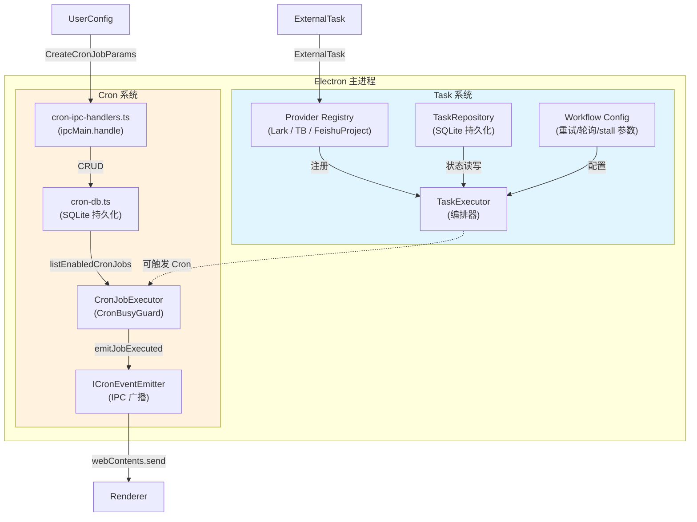
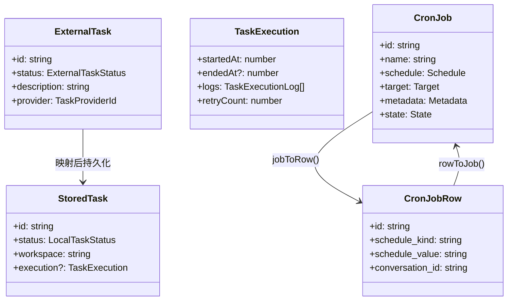
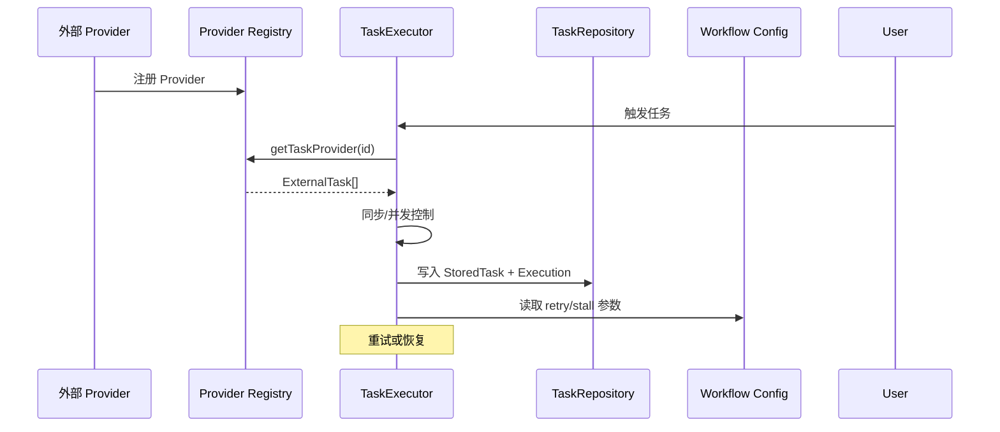
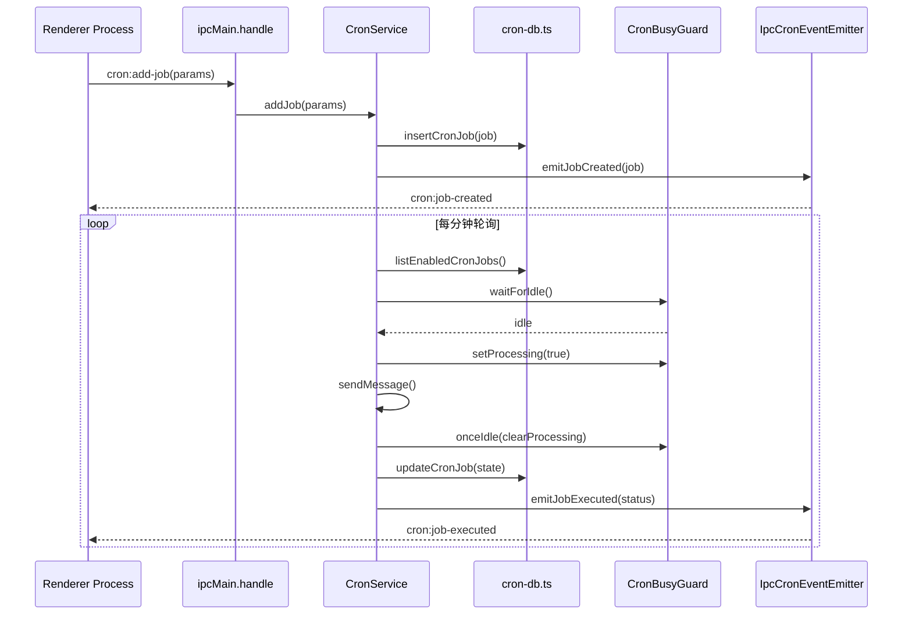

# 任务与调度系统总览

<cite>
**本文引用的文件**

- [src/electron/libs/task/README.md](file=src/electron/libs/task/README.md)
- [src/electron/libs/task/index.ts](file=src/electron/libs/task/index.ts)
- [pro-workflow/scripts/task-completed.js](file=pro-workflow/scripts/task-completed.js)
- [pro-workflow/scripts/task-created.js](file=pro-workflow/scripts/task-created.js)
- [src/electron/libs/cron-db.ts](file=src/electron/libs/cron-db.ts)
- [src/electron/libs/cron-event-emitter.ts](file=src/electron/libs/cron-event-emitter.ts)
- [src/electron/libs/cron-executor.ts](file=src/electron/libs/cron-executor.ts)
- [src/electron/libs/cron-ipc-handlers.ts](file=src/electron/libs/cron-ipc-handlers.ts)
- [scripts/dev.mjs](file=scripts/dev.mjs)
</cite>

## 目录

- [职责定位](#职责定位)
- [核心组件关系图](#核心组件关系图)
- [Task 系统：外部任务源适配](#task-系统外部任务源适配)
- [Cron 系统：定时任务调度](#cron-系统定时任务调度)
- [数据结构总览](#数据结构总览)
- [调用链：从创建到执行的完整路径](#调用链从创建到执行的完整路径)
- [ProWorkflow 钩子脚本](#proworkflow-钩子脚本)
- [扩展点与常见改造路径](#扩展点与常见改造路径)
- [验证与排障命令](#验证与排障命令)

---

## 职责定位

`tech-cc-hub` 的任务与调度系统由两个子系统构成：

| 子系统 | 职责 | 数据来源 | 执行时机 |
|--------|------|----------|----------|
| **Task** | 管理外部任务源（飞书任务、Trello、Feishu Project 等） | 第三方 API 拉取 | 手动触发或自动轮询 |
| **Cron** | 管理基于时间的定时任务调度 | 用户配置 + 会话上下文 | 按 cron 表达式或 interval 触发 |

两者的核心区别在于：**Task 系统是被动接收外部任务**，而 **Cron 系统是主动按时间触发内部消息**。

章节来源：[src/electron/libs/task/README.md#L1-L4](file=src/electron/libs/task/README.md#L1-L4)

---

## 核心组件关系图



图表来源：基于 [src/electron/libs/task/index.ts](file=src/electron/libs/task/index.ts) 和 [src/electron/libs/cron-db.ts](file=src/electron/libs/cron-db.ts) 的模块边界推导

---

## Task 系统：外部任务源适配

### 目录结构

```
src/electron/libs/task/
├── README.md              # 模块边界说明
├── index.ts               # 统一导出
├── types.ts               # 领域类型（ExternalTask、StoredTask 等）
├── executor.ts            # 编排器：同步、自动执行、并发、重试、恢复
├── repository.ts          # SQLite schema、状态持久化
├── workflow.ts            # Symphony-style workflow 配置
├── settings.ts            # 用户任务设置
├── workspace.ts           # 任务独立 workspace 创建
├── provider-registry.ts   # Provider 注册表 + fallback
└── providers/
    ├── lark-provider.ts
    ├── tb-provider.ts
    └── feishu-project-provider.ts
```

### 关键职责

**TaskExecutor** 是唯一调度入口，所有自动/手动执行都经过这里。它负责：

- 从 Provider 拉取 `ExternalTask`
- 映射为内部 `StoredTask`
- 控制并发数、执行顺序
- 管理重试和恢复
- 写入执行日志到 SQLite

章节来源：[src/electron/libs/task/README.md#L19-L21](file=src/electron/libs/task/README.md#L19-L21)

### Provider 注册机制

`provider-registry.ts` 提供注册表，外部模块通过 `getTaskProvider(id)` 获取指定 Provider：

```typescript
// 获取 Provider
const provider = await getTaskProvider('lark');

// 注册新 Provider
registerTaskProvider(new MyProvider());
```

章节来源：[src/electron/libs/task/index.ts#L4](file=src/electron/libs/task/index.ts#L4)

### Workspace 隔离

每个任务执行时使用独立 workspace，避免多个任务互相污染。这通过 `ensureTaskWorkspace(taskId)` 实现。

章节来源：[src/electron/libs/task/README.md#L21](file=src/electron/libs/task/README.md#L21)

---

## Cron 系统：定时任务调度

### 目录结构

```
src/electron/libs/
├── cron-db.ts             # SQLite schema、CRUD、row↔job 转换
├── cron-event-emitter.ts  # ICronEventEmitter 接口定义
├── cron-executor.ts       # CronJobExecutor + CronBusyGuard
├── cron-ipc-handlers.ts   # IPC 通道注册（6 个 handle）
└── cron-types.ts          # CronJob、CronJobRow 等类型
```

### 数据库 Schema

`cron-db.ts` 在应用首次运行时自动创建 `cron_jobs` 表：

| 字段 | 说明 |
|------|------|
| `id` | 主键，UUID |
| `name` | 任务名称 |
| `schedule_kind` | 调度类型：`at` / `every` / `cron` |
| `schedule_value` | 调度值（时间戳 / 毫秒数 / cron 表达式） |
| `payload_message` | 触发时发送的消息内容 |
| `execution_mode` | 执行模式：`existing`（复用已有会话）或 `new_conversation` |
| `conversation_id` | 关联的会话 ID |
| `state.*` | 运行状态：next_run_at、last_run_at、last_status、retry_count 等 |

章节来源：[src/electron/libs/cron-db.ts#L26-L56](file=src/electron/libs/cron-db.ts#L26-L56)

### CronBusyGuard：并发控制

`CronJobExecutor` 内置 `CronBusyGuard`，用于防止同一个会话被并发触发：

```typescript
// 核心方法
isProcessing(conversationId: string): boolean
setProcessing(conversationId: string, value: boolean): void
onceIdle(conversationId: string, callback: () => Promise<void>): void
waitForIdle(conversationId: string, timeoutMs = 60000): Promise<void>
```

关键逻辑：
- 如果会话正在处理，调度器会等待空闲后再执行
- 超时默认 60 秒，超时后抛出 `"等待会话 ${conversationId} 空闲超时"`

章节来源：[src/electron/libs/cron-executor.ts#L62-L70](file=src/electron/libs/cron-executor.ts#L62-L70)

### IPC 通道

| 通道 | 参数 | 返回值 |
|------|------|--------|
| `cron:list-jobs` | — | `CronJob[]` |
| `cron:list-jobs-by-conversation` | `{ conversationId }` | `CronJob[]` |
| `cron:get-job` | `{ jobId }` | `CronJob \| null` |
| `cron:add-job` | `CreateCronJobParams` | 新建的 `CronJob` |
| `cron:update-job` | `{ jobId, updates }` | 更新后的 `CronJob` |
| `cron:remove-job` | `{ jobId }` | `void` |
| `cron:run-now` | `{ jobId }` | `{ conversationId }` |

章节来源：[src/electron/libs/cron-ipc-handlers.ts#L36-L63](file=src/electron/libs/cron-ipc-handlers.ts#L36-L63)

### 事件广播

`IpcCronEventEmitter` 实现 `ICronEventEmitter`，通过 `webContents.send` 向所有 BrowserWindow 广播事件：

```typescript
emitJobCreated(job)    // → "cron:job-created"
emitJobUpdated(job)    // → "cron:job-updated"
emitJobExecuted(...)    // → "cron:job-executed"
emitJobRemoved(jobId)  // → "cron:job-removed"
```

章节来源：[src/electron/libs/cron-ipc-handlers.ts#L9-L32](file=src/electron/libs/cron-ipc-handlers.ts#L9-L32)

---

## 数据结构总览



图表来源：[src/electron/libs/cron-db.ts#L61-L142](file=src/electron/libs/cron-db.ts#L61-L142)

---

## 调用链：从创建到执行的完整路径

### Task 系统调用链



### Cron 系统调用链



---

## ProWorkflow 钩子脚本

在 `pro-workflow/scripts/` 下有两个任务生命周期钩子：

### task-created.js

任务创建时触发，做两件事：

1. **描述长度校验**：少于 5 字符警告，过长（>200 字符）建议拆分
2. **透传 JSON**：原样输出，便于下游流程消费

```bash
echo '{"task_id":"123","description":"xxx"}' | node pro-workflow/scripts/task-created.js
# 输出：如果描述过短，stderr 输出警告
```

章节来源：[pro-workflow/scripts/task-created.js#L8-L16](file=pro-workflow/scripts/task-created.js#L8-L16)

### task-completed.js

任务完成时触发，用于在标记完成前运行质量门禁检查：

```bash
echo '{"task_id":"123","result":"passed"}' | node pro-workflow/scripts/task-completed.js
# 输出：stderr 输出 "Run quality gates before marking done"
```

章节来源：[pro-workflow/scripts/task-completed.js#L8-L9](file=pro-workflow/scripts/task-completed.js#L8-L9)

---

## 扩展点与常见改造路径

### 1. 新增 Task Provider

步骤：
1. 在 `src/electron/libs/task/providers/` 下实现 `XxxTaskProvider`
2. 实现 `TaskProvider` 接口的 `fetchTasks()`、`claimTask()` 等方法
3. 在 `provider-registry.ts` 注册
4. 从 `index.ts` 导出

关键约束：Provider 只负责把第三方任务映射成 `ExternalTask`，不直接改 UI 或会话。

章节来源：[src/electron/libs/task/README.md#L18](file=src/electron/libs/task/README.md#L18)

### 2. 添加 Cron 调度类型

现有 `schedule_kind` 支持三种：`at` / `every` / `cron`。若需添加：

1. 在 `cron-types.ts` 添加新的 schedule kind
2. 在 `cron-db.ts` 的 `jobToRow()` 和 `rowToJob()` 中增加转换分支
3. 在 `CronJobExecutor` 中处理新类型的触发逻辑

章节来源：[src/electron/libs/cron-db.ts#L100-L110](file=src/electron/libs/cron-db.ts#L100-L110)

### 3. 替换数据库层

当前使用 `better-sqlite3` 直接操作 SQLite。如需切换到其他存储：

1. 替换 `getCronDb()` 中的数据库初始化
2. 保持 `insertCronJob`、`updateCronJob` 等函数签名不变
3. 适配 `jobToRow` / `rowToJob` 的序列化格式

章节来源：[src/electron/libs/cron-db.ts#L12-L22](file=src/electron/libs/cron-db.ts#L12-L22)

### 4. 扩展 Cron 执行行为

当前 `CronJobExecutor.executeJob()` 调用 `sendMessage` 或打印日志。若需扩展：

```typescript
// 在构造函数注入更多回调
constructor(
    private readonly busyGuard: CronBusyGuard,
    private readonly sendMessage?: (conversationId, text, mode?) => Promise<void>,
    private readonly onBeforeExecute?: (job: CronJob) => void,
    private readonly onAfterExecute?: (job: CronJob, result) => void,
) {}
```

章节来源：[src/electron/libs/cron-executor.ts#L104-L108](file=src/electron/libs/cron-executor.ts#L104-L108)

---

## 验证与排障命令

### 查看当前 Cron 任务列表

```bash
# 通过 Electron IPC 调用（需在 renderer 中执行）
const jobs = await ipcRenderer.invoke('cron:list-jobs');
console.table(jobs);
```

### 手动触发任务执行

```bash
# 调用 run-now 接口
const result = await ipcRenderer.invoke('cron:run-now', { jobId: 'xxx' });
console.log('conversationId:', result.conversationId);
```

### 检查 Task Provider 状态

```typescript
import { listTaskProviderStates, getTaskProvider } from '../electron/libs/task';

const states = await listTaskProviderStates();
console.log(states);

// 检查单个 Provider
const lark = await getTaskProvider('lark');
const tasks = await lark.fetchTasks();
console.log('Lark tasks:', tasks.length);
```

### 调试 CronBusyGuard 状态

```typescript
import { CronBusyGuard } from '../electron/libs/cron-executor';

// 检查某会话是否忙碌
const busy = busyGuard.isProcessing('conv-123'); // boolean

// 查看最后活跃时间
const lastActive = busyGuard.getLastActiveAt('conv-123'); // timestamp | undefined

// 清理超时状态
busyGuard.cleanup(3600000); // 清理 1 小时前的状态
```

章节来源：[src/electron/libs/cron-executor.ts#L58-60](file=src/electron/libs/cron-executor.ts#L58-60)

### 开发环境启动

```bash
node scripts/dev.mjs
# 同时启动 React (port 3000) + Electron
# 任意子进程失败会导致整体退出
```

章节来源：[scripts/dev.mjs](file=scripts/dev.mjs)

### 数据库直接查询

```bash
sqlite3 ~/.tech-cc-hub/cron.db "SELECT id, name, schedule_kind, next_run_at, last_status FROM cron_jobs ORDER BY next_run_at ASC;"
```

---

## 总结

`tech-cc-hub` 的任务与调度系统由两个正交互补的子系统组成：

- **Task 系统**：处理外部任务源的拉取、映射和执行，核心是 `TaskExecutor` 和 Provider 注册表
- **Cron 系统**：处理基于时间的定时调度，核心是 `CronJobExecutor` + `CronBusyGuard` + SQLite 持久化

两者通过 IPC 层和事件发射机制与 Renderer 进程通信，确保 UI 可以实时感知任务状态变化。

扩展时优先遵循已有边界：Provider 只做任务映射、Repository 只做持久化、Executor 是唯一调度入口。

---

*文档版本：2024 | 模块：module-task-engine | 最后更新：基于最新代码引用*