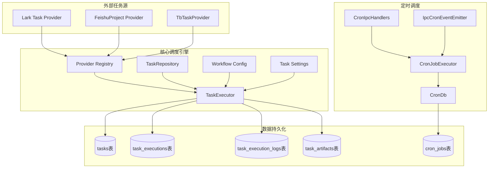
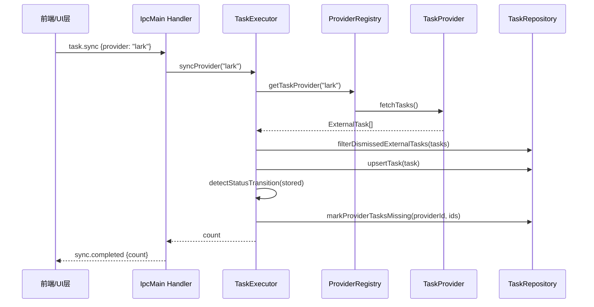
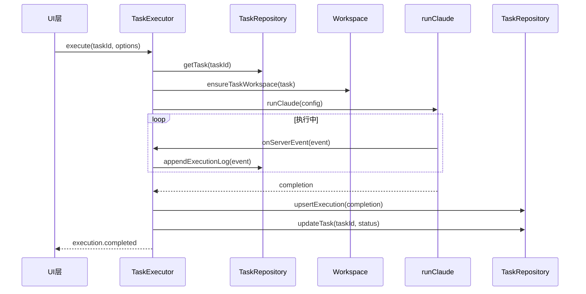

# 任务与调度系统总览

<cite>
**本文引用的文件**
- [src/electron/libs/task/README.md](file://src/electron/libs/task/README.md)
- [src/electron/libs/task/index.ts](file://src/electron/libs/task/index.ts)
- [pro-workflow/scripts/task-completed.js](file=pro-workflow/scripts/task-completed.js)
- [pro-workflow/scripts/task-created.js](file=pro-workflow/scripts/task-created.js)
- [src/electron/libs/cron-db.ts](file=src/electron/libs/cron-db.ts)
- [src/electron/libs/cron-event-emitter.ts](file=src/electron/libs/cron-event-emitter.ts)
- [src/electron/libs/cron-executor.ts](file=src/electron/libs/cron-executor.ts)
- [src/electron/libs/cron-ipc-handlers.ts](file=src/electron/libs/cron-ipc-handlers.ts)
- [src/electron/libs/task/executor.ts](file=src/electron/libs/task/executor.ts)
- [src/electron/libs/task/provider-registry.ts](file=src/electron/libs/task/provider-registry.ts)
- [src/electron/libs/task/providers/feishu-project-provider.ts](file=src/electron/libs/task/providers/feishu-project-provider.ts)
- [src/electron/libs/task/providers/lark-provider.ts](file=src/electron/libs/task/providers/lark-provider.ts)
- [src/electron/libs/task/providers/tb-provider.ts](file=src/electron/libs/task/providers/tb-provider.ts)
- [src/electron/libs/task/repository.ts](file=src/electron/libs/task/repository.ts)
- [src/electron/libs/task/settings.ts](file=src/electron/libs/task/settings.ts)
- [src/electron/libs/task/types.ts](file=src/electron/libs/task/types.ts)
- [src/electron/libs/task/workflow.ts](file=src/electron/libs/task/workflow.ts)
- [src/electron/libs/task/workspace.ts](file=src/electron/libs/task/workspace.ts)
</cite>

---

## 目录

- [职责边界](#职责边界)
- [核心架构图](#核心架构图)
- [入口文件与导出符号](#入口文件与导出符号)
- [调用链详解](#调用链详解)
- [数据结构](#数据结构)
- [Cron 调度子系统](#cron-调度子系统)
- [任务提供者 Provider](#任务提供者-provider)
- [扩展点与配置](#扩展点与配置)
- [常见改造路径](#常见改造路径)
- [排障指南](#排障指南)
- [Agent 改代码地图](#agent-改代码地图)

---

## 职责边界

任务与调度系统（`module-task-engine`）是 tech-cc-hub 的核心执行引擎，负责：

1. **同步外部任务源**：从 Lark、飞书项目、TB 等外部系统拉取任务
2. **编排 AI 执行**：启动 Claude Agent 执行任务，管理并发、重试、恢复
3. **持久化状态**：SQLite 存储任务、执行记录、日志、产物
4. **定时调度**：Cron 定时触发会话消息，替代人工操作

### 模块边界原则

- `Provider` 只负责把第三方任务映射成 `ExternalTask`，不直接改 UI 或会话
- `Repository` 只做持久化，不启动 Runner
- `Executor` 是唯一调度入口，所有自动/手动执行都经过这里
- 任务执行使用独立 Workspace，避免多个任务互相污染

> 章节来源：[src/electron/libs/task/README.md#L1-L22](file=src/electron/libs/task/README.md#L1-L22)

---

## 核心架构图



> 图表来源：基于 [src/electron/libs/task/index.ts](file=src/electron/libs/task/index.ts#L1-L11) 和 [src/electron/libs/task/executor.ts](file=src/electron/libs/task/executor.ts#L88-L102) 的架构分析

---

## 入口文件与导出符号

`src/electron/libs/task/index.ts` 是对外统一出口，外部模块优先从这里 import。

### 核心导出

| 符号 | 来源文件 | 用途 |
|------|----------|------|
| `TaskExecutor` | [executor.ts#L88](file=src/electron/libs/task/executor.ts#L88) | 主调度器，管理任务生命周期 |
| `TaskRepository` | [repository.ts#L21](file=src/electron/libs/task/repository.ts#L21) | SQLite 持久化层 |
| `registerTaskProvider` | [provider-registry.ts#L4](file=src/electron/libs/task/provider-registry.ts#L4) | 注册外部任务源 |
| `getTaskProvider` | [provider-registry.ts#L8](file=src/electron/libs/task/provider-registry.ts#L8) | 获取指定 Provider |
| `listTaskProviders` | [provider-registry.ts#L12](file=src/electron/libs/task/provider-registry.ts#L12) | 列出所有已注册 Provider |
| `listTaskProviderStates` | [provider-registry.ts#L16](file=src/electron/libs/task/provider-registry.ts#L16) | 获取 Provider 状态（含验证） |
| `ensureProvider` | [provider-registry.ts#L65](file=src/electron/libs/task/provider-registry.ts#L65) | 安全获取 Provider，兜底返回 NoopProvider |
| `loadTaskWorkflowConfig` | [workflow.ts#L50](file=src/electron/libs/task/workflow.ts#L50) | 加载 Workflow 配置 |
| `createDefaultTaskWorkflowConfig` | [workflow.ts#L29](file=src/electron/libs/task/workflow.ts#L29) | 创建默认配置 |
| `computeRetryDueAt` | [workflow.ts#L74](file=src/electron/libs/task/workflow.ts#L74) | 计算重试时间（指数退避） |
| `loadTaskSettings` | [settings.ts#L26](file=src/electron/libs/task/settings.ts#L26) | 加载任务设置 |
| `saveTaskSettings` | [settings.ts#L32](file=src/electron/libs/task/settings.ts#L32) | 保存任务设置 |
| `ensureTaskWorkspace` | [workspace.ts#L6](file=src/electron/libs/task/workspace.ts#L6) | 创建任务工作目录 |

### 任务提供者导出

| 符号 | 来源文件 | 用途 |
|------|----------|------|
| `LarkTaskProvider` | [providers/lark-provider.ts#L156](file=src/electron/libs/task/providers/lark-provider.ts#L156) | 飞书任务 |
| `TbTaskProvider` | [providers/tb-provider.ts#L23](file=src/electron/libs/task/providers/tb-provider.ts#L23) | TB 任务 |
| `FeishuProjectTaskProvider` | [providers/feishu-project-provider.ts#L110](file=src/electron/libs/task/providers/feishu-project-provider.ts#L110) | 飞书项目 |

> 章节来源：[src/electron/libs/task/index.ts#L1-L37](file=src/electron/libs/task/index.ts#L1-L37)

---

## 调用链详解

### 任务同步调用链



1. **UI 层**通过 IPC 发送 `task.sync` 事件
2. `TaskExecutor.syncProvider()` 调用 `getTaskProvider()` 获取对应 Provider
3. Provider 执行 `fetchTasks()` 从外部系统拉取任务
4. `TaskRepository` 过滤已 dismiss 的任务，执行 upsert
5. 检测状态变化，更新 `localStatus`
6. 标记外部系统已删除的任务为 stale

### 任务执行调用链



1. `TaskExecutor.execute()` 创建执行上下文
2. 创建独立 Workspace 隔离任务环境
3. 调用 `runClaude()` 启动 Agent
4. 监听 ServerEvent，实时写入执行日志
5. 完成后更新 `task_executions` 和 `tasks` 表

> 图表来源：基于 [src/electron/libs/task/executor.ts#L88-L221](file=src/electron/libs/task/executor.ts#L88-L221) 的执行流程分析

---

## 数据结构

### 核心类型

```typescript
// src/electron/libs/task/types.ts

// Provider 标识符
export type TaskProviderId = "lark" | "tb" | "feishu-project";

// 外部系统状态
export type ExternalTaskStatus = "pending" | "in_progress" | "done" | "cancelled";

// 本地状态（含执行阶段）
export type LocalTaskStatus = ExternalTaskStatus | "queued" | "executing" | "retrying" | "paused" | "completed" | "failed";

// 认领状态
export type TaskClaimState = "unclaimed" | "claimed" | "queued" | "running" | "retrying" | "released";

// 外部任务（Provider 拉取后）
export type ExternalTask = {
  id: string;
  externalId: string;
  provider: TaskProviderId;
  title: string;
  description?: string;
  status: ExternalTaskStatus;
  assignee?: string;
  priority: TaskPriority;
  dueDate?: number;
  sourceData: Record<string, unknown>;
  createdAt: number;
  updatedAt: number;
};

// 已存储任务（含本地状态）
export type StoredTask = ExternalTask & {
  localStatus: LocalTaskStatus;
  claimState: TaskClaimState;
  retryAttempt: number;
  retryDueAt?: number;
  lastError?: string;
  workspacePath?: string;
  driverId?: TaskAgentDriverId;
  model?: string;
  reasoningMode?: TaskReasoningMode;
  maxCostUsd?: number;
  inputTokens?: number;
  outputTokens?: number;
  estimatedCostUsd?: number;
  cancelRequestedAt?: number;
  pausedAt?: number;
  lastSyncedAt: number;
  lastExecutedAt?: number;
  executionSessionId?: string;
};

// 任务执行记录
export type TaskExecution = {
  id: string;
  taskId: string;
  sessionId: string;
  status: "running" | "completed" | "failed" | "cancelled";
  attempt?: number;
  driverId?: TaskAgentDriverId;
  model?: string;
  reasoningMode?: TaskReasoningMode;
  maxCostUsd?: number;
  inputTokens?: number;
  outputTokens?: number;
  estimatedCostUsd?: number;
  startedAt: number;
  completedAt?: number;
  lastEventAt?: number;
  terminalReason?: string;
  result?: string;
  error?: string;
};
```

> 章节来源：[src/electron/libs/task/types.ts#L1-L101](file=src/electron/libs/task/types.ts#L1-L101)

### SQLite 表结构

| 表名 | 用途 | 关键字段 |
|------|------|----------|
| `tasks` | 任务主表 | `id`, `external_id`, `provider`, `local_status`, `claim_state`, `retry_attempt`, `workspace_path` |
| `task_executions` | 执行记录 | `id`, `task_id`, `session_id`, `status`, `attempt`, `started_at`, `completed_at`, `terminal_reason` |
| `task_execution_logs` | 执行日志 | `id`, `execution_id`, `task_id`, `level`, `message`, `timestamp` |
| `task_subtasks` | 子任务 | `id`, `task_id`, `title`, `status`, `sort_order` |
| `task_artifacts` | 产物记录 | `id`, `task_id`, `path`, `kind`, `summary` |
| `task_dismissals` | 已忽略任务 | `provider`, `external_id`, `deleted_at` |
| `cron_jobs` | 定时任务 | `id`, `schedule_kind`, `schedule_value`, `enabled`, `conversation_id`, `last_status` |

> 章节来源：[src/electron/libs/task/repository.ts#L32-L135](file=src/electron/libs/task/repository.ts#L32-L135) 和 [src/electron/libs/cron-db.ts#L26-L56](file=src/electron/libs/cron-db.ts#L26-L56)

---

## Cron 调度子系统

### 模块组成

| 文件 | 导出符号 | 职责 |
|------|----------|------|
| `cron-db.ts` | `getCronDb`, `insertCronJob`, `updateCronJob`, `deleteCronJob`, `listEnabledCronJobs` | 定时任务 CRUD |
| `cron-event-emitter.ts` | `ICronEventEmitter` | 定时任务事件接口 |
| `cron-executor.ts` | `ICronJobExecutor`, `CronBusyGuard`, `CronJobExecutor` | 定时任务执行器 |
| `cron-ipc-handlers.ts` | `IpcCronEventEmitter`, `registerCronIpcHandlers` | IPC 桥接层 |

### IPC Channel

| Channel | 方向 | 用途 |
|---------|------|------|
| `cron:list-jobs` | handle | 列出所有定时任务 |
| `cron:list-jobs-by-conversation` | handle | 按会话列出定时任务 |
| `cron:get-job` | handle | 获取单个定时任务 |
| `cron:add-job` | handle | 创建定时任务 |
| `cron:update-job` | handle | 更新定时任务 |
| `cron:remove-job` | handle | 删除定时任务 |
| `cron:run-now` | handle | 立即执行定时任务 |
| `cron:job-created` | send (Renderer) | 新建任务事件 |
| `cron:job-updated` | send (Renderer) | 更新任务事件 |
| `cron:job-executed` | send (Renderer) | 执行完成事件 |
| `cron:job-removed` | send (Renderer) | 删除任务事件 |

> 章节来源：[src/electron/libs/cron-ipc-handlers.ts#L35-L64](file=src/electron/libs/cron-ipc-handlers.ts#L35-L64)

### CronBusyGuard 忙闲判断

`CronBusyGuard` 维护会话级别的忙闲状态，用于防止定时任务在用户正在对话时触发。

```typescript
// src/electron/libs/cron-executor.ts#L25-L89
export class CronBusyGuard {
  private states = new Map<string, ConversationState>();

  // 检查会话是否繁忙
  isProcessing(conversationId: string): boolean;

  // 设置忙闲状态
  setProcessing(conversationId: string, value: boolean): void;

  // 等待会话空闲
  async waitForIdle(conversationId: string, timeoutMs = 60000): Promise<void>;

  // 空闲时回调
  onceIdle(conversationId: string, callback: IdleCallback): void;
}
```

使用场景：定时任务触发前检查会话是否被用户占用，若忙则排队等待。

---

## 任务提供者 Provider

### Provider 接口

```typescript
// src/electron/libs/task/types.ts#L229-L240
export interface TaskProvider {
  readonly id: TaskProviderId;
  readonly name: string;
  isEnabled?(): boolean;
  getCapabilities?(): TaskProviderCapability[];
  fetchTasks(): Promise<ExternalTask[]>;
  getTask(externalId: string): Promise<ExternalTask | null>;
  updateTaskStatus(externalId: string, status: ExternalTaskStatus): Promise<void>;
  appendTaskComment?(externalId: string, text: string): Promise<void>;
  deleteTask?(externalId: string): Promise<void>;
  validateConfig(): Promise<{ valid: boolean; error?: string }>;
}
```

### Provider 注册表

```typescript
// src/electron/libs/task/provider-registry.ts#L1-L72
const registry = new Map<TaskProviderId, TaskProvider>();

export function registerTaskProvider(provider: TaskProvider): void;
export function getTaskProvider(id: TaskProviderId): TaskProvider | undefined;
export function listTaskProviders(): TaskProvider[];
export async function listTaskProviderStates(): Promise<TaskProviderState[]>;
export function ensureProvider(id: TaskProviderId): TaskProvider;
```

### 内置 Provider

| Provider | ID | 配置来源 | 关键能力 |
|----------|-----|----------|----------|
| `LarkTaskProvider` | `lark` | `channels.items.lark.cliCommand` 或 `LARK_CLI_COMMAND` 环境变量 | fetch, status-writeback, comment-writeback, delete, cli-configurable |
| `FeishuProjectTaskProvider` | `feishu-project` | `feishuProject.workItemType` 或 `FEISHU_PROJECT_*` 环境变量 | fetch, status-writeback, comment-writeback, delete |
| `TbTaskProvider` | `tb` | `tasks.tbCliCommand`, `tasks.tbFetchArgsTemplate` 设置 | fetch, status-writeback, comment-writeback, delete, cli-configurable |

> 章节来源：[src/electron/libs/task/providers/lark-provider.ts#L156-L198](file=src/electron/libs/task/providers/lark-provider.ts#L156-L198), [src/electron/libs/task/providers/feishu-project-provider.ts#L110-L122](file=src/electron/libs/task/providers/feishu-project-provider.ts#L110-L122), [src/electron/libs/task/providers/tb-provider.ts#L23-L36](file=src/electron/libs/task/providers/tb-provider.ts#L23-L36)

---

## 扩展点与配置

### Workflow 配置

`TaskWorkflowConfig` 控制调度行为：

```yaml
---
polling:
  intervalMs: 30000
agent:
  maxConcurrentAgents: 1
  maxAutoRetries: 2
  maxRetryBackoffMs: 300000
  stallTimeoutMs: 300000
hooks:
  timeoutMs: 30000
workspace:
  root: ./task-workspaces
---

# 可选的 prompt 模板（放在 --- 分隔符之后）
你是一个任务执行助手...
```

配置加载优先级：
1. `TASK_WORKFLOW.md` 或 `WORKFLOW.md` 文件（通过 `TECH_CC_TASK_WORKFLOW` 环境变量覆盖路径）
2. `userDataPath` 下的默认配置

> 章节来源：[src/electron/libs/task/workflow.ts#L51-L73](file=src/electron/libs/task/workflow.ts#L51-L73)

### 任务设置

`TaskWorkflowSettings` 存储在全局配置中：

```typescript
// src/electron/libs/task/settings.ts#L7-L24
export function createDefaultTaskSettings(): TaskWorkflowSettings {
  return {
    pollingIntervalMs: 30000,
    maxConcurrentAgents: 1,
    maxAutoRetries: 2,
    maxRetryBackoffMs: 300000,
    stallTimeoutMs: 300000,
    defaultDriverId: "claude",
    defaultReasoningMode: "high",
    maxCostUsd: undefined,
    writeBackEnabled: true,
    promptTemplate: undefined,
    tbCliCommand: "",
    tbFetchArgsTemplate: "",
    tbUpdateArgsTemplate: "",
    tbCommentArgsTemplate: "",
  };
}
```

配置存储位置：`config-store` 中的 `tasks` 键。

### ProWorkflow Hook

任务创建和完成时可以触发外部脚本：

| 脚本 | 触发时机 | 输入 |
|------|----------|------|
| `pro-workflow/scripts/task-created.js` | 任务创建时 | `{task_id, description, ...}` |
| `pro-workflow/scripts/task-completed.js` | 任务完成时 | `{task_id, result, ...}` |

示例：任务描述长度校验（[task-created.js#L10-L16](file=pro-workflow/scripts/task-created.js#L10-L16)）

```javascript
if (description.length < 5) {
  console.error('[ProWorkflow] Task description too short — add detail for tracking');
}

if (description.length > 200) {
  console.error('[ProWorkflow] Task description very long — consider breaking into subtasks');
}
```

---

## 常见改造路径

### 添加新 Provider

1. 在 `src/electron/libs/task/providers/` 创建新文件（如 `new-provider.ts`）
2. 实现 `TaskProvider` 接口
3. 在模块入口 [index.ts](file=src/electron/libs/task/index.ts#L1-L37) 添加导出
4. 在 `TaskExecutor` 初始化时调用 `registerTaskProvider()`

### 修改任务状态流

1. 定位 `LocalTaskStatus` 类型定义：[types.ts#L12-L19](file=src/electron/libs/task/types.ts#L12-L19)
2. 修改 `TaskRepository` 的状态转换逻辑：[repository.ts#L204-L209](file=src/electron/libs/task/repository.ts#L204-L209)
3. 更新 UI 层对状态的展示逻辑

### 扩展 Cron 调度

1. 在 `cron-types.ts` 添加新的 schedule 类型
2. 修改 `cron-db.ts` 的 `jobToRow`/`rowToJob` 转换函数
3. 在 `cron-executor.ts` 实现新的执行逻辑

### 调整重试策略

1. 修改 `computeRetryDueAt` 函数：[workflow.ts#L74-L79](file=src/electron/libs/task/workflow.ts#L74-L79)
2. 调整 `DEFAULT_MAX_AUTO_RETRIES` 和 `DEFAULT_MAX_RETRY_BACKOFF_MS` 常量
3. 更新 `TaskWorkflowSettings` 中的用户可配置项

---

## 排障指南

### Provider 配置验证失败

```bash
# 检查 Provider 状态
node -e "
const { listTaskProviderStates } = require('./dist/electron/libs/task/provider-registry.js');
listTaskProviderStates().then(states => console.log(JSON.stringify(states, null, 2)));
"
```

常见错误：
- `lark-cli 已配置 App，但还没有用户授权`：运行 `lark-cli auth login --domain task`
- `feishu-project CLI 不可用`：检查 `FEISHU_PROJECT_CLI` 环境变量或 `feishuProject.cliCommand` 配置

> 章节来源：[src/electron/libs/task/providers/lark-provider.ts#L141-L155](file=src/electron/libs/task/providers/lark-provider.ts#L141-L155)

### 任务卡在 executing

检查 `task_executions` 表的 `last_event_at` 字段：
- 若超过 `stallTimeoutMs`（默认 5 分钟），任务被判定为 stalled
- 排查 Runner 是否正常运行
- 检查 `runningExecutions` Map 中是否存在残留

> 章节来源：[src/electron/libs/task/executor.ts#L205-L209](file=src/electron/libs/task/executor.ts#L205-L209)

### Workspace 路径越界

`assertInsideRoot` 函数会检测路径穿越攻击：
- Workspace 路径必须在配置根目录下
- 异常抛出：`Task workspace escaped root: ${targetPath}`

> 章节来源：[src/electron/libs/task/workspace.ts#L31-L35](file=src/electron/libs/task/workspace.ts#L31-L35)

### 数据库迁移失败

`TaskRepository.resetTaskTablesIfOutdated` 会检测 schema 版本：
- 若缺少必要列，删除所有表并重建
- 检查 `hasTasksColumns`、`hasExecutionColumns`、`hasChildTables` 返回值
- **警告**：会丢失历史数据

> 章节来源：[src/electron/libs/task/repository.ts#L138-L182](file=src/electron/libs/task/repository.ts#L138-L182)

---

## Agent 改代码地图

### 改代码前的必读文件

| 优先级 | 文件 | 原因 |
|--------|------|------|
| P0 | `src/electron/libs/task/types.ts` | 所有类型定义在此，修改前需确认类型传播 |
| P0 | `src/electron/libs/task/executor.ts` | 核心调度逻辑，任何改动影响整个系统 |
| P1 | `src/electron/libs/task/repository.ts` | SQLite Schema，任何表结构变更需同步迁移逻辑 |
| P1 | `src/electron/libs/task/provider-registry.ts` | Provider 注册中心，新增 Provider 需在此注册 |
| P2 | `src/electron/libs/cron-db.ts` | Cron 持久化，若需新增字段需修改 `jobToRow`/`rowToJob` |

### 关键符号速查

| 符号 | 文件:行号 | 说明 |
|------|----------|------|
| `TaskExecutor` | [executor.ts#L88](file=src/electron/libs/task/executor.ts#L88) | 主类，构造函数接受 `TaskRepository` 和事件回调 |
| `TaskExecutor.syncProvider()` | [executor.ts#L140](file=src/electron/libs/task/executor.ts#L140) | 同步单个 Provider |
| `TaskExecutor.startPolling()` | [executor.ts#L180](file=src/electron/libs/task/executor.ts#L180) | 启动定时轮询 |
| `TaskRepository.upsertTask()` | [repository.ts#L198](file=src/electron/libs/task/repository.ts#L198) | 插入或更新任务 |
| `TaskRepository.getStats()` | [repository.ts#L...](file=src/electron/libs/task/repository.ts#L...) | 聚合统计 |
| `CronJobExecutor.executeJob()` | [cron-executor.ts#L114](file=src/electron/libs/cron-executor.ts#L114) | 执行定时任务 |
| `registerCronIpcHandlers()` | [cron-ipc-handlers.ts#L35](file=src/electron/libs/cron-ipc-handlers.ts#L35) | 注册所有 cron IPC |

### IPC Channel 速查

**Renderer → Main (ipcMain.handle)**
- `task.list` - 列出任务
- `task.sync` - 同步 Provider
- `task.execute` - 执行任务
- `task.control` - 控制任务（pause/resume/cancel）
- `cron:list-jobs` - 列出定时任务

**Main → Renderer (webContents.send)**
- `task.updated` - 任务更新
- `task.execution.completed` - 执行完成
- `cron:job-created/updated/executed/removed` - Cron 事件

### 表结构速查

| 表 | 主键 | 外键 | 关键索引 |
|----|------|------|----------|
| `tasks` | `id` | - | `idx_tasks_provider`, `idx_tasks_local_status`, `idx_tasks_retry_due` |
| `task_executions` | `id` | `task_id` | `idx_task_executions_task` |
| `cron_jobs` | `id` | - | `idx_cron_jobs_conversation`, `idx_cron_jobs_next_run` |

### 修改入口点

| 场景 | 入口文件 | 关键修改点 |
|------|----------|------------|
| 新增 Provider | `providers/` + `index.ts` | 实现 `TaskProvider` 接口，导出，调用 `registerTaskProvider()` |
| 新增 Cron 字段 | `cron-db.ts` + `cron-types.ts` | `jobToRow`/`rowToJob`，`insertCronJob`/`updateCronJob` |
| 新增任务状态 | `types.ts` + `repository.ts` | `LocalTaskStatus`，`upsertTask` 状态转换 |
| 修改重试逻辑 | `workflow.ts` | `computeRetryDueAt`，默认常量 |
| 修改配置存储 | `settings.ts` | `CONFIG_KEY`，`loadTaskSettings`/`saveTaskSettings` |

### 验证命令

```bash
# 验证 TypeScript 编译
npx tsc --noEmit src/electron/libs/task/**/*.ts

# 验证 Provider 注册
node -e "
import { listTaskProviders, listTaskProviderStates } from './dist/electron/libs/task/index.js';
console.log('Providers:', listTaskProviders().map(p => p.id));
console.log('States:', listTaskProviderStates());
"

# 验证 SQLite Schema
sqlite3 ~/.tech-cc-hub/task.db ".schema tasks"

# 验证 Cron 数据库
sqlite3 ~/.tech-cc-hub/cron.db ".schema cron_jobs"

# 验证 Workflow 加载
node -e "
import { loadTaskWorkflowConfig } from './dist/electron/libs/task/workflow.js';
const config = loadTaskWorkflowConfig({ cwd: process.cwd() });
console.log(JSON.stringify(config, null, 2));
"
```

### 常见回归风险

| 风险 | 预防措施 |
|------|----------|
| Provider 未注册导致 NoopProvider 兜底 | 修改 `provider-registry.ts` 后调用 `registerTaskProvider()` |
| Schema 版本不兼容导致表重建 | 修改 `repository.ts` 后测试 `resetTaskTablesIfOutdated` 分支 |
| Cron 字段丢失 | 修改 `cron-db.ts` 后测试 `jobToRow`/`rowToJob` 往返 |
| Workflow 配置覆盖失效 | 修改 `workflow.ts` 后测试 `loadTaskWorkflowConfig` 优先级 |
| IPC Channel 拼写错误 | 修改 `cron-ipc-handlers.ts` 后同步更新前端调用方 |

---

## 验证命令汇总

| 验证项 | 命令 |
|--------|------|
| TypeScript 类型检查 | `npx tsc --noEmit src/electron/libs/task/` |
| Provider 列表 | `node -e "const {listTaskProviders} = require('./dist/electron/libs/task/index.js'); console.log(listTaskProviders().map(p => p.id));"` |
| Provider 状态（含验证） | `node -e "const {listTaskProviderStates} = require('./dist/electron/libs/task/index.js'); listTaskProviderStates().then(console.log);"` |
| Task 数据库 Schema | `sqlite3 ~/.tech-cc-hub/task.db ".schema"` |
| Cron 数据库 Schema | `sqlite3 ~/.tech-cc-hub/cron.db ".schema"` |
| Workflow 配置加载 | `node -e "const {loadTaskWorkflowConfig} = require('./dist/electron/libs/task/workflow.js'); console.log(JSON.stringify(loadTaskWorkflowConfig({cwd:'.'}), null, 2));"` |
| 任务统计 | `sqlite3 ~/.tech-cc-hub/task.db "SELECT local_status, COUNT(*) FROM tasks GROUP BY local_status;"` |
| 活跃执行 | `sqlite3 ~/.tech-cc-hub/task.db "SELECT id, task_id, status, started_at FROM task_executions WHERE status = 'running';"` |

---

**文档版本**：v1.0
**最后更新**：基于当前代码库 snapshot
**维护者**：module-task-engine 团队