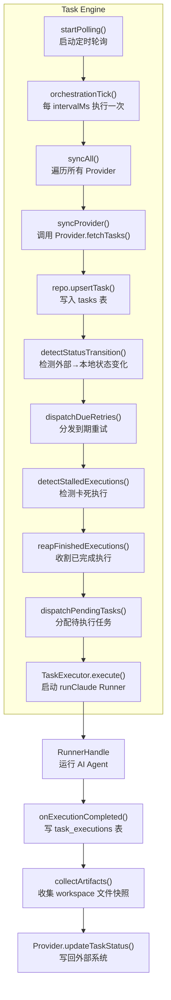
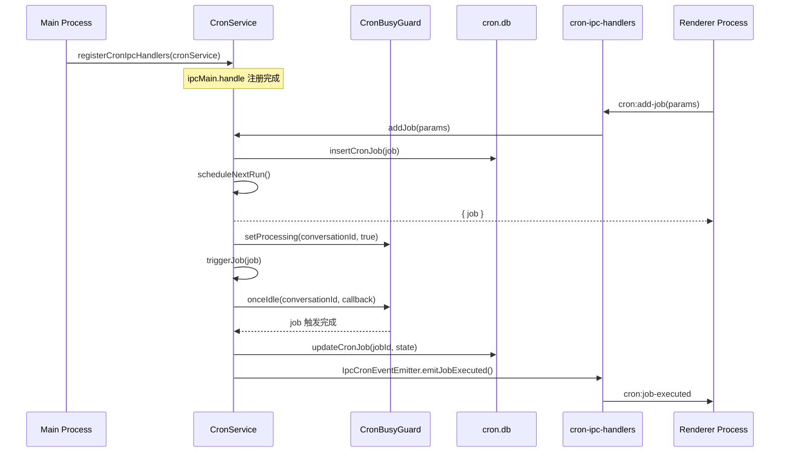

# 任务与调度系统总览

<cite>
**本文引用的文件**
- [src/electron/libs/task/README.md](file://src/electron/libs/task/README.md)
- [src/electron/libs/task/index.ts](file://src/electron/libs/task/index.ts)
- [pro-workflow/scripts/task-completed.js](file://pro-workflow/scripts/task-completed.js)
- [pro-workflow/scripts/task-created.js](file://pro-workflow/scripts/task-created.js)
- [src/electron/libs/cron-db.ts](file://src/electron/libs/cron-db.ts)
- [src/electron/libs/cron-event-emitter.ts](file://src/electron/libs/cron-event-emitter.ts)
- [src/electron/libs/cron-executor.ts](file://src/electron/libs/cron-executor.ts)
- [src/electron/libs/cron-ipc-handlers.ts](file://src/electron/libs/cron-ipc-handlers.ts)
- [src/electron/libs/task/executor.ts](file://src/electron/libs/task/executor.ts)
- [src/electron/libs/task/provider-registry.ts](file://src/electron/libs/task/provider-registry.ts)
- [src/electron/libs/task/providers/feishu-project-provider.ts](file://src/electron/libs/task/providers/feishu-project-provider.ts)
- [src/electron/libs/task/providers/lark-provider.ts](file://src/electron/libs/task/providers/lark-provider.ts)
- [src/electron/libs/task/providers/tb-provider.ts](file://src/electron/libs/task/providers/tb-provider.ts)
- [src/electron/libs/task/repository.ts](file://src/electron/libs/task/repository.ts)
- [src/electron/libs/task/settings.ts](file://src/electron/libs/task/settings.ts)
- [src/electron/libs/task/types.ts](file://src/electron/libs/task/types.ts)
- [src/electron/libs/task/workflow.ts](file://src/electron/libs/task/workflow.ts)
- [src/electron/libs/task/workspace.ts](file://src/electron/libs/task/workspace.ts)
</cite>

---

## 目录

- [1. 系统定位与核心职责](#1-系统定位与核心职责)
- [2. 文件结构与模块边界](#2-文件结构与模块边界)
- [3. 数据流与调用链](#3-数据流与调用链)
- [4. 关键数据结构](#4-关键数据结构)
- [5. 调度策略与重试机制](#5-调度策略与重试机制)
- [6. Provider 体系（外部任务源适配）](#6-provider-体系外部任务源适配)
- [7. 定时任务（Cron）子系统](#7-定时任务cron子系统)
- [8. 配置体系](#8-配置体系)
- [9. 失败模式与排障](#9-失败模式与排障)
- [10. 扩展点与常见改造路径](#10-扩展点与常见改造路径)
- [11. Agent 改代码地图](#11-agent-改代码地图)

---

## 1. 系统定位与核心职责

任务与调度系统由两个正交子系统构成：

| 子系统 | 职责 | 入口 |
|---|---|---|
| **Task Engine** | 从外部任务源（Lark/TB/飞书项目）拉取任务，驱动 AI Agent 自动执行，写回状态 | `TaskExecutor`（`src/electron/libs/task/executor.ts`） |
| **Cron Scheduler** | 管理定时任务规则，在指定时间触发会话消息推送 | `CronJobExecutor`（`src/electron/libs/cron-executor.ts`） |

Task Engine 的核心设计原则：**外部 Provider 只负责将第三方任务映射为 `ExternalTask`，不直接改 UI 或会话；Repository 只做持久化，不启动 Runner；`TaskExecutor` 是唯一调度入口**。
[章节来源](file://src/electron/libs/task/README.md#L5-L22)

Cron 子系统的职责：管理 `cron_jobs` 表的 CRUD，通过 `CronBusyGuard` 控制会话并发，通过 IPC bridge 向渲染进程推送事件。
[章节来源](file://src/electron/libs/cron-event-emitter.ts#L6-L11)

---

## 2. 文件结构与模块边界

```
src/electron/libs/
├── task/                        # Task Engine 主目录
│   ├── index.ts                 # 统一导出入口，外部模块从这里 import
│   ├── types.ts                 # 所有领域类型：ExternalTask, StoredTask, TaskExecution, IPC payload
│   ├── executor.ts              # 核心编排器：同步、自动执行、并发控制、重试、恢复、日志事件
│   ├── repository.ts             # SQLite schema + 任务状态/执行记录/日志持久化
│   ├── provider-registry.ts     # Provider 注册表 + NoopProvider fallback
│   ├── settings.ts              # 用户级任务配置读写（存储在 globalRuntimeConfig）
│   ├── workflow.ts              # Workflow YAML/MD 配置解析 + 默认参数
│   ├── workspace.ts             # 每个任务独立 workspace 目录创建和路径安全
│   └── providers/
│       ├── lark-provider.ts      # 飞书任务 Provider，通过 lark-cli 调用 /open-apis/task/v2/tasks
│       ├── tb-provider.ts       # 通用 CLI 任务 Provider，通过模板渲染 + execFile 执行
│       └── feishu-project-provider.ts  # 飞书项目 Provider，通过 feishu-project CLI
├── cron-db.ts                   # cron_jobs 表 CRUD
├── cron-event-emitter.ts        # Cron 生命周期事件接口
├── cron-executor.ts              # Cron 触发执行器 + CronBusyGuard 并发控制
└── cron-ipc-handlers.ts          # IPC handle 注册：cron:list-jobs 等 7 个 channel

pro-workflow/scripts/
├── task-created.js               # 任务创建 Hook：校验描述长度（<5 太短，>200 建议拆分）
└── task-completed.js             # 任务完成 Hook：透传 JSON，可在此跑质量门禁
```

**模块边界要点**：

- `types.ts` 定义 `TaskProvider` 接口（`fetchTasks`、`updateTaskStatus`、`validateConfig` 等），所有 Provider 必须实现此接口。
  [章节来源](file://src/electron/libs/task/types.ts#L229-L240)
- `provider-registry.ts` 维护 `Map<TaskProviderId, TaskProvider>` 注册表，`ensureProvider` 对未注册的 ID 返回 `NoopProvider`。
  [章节来源](file://src/electron/libs/task/provider-registry.ts#L1-L72)
- Repository 自行建表 `tasks`、`task_executions`、`task_execution_logs`、`task_subtasks`、`task_artifacts`、`task_dismissals`，schema 变化时会 `DROP TABLE` 重建（旧数据丢弃）。
  [章节来源](file://src/electron/libs/task/repository.ts#L30-L136)

---

## 3. 数据流与调用链

### 3.1 Task Engine 调用链



[图表来源](file://src/electron/libs/task/executor.ts#L88-L250) + [图表来源](file://src/electron/libs/task/repository.ts#L198-L230)

**关键调用顺序**（`executor.ts` 行号对应）：

1. `startPolling(intervalMs)` → 启动 `setInterval` 定时器（L180-L190）
2. `orchestrationTick({ sync: true })` → 在定时器回调里执行全链路编排（L201-L220）
3. `syncAll()` → 遍历 `provider-registry` 中的每个 Provider（L170-L176）
4. `syncProvider(providerId)` → 调用 Provider 的 `fetchTasks()`，结果写入 Repository（L140-L168）
5. `dispatchPendingTasks()` → 查找 `local_status = 'pending'` 且未被占用的任务，调用 `execute()`（L270-L290）
6. `execute(taskId, options)` → 创建 `RunningExecution`，调用 `runClaude()` 启动 Agent（L290-L500）

### 3.2 Cron 子系统调用链



[图表来源](file://src/electron/libs/cron-ipc-handlers.ts#L35-L64) + [图表来源](file://src/electron/libs/cron-executor.ts#L24-L89)

**IPC Channel 列表**（全部在 `cron-ipc-handlers.ts` 注册）：

| Channel | 方向 | 说明 |
|---|---|---|
| `cron:list-jobs` | handle | 返回所有 cron job |
| `cron:list-jobs-by-conversation` | handle | 按会话 ID 过滤 |
| `cron:get-job` | handle | 按 jobId 查询 |
| `cron:add-job` | handle | 创建新 job |
| `cron:update-job` | handle | 更新已有 job |
| `cron:remove-job` | handle | 删除 job |
| `cron:run-now` | handle | 立即触发一次执行 |
| `cron:job-created` | send | 渲染进程接收：job 创建事件 |
| `cron:job-executed` | send | 渲染进程接收：job 执行结果 |
| `cron:job-updated` | send | 渲染进程接收：job 更新事件 |
| `cron:job-removed` | send | 渲染进程接收：job 删除事件 |

[章节来源](file://src/electron/libs/cron-ipc-handlers.ts#L36-L63)

---

## 4. 关键数据结构

### 4.1 任务类型层次

```
ExternalTask           # 来自第三方系统的原始数据（Provider 映射产出）
  └── StoredTask       # 存入 SQLite 的完整记录（加 localStatus/claimState 等）
       ├── localStatus: LocalTaskStatus = pending | queued | executing | retrying | paused | completed | failed
       ├── claimState:  TaskClaimState  = unclaimed | claimed | queued | running | retrying | released
       └── workspacePath: 任务专属工作目录
```

[章节来源](file://src/electron/libs/task/types.ts#L46-L80)

### 4.2 任务执行记录

```
TaskExecution
  status: "running" | "completed" | "failed" | "cancelled"
  attempt: number
  terminalReason?: string
  inputTokens / outputTokens / estimatedCostUsd
  startedAt / completedAt / lastEventAt
```

[章节来源](file://src/electron/libs/task/types.ts#L82-L101)

### 4.3 Cron Job 结构

```
CronJob
  schedule: { kind: "cron" | "at" | "every", ... }
  target:   { payload: { kind: "message", text }, executionMode }
  metadata: { conversationId, agentType, createdBy, createdAt }
  state:    { nextRunAtMs, lastRunAtMs, lastStatus, runCount, retryCount, maxRetries }
```

[章节来源](file://src/electron/libs/cron-db.ts#L59-L142)

### 4.4 IPC 事件类型（Task → Renderer）

通过 `emitServerEvent` 发送的 `TaskServerEvent` 联合类型：

```typescript
type TaskServerEvent =
  | { type: "task.list"; payload: { tasks: StoredTask[] } }
  | { type: "task.updated"; payload: { task: StoredTask } }
  | { type: "task.execution.completed"; payload: { execution: TaskExecution } }
  | { type: "task.sync.completed"; payload: { provider: TaskProviderId; count: number } }
  | { type: "task.error"; payload: { message: string } };
```

[章节来源](file://src/electron/libs/task/types.ts#L202-L214)

---

## 5. 调度策略与重试机制

### 5.1 默认参数（`workflow.ts`）

| 参数 | 默认值 | 说明 |
|---|---|---|
| `polling.intervalMs` | 30000 | 轮询间隔 30s |
| `agent.maxConcurrentAgents` | 1 | 最大并发 Agent 数 |
| `agent.maxAutoRetries` | 2 | 自动重试次数 |
| `agent.maxRetryBackoffMs` | 300000 (5min) | 重试退避上限 |
| `agent.stallTimeoutMs` | 300000 (5min) | 执行无响应超时 |
| `hooks.timeoutMs` | 30000 | Hook 脚本超时 |

[章节来源](file://src/electron/libs/task/workflow.ts#L23-L28)

### 5.2 重试退避算法

```typescript
// computeRetryDueAt(executor.ts)
// 公式: delay = min(10000 * 2^(attempt-1), maxRetryBackoffMs)
const delayMs = Math.min(10000 * 2 ** (normalizedAttempt - 1), config.agent.maxRetryBackoffMs);
return now + delayMs;
// 第1次重试: 10s, 第2次: 20s, 第3次: 40s, 封顶 5min
```

[章节来源](file://src/electron/libs/task/executor.ts#L248) + [章节来源](file://src/electron/libs/task/workflow.ts#L75-L79)

### 5.3 Stall 检测

每轮 `orchestrationTick` 调用 `detectStalledExecutions()`，检查 `lastEventAt` 与当前时间差是否超过 `stallTimeoutMs`，超时则标记为 `failed`。
[章节来源](file://src/electron/libs/task/executor.ts#L205)

### 5.4 中断恢复

应用重启后 `startPolling` 会调用 `recoverInterruptedExecutions()` 和 `restoreRetryTimers()`，将仍在 `running` 状态但进程已中断的执行标记为失败，并恢复待重试任务。
[章节来源](file://src/electron/libs/task/executor.ts#L183-L184)

---

## 6. Provider 体系（外部任务源适配）

### 6.1 Provider 接口

```typescript
interface TaskProvider {
  readonly id: TaskProviderId;   // "lark" | "tb" | "feishu-project"
  readonly name: string;
  isEnabled?(): boolean;
  getCapabilities?(): TaskProviderCapability[];
  fetchTasks(): Promise<ExternalTask[]>;
  getTask(externalId: string): Promise<ExternalTask | null>;
  updateTaskStatus(externalId: string, status: ExternalTaskStatus): Promise<void>;
  appendTaskComment?(externalId: string, text: string): Promise<void>;
  deleteTask?(externalId: string): Promise<void>;
  validateConfig(): Promise<{ valid: boolean; error?: string }>;
}
```

[章节来源](file://src/electron/libs/task/types.ts#L229-L240)

### 6.2 三个 Provider 对比

| Provider | ID | 配置来源 | 状态映射函数 | CLI 工具 |
|---|---|---|---|---|
| `LarkTaskProvider` | `lark` | `config-store` → `channels.items.lark` 或 `LARK_CLI_COMMAND` 环境变量 | `mapLarkStatus` | `lark-cli api GET /open-apis/task/v2/tasks --as user` |
| `TbTaskProvider` | `tb` | `settings.ts`（用户配置）`tbCliCommand` + `tbFetchArgsTemplate` | `mapStatus` | 任意 CLI，参数由模板 `{{externalId}}` 渲染 |
| `FeishuProjectTaskProvider` | `feishu-project` | `config-store` → `feishuProject.workItemType` + `FEISHU_PROJECT_KEY` 环境变量 | `mapFeishuStatus` | `feishu-project list-items` |

**Lark Provider** 特殊行为：
- 同步窗口默认 30 天（`RECENT_SYNC_WINDOW_DAYS = 30`），只拉取 30 天内有活动的已完成任务。
- 未授权时报错：`"lark-cli 已配置 App，但还没有用户授权。请运行: lark-cli auth login --domain task"`。
  [章节来源](file://src/electron/libs/task/providers/lark-provider.ts#L75-L78) + [章节来源](file://src/electron/libs/task/providers/lark-provider.ts#L141-L155)

**TB Provider** 特殊行为：
- 通过 `settings.ts` 中的 `tbFetchArgsTemplate` / `tbUpdateArgsTemplate` / `tbCommentArgsTemplate` 模板渲染 CLI 参数。
- 模板语法：`{{externalId}}`、`{{status}}`、`{{text}}`，用 `splitArgs` 解析空格引号。
  [章节来源](file://src/electron/libs/task/providers/tb-provider.ts#L121-L146)

### 6.3 Provider 注册与发现

```typescript
// provider-registry.ts
export const registry = new Map<TaskProviderId, TaskProvider>();

export function registerTaskProvider(provider: TaskProvider): void {
  registry.set(provider.id, provider);
}

export function ensureProvider(id: TaskProviderId): TaskProvider {
  const existing = registry.get(id);
  if (existing) return existing;
  return new NoopProvider(id);  // 未注册的返回 NoopProvider
}
```

[章节来源](file://src/electron/libs/task/provider-registry.ts#L2-L72)

---

## 7. 定时任务（Cron）子系统

### 7.1 cron.db Schema

```sql
CREATE TABLE cron_jobs (
  id TEXT PRIMARY KEY,
  name TEXT NOT NULL,
  schedule_kind TEXT NOT NULL,   -- "cron" | "at" | "every"
  schedule_value TEXT NOT NULL,
  schedule_tz TEXT,
  payload_message TEXT NOT NULL,
  execution_mode TEXT DEFAULT 'existing',
  conversation_id TEXT NOT NULL,
  conversation_title TEXT,
  agent_type TEXT NOT NULL DEFAULT 'claude',
  next_run_at INTEGER,
  last_run_at INTEGER,
  last_status TEXT,               -- "ok" | "error" | "skipped" | "missed"
  last_error TEXT,
  run_count INTEGER DEFAULT 0,
  retry_count INTEGER DEFAULT 0,
  max_retries INTEGER DEFAULT 3,
  ...
);
CREATE INDEX idx_cron_jobs_conversation ON cron_jobs(conversation_id);
CREATE INDEX idx_cron_jobs_next_run ON cron_jobs(next_run_at);
```

[章节来源](file://src/electron/libs/cron-db.ts#L26-L56)

### 7.2 CronBusyGuard 并发控制

```typescript
// cron-executor.ts L25-L89
class CronBusyGuard {
  private states = new Map<string, ConversationState>(); // conversationId → isProcessing

  isProcessing(conversationId): boolean
  setProcessing(conversationId, value): void
  onceIdle(conversationId, callback): void  // 等会话空闲后调用 callback
  waitForIdle(conversationId, timeoutMs): Promise<void>  // 同步等待，最多 timeoutMs
}
```

同一个会话只能有一个 Cron Job 在执行。`onceIdle` 用于在任务完成后清除 busy 状态。
[章节来源](file://src/electron/libs/cron-executor.ts#L25-L89)

### 7.3 触发执行流程

1. Cron Service 的定时器触发 job 执行 → 调用 `CronJobExecutor.executeJob()`
2. `executeJob` 先 `busyGuard.setProcessing(conversationId, true)`
3. 调用 `sendMessage(conversationId, text, executionMode)` 往会话发消息
4. 通过 `onceIdle` 注册回调，等会话空闲后 `setProcessing(false, false)`
5. 更新 `cron_jobs` 表的 `last_run_at`、`last_status`、`run_count`

[章节来源](file://src/electron/libs/cron-executor.ts#L114-L136)

---

## 8. 配置体系

### 8.1 配置层级

```
createDefaultTaskSettings()
  ├── createDefaultTaskWorkflowConfig()  # 硬编码默认值
  │     ├── polling.intervalMs = 30000
  │     ├── workspace.root = <userData>/task-workspaces
  │     ├── agent.maxConcurrentAgents = 1
  │     └── ...
  └── 用户覆盖（通过 saveTaskSettings 写入 config-store）
```

配置存在 `config-store`（`globalRuntimeConfig["tasks"]`），而非独立的 JSON 文件。
[章节来源](file://src/electron/libs/task/settings.ts#L7-L42)

### 8.2 Workflow 文件配置

`loadTaskWorkflowConfig()` 依次查找（优先级从高到低）：

1. 显式路径：`options.workflowPath` 或 `TECH_CC_TASK_WORKFLOW` 环境变量
2. `cwd/TASK_WORKFLOW.md`
3. `cwd/WORKFLOW.md`

Workflow 文件使用 YAML 前置元数据（Frontmatter），支持 `polling.intervalMs`、`agent.maxConcurrentAgents`、`agent.maxAutoRetries` 等键。
[章节来源](file://src/electron/libs/task/workflow.ts#L51-L91)

### 8.3 关键配置项说明

| 配置键 | 类型 | 说明 |
|---|---|---|
| `tbCliCommand` | `string` | TB Provider CLI 命令路径 |
| `tbFetchArgsTemplate` | `string` | TB 拉取参数模板，如 `["list", "--format", "json"]` |
| `tbUpdateArgsTemplate` | `string` | TB 状态更新模板，含 `{{externalId}}` `{{status}}` |
| `writeBackEnabled` | `boolean` | 是否将 AI 执行结果写回外部系统 |
| `promptTemplate` | `string` | AI Agent 系统提示词模板 |
| `defaultReasoningMode` | `TaskReasoningMode` | 默认推理模式，`"disabled" \| "low" \| "medium" \| "high" \| "xhigh"` |

[章节来源](file://src/electron/libs/task/settings.ts#L62-L79)

---

## 9. 失败模式与排障

### 9.1 常见失败场景

| 错误场景 | 表现 | 根因定位 |
|---|---|---|
| `Provider X not registered` | `syncProvider` 返回 0 | Provider 未调用 `registerTaskProvider` 注册 |
| `feishu-project CLI 不可用` | Lark Provider `validateConfig` 返回 `valid: false` | CLI 路径不对或权限不足 |
| `lark-cli 已配置 App，但还没有用户授权` | `fetchTasks` 抛出 Authorization 错误 | 需要 `lark-cli auth login --domain task` |
| 任务状态 `executing` 但 Agent 无响应 | `detectStalledExecutions` 标记 `failed` | `stallTimeoutMs` 内没有新事件 |
| 应用重启后任务丢失 | `recoverInterruptedExecutions` 标记 `INTERRUPTED_EXECUTION_ERROR` | 重启中断了 `runClaude` 进程 |
| TB Provider 返回空列表 | `tbCliCommand` 或 `tbFetchArgsTemplate` 为空 | `isEnabled()` 返回 `false`，`fetchTasks` 直接返回 `[]` |
| Cron Job 未触发 | `last_status = 'missed'` | 会话繁忙导致错过触发窗口 |

### 9.2 验证命令

```bash
# 检查 cron.db 中所有定时任务
sqlite3 <userData>/cron.db "SELECT id, name, enabled, next_run_at, last_status FROM cron_jobs;"

# 检查 tasks 表记录数
sqlite3 <userData>/tasks.db "SELECT provider, local_status, COUNT(*) FROM tasks GROUP BY provider, local_status;"

# 触发一次 Provider 同步（Node REPL）
node -e "
const { TaskExecutor, TaskRepository, registerTaskProvider } = require('./dist/electron/libs/task/index.js');
// 需要先实例化 repo 和 executor
"

# 检查 Workflow 文件是否被加载
grep -r "TASK_WORKFLOW\|WORKFLOW" .env* 2>/dev/null
echo "TECH_CC_TASK_WORKFLOW=$TECH_CC_TASK_WORKFLOW"

# 验证 Lark Provider 配置（CLI 层）
lark-cli api GET /open-apis/task/v2/tasks --params '{"type":"my_tasks","completed":false}' --as user --format json 2>&1 | head -20

# 检查 workspace 目录
ls -la <userData>/task-workspaces/

# 监听 cron IPC 事件（渲染进程 DevTools Console）
// window.electron.on('cron:job-executed', (e, data) => console.log(data));
```

### 9.3 日志关键词

| 关键词 | 文件 | 含义 |
|---|---|---|
| `Provider ${id} not registered` | `executor.ts` L143 | Provider 未注册 |
| `未启用或未配置` | `executor.ts` L147 | Provider `isEnabled()` 返回 `false` |
| `lark-cli 已配置 App，但还没有用户授权` | `lark-provider.ts` L145 | Lark token 未授权 |
| `Task workspace escaped root` | `workspace.ts` L34 | workspace 路径注入风险 |
| `等待会话 ${id} 空闲超时` | `cron-executor.ts` L67 | `waitForIdle` 超时 |
| `feishu-project CLI 不可用` | `feishu-provider.ts` L199 | CLI 不可执行 |

---

## 10. 扩展点与常见改造路径

### 10.1 新增 Provider

1. 在 `src/electron/libs/task/providers/` 新建文件，实现 `TaskProvider` 接口。
2. 在应用启动时（如 `main.ts`）调用 `registerTaskProvider(new NewProvider())`。
3. 在 `index.ts` 导出该类。
4. 在 `types.ts` 的 `TaskProviderId` union 中添加新 ID。

**最小实现示例**（需实现的方法）：

```typescript
import type { TaskProvider, ExternalTask, TaskProviderId } from "../types.js";

class MyTaskProvider implements TaskProvider {
  readonly id = "my-provider" as const;
  readonly name = "My Provider";

  async fetchTasks(): Promise<ExternalTask[]> { /* ... */ }
  async updateTaskStatus(externalId: string, status: string): Promise<void> { /* ... */ }
  async validateConfig(): Promise<{ valid: boolean; error?: string }> { return { valid: true }; }
}
```

[章节来源](file://src/electron/libs/task/types.ts#L229-L240) + [章节来源](file://src/electron/libs/task/provider-registry.ts#L5-L7)

### 10.2 改变调度策略

- **调整并发数**：改 `workflow.ts` 中的 `DEFAULT_MAX_CONCURRENT_AGENTS` 或用户配置中的 `maxConcurrentAgents`。
- **调整轮询间隔**：改 `pollingIntervalMs` 配置。
- **调整重试参数**：`maxAutoRetries`、`maxRetryBackoffMs`、`stallTimeoutMs`。

### 10.3 扩展 Cron 触发动作

当前 `CronJobExecutor.buildMessageText` 只发文本消息。如需支持文件、图片或结构化 payload：

1. 在 `cron-types.ts` 中扩展 `CronJob["target"]` 的 `payload` 联合类型。
2. 修改 `cron-executor.ts` 的 `sendMessage` 逻辑分支。
3. 在 `IpcCronEventEmitter` 中添加新的 `emit` 方法。
   [章节来源](file://src/electron/libs/cron-executor.ts#L150-L153)

### 10.4 改写 ProWorkflow Hook

`pro-workflow/scripts/task-created.js` 和 `task-completed.js` 通过 stdin/stdout 传递 JSON。

```bash
# task-created 接收
{ "task_id": "...", "description": "...", "external_id": "...", "provider": "..." }

# 返回值透传到 stdout
```

可在这两个脚本中接入质量门禁（如 ESLint、单元测试）或通知系统（Slack/飞书机器人）。
[章节来源](file://pro-workflow/scripts/task-created.js#L1-L23)

---

## 11. Agent 改代码地图

### 11.1 先读文件（按优先级）

```
1. src/electron/libs/task/types.ts          # 领域类型定义，所有修改的参考基准
2. src/electron/libs/task/executor.ts       # 核心调度逻辑，改这里影响最大
3. src/electron/libs/task/provider-registry.ts  # Provider 注册点
4. src/electron/libs/task/repository.ts     # 数据库 schema，新字段需同步这里
5. src/electron/libs/cron-ipc-handlers.ts    # IPC 桥接，新增 channel 在这里注册
```

### 11.2 关键符号索引

| 符号名 | 文件 | 行号 | 用途 |
|---|---|---|---|
| `TaskExecutor` | `executor.ts` | 89 | 核心编排器类 |
| `TaskRepository` | `repository.ts` | 22 | 数据库操作类 |
| `registerTaskProvider` | `provider-registry.ts` | 5 | Provider 注册函数 |
| `CronBusyGuard` | `cron-executor.ts` | 25 | 会话并发控制类 |
| `registerCronIpcHandlers` | `cron-ipc-handlers.ts` | 35 | IPC handle 注册函数 |
| `ICronEventEmitter` | `cron-event-emitter.ts` | 6 | Cron 事件接口 |
| `TaskProvider` | `types.ts` | 229 | Provider 接口（implements 约束） |
| `computeRetryDueAt` | `workflow.ts` | 75 | 重试时间计算 |
| `ensureTaskWorkspace` | `workspace.ts` | 7 | workspace 目录创建 |
| `INTERRUPTED_EXECUTION_ERROR` | `executor.ts` | 84 | 重启中断错误常量 |

### 11.3 IPC / MCP 工具

| 工具名 / Channel | 类型 | 说明 |
|---|---|---|
| `cron:list-jobs` | `ipcMain.handle` | 查所有 cron job |
| `cron:add-job` | `ipcMain.handle` | 创建 cron job |
| `cron:run-now` | `ipcMain.handle` | 立即触发 |
| `task.list` | `TaskClientEvent` type | 客户端请求任务列表 |
| `task.execute` | `TaskClientEvent` type | 客户端触发任务执行 |
| `task.sync` | `TaskClientEvent` type | 客户端触发 Provider 同步 |

[章节来源](file://src/electron/libs/cron-ipc-handlers.ts#L36-L63) + [章节来源](file://src/electron/libs/task/types.ts#L216-L227)

### 11.4 表结构速查

**tasks.db** — `src/electron/libs/task/repository.ts`

| 表名 | 用途 | 关键列 |
|---|---|---|
| `tasks` | 任务主表 | `id`, `external_id`, `provider`, `local_status`, `claim_state`, `workspace_path`, `driver_id`, `model`, `reasoning_mode`, `input_tokens`, `output_tokens`, `estimated_cost_usd` |
| `task_executions` | 执行记录 | `id`, `task_id`, `session_id`, `status`, `attempt`, `terminal_reason`, `error` |
| `task_execution_logs` | 执行日志 | `id`, `execution_id`, `level`, `message` |
| `task_subtasks` | 子任务 | `id`, `task_id`, `status`, `sort_order` |
| `task_artifacts` | 产物 | `id`, `task_id`, `path`, `kind`, `summary` |
| `task_dismissals` | 忽略项 | `provider`, `external_id`（联合主键） |

**cron.db** — `src/electron/libs/cron-db.ts`

| 表名 | 用途 | 关键列 |
|---|---|---|
| `cron_jobs` | 定时任务表 | `id`, `name`, `schedule_kind`, `schedule_value`, `conversation_id`, `next_run_at`, `last_run_at`, `last_status`, `last_error`, `run_count` |

### 11.5 修改入口

| 改造目标 | 改哪个文件 | 关键步骤 |
|---|---|---|
| 新增 Provider | `providers/my-provider.ts` + `main.ts` | 实现 `TaskProvider` → `registerTaskProvider` |
| 改任务状态流转 | `executor.ts` | `detectStatusTransition` / `nextLocalStatus` |
| 改重试策略 | `executor.ts` + `workflow.ts` | `shouldAutoRetry` / `computeRetryDueAt` |
| 新增 IPC channel | `cron-ipc-handlers.ts` | `ipcMain.handle` + `IpcCronEventEmitter.emitXxx` |
| 改 workspace 路径策略 | `workspace.ts` | `buildWorkspaceFolderName` / `sanitizeSegment` |
| 改 Workflow 默认参数 | `workflow.ts` | `DEFAULT_*` 常量 + `createDefaultTaskWorkflowConfig` |
| 改用户配置存储格式 | `settings.ts` | `saveTaskSettings` → `saveGlobalRuntimeConfig` |

### 11.6 验证命令

```bash
# 单元/集成测试（如果存在）
npm test -- --grep "task"
npm test -- --grep "cron"

# 类型检查（必须通过）
npx tsc --noEmit src/electron/libs/task/**/*.ts
npx tsc --noEmit src/electron/libs/cron-*.ts

# 手动 E2E 验证流程
# 1. 启动应用，打开 DevTools Console
# 2. 创建一条任务 → 观察 tasks 表 INSERT
# 3. 等待 polling 触发 → 观察 syncProvider 日志
# 4. 检查 workspace 目录是否创建
# 5. 检查 task_executions 是否有记录
# 6. 检查外部系统状态是否更新（writeBack）
```

### 11.7 常见回归风险

| 风险 | 影响 | 规避 |
|---|---|---|
| `resetTaskTablesIfOutdated` DROP TABLE | 旧任务数据全部丢失 | 确认 schema 变更是否符合预期，测试环境先验证 |
| `startPolling` 时未调用 `recoverInterruptedExecutions` | 重启后卡死任务无法恢复 | 每次 `startPolling` 必须带 `recoverInterruptedExecutions` |
| Provider `fetchTasks` 抛出异常 | `syncProvider` 未 catch 导致全量同步中断 | 使用 `silentErrors: true` 调用 `syncAll` |
| Cron `max_retries` 未设置 | 永久失败 job 不断重试 | 在 `insertCronJob` 时设置 `max_retries` 默认值 3 |
| workspace 路径注入 | `assertInsideRoot` 抛异常 | 不要信任 `task.externalId` / `task.title` 直接拼路径，`sanitizeSegment` 做了归一化但非绝对安全 |

---

*本文档由 Agent 基于代码证据地图生成，最后更新：代码版本对应项目当前 HEAD。*
