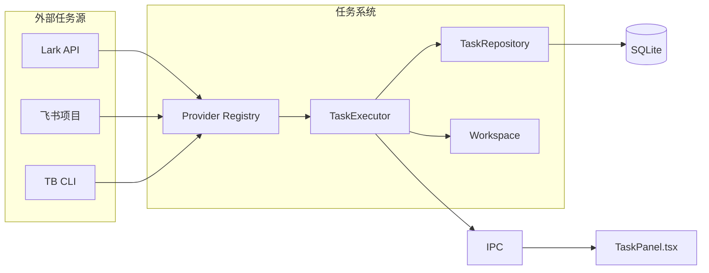
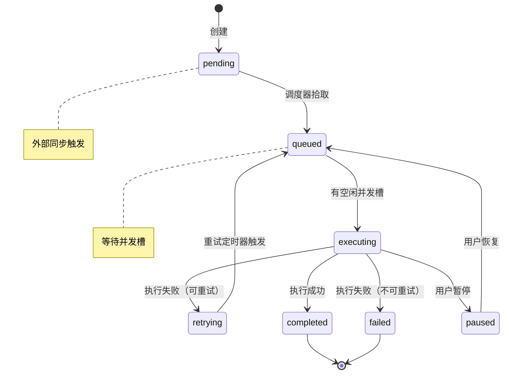
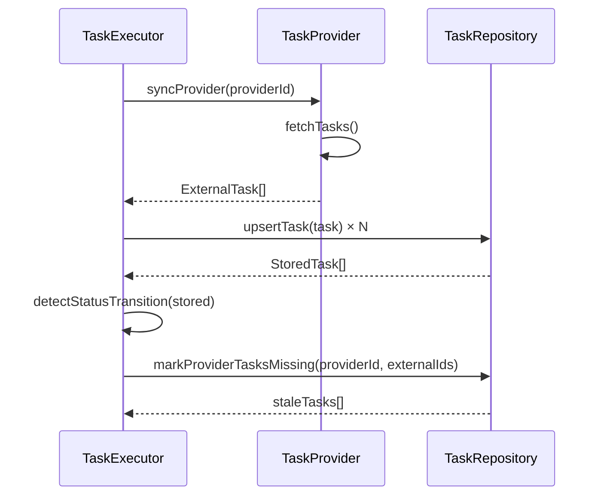
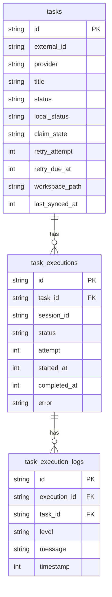
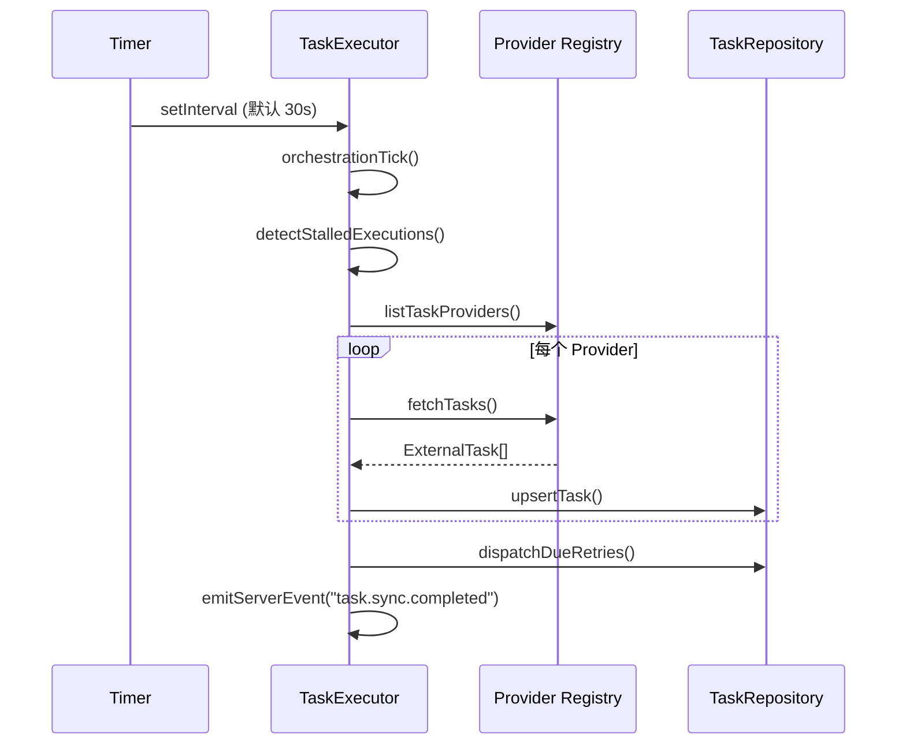

# 任务系统设计

<cite>

**本文引用的文件**

- [src/electron/libs/task/index.ts](file://src/electron/libs/task/index.ts)
- [src/electron/libs/task/README.md](file://src/electron/libs/task/README.md)
- [src/electron/libs/task/executor.ts](file://src/electron/libs/task/executor.ts)
- [src/electron/libs/task/provider-registry.ts](file://src/electron/libs/task/provider-registry.ts)
- [src/electron/libs/task/providers/feishu-project-provider.ts](file://src/electron/libs/task/providers/feishu-project-provider.ts)
- [src/electron/libs/task/providers/lark-provider.ts](file://src/electron/libs/task/providers/lark-provider.ts)
- [src/electron/libs/task/providers/tb-provider.ts](file://src/electron/libs/task/providers/tb-provider.ts)
- [src/electron/libs/task/repository.ts](file://src/electron/libs/task/repository.ts)
- [src/electron/libs/task/settings.ts](file://src/electron/libs/task/settings.ts)
- [src/electron/libs/task/types.ts](file://src/electron/libs/task/types.ts)
- [src/electron/libs/task/workflow.ts](file://src/electron/libs/task/workflow.ts)
- [src/electron/libs/task/workspace.ts](file://src/electron/libs/task/workspace.ts)
- [src/ui/components/TaskPanel.tsx](file://src/ui/components/TaskPanel.tsx)
- [src/electron/libs/mcp-tools/cron.ts](file://src/electron/libs/mcp-tools/cron.ts)

</cite>

## 目录

- [核心概念与职责边界](#核心概念与职责边界)
- [任务状态机设计](#任务状态机设计)
- [任务依赖与编排](#任务依赖与编排)
- [Provider 体系与外部数据同步](#provider-体系与外部数据同步)
- [持久化与数据库 Schema](#持久化与数据库-schema)
- [事件上报与 IPC 桥接](#事件上报与-ipc-桥接)
- [关键 API 接口一览](#关键-api-接口一览)
- [Cron 定时任务集成](#cron-定时任务集成)
- [排障与调试指南](#排障与调试指南)
- [Agent 改代码地图](#agent-改代码地图)

---

## 核心概念与职责边界

任务系统采用分层架构，每层职责单一，通过事件总线解耦。

### 核心实体

| 符号名 | 文件 | 职责 |
|--------|------|------|
| `TaskExecutor` | `executor.ts:89` | 唯一调度入口：轮询编排、自动执行、并发控制、重试恢复 |
| `TaskRepository` | `repository.ts:22` | SQLite schema 管理、任务状态持久化、执行记录 |
| `registerTaskProvider` | `provider-registry.ts:5` | 将外部适配器注册到内存 registry |
| `ensureTaskWorkspace` | `workspace.ts:7` | 为每个任务创建隔离的工作区目录 |

### 架构边界原则

> Provider 只负责把第三方任务映射成 `ExternalTask`，不直接改 UI 或会话。
> Repository 只做持久化，不启动 runner。
> Executor 是唯一调度入口，所有自动/手动执行都经过这里。
> 任务执行使用独立 workspace，避免多个任务互相污染。

图表来源：[src/electron/libs/task/README.md#L5-L21](file://src/electron/libs/task/README.md#L5-L21)

### 数据流概览



## 任务状态机设计

### 双层状态模型

任务同时拥有 **外部状态** (`ExternalTaskStatus`) 和 **本地状态** (`LocalTaskStatus`)。



图表来源：[src/electron/libs/task/types.ts#L11-L19](file://src/electron/libs/task/types.ts#L11-L19)

### 状态枚举值

`LocalTaskStatus` 的完整定义：

```typescript
type LocalTaskStatus =
  | "pending"      // 外部同步后进入
  | "in_progress"  // 外部已处理
  | "done"         // 外部完成
  | "cancelled"    // 外部取消
  | "queued"       // 排队等待执行
  | "executing"    // AI 正在执行
  | "retrying"     // 等待重试
  | "paused"       // 用户暂停
  | "completed"    // AI 执行成功
  | "failed";      // AI 执行失败
```

来源：[src/electron/libs/task/types.ts#L12-L19](file://src/electron/libs/task/types.ts#L12-L19)

### 状态转移触发点

| 转移 | 触发位置 | 关键逻辑 |
|------|----------|----------|
| `pending` → `queued` | `executor.ts:297-305` | `detectStatusTransition` 检测外部完成且无活跃执行时自动触发 |
| `executing` → `retrying` | `executor.ts:309` | `executeTask` 内部捕获 Runner 错误后设置 |
| 重试定时到期 | `executor.ts:273-281` | `dispatchDueRetries` 从 DB 读取 `retry_due_at <= now` 的任务 |
| 应用重启恢复 | `executor.ts:228-265` | `recoverInterruptedExecutions` 检测 `last_event_at` 旧的任务 |

关键常量：

```typescript
const DEFAULT_EXECUTION_TIMEOUT_MS = 30 * 60 * 1000;  // executor.ts:85
const DEFER_RETRY_MS = 5000;                           // executor.ts:86
const DEFAULT_MAX_AUTO_RETRIES = 2;                   // workflow.ts:25
```

---

## 任务依赖与编排

### 并发控制

`TaskExecutor` 通过 `executingTasks` Set 控制同时运行的任务数：

```typescript
// executor.ts:99-100
private executingTasks = new Set<string>();
private runningExecutions = new Map<string, RunningExecution>();
```

并发上限由 `TaskWorkflowConfig.agent.maxConcurrentAgents` 控制，默认为 `1`。

来源：[src/electron/libs/task/workflow.ts#L24](file://src/electron/libs/task/workflow.ts#L24)

### 重试退避策略

```typescript
// workflow.ts:75-79
export function computeRetryDueAt(attempt: number, config: TaskWorkflowConfig, now = Date.now()): number {
  const normalizedAttempt = Math.max(1, attempt);
  const delayMs = Math.min(10000 * 2 ** (normalizedAttempt - 1), config.agent.maxRetryBackoffMs);
  return now + delayMs;
}
```

退避公式：`delay = min(10000 * 2^(attempt-1), maxRetryBackoffMs)`
最大退避默认值：5 分钟

### 工作区隔离

每个任务在 `{userDataPath}/task-workspaces/` 下创建独立目录：

```typescript
// workspace.ts:16-20
function buildWorkspaceFolderName(task: StoredTask): string {
  const provider = sanitizeSegment(task.provider);
  const externalId = sanitizeSegment(task.externalId).slice(0, 48);
  const title = sanitizeSegment(task.title).slice(0, 48);
  return [provider, externalId, title].filter(Boolean).join("__");
}
```

路径安全检查在 `assertInsideRoot` 中实现，防止符号链接逃逸。

---

## Provider 体系与外部数据同步

### Provider 接口

```typescript
// types.ts:229-240
export interface TaskProvider {
  readonly id: TaskProviderId;  // "lark" | "tb" | "feishu-project"
  readonly name: string;
  isEnabled?(): boolean;
  fetchTasks(): Promise<ExternalTask[]>;
  getTask(externalId: string): Promise<ExternalTask | null>;
  updateTaskStatus(externalId: string, status: ExternalTaskStatus): Promise<void>;
  validateConfig(): Promise<{ valid: boolean; error?: string }>;
}
```

来源：[src/electron/libs/task/types.ts#L229-240](file://src/electron/libs/task/types.ts#L229-L240)

### 已实现的 Provider

| Provider | ID | 关键配置 | 数据获取方式 |
|----------|-----|----------|--------------|
| `LarkTaskProvider` | `"lark"` | `LARK_CLI_COMMAND`, `LARK_CLI_PROFILE` | `lark-cli api GET /open-apis/task/v2/tasks` |
| `TbTaskProvider` | `"tb"` | `tbCliCommand`, `tbFetchArgsTemplate` | 模板渲染 + `execFile` |
| `FeishuProjectTaskProvider` | `"feishu-project"` | `FEISHU_PROJECT_CLI`, `FEISHU_PROJECT_KEY` | `feishu-project list-items` |

### 同步流程



来源：[src/electron/libs/task/executor.ts#L140-168](file://src/electron/libs/task/executor.ts#L140-L168)

### 注册与查找

```typescript
// provider-registry.ts:5-11
export function registerTaskProvider(provider: TaskProvider): void {
  registry.set(provider.id, provider);
}

export function getTaskProvider(id: TaskProviderId): TaskProvider | undefined {
  return registry.get(id);
}
```

未注册的 provider 返回 `NoopProvider` 实例（始终 disabled）。

---

## 持久化与数据库 Schema

### SQLite 表结构



来源：[src/electron/libs/task/repository.ts#L32-135](file://src/electron/libs/task/repository.ts#L32-L135)

### 核心 Repository 方法

| 方法 | 用途 |
|------|------|
| `upsertTask(external)` | 同步外部任务到本地，返回 `StoredTask` |
| `listTasks(filter)` | 按状态/provider 过滤查询 |
| `getLatestExecution(taskId)` | 获取最近一次执行记录 |
| `recoverInterruptedExecutions(error)` | 标记应用重启中断的任务 |
| `reapCompletedTasks(days)` | 清理超过 N 天的已完成任务 |

来源：[src/electron/libs/task/repository.ts#L198](file://src/electron/libs/task/repository.ts#L198)

### Schema 迁移策略

当检测到表缺少新字段（`claim_state`, `retry_attempt`, `workspace_path` 等）时，**直接 DROP 并重建**：

```typescript
// repository.ts:174-181
this.db.exec(`
  DROP TABLE IF EXISTS task_artifacts;
  DROP TABLE IF EXISTS task_subtasks;
  DROP TABLE IF EXISTS task_execution_logs;
  DROP TABLE IF EXISTS task_executions;
  DROP TABLE IF EXISTS task_dismissals;
  DROP TABLE IF EXISTS tasks;
`);
```

这意味着旧数据会被丢弃。请勿在生产环境依赖已有任务数据。

---

## 事件上报与 IPC 桥接

### Server → Client 事件类型

```typescript
// types.ts:202-214
export type TaskServerEvent =
  | { type: "task.list"; payload: { tasks: StoredTask[] } }
  | { type: "task.updated"; payload: { task: StoredTask } }
  | { type: "task.deleted"; payload: { taskId: string } }
  | { type: "task.execution.started"; payload: { execution: TaskExecution } }
  | { type: "task.execution.completed"; payload: { execution: TaskExecution } }
  | { type: "task.execution.log"; payload: { log: TaskExecutionLog } }
  | { type: "task.sync.completed"; payload: { provider: TaskProviderId; count: number } }
  | { type: "task.stats"; payload: { stats: TaskStats } };
```

来源：[src/electron/libs/task/types.ts#L202-214](file://src/electron/libs/task/types.ts#L202-L214)

### Client → Server 命令

```typescript
// types.ts:216-227
export type TaskClientEvent =
  | { type: "task.list"; payload?: { filter?: TaskFilter } }
  | { type: "task.sync"; payload: { provider: TaskProviderId } }
  | { type: "task.execute"; payload: { taskId: string; options?: TaskExecutionOptions } }
  | { type: "task.control"; payload: { taskId: string; action: TaskExecutionControlAction } }
  | { type: "task.settings.get"; payload?: {} }
  | { type: "task.settings.update"; payload: { settings: Partial<TaskWorkflowSettings> } };
```

### 前端 IPC 调用

```typescript
// TaskPanel.tsx:166-169
function getElectronInvoke<T = unknown>(channel: string, ...args: unknown[]): Promise<T> {
  const electronApi = window.electron as typeof window.electron & { invoke?: Function };
  if (electronApi.invoke) return electronApi.invoke(channel, ...args);
  return Promise.reject(new Error("Electron invoke bridge unavailable"));
}
```

前端通过 `window.electron.invoke('channel', ...args)` 发送命令，主进程通过 `ipcMain.handle` 注册处理函数。

### 轮询编排



来源：[src/electron/libs/task/executor.ts#L180-199](file://src/electron/libs/task/executor.ts#L180-L199)

---

## 关键 API 接口一览

### TaskExecutor 主要方法

| 方法签名 | 参数 | 返回值 | 说明 |
|----------|------|--------|------|
| `startPolling(intervalMs?)` | `number?` | `void` | 启动定时同步，启动后每 intervalMs 执行 `orchestrationTick` |
| `stopPolling()` | - | `void` | 停止轮询，清理所有定时器 |
| `syncProvider(id, options?)` | `TaskProviderId`, `{silentErrors?}` | `Promise<number>` | 同步单个 provider，返回拉取的任务数 |
| `syncAll(options?)` | `{silentErrors?}` | `Promise<void>` | 遍历所有已注册且 enabled 的 provider |
| `executeTask(task, options?)` | `StoredTask`, `ExecuteOptions` | `Promise<TaskExecution\|null>` | 触发 AI 执行，启动 Claude runner |
| `getProviderStates()` | - | `Promise<TaskProviderState[]>` | 获取各 provider 的配置验证状态 |

来源：[src/electron/libs/task/executor.ts](file://src/electron/libs/task/executor.ts)

### TaskRepository 常用方法

| 方法 | 参数 | 说明 |
|------|------|------|
| `upsertTask(external)` | `ExternalTask` | 同步外部任务，返回 `StoredTask` |
| `listTasks(filter)` | `TaskFilter` | 支持按 `provider`, `status`, `priority` 过滤 |
| `getTask(id)` | `string` | 根据内部 ID 获取任务 |
| `getLatestExecution(taskId)` | `string` | 获取最近一次执行记录 |
| `saveExecution(execution)` | `TaskExecution` | 创建或更新执行记录 |
| `appendLog(log)` | `TaskExecutionLog` | 追加执行日志 |
| `recoverInterruptedExecutions(error, options?)` | `string`, `{activeTaskIds?}` | 恢复应用重启导致的中断 |

来源：[src/electron/libs/task/repository.ts](file://src/electron/libs/task/repository.ts)

### 注册/查询 Provider

```typescript
import { registerTaskProvider, getTaskProvider, listTaskProviders } from '@/electron/libs/task';

// 注册
registerTaskProvider(new LarkTaskProvider());

// 查询
const provider = getTaskProvider("lark");
const all = listTaskProviders();
```

来源：[src/electron/libs/task/provider-registry.ts#L5-L15](file://src/electron/libs/task/provider-registry.ts#L5-L15)

---

## Cron 定时任务集成

### MCP 工具清单

任务系统通过 MCP 工具暴露给 AI Agent，可创建和管理定时任务：

| Tool Name | 功能 | 关键参数 |
|-----------|------|----------|
| `create_scheduled_task` | 创建持久化定时任务 | `name`, `scheduleKind`, `cronExpression`/`everySeconds`/`atTimestamp`, `message` |
| `list_scheduled_tasks` | 列出所有定时任务 | - |
| `delete_scheduled_task` | 删除任务（仅限 Agent 创建） | `jobId` |

来源：[src/electron/libs/mcp-tools/cron.ts#L14-18](file://src/electron/libs/mcp-tools/cron.ts#L14-L18)

### 创建定时任务示例

```typescript
// 通过 MCP tool 触发的参数结构
{
  name: "每日巡检",
  scheduleKind: "cron",
  cronExpression: "0 9 * * *",    // 每天 9:00
  timezone: "Asia/Shanghai",
  message: "请执行系统健康检查",
  conversationId: "__system__",
  executionMode: "new_conversation"
}
```

### 安全边界

`delete_scheduled_task` 检查 `job.metadata.createdBy`，仅允许删除 `createdBy === "agent"` 的任务：

```typescript
// cron.ts:194-200
if (job.metadata.createdBy !== "agent") {
  return toTextToolResult({
    success: false,
    error: `任务 "${job.name}" 由用户创建，Agent 无权删除。请在 UI 中手动操作。`,
  }, true);
}
```

---

## 排障与调试指南

### 常见问题排查

#### 1. Provider 同步失败

**症状**：`syncProvider` 返回 0 或抛出异常。

**排查步骤**：

1. 检查 `lark-cli` 是否可用：`lark-cli --version`
2. 确认用户授权：`lark-cli auth login --domain task`
3. 查看 `listTaskProviderStates()` 返回的 `error` 字段

错误格式化在 `lark-provider.ts:141-155`：

```typescript
// 常见错误：need_user_authorization
if (errorMessage.includes("need_user_authorization")) {
  return "lark-cli 已配置 App，但还没有用户授权。请运行: lark-cli auth login --domain task";
}
```

#### 2. 任务卡在 executing 状态

**症状**：任务状态为 `executing` 但长时间无进展。

**原因**：`stallTimeoutMs` 触发（默认 5 分钟无新事件）。

**自动恢复**：`detectStalledExecutions` 调用 `handle.abort()` 并触发重试。

来源：[src/electron/libs/task/executor.ts#L283-292](file://src/electron/libs/task/executor.ts#L283-L292)

#### 3. 应用重启后任务丢失

**原因**：`resetTaskTablesIfOutdated` 在检测到 schema 版本不匹配时会 DROP 所有表。

**修复**：手动触发任务同步，或检查 `last_synced_at` 字段是否正常更新。

#### 4. TB Provider 无数据

**排查**：检查配置是否完整：

```typescript
// tb-provider.ts:28-30
isEnabled(): boolean {
  const settings = loadTaskSettings();
  return Boolean(settings.tbCliCommand?.trim() && settings.tbFetchArgsTemplate?.trim());
}
```

需要同时配置 `tbCliCommand` 和 `tbFetchArgsTemplate`。

### 日志追踪

执行日志通过 `emitLog` 方法写入 `task_execution_logs` 表：

```typescript
// executor.ts:221-222
this.emitLog("__system__", "__system__", "info", `清理了 ${reaped} 个已关闭的旧任务`);
```

前端通过 IPC 订阅 `task.execution.log` 事件实时展示日志流。

### 数据库直接查询

```sql
-- 查看执行失败的任务
SELECT id, title, last_error, retry_attempt FROM tasks WHERE local_status = 'failed';

-- 查看卡住的任务（executing 超过 10 分钟）
SELECT t.id, t.title, e.started_at, (unixepoch('now') - e.started_at/1000) as age_sec
FROM tasks t
JOIN task_executions e ON t.id = e.task_id
WHERE t.local_status = 'executing' AND e.started_at < (unixepoch('now')*1000 - 600000);

-- 查看重试队列
SELECT id, title, retry_due_at FROM tasks WHERE local_status = 'retrying' ORDER BY retry_due_at;
```

---

## Agent 改代码地图

### 先读文件（推荐顺序）

| 优先级 | 文件 | 原因 |
|--------|------|------|
| 1 | `types.ts` | 定义所有类型和接口，是共识基点 |
| 2 | `executor.ts` | 核心编排逻辑，修改调度必读 |
| 3 | `repository.ts` | 涉及数据库操作时必读 |
| 4 | `provider-registry.ts` | 新增 Provider 时的入口 |

### 关键符号速查

| 符号 | 类型 | 位置 | 用途 |
|------|------|------|------|
| `TaskExecutor` | `class` | `executor.ts:89` | 唯一调度器实例 |
| `TaskRepository` | `class` | `repository.ts:22` | 数据库操作封装 |
| `registerTaskProvider` | `function` | `provider-registry.ts:5` | 注册外部适配器 |
| `LocalTaskStatus` | `type` | `types.ts:12` | 本地状态枚举 |
| `TaskProvider` | `interface` | `types.ts:229` | Provider 接口契约 |
| `TaskServerEvent` | `type` | `types.ts:202` | IPC 上报事件 |
| `TaskClientEvent` | `type` | `types.ts:216` | IPC 下行命令 |
| `CRON_TOOL_NAMES` | `const array` | `cron.ts:14` | MCP 工具名列表 |

### 修改入口

#### 场景 1：新增 Provider

1. 在 `providers/` 目录创建 `{name}-provider.ts`
2. 实现 `TaskProvider` 接口
3. 在 `provider-registry.ts` 添加注册逻辑（或在应用启动时动态注册）

```typescript
// 示例：注册 TB Provider
import { registerTaskProvider } from '@/electron/libs/task';
registerTaskProvider(new TbTaskProvider());
```

#### 场景 2：修改状态机

1. 检查 `types.ts` 中 `LocalTaskStatus` 定义
2. 修改 `executor.ts` 中 `detectStatusTransition` 或 `executeTask` 的状态判断逻辑
3. 确保 `repository.ts` 中 `upsertTask` 的状态映射逻辑一致

#### 场景 3：调整并发策略

修改 `workflow.ts` 中的默认值：

```typescript
const DEFAULT_MAX_CONCURRENT_AGENTS = 1;  // 默认 1，可调高
```

或通过用户设置覆盖：`settings.ts` 中 `maxConcurrentAgents`。

### 验证命令

```bash
# 启动开发环境（React + Electron）
node scripts/dev.mjs

# 运行 TypeScript 类型检查
npm run typecheck

# 构建 Electron 主进程
npm run build:electron

# 运行任务模块单元测试（如有）
npm test -- --grep "Task"
```

### 常见回归风险

| 风险点 | 影响 | 缓解措施 |
|--------|------|----------|
| 修改 `LocalTaskStatus` 未同步 Provider 映射 | 状态不一致导致任务不执行 | 同时检查所有 Provider 的 `mapStatus` 函数 |
| `resetTaskTablesIfOutdated` 触发 DROP | 用户任务数据丢失 | 避免频繁修改 repository schema，优先用 ADD COLUMN |
| 修改轮询间隔导致频繁 API 调用 | 触发外部服务限流 | 保持 `pollingIntervalMs` >= 30s |
| 未清理 `executingTasks` Set | 内存泄漏，并发计数错误 | 确保 `executeTask` 结束时执行 `this.executingTasks.delete(task.id)` |

### 表结构修改注意

`repository.ts:138-182` 在检测到 schema 变化时**无条件 DROP 并重建**。如需添加字段：

1. 先确认现有字段列表
2. 如果字段是可选的，优先使用 `source_data` JSON 字段存储，而非新增列
3. 如必须新增列，考虑 `ALTER TABLE` 手动迁移方案（当前未实现）