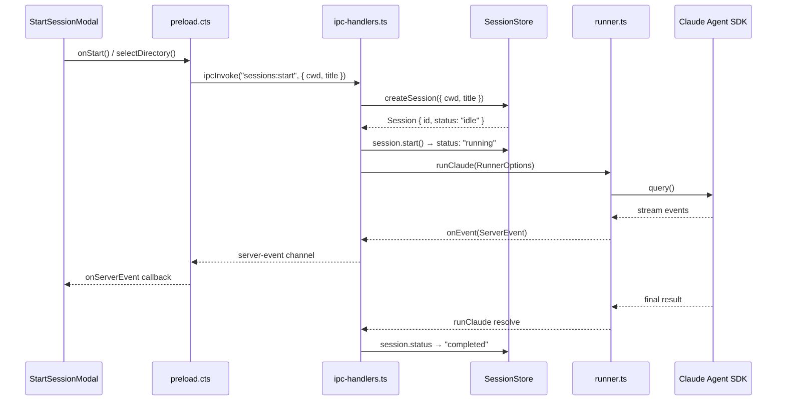
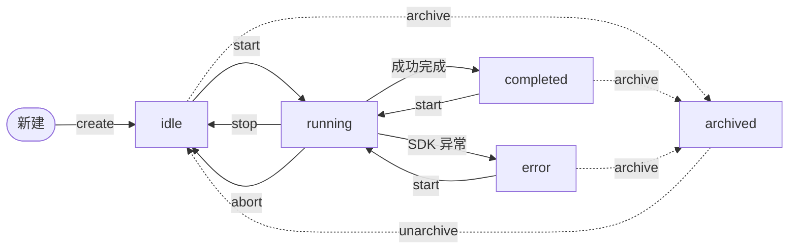

# 会话与历史系统总览

<cite>

**本文引用的文件**

- [pro-workflow/scripts/session-check.js](file://pro-workflow/scripts/session-check.js)
- [pro-workflow/scripts/session-end.js](file://pro-workflow/scripts/session-end.js)
- [pro-workflow/scripts/session-start.js](file://pro-workflow/scripts/session-start.js)
- [src/electron/libs/browser-workbench-session.ts](file://src/electron/libs/browser-workbench-session.ts)
- [src/electron/libs/session-store.ts](file://src/electron/libs/session-store.ts)
- [src/ui/components/StartSessionModal.tsx](file://src/ui/components/StartSessionModal.tsx)
- [doc/20-contracts/session-lifecycle/spec.md](file://doc/20-contracts/session-lifecycle/spec.md)
- [doc/40-product/1.0.0/40-delivery/components/CMP-001-SessionSidebar.md](file://doc/40-product/1.0.0/40-delivery/components/CMP-001-SessionSidebar.md)
- [src/electron/libs/runner.ts](file://src/electron/libs/runner.ts)
- [src/electron/libs/runner-reuse.ts](file://src/electron/libs/runner-reuse.ts)
- [src/electron/main.ts](file://src/electron/main.ts)
- [src/electron/preload.cts](file://src/electron/preload.cts)
- [src/electron/libs/system-prompt-presets.ts](file://src/electron/libs/system-prompt-presets.ts)
- [pro-workflow/scripts/prompt-submit.js](file://pro-workflow/scripts/prompt-submit.js)
- [pro-workflow/scripts/read-before-write.js](file://pro-workflow/scripts/read-before-write.js)
- [pro-workflow/scripts/reread-tracker.js](file://pro-workflow/scripts/reread-tracker.js)
- [src/electron/libs/workflow-catalog.ts](file://src/electron/libs/workflow-catalog.ts)
- [src/electron/libs/channel-workspace.ts](file://src/electron/libs/channel-workspace.ts)

</cite>

---

## 目录

1. [职责定位](#1-职责定位)
2. [核心数据结构](#2-核心数据结构)
3. [会话启动链路](#3-会话启动链路)
4. [消息持久化与历史回放](#4-消息持久化与历史回放)
5. [状态机与状态转换](#5-状态机与状态转换)
6. [Runner 执行器与复用机制](#6-runner-执行器与复用机制)
7. [前端 UI 桥接](#7-前端-ui-桥接)
8. [上下文压缩与摘要](#8-上下文压缩与摘要)
9. [渠道工作区集成](#9-渠道工作区集成)
10. [Agent 改代码地图](#10-agent-改代码地图)

---

## 1. 职责定位

会话与历史系统是 tech-cc-hub 的核心基础设施，负责以下职责：

| 职责 | 说明 | 主要文件 |
|------|------|---------|
| **会话生命周期管理** | 创建、启动、运行、完成、归档、恢复 | `session-store.ts` |
| **消息持久化** | 将 StreamMessage 写入 SQLite messages 表 | `session-store.ts` |
| **历史分页加载** | 基于游标的分页读取 `{ beforeCreatedAt, beforeId }` | `session-store.ts` |
| **Runner 执行** | 调用 Claude SDK 执行 agent 任务 | `runner.ts` |
| **Runner 复用决策** | 判断新请求是否可复用现有 Runner 进程 | `runner-reuse.ts` |
| **Workflow 目录构建** | 扫描 system/user/project 三层 workflow | `workflow-catalog.ts` |
| **渠道工作区映射** | Telegram/飞书等渠道消息 → 会话目录 | `channel-workspace.ts` |
| **Pro-Workflow 钩子** | session-start/end/check/check 三阶段增强 | `pro-workflow/scripts/*` |

**章节来源**：`doc/20-contracts/session-lifecycle/spec.md#L1-L35`

---

## 2. 核心数据结构

### 2.1 Session 与 StoredSession

```typescript
// 运行时内存态
type Session = {
  id: string;                    // crypto.randomUUID()
  title: string;
  claudeSessionId?: string;      // SDK 远端会话 ID，用于 resume
  status: SessionStatus;         // "idle" | "running" | "completed" | "error"
  model?: string;
  cwd?: string;
  runSurface?: AgentRunSurface;  // "development" | "maintenance"
  agentId?: string;
  allowedTools?: string;
  lastPrompt?: string;
  continuationSummary?: string;  // 上下文压缩摘要
  continuationSummaryMessageCount?: number;
  workflowMarkdown?: string;
  workflowState?: SessionWorkflowState;
  archivedAt?: number;           // 非空 = 已归档
  pendingPermissions: Map<string, PendingPermission>;  // 仅内存
  abortController?: AbortController;  // 仅内存
};

// SQLite 持久化投影（无 pendingPermissions/abortController）
type StoredSession = Session & {
  createdAt: number;
  updatedAt: number;
};
```

**章节来源**：`src/electron/libs/session-store.ts#L34-L79`

### 2.2 SessionHistory 与 SessionHistoryPage

```typescript
type SessionHistory = {
  session: StoredSession;
  messages: StreamMessage[];
};

type SessionHistoryPage = SessionHistory & {
  hasMore: boolean;
  nextCursor?: SessionHistoryCursor;  // { beforeCreatedAt: number; beforeId: string }
};
```

**章节来源**：`src/electron/libs/session-store.ts#L81-L89`

### 2.3 SQLite 表结构

| 表名 | 关键字段 | 用途 |
|------|---------|------|
| `sessions` | id, title, status, cwd, run_surface, agent_id, workflow_state, archived_at, created_at, updated_at | 会话主表 |
| `messages` | id, session_id, data (JSON), created_at | 消息历史表 |

**建表语句来源**：`src/electron/libs/session-store.ts#L126`（在 `SessionStore.initialize()` 中执行）

### 2.4 RunnerOptions 与 RunnerHandle

```typescript
type RunnerOptions = {
  prompt: string;
  attachments?: PromptAttachment[];
  runtime?: RuntimeOverrides;
  session: Session;
  resumeSessionId?: string;
  onEvent: (event: ServerEvent) => void;
  onSessionUpdate?: (updates: Partial<Session>) => void;
};

type RunnerHandle = {
  abort: () => void;
  appendPrompt: (prompt: string, attachments?: PromptAttachment[]) => Promise<void>;
  isClosed: () => boolean;
  reuseKey?: string;
};
```

**章节来源**：`src/electron/libs/runner.ts#L90-L105`

---

## 3. 会话启动链路

### 3.1 时序图



### 3.2 IPC 通道

| Channel | 方向 | 函数 | 用途 |
|---------|------|------|------|
| `sessions:start` | Renderer → Main | `ipcMain.handle` | 创建并启动会话 |
| `sessions:list` | Renderer → Main | `ipcMain.handle` | 列出所有非归档会话 |
| `get-recent-cwds` | Renderer → Main | `ipcMain.handle` | 获取最近 8 个工作目录 |
| `generate-session-title` | Renderer → Main | `ipcMain.handle` | AI 生成会话标题 |
| `select-directory` | Renderer → Main | `ipcMain.handle` | 调用系统目录选择器 |
| `client-event` | Renderer → Main | `ipcMain.send` | 发送用户 prompt |
| `server-event` | Main → Renderer | `ipcMain.on` | 推送 SDK stream events |

**章节来源**：`src/electron/main.ts#L30` 及 `src/electron/preload.cts#L12-L28`

### 3.3 StartSessionModal 工作流

```tsx
// src/ui/components/StartSessionModal.tsx
// 关键 Props
interface StartSessionModalProps {
  cwd: string;
  pendingStart: boolean;
  onCwdChange: (value: string) => void;
  onStart: () => void;
  onClose: () => void;
}

// 加载最近 CWD
useEffect(() => {
  window.electron.getRecentCwds().then(setRecentCwds);
}, []);

// 选择目录
const handleSelectDirectory = async () => {
  const result = await window.electron.selectDirectory();
  if (result) onCwdChange(result);
};
```

**图表来源**：`src/ui/components/StartSessionModal.tsx#L20-L27`

---

## 4. 消息持久化与历史回放

### 4.1 写入流程

```
SDK stream event
    ↓
ipc-handlers.ts: handleClientEvent()
    ↓
SessionStore.recordMessage(sessionId, streamMessage)
    ↓
SQLite INSERT INTO messages (id, session_id, data, created_at)
```

**关键过滤逻辑**：`isTransientStreamEventMessage()` 排除 `type === "stream_event"` 和 status 子类型的 system 消息。

**章节来源**：`src/electron/libs/session-store.ts#L91-L98`

### 4.2 读取流程

```typescript
// 全量历史（首次加载）
SessionStore.getSessionHistory(id: string): SessionHistory | null

// 分页历史（滚动加载）
SessionStore.getSessionHistoryPage(id, {
  before?: SessionHistoryCursor,  // { beforeCreatedAt, beforeId }
  limit?: number                  // 默认 400，上限 1000
}): SessionHistoryPage | null
```

**分页 SQL 示例**：
```sql
SELECT id, data, created_at
FROM messages
WHERE session_id = ? AND created_at < ? OR (created_at = ? AND id < ?)
ORDER BY created_at DESC, id DESC
LIMIT ?
```

**章节来源**：`src/electron/libs/session-store.ts#L326-L356`

### 4.3 Pro-Workflow 钩子

| 脚本 | 触发时机 | 核心逻辑 |
|------|---------|---------|
| `session-start.js` | 会话启动前 | 加载最近 learnings、上一会话摘要、最近 wiki |
| `session-check.js` | 每次 SDK 返回后 | 检测完成信号、大改动、周期性提醒 |
| `session-end.js` | 会话结束时 | 写入会话摘要、更新 DB 统计、检查 git 状态 |
| `prompt-submit.js` | 每次 prompt 提交时 | 修正检测、learn 触发、wiki 检索 |

**图表来源**：`pro-workflow/scripts/session-check.js#L51-L113`

---

## 5. 状态机与状态转换

### 5.1 状态图



### 5.2 状态转换规则

| 当前状态 | 触发 | 新状态 | 副作用 |
|---------|------|--------|-------|
| (空) | `createSession` | `idle` | 写入 sessions 表 |
| `idle` | `start` | `running` | 创建 Runner，调用 SDK |
| `running` | SDK 返回成功 | `completed` | 更新 sessions 表 |
| `running` | SDK 抛异常 | `error` | 记录 `workflowError` |
| `running` | `stop` / `abort` | `idle` | `abortController.abort()` |
| 任意 | `archive` | 原状态 + `archivedAt` | 软删除 |
| 已归档 | `unarchive` | 原状态，`archivedAt=null` | 恢复 |

**章节来源**：`doc/20-contracts/session-lifecycle/spec.md#L110-L160`

### 5.3 启动恢复

```typescript
// 应用启动时调用
SessionStore.recoverSuccessfulErrorSessions();
// 将所有 "running" 状态重置为 "idle"
```

**章节来源**：`src/electron/libs/session-store.ts#L128`

---

## 6. Runner 执行器与复用机制

### 6.1 runClaude 核心流程

```typescript
// src/electron/libs/runner.ts
export async function runClaude(options: RunnerOptions): Promise<RunnerHandle> {
  // 1. 构建 system prompt（合并多个 preset）
  const systemPromptAppend = combineSystemPromptAppend([
    buildBrowserWorkbenchPromptAppend(),       // 浏览器工具规则
    buildAdminConfigPromptAppend(),             // 配置持久化规则
    buildToolCallOptimizationPromptAppend(),    // 工具调用优化
    buildFeishuDocumentFetchPromptAppend(),     // 飞书文档直读
    buildGlobalRuntimeSystemPromptExtAppend(),  // 用户自定义扩展
    buildBuiltinMcpRegistryPromptAppend(),      // MCP 服务器注册表
    buildDesignParityPromptAppend(),            // 设计还原规则
  ]);

  // 2. 解析 allowed tools
  const effectiveTools = buildEffectiveAllowedToolSet(options);

  // 3. 调用 SDK
  const query: Query = {
    model: options.session.model,
    systemPrompt: systemPromptAppend,
    tools: effectiveTools,
    // ...
  };

  // 4. 流式处理事件
  for await (const event of sdk.query(query)) {
    options.onEvent(event);
  }

  return handle;
}
```

**章节来源**：`src/electron/libs/runner.ts#L212`（`runClaude` 函数）

### 6.2 Runner 复用决策

```typescript
// src/electron/libs/runner-reuse.ts
export function canReuseRunner(existingKey: string | undefined, requestedKey: string): boolean {
  const existing = parseRunnerReuseKey(existingKey);
  const requested = parseRunnerReuseKey(requestedKey);
  if (!existing || !requested) return false;

  return (
    existing.cwd === requested.cwd &&
    existing.model === requested.model &&
    existing.permissionMode === requested.permissionMode &&
    existing.reasoningMode === requested.reasoningMode &&
    existing.outputFormat === requested.outputFormat &&
    existing.runSurface === requested.runSurface &&
    existing.agentId === requested.agentId &&
    existing.allowedTools === requested.allowedTools
  );
}
```

**复用条件**：cwd、model、permissionMode、reasoningMode、outputFormat、runSurface、agentId、allowedTools 八项完全一致。

**章节来源**：`src/electron/libs/runner-reuse.ts#L33-L50`

### 6.3 buildRunnerReuseKey 构建逻辑

```typescript
function buildRunnerReuseDescriptor(input: RunnerReuseKeyInput): RunnerReuseDescriptor {
  const profile = resolveRuntimeEfficiencyProfile({
    prompt: input.prompt,
    attachments: input.attachments,
    runtime: input.runtime,
    runSurface,
  });

  return {
    cwd: normalizeKeyPart(input.cwd),
    model: normalizeKeyPart(input.model),
    permissionMode: input.runtime?.permissionMode ?? "bypassPermissions",
    reasoningMode: input.runtime?.reasoningMode ?? "",
    outputFormat: input.runtime?.outputFormat ?? "",
    runSurface,
    agentId: normalizeKeyPart(agentId),
    allowedTools: normalizeKeyPart(input.allowedTools),
    runtimeProfile: profile.id,
    builtinMcpServers: [...profile.builtinMcpServers],
  };
}
```

**章节来源**：`src/electron/libs/runner-reuse.ts#L52-L74`

---

## 7. 前端 UI 桥接

### 7.1 Preload Context Bridge

```typescript
// src/electron/preload.cts
electron.contextBridge.exposeInMainWorld("electron", {
  // 会话管理
  generateSessionTitle: (userInput, options) =>
    ipcInvoke("generate-session-title", userInput, options),
  getRecentCwds: (limit?) =>
    ipcInvoke("get-recent-cwds", limit),
  selectDirectory: () =>
    ipcInvoke("select-directory"),

  // 事件通道
  sendClientEvent: (event) =>
    electron.ipcRenderer.send("client-event", event),
  onServerEvent: (callback) =>
    electron.ipcRenderer.on("server-event", cb),

  // 其他 IPC...
});
```

**章节来源**：`src/electron/preload.cts#L27-L28`

### 7.2 SessionSidebar 组件

| 状态 | 说明 |
|------|------|
| `sessions[]` | 会话列表 |
| `active_session_id` | 当前选中会话 |
| `session_status` | 当前会话状态 |

**输出事件**：`session_selected_from_sidebar`、`new_session_requested`

**章节来源**：`doc/40-product/1.0.0/40-delivery/components/CMP-001-SessionSidebar.md#L25-L49`

---

## 8. 上下文压缩与摘要

### 8.1 触发条件

当消息历史超过 `contextWindow * compressionThresholdPercent` 时，触发 stateless continuation。

### 8.2 压缩流程

```
消息计数超限
    ↓
生成 continuationSummary（摘要文本）
    ↓
存储到 sessions 表：continuationSummary, continuationSummaryMessageCount
    ↓
下次 continue 时，通过 PromptLedger 注入为 memory source
```

**章节来源**：`doc/20-contracts/session-lifecycle/spec.md#L167-L172`

---

## 9. 渠道工作区集成

### 9.1 支持的渠道

```typescript
type ChannelProviderId =
  | "telegram"
  | "lark"
  | "dingtalk"
  | "wechat"
  | "wecom"
  | "slack"
  | "discord";
```

### 9.2 工作区创建流程

```typescript
// src/electron/libs/channel-workspace.ts
export function ensureChannelWorkspace(message: ChannelInboundMessage): ChannelWorkspace {
  const root = join(
    getChannelsRoot(),  // app.getPath("userData") + "/channels"
    sanitizePathSegment(provider),
    getChannelConversationId(message)
  );
  // 创建 .channel/messages.jsonl 日志文件
  // 写入 README.md
  return workspace;
}
```

**章节来源**：`src/electron/libs/channel-workspace.ts#L94-L109`

### 9.3 消息记录

```typescript
// 记录入站消息
recordChannelInboundMessage(workspace, message);
// 写入 .channel/messages.jsonl

// 记录出站消息
recordChannelOutboundMessage(workspaceRoot, target, text);
```

**章节来源**：`src/electron/libs/channel-workspace.ts#L111-L137`

---

## 10. Agent 改代码地图

### 10.1 先读文件（按优先级）

| 优先级 | 文件 | 理由 |
|--------|------|------|
| 1 | `src/electron/libs/session-store.ts` | 核心数据结构、状态转换 |
| 2 | `src/electron/libs/runner.ts` | SDK 调用、工具集构建 |
| 3 | `src/electron/libs/runner-reuse.ts` | 复用决策逻辑 |
| 4 | `doc/20-contracts/session-lifecycle/spec.md` | 状态机 spec（source-of-truth） |
| 5 | `src/electron/preload.cts` | IPC 通道定义 |
| 6 | `src/electron/ipc-handlers.ts` | IPC 处理逻辑 |

### 10.2 关键符号与 IPC 通道

| 类别 | 符号 | 位置 |
|------|------|------|
| **Class** | `SessionStore` | `session-store.ts#L121` |
| **Class** | `RunnerOptions`, `RunnerHandle` | `runner.ts#L90-L105` |
| **Function** | `runClaude` | `runner.ts#L212` |
| **Function** | `canReuseRunner`, `buildRunnerReuseKey` | `runner-reuse.ts#L29-L31` |
| **Function** | `createSession`, `archiveSession`, `getSessionHistory` | `session-store.ts` |
| **IPC Channel** | `sessions:start`, `sessions:list` | `main.ts#L30` |
| **IPC Channel** | `get-recent-cwds`, `generate-session-title` | `preload.cts#L29-L28` |
| **Type** | `Session`, `StoredSession`, `SessionHistoryPage` | `session-store.ts#L34-L89` |
| **SQL 表** | `sessions`, `messages` | `session-store.ts#L126` |

### 10.3 修改入口

| 修改目标 | 入口文件 | 关键函数/行 |
|---------|---------|------------|
| 新增会话状态 | `session-store.ts` | `Session` 类型定义（L34-55）、状态分支（L150-280） |
| 修改消息过滤逻辑 | `session-store.ts` | `isTransientStreamEventMessage`（L91-98） |
| 调整 Runner 工具集 | `runner.ts` | `buildEffectiveAllowedToolSet`（L828） |
| 修改复用决策字段 | `runner-reuse.ts` | `buildRunnerReuseDescriptor`（L52-74） |
| 新增 IPC 通道 | `main.ts` + `preload.cts` | `ipcMainHandle` 注册 + `contextBridge.exposeInMainWorld` |
| 修改前端会话列表 | `StartSessionModal.tsx` | `useEffect` + `getRecentCwds` 调用（L20-22） |
| Pro-Workflow 钩子 | `pro-workflow/scripts/*.js` | `session-start.js`、`session-end.js`、`session-check.js` |

### 10.4 验证命令

| 场景 | 命令 |
|------|------|
| 启动新会话 | `window.electron.invoke("sessions:start", { cwd, title })` |
| 列出所有会话 | `window.electron.invoke("sessions:list")` |
| 获取历史（分页） | `SessionStore.getSessionHistoryPage(id, { before, limit })` |
| 归档会话 | `SessionStore.archiveSession(id)` |
| 验证 Runner 复用 | `canReuseRunner(existingKey, requestedKey)` → `true/false` |
| 检查 DB 表结构 | SQLite 查看 `sessions` 和 `messages` 表 |
| Pro-Workflow 钩子测试 | 执行 `session-start.js`、`session-end.js` 检查输出 |

### 10.5 常见回归风险

| 风险点 | 原因 | 缓解措施 |
|--------|------|---------|
| 会话状态不一致 | `status` 字段未同步更新 | 确保每个状态转换路径有对应 DB UPDATE |
| 消息丢失 | `isTransientStreamEventMessage` 误过滤 | 添加 UT 覆盖 `type === "stream_event"` 等边界 |
| Runner 复用误判 | `canReuseRunner` 比对字段不全 | 每次新增 `runtime` 字段时同步更新 `RunnerReuseDescriptor` |
| 历史分页错乱 | `beforeCreatedAt` + `beforeId` 组合不唯一 | SQL 使用 `OR` 条件确保严格序 |
| Pro-Workflow 钩子失败 | `dist/db/store.js` 不存在 | 检查 `getStore()` fallback 逻辑 |
| CWD 解析失败 | `resolveCwd` 路径不存在 | 检查 `LEGACY_CWD_SUFFIXES` fallback |

### 10.6 前后端桥接点

| 桥接点 | Source-of-Truth | 刷新边界 |
|--------|----------------|---------|
| 会话列表 | SQLite `sessions` 表 | 应用启动时加载 + 每次会话变更实时 IPC 推送 |
| 消息历史 | SQLite `messages` 表 + 内存 Map | 首次 `getSessionHistory` 全量加载，分页按需 |
| Runner 状态 | `runner.ts` 内存句柄 | 每个 prompt 提交后重新评估 |
| UI 会话选中 | Preload `sendClientEvent` 触发 | 用户点击 sidebar → IPC → 重新查询 `getSessionHistory` |

### 10.7 测试入口

| 测试类型 | 入口文件/命令 | 说明 |
|---------|--------------|------|
| 单元测试 | `session-store.spec.ts` | `SessionStore.createSession`、`archiveSession` |
| 集成测试 | `ipc-handlers.spec.ts` | IPC channel `sessions:start` 完整链路 |
| E2E 测试 | Playwright `session.spec.ts` | `StartSessionModal` → 提交 prompt → 验证历史 |
| Pro-Workflow | 手动执行 `node scripts/session-start.js` | 验证 hooks 输出日志 |

---

## 附录：关键配置项

| 配置项 | 类型 | 默认值 | 说明 |
|--------|------|--------|------|
| `contextWindow` | number | 模型相关 | 最大上下文窗口 |
| `compressionThresholdPercent` | number | 0.8 | 触发压缩的阈值比例 |
| `historyPageLimit` | number | 400 | 历史分页默认每页条数 |
| `recentCwdsLimit` | number | 8 | 启动弹窗展示的最近 CWD 数 |
| `BROWSER_WORKBENCH_PARTITION` | string | `"persist:tech-cc-hub-browser"` | 浏览器工作台 partition |

---

## 参考文档

- [会话生命周期 Spec](file://doc/20-contracts/session-lifecycle/spec.md#L1-L215)
- [CMP-001-SessionSidebar](file://doc/40-product/1.0.0/40-delivery/components/CMP-001-SessionSidebar.md#L1-L50)
- [Runner 核心逻辑](file://src/electron/libs/runner.ts#L212)
- [SessionStore 建表](file://src/electron/libs/session-store.ts#L126)
- [Preload IPC 通道](file://src/electron/preload.cts#L27-L71)