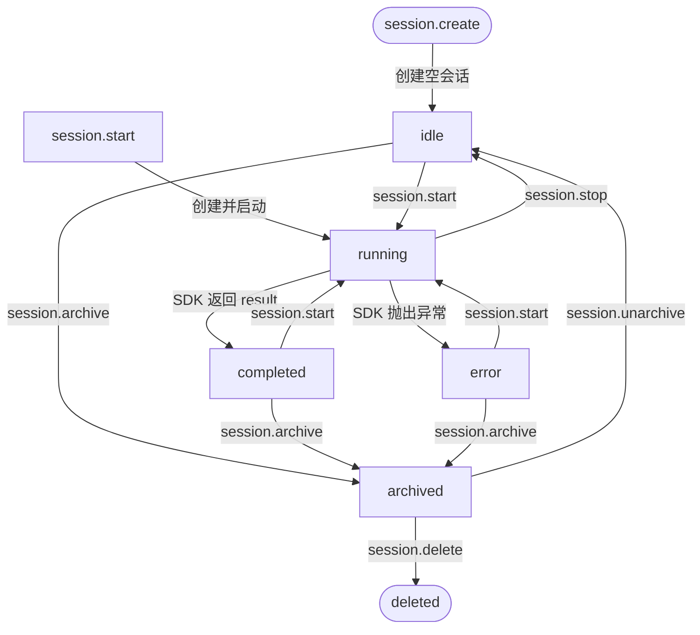
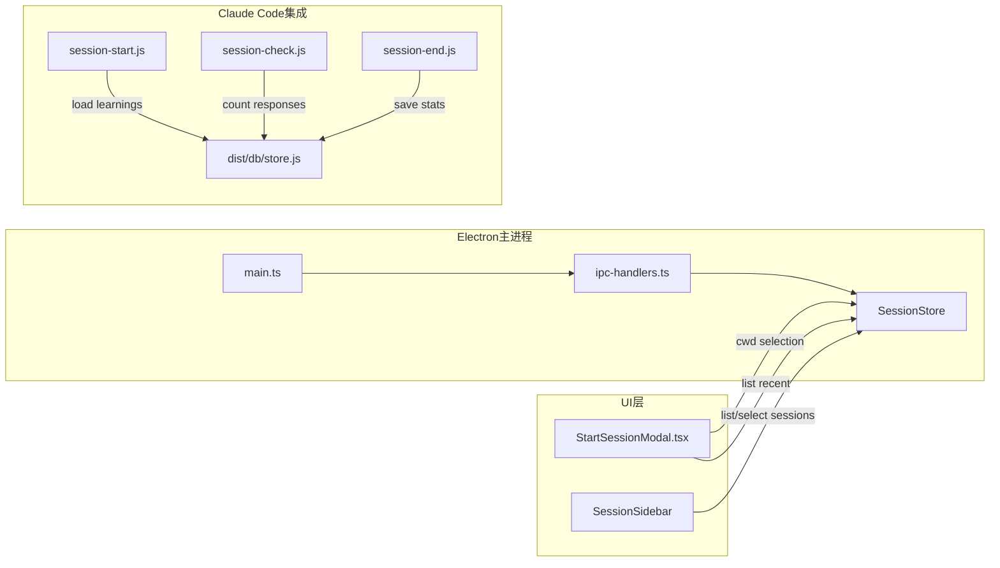

# 会话与历史系统总览

<cite>

**本文引用的文件**

- [pro-workflow/scripts/session-check.js](file://pro-workflow/scripts/session-check.js)
- [pro-workflow/scripts/session-end.js](file://pro-workflow/scripts/session-end.js)
- [pro-workflow/scripts/session-start.js](file://pro-workflow/scripts/session-start.js)
- [src/electron/libs/browser-workbench-session.ts](file://src/electron/libs/browser-workbench-session.ts)
- [src/electron/libs/session-store.ts](file://src/electron/libs/session-store.ts)
- [src/ui/components/StartSessionModal.tsx](file://src/ui/components/StartSessionModal.tsx)
- [doc/20-contracts/session-lifecycle/spec.md](file://doc/20-contracts/session-lifecycle/spec.md)
- [doc/40-product/1.0.0/40-delivery/components/CMP-001-SessionSidebar.md](file://doc/40-product/1.0.0/40-delivery/components/CMP-001-SessionSidebar.md)
- [src/electron/main.ts](file://src/electron/main.ts)

</cite>

---

## 目录

- [系统职责与定位](#系统职责与定位)
- [核心数据结构](#核心数据结构)
- [会话状态机](#会话状态机)
- [调用链与模块协作](#调用链与模块协作)
- [入口点与启动流程](#入口点与启动流程)
- [Pro Workflow 钩子脚本](#pro-workflow-钩子脚本)
- [持久化与历史管理](#持久化与历史管理)
- [失败模式与排障](#失败模式与排障)
- [扩展点](#扩展点)
- [验证命令](#验证命令)

---

## 系统职责与定位

会话与历史系统是 tech-cc-hub 的核心模块，承担以下职责：

| 职责 | 说明 | 涉及文件 |
|------|------|---------|
| **会话生命周期管理** | 创建、启动、运行、停止、归档、删除会话 | `session-store.ts` |
| **消息持久化** | 将 StreamMessage 写入 SQLite，按需清理 Base64 图片 | `session-store.ts:419-425` |
| **历史加载与分页** | 基于游标的消息历史分页查询 | `session-store.ts:326-377` |
| **上下文压缩** | 超长会话触发 continuation summary | `session-lifecycle/spec.md:167-171` |
| **中断恢复** | 应用重启时将 `running` 状态会话重置为 `idle` | `session-store.ts:387-411` |
| **前端会话入口** | 新建会话 UI 和目录选择 | `StartSessionModal.tsx` |
| **外部会话追踪** | Claude Code 集成：学习采集、会话统计 | `session-*.js` |

---

## 核心数据结构

### Session（运行时对象）

定义位置：`src/electron/libs/session-store.ts:34-55`

```typescript
type Session = {
  id: string;                           // 本地 UUID
  title: string;
  claudeSessionId?: string;              // SDK 远端会话 ID，用于 resume
  status: SessionStatus;                 // "idle" | "running" | "completed" | "error"
  model?: string;
  cwd?: string;                          // 工作目录
  runSurface?: "development" | "maintenance";
  agentId?: string;
  allowedTools?: string;
  lastPrompt?: string;
  continuationSummary?: string;          // 上下文压缩滚动摘要
  continuationSummaryMessageCount?: number;
  workflowMarkdown?: string;
  workflowSourceLayer?: WorkflowScope;
  workflowSourcePath?: string;
  workflowState?: SessionWorkflowState;
  workflowError?: string;
  archivedAt?: number;                    // Unix ms，非空表示已归档
  pendingPermissions: Map<string, PendingPermission>;  // 仅内存
  abortController?: AbortController;    // 仅内存
};
```

### StoredSession（持久化对象）

定义位置：`src/electron/libs/session-store.ts:58-79`

StoredSession 是 Session 的 SQLite 投影，**不含** `pendingPermissions` 和 `abortController`（这两个字段仅存于主进程内存，不持久化）。

### StreamMessage（消息存储）

定义位置：`session-lifecycle/spec.md:86-93`

```typescript
type StreamMessage = (SDKMessage | UserPromptMessage | PromptLedgerMessage) & {
  capturedAt?: number;    // 客户端时间戳
  historyId?: string;    // 用于分页游标
};
```

存储前会调用 `stripInlineBase64ImagesFromMessage()` 清理 Base64 图片（`session-store.ts:102`），历史加载时通过 `hydrateImagePreviewsForDisplay()` 按需还原预览。

---

## 会话状态机

定义位置：`doc/20-contracts/session-lifecycle/spec.md:110-144`



### 状态转换规则

| 当前状态 | 触发事件 | 新状态 | 备注 |
|---------|---------|--------|------|
| (不存在) | `session.create` | `idle` | 创建空会话 |
| (不存在) | `session.start` | `running` | 创建并立即启动 |
| `idle` | `session.start` | `running` | 重新启动已有会话 |
| `idle` | `session.continue` | `running` | 继续已有会话 |
| `running` | SDK 返回 result | `completed` | Agent 正常完成 |
| `running` | SDK 抛出异常 | `error` | Runner catch 块设置 |
| `running` | `session.stop` | `idle` | 用户主动停止 |
| 任意 | `session.archive` | 当前状态 + `archivedAt` 置值 | 软删除 |
| 已归档 | `session.unarchive` | 原状态，`archivedAt` 置 null | 恢复 |

> **章节来源**：`doc/20-contracts/session-lifecycle/spec.md#L146-L160`

### 启动恢复逻辑

应用启动时调用 `SessionStore.recoverInterruptedSessions()`（`session-store.ts:387-411`）：

1. 遍历内存中所有 Session
2. 将 `status === "running"` 的会话重置为 `idle`
3. 清除 `abortController` 和 `pendingPermissions`
4. 同步更新 SQLite 中对应的 status 字段

```typescript
// session-store.ts:387-411
recoverInterruptedSessions(): string[] {
  const recoveredIds: string[] = [];
  for (const session of this.sessions.values()) {
    if (session.status !== "running") continue;
    session.status = "idle";
    session.abortController = undefined;
    session.pendingPermissions.clear();
    recoveredIds.push(session.id);
  }
  // 批量更新 SQLite
  this.db.prepare(`update sessions set status = ? where id in (...)`).run("idle", ...recoveredIds);
  return recoveredIds;
}
```

> **章节来源**：`src/electron/libs/session-store.ts#L387-L411`

---

## 调用链与模块协作

### 模块关系图



### 关键调用链

**1. 新建会话（UI 路径）**

```
用户点击"新建会话"
  → StartSessionModal.tsx 渲染
    → window.electron.getRecentCwds() 获取最近目录列表
  → 用户选择工作目录
    → window.electron.selectDirectory() 调用系统目录选择器
  → 点击"进入会话"
    → onStart() 触发
      → IPC: session.create / session.start
        → SessionStore.createSession()
        → SessionStore.updateSession() 设置状态为 running
```

**2. 消息持久化**

```
SDK stream.message / stream.user_prompt 事件
  → IPC handler (ipc-handlers.ts)
    → sessions.recordMessage(sessionId, message)
      → SessionStore.recordMessage()
        → stripInlineBase64ImagesFromMessage()
        → INSERT INTO messages (session_id, data, created_at)
```

**3. 历史加载**

```
用户打开历史会话
  → IPC: session.getHistory / session.getHistoryPage
    → SessionStore.getSessionHistory(id)
      → SELECT messages WHERE session_id = ? ORDER BY created_at asc
    → SessionStore.getSessionHistoryPage(id, { before, limit })
      → SELECT messages WHERE ... AND created_at < ? ORDER BY created_at desc LIMIT ?
      → 返回 hasMore + nextCursor
```

> **章节来源**：`src/electron/libs/session-store.ts#L298-L377`

### 启动时初始化

`main.ts` 第 30 行导入 `sessions`：

```typescript
// src/electron/main.ts:30
import { handleClientEvent, sessions, cleanupAllSessions, setChannelReplySender, ... } from "./ipc-handlers.js";
```

`sessions` 是 `SessionStore` 实例，在 IPC handlers 模块初始化时创建并导出，供所有 handler 共享使用。

> **章节来源**：`src/electron/main.ts#L30`

---

## 入口点与启动流程

### 前端入口：StartSessionModal

定义位置：`src/ui/components/StartSessionModal.tsx`

**Props 接口**：

```typescript
interface StartSessionModalProps {
  cwd: string;               // 当前工作目录
  pendingStart: boolean;     // 启动中状态（禁用按钮）
  onCwdChange: (value: string) => void;
  onStart: () => void;       // 创建并启动会话
  onClose: () => void;
}
```

**关键行为**：
- `useEffect` 加载最近目录：`window.electron.getRecentCwds()`
- 目录选择：`window.electron.selectDirectory()` 返回路径后更新 `cwd`
- 最近目录列表：渲染为圆角按钮，点击即选中

> **章节来源**：`src/ui/components/StartSessionModal.tsx#L10-L27`

### Electron 主进程初始化

```typescript
// main.ts 中的 sessions 初始化路径
// 1. ipc-handlers.js 模块加载时创建 SessionStore
// 2. SessionStore 构造函数依次调用：
//    initialize()      → 建表
//    recoverSuccessfulErrorSessions() → 恢复异常会话
//    loadSessions()    → 从 SQLite 加载非归档会话到内存 Map
```

### Browser Workbench Session 配置

定义位置：`src/electron/libs/browser-workbench-session.ts`

```typescript
export const BROWSER_WORKBENCH_PARTITION = "persist:tech-cc-hub-browser";

export function buildBrowserWorkbenchWebPreferences(preload?: string): BrowserWorkbenchWebPreferences {
  return {
    contextIsolation: true,
    nodeIntegration: false,
    sandbox: true,
    partition: BROWSER_WORKBENCH_PARTITION,
    ...(preload ? { preload } : {}),
  };
}
```

Browser Workbench 使用独立 partition，与主会话隔离。

> **章节来源**：`src/electron/libs/browser-workbench-session.ts#L1-L18`

---

## Pro Workflow 钩子脚本

Pro Workflow 通过 Claude Code 的 hook 机制与本系统协作，三个脚本分别在会话开始、响应结束、会话结束时执行。

### session-start.js（开始钩子）

定义位置：`pro-workflow/scripts/session-start.js`

**执行时机**：Claude Code 会话启动时

**核心逻辑**：
1. 获取 `session_id`（从环境变量 `CLAUDE_SESSION_ID` 或 `process.ppid`）
2. 尝试连接 `dist/db/store.js`：
   - 成功：调用 `store.startSession(sessionId, projectName)` 记录开始时间
   - 失败：降级到文件模式，将 LEARNED.md 中的 `[LEARN]` 标记计数输出
3. 加载最近学习记录：`getRecentLearnings(store.db, 5, projectName)`
4. 输出上一会话摘要（编辑数、纠正数）

```javascript
// session-start.js:44-68
if (store) {
  store.startSession(sessionId, projectName);
  const recentLearnings = getRecentLearnings(store.db, 5, projectName);
  if (recentLearnings.length > 0) {
    log(`[ProWorkflow] Loaded ${recentLearnings.length} learnings...`);
  }
  const recentSessions = store.getRecentSessions(3);
  if (recentSessions.length > 1) {
    const lastSession = recentSessions[1];
    log(`Previous session: ${lastSession.started_at.split('T')[0]} (${lastSession.edit_count} edits)`);
  }
}
```

### session-check.js（停止钩子）

定义位置：`pro-workflow/scripts/session-check.js`

**执行时机**：每次 Claude 响应结束时

**核心逻辑**：
1. 解析 stdin 中的 JSON（包含 `last_assistant_message`、`session_id`）
2. 在 `os.tmpdir()/pro-workflow/` 下维护 `response-count-{sessionId}` 文件
3. 检测完成信号（`all tests pass`、`PR created` 等正则）
4. 检测大量变更（`N files changed` 等正则）
5. 每 20 次响应触发周期性提醒（wrap-up、learn-rule、compact 三选一）
6. 第 50 次响应时输出强烈建议

```javascript
// session-check.js:77-98
if (lastMessage && detectCompletionSignals(lastMessage)) {
  log('[ProWorkflow] Task looks complete — consider /wrap-up');
} else if (lastMessage && detectLargeChange(lastMessage)) {
  log('[ProWorkflow] Large change detected — good checkpoint for review');
} else {
  const shouldRemind = count % 20 === 0;
  if (shouldRemind) {
    const reminderType = Math.floor(count / 20) % 3;
    // 0: wrap-up, 1: learn-rule, 2: compact
  }
}
```

> **章节来源**：`pro-workflow/scripts/session-check.js#L77-L98`

### session-end.js（结束钩子）

定义位置：`pro-workflow/scripts/session-end.js`

**执行时机**：Claude Code 会话结束前

**核心逻辑**：
1. 调用 `store.endSession(sessionId)` 保存统计（edit_count、corrections_count、prompts_count）
2. 若无 DB：将统计写入 `os.tmpdir()/pro-workflow/sessions/{date}-{shortId}.md` Markdown 文件
3. 检查 git 状态，输出未提交变更警告

```javascript
// session-end.js:57-75
if (store) {
  const session = store.getSession(sessionId);
  if (session) {
    store.endSession(sessionId);
    log(`[ProWorkflow] Session saved to database:`);
    log(`  - Edits: ${session.edit_count}`);
    log(`  - Corrections: ${session.corrections_count}`);
  }
} else {
  // 降级：写 Markdown 文件
  const sessionFile = path.join(sessionsDir, `${today}-${shortId}.md`);
}
```

> **章节来源**：`pro-workflow/scripts/session-end.js#L57-L105`

---

## 持久化与历史管理

### SQLite Schema

SessionStore 使用 `better-sqlite3`，数据库位于应用数据目录。

**主要表**：

| 表名 | 用途 |
|------|------|
| `sessions` | 存储会话元数据（id、title、status、cwd、workflow 等） |
| `messages` | 存储消息历史（session_id、data JSON、created_at） |

### 消息过滤规则

`isTransientStreamEventMessage()`（`session-store.ts:91-99`）过滤掉两类消息：

- `type === "stream_event"`：瞬时事件，不持久化
- `type === "system" && subtype === "status"`：状态消息

```typescript
// session-store.ts:91-99
function isTransientStreamEventMessage(message: StreamMessage): boolean {
  return (
    "type" in message &&
    (
      message.type === "stream_event" ||
      (message.type === "system" && "subtype" in message && message.subtype === "status")
    )
  );
}
```

### 分页游标

基于 `capturedAt` + `historyId` 的复合游标：

```typescript
type SessionHistoryCursor = {
  beforeCreatedAt: number;   // 时间戳上限
  beforeId: string;          // 同时间戳时的 ID 上限
};
```

SQL 降序查询后 reverse，保证时间顺序。

### 上下文压缩（Continuation）

当消息历史超过 `contextWindow * compressionThresholdPercent` 时：

1. 生成 stateless continuation 摘要
2. 存储到 `continuationSummary` 和 `continuationSummaryMessageCount`
3. 下次 `session.continue` 时通过 PromptLedger 注入为 memory source

> **章节来源**：`doc/20-contracts/session-lifecycle/spec.md#L167-L171`

---

## 失败模式与排障

### 常见失败场景

| 场景 | 症状 | 排查方向 |
|------|------|---------|
| **应用重启后会话状态异常** | 之前的 running 会话变为 idle | 检查 `recoverInterruptedSessions()` 是否在启动时被调用 |
| **历史加载无消息** | 打开历史会话但消息为空 | 检查消息是否被 `isTransientStreamEventMessage()` 误判过滤 |
| **分页后消息顺序错乱** | 新加载的消息出现在历史消息之前 | 检查游标 `beforeCreatedAt/beforeId` 是否正确传递 |
| **StartSessionModal 无最近目录** | 选择目录按钮点击无反应 | 检查 `window.electron.getRecentCwds()` IPC 调用是否正常 |
| **Pro Workflow 钩子无法连接 DB** | 降级到 Markdown 文件模式 | 确认 `dist/db/store.js` 存在且 `createStore()` 可调用 |
| **Workflow 解析失败** | `workflowError` 非空，`workflowState` 未定义 | 检查 `parseWorkflowState()` 是否抛出异常 |
| **Base64 图片未清理** | SQLite 文件过大 | 检查 `stripInlineBase64ImagesFromMessage()` 调用位置 |

### 日志关键字

在 Electron 主进程日志中搜索：

```bash
# 会话创建
grep -r "session.create\|SessionStore.*createSession" .

# 消息持久化
grep -r "recordMessage\|INSERT INTO messages" .

# 状态转换
grep -r "recoverInterruptedSessions\|running.*idle" .

# 归档操作
grep -r "archiveSession\|archivedAt" .
```

---

## 扩展点

### 1. 新增 Session 状态

在 `SessionStatus` 类型中添加新值，需要同步更新：

1. `session-store.ts` 中的状态判断逻辑
2. `session-lifecycle/spec.md` 状态机图
3. UI 层的状态展示分支

### 2. 消息类型扩展

新增消息类型时，确认是否需要持久化：

- **需要持久化**：正常流程，在 `messages` 表 INSERT
- **不需要持久化**：在 `isTransientStreamEventMessage()` 中添加过滤条件

### 3. 工作目录解析扩展

`resolveCwd()`（`session-store.ts:132-147`）处理遗留路径转换：

```typescript
// 添加新的遗留路径映射
const LEGACY_CWD_SUFFIXES = [
  "/upstream/open-claude-cowork",
  "/Desktop/claw-open-cowork",
  // 新增："/your/legacy/path",
];
```

### 4. 新增 Pro Workflow 钩子

Claude Code 支持额外的 hook 类型：

- `preprocess_hook`：在用户输入前执行
- `input_transformer`：转换用户输入

当前仅使用 `start_hook`、`stop_hook`、`end_hook`。

### 5. Browser Workbench 隔离

`browser-workbench-session.ts` 定义独立 partition，如需与其他模块共享状态：

```typescript
// 当前：独立 partition
partition: BROWSER_WORKBENCH_PARTITION

// 如需共享：改用 session 级别的 partition
partition: `persist:session-${sessionId}`
```

---

## 验证命令

### 本地验证 SessionStore 功能

```bash
# 启动应用后，在 DevTools Console 中执行
const sessions = await window.electron.listSessions();
console.log('Sessions:', sessions.length);
```

### 验证会话创建流程

```bash
# 1. 清空应用数据（测试干净环境）
rm -rf ~/Library/Application\ Support/tech-cc-hub

# 2. 启动应用
npm run dev

# 3. 通过 UI 新建会话，观察控制台输出
# 预期：SessionStore.createSession 被调用，SQLite 有 INSERT 记录
```

### 验证历史加载与分页

```javascript
// 在 DevTools Console 中
const history = await window.electron.getSessionHistoryPage(sessionId, {
  limit: 100
});
console.log('Has more:', history.hasMore, 'Next cursor:', history.nextCursor);

// 加载更多
const page2 = await window.electron.getSessionHistoryPage(sessionId, {
  before: history.nextCursor,
  limit: 100
});
```

### 验证 Pro Workflow 钩子

```bash
# 检查钩子脚本是否被执行
# 在 Claude Code 配置中添加 hook 路径：
/claude/settings.json
{
  "hooks": {
    "start": ["node /path/to/pro-workflow/scripts/session-start.js"],
    "stop": ["node /path/to/pro-workflow/scripts/session-check.js"],
    "end": ["node /path/to/pro-workflow/scripts/session-end.js"]
  }
}

# 验证输出：检查 stderr（钩子通过 console.error 输出）
claude
# 预期看到 [ProWorkflow] Ready. Use /wrap-up...
```

### 验证中断恢复

```bash
# 1. 开始一个会话并在运行中强制关闭应用
# 2. 重启应用
# 3. 检查日志：recoverInterruptedSessions 应该输出恢复的会话数
grep "recoverInterruptedSessions" ~/Library/Logs/tech-cc-hub/
# 预期：该会话状态从 running 变为 idle
```

---

## 相关文档

- [会话生命周期 Spec](file://doc/20-contracts/session-lifecycle/spec.md) — 状态机、错误处理、兼容性要求
- [CMP-001-SessionSidebar](file://doc/40-product/1.0.0/40-delivery/components/CMP-001-SessionSidebar.md) — 前端会话侧边栏组件规范
- [ipc-handlers.ts](file://src/electron/ipc-handlers.ts) — Electron IPC 处理器（会话相关接口）
- [Workflow Markdown 规范](file://doc/20-specs/26-存储与Markdown产物规范.md) — workflowState 持久化格式