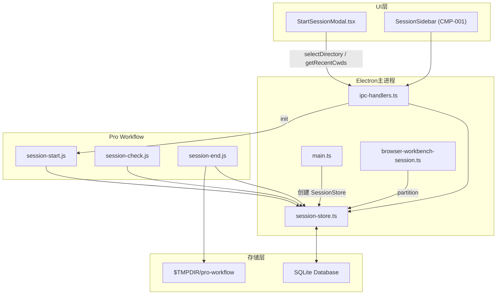
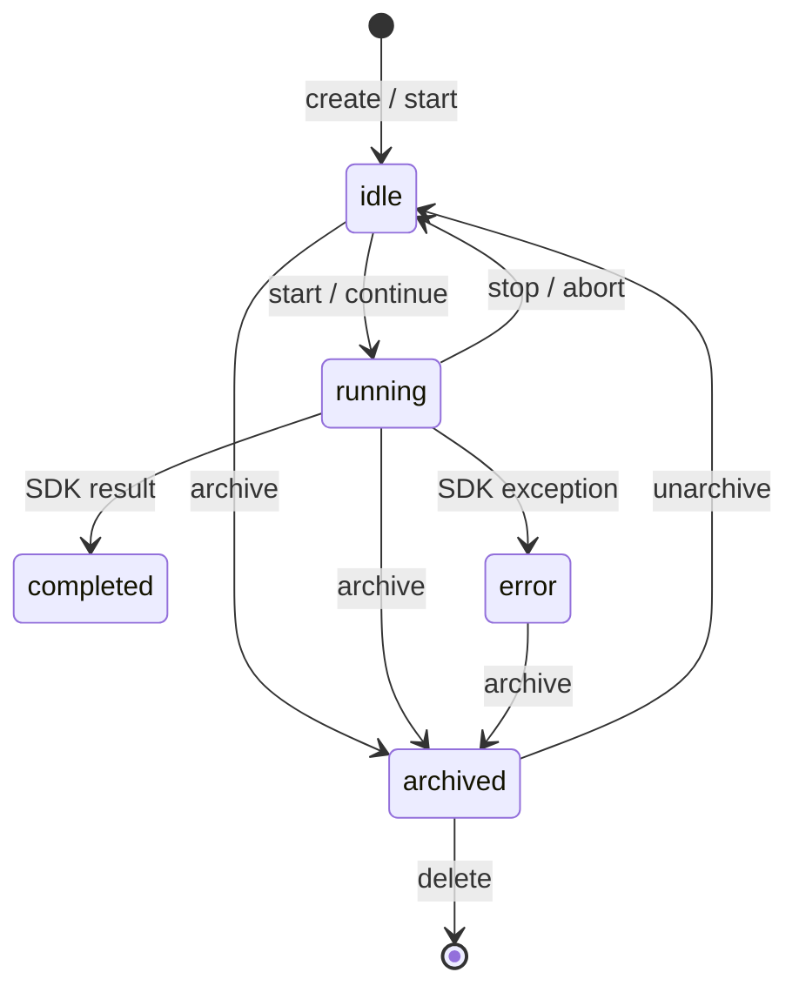

# 会话与历史系统总览

<cite>
**本文引用的文件**
- [pro-workflow/scripts/session-check.js](file://pro-workflow/scripts/session-check.js)
- [pro-workflow/scripts/session-end.js](file://pro-workflow/scripts/session-end.js)
- [pro-workflow/scripts/session-start.js](file://pro-workflow/scripts/session-start.js)
- [src/electron/libs/browser-workbench-session.ts](file://src/electron/libs/browser-workbench-session.ts)
- [src/electron/libs/session-store.ts](file://src/electron/libs/session-store.ts)
- [src/ui/components/StartSessionModal.tsx](file://src/ui/components/StartSessionModal.tsx)
- [doc/20-contracts/session-lifecycle/spec.md](file://doc/20-contracts/session-lifecycle/spec.md)
- [doc/40-product/1.0.0/40-delivery/components/CMP-001-SessionSidebar.md](file://doc/40-product/1.0.0/40-delivery/components/CMP-001-SessionSidebar.md)
- [src/electron/main.ts](file://src/electron/main.ts)
</cite>

# 会话与历史系统总览

> **module**: `module-session-engine`
> **layer**: L1 核心引擎
> **last_updated**: 2026-05-01
> **owner**: tech-cc-hub Core

本文档描述 `tech-cc-hub` 中会话（Session）与历史（History）系统的设计意图、代码结构和扩展路径。系统负责管理从创建到归档的完整生命周期，并驱动 Pro Workflow 脚本的启动/检查/结束钩子。

---

## 目录

- [系统职责与边界](#系统职责与边界)
- [核心文件与调用链](#核心文件与调用链)
- [数据结构与状态机](#数据结构与状态机)
- [Pro Workflow 脚本协作](#pro-workflow-脚本协作)
- [UI 组件交互](#ui-组件交互)
- [存储与持久化](#存储与持久化)
- [错误处理与失败模式](#错误处理与失败模式)
- [扩展点与改造路径](#扩展点与改造路径)
- [验证与排障命令](#验证与排障命令)

---

## 系统职责与边界

会话系统承担两类职责：

1. **生命周期管理**：创建、启动、暂停、恢复、归档、删除 Session，追踪状态转换。
2. **历史消息持久化**：将 StreamMessage 写入 SQLite，支持分页读取和游标翻页。

系统**不负责**：
- UI 渲染（由 `SessionSidebar` 组件承担，参见 [CMP-001-SessionSidebar.md#L21-L40](file://doc/40-product/1.0.0/40-delivery/components/CMP-001-SessionSidebar.md#L21-L40)）
- Agent 执行逻辑（由 Runner/IPC Handlers 承担）
- Workflow 解析（由 workflow-markdown 模块处理）

---

## 核心文件与调用链

### 架构总览



### 各文件职责

| 文件 | 职责 | 关键导出 |
|------|------|----------|
| `src/electron/main.ts` | 应用入口，初始化 `SessionStore` 实例 | `sessions` (SessionStore 实例) |
| `src/electron/libs/session-store.ts` | 内存 + SQLite 双写会话管理 | `SessionStore` class, `Session`, `StoredSession` |
| `src/electron/libs/browser-workbench-session.ts` | BrowserWorkbench WebPreferences 构建 | `buildBrowserWorkbenchWebPreferences()` |
| `src/ui/components/StartSessionModal.tsx` | 新建会话 UI，用户选择工作目录 | `StartSessionModal` React 组件 |
| `pro-workflow/scripts/session-start.js` | Claude CLI 启动钩子，加载历史学习 | `getStore()`, `store.startSession()` |
| `pro-workflow/scripts/session-check.js` | 每次响应后检查，发送提醒 | `detectCompletionSignals()`, `detectLargeChange()` |
| `pro-workflow/scripts/session-end.js` | 结束钩子，保存统计和摘要 | `store.endSession()`, 文件回退写入 |

### 调用链详解

#### 1. 应用启动 → SessionStore 初始化

```typescript
// src/electron/main.ts#L30
import { handleClientEvent, sessions, cleanupAllSessions, ... } from "./ipc-handlers.js";

// SessionStore 实例由 ipc-handlers.ts 在模块加载时创建
// sessions 对象被 main.ts 消费，用于 IPC 事件路由
```

#### 2. 用户新建会话 → SQLite 写入

```
用户点击"进入会话"
  → StartSessionModal.onStart()
  → window.electron.startSession(cwd)
  → ipc-handlers.ts handleStartSession
  → SessionStore.createSession()
  → INSERT sessions 表
```

`SessionStore.createSession()` 在 [session-store.ts#L159-L212](file://src/electron/libs/session-store.ts#L159-L212) 中完成：
- 生成 UUID 作为 `id`
- 初始化状态为 `"idle"`
- 插入 SQLite `sessions` 表（20 个字段）

#### 3. Pro Workflow 钩子触发

```
Claude CLI 启动 → session-start.js
  → getStore() 尝试连接 dist/db/store.js
  → 若成功则调用 store.startSession(sessionId, projectName)
  → 加载 getRecentLearnings() 和 getRecentSessions()

每次响应后 → session-check.js
  → 读取 $TMPDIR/pro-workflow/response-count-{sessionId}
  → 根据计数发送周期性提醒（每 20 次）
  → 检测完成信号和大变更

Claude CLI 结束 → session-end.js
  → 尝试 store.endSession()
  → 否则写入 $TMPDIR/pro-workflow/sessions/{date}-{shortId}.md
  → 检查 git status 未提交变更
```

---

## 数据结构与状态机

### 核心类型

```typescript
// session-store.ts#L35-56
type Session = {
  id: string;                          // UUID
  title: string;
  status: "idle" | "running" | "completed" | "error";
  cwd?: string;                        // 工作目录
  runSurface?: "development" | "maintenance";
  agentId?: string;
  allowedTools?: string;
  lastPrompt?: string;
  continuationSummary?: string;        // 上下文压缩摘要
  claudeSessionId?: string;           // 远端会话 ID（用于 resume）
  workflowMarkdown?: string;
  workflowState?: SessionWorkflowState;
  archivedAt?: number;                 // 非空 = 已归档
  pendingPermissions: Map<string, PendingPermission>;  // 仅内存
  abortController?: AbortController;   // 仅内存
};
```

> **章节来源**：[session-store.ts#L35-56](file://src/electron/libs/session-store.ts#L35-L56) 和 [spec.md#L43-66](file://doc/20-contracts/session-lifecycle/spec.md#L43-L66)

### 状态转换图



### 状态转换规则表

| 触发事件 | 当前状态 | 新状态 | 副作用 |
|----------|----------|--------|--------|
| `session.create` | (无) | `idle` | 插入 SQLite |
| `session.start` | `idle` | `running` | 初始化 `AbortController` |
| `session.stop` | `running` | `idle` | `abortController.abort()` |
| SDK 返回 | `running` | `completed` | 消息持久化完成 |
| SDK 异常 | `running` | `error` | `workflowError` 记录 |
| `session.archive` | 任意 | 保持 + `archivedAt` 置值 | 软删除 |
| `session.delete` | 已归档 | - | 物理删除 + 丢弃延迟事件 |

> **章节来源**：[spec.md#L146-160](file://doc/20-contracts/session-lifecycle/spec.md#L146-L160)

### 启动恢复机制

应用启动时 `SessionStore.recoverInterruptedSessions()` 将所有 `running` 状态重置为 `idle`（参见 [session-store.ts#L387-L411](file://src/electron/libs/session-store.ts#L387-L411)）：

```typescript
recoverInterruptedSessions(): string[] {
  for (const session of this.sessions.values()) {
    if (session.status !== "running") continue;
    session.status = "idle";
    session.abortController = undefined;
    session.pendingPermissions.clear();
    recoveredIds.push(session.id);
  }
  // UPDATE sessions SET status = 'idle' WHERE id IN (...)
}
```

---

## Pro Workflow 脚本协作

Pro Workflow 脚本运行在 Claude Code CLI 进程中，通过文件系统和环境变量与 Electron 主进程通信。

### session-start.js 行为

**触发时机**：Claude CLI 启动时自动执行（需在 `.claude.json` 中配置 `hook.start`）。

**核心流程**：
1. 通过 `findProjectRoot()` 向上查找 `.git` 定位项目根目录
2. 尝试加载 `dist/db/store.js`，若成功则：
   - 调用 `store.startSession(sessionId, projectName)`
   - 加载 `getRecentLearnings(store.db, 5, projectName)` 显示最近学习
   - 显示上一次会话统计（编辑数、纠正数）
   - 列出可用 wikis
3. 若无数据库，回退到：
   - 读取 `.claude/LEARNED.md` 统计 `[LEARN]` 标记数量
   - 扫描 `$TMPDIR/pro-workflow/sessions/` 找最近会话文件

```javascript
// session-start.js#L44-68（关键片段）
if (store) {
  store.startSession(sessionId, projectName);
  const recentLearnings = getRecentLearnings(store.db, 5, projectName);
  if (recentLearnings.length > 0) {
    log(`[ProWorkflow] Loaded ${recentLearnings.length} learnings from database:`);
  }
  const recentSessions = store.getRecentSessions(3);
  if (recentSessions.length > 1) {
    log(`[ProWorkflow] Previous session: ${lastSession.started_at.split('T')[0]} (${lastSession.edit_count} edits)`);
  }
}
```

### session-check.js 行为

**触发时机**：每次 Claude 响应结束时。

**检查逻辑**（[session-check.js#L27-L98](file://pro-workflow/scripts/session-check.js#L27-L98)）：

| 检查点 | 条件 | 输出 |
|--------|------|------|
| 完成信号 | `detectCompletionSignals()` 匹配 | `"Task looks complete — consider /wrap-up"` |
| 大变更 | `detectLargeChange()` 匹配 | `"Good checkpoint for review"` |
| 周期提醒 | 每 20 次响应 | 轮流提示 `/wrap-up`、`/learn-rule`、`/compact` |
| 长会话 | 第 50 次响应 | 强提示压缩和 wrap-up |

**响应计数存储**：计数文件位于 `$TMPDIR/pro-workflow/response-count-{sessionId}`。

### session-end.js 行为

**触发时机**：用户结束 Claude CLI 会话时（需配置 `hook.end`）。

**核心流程**：
1. 尝试 `store.endSession(sessionId)` 更新数据库
2. 若无数据库，写入 Markdown 模板到 `$TMPDIR/pro-workflow/sessions/`
3. 检查 `git status --porcelain` 报告未提交变更

```javascript
// session-end.js#L59-75（关键片段）
if (store) {
  const session = store.getSession(sessionId);
  if (session) {
    store.endSession(sessionId);
    log(`[ProWorkflow] Session saved to database:`);
    log(`  - Edits: ${session.edit_count}`);
    log(`  - Corrections: ${session.corrections_count}`);
    log(`  - Prompts: ${session.prompts_count}`);
  }
}
```

> **图表来源**：[session-end.js#L59-L75](file://pro-workflow/scripts/session-end.js#L59-L75)

---

## UI 组件交互

### StartSessionModal 组件

位置：`src/ui/components/StartSessionModal.tsx`

**职责**：收集用户选择的工作目录，触发会话创建。

```tsx
// StartSessionModal.tsx 的核心接口
interface StartSessionModalProps {
  cwd: string;                    // 当前工作目录
  pendingStart: boolean;          // 正在创建中
  onCwdChange: (value: string) => void;
  onStart: () => void;            // 调用 electron.startSession
  onClose: () => void;
}
```

**关键行为**：
- `useEffect` 调用 `window.electron.getRecentCwds()` 加载最近目录（[StartSessionModal.tsx#L20-L22](file://src/ui/components/StartSessionModal.tsx#L20-L22)）
- `handleSelectDirectory` 调用 `window.electron.selectDirectory()` 打开系统目录选择器
- 支持点击最近目录快捷切换

### SessionSidebar 组件

位置：`doc/40-product/1.0.0/40-delivery/components/CMP-001-SessionSidebar.md`

**职责**：展示会话列表，支持切换和新建。

**接口**：
- Inputs: `sessions[]`, `active_session_id`, `session_status`
- Outputs: `session_selected`, `new_session_requested`

**验收标准**：
- 能区分当前 Session
- 能展示最近活动时间
- 点击切换后主视图同步更新

---

## 存储与持久化

### SQLite Schema

`SessionStore` 使用 `better-sqlite3` 连接数据库，核心表：

```sql
-- sessions 表（定义来源：session-store.ts#L183-210）
CREATE TABLE sessions (
  id TEXT PRIMARY KEY,
  title TEXT NOT NULL,
  claude_session_id TEXT,
  status TEXT NOT NULL,      -- idle | running | completed | error
  model TEXT,
  cwd TEXT,
  run_surface TEXT,
  agent_id TEXT,
  allowed_tools TEXT,
  last_prompt TEXT,
  continuation_summary TEXT,
  continuation_summary_message_count INTEGER,
  workflow_markdown TEXT,
  workflow_source_layer TEXT,
  workflow_source_path TEXT,
  workflow_state TEXT,       -- JSON
  workflow_error TEXT,
  archived_at INTEGER,
  created_at INTEGER NOT NULL,
  updated_at INTEGER NOT NULL
);

-- messages 表（用于历史分页）
CREATE TABLE messages (
  id TEXT PRIMARY KEY,
  session_id TEXT NOT NULL,
  data TEXT NOT NULL,         -- JSON StreamMessage
  created_at INTEGER NOT NULL
);
```

### 内存 vs 持久化字段

| 字段 | 位置 | 说明 |
|------|------|------|
| `pendingPermissions` | 仅内存 | Map，不写入数据库 |
| `abortController` | 仅内存 | 用于取消 running 会话 |
| `archivedAt` | SQLite | 非空表示已归档 |
| `workflowState` | SQLite | JSON 序列化后存储 |

> **章节来源**：[session-store.ts#L35-56](file://src/electron/libs/session-store.ts#L35-L56)

### 历史分页机制

使用游标分页避免大偏移量开销：

```typescript
// session-store.ts#L326-377
getSessionHistoryPage(id, options?: {
  before?: SessionHistoryCursor;   // { beforeCreatedAt: number; beforeId: string }
  limit?: number;                  // 默认 400，上限 1000
}): SessionHistoryPage
```

首次加载 `mode: "replace"`，后续翻页 `mode: "prepend"`。

---

## 错误处理与失败模式

### 常见错误场景

| 场景 | 表现 | 排查命令 |
|------|------|----------|
| 会话创建失败 | `ipc-handlers` 报错 "Session creation failed" | 检查 `sessions` 表是否有约束冲突 |
| 历史加载失败 | UI 显示空消息列表 | 验证 `messages` 表是否损坏 |
| Pro Workflow 钩子不执行 | 无欢迎信息 | 检查 `.claude.json` 中 `hook.start` 是否指向正确路径 |
| 数据库锁定 | "database is locked" | 确认只有一个 Electron 进程运行 |
| 中断恢复失效 | 启动后状态仍为 running | 检查 `recoverInterruptedSessions()` 是否被调用 |

### 数据库回退

当 `dist/db/store.js` 不可用时，Pro Workflow 脚本回退到文件存储：

```javascript
// session-end.js#L76-105
const sessionsDir = path.join(os.tmpdir(), 'pro-workflow', 'sessions');
ensureDir(sessionsDir);
const sessionFile = path.join(sessionsDir, `${today}-${shortId}.md`);
fs.writeFileSync(sessionFile, template);
```

---

## 扩展点与改造路径

### 1. 添加新 Session 字段

**步骤**：
1. 在 `Session` 和 `StoredSession` 类型中添加可选字段（[session-store.ts#L35-79](file://src/electron/libs/session-store.ts#L35-L79)）
2. 在 `createSession()` 的 INSERT 语句中添加字段（[session-store.ts#L183-L210](file://src/electron/libs/session-store.ts#L183-L210)）
3. 在 `mapSessionRow()` 中添加映射（[session-store.ts#L228-L251](file://src/electron/libs/session-store.ts#L228-L251)）
4. 更新 `doc/20-contracts/session-lifecycle/spec.md` 的类型定义

**约束**：新字段必须是 `?` 可选，确保旧数据兼容（参见 [spec.md#L203-207](file://doc/20-contracts/session-lifecycle/spec.md#L203-L207)）。

### 2. 扩展状态机

当前状态：`idle` | `running` | `completed` | `error`

**新增状态步骤**：
1. 更新 `SessionStatus` 类型定义
2. 在状态转换表添加新规则（[spec.md#L148-160](file://doc/20-contracts/session-lifecycle/spec.md#L148-L160)）
3. 在 `ipc-handlers.ts` 中添加对应分支处理
4. 确保新状态在 `listSessions()` 和 `getSessionHistory()` 中正确返回

### 3. Pro Workflow 钩子增强

**场景**：添加新的会话元数据收集

**示例**：在 `session-end.js` 中添加错误率统计：

```javascript
// 在 store.endSession() 之前或之后添加
if (session) {
  const errorRate = session.error_count / session.prompts_count;
  log(`[ProWorkflow] Error rate: ${(errorRate * 100).toFixed(1)}%`);
}
```

### 4. 消息过滤规则

`isTransientStreamEventMessage()` ([session-store.ts#L91-L99](file://src/electron/libs/session-store.ts#L91-L99)) 决定哪些消息不写入历史。

**添加新过滤类型**：
```typescript
function isTransientStreamEventMessage(message: StreamMessage): boolean {
  return (
    "type" in message &&
    (
      message.type === "stream_event" ||
      (message.type === "system" && "subtype" in message && message.subtype === "status") ||
      message.type === "new_filter_type"  // 新增
    )
  );
}
```

---

## 验证与排障命令

### 启动验证

```bash
# 1. 确认 SessionStore 初始化日志
grep -r "SessionStore" src/electron/main.ts | head -5

# 2. 验证 SQLite 数据库存在
ls -la ~/.config/tech-cc-hub/sessions.db

# 3. 检查 Pro Workflow 钩子配置
cat .claude.json | jq '.hook'
```

### 运行时检查

```bash
# 查看会话列表（需要通过 IPC 或 DevTools）
# 等效于 SessionStore.listSessions() 输出

# 检查中断恢复
grep -A 20 "recoverInterruptedSessions" src/electron/libs/session-store.ts
```

### Pro Workflow 脚本调试

```bash
# 手动运行 session-start.js 并查看输出
CLAUDE_SESSION_ID=test-session node pro-workflow/scripts/session-start.js 2>&1

# 手动运行 session-end.js
CLAUDE_SESSION_ID=test-session node pro-workflow/scripts/session-end.js 2>&1

# 查看临时会话文件
ls -la /tmp/pro-workflow/sessions/

# 读取响应计数
cat /tmp/pro-workflow/response-count-test-session
```

### 单元测试覆盖

```bash
# 测试 SessionStore.createSession
# 测试 SessionStore.updateSession 状态转换
# 测试 recoverInterruptedSessions

# 验证位置参考
grep -n "describe\|it(" test/**/*.ts | grep -i session
```

---

## 关键设计决策索引

| 决策 | 位置 | 理由 |
|------|------|------|
| `pendingPermissions` 仅存内存 | [session-store.ts#L54](file://src/electron/libs/session-store.ts#L54) | 安全性：权限信息不应持久化 |
| 响应计数存 `/tmp` | [session-check.js#L67](file://pro-workflow/scripts/session-check.js#L67) | 临时数据，无需长期保留 |
| `running → idle` 软恢复 | [session-store.ts#L395](file://src/electron/libs/session-store.ts#L395) | 避免应用崩溃导致会话卡死 |
| 消息按需分页 | [session-store.ts#L336](file://src/electron/libs/session-store.ts#L336) | 大会话可能产生数万条消息 |

---

**文档版本**: 1.0.0
**下次审查**: 2026-06-01
**相关规范**: [session-lifecycle/spec.md](file://doc/20-contracts/session-lifecycle/spec.md) | [CMP-001-SessionSidebar](file://doc/40-product/1.0.0/40-delivery/components/CMP-001-SessionSidebar.md)