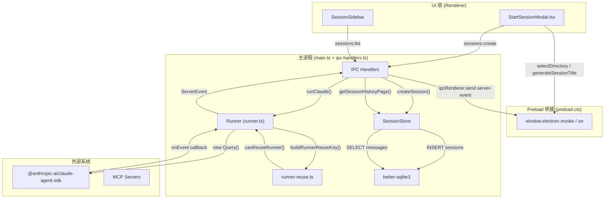
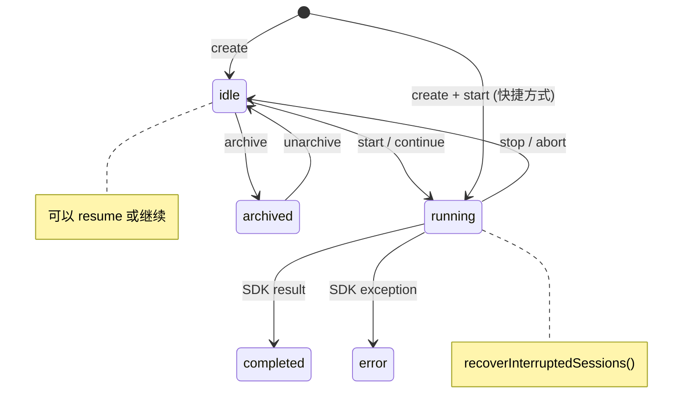
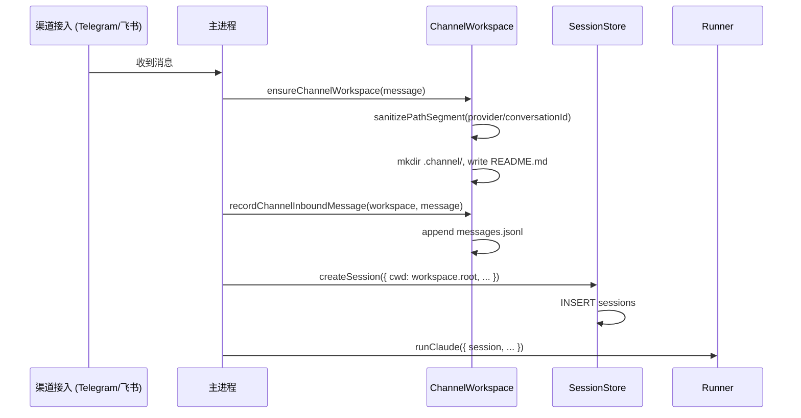

# 会话与历史系统总览

<cite>
**本文引用的文件**
- [pro-workflow/scripts/session-check.js](file://pro-workflow/scripts/session-check.js)
- [pro-workflow/scripts/session-end.js](file://pro-workflow/scripts/session-end.js)
- [pro-workflow/scripts/session-start.js](file://pro-workflow/scripts/session-start.js)
- [src/electron/libs/browser-workbench-session.ts](file://src/electron/libs/browser-workbench-session.ts)
- [src/electron/libs/session-store.ts](file://src/electron/libs/session-store.ts)
- [src/ui/components/StartSessionModal.tsx](file://src/ui/components/StartSessionModal.tsx)
- [doc/20-contracts/session-lifecycle/spec.md](file://doc/20-contracts/session-lifecycle/spec.md)
- [doc/40-product/1.0.0/40-delivery/components/CMP-001-SessionSidebar.md](file://doc/40-product/1.0.0/40-delivery/components/CMP-001-SessionSidebar.md)
- [src/electron/libs/runner.ts](file://src/electron/libs/runner.ts)
- [src/electron/libs/runner-reuse.ts](file://src/electron/libs/runner-reuse.ts)
- [src/electron/main.ts](file://src/electron/main.ts)
- [src/electron/preload.cts](file://src/electron/preload.cts)
- [src/electron/libs/system-prompt-presets.ts](file://src/electron/libs/system-prompt-presets.ts)
- [pro-workflow/scripts/prompt-submit.js](file://pro-workflow/scripts/prompt-submit.js)
- [pro-workflow/scripts/read-before-write.js](file://pro-workflow/scripts/read-before-write.js)
- [pro-workflow/scripts/reread-tracker.js](file://pro-workflow/scripts/reread-tracker.js)
- [src/electron/libs/workflow-catalog.ts](file://src/electron/libs/workflow-catalog.ts)
- [src/electron/libs/channel-workspace.ts](file://src/electron/libs/channel-workspace.ts)
</cite>

---

## 目录

- [1. 系统职责与边界](#1-系统职责与边界)
- [2. 核心数据类型](#2-核心数据类型)
- [3. 调用链与数据流](#3-调用链与数据流)
- [4. 会话生命周期状态机](#4-会话生命周期状态机)
- [5. 数据库 Schema](#5-数据库-schema)
- [6. IPC 通道与桥接点](#6-ipc-通道与桥接点)
- [7. Runner 重用机制](#7-runner-重用机制)
- [8. 渠道工作区集成](#8-渠道工作区集成)
- [9. 扩展点与 Hook 体系](#9-扩展点与-hook-体系)
- [10. Agent 改代码地图](#10-agent-改代码地图)
- [11. 常见改造路径](#11-常见改造路径)
- [12. 验证与排障命令](#12-验证与排障命令)

---

## 1. 系统职责与边界

会话与历史系统（`module-session-engine`）是 tech-cc-hub 的核心子系统，负责：

| 职责 | 说明 | 关键文件 |
|------|------|---------|
| **会话生命周期管理** | 创建、启动、停止、归档、恢复会话 | `session-store.ts` |
| **消息历史持久化** | 将 `StreamMessage` 写入 SQLite，按需分页加载 | `session-store.ts:298-324` |
| **Agent 执行引擎** | 调用 SDK 执行 prompt，返回 `ServerEvent` | `runner.ts` |
| **Runner 实例复用** | 根据配置指纹决定是否复用已有 Runner | `runner-reuse.ts` |
| **工作区初始化** | 解析 cwd、加载最近工作目录、初始化渠道工作区 | `channel-workspace.ts` |
| **Workflow 目录发现** | 从 system/user/project 三层发现可用 workflow | `workflow-catalog.ts` |

**不在本模块范围内：**
- UI 组件渲染逻辑（`SessionSidebar` 交互由 CMP-001 定义）
- 插件安装和 MCP 服务管理
- Figma/OAuth 等外部集成

[章节来源](file://doc/20-contracts/session-lifecycle/spec.md#L30-L35)

---

## 2. 核心数据类型

### 2.1 Session 与 StoredSession

```typescript
// src/electron/libs/session-store.ts:34-55
type Session = {
  id: string;                      // crypto.randomUUID()
  title: string;
  claudeSessionId?: string;       // SDK 远端会话 ID，用于 resume
  status: SessionStatus;          // "idle" | "running" | "completed" | "error"
  model?: string;
  cwd?: string;
  runSurface?: AgentRunSurface;   // "development" | "maintenance"
  agentId?: string;
  allowedTools?: string;
  lastPrompt?: string;
  continuationSummary?: string;   // 上下文压缩滚动摘要
  workflowMarkdown?: string;
  workflowState?: SessionWorkflowState;
  archivedAt?: number;            // Unix ms，非空表示已归档
  pendingPermissions: Map<string, PendingPermission>;  // 仅运行时
  abortController?: AbortController;  // 仅运行时
};
```

**关键区别：**
- `Session` 包含运行时字段（`pendingPermissions`、`abortController`），**不持久化**
- `StoredSession` 是 SQLite 投影，仅包含可序列化字段，新增字段必须为可选（`?`）

[类型定义来源](file://src/electron/libs/session-store.ts#L34-L79)

### 2.2 StreamMessage 与分页

```typescript
// src/electron/libs/session-store.ts:86-88
type SessionHistory = {
  session: StoredSession;
  messages: StreamMessage[];
};

type SessionHistoryPage = SessionHistory & {
  hasMore: boolean;
  nextCursor?: SessionHistoryCursor;  // { beforeCreatedAt: number; beforeId: string }
};
```

**消息过滤规则：**
- `type === "stream_event"` 的消息被过滤（`isTransientStreamEventMessage()`）
- `type === "system" && subtype === "status"` 的消息被过滤

[过滤函数来源](file://src/electron/libs/session-store.ts#L91-99)

### 2.3 ChannelWorkspace

```typescript
// src/electron/libs/channel-workspace.ts:26-31
type ChannelWorkspace = {
  root: string;              // 格式: <userData>/channels/<provider>/<conversationId>
  provider: ChannelProviderId;  // "telegram" | "lark" | "dingtalk" | "wechat" | ...
  conversationId: string;
  label: string;
};
```

渠道工作区用于多渠道接入（飞书、Telegram 等），消息记录在 `.channel/messages.jsonl`。

[类型定义来源](file://src/electron/libs/channel-workspace.ts#L5-L42)

---

## 3. 调用链与数据流



**调用序列示例（新建会话）：**

1. 用户在 `StartSessionModal` 选择目录，点击"进入会话"
2. `window.electron.selectDirectory()` → IPC `select-directory` → 主进程打开系统目录选择框
3. `window.electron.generateSessionTitle(userInput)` → IPC `generate-session-title`
4. `window.electron.invoke('sessions:create', { cwd, title, ... })`
5. `ipc-handlers.ts` → `sessions.createSession(options)` → `SessionStore.createSession()`
6. `SessionStore` 写入 SQLite `sessions` 表，返回 `Session` 对象
7. UI 切换到新会话，启动 `runner`

[入口文件来源](file://src/ui/components/StartSessionModal.tsx#L1-L100)
[IPC 通道来源](file://src/electron/preload.cts#L29-L34)

---

## 4. 会话生命周期状态机



**状态转换规则表：**

| 当前状态 | 触发事件 | 新状态 | 副作用 |
|---------|---------|--------|--------|
| (不存在) | `session.create` | `idle` | 写 sessions 表 |
| `idle` | `session.start` | `running` | 启动 Runner |
| `running` | Runner 返回 result | `completed` | 记录消息历史 |
| `running` | Runner 抛异常 | `error` | `workflowError` 写入 |
| `running` | 用户 stop | `idle` | `abortController.abort()` |
| 任意 | `session.archive` | 保持 + `archivedAt` 置值 | 软删除 |
| 已归档 | `session.unarchive` | 恢复 | `archivedAt = null` |

**启动恢复逻辑：**
- 应用启动时 `SessionStore.recoverSuccessfulErrorSessions()` 将所有 `running` 状态重置为 `idle`
- `claudeSessionId` 用于远端 resume（SDK 支持的前提下）

[状态机定义来源](file://doc/20-contracts/session-lifecycle/spec.md#L110-L160)

---

## 5. 数据库 Schema

### 5.1 sessions 表

```sql
CREATE TABLE sessions (
  id TEXT PRIMARY KEY,
  title TEXT NOT NULL,
  claude_session_id TEXT,
  status TEXT NOT NULL,
  model TEXT,
  cwd TEXT,
  run_surface TEXT,
  agent_id TEXT,
  allowed_tools TEXT,
  last_prompt TEXT,
  continuation_summary TEXT,
  continuation_summary_message_count INTEGER,
  workflow_markdown TEXT,
  workflow_source_layer TEXT,
  workflow_source_path TEXT,
  workflow_state TEXT,         -- JSON 序列化 SessionWorkflowState
  workflow_error TEXT,
  archived_at INTEGER,
  created_at INTEGER NOT NULL,
  updated_at INTEGER NOT NULL
);
```

### 5.2 messages 表

```sql
CREATE TABLE messages (
  id TEXT PRIMARY KEY,
  session_id TEXT NOT NULL,
  data TEXT NOT NULL,          -- JSON 序列化 StreamMessage（含 capturedAt/historyId）
  created_at INTEGER NOT NULL,
  FOREIGN KEY (session_id) REFERENCES sessions(id)
);
-- 索引：session_id + created_at + id
```

**消息存储流程：**
1. `runner.ts` 通过 `onEvent` 回调接收 `ServerEvent`
2. `ipc-handlers.ts` 调用 `sessions.recordMessage(sessionId, event)`
3. `SessionStore` 写入 `messages` 表
4. 存储前执行 `stripInlineBase64ImagesFromMessage()` 清理图片数据

[Schema 来源](file://src/electron/libs/session-store.ts#L183-L210)
[初始化来源](file://src/electron/libs/session-store.ts#L125-L130)

---

## 6. IPC 通道与桥接点

### 6.1 会话相关通道

| IPC 通道 | 方向 | 用途 | 处理器 |
|---------|------|------|--------|
| `sessions:create` | Renderer → Main | 创建新会话 | `handleClientEvent` |
| `sessions:list` | Renderer → Main | 列出会话（含归档过滤） | `listStoredSessionsForRenderer` |
| `sessions:getHistory` | Renderer → Main | 加载历史消息 | `sessions.getSessionHistory()` |
| `sessions:archive` | Renderer → Main | 归档会话 | `sessions.archiveSession()` |
| `generate-session-title` | Renderer → Main | AI 生成会话标题 | `generateSessionTitle` |
| `select-directory` | Renderer → Main | 打开目录选择框 | `dialog.showOpenDialog` |
| `get-recent-cwds` | Renderer → Main | 获取最近工作目录 | `sessions.listRecentCwds()` |
| `server-event` | Main → Renderer | 推送 ServerEvent | `ipcRenderer.send` |

### 6.2 知识库通道

| IPC 通道 | 方向 | 用途 |
|---------|------|------|
| `knowledge:list` | Renderer → Main | 列出知识库 |
| `knowledge:read-document` | Renderer → Main | 读取文档 |
| `knowledge:overview` | Renderer → Main | 获取概览 |
| `knowledge:run-generation` | Renderer → Main | 触发生成 |

### 6.3 Preload 桥接

```typescript
// src/electron/preload.cts:27-34
generateSessionTitle: (userInput: string | null, options?: { model?: string }) =>
    ipcInvoke("generate-session-title", userInput, options),
getRecentCwds: (limit?: number) =>
    ipcInvoke("get-recent-cwds", limit),
selectDirectory: () =>
    ipcInvoke("select-directory"),
sendClientEvent: (event: any) => {
    electron.ipcRenderer.send("client-event", event);
},
onServerEvent: (callback: (event: any) => void) => {
    // 解析 payload，返回 unsubscribe 函数
}
```

[IPC 定义来源](file://src/electron/main.ts#L30)
[Preload 桥接来源](file://src/electron/preload.cts#L12-L26)

---

## 7. Runner 重用机制

### 7.1 复用键生成

```typescript
// src/electron/libs/runner-reuse.ts:29-30
export function buildRunnerReuseKey(input: RunnerReuseKeyInput): string {
  return JSON.stringify(buildRunnerReuseDescriptor(input));
}

// src/electron/libs/runner-reuse.ts:52-74
function buildRunnerReuseDescriptor(input: RunnerReuseKeyInput): RunnerReuseDescriptor {
  return {
    cwd: normalizeKeyPart(input.cwd),
    model: normalizeKeyPart(input.model),
    permissionMode: input.runtime?.permissionMode ?? "bypassPermissions",
    reasoningMode: input.runtime?.reasoningMode ?? "",
    outputFormat: input.runtime?.outputFormat ?? "",
    runSurface,
    agentId: normalizeKeyPart(agentId),
    allowedTools: normalizeKeyPart(input.allowedTools),
    runtimeProfile: profile.id,
    builtinMcpServers: [...profile.builtinMcpServers],
  };
}
```

**复用判定条件：**
- `cwd` 相同
- `model` 相同
- `permissionMode` 相同
- `reasoningMode` 相同
- `outputFormat` 相同
- `runSurface` 相同
- `agentId` 相同
- `allowedTools` 相同

[复用逻辑来源](file://src/electron/libs/runner-reuse.ts#L33-L50)

### 7.2 RunnerOptions 结构

```typescript
// src/electron/libs/runner.ts:90-98
export type RunnerOptions = {
  prompt: string;
  attachments?: PromptAttachment[];
  runtime?: RuntimeOverrides;
  session: Session;              // 必须传入，用于访问 session.cwd 等
  resumeSessionId?: string;     // 可选，用于远端 resume
  onEvent: (event: ServerEvent) => void;  // 必须，用于推送事件到 UI
  onSessionUpdate?: (updates: Partial<Session>) => void;
};
```

[RunnerOptions 来源](file://src/electron/libs/runner.ts#L90-L98)

---

## 8. 渠道工作区集成

### 8.1 工作区初始化流程



### 8.2 渠道消息类型

```typescript
// src/electron/libs/channel-workspace.ts:14-24
type ChannelInboundMessage = {
  provider: ChannelProviderId;
  text: string;
  externalConversationId?: string;
  externalMessageId?: string;
  senderId?: string;
  senderName?: string;
  channelName?: string;
  title?: string;
  receivedAt?: number;
};
```

**支持的渠道：** `telegram`, `lark`, `dingtalk`, `wechat`, `wecom`, `slack`, `discord`

[渠道工作区来源](file://src/electron/libs/channel-workspace.ts#L90-L109)

---

## 9. 扩展点与 Hook 体系

### 9.1 学习 Hook（pro-workflow 脚本）

| 脚本 | 触发时机 | 功能 |
|------|---------|------|
| `session-start.js` | 会话启动 | 加载最近 learnings，显示最近会话摘要 |
| `session-check.js` | 每次 Agent 响应后 | 检测完成信号、提醒 wrap-up |
| `session-end.js` | 会话结束 | 归档会话、检查未提交变更 |
| `prompt-submit.js` | 用户提交 prompt 时 | 检测纠正模式、触发 learning |
| `read-before-write.js` | 文件读写操作 | 追踪 Read 行为，警告未经读取直接写入 |
| `reread-tracker.js` | 读取文件时 | 检测重复读取（未修改），阻止 token 浪费 |

### 9.2 学习检测模式

```javascript
// pro-workflow/scripts/prompt-submit.js:42-52
const correctionPatterns = [
  /no,?\s*(that's|thats)?\s*(wrong|incorrect|not right)/i,
  /you\s*(should|shouldn't|need to|forgot)/i,
  /that's not what I (meant|asked|wanted)/i,
  /wrong file/i,
  /undo that/i,
  /revert/i,
];
```

### 9.3 System Prompt 扩展

```typescript
// src/electron/libs/system-prompt-presets.ts:28-43
export function buildToolCallOptimizationPromptAppend(): string {
  return [
    "Tool-call budget: use tools only when the answer depends on external state",
    "Before first tool call, group evidence from 2+ read-only searches",
    "Use built-in Task tool for parallel investigation only",
    // ... 更多规则
  ].join("\n");
}
```

[学习脚本来源](file://pro-workflow/scripts/prompt-submit.js#L42-L68)
[System Prompt 来源](file://src/electron/libs/system-prompt-presets.ts#L28-L43)

---

## 10. Agent 改代码地图

### 10.1 先读文件清单

**优先级 1（核心）：**
- `src/electron/libs/session-store.ts` — SessionStore 类定义、数据库操作
- `src/electron/libs/runner.ts` — runClaude 函数、onEvent 回调逻辑
- `src/electron/main.ts` — IPC handler 注册（搜索 `sessions:` 或 `ipcMain.handle`）

**优先级 2（UI 入口）：**
- `src/ui/components/StartSessionModal.tsx` — 会话创建 UI
- `src/electron/preload.cts` — IPC 桥接定义

**优先级 3（辅助）：**
- `src/electron/libs/runner-reuse.ts` — Runner 重用逻辑
- `src/electron/libs/workflow-catalog.ts` — Workflow 发现
- `doc/20-contracts/session-lifecycle/spec.md` — 状态机规范

### 10.2 关键符号速查

| 符号 | 位置 | 用途 |
|------|------|------|
| `SessionStore.createSession()` | `session-store.ts:159` | 创建新会话 |
| `SessionStore.getSessionHistory()` | `session-store.ts:298` | 加载历史消息 |
| `SessionStore.archiveSession()` | `session-store.ts:254` | 归档会话 |
| `runClaude()` | `runner.ts:212` | 启动 Agent 执行 |
| `buildRunnerReuseKey()` | `runner-reuse.ts:28` | 生成复用键 |
| `canReuseRunner()` | `runner-reuse.ts:33` | 判定是否复用 |
| `SessionHistoryCursor` | `session-store.ts:116` | 分页游标类型 |
| `PendingPermission` | `session-store.ts:28` | 待确认权限类型 |

### 10.3 修改入口

| 场景 | 修改位置 | 注意事项 |
|------|---------|---------|
| 新增会话状态 | `SessionStatus` 类型 + `session-store.ts` switch | 必须向后兼容 |
| 新增 IPC 通道 | `main.ts` ipcMain.handle + `preload.cts` 桥接 | 同时更新两处 |
| 修改消息持久化逻辑 | `session-store.ts:101` parseStoredMessage | 注意 stripInlineBase64Images |
| 添加 Runner 扩展 | `runner.ts` createPromptSource / buildEffectiveAllowedToolSet | 参考现有 hook |
| 修改历史分页逻辑 | `session-store.ts:326` getSessionHistoryPage | 注意 cursor 结构 |

### 10.4 验证命令

```bash
# 检查会话列表 IPC 是否正常
# 在 DevTools Console 中：
window.electron.invoke('sessions:list', {}).then(console.log)

# 检查数据库 sessions 表
sqlite3 ~/.tech-cc-hub/sessions.db "SELECT id, title, status, updated_at FROM sessions ORDER BY updated_at DESC LIMIT 10;"

# 检查消息历史
sqlite3 ~/.tech-cc-hub/sessions.db "SELECT session_id, json_extract(data, '$.type') as type, created_at FROM messages ORDER BY created_at DESC LIMIT 20;"

# 检查 Runner 日志
# 启动应用后观察 DevTools Console 的 server-event
```

### 10.5 常见回归风险

| 风险点 | 表现 | 排查命令 |
|--------|------|---------|
| 会话创建后立即归档 | UI 显示会话列表为空 | `sqlite3 sessions.db "SELECT archived_at FROM sessions WHERE id='<id>'"` |
| 消息历史加载失败 | 聊天区域空白 | 检查 `messages` 表 `data` 列是否为有效 JSON |
| Runner 无法复用 | 每次请求都启动新进程 | 检查 `buildRunnerReuseKey()` 的输入参数 |
| 渠道消息未写入 | 外部渠道消息消失 | 检查 `.channel/messages.jsonl` 是否存在 |
| 分页游标失效 | 加载更多历史时卡死 | 检查 `SessionHistoryCursor` 结构 |

[修改入口来源](file://src/electron/libs/session-store.ts#L159-L212)
[验证命令来源](file://doc/20-contracts/session-lifecycle/spec.md#L209-L214)

---

## 11. 常见改造路径

### 11.1 添加新会话元数据字段

1. 在 `session-store.ts:34-56` 的 `Session` 类型中添加可选字段
2. 在 `StoredSession` 类型中同步添加
3. 修改 `createSession()` 中的 INSERT 语句（第 183-210 行）
4. 修改 `mapSessionRow()` 中的 SELECT 映射（第 228-251 行）
5. 添加数据库 migration（如果需要持久化旧数据）

**示例：添加 `priority` 字段**
```typescript
// 1. 添加到 Session 类型
priority?: string;  // "low" | "normal" | "high"

// 2. 修改 INSERT
.run(id, ..., session.priority ?? null, ...)

// 3. 修改 SELECT 映射
priority: row.priority ? String(row.priority) : undefined,
```

### 11.2 添加新 IPC 通道

1. 在 `main.ts` 中注册 handler：
   ```typescript
   ipcMainHandle("channel:name", async (event, ...args) => {
     // 处理逻辑
   });
   ```

2. 在 `preload.cts` 中添加桥接：
   ```typescript
   channelName: (...args) => ipcInvoke("channel:name", ...args),
   ```

3. 在 `StartSessionModal.tsx` 或其他 UI 组件中调用

### 11.3 修改消息历史过滤规则

1. 找到 `isTransientStreamEventMessage()` 函数（`session-store.ts:91`）
2. 添加新的过滤条件：
   ```typescript
   message.type === "stream_event" ||
   (message.type === "system" && "subtype" in message && message.subtype === "status") ||
   message.type === "your_new_type"
   ```

### 11.4 添加渠道支持

1. 在 `ChannelProviderId` 类型中添加新渠道（`channel-workspace.ts:5-12`）
2. 在 `CHANNEL_LABELS` 中添加标签（`channel-workspace.ts:44-52`）
3. 在渠道桥接代码中处理新渠道的接入逻辑

[改造路径来源](file://src/electron/libs/session-store.ts#L91-L99)

---

## 12. 验证与排障命令

### 12.1 环境检查

```bash
# 检查应用数据目录
ls -la ~/Library/Application\ Support/tech-cc-hub/  # macOS
ls -la $APPDATA/tech-cc-hub/  # Windows

# 检查数据库文件
sqlite3 ~/.tech-cc-hub/sessions.db ".tables"
sqlite3 ~/.tech-cc-hub/sessions.db ".schema sessions"
```

### 12.2 会话状态检查

```bash
# 查看所有会话状态分布
sqlite3 sessions.db "SELECT status, COUNT(*) FROM sessions GROUP BY status;"

# 查看最近更新的会话
sqlite3 sessions.db "SELECT id, title, status, datetime(updated_at/1000, 'unixepoch') as updated FROM sessions ORDER BY updated_at DESC LIMIT 10;"

# 查看特定会话的消息数量
sqlite3 sessions.db "SELECT session_id, COUNT(*) FROM messages WHERE session_id='<id>' GROUP BY session_id;"
```

### 12.3 Runner 调试

```bash
# 检查 Runner 日志
# macOS
tail -f ~/Library/Logs/tech-cc-hub/*.log
# Windows
Get-Content $env:APPDATA/tech-cc-hub/logs/*.log -Tail 50 -Wait
```

### 12.4 渠道工作区检查

```bash
# 查看渠道消息记录
ls -la ~/Library/Application\ Support/tech-cc-hub/channels/
cat ~/.tech-cc-hub/channels/telegram/*/.channel/messages.jsonl | head -20
```

### 12.5 常见问题自检

| 问题 | 检查项 | 修复方向 |
|------|--------|---------|
| 会话列表为空 | 确认 `archived_at IS NULL` 过滤条件 | 检查 `listSessions` 参数 |
| 历史消息丢失 | 检查 `messages` 表 data 是否为有效 JSON | 验证 `parseStoredMessage` 逻辑 |
| Runner 启动失败 | 检查 API Key 配置 | 确认 `getApiConfig()` 返回值 |
| 渠道消息未接收 | 检查 `.channel/messages.jsonl` 是否写入 | 验证 `recordChannelInboundMessage` |
| Workflow 未发现 | 检查 `.claude/workflows/` 目录存在 | 验证 `resolveWorkflowRoots` 逻辑 |

[验证命令来源](file://pro-workflow/scripts/session-check.js#L50-L113)
[状态检查来源](file://doc/20-contracts/session-lifecycle/spec.md#L186-L195)

---

## 附录：关键文件索引

| 文件路径 | 行数 | 核心导出 |
|---------|------|---------|
| `src/electron/libs/session-store.ts` | 666 | `SessionStore`, `Session`, `StoredSession` |
| `src/electron/libs/runner.ts` | 1924 | `runClaude`, `RunnerOptions`, `RunnerHandle` |
| `src/electron/libs/runner-reuse.ts` | 119 | `buildRunnerReuseKey`, `canReuseRunner` |
| `src/electron/libs/workflow-catalog.ts` | 172 | `buildSessionWorkflowCatalog` |
| `src/electron/libs/channel-workspace.ts` | 162 | `ensureChannelWorkspace`, `recordChannelInboundMessage` |
| `src/electron/libs/system-prompt-presets.ts` | 176 | `buildToolCallOptimizationPromptAppend`, ... |
| `src/electron/preload.cts` | 206 | `window.electron` 桥接对象 |
| `src/ui/components/StartSessionModal.tsx` | 100 | `StartSessionModal` 组件 |
