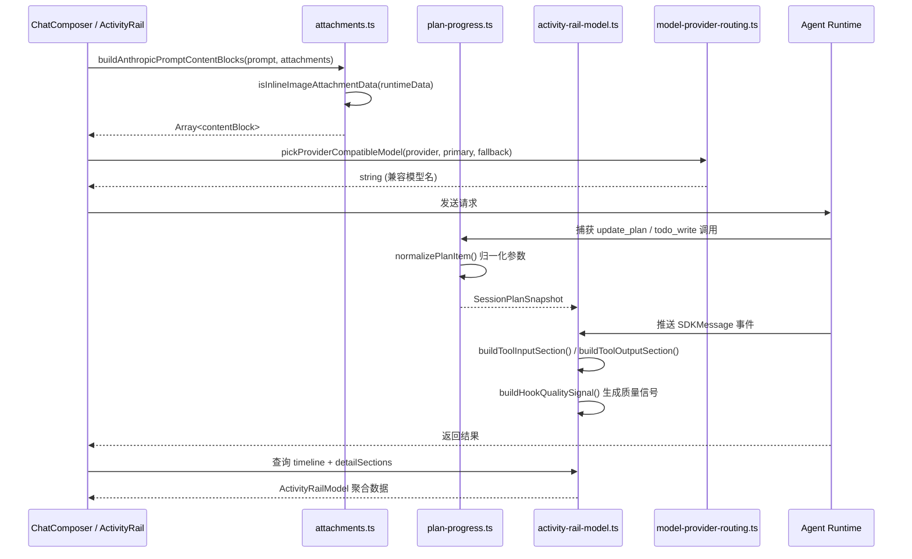

# 共享协议与类型总览

<cite>
**本文引用的文件**
- [src/shared/activity-rail-model.ts](file://src/shared/activity-rail-model.ts)
- [src/shared/attachments.ts](file://src/shared/attachments.ts)
- [src/shared/channel-config.ts](file://src/shared/channel-config.ts)
- [src/shared/codex-oauth.ts](file://src/shared/codex-oauth.ts)
- [src/shared/lark-channel.ts](file://src/shared/lark-channel.ts)
- [src/shared/lark-runtime-defaults.ts](file://src/shared/lark-runtime-defaults.ts)
- [src/shared/model-provider-routing.ts](file://src/shared/model-provider-routing.ts)
- [src/shared/plan-progress.ts](file://src/shared/plan-progress.ts)
- [src/electron/libs/git/README.md](file://src/electron/libs/git/README.md)
</cite>

## 目录

- [模块职责概览](#模块职责概览)
- [数据类型与状态模型](#数据类型与状态模型)
- [协议协作流程](#协议协作流程)
- [配置与扩展机制](#配置与扩展机制)
- [数据转换与工具函数](#数据转换与工具函数)
- [常见问题与排查](#常见问题与排查)
- [最佳实践与改造路径](#最佳实践与改造路径)

---

## 模块职责概览

`src/shared` 目录下的文件构成了整个项目的**共享协议层**，为执行平面、控制平面和数据平面提供统一的数据契约、类型定义和转换工具。这些模块在会话生命周期、模型路由、附件处理、活动轨迹记录等核心流程中被高频复用。

| 文件 | 核心职责 | 入口函数 |
|------|----------|----------|
| `activity-rail-model.ts` | 执行轨迹建模、Detail Section 构建、质量信号生成 | `buildToolInputSection`、`buildHookQualitySignal` |
| `attachments.ts` | 附件内容块构建、Base64/URL 数据处理、存储清理 | `buildAnthropicPromptContentBlocks`、`estimateAttachmentPromptChars` |
| `codex-oauth.ts` | Codex OAuth 模型列表生成与合并 | `mergeCodexModelIds`、`withCodexCompactModelSuffix` |
| `lark-runtime-defaults.ts` | 飞书 CLI 运行时默认值注入 | `ensureLarkCliRuntimeDefaults` |
| `model-provider-routing.ts` | 模型→提供商兼容性路由 | `isModelCompatibleWithApiProvider`、`pickProviderCompatibleModel` |
| `plan-progress.ts` | 计划工具参数归一化 | `normalizeUpdatePlanArgs`、`normalizeTodoWriteArgs` |
| `channel-config.ts` | 渠道聊天功能开关 | `isChannelChatEnabled` |
| `lark-channel.ts` | 空占位文件（飞书 IM 功能已移除） | — |

**章节来源**：`activity-rail-model.ts#L1-L99`、`attachments.ts#L1-L41`

---

## 数据类型与状态模型

### 活动轨迹模型 (ActivityRailModel)

这是整个共享协议层最核心的数据结构，聚合了会话执行期间的所有可观测信息：

```typescript
// 简化结构
ActivityRailModel {
  summary: {                    // 执行摘要
    statusLabel, statusTone,
    latestResultLabel, durationLabel,
    inputLabel, contextLabel, outputLabel,
    successCount, failureCount, alertCount,
    modelLabel, costLabel
  },
  filterCounts: { all, attention, context, tool, result, flow },
  timeline: [ActivityTimelineItem],     // 时间线节点
  planSteps: [ActivityPlanStep],        // 计划步骤
  executionSteps: [ActivityExecutionStep],
  taskSteps: [ActivityTaskStep],
  analysisCards: [ActivityAnalysisCard],
  contextSnapshot: { ... },            // 上下文快照
  contextDistribution: ContextDistributionModel,
  promptAnalysis: PromptAnalysisModel
}
```

**Timeline Item 的 nodeKind 枚举**（共 21 种）：

- `context` — 上下文读取
- `plan` — 计划生成
- `assistant_output` — Assistant 输出
- `tool_input` / `tool_output` — 工具调用
- `retrieval` — 检索
- `file_read` / `file_write` — 文件操作
- `terminal` — 终端命令
- `browser` — 浏览器操作
- `memory` — 记忆系统
- `mcp` — MCP 协议调用
- `handoff` — Agent 交接
- `evaluation` — 评估
- `error` — 错误
- `lifecycle` — 会话生命周期事件
- `permission` — 权限请求
- `hook` — Hook 触发
- `omitted` — 省略内容
- `agent_progress` — Agent 进度更新

每种 `nodeKind` 对应 UI 层的不同渲染策略和过滤行为。

**章节来源**：`activity-rail-model.ts#L105-L128`、`activity-rail-model.ts#L16-L35`

### 附件类型 (AttachmentLike)

```typescript
type AttachmentLike = {
  kind: "image" | "text";
  data: string;              // 原始数据（存储/预览用）
  runtimeData?: string;     // 运行时数据（仅用于 API 请求）
  mimeType: string;
  preview?: string;          // UI 预览
  name?: string;
  size?: number;
  storagePath?: string;
  storageUri?: string;
  summaryText?: string;      // 图片摘要（无 runtimeData 时降级使用）
};
```

**字段生命周期管理要点**：

- `runtimeData` **仅在构建 API 请求时使用**，不应作为 fallback 源，否则截图会污染上下文
- `storageUri` 用于持久化存储场景
- `preview` 保留用于 UI 展示

**章节来源**：`attachments.ts#L6-L17`、`attachments.ts#L132-L161`

### 计划进度状态 (PlanStepStatus)

```typescript
type PlanStepStatus = "pending" | "in_progress" | "completed";
type PlanItemArg = { step: string; status: PlanStepStatus };
type SessionPlanSource = "update_plan" | "todo_write";  // 两个来源
```

支持两种工具的参数归一化，保证渲染层使用统一的数据格式。

### 模型路由模式 (SharedApiProviderMode)

```typescript
type SharedApiProviderMode = "custom" | "deepseek" | "codex";
```

- `custom`：不限制模型名称
- `deepseek`：模型名需包含 "deepseek"（不区分大小写）
- `codex`：模型名需匹配 GPT-5 系列或包含 "codex" 标识

**章节来源**：`model-provider-routing.ts#L1-L50`、`plan-progress.ts#L1-L84`

---

## 协议协作流程

### 执行轨迹数据的生命周期

执行轨迹数据从用户输入开始，经过 Agent Runtime 处理，最终在 UI 层渲染为可读的时间线和 Detail Section：



### Detail Section 构建逻辑

`activity-rail-model.ts` 中的 `buildToolInputSection` 根据工具名称优先展示关键字段：

```typescript
// 工具名称 → 优先展示的字段
normalizedName === "toolsearch"
  ? ["query", "max_results"]
  : normalizedName === "bash"
    ? ["command", "description"]
    : ["file_path", "pattern", "old_string", "new_string", "replace_all"]
```

`buildToolOutputSection` 则尝试解析 JSON 返回值，识别 `tool_reference` 等特殊类型并生成摘要。

**图表来源**：`activity-rail-model.ts#L392-L468`

### 附件处理的优先级决策

`attachments.ts` 在构建 Anthropic Prompt Content Blocks 时遵循以下决策树：

```mermaid
flowchart TD
    A[attachment.kind === "image"] --> B{runtimeData 是有效 Base64 或 data URL?}
    B -->|是| C[直接使用 base64 构建 image block]
    B -->|否| D{存在 summaryText?}
    D -->|是| E[生成文本摘要 block]
    D -->|否| F[生成占位文本 block]
    
    A --> G[attachment.kind === "text"]
    G --> H{summaryText 或 data 非空?}
    H -->|是| I[生成带格式的文本 block]
    H -->|否| J[跳过此附件]
```

**关键约束**：图片附件的 `data` / `preview` 字段**不作为 fallback**，仅 `runtimeData` 用于 API 请求。这是为了防止截图等大文件污染模型上下文。

**章节来源**：`attachments.ts#L118-L191`

---

## 配置与扩展机制

### 飞书 CLI 运行时默认配置注入

`ensureLarkCliRuntimeDefaults` 是运行时配置增强的核心函数，处理 `agent-runtime.json` 格式的配置对象：

```typescript
export function ensureLarkCliRuntimeDefaults(input: Record<string, unknown>): Record<string, unknown>
// 返回值结构示例
{
  channels: {
    version: 1,
    items: {
      lark: {
        provider: "lark",
        enabled: true,
        transport: "lark-cli",
        cliCommand: "lark-cli",      // 可被 env[LARK_CLI_COMMAND_ENV] 覆盖
        cliProfile: "default",       // 可被 env[LARK_CLI_PROFILE_ENV] 覆盖
        ...
      }
    }
  },
  env: {
    LARK_CLI_COMMAND: "lark-cli",
    LARK_CLI_PROFILE: "default"
  },
  skillCredentials: {
    lark: { env: ["LARK_CLI_COMMAND", "LARK_CLI_PROFILE"] },
    feishu: { env: ["LARK_CLI_COMMAND", "LARK_CLI_PROFILE"] }
  },
  systemPromptExt: ["飞书/Lark 技能默认优先读取全局配置..."]
}
```

**优先级**：环境变量 > `channels.items.lark.*` > `DEFAULT_LARK_CHANNEL_CONFIG`

**章节来源**：`lark-runtime-defaults.ts#L83-L116`

### Codex OAuth 模型列表生成

`mergeCodexModelIds` 生成完整的模型列表，包含基础模型和 compact 后缀变体：

```typescript
export const CODEX_BASE_MODELS = [
  "gpt-5.5", "gpt-5.4", "gpt-5.4-mini",
  "gpt-5.3-codex", "gpt-5.3-codex-spark",
  "gpt-5.2", "gpt-5", "gpt-5-codex", "gpt-5-codex-mini",
  "gpt-5.1", "gpt-5.1-codex", "gpt-5.1-codex-max", "gpt-5.1-codex-mini",
  "gpt-5.2-codex",
] as const;

// 实际使用
const models = mergeCodexModelIds(["gpt-5.3-codex-spark", "custom-model"]);
// → ["custom-model", "custom-model-openai-compact",
//    "gpt-5.5", ..., "gpt-5.3-codex-spark", "gpt-5.3-codex-spark-openai-compact", ...]
```

**新增模型自动追加 suffix 变体**，无需手动维护两套 ID。

**章节来源**：`codex-oauth.ts#L1-L76`

### 渠道聊天功能开关

```typescript
isChannelChatEnabled(config: ChannelChatToggleConfig | null | undefined): boolean
// 返回 true 的条件：
// 1. config.enabled === true
// 2. config.chatEnabled !== false（未设置时默认启用）
```

**章节来源**：`channel-config.ts#L1-L9`

---

## 数据转换与工具函数

### 字符串与 JSON 处理

| 函数 | 职责 | 失败处理 |
|------|------|----------|
| `tryParseJson(text)` | 尝试解析 JSON | 返回 `null`，不抛异常 |
| `formatRawDetail(value)` | 格式化为带缩进的 JSON | 转为 `String(value)` |
| `toScalarDetailValue(value)` | 转为标量字符串 | 返回 `null`，跳过复杂对象 |
| `truncate(value, max?)` | 截断超长文本 | 默认 max=160 |

### Hook 输出解析

`parseHookOutput` 将 Hook 返回的 JSON 解析为结构化信号：

```typescript
parseHookOutput(rawOutput: string)
// 返回结构
{
  additionalContext?: string;
  reason?: string;
  decision?: string;
  permissionDecision?: string;
  hasUpdatedInput?: boolean;
}
```

这些字段用于 `buildHookQualitySignal` 生成质量信号，确定该事件在 UI 中的 tone（neutral/info/success/warning/error）和 attention 标记。

**章节来源**：`activity-rail-model.ts#L471-L497`

### 图片数据格式判断

```typescript
isInlineImageAttachmentData(data?: string): boolean
// 判断逻辑：
// 1. 是否为 data: URL 前缀
// 2. 是否为纯 Base64（不含空白符后仍匹配 /^[A-Za-z0-9+/=\s]+$/）

resolveImageAttachmentSrc(attachment): string
// 优先级：preview > runtimeData > data > storageUri
// 找到第一个有效数据后，若非 URL/Base64 则直接返回
```

### 计划参数归一化

`normalizePlanItem` 支持多种字段名作为步骤描述的来源：

```typescript
// 兼容字段顺序
const rawStep = input.step ?? input.content ?? input.text ?? input.title ?? input.name ?? `Step ${fallbackIndex + 1}`;

// 状态归一化（兼容多种表达）
normalizePlanStepStatus("inProgress")  // → "in_progress"
normalizePlanStepStatus("complete")    // → "completed"
normalizePlanStepStatus("done")        // → "completed"
```

**章节来源**：`plan-progress.ts#L35-L50`

---

## 常见问题与排查

### 附件未进入模型上下文

**症状**：模型回复表明"看不到"用户上传的附件。

**排查步骤**：

1. 检查 AttachmentLike 对象的 `runtimeData` 字段是否包含有效的 Base64 数据或 `data:` URL
2. 前端应使用 `resolveImageAttachmentSrc()` 获取可用数据
3. 确认 `buildAnthropicPromptContentBlocks` 的返回值中是否包含该附件的 content block

```typescript
// 验证示例
const blocks = buildAnthropicPromptContentBlocks(prompt, attachments);
const imageBlock = blocks.find(b => b.type === "image");
console.assert(imageBlock, "图片附件未能转换为 API block");
```

### 计划更新未在轨迹中显示

**症状**：用户执行了 `update_plan` 或 `todo_write`，但右侧轨迹面板没有更新。

**排查步骤**：

1. 确认 Agent Runtime 已捕获工具调用并通过 IPC 传递
2. 验证 `normalizeUpdatePlanArgs` 或 `normalizeTodoWriteArgs` 返回非 null
3. 检查前端的 planSteps 数组是否正确接收 SessionPlanSnapshot

```typescript
// 验证解析结果
const snapshot = normalizeUpdatePlanArgs(toolCallInput);
if (!snapshot) {
  console.warn("Plan args 解析失败，原始输入:", toolCallInput);
}
```

### 模型路由不匹配

**症状**：选择特定模型后，请求发送失败或被拒绝。

**排查步骤**：

1. 确定当前 provider 模式：`provider === "deepseek"` | `"codex"` | `"custom"`
2. 使用 `isModelCompatibleWithApiProvider(provider, modelName)` 验证兼容性
3. 检查 `pickProviderCompatibleModel` 的返回值是否为空字符串

```typescript
// Codex 模型名判断示例
isCodexModelName("gpt-5.3-codex-spark")      // → true
isCodexModelName("gpt-5.3-codex-spark-openai-compact") // → true（自动去除 suffix）
isCodexModelName("claude-sonnet-4-20250514") // → false
```

### 飞书 CLI 连接失败

**症状**：飞书消息发送/接收功能不可用。

**排查步骤**：

1. 确认环境变量 `LARK_APP_ID`、`LARK_APP_SECRET`、`LARK_TENANT_KEY` 在 `agent-runtime.json` 中已配置
2. 验证 lark-cli 在系统 PATH 中可用：`lark-cli --version`
3. 检查 profile 配置：`lark-cli config list`
4. 查看 `ensureLarkCliRuntimeDefaults` 输出确认配置合并正确

```typescript
// 调试配置合并
import { ensureLarkCliRuntimeDefaults } from "./lark-runtime-defaults";
const enhanced = ensureLarkCliRuntimeDefaults(rawConfig);
console.log("channels.items.lark:", enhanced.channels.items.lark);
console.log("env:", enhanced.env);
```

---

## 最佳实践与改造路径

### 扩展新的 Activity NodeKind

1. 在 `ActivityRailModel.ts` 的 `ActivityNodeKind` 类型中添加新枚举值
2. 更新 `DISTRIBUTION_ORDER` 数组以支持上下文分布统计
3. 在 UI 层添加对应的渲染逻辑和 filter 行为

```typescript
// activity-rail-model.ts
export type ActivityNodeKind =
  | "context" | "plan" | "assistant_output"
  // ... 现有类型
  | "new_node_type";  // 新增
```

### 添加新的模型提供商

1. 在 `model-provider-routing.ts` 中添加 `isNewProviderModelName` 函数
2. 在 `isModelCompatibleWithApiProvider` 中添加 provider 判断分支
3. 更新 `pickProviderCompatibleModel` 的 fallback 逻辑

### 处理多源计划数据

使用 `normalizePlanItem` 时注意兼容多种参数格式：

```typescript
// 支持的工具调用格式
{ plan: [{ step: "..." }] }                    // update_plan
{ todos: [{ content: "..." }] }                // todo_write (Notion 风格)
{ items: [{ title: "..." }] }                  // 变体
```

### 附件存储清理

`sanitizePromptAttachmentsForStorage` 在持久化前清理 runtimeData：

```typescript
sanitizePromptAttachmentsForStorage(attachments)
// → 图片附件的 data 替换为 storageUri
// → runtimeData 清除（节省存储空间）
// → preview 保留（本地预览仍可用）
```

### Git 工作台的协议边界

`src/electron/libs/git/README.md` 定义了 Git 模块的职责边界：

- **允许**：status / diff / stage / unstage / commit / push / branch / stash
- **禁止**：reset / rebase / cherry-pick / force push / amend / squash

Renderer 进程必须通过 IPC 调用主进程的 Git Service，不能直接执行 git 命令。

**章节来源**：`src/electron/libs/git/README.md#L1-L35`

---

## 相关文档

- [Activity Rail 规范](file://doc/40-engineering/activity-rail/spec.md)
- [聊天组合器规范](file://doc/40-engineering/chat-composer/spec.md)
- [会话与状态机规范](file://doc/20-specs/25-会话与状态机规范.md)
- [上下文同步与合并规范](file://doc/20-specs/23-上下文同步与合并规范.md)
- [Git 工作台 README](file://src/electron/libs/git/README.md)