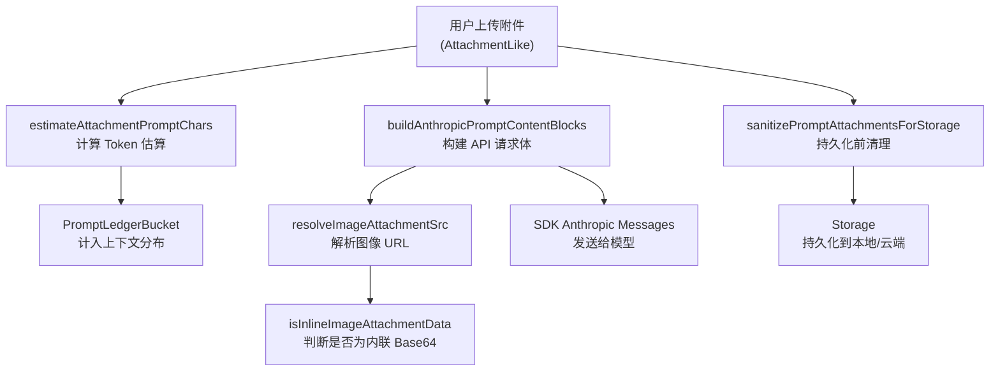

# 共享协议与类型总览

<cite>

**本文引用的文件**

- [src/shared/activity-rail-model.ts](file://src/shared/activity-rail-model.ts)
- [src/shared/attachments.ts](file://src/shared/attachments.ts)
- [src/shared/channel-config.ts](file://src/shared/channel-config.ts)
- [src/shared/codex-oauth.ts](file://src/shared/codex-oauth.ts)
- [src/shared/lark-channel.ts](file://src/shared/lark-channel.ts)
- [src/shared/lark-runtime-defaults.ts](file://src/shared/lark-runtime-defaults.ts)
- [src/shared/model-provider-routing.ts](file://src/shared/model-provider-routing.ts)
- [src/shared/plan-progress.ts](file://src/shared/plan-progress.ts)
- [src/electron/libs/git/README.md](file://src/electron/libs/git/README.md)

</cite>

## 目录

- [模块定位与职责边界](#模块定位与职责边界)
- [核心数据结构](#核心数据结构)
- [附件处理链路](#附件处理链路)
- [活动轨迹模型](#活动轨迹模型)
- [模型路由与提供商适配](#模型路由与提供商适配)
- [计划进度归一化](#计划进度归一化)
- [Lark 渠道配置](#lark-渠道配置)
- [扩展点与改造路径](#扩展点与改造路径)
- [验证命令与排障](#验证命令与排障)

---

## 模块定位与职责边界

`src/shared/` 是 tech-cc-hub 的共享类型与协议层，被前端 Renderer、主进程、Agent Runtime 多端共同依赖。该模块不包含业务逻辑，仅负责：

1. **类型契约**：定义跨模块通信的数据结构
2. **数据归一化**：将外部来源（SDK、用户输入、第三方 API）的数据转换为内部一致格式
3. **路由决策**：根据模型名称、渠道配置决定使用哪个 provider
4. **渲染准备**：将附件、提示词等转换为 UI 可消费的格式

这些文件通过 `index.ts` 统一导出，被 `ChatController`、`TaskController`、`SessionController` 等核心 Controller 引用。

[图表来源](file://src/shared/activity-rail-model.ts#L1-L80)

---

## 核心数据结构

### 1. ActivityRailModel — 活动轨迹根模型

```typescript
export type ActivityRailModel = {
  primarySectionTitle: "实时执行轨迹";
  summary: {
    statusLabel: string;
    statusTone: ActivityRailTone;
    latestResultLabel: string;
    durationLabel: string;
    inputLabel: string;
    contextLabel: string;
    outputLabel: string;
    successCount: number;
    failureCount: number;
    alertCount: number;
  };
  timeline: ActivityTimelineItem[];
  planSteps: ActivityPlanStep[];
  taskSteps: ActivityTaskStep[];
  contextSnapshot: { latestPrompt: string | null; latestAttachments: PromptAttachmentLike[]; ... };
  contextDistribution: ContextDistributionModel;
  promptAnalysis: PromptAnalysisModel;
};
```

**职责**：作为 Activity Rail UI 的唯一数据源，包含执行摘要、时间线、计划步骤、任务步骤、上下文快照、Token 分布分析。

**与附件的关联**：`contextSnapshot.latestAttachments` 引用 `PromptAttachmentLike`，由 `attachments.ts` 构建。

[章节来源](file://src/shared/activity-rail-model.ts#L212-L252)

### 2. PromptAttachmentLike — 附件类型

```typescript
export type PromptAttachmentLike = {
  id: string;
  kind: "image" | "text";
  name: string;
  mimeType: string;
  data: string;
  preview?: string;
  size?: number;
};
```

**职责**：统一表示用户上传的附件，支持图片和文本两类。

[章节来源](file://src/shared/attachments.ts#L71-L79)

### 3. SessionPlanSnapshot — 计划进度快照

```typescript
export type SessionPlanSnapshot = UpdatePlanArgs & {
  sessionId: string;
  turnId?: string;
  updatedAt: number;
  source: SessionPlanSource; // "update_plan" | "todo_write"
  toolName?: string;
  toolUseId?: string;
};
```

**职责**：记录 Agent 计划的单次更新快照，用于轨迹回放和状态同步。

[章节来源](file://src/shared/plan-progress.ts#L15-L22)

---

## 附件处理链路

### 调用链概览



### 关键函数说明

#### estimateAttachmentPromptChars

```typescript
export function estimateAttachmentPromptChars(attachment: AttachmentLike): number
```

计算单个附件在 Prompt 中占用的字符数，用于 Token 配额估算和上下文分布分析。

**参数**：
| 参数 | 类型 | 说明 |
|------|------|------|
| attachment | AttachmentLike | 附件对象 |

**行为**：
- 图片附件：返回 `文件名元信息 + summaryText` 或兜底文本的长度
- 文本附件：返回带格式包装的完整文本长度（超出 120KB 截断）

[章节来源](file://src/shared/attachments.ts#L43-L73)

#### buildAnthropicPromptContentBlocks

```typescript
export function buildAnthropicPromptContentBlocks(
  prompt: string,
  attachments: AttachmentLike[],
): Array<Record<string, unknown>>
```

将用户提示词和附件转换为 Anthropic API 的 `content` 数组格式。

**关键逻辑**：
1. 优先添加附件优先级上下文（告知模型优先读附件）
2. 图片附件：仅 `runtimeData`（运行时图像）允许进入 `base64` 块，`data`/`preview` 仅用于 UI 预览
3. 文本附件：提取 `summaryText` 或完整 `data`，截断至 120KB
4. 最后追加用户原始提示词

**失败模式**：若 `runtimeData` 为空但附件类型为图片，会回退到文本 summary，导致模型无法读取图像内容。

[章节来源](file://src/shared/attachments.ts#L118-L191)

#### sanitizePromptAttachmentsForStorage

```typescript
export function sanitizePromptAttachmentsForStorage<TAttachment extends AttachmentLike>(
  attachments?: TAttachment[]
): TAttachment[] | undefined
```

持久化前清理附件数据，将 Base64 data 替换为 `storageUri`，避免存储爆炸。

**行为**：
- 图片附件：`data` → `storageUri`，`preview` 保留原 data URL 以确保本地预览正常，`runtimeData` 置空
- 文本附件：保持原样

[章节来源](file://src/shared/attachments.ts#L193-L214)

---

## 活动轨迹模型

### ActivityTimelineItem 结构

```typescript
export type ActivityTimelineItem = {
  id: string;
  filterKey: Exclude<ActivityRailFilterKey, "all">;
  layer: ActivityRailLayer;  // "上下文" | "工具" | "结果" | "流程"
  tone: ActivityRailTone;     // "neutral" | "info" | "success" | "warning" | "error"
  nodeKind: ActivityNodeKind; // 18 种节点类型
  title: string;
  preview: string;
  detail: string;
  round: number;
  sequence: number;
  metrics: ActivityExecutionMetrics;
  detailSections: ActivityDetailSection[];
  taskStepIds: string[];
  stageKind: ActivityStageKind;
  provenance?: ActivityToolProvenance; // "local" | "mcp" | "sub_agent" | ...
};
```

**职责**：描述执行轨迹中的单个节点，包含度量数据（输入/输出 Token 数、执行时长）和详情分段展示。

### 工具详情构建

`buildToolInputSection` 和 `buildToolOutputSection` 是 UI 渲染的核心：

```typescript
// 构建工具输入详情
function buildToolInputSection(
  name: string,
  input: Record<string, unknown>,
  detail: string
): ActivityDetailSection

// 构建工具输出详情
function buildToolOutputSection(
  name: string,
  rawDetail: string,
  isError: boolean
): ActivityDetailSection
```

**Preferred Keys 逻辑**：
| 工具 | 优先展示字段 |
|------|-------------|
| ToolSearch | `query`, `max_results` |
| Bash | `command`, `description` |
| 文件操作 | `file_path`, `pattern`, `old_string`, `new_string` |

[章节来源](file://src/shared/activity-rail-model.ts#L411-L436)

### Hook 质量信号

`buildHookQualitySignal` 从 Hook 输出中提取质量信号：

```typescript
function buildHookQualitySignal(
  timelineId: string,
  hookEvent: string,
  outcome: string,
  parsed: { additionalContext?: string; reason?: string; ... },
  stdout: string,
  stderr: string,
): HookQualitySignal
```

**判断逻辑**：
- `hasParamFix`：检测参数修复关键词（参数、规范化、清理空白）
- `needsAttention`：`outcome === "error"` 或包含 `ask`、`d` 等用户交互关键词

[章节来源](file://src/shared/activity-rail-model.ts#L505-L548)

---

## 模型路由与提供商适配

### SharedApiProviderMode 类型

```typescript
export type SharedApiProviderMode = "custom" | "deepseek" | "codex";
```

### 路由决策流程

```mermaid
sequenceDiagram
    participant Caller
    participant Routing as model-provider-routing
    participant Codex as codex-oauth
    participant SDK

    Caller->>Routing: pickProviderCompatibleModel(provider, primary, fallback)

    alt provider === "codex"
        Routing->>Routing: isCodexModelName(primary)?
        alt 是 Codex 模型
            return primary
        else 不是
            Routing->>Routing: isCodexModelName(fallback)?
        end
    end

    alt provider === "deepseek"
        Routing->>Routing: isDeepSeekModelName(primary)?
    end

    alt 都不匹配
        return ""
    end
```

### isCodexModelName 正则匹配

```typescript
export function isCodexModelName(modelName: string): boolean {
  const normalized = stripCodexCompactSuffix(modelName).toLowerCase();
  return /^gpt-5(?:[.-]|$)/.test(normalized) || /(?:^|[._-])codex(?:[._-]|$)/.test(normalized);
}
```

**匹配示例**：
- `gpt-5.5` ✓
- `gpt-5.3-codex-spark` ✓
- `gpt-5.3-codex` ✓
- `gpt-4` ✗
- `claude-3-5-sonnet` ✗

### Codex 模型合并

`mergeCodexModelIds` 维护一个本地优先的模型列表：

```typescript
export const CODEX_OAUTH_MODELS = mergeCodexModelIds([]);
```

**合并逻辑**（[章节来源](file://src/shared/codex-oauth.ts#L63-L74)）：
1. 使用默认基座模型列表作为 fallback
2. 提取缓存中非基座的新模型
3. 按 `[新模型, 基座, 缓存]` 顺序合并
4. 为每个模型生成 `-openai-compact` 变体

---

## 计划进度归一化

### 归一化入口

`plan-progress.ts` 提供两个归一化函数，处理不同的 SDK 工具输出：

```typescript
// 处理 update_plan 工具输出
export function normalizeUpdatePlanArgs(input: unknown): UpdatePlanArgs | null

// 处理 todo_write 工具输出
export function normalizeTodoWriteArgs(input: unknown): UpdatePlanArgs | null
```

### normalizePlanStepStatus 状态映射

```typescript
export function normalizePlanStepStatus(value: unknown): PlanStepStatus | null
```

| 输入 | 输出 |
|------|------|
| `"pending"` | `"pending"` |
| `"in_progress"` / `"inProgress"` | `"in_progress"` |
| `"completed"` / `"complete"` / `"done"` | `"completed"` |
| 其他 | `null` |

### normalizePlanItem 字段兼容

支持从多种字段名读取 step 内容：

```typescript
const rawStep = input.step ?? input.content ?? input.text ?? input.title ?? input.name;
```

确保无论 SDK 输出格式如何变化，都能正确提取。

[章节来源](file://src/shared/plan-progress.ts#L35-L49)

---

## Lark 渠道配置

### 运行时默认配置

`lark-runtime-defaults.ts` 的核心函数 `ensureLarkCliRuntimeDefaults` 在 Agent Runtime 启动时注入飞书配置：

```typescript
export function ensureLarkCliRuntimeDefaults(input: Record<string, unknown>): Record<string, unknown>
```

**注入内容**：
| 字段 | 来源 |
|------|------|
| `channels.items.lark` | 默认配置 + 运行时覆盖 |
| `env.LARK_CLI_COMMAND` | 环境变量或 `cliCommand` |
| `env.LARK_CLI_PROFILE` | 环境变量或 `cliProfile` |
| `skillCredentials.lark` | 合并 `LARK_CLI_COMMAND` / `LARK_CLI_PROFILE` |
| `systemPromptExt` | 追加飞书技能说明 |

### 默认配置值

```typescript
export const DEFAULT_LARK_CHANNEL_CONFIG = {
  provider: "lark",
  enabled: true,
  transport: "lark-cli",
  displayName: "飞书 / Lark",
  appIdEnv: "LARK_APP_ID",
  appSecretEnv: "LARK_APP_SECRET",
  tenantKeyEnv: "LARK_TENANT_KEY",
  cliCommand: "lark-cli",
  cliProfile: "default",
  cliSendArgsTemplate: "event send --profile {{profile}} --type message --content \"{{text}}\"",
  cliReceiveArgsTemplate: "event receive --profile {{profile}}",
};
```

[章节来源](file://src/shared/lark-runtime-defaults.ts#L13-L26)

### Lark Channel 占位文件

`lark-channel.ts` 仅为避免 import 断裂保留的空文件：

```typescript
// lark-cli IM 功能已移除，飞书 IM 接入请使用飞书开放平台应用。
export {};
```

实际飞书 IM 功能已迁移至飞书开放平台应用，此文件不再承担业务逻辑。

[章节来源](file://src/shared/lark-channel.ts#L1-L3)

---

## 扩展点与改造路径

### 1. 新增 ActivityNodeKind

**路径**：修改 `ActivityNodeKind` 枚举 → 更新 `buildToolInputSection` 的 preferredKeys → 确保 UI filter 正确路由

**示例**：新增 `"websearch"` 节点类型
```typescript
export type ActivityNodeKind =
  | "context" | "plan" | "assistant_output"
  // ... existing
  | "websearch";  // 新增
```

### 2. 新增模型提供商

**路径**：在 `model-provider-routing.ts` 中添加 `isXxxModelName` 函数 → 更新 `isModelCompatibleWithApiProvider` → 修改 `SharedApiProviderMode` 类型

**示例**：新增 DeepSeek 适配
```typescript
export function isDeepSeekModelName(modelName: string): boolean {
  return modelName.trim().toLowerCase().includes("deepseek");
}
```

### 3. 扩展附件类型

**路径**：修改 `AttachmentLike` 类型 → 更新 `buildAnthropicPromptContentBlocks` 处理逻辑 → 更新 `sanitizePromptAttachmentsForStorage` 存储逻辑

**注意**：图片附件的 `runtimeData` 仅允许运行时 Base64，不应回退到 `data` 字段，否则可能导致上下文爆炸。

### 4. 归一化新工具输出

**路径**：在 `plan-progress.ts` 添加 `normalizeXxxArgs` 函数 → 更新 `SessionPlanSource` 类型 → 在 Consumer 侧添加 source 判断

---

## 验证命令与排障

### 类型检查

```bash
# 验证 shared 模块类型正确性
cd src/shared
npx tsc --noEmit --skipLibCheck

# 验证特定文件
npx tsc --noEmit src/shared/activity-rail-model.ts
```

### 单元测试验证

```bash
# 运行 attachments 相关测试
npm test -- --grep "buildAnthropicPromptContentBlocks"

# 运行模型路由测试
npm test -- --grep "pickProviderCompatibleModel"
```

### 常见失败模式与排查

| 症状 | 可能原因 | 排查方式 |
|------|----------|----------|
| 模型不匹配 | `isCodexModelName` 正则未覆盖新模型 | 检查 `CODEX_BASE_MODELS` 列表 |
| 附件图片未显示 | `runtimeData` 为空，`data` 被误用 | 确认 SDK 正确传递 `runtimeData` |
| 计划状态不更新 | `normalizePlanStepStatus` 未匹配新状态值 | 打印原始 `status` 值对比 |
| 飞书消息发送失败 | `LARK_CLI_PROFILE` 未正确注入 | 检查 `agent-runtime.json` 的 `env` 配置 |
| Prompt Token 超限 | 附件未正确截断 | 调用 `estimateAttachmentPromptChars` 验证 |

### 调试技巧

**附件数据流向追踪**：

```typescript
// 在 buildAnthropicPromptContentBlocks 前打印
console.log("Attachments before build:", JSON.stringify(attachments, null, 2));

const blocks = buildAnthropicPromptContentBlocks(prompt, attachments);

// 验证 Base64 数据存在
const imageBlock = blocks.find(b => b.type === "image");
console.log("Image block source:", imageBlock?.source);
```

**模型路由调试**：

```typescript
// 测试模型匹配
const testModels = ["gpt-5.5", "gpt-4", "deepseek-chat", "claude-3"];
testModels.forEach(m => {
  console.log(`${m}: codex=${isCodexModelName(m)}, deepseek=${isDeepSeekModelName(m)}`);
});
```

---

## 总结

`src/shared/` 通过以下协作模式支撑整个应用：

1. **类型契约层**：`activity-rail-model.ts` 定义 UI 数据结构，`attachments.ts` 定义附件契约
2. **数据归一化层**：`plan-progress.ts` 归一化多源数据，`codex-oauth.ts` 归一化模型列表
3. **路由决策层**：`model-provider-routing.ts` 根据 provider 选择模型
4. **渠道配置层**：`lark-runtime-defaults.ts` 注入飞书运行时配置

这些模块通过明确的输入/输出类型契约解耦，允许前端渲染、后端运行时、Agent SDK 独立演进而不破坏兼容性。