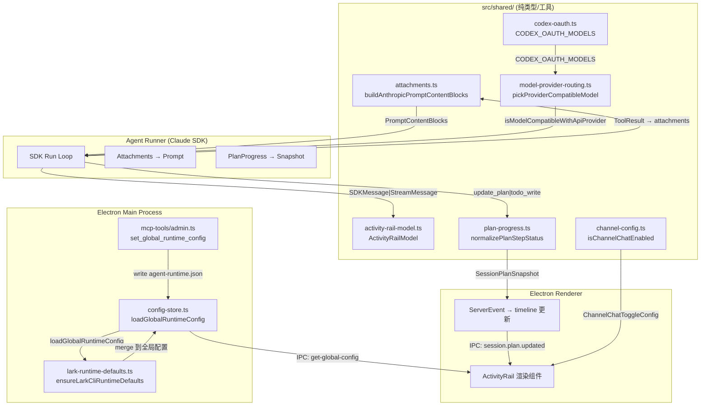
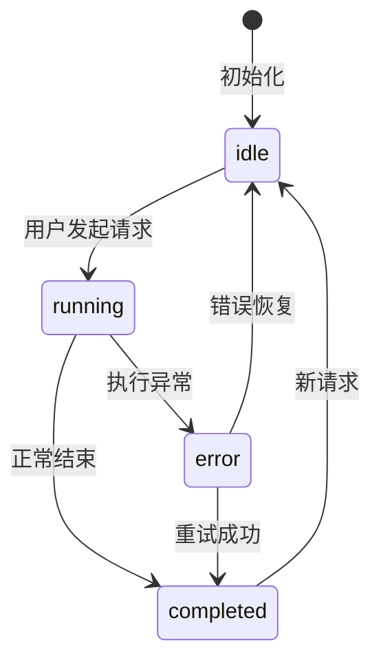
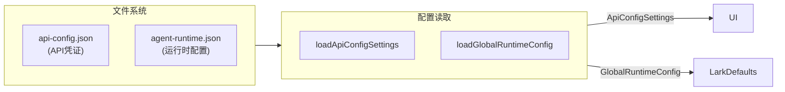

# 共享协议与类型总览

<cite>
**本文引用的文件**
- [src/shared/activity-rail-model.ts](file://src/shared/activity-rail-model.ts)
- [src/shared/attachments.ts](file://src/shared/attachments.ts)
- [src/shared/channel-config.ts](file://src/shared/channel-config.ts)
- [src/shared/codex-oauth.ts](file://src/shared/codex-oauth.ts)
- [src/shared/lark-channel.ts](file://src/shared/lark-channel.ts)
- [src/shared/lark-runtime-defaults.ts](file://src/shared/lark-runtime-defaults.ts)
- [src/shared/model-provider-routing.ts](file://src/shared/model-provider-routing.ts)
- [src/shared/plan-progress.ts](file://src/shared/plan-progress.ts)
- [src/electron/libs/mcp-tools/admin.ts](file://src/electron/libs/mcp-tools/admin.ts)
- [src/electron/libs/task/providers/lark-provider.ts](file://src/electron/libs/task/providers/lark-provider.ts)
- [src/electron/types.ts](file://src/electron/types.ts)
- [scripts/codex-oauth-setup.mjs](file://scripts/codex-oauth-setup.mjs)
- [types.d.ts](file://types.d.ts)
- [src/electron/libs/config-store.ts](file://src/electron/libs/config-store.ts)
</cite>

## 目录

- [1. 模块职责定位](#1-模块职责定位)
- [2. 核心数据结构](#2-核心数据结构)
- [3. 调用链路与数据流](#3-调用链路与数据流)
- [4. 入口文件与关键符号](#4-入口文件与关键符号)
- [5. 状态机与生命周期](#5-状态机与生命周期)
- [6. 配置持久化边界](#6-配置持久化边界)
- [7. 扩展点与常见改造路径](#7-扩展点与常见改造路径)
- [8. 失败模式与排障指南](#8-失败模式与排障指南)
- [9. Agent 改代码地图](#9-agent-改代码地图)

---

## 1. 模块职责定位

本模块 (`src/shared/`) 定义了 tech-cc-hub 运行时的**共享协议与类型**，涵盖以下职责边界：

| 模块文件 | 职责 | 运行时上下文 |
|---------|------|-------------|
| `activity-rail-model.ts` | 结构化渲染执行轨迹的 UI 模型（时间线、步骤卡片、分析洞察） | Electron 主进程 → Renderer IPC |
| `attachments.ts` | 处理用户上传的附件（图片/文本），负责上下文注入和 Anthropic 协议转换 | Agent Runner 调用 |
| `channel-config.ts` | 定义渠道聊天的启用开关 | 全局配置读取 |
| `codex-oauth.ts` | 管理 Codex OAuth 模型列表和后缀规范化 | 设置面板 / 初始化 |
| `lark-channel.ts` | **已废弃占位文件**，飞书 IM 功能已移除 | 历史兼容 |
| `lark-runtime-defaults.ts` | 注入 Lark CLI 运行时默认值和环境变量 | 启动时合并到 `agent-runtime.json` |
| `model-provider-routing.ts` | 根据 API Provider 模式（custom/deepseek/codex）路由模型 | Agent 决策点 |
| `plan-progress.ts` | 规范化会话计划更新（`update_plan` / `todo_write`）为统一快照 | 会话状态同步 |

> **章节来源**: [src/shared/activity-rail-model.ts#L9-L69](file://src/shared/activity-rail-model.ts#L9-L69) — 类型定义域

---

## 2. 核心数据结构

### 2.1 ActivityTimelineItem（执行轨迹节点）

```typescript
// src/shared/activity-rail-model.ts#L105-L128
export type ActivityTimelineItem = {
  id: string;
  filterKey: Exclude<ActivityRailFilterKey, "all">;
  layer: ActivityRailLayer;           // "上下文" | "工具" | "结果" | "流程"
  tone: ActivityRailTone;            // "neutral" | "info" | "success" | "warning" | "error"
  nodeKind: ActivityNodeKind;        // 26种节点类型：context, plan, tool_input, ...
  nodeSubtype?: string;
  title: string;
  preview: string;
  detail: string;
  round: number;
  sequence: number;
  statusLabel?: string;
  chips: string[];
  attention: boolean;               // 是否需要用户关注
  toolName?: string;
  provenance?: ActivityToolProvenance;  // "local" | "mcp" | "sub_agent" | "a2a"
  taskStepIds: string[];
  stageKind: ActivityStageKind;      // "inspect" | "implement" | "verify" | "deliver"
  metrics: ActivityExecutionMetrics;
  detailSections: ActivityDetailSection[];
  parentTaskId?: string;
  agentDescription?: string;
};
```

**设计意图**：这个结构是 UI 渲染 Activity Rail 的唯一数据源。`layer` 控制分组，`attention` 控制高亮，`provenance` 标识工具来源（本地 vs MCP）。

### 2.2 AttachmentLike（附件类型）

```typescript
// src/shared/attachments.ts#L6-L17
export type AttachmentLike = {
  kind: "image" | "text";
  data: string;
  runtimeData?: string;     // 仅允许流向 Agent 的 base64 payload
  mimeType: string;
  preview?: string;         // UI 预览字段
  name?: string;
  size?: number;
  storagePath?: string;
  storageUri?: string;      // 存储 URI，sanitize 时写入 data 字段
  summaryText?: string;    // 图片摘要，fallback 方案
};
```

**关键约束**：`runtimeData` 是唯一允许流向 Agent 的图片数据。UI 的 `data`/`preview` 字段在 `sanitizePromptAttachmentsForStorage` 时会被替换为 `storageUri`，避免 base64 爆炸。

> **章节来源**: [src/shared/attachments.ts#L193-L214](file://src/shared/attachments.ts#L193-L214) — sanitize 逻辑

### 2.3 SessionPlanSnapshot（会话计划快照）

```typescript
// src/shared/plan-progress.ts#L15-L22
export type SessionPlanSnapshot = UpdatePlanArgs & {
  sessionId: string;
  turnId?: string;
  updatedAt: number;
  source: SessionPlanSource;  // "update_plan" | "todo_write"
  toolName?: string;
  toolUseId?: string;
};

export type UpdatePlanArgs = {
  explanation?: string;
  plan: PlanItemArg[];        // [{ step, status }]
};

export type PlanStepStatus = "pending" | "in_progress" | "completed";
```

**归一化策略**：`normalizeUpdatePlanArgs` 和 `normalizeTodoWriteArgs` 将两种工具输出统一为 `UpdatePlanArgs`，支持 `step`/`content`/`text`/`title`/`name` 作为步骤名输入。

### 2.4 GlobalRuntimeConfig（全局运行时配置）

```typescript
// src/electron/libs/config-store.ts#L48
export type GlobalRuntimeConfig = Record<string, unknown>;
```

实际结构由 `ensureLarkCliRuntimeDefaults` 规范化后注入：

```typescript
// src/shared/lark-runtime-defaults.ts#L13-L26
export const DEFAULT_LARK_CHANNEL_CONFIG = {
  provider: "lark",
  enabled: true,
  transport: "lark-cli",
  displayName: "飞书 / Lark",
  appIdEnv: "LARK_APP_ID",
  appSecretEnv: "LARK_APP_SECRET",
  tenantKeyEnv: "LARK_TENANT_KEY",
  cliCommand: "lark-cli",
  cliProfile: "default",
  cliSendArgsTemplate: "event send --profile {{profile}} --type message --content \"{{text}}\"",
  cliReceiveArgsTemplate: "event receive --profile {{profile}}",
  notes: "",
} as const;
```

> **章节来源**: [src/shared/lark-runtime-defaults.ts#L83-L116](file://src/shared/lark-runtime-defaults.ts#L83-L116) — ensureLarkCliRuntimeDefaults

---

## 3. 调用链路与数据流

### 3.1 完整调用链关系图



### 3.2 关键 IPC Channel（前后端桥接点）

```typescript
// src/electron/types.ts#L183-L214
export type ServerEvent =
  | { type: "stream.message"; payload: { sessionId: string; message: StreamMessage } }
  | { type: "session.plan.updated"; payload: SessionPlanSnapshot }        // ← 计划更新
  | { type: "session.status"; payload: { sessionId: string; status: SessionStatus } }
  | { type: "task.list"; payload: { tasks: Array<Record<string, unknown>> } }
  // ... 更多 task.* 事件
```

**Source-of-Truth 原则**：
- **会话状态**：`ServerEvent.session.status` 是 UI 渲染的唯一真相
- **计划快照**：`ServerEvent.session.plan.updated` 仅当工具返回 `update_plan` / `todo_write` 时触发
- **Activity Timeline**：`ServerEvent.stream.message` 累积构建，`ActivityRailModel` 在 Renderer 端派生

> **图表来源**: 调用链基于 [src/electron/types.ts#L183-L214](file://src/electron/types.ts#L183-L214) + [src/shared/activity-rail-model.ts#L212-L252](file://src/shared/activity-rail-model.ts#L212-L252)

---

## 4. 入口文件与关键符号

### 4.1 入口符号速查表

| 文件 | 导出的关键符号 | 调用场景 |
|------|--------------|---------|
| `activity-rail-model.ts` | `ActivityRailTone`, `ActivityRailLayer`, `ActivityNodeKind`, `ActivityExecutionMetrics`, `buildToolInputSection`, `buildToolOutputSection`, `parseHookOutput` | UI 渲染时间线卡片 |
| `attachments.ts` | `TEXT_ATTACHMENT_PROMPT_CHAR_LIMIT` (120k), `buildAnthropicPromptContentBlocks`, `isInlineImageAttachmentData`, `sanitizePromptAttachmentsForStorage` | Agent 输入构建 |
| `channel-config.ts` | `isChannelChatEnabled` | 检查渠道是否启用 |
| `codex-oauth.ts` | `CODEX_OAUTH_MODELS`, `withCodexCompactModelSuffix`, `mergeCodexModelIds` | Codex 模型列表初始化 |
| `lark-runtime-defaults.ts` | `LARK_CLI_SYSTEM_PROMPT_EXT`, `DEFAULT_LARK_CHANNEL_CONFIG`, `ensureLarkCliRuntimeDefaults` | 飞书配置注入 |
| `model-provider-routing.ts` | `SharedApiProviderMode`, `isCodexModelName`, `isDeepSeekModelName`, `pickProviderCompatibleModel` | 模型兼容性决策 |
| `plan-progress.ts` | `SessionPlanSnapshot`, `normalizePlanStepStatus`, `normalizeUpdatePlanArgs`, `normalizeTodoWriteArgs` | 计划状态同步 |
| `mcp-tools/admin.ts` | `ADMIN_TOOL_NAMES = ["set_global_runtime_config"]`, `getAdminMcpServer` | AI 修改配置的唯一 MCP 工具 |
| `config-store.ts` | `loadGlobalRuntimeConfig`, `saveGlobalRuntimeConfig`, `loadApiConfigSettings` | 持久化读取/写入 |

### 4.2 MCP 工具入口

```typescript
// src/electron/libs/mcp-tools/admin.ts#L528-L572
export function getAdminMcpServer(): McpSdkServerConfigWithInstance {
  // 返回 ADMIN_TOOL_NAMES = ["set_global_runtime_config"]
  // 该工具的输入由 normalizePatch 处理，过滤非法 key
}
```

**运行时信号**：`set_global_runtime_config` 是 AI 修改全局配置的唯一入口。配置路径为 `$APPDATA/tech-cc-hub/agent-runtime.json`。

> **章节来源**: [src/electron/libs/mcp-tools/admin.ts#L14](file://src/electron/libs/mcp-tools/admin.ts#L14) — ADMIN_TOOL_NAMES

---

## 5. 状态机与生命周期

### 5.1 会话状态机



**状态定义**（来源：`src/electron/types.ts#L90`）：
```typescript
export type SessionStatus = "idle" | "running" | "completed" | "error";
```

### 5.2 计划步骤状态归一化

```typescript
// src/shared/plan-progress.ts#L28-L33
export function normalizePlanStepStatus(value: unknown): PlanStepStatus | null {
  if (value === "pending") return "pending";
  if (value === "in_progress" || value === "inProgress") return "in_progress";
  if (value === "completed" || value === "complete" || value === "done") return "completed";
  return null;
}
```

**兼容性处理**：支持 SDK 原生状态值（`inProgress`/`complete`/`done`）与内部枚举的双向兼容。

### 5.3 ActivityNodeKind 完整枚举

```typescript
// src/shared/activity-rail-model.ts#L16-L35
export type ActivityNodeKind =
  | "context"        // 上下文检索
  | "plan"           // 规划输出
  | "assistant_output" // 助手回复
  | "tool_input"     // 工具调用输入
  | "retrieval"      // 知识库检索
  | "file_read"
  | "file_write"
  | "terminal"
  | "browser"
  | "memory"
  | "mcp"            // MCP 工具
  | "sub_agent"
  | "a2a"
  | "handoff"
  | "evaluation"
  | "error"
  | "lifecycle"
  | "permission"
  | "hook"
  | "omitted"
  | "agent_progress";
```

> **章节来源**: [src/shared/activity-rail-model.ts#L16-L35](file://src/shared/activity-rail-model.ts#L16-L35)

---

## 6. 配置持久化边界

### 6.1 两层配置架构



**文件路径**：
- `api-config.json`：跨平台，Windows: `$APPDATA/tech-cc-hub/`，macOS: `~/Library/Application Support/tech-cc-hub/`
- `agent-runtime.json`：同目录

> **章节来源**: [src/electron/libs/config-store.ts#L61-L68](file://src/electron/libs/config-store.ts#L61-L68)

### 6.2 飞书配置注入流程

```typescript
// src/shared/lark-runtime-defaults.ts#L83-L116
export function ensureLarkCliRuntimeDefaults(input: Record<string, unknown>): Record<string, unknown> {
  // 1. 合并 channels.items.lark 到 DEFAULT_LARK_CHANNEL_CONFIG
  // 2. 注入 LARK_CLI_COMMAND / LARK_CLI_PROFILE 环境变量
  // 3. 合并 skillCredentials.lark / feishu
  // 4. 追加 LARK_CLI_SYSTEM_PROMPT_EXT 到 systemPromptExt
}
```

**调用时机**：在 Electron 主进程启动时，读取 `agent-runtime.json` 后立即调用。

---

## 7. 扩展点与常见改造路径

### 7.1 新增 ActivityNodeKind

1. 在 `src/shared/activity-rail-model.ts#L16` 添加枚举值
2. 在 UI 渲染层添加对应 `layer` 映射
3. 确保 `buildToolInputSection` / `buildToolOutputSection` 支持新节点

### 7.2 新增 API Provider

```typescript
// src/shared/model-provider-routing.ts#L3
export type SharedApiProviderMode = "custom" | "deepseek" | "codex";
```

**改造步骤**：
1. 添加 `"newprovider"` 到 `SharedApiProviderMode`
2. 实现 `isNewProviderModelName` 函数
3. 在 `isModelCompatibleWithApiProvider` 添加判断分支

### 7.3 新增 Admin MCP 工具

```typescript
// src/electron/libs/mcp-tools/admin.ts#L14
export const ADMIN_TOOL_NAMES = ["set_global_runtime_config"] as const;
// 扩展为: ["set_global_runtime_config", "new_tool"] as const
```

**约束**：必须通过 `normalizePatch` 过滤非法 key，避免 AI 写入敏感字段（`ANTHROPIC_*` 开头）。

### 7.4 新增 Channel Provider

```typescript
// src/electron/libs/mcp-tools/admin.ts#L29
const CHANNEL_PROVIDER_IDS = ["telegram", "lark", "wechat"] as const;
// 扩展 CHANNEL_PROVIDER_IDS
```

---

## 8. 失败模式与排障指南

### 8.1 常见失败场景

| 场景 | 错误信号 | 根因定位 |
|------|---------|---------|
| 飞书任务同步失败 | `lark-cli 调用失败` | 检查 `lark-cli auth login --domain task` 是否完成授权 |
| 配置写入失败 | `[config-store] Failed to save` | 检查 `agent-runtime.json` 文件权限 |
| 模型不兼容 | `isModelCompatibleWithApiProvider` 返回 false | 确认模型名符合 provider 模式 |
| 计划状态不更新 | `session.plan.updated` 未触发 | 检查工具名是否为 `update_plan` 或 `todo_write` |
| 附件未注入 | Agent 看不到图片 | 确认 `runtimeData` 存在且 `isInlineImageAttachmentData` 返回 true |
| Lark 配置未生效 | `LARK_CLI_COMMAND` 为空 | 检查 `ensureLarkCliRuntimeDefaults` 是否在启动时调用 |

### 8.2 排障验证命令

```bash
# 验证 API 配置可读性
node -e "
const { loadApiConfigSettings } = require('./dist/electron/libs/config-store.js');
console.log(JSON.stringify(loadApiConfigSettings(), null, 2));
"

# 验证全局配置可读性
node -e "
const { loadGlobalRuntimeConfig } = require('./dist/electron/libs/config-store.js');
console.log(JSON.stringify(loadGlobalRuntimeConfig(), null, 2));
"

# 验证 Codex 模型列表
node -e "
import { CODEX_OAUTH_MODELS } from './dist/shared/codex-oauth.js';
console.log(CODEX_OAUTH_MODELS);
"

# 验证模型路由
node -e "
import { isCodexModelName, isDeepSeekModelName } from './dist/shared/model-provider-routing.js';
console.log('gpt-5.5:', isCodexModelName('gpt-5.5'));
console.log('deepseek-chat:', isDeepSeekModelName('deepseek-chat'));
"
```

### 8.3 日志关键词

- `[config-store]`：配置读写错误
- `[task-provider:lark]`：Lark 任务同步错误
- `[admin-mcp]`：MCP 工具执行错误

> **章节来源**: [src/electron/libs/task/providers/lark-provider.ts#L220](file://src/electron/libs/task/providers/lark-provider.ts#L220) — 错误日志位置

---

## 9. Agent 改代码地图

### 9.1 改造前必读文件

| 优先级 | 文件 | 理由 |
|-------|------|-----|
| 🔴 必须 | `src/shared/activity-rail-model.ts` | Activity Timeline 数据模型定义 |
| 🔴 必须 | `src/electron/libs/mcp-tools/admin.ts` | 配置写入的唯一 MCP 工具 |
| 🔴 必须 | `src/electron/libs/config-store.ts` | 持久化层 |
| 🟡 重要 | `src/shared/attachments.ts` | 附件处理逻辑 |
| 🟡 重要 | `src/shared/model-provider-routing.ts` | 模型路由决策 |
| 🟡 重要 | `src/shared/plan-progress.ts` | 计划状态归一化 |
| 🟢 参考 | `src/electron/types.ts` | Electron 侧 IPC 类型 |

### 9.2 关键符号速查

| 符号 | 文件:行号 | 用途 |
|------|---------|-----|
| `ActivityRailTone` | activity-rail-model.ts#L9 | 时间线卡片语气 |
| `ActivityRailLayer` | activity-rail-model.ts#L10 | 时间线分组 |
| `ActivityNodeKind` | activity-rail-model.ts#L16 | 节点类型枚举 |
| `ADMIN_TOOL_NAMES` | mcp-tools/admin.ts#L14 | AI 可调用的管理工具列表 |
| `set_global_runtime_config` | mcp-tools/admin.ts#L14 | 配置写入 MCP 工具名 |
| `ensureLarkCliRuntimeDefaults` | lark-runtime-defaults.ts#L83 | 飞书配置注入函数 |
| `pickProviderCompatibleModel` | model-provider-routing.ts#L34 | 模型兼容性决策 |
| `normalizePlanStepStatus` | plan-progress.ts#L28 | 计划状态归一化 |
| `buildAnthropicPromptContentBlocks` | attachments.ts#L118 | Anthropic 协议构建 |
| `sanitizePromptAttachmentsForStorage` | attachments.ts#L193 | 附件存储清理 |

### 9.3 修改入口点

#### 9.3.1 修改 Activity Timeline 渲染逻辑

```
1. 定位: src/shared/activity-rail-model.ts
2. 找到 buildDetailRows / buildToolInputSection / buildToolOutputSection
3. 修改 preferredKeys 或新增 section 逻辑
4. 验证: 运行会话，观察 Activity Rail 是否正确渲染
```

#### 9.3.2 修改配置写入逻辑

```
1. 定位: src/electron/libs/mcp-tools/admin.ts#L195
2. 修改 normalizePatch 函数中的 key 白名单
3. 注意 MAX_* 常量限制（MAX_ENV_KEY_LENGTH=128 等）
4. 验证: 调用 set_global_runtime_config，检查 agent-runtime.json
```

#### 9.3.3 新增模型 Provider

```
1. 定位: src/shared/model-provider-routing.ts#L3
2. 添加 "newprovider" 到 SharedApiProviderMode
3. 实现 isNewProviderModelName
4. 验证: 切换 Provider 模式，测试模型选择
```

### 9.4 验证命令

```bash
# TypeScript 类型检查
npx tsc --noEmit src/shared/activity-rail-model.ts
npx tsc --noEmit src/shared/attachments.ts

# 运行相关单元测试（如果有）
npm test -- --grep "activity-rail\|attachment\|plan-progress"

# E2E 验证
# 1. 启动 Electron App
# 2. 发起一个带附件的请求
# 3. 观察 Activity Rail 是否显示 attachment 节点
```

### 9.5 常见回归风险

| 风险点 | 描述 | 防护措施 |
|-------|------|---------|
| 附件 base64 泄露 | `runtimeData` 被写入持久化存储 | 确保 `sanitizePromptAttachmentsForStorage` 移除 `runtimeData` |
| 配置覆盖丢失 | `ensureLarkCliRuntimeDefaults` 未调用 | 确认主进程启动链路 |
| 计划状态不一致 | SDK 状态值未归一化 | `normalizePlanStepStatus` 需要覆盖所有已知变体 |
| MCP 工具误写 | AI 写入 `ANTHROPIC_*` 环境变量 | `isAllowedEnvKey` 必须拒绝以 `ANTHROPIC_` 开头的 key |

### 9.6 测试入口

- **单元测试**：每个 shared 模块应独立可测
- **集成测试**：`src/electron/` 下有 `__tests__` 目录
- **E2E 测试**：使用 Playwright 模拟完整会话流程

> **章节来源**: Agent 改代码地图基于代码证据地图的符号分析