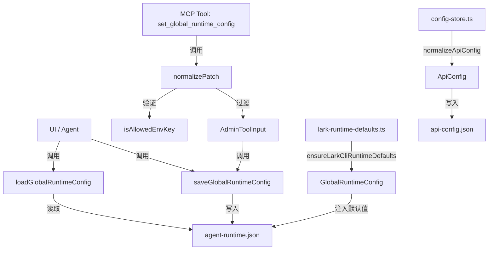
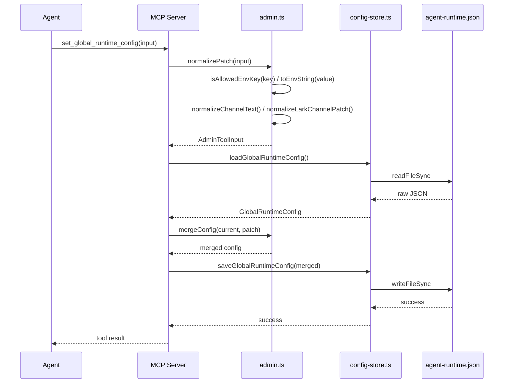

# 共享协议与类型总览

<cite>
**本文引用的文件**

- [src/shared/activity-rail-model.ts](file://src/shared/activity-rail-model.ts)
- [src/shared/attachments.ts](file://src/shared/attachments.ts)
- [src/shared/channel-config.ts](file://src/shared/channel-config.ts)
- [src/shared/codex-oauth.ts](file://src/shared/codex-oauth.ts)
- [src/shared/lark-channel.ts](file://src/shared/lark-channel.ts)
- [src/shared/lark-runtime-defaults.ts](file://src/shared/lark-runtime-defaults.ts)
- [src/shared/model-provider-routing.ts](file://src/shared/model-provider-routing.ts)
- [src/shared/plan-progress.ts](file://src/shared/plan-progress.ts)
- [src/electron/libs/mcp-tools/admin.ts](file://src/electron/libs/mcp-tools/admin.ts)
- [src/electron/libs/task/providers/lark-provider.ts](file://src/electron/libs/task/providers/lark-provider.ts)
- [src/electron/types.ts](file://src/electron/types.ts)
- [scripts/codex-oauth-setup.mjs](file://scripts/codex-oauth-setup.mjs)
- [types.d.ts](file://types.d.ts)
- [src/electron/libs/config-store.ts](file://src/electron/libs/config-store.ts)
</cite>

---

## 目录

1. [模块定位与职责边界](#1-模块定位与职责边界)
2. [核心类型体系](#2-核心类型体系)
3. [协议处理与数据流](#3-协议处理与数据流)
4. [附件与上下文协议](#4-附件与上下文协议)
5. [配置持久化与运行时注入](#5-配置持久化与运行时注入)
6. [渠道与模型路由](#6-渠道与模型路由)
7. [进度追踪协议](#7-进度追踪协议)
8. [MCP 管理工具协议](#8-mcp-管理工具协议)
9. [常见场景与排障路径](#9-常见场景与排障路径)
10. [Agent 改代码地图](#10-agent-改代码地图)

---

## 1. 模块定位与职责边界

`module-shared-contracts` 包含 tech-cc-hub 中所有跨进程、跨模块共享的类型定义和协议处理逻辑。这些文件不属于任何单一 UI 组件或业务控制器，而是定义**前后端通信的契约**。

### 1.1 职责分层

```text
┌─────────────────────────────────────────────────────────┐
│                    调用层 (Caller)                       │
│  UI Components / Agent Runtime / MCP Servers             │
├─────────────────────────────────────────────────────────┤
│                 共享协议层 (Shared Contracts)             │
│  ┌──────────────┐  ┌──────────────┐  ┌──────────────┐  │
│  │ activity-rail│  │  attachments │  │ plan-progress│  │
│  │ -model.ts    │  │ .ts          │  │ .ts          │  │
│  └──────────────┘  └──────────────┘  └──────────────┘  │
│  ┌──────────────┐  ┌──────────────┐  ┌──────────────┐  │
│  │ channel-     │  │ codex-oauth  │  │ model-       │  │
│  │ config.ts   │  │ .ts          │  │ provider-    │  │
│  │             │  │              │  │ routing.ts  │  │
│  └──────────────┘  └──────────────┘  └──────────────┘  │
├─────────────────────────────────────────────────────────┤
│                 配置持久化层 (Config Store)              │
│  src/electron/libs/config-store.ts                      │
│  src/electron/libs/mcp-tools/admin.ts                    │
├─────────────────────────────────────────────────────────┤
│                   Electron 主进程                        │
│  src/electron/types.ts (类型再导出)                      │
└─────────────────────────────────────────────────────────┘
```

**章节来源**: [src/electron/types.ts#L1-L5](file://src/electron/types.ts#L1-L5)

### 1.2 共享路径

所有 `src/shared/` 下的模块均通过 ES Module 导出，供以下消费者使用：

- **前端渲染进程**: 通过 webpack 打包后引用
- **Electron 主进程**: 直接通过 Node.js `import` 引用
- **Agent Runtime**: 在 `electron/libs/task/providers/` 中被 LarkTaskProvider 等类引用
- **MCP 工具层**: admin.ts 中的工具通过 `loadGlobalRuntimeConfig()` 读取配置

---

## 2. 核心类型体系

### 2.1 执行轨迹类型 (ActivityRailModel)

`activity-rail-model.ts` 定义了 Agent 执行轨迹的完整类型体系，用于 UI 渲染"实时执行轨迹"面板。

**关键类型**:

| 类型名 | 用途 | 行号 |
|--------|------|------|
| `ActivityRailTone` | 轨迹条目的色调：`"neutral" \| "info" \| "success" \| "warning" \| "error"` | L9 |
| `ActivityRailLayer` | 层次分类：`"上下文" \| "工具" \| "结果" \| "流程"` | L10 |
| `ActivityNodeKind` | 节点类型，包括 `context`、`plan`、`tool_input`、`tool_output`、`mcp`、`retrieval`、`file_read` 等 19 种 | L16-L35 |
| `ActivityToolProvenance` | 工具来源：`"local" \| "mcp" \| "sub_agent" \| "a2a" \| "transfer_agent" \| "unknown"` | L36-L42 |
| `ActivityTimelineItem` | 单个轨迹条目，包含 filterKey、layer、tone、nodeKind、chips、metrics 等 | L105-L128 |
| `ActivityRailModel` | 顶层聚合模型，包含 summary、timeline、planSteps、executionSteps、taskSteps、contextSnapshot、contextDistribution、promptAnalysis | L212-L252 |

**工具输出解析函数** (`buildToolOutputSection`):

```typescript
function buildToolOutputSection(
  name: string,        // 工具名称，如 "bash", "toolsearch"
  rawDetail: string,    // 原始输出字符串
  isError: boolean,     // 是否为错误输出
): ActivityDetailSection
```

该函数会根据工具类型提取特定字段（如 `tool_reference` 类型会显示 `tool_name`）。如果输出是 JSON，还会尝试解析后提取 `type`、`title`、`url`、`count` 等字段。

**章节来源**: [src/shared/activity-rail-model.ts#L9-L68](file://src/shared/activity-rail-model.ts#L9-L68)

### 2.2 API 配置类型

`electron/types.ts` 和 `config-store.ts` 共同定义了 API 配置的类型体系。

**ApiConfig 结构** (`electron/types.ts` L18-L39):

```typescript
type ApiConfig = {
  id: string;
  name: string;
  apiKey: string;
  baseURL: string;
  model: string;
  expertModel?: string;           // 专家模式模型
  smallModel?: string;            // 轻量模式模型（也作 analysisModel）
  imageModel?: string;            // 图片处理模型
  analysisModel?: string;
  embeddingModel?: string;
  embeddingDimension?: number;
  embeddingBatchSize?: number;
  wikiModel?: string;             // Wiki 检索模型
  wikiModelCostTier?: "free" | "cheap" | "standard";
  models?: ApiModelConfig[];      // 模型配置数组
  enabled: boolean;
  provider?: ApiProviderMode;     // "custom" | "deepseek" | "codex"
  apiType?: "anthropic";
};
```

**ApiProviderMode 枚举**:

```typescript
type ApiProviderMode = "custom" | "deepseek" | "codex";
```

**会话状态类型**:

```typescript
type SessionStatus = "idle" | "running" | "completed" | "error";
```

**运行时覆盖类型** (`RuntimeOverrides`):

```typescript
type RuntimeOverrides = {
  model?: string;
  reasoningMode?: RuntimeReasoningMode;  // "disabled" | "low" | "medium" | "high" | "xhigh"
  permissionMode?: "default" | "bypassPermissions" | "plan";
  runSurface?: AgentRunSurface;           // "development" | "maintenance"
  agentId?: string;
  outputFormat?: "json" | "none";
};
```

**章节来源**: [src/electron/types.ts#L6-L52](file://src/electron/types.ts#L6-L52)

### 2.3 附件与消息类型

**PromptAttachment 类型** (`electron/types.ts` L63-L75):

```typescript
type PromptAttachment = {
  id: string;
  kind: "image" | "text";
  name: string;
  mimeType: string;
  data: string;           // 主数据字段
  runtimeData?: string;   // 运行时使用的 base64 数据
  preview?: string;       // UI 预览用
  size?: number;
  storagePath?: string;  // 持久化存储路径
  storageUri?: string;    // 存储 URI
  summaryText?: string;   // 图片的文本摘要
};
```

**UserPromptMessage 类型**:

```typescript
type UserPromptMessage = {
  type: "user_prompt";
  prompt: string;
  attachments?: PromptAttachment[];
  capturedAt?: number;
  historyId?: string;
};
```

**StreamMessage 联合类型**:

```typescript
type StreamMessage = (SDKMessage | UserPromptMessage | PromptLedgerMessage) & {
  capturedAt?: number;
  historyId?: string;
};
```

**章节来源**: [src/electron/types.ts#L63-L88](file://src/electron/types.ts#L63-L88)

---

## 3. 协议处理与数据流

### 3.1 附件处理协议

`attachments.ts` 实现了附件到 Anthropic API 格式的转换。

**核心函数**: `buildAnthropicPromptContentBlocks`

```typescript
function buildAnthropicPromptContentBlocks(
  prompt: string,
  attachments: AttachmentLike[],
): Array<Record<string, unknown>>
```

**转换规则**:

1. **图片附件**: 只允许 `runtimeData` 字段进入 main agent image block，`data`/`preview` 作为 UI 预览不参与 API 调用
2. **图片无 runtimeData**: 若无 `runtimeData` 但有 `summaryText`，生成文本摘要；若均无，生成占位说明
3. **文本附件**: 追加格式化块，包含文件名、MIME 类型和截断内容（上限 120,000 字符）

**存储净化函数**: `sanitizePromptAttachmentsForStorage`

将附件的 `runtimeData`（大 base64 字符串）替换为 `storageUri`，避免存储爆炸。UI 预览用的 `preview` 字段保持原始 data URL。

**字符估算函数**: `estimateAttachmentPromptChars`

计算单个附件在 prompt 中占用的字符数，用于估算上下文窗口消耗。

**章节来源**: [src/shared/attachments.ts#L118-L191](file://src/shared/attachments.ts#L118-L191)

### 3.2 图片附件数据解析

**resolveImageAttachmentSrc 函数**:

```typescript
function resolveImageAttachmentSrc(
  attachment: Pick<AttachmentLike, "data" | "mimeType" | "preview" | "runtimeData" | "storageUri">,
): string
```

**优先级顺序**:
1. `preview` - UI 显示用
2. `runtimeData` - 运行时实际发送
3. `data` - 原始数据
4. `storageUri` - 存储引用

如果命中 `data:` URL 或 `https?://` 模式，直接返回；否则尝试 base64 解析并包装为 `data:{mimeType};base64,{data}`。

**章节来源**: [src/shared/attachments.ts#L76-L98](file://src/shared/attachments.ts#L76-L98)

### 3.3 计划进度协议

`plan-progress.ts` 定义了 `update_plan` 和 `todo_write` 工具输出的归一化处理。

**核心类型**:

```typescript
type PlanStepStatus = "pending" | "in_progress" | "completed";
type PlanItemArg = { step: string; status: PlanStepStatus; };
type UpdatePlanArgs = { explanation?: string; plan: PlanItemArg[]; };
type SessionPlanSource = "update_plan" | "todo_write";
type SessionPlanSnapshot = UpdatePlanArgs & {
  sessionId: string;
  turnId?: string;
  updatedAt: number;
  source: SessionPlanSource;
  toolName?: string;
  toolUseId?: string;
};
```

**归一化函数**:

- `normalizeUpdatePlanArgs`: 处理 `update_plan` 工具输出，字段名映射 `step`/`content`/`text`/`title`/`name`
- `normalizeTodoWriteArgs`: 处理 `todo_write` 工具输出，支持 `todos`/`items`/`plan` 三种数组字段名
- `normalizePlanStepStatus`: 兼容 `inProgress`、`complete`、`done` 等变体

**章节来源**: [src/shared/plan-progress.ts#L1-L84](file://src/shared/plan-progress.ts#L1-L84)

---

## 4. 渠道与模型路由

### 4.1 渠道配置协议

**ChannelProviderId 类型** (`electron/types.ts` L54-L61):

```typescript
type ChannelProviderId =
  | "telegram"
  | "lark"
  | "dingtalk"
  | "wechat"
  | "wecom"
  | "slack"
  | "discord";
```

**ChannelChatToggleConfig** (`channel-config.ts` L1-L4):

```typescript
type ChannelChatToggleConfig = {
  enabled?: boolean;
  chatEnabled?: boolean;
};

function isChannelChatEnabled(config: ChannelChatToggleConfig | null | undefined): boolean {
  if (!config?.enabled) return false;
  return typeof config.chatEnabled === "boolean" ? config.chatEnabled : true;
}
```

### 4.2 模型提供者路由

`model-provider-routing.ts` 实现了模型名称到提供者的匹配逻辑。

**核心函数**:

| 函数 | 逻辑 | 行号 |
|------|------|------|
| `isCodexModelName(modelName)` | 检查是否为 GPT-5 系列或包含 `codex` 标识 | L5-L8 |
| `isDeepSeekModelName(modelName)` | 名称包含 `deepseek` | L10-L12 |
| `isModelCompatibleWithApiProvider(provider, modelName)` | 验证模型与 provider 匹配 | L14-L32 |
| `pickProviderCompatibleModel(provider, primary, fallback)` | 优先返回兼容的主模型，否则返回兼容的回退模型 | L34-L50 |
| `stripCodexCompactSuffix(modelName)` | 移除 `-openai-compact` 后缀 | L52-L56 |

**API Provider Mode 类型**:

```typescript
type SharedApiProviderMode = "custom" | "deepseek" | "codex";
```

**章节来源**: [src/shared/model-provider-routing.ts#L1-L57](file://src/shared/model-provider-routing.ts#L1-L57)

### 4.3 Codex OAuth 模型列表

`codex-oauth.ts` 定义了 Codex OAuth 支持的模型列表和后缀处理。

**常量定义**:

```typescript
export const CODEX_OAUTH_BASE_URL = "https://chatgpt.com";
export const CODEX_OAUTH_COMPACT_MODEL_SUFFIX = "-openai-compact";
export const CODEX_OAUTH_DEFAULT_MODEL = "gpt-5.5";
export const CODEX_OAUTH_SMALL_MODEL = "gpt-5.3-codex-spark";

const CODEX_BASE_MODELS = [
  "gpt-5.5", "gpt-5.4", "gpt-5.4-mini", "gpt-5.3-codex", "gpt-5.3-codex-spark",
  "gpt-5.2", "gpt-5", "gpt-5-codex", "gpt-5-codex-mini", "gpt-5.1",
  "gpt-5.1-codex", "gpt-5.1-codex-max", "gpt-5.1-codex-mini", "gpt-5.2-codex",
] as const;
```

**模型列表生成**: `mergeCodexModelIds` 函数将基础模型列表与缓存模型合并，并为每个模型生成带 `-openai-compact` 后缀的变体。

**章节来源**: [src/shared/codex-oauth.ts#L1-L74](file://src/shared/codex-oauth.ts#L1-L74)

---

## 5. 配置持久化与运行时注入

### 5.1 配置存储架构



### 5.2 全局运行时配置

**loadGlobalRuntimeConfig / saveGlobalRuntimeConfig** (`config-store.ts` L149-L193):

```typescript
export function loadGlobalRuntimeConfig(): GlobalRuntimeConfig {
  const configPath = getGlobalConfigPath();  // agent-runtime.json
  // 返回 Record<string, unknown>
}

export function saveGlobalRuntimeConfig(config: GlobalRuntimeConfig): void {
  // 验证 config 为非空对象后写入
}
```

**配置文件路径**:
- Windows: `%APPDATA%/tech-cc-hub/agent-runtime.json`
- macOS: `~/Library/Application Support/tech-cc-hub/agent-runtime.json`
- Linux: `$XDG_CONFIG_HOME/tech-cc-hub/agent-runtime.json` 或 `~/.config/tech-cc-hub/agent-runtime.json`

**章节来源**: [src/electron/libs/config-store.ts#L149-L193](file://src/electron/libs/config-store.ts#L149-L193)

### 5.3 Lark CLI 运行时默认值

`lark-runtime-defaults.ts` 实现了 Lark 渠道配置的默认注入。

**ensureLarkCliRuntimeDefaults 函数** (`lark-runtime-defaults.ts` L83-L115):

```typescript
export function ensureLarkCliRuntimeDefaults(input: Record<string, unknown>): Record<string, unknown> {
  // 1. 确保 channels.items.lark 存在，合并 DEFAULT_LARK_CHANNEL_CONFIG
  // 2. 设置 env.LARK_CLI_COMMAND（若无配置，使用 "lark-cli"）
  // 3. 设置 env.LARK_CLI_PROFILE（若无配置，使用 "default"）
  // 4. 更新 skillCredentials.lark 和 skillCredentials.feishu 的 env 字段
  // 5. 追加 systemPromptExt 行
}
```

**默认飞书渠道配置**:

```typescript
const DEFAULT_LARK_CHANNEL_CONFIG = {
  provider: "lark",
  enabled: true,
  transport: "lark-cli",
  displayName: "飞书 / Lark",
  appIdEnv: "LARK_APP_ID",
  appSecretEnv: "LARK_APP_SECRET",
  tenantKeyEnv: "LARK_TENANT_KEY",
  cliCommand: "lark-cli",
  cliProfile: "default",
  cliSendArgsTemplate: "event send --profile {{profile}} --type message --content \"{{text}}\"",
  cliReceiveArgsTemplate: "event receive --profile {{profile}}",
};
```

**章节来源**: [src/shared/lark-runtime-defaults.ts#L13-L115](file://src/shared/lark-runtime-defaults.ts#L13-L115)

---

## 6. MCP 管理工具协议

### 6.1 Admin MCP 工具定义

`admin.ts` 提供了唯一的 MCP 管理工具 `set_global_runtime_config`。

**工具名称**: `ADMIN_TOOL_NAMES = ["set_global_runtime_config"]`

**输入 Schema** (`AdminToolInput`):

```typescript
type AdminToolInput = {
  patch?: {
    env?: Record<string, string | number | boolean>;
    skillCredentials?: Record<string, string[]>;
    closeSidebarOnBrowserOpen?: boolean;
    systemPromptExt?: string[];
    channels?: {
      defaultChannel?: ChannelProviderId;
      items?: { lark?: Record<string, string | boolean>; };
    };
  };
  remove?: {
    env?: string[];
    skillCredentials?: string[];
    sections?: ConfigSection[];  // "env" | "skillCredentials" | ...
  };
};
```

### 6.2 安全边界限制

**环境变量约束** (`isAllowedEnvKey`, L79-L92):

- 键名最长 128 字符
- 必须匹配 `/^[_A-Za-z][_A-Za-z0-9]*$/`
- **禁止以 `ANTHROPIC_` 开头**（防止覆盖主运行时配置）

**值约束**:
- `MAX_ENV_KEY_LENGTH`: 128
- `MAX_ENV_VALUE_LENGTH`: 4096
- `MAX_ENV_ENTRIES`: 120
- `MAX_SKILL_CREDENTIAL_ENTRIES`: 80
- `MAX_SYSTEM_PROMPT_EXT_LINES`: 40
- `MAX_SYSTEM_PROMPT_EXT_LINE_LENGTH`: 2000

**章节来源**: [src/electron/libs/mcp-tools/admin.ts#L20-L28](file://src/electron/libs/mcp-tools/admin.ts#L20-L28)

### 6.3 配置归一化流程



**normalizePatch 函数** (`admin.ts` L195-L221):

将 MCP 输入归一化为内部补丁结构，过滤非法 key（如 `ANTHROPIC_*` 环境变量）。

**normalizeLarkChannelPatch 函数** (`admin.ts` L149-L173):

处理飞书渠道字段白名单，只允许 `LARK_CHANNEL_STRING_FIELDS` 中的字段写入。

**章节来源**: [src/electron/libs/mcp-tools/admin.ts#L195-L221](file://src/electron/libs/mcp-tools/admin.ts#L195-L221)

---

## 7. Lark 任务提供者协议

### 7.1 LarkTaskProvider 类

`lark-provider.ts` 实现了 `TaskProvider` 接口，通过 lark-cli 调用飞书开放平台 API。

**关键方法**:

| 方法 | 用途 | 行号 |
|------|------|------|
| `fetchTasks()` | 获取最近 30 天内活跃和已完成的任务 | L229-L252 |
| `fetchTaskItems(completed)` | 调用 `lark-cli api GET /open-apis/task/v2/tasks` | L200-L227 |
| `getCapabilities()` | 返回 `["fetch", "status-writeback", "comment-writeback", "delete", "cli-configurable"]` | L187-L190 |

**配置解析** (`resolveLarkChannelConfig`, L112-L122):

从 `loadGlobalRuntimeConfig()` 读取 `channels.items.lark.cliCommand` 和 `cliProfile`，支持环境变量覆盖。

**CLI 错误处理** (`formatCliError`, L141-L155):

```typescript
function formatCliError(payload: LarkCliPayload, stderr?: string): string {
  // 特殊处理 "need_user_authorization" 错误
  // 提示用户运行: lark-cli auth login --domain task
}
```

**章节来源**: [src/electron/libs/task/providers/lark-provider.ts#L156-L227](file://src/electron/libs/task/providers/lark-provider.ts#L156-L227)

---

## 8. 类型声明与全局类型

### 8.1 types.d.ts 核心声明

`types.d.ts` 提供了前端使用的全局类型声明。

**BrowserWorkbench 类型** (L44-L120):

```typescript
type BrowserWorkbenchBounds = { x: number; y: number; width: number; height: number; };
type BrowserWorkbenchState = {
  url: string;
  title?: string;
  loading: boolean;
  canGoBack: boolean;
  canGoForward: boolean;
  annotationMode: boolean;
};
type BrowserWorkbenchDomHint = {
  tagName: string;
  role?: string;
  text?: string;
  selector?: string;
  xpath?: string;
  target?: { type: "text"; value: string } | { type: "image"; url: string; alt?: string };
  boundingBox?: { x: number; y: number; width: number; height: number; };
  // ...
};
```

**事件映射类型** (L172-L222):

```typescript
type EventPayloadMapping = {
  "stream.message": { sessionId: string; message: StreamMessage };
  "stream.user_prompt": { sessionId: string; prompt: string; attachments?: PromptAttachment[]; ... };
  "session.status": { sessionId: string; status: SessionStatus; ... };
  "session.plan.updated": SessionPlanSnapshot;
  "mcp.list": { builtin: McpServerInfo[]; external: McpServerInfo[] };
  "task.list": { tasks: Array<Record<string, unknown>> };
  // ...
};
```

**章节来源**: [types.d.ts#L44-L222](file://types.d.ts#L44-L222)

### 8.2 空占位文件

`lark-channel.ts` 是空占位文件（仅含注释），因为飞书 IM 功能已移除。保留此文件是为了避免已有 imports 断裂。

---

## 9. 常见场景与排障路径

### 9.1 附件上传失败

**症状**: 图片未进入 prompt，显示"no model-readable image payload"

**排查步骤**:

1. 检查 `PromptAttachment.runtimeData` 是否有合法 base64 数据
2. 确认 `isInlineImageAttachmentData(runtimeData)` 返回 `true`
3. 检查 `mimeType` 是否与 base64 前缀匹配

**关键函数**: `buildAnthropicPromptContentBlocks` (L118-L191)

### 9.2 Lark 任务同步失败

**症状**: LarkTaskProvider.fetchTasks() 抛出错误

**常见错误**:

| 错误信息 | 原因 | 解决方案 |
|----------|------|----------|
| `"need_user_authorization"` | lark-cli 未授权 | 运行 `lark-cli auth login --domain task` |
| JSON parse failed | CLI 输出非 JSON | 检查 lark-cli 版本和配置 |
| `ok === false` | API 返回错误 | 查看 `payload.error.message` |

**章节来源**: [src/electron/libs/task/providers/lark-provider.ts#L141-L155](file://src/electron/libs/task/providers/lark-provider.ts#L141-L155)

### 9.3 MCP 工具写入配置被拒

**症状**: Agent 调用 `set_global_runtime_config` 后配置未生效

**排查点**:

1. 检查环境变量键名是否以 `ANTHROPIC_` 开头（会被过滤）
2. 确认键名匹配 `/^[_A-Za-z][_A-Za-z0-9]*$/`
3. 检查值长度是否超限（MAX_ENV_VALUE_LENGTH = 4096）
4. 确认飞书渠道字段在白名单内

**章节来源**: [src/electron/libs/mcp-tools/admin.ts#L79-L92](file://src/electron/libs/mcp-tools/admin.ts#L79-L92)

### 9.4 模型路由不匹配

**症状**: 使用 Codex provider 但选中了 DeepSeek 模型

**函数链**:

```
pickProviderCompatibleModel(provider, primary, fallback)
  └── isModelCompatibleWithApiProvider(provider, modelName)
        ├── isCodexModelName()  // 检查 gpt-5.* 或 *codex*
        └── isDeepSeekModelName()  // 检查 "deepseek"
```

**章节来源**: [src/shared/model-provider-routing.ts#L14-L50](file://src/shared/model-provider-routing.ts#L14-L50)

---

## 10. Agent 改代码地图

### 10.1 先读文件

| 优先级 | 文件路径 | 用途 |
|--------|----------|------|
| 必读 | `src/shared/activity-rail-model.ts` | 修改轨迹类型定义、工具输出解析逻辑 |
| 必读 | `src/electron/types.ts` | 添加新的 ServerEvent 类型、SessionInfo 字段 |
| 必读 | `src/electron/libs/mcp-tools/admin.ts` | 添加新的 MCP 工具或扩展 set_global_runtime_config |
| 必读 | `src/electron/libs/config-store.ts` | 修改配置持久化逻辑 |
| 参考 | `src/shared/attachments.ts` | 修改附件处理或 buildAnthropicPromptContentBlocks |
| 参考 | `src/shared/model-provider-routing.ts` | 添加新 provider 或模型匹配规则 |

### 10.2 关键符号速查

**类型导出**:

| 符号名 | 文件:行号 | 用途 |
|--------|----------|------|
| `ActivityRailModel` | activity-rail-model.ts L212 | 轨迹面板顶层类型 |
| `ActivityTimelineItem` | activity-rail-model.ts L105 | 单个轨迹条目 |
| `ApiConfig` | electron/types.ts L18 | API 配置结构 |
| `SessionStatus` | electron/types.ts L90 | 会话状态枚举 |
| `StreamMessage` | electron/types.ts L85 | 消息流联合类型 |
| `PromptAttachment` | electron/types.ts L63 | 附件类型 |
| `PlanStepStatus` | plan-progress.ts L1 | 计划步骤状态 |

**函数导出**:

| 符号名 | 文件:行号 | 用途 |
|--------|----------|------|
| `buildAnthropicPromptContentBlocks` | attachments.ts L118 | 附件转 Anthropic 格式 |
| `buildToolOutputSection` | activity-rail-model.ts L438 | 工具输出解析 |
| `isModelCompatibleWithApiProvider` | model-provider-routing.ts L14 | 模型-provider 兼容性检查 |
| `normalizePatch` | admin.ts L195 | MCP 配置归一化 |
| `loadGlobalRuntimeConfig` | config-store.ts L149 | 加载全局配置 |
| `saveGlobalRuntimeConfig` | config-store.ts L175 | 保存全局配置 |

**常量导出**:

| 符号名 | 文件:行号 | 用途 |
|--------|----------|------|
| `CODEX_OAUTH_MODELS` | codex-oauth.ts L76 | Codex 支持的模型列表 |
| `ADMIN_TOOL_NAMES` | admin.ts L14 | MCP 管理工具名 |
| `LARK_CLI_COMMAND_ENV` | lark-runtime-defaults.ts L1 | Lark CLI 命令环境变量名 |
| `DEFAULT_LARK_CHANNEL_CONFIG` | lark-runtime-defaults.ts L13 | Lark 渠道默认配置 |

### 10.3 修改入口点

#### 修改轨迹条目类型

1. **修改类型定义**: 直接编辑 `ActivityTimelineItem`、`ActivityRailLayer`、`ActivityNodeKind`
2. **添加新解析逻辑**: 在 `activity-rail-model.ts` 添加新的 `build*Section` 函数
3. **更新 UI 组件**: 搜索 `ActivityTimelineItem` 找到消费该类型的组件

#### 添加 MCP 工具

1. **定义工具名**: 在 `ADMIN_TOOL_NAMES` 添加新工具名
2. **实现处理逻辑**: 在 `admin.ts` 添加 normalize 函数
3. **注册到 MCP Server**: 在 `getAdminMcpServer()` 中添加 `@tool` 装饰器
4. **验证**: 调用 `set_global_runtime_config` 或新工具名

#### 扩展配置字段

1. **添加类型**: 在 `electron/types.ts` 或 `config-store.ts` 添加新字段
2. **添加归一化**: 在 `admin.ts` 的 `normalizePatch` 中添加处理逻辑
3. **更新默认值**: 在相关 `*defaults.ts` 文件中设置默认值

### 10.4 验证命令

```bash
# 类型检查
npx tsc --noEmit

# 运行相关测试（如果有）
npm test -- --grep "activity-rail\|attachments\|config-store"

# MCP 工具手动测试（通过 Electron DevTools Console）
# 调用 set_global_runtime_config 并检查 agent-runtime.json

# 验证附件处理
node -e "
const { buildAnthropicPromptContentBlocks, AttachmentLike } = require('./dist/shared/attachments.js');
const result = buildAnthropicPromptContentBlocks('test', [{
  kind: 'image',
  data: 'test.png
