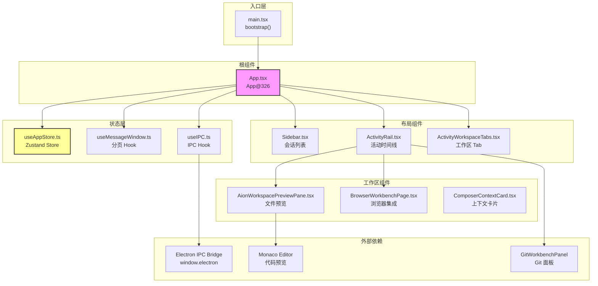
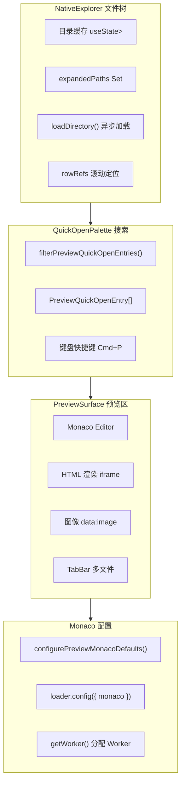

# 前端 Shell 与组件总览

<cite>

**本文引用的文件**

- [src/ui/App.tsx](file://src/ui/App.tsx)
- [src/ui/App.css](file://src/ui/App.css)
- [src/ui/components/ActivityRail.tsx](file://src/ui/components/ActivityRail.tsx)
- [src/ui/components/ActivityWorkspaceTabs.tsx](file://src/ui/components/ActivityWorkspaceTabs.tsx)
- [src/ui/components/AionWorkspacePreviewPane.css](file://src/ui/components/AionWorkspacePreviewPane.css)
- [src/ui/components/AionWorkspacePreviewPane.tsx](file://src/ui/components/AionWorkspacePreviewPane.tsx)
- [src/ui/components/BrowserWorkbenchPage.tsx](file://src/ui/components/BrowserWorkbenchPage.tsx)
- [src/ui/components/ComposerContextCard.tsx](file://src/ui/components/ComposerContextCard.tsx)
- [src/ui/hooks/useIPC.ts](file://src/ui/hooks/useIPC.ts)
- [src/ui/hooks/useMessageWindow.ts](file://src/ui/hooks/useMessageWindow.ts)
- [src/ui/store/useAppStore.ts](file://src/ui/store/useAppStore.ts)
- [src/ui/types.ts](file://src/ui/types.ts)
- [src/ui/components/Sidebar.tsx](file://src/ui/components/Sidebar.tsx)
- [src/ui/main.tsx](file://src/ui/main.tsx)
- [src/ui/index.css](file://src/ui/index.css)
- [src/ui/components/git/index.ts](file://src/ui/components/git/index.ts)

</cite>

## 目录

- [模块职责边界](#模块职责边界)
- [入口与启动链路](#入口与启动链路)
- [核心组件调用链](#核心组件调用链)
- [状态与数据结构](#状态与数据结构)
- [IPC 通信机制](#ipc-通信机制)
- [Preview 工作台架构](#preview-工作台架构)
- [浏览器工作台](#浏览器工作台)
- [失败模式与排障](#失败模式与排障)
- [扩展点与改造路径](#扩展点与改造路径)
- [Agent 改代码地图](#agent-改代码地图)

---

## 模块职责边界

`module-ui-shell` 是 tech-cc-hub 的前端入口模块，负责渲染 Electron 桌面客户端的主界面。它不承担后端逻辑，只负责：

| 职责 | 归属文件 | 说明 |
|------|----------|------|
| **UI 渲染** | `App.tsx` | 三栏布局：Sidebar + Center + ActivityRail |
| **状态管理** | `useAppStore.ts` | Zustand 全局状态，source-of-truth |
| **事件桥接** | `useIPC.ts` | 连接 `window.electron.onServerEvent` 与 React |
| **消息分页** | `useMessageWindow.ts` | 虚拟窗口，支持"加载更多"历史消息 |
| **文件预览** | `AionWorkspacePreviewPane.tsx` | Monaco Editor + 文件树 + QuickOpen |
| **浏览器集成** | `BrowserWorkbenchPage.tsx` | 本地开发服务器探测 + iframe 预览 |
| **会话导航** | `Sidebar.tsx` | 会话列表、工作区分组、归档管理 |

**不在此模块**：后端 IPC 处理器、Agent SDK、模型配置、Skill 管理。

[章节来源](file://src/ui/App.tsx#L326-L340)

---

## 入口与启动链路

### 入口文件：`src/ui/main.tsx`

```text
bootstrap()  →  installDevElectronShim() (开发模式)  →  createRoot().render(<App />)
```

- 第 5 行：`bootstrap` 是唯一导出的顶层异步函数
- 第 8-9 行：开发模式下加载 `dev-electron-shim`，模拟 Electron API
- 第 11-14 行：`StrictMode` 包裹 `<App />`，启用双渲染检查

### 应用根组件：`App` (`App.tsx` 第 326 行)

`App` 是单例根组件，持有所有顶层状态：

```typescript
const App = () => {
  // 状态
  const [partialMessagesBySessionId, setPartialMessagesBySessionId] = useState<Record<string, string>>({})
  const [shouldAutoScroll, setShouldAutoScroll] = useState(true)

  // Hooks
  const messagesEndRef = useRef<HTMLDivElement>(null)      // 自动滚动锚点
  const scrollContainerRef = useRef<HTMLDivElement>(null)   // 滚动容器
  const topSentinelRef = useRef<HTMLDivElement>(null)       // 无限滚动触发器
  const partialFlushFrameRef = useRef<number | null>(null)  // 批量刷新帧

  // IPC
  useIPC(handleServerEvent)  // 接收 ServerEvent，更新 Zustand store
  useMessageWindow(messages) // 分页逻辑
}
```

**关键常量**（第 35-40 行）：

| 常量 | 值 | 用途 |
|------|-----|------|
| `SCROLL_THRESHOLD` | 50 | 滚动阈值判定 |
| `INITIAL_HISTORY_LIMIT` | 400 | 初始加载消息数 |
| `HISTORY_PAGE_LIMIT` | 200 | 每次加载更多增量 |
| `MIN_CENTER_WIDTH` | 300 | 中间栏最小宽度 |
| `MIN_SIDEBAR_WIDTH` | 250 | 侧边栏最小宽度 |
| `MIN_ACTIVITY_RAIL_WIDTH` | 400 | Activity Rail 最小宽度 |

[章节来源](file://src/ui/main.tsx#L5-L16)

---

## 核心组件调用链

### 组件层次结构



### 调用链路详解

#### 1. 状态初始化链路

```
App (L327)
  └─ useAppStore.getState()  // 获取全局状态
       ├─ sessions: Record<string, SessionView>
       ├─ activeSessionId: string | null
       └─ apiConfigSettings: ApiConfigSettings
```

**Source-of-truth**：`useAppStore.ts` 第 103-168 行定义的 `AppState` 接口是整个前端状态的单一数据源。

#### 2. IPC 事件链路

```
window.electron.onServerEvent(ServerEvent)  [useIPC.ts L10]
  └─ onEvent callback
       └─ useAppStore.getState().handleServerEvent(event)  [App.tsx handleServerEvent]
            ├─ appendMessagesToSession()
            ├─ trimMessagesToRecent()
            └─ resolvePermissionRequest()
```

**关键**：所有从后端来的事件通过 `handleServerEvent` 统一处理，事件类型由 `ServerEvent` 定义（见 `types.ts`）。

#### 3. 消息渲染链路

```
App.render()
  └─ useMessageWindow(messages)  [useMessageWindow.ts L24]
       ├─ visibleMessages: IndexedMessage[]  // 当前窗口内消息
       ├─ hasMoreHistory: boolean            // 是否有更多历史
       └─ loadMoreMessages()                 // 加载更多回调
  └─ for each visibleMessages
       ├─ isProcessMessage() ? ProcessGroupCard : MessageCard
       └─ CompactProcessRow / CompactProcessDetails
```

[图表来源](file://src/ui/App.tsx#L45-L298)

---

## 状态与数据结构

### 核心类型

#### 1. `StreamMessage`（消息流核心类型）

```typescript
// types.ts L277-280
type StreamMessage = (SDKMessage | UserPromptMessage | PromptLedgerMessage) & {
  capturedAt?: number;    // 前端捕获时间
  historyId?: string;     // 历史记录 ID
};
```

消息来源有三：
- `SDKMessage`：来自 Agent SDK 的流式消息
- `UserPromptMessage`：`type: "user_prompt"` 用户输入
- `PromptLedgerMessage`：Token 使用追踪消息

#### 2. `SessionView`（会话视图状态）

```typescript
// useAppStore.ts L32-56
export type SessionView = {
  id: string;
  title: string;
  status: SessionStatus;  // "idle" | "running" | "completed" | "error"
  model?: string;
  cwd?: string;
  messages: StreamMessage[];
  permissionRequests: PermissionRequest[];
  latestPlan?: SessionPlanSnapshot;
  hydrated: boolean;      // 是否已从后端加载完整历史
  hasMoreHistory: boolean;
  historyCursor?: SessionHistoryCursor;
};
```

#### 3. `PermissionRequest`（权限请求）

```typescript
// useAppStore.ts L26-30
export type PermissionRequest = {
  toolUseId: string;
  toolName: string;
  input: unknown;
};
```

#### 4. `BrowserWorkbenchSessionState`

```typescript
// useAppStore.ts L58-62
export type BrowserWorkbenchSessionState = {
  url?: string;
  hasBrowserTab: boolean;
  annotations: BrowserWorkbenchAnnotation[];
};
```

### Zustand Store 接口

```typescript
// useAppStore.ts L103-168
interface AppState {
  sessions: Record<string, SessionView>;           // 活跃会话
  archivedSessions: Record<string, SessionView>;   // 归档会话
  activeSessionId: string | null;
  prompt: string;
  browserWorkbenchBySessionId: Record<string, BrowserWorkbenchSessionState>;
  codeReferencesBySessionId: Record<string, CodeReferenceDraft[]>;

  // 核心方法
  setActiveSessionId: (id: string | null) => void;
  handleServerEvent: (event: ServerEvent) => void;
  resolvePermissionRequest: (sessionId: string, toolUseId: string) => void;

  // 代码引用
  addCodeReference: (sessionId, reference) => CodeReferenceDraft;
  removeCodeReference: (sessionId, id) => void;

  // 配置
  setApiConfigSettings: (settings: ApiConfigSettings) => void;
  setRuntimeModel: (model: string) => void;
}
```

[章节来源](file://src/ui/store/useAppStore.ts#L103-L168)

---

## IPC 通信机制

### `useIPC` Hook（第 4 行）

```typescript
export function useIPC(onEvent: (event: ServerEvent) => void) {
  const [connected, setConnected] = useState(false);
  const unsubscribeRef = useRef<(() => void) | null>(null);

  useEffect(() => {
    const unsubscribe = window.electron.onServerEvent((event: ServerEvent) => {
      onEvent(event);  // 转发给 React 状态更新
    });
    unsubscribeRef.current = unsubscribe;
    setConnected(true);

    return () => {
      if (unsubscribeRef.current) {
        unsubscribeRef.current();
        unsubscribeRef.current = null;
      }
      setConnected(false);
    };
  }, [onEvent]);

  const sendEvent = useCallback((event: ClientEvent) => {
    window.electron.sendClientEvent(event);  // 发回后端
  }, []);

  return { connected, sendEvent };
}
```

### 运行时信号（Electron IPC Channel）

| 方向 | Channel / 方法 | 用途 |
|------|----------------|------|
| 后端→前端 | `window.electron.onServerEvent` | 接收 ServerEvent |
| 前端→后端 | `window.electron.sendClientEvent` | 发送 ClientEvent |
| 后端→前端 | `window.electron.onAppUpdateStatus` | 应用更新状态 |
| 查询 | `electron.invoke: sessions:list` | 列出所有会话 |
| 调用 | `electron.invoke: shell:openExternal` | 打开外部 URL |
| 预览 | `window.electron.listPreviewDirectory` | 列出目录内容 |

**Dev Bridge 运行时**：当 `getDevElectronRuntimeSource() === "bridge"` 时，显示开发桥连接状态。

```typescript
// App.tsx L306-325
const runtimeSourceMeta: Record<DevElectronRuntimeSource, { label, tooltip, className, dotClassName }> = {
  bridge: { label: "Dev Bridge", tooltip: "localhost 正在连接 Electron 开发后端", ... },
  fallback: { label: "Fallback", tooltip: "当前使用浏览器预览占位后端", ... },
  electron: { label: "Electron IPC", tooltip: "当前连接桌面端 preload IPC", ... },
};
```

[章节来源](file://src/ui/hooks/useIPC.ts#L4-L31)

---

## Preview 工作台架构

### 核心组件：`AionWorkspacePreviewPane`

文件路径：`src/ui/components/AionWorkspacePreviewPane.tsx`

#### 功能分层



#### 关键数据结构

```typescript
// L82-88
type PreviewEntry = {
  name: string;
  path: string;
  relativePath: string;
  type: 'directory' | 'file';
  size?: number;
};

// L106-116
type ActivePreviewFile = {
  path: string;
  fileName: string;
  relativePath: string;
  content: string;
  contentType: 'code' | 'html' | 'image';
  language?: string;
  revealLine?: number;  // 从消息跳转时传入
};
```

#### 内容类型推断

```typescript
// L142-150
function inferContentType(filePath: string, content?: string): PreviewContentType {
  if (content?.startsWith('data:image/')) return 'image';
  const extension = getFileExtension(filePath);
  if (extension === 'html' || extension === 'htm') {
    if (isRuntimeHtmlShell(content)) return 'code';  // Vite dev server HTML
    return 'html';
  }
  return 'code';
}
```

#### IPC 调用

```typescript
// L232
const result = await window.electron.listPreviewDirectory({ cwd: workspace, path });
```

**Source-of-truth**：目录内容从后端获取，`DirectoryState` 缓存于组件状态。

[章节来源](file://src/ui/components/AionWorkspacePreviewPane.tsx#L75-L255)

---

## 浏览器工作台

### `BrowserWorkbenchPage` 组件

文件路径：`src/ui/components/BrowserWorkbenchPage.tsx`

#### 功能概述

1. **本地服务器探测**：探测 localhost 常见端口（3000, 4173, 5173, 8000, 8080）
2. **URL 规范化**：处理相对 URL 和 hash fragment
3. **截图捕获**：从 iframe contentDocument 提取可见样式并序列化为 SVG
4. **注解模式**：支持在浏览器预览上添加截图附件

#### 关键函数

| 函数 | 行号 | 职责 |
|------|------|------|
| `probeLocalTarget()` | 59 | `fetch` 探测 URL 可达性，1400ms 超时 |
| `LocalTargetPreview()` | 76 | 渲染本地开发服务器卡片 UI |
| `isCurrentAppUrl()` | 94 | 判断 URL 是否指向当前 App |
| `isLoopbackHost()` | 106 | 判断是否为 localhost/127.0.0.1 |
| `capturePreviewFrameVisible()` | 155 | 从 iframe 捕获可视区域 SVG |

#### 运行时检测

```typescript
// L32-35
const isBrowserPreviewRuntime = () => (
  typeof window !== "undefined" &&
  (!/Electron/i.test(window.navigator.userAgent) || getDevElectronRuntimeSource() !== "electron")
);

// L37-41
const hasBrowserWorkbenchRuntime = () => (
  typeof window !== "undefined" &&
  typeof window.electron?.openBrowserWorkbench === "function" &&
  typeof window.electron?.setBrowserWorkbenchBounds === "function"
);
```

#### 数据持久化

```typescript
// L52-55
const RECENT_LOCAL_BROWSER_TARGETS_KEY = "tech-cc-hub:browser-workbench:recent-local-targets";
const COMMON_LOCAL_BROWSER_PORTS = [3000, 4173, 5173, 8000, 8001, 8080];
const MAX_LOCAL_BROWSER_TARGETS = 5;
const MAX_RECENT_LOCAL_BROWSER_TARGETS = 5;

// L113-115
function getWorkspaceRecentStorageKey(workspaceKey: string) {
  return `${RECENT_LOCAL_BROWSER_TARGETS_KEY}:${encodeURIComponent(workspaceKey || "__global__")}`;
}
```

[章节来源](file://src/ui/components/BrowserWorkbenchPage.tsx#L1-L310)

---

## 失败模式与排障

### 常见失败场景

#### 1. IPC 连接失败

**症状**：`useIPC` 返回 `connected: false`，或事件不触发。

**检查点**：

```bash
# 1. 确认 Electron preload 脚本正常加载
window.electron?.onServerEvent !== undefined

# 2. 检查 Dev Bridge 连接状态
getDevElectronRuntimeSource()  // "bridge" | "electron" | "fallback"
```

**修复路径**：

- 开发模式：检查 `dev-electron-shim` 是否正确安装
- 生产模式：检查 `electron` preload 脚本是否正确注入

#### 2. 目录加载失败（Preview Pane）

**症状**：`NativeExplorer` 显示 "目录读取失败"。

**检查点**：

```typescript
// AionWorkspacePreviewPane.tsx L233-239
if (!result.success || !result.entries) {
  error: result.error || '目录读取失败。'
}
```

**常见原因**：

- 后端 `listPreviewDirectory` IPC 未注册
- 路径包含特殊字符未编码
- 工作区路径变更但组件未重置

#### 3. 消息分页不更新

**症状**：点击"加载更多"后消息数量不变。

**检查点**：`useMessageWindow.ts` L53-63

```typescript
const loadMoreMessages = useCallback(() => {
  if (hasMoreLocalHistory) {
    setVisibleLimit((current) => Math.min(messages.length, current + LOAD_MORE_MESSAGE_STEP));
    return;
  }
  if (!hasPersistedHistory || isLoadingHistory) return;
  onLoadMore();  // 触发后端加载历史
}, [...]);
```

**修复路径**：检查 `hasPersistedHistory` 是否正确传递，`onLoadMore` 是否正确绑定。

#### 4. Monaco Editor 加载失败

**症状**：Preview 区域空白，控制台报错 `MonacoEnvironment.getWorker` undefined。

**检查点**：`AionWorkspacePreviewPane.tsx` L47-68

```typescript
const monacoGlobal = self as MonacoWorkerEnvironment;
let previewMonacoDefaultsConfigured = false;

if (!monacoGlobal.MonacoEnvironment?.getWorker) {
  monacoGlobal.MonacoEnvironment = {
    getWorker(_: string, label: string) {
      // 根据 label 返回对应 Worker
    },
  };
}
```

**修复路径**：确认 Vite 构建配置正确处理 Worker URL。

---

## 扩展点与改造路径

### 1. 添加新 ActivityRail Tab

**路径**：修改 `ActivityWorkspaceTabs.tsx`

```typescript
// L18-60: iconForTab() 添加新 tab 图标
function iconForTab(tab: ActivityWorkspaceTab) {
  if (tab === "browser") { ... }
  if (tab === "trace") { ... }
  if (tab === "usage") { ... }
  if (tab === "git") { ... }
  // 添加新 tab:
  if (tab === "my-custom-tab") {
    return <CustomIcon />;
  }
}

// L81: buildActivityWorkspaceTabs() 返回 tab 列表
const tabs = buildActivityWorkspaceTabs({ activeTab, showBrowserTab }).filter((tab) => tab.visible);
```

### 2. 添加新的 IPC Channel

**路径**：修改 `useIPC.ts` 和后端 IPC 注册

```typescript
// 前端：useIPC.ts L26-28
const sendEvent = useCallback((event: ClientEvent) => {
  window.electron.sendClientEvent(event);  // 已支持泛型
}, []);

// 后端：在 electron main 进程注册新 channel
ipcMain.handle('my-new-channel', async (event, args) => {
  return handleMyNewChannel(args);
});
```

### 3. 扩展 SessionView 字段

**路径**：修改 `useAppStore.ts` 和相关组件

```typescript
// 1. 在 SessionView 类型添加新字段（useAppStore.ts L32-56）
export type SessionView = {
  // ... 现有字段
  myNewField?: MyNewType;  // 添加新字段
};

// 2. 在 createSession() 函数初始化默认值（useAppStore.ts L170-180）
function createSession(id: string): SessionView {
  return {
    // ...
    myNewField: undefined,
  };
}

// 3. 在 handleServerEvent 处理新事件类型（useAppStore.ts L167）
handleServerEvent: (event: ServerEvent) => {
  switch (event.type) {
    // ...
    case 'my_new_event':
      // 处理新事件
      break;
  }
}
```

### 4. 自定义 Preview 文件类型

**路径**：修改 `inferContentType()` 和 Monaco 配置

```typescript
// AionWorkspacePreviewPane.tsx L142-150
function inferContentType(filePath: string, content?: string): PreviewContentType {
  // 添加新文件类型判断
  const extension = getFileExtension(filePath);
  if (extension === 'my-custom-ext') {
    return 'code';  // 或 'html' / 'image'
  }
  // ...
}
```

[章节来源](file://src/ui/components/ActivityWorkspaceTabs.tsx#L1-L134)

---

## Agent 改代码地图

### 先读文件顺序（推荐）

1. **`src/ui/store/useAppStore.ts`**（状态定义，核心）
2. **`src/ui/App.tsx`**（组件入口，了解布局）
3. **`src/ui/types.ts`**（类型定义）
4. **`src/ui/hooks/useIPC.ts`**（IPC 桥接）
5. 目标组件（如 `ActivityRail.tsx`）

### 关键符号速查

| 符号 | 文件 | 行号 | 用途 |
|------|------|------|------|
| `App` | `App.tsx` | 326 | 根组件 |
| `useAppStore` | `useAppStore.ts` | 主编 | Zustand store |
| `useIPC` | `useIPC.ts` | 4 | IPC 连接 Hook |
| `useMessageWindow` | `useMessageWindow.ts` | 24 | 消息分页 Hook |
| `handleServerEvent` | `useAppStore.ts` | 167 | ServerEvent 处理器 |
| `createSession` | `useAppStore.ts` | 169 | 创建新会话 |
| `StreamMessage` | `types.ts` | 277 | 消息流类型 |
| `SessionView` | `useAppStore.ts` | 32 | 会话状态类型 |
| `ActivityRail` | `ActivityRail.tsx` | 主编 | 活动时间线组件 |
| `AionWorkspacePreviewPane` | `AionWorkspacePreviewPane.tsx` | 1091 | 文件预览组件 |
| `BrowserWorkbenchPage` | `BrowserWorkbenchPage.tsx` | 319 | 浏览器工作台 |

### IPC Channel 速查

| Channel | 方向 | 触发位置 |
|---------|------|----------|
| `window.electron.onServerEvent` | → 前端 | `useIPC.ts:10` |
| `window.electron.sendClientEvent` | 后端 ← | `useIPC.ts:27` |
| `sessions:list` | 查询 | `App.tsx:runtime` |
| `shell:openExternal` | 调用 | `App.tsx:runtime` |
| `listPreviewDirectory` | 调用 | `AionWorkspacePreviewPane.tsx:232` |

### 修改入口

| 改动类型 | 入口文件 | 关键函数 |
|----------|----------|----------|
| 添加新组件 | `App.tsx` | `App` render 方法 |
| 添加新状态 | `useAppStore.ts` | `AppState` 接口 |
| 添加新 IPC | `useIPC.ts` | `useIPC` 函数 |
| 添加新 Tab | `ActivityWorkspaceTabs.tsx` | `iconForTab`, `buildActivityWorkspaceTabs` |
| 添加新 Preview 类型 | `AionWorkspacePreviewPane.tsx` | `inferContentType` |

### 验证命令

```bash
# 1. 类型检查
npx tsc --noEmit -p tsconfig.json

# 2. 构建验证
npm run build 2>&1 | head -50

# 3. 开发模式启动
npm run dev

# 4. 单元测试（如有）
npm test -- --run

# 5. ESLint 检查
npx eslint src/ui --max-warnings=0
```

### 常见回归风险

| 风险点 | 症状 | 排查方法 |
|--------|------|----------|
| **IPC 事件断流** | 消息不更新 | 检查 `handleServerEvent` switch 分支 |
| **Zustand 订阅泄漏** | 内存增长 | 检查 useEffect cleanup 函数 |
| **Monaco Worker 加载失败** | Preview 空白 | 检查 `MonacoEnvironment` 配置 |
| **滚动位置重置** | 消息窗口跳回顶部 | 检查 `useMessageWindow` 依赖项 |
| **样式冲突** | Tailwind 类失效 | 检查 `index.css` import 顺序 |

### 运行时刷新边界

| 改动类型 | 是否需要重启 | 刷新方式 |
|----------|--------------|----------|
| CSS / Tailwind | 否 | HMR 自动刷新 |
| React 组件 | 否 | HMR 自动刷新 |
| TypeScript 类型 | 是 | 重新构建 |
| IPC Channel | 是 | 重启 Electron |
| Zustand Store 结构 | 是 | 重启 Electron |
| Monaco 配置 | 是 | 刷新页面（硬刷新） |

---

## 附录：CSS 变量体系

`src/ui/index.css` 和 `src/ui/App.css` 定义了完整的 CSS 变量体系：

```css
/* index.css L5-51 */
:root {
  --color-accent: #D26A3D;           /* 主题橙色 */
  --color-surface: #FFFFFF;
  --color-ink-900: #16181D;           /* 主文字 */
  --color-error: #DC2626;
  --color-success: #16A34A;
}

.dark {
  --color-accent: #F2C2AD;            /* 深色模式橙色变浅 */
  --color-background: #16181D;
}

/* AionWorkspacePreviewPane.css L1-19 */
.aion-workbench {
  --aion-paper: #ffffff;
  --aion-sidebar: #f3f3f3;
  --aion-ink: #24292f;               /* VSCode 风格深色文字 */
  --aion-accent: #0969da;             /* GitHub 蓝 */
}
```

[章节来源](file://src/ui/index.css#L1-L51)
