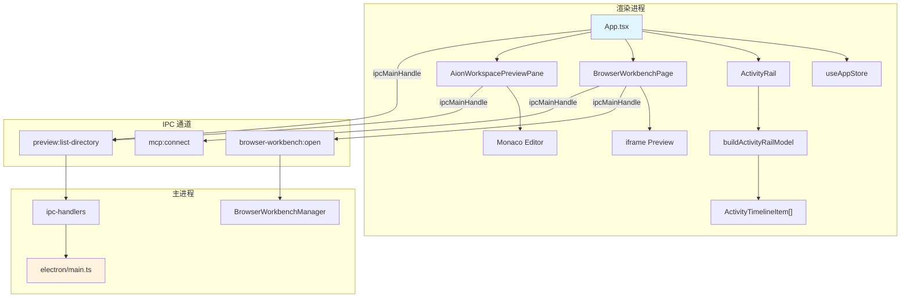

# 前端 Shell 与组件总览

> **module**: `module-ui-shell`
> **适用版本**: tech-cc-hub 当前分支
> **维护者**: 前端团队
> **最后更新**: 2025-01

本文档描述 `tech-cc-hub` 前端 Shell 的职责划分、入口文件、调用链、数据结构和扩展点。文档面向三类读者：新加入项目的开发者、需要修改 UI 层的行为溯源的 QA、以及负责维护 Electron 桥接的客户端工程师。

---

<cite>
**本文引用的文件**
- [src/ui/App.tsx](file://src/ui/App.tsx)
- [src/ui/App.css](file://src/ui/App.css)
- [src/ui/components/ActivityRail.tsx](file://src/ui/components/ActivityRail.tsx)
- [src/ui/components/ActivityWorkspaceTabs.tsx](file://src/ui/components/ActivityWorkspaceTabs.tsx)
- [src/ui/components/AionWorkspacePreviewPane.css](file://src/ui/components/AionWorkspacePreviewPane.css)
- [src/ui/components/AionWorkspacePreviewPane.tsx](file://src/ui/components/AionWorkspacePreviewPane.tsx)
- [src/ui/components/BrowserWorkbenchPage.tsx](file://src/ui/components/BrowserWorkbenchPage.tsx)
- [src/ui/components/ComposerContextCard.tsx](file://src/ui/components/ComposerContextCard.tsx)
- [src/electron/main.ts](file://src/electron/main.ts)
</cite>

---

## 目录

- [1. 架构概览](#1-架构概览)
- [2. 入口文件与根组件](#2-入口文件与根组件)
- [3. Shell 布局组件](#3-shell-布局组件)
- [4. 活动轨道（Activity Rail）](#4-活动轨道activity-rail)
- [5. 工作空间预览窗格](#5-工作空间预览窗格)
- [6. 浏览器工作台页面](#6-浏览器工作台页面)
- [7. 上下文卡片](#7-上下文卡片)
- [8. Electron IPC 集成](#8-electron-ipc-集成)
- [9. 主题与样式体系](#9-主题与样式体系)
- [10. 常见改造路径](#10-常见改造路径)
- [11. 排障速查](#11-排障速查)

---

## 1. 架构概览

`tech-cc-hub` 的前端是一个 **React + TypeScript + Tailwind CSS** 单页应用，运行在 Electron 渲染进程中。它通过 IPC 与主进程通信，并支持三种运行模式：Electron IPC 模式、Dev Bridge 模式（浏览器连接本地后端）和纯浏览器占位模式。

前端模块可划分为四个层次：

```
┌─────────────────────────────────────────────────┐
│  Shell 层   │ App.tsx（根组件）                  │
│             │ - 三栏布局（Sidebar / Center / Rail）│
│             │ - 模态框挂载点                      │
├─────────────┼───────────────────────────────────┤
│  功能组件层 │ ActivityRail / BrowserWorkbenchPage │
│             │ SessionAnalysisPage / SettingsModal │
├─────────────┼───────────────────────────────────┤
│  子系统组件 │ AionWorkspacePreviewPane /          │
│             │ ComposerContextCard /              │
│             │ ActivityWorkspaceTabs              │
├─────────────┼───────────────────────────────────┤
│  基础支撑层 │ useAppStore / useIPC /              │
│             │ events.ts / dev-electron-shim.ts   │
└─────────────┴───────────────────────────────────┘
```

图表来源：[src/ui/App.tsx#L326-L355](file://src/ui/App.tsx#L326-L355)

---

## 2. 入口文件与根组件

### 2.1 App.tsx（根组件）

`App` 是整个前端应用的根组件，负责：

1. **会话管理**：通过 `useAppStore` 访问 `sessions`、`sessionsById`、`activeSessionId` 等状态
2. **三栏布局**：Sidebar（会话列表）、Center（消息流+输入框）、Activity Rail（活动详情）均可独立开关
3. **消息流渲染**：`RenderEntry` 类型决定消息以何种形态展示（普通消息、工具调用组、分割线）
4. **权限请求处理**：`permissionRequests` 状态驱动 `ProcessGroupCard` 中的权限确认按钮

根组件中的关键状态初始化（第 338-370 行）：

```typescript
const [workspaceViewBySessionId, setWorkspaceViewBySessionId] = useState<Record<string, WorkspaceView>>({});
const [activityRailTabBySessionId, setActivityRailTabBySessionId] = useState<Record<string, ActivityRailTab>>({});
const [sidebarWidth, setSidebarWidth] = useState(320);
const [activityRailWidth, setActivityRailWidth] = useState(420);
```

章节来源：[src/ui/App.tsx#L327-L372](file://src/ui/App.tsx#L327-L372)

### 2.2 三种运行模式指示器

根组件根据 `getDevElectronRuntimeSource()` 的返回值展示不同的运行模式徽章（第 306-325 行）：

| 模式 | 来源 | 样式类 |
|------|------|--------|
| `electron` | 连接桌面端 preload IPC | `border-sky-500/20 bg-sky-50` |
| `bridge` | localhost 连接开发后端 | `border-emerald-500/20 bg-emerald-50` |
| `fallback` | 纯浏览器占位 | `border-amber-500/24 bg-amber-50` |

章节来源：[src/ui/App.tsx#L306-L325](file://src/ui/App.tsx#L306-L325)

---

## 3. Shell 布局组件

### 3.1 三栏布局尺寸约束

布局使用固定最小宽度约束防止组件压缩变形：

```typescript
const MIN_CENTER_WIDTH = 300;
const MIN_SIDEBAR_WIDTH = 250;
const MIN_ACTIVITY_RAIL_WIDTH = 400;
```

这些常量定义在文件顶部，驱动拖拽调整逻辑。

章节来源：[src/ui/App.tsx#L38-L40](file://src/ui/App.tsx#L38-L40)

### 3.2 主要导入组件

根组件导入了以下 Shell 组件：

| 组件 | 来源 | 职责 |
|------|------|------|
| `Sidebar` | `./components/Sidebar` | 会话列表、搜索、归档 |
| `StartSessionModal` | `./components/StartSessionModal` | 新建会话引导 |
| `SettingsModal` | `./components/SettingsModal` | 设置页面 |
| `ActivityRail` | `./components/ActivityRail` | 活动时间线与上下文分析 |
| `BrowserWorkbenchPage` | `./components/BrowserWorkbenchPage` | 浏览器预览 |
| `SessionAnalysisPage` | `./components/SessionAnalysisPage` | 会话分析 |
| `PromptInput` | `./components/PromptInput` | 消息输入框 |

章节来源：[src/ui/App.tsx#L10-L24](file://src/ui/App.tsx#L10-L24)

---

## 4. 活动轨道（Activity Rail）

### 4.1 ActivityRail 组件职责

`ActivityRail` 是右侧栏的核心组件，负责展示会话执行过程中的结构化活动。组件接收 `buildActivityRailModel` 的输出，后者由 `shared/activity-rail-model` 提供。

核心数据结构 `ActivityTimelineItem` 包含：

- `id`: 唯一标识
- `nodeKind`: 节点类型（`context`、`plan`、`tool_input`、`file_read`、`file_write`、`terminal`、`browser` 等）
- `stageKind`: 所属阶段（`inspect`、`implement`、`verify`、`deliver`）
- `tone`: 色调（`info`、`success`、`warning`、`error`）
- `title` / `preview` / `detail`: 三级文本展示
- `chips`: 标签数组，用于搜索过滤

章节来源：[src/ui/components/ActivityRail.tsx#L24-L44](file://src/ui/components/ActivityRail.tsx#L24-L44)

### 4.2 阶段分组渲染

时间线按 `stageKind` 分组，相邻同阶段项合并显示，辅助用户理解当前执行进度：

```typescript
const STAGE_ORDER = ["inspect", "implement", "verify", "deliver"] as const;
// 非 STAGE_ORDER 中的阶段以 opacity-60 淡化显示
```

章节来源：[src/ui/components/ActivityRail.tsx#L46-L54](file://src/ui/components/ActivityRail.tsx#L46-L54)

### 4.3 上下文用量面板

`ContextUsagePanel` 子组件展示 Prompt 令牌分布，按来源分类（system、project、skill、workflow、current、attachment、memory、history、tool）。

关键指标计算逻辑（第 401-411 行）：

- `windowTokens`: 上下文窗口总量（默认 200,000）
- `autoCompactTokens`: 触发压缩的阈值令牌数
- `draftTokens`: 当前输入的令牌估算
- `streamingTokens`: 流式消息的令牌估算
- `toolDefinitionTokens`: 工具定义的令牌估算

章节来源：[src/ui/components/ActivityRail.tsx#L384-L411](file://src/ui/components/ActivityRail.tsx#L384-L411)

### 4.4 材料状态检测

`buildMaterialStatusItems` 函数（第 280-358 行）通过关键词匹配检测特殊工具的使用状态：

```typescript
// 检测 Figma 相关工具
const figmaToolNames = Array.from(new Set(
  model.timeline
    .map((item) => item.toolName)
    .filter((toolName): toolName is string =>
      typeof toolName === "string" && /figma/i.test(toolName)
    )
));

// 检测 nodeId / fileKey 锚点字段
const anchorFieldNames = ["nodeId", "nodeIds", "fileKey", "fileKeyOrUrl", "node_anchor"];

// 检测对比结果字段
const compareFieldNames = ["compare_current_view", "compare_images", "differenceRatio"];
```

章节来源：[src/ui/components/ActivityRail.tsx#L291-L312](file://src/ui/components/ActivityRail.tsx#L291-L312)

---

## 5. 工作空间预览窗格

### 5.1 AionWorkspacePreviewPane 组件职责

`AionWorkspacePreviewPane` 是工作空间文件浏览与代码预览的核心组件，内嵌 Monaco Editor。它由三个子区域组成：

```
┌──────────────────────┬────────────────────────────────────┐
│  NativeExplorer      │  PreviewSurface (Monaco Editor)    │
│  文件树侧边栏         │  代码/HTML/图片渲染                 │
│  - 目录加载缓存       │  - 语法高亮                         │
│  - 搜索过滤           │  - 代码引用高亮                     │
│  - 定位当前文件        │  - QuickOpenPalette                │
└──────────────────────┴────────────────────────────────────┘
```

章节来源：[src/ui/components/AionWorkspacePreviewPane.tsx#L176-L429](file://src/ui/components/AionWorkspacePreviewPane.tsx#L176-L429)

### 5.2 目录加载与缓存策略

目录状态存储在组件 state 中，并通过 ref 保持最新引用：

```typescript
const directoryCacheRef = useRef(directoryCache);
useEffect(() => {
  directoryCacheRef.current = directoryCache;
}, [directoryCache]);
```

缓存键为目录路径，支持增量展开。首次加载根目录时使用 `queueMicrotask` 避免阻塞渲染。

章节来源：[src/ui/components/AionWorkspacePreviewPane.tsx#L186-L263](file://src/ui/components/AionWorkspacePreviewPane.tsx#L186-L263)

### 5.3 内容类型推断

`inferContentType` 函数（第 142-150 行）根据文件扩展名和内容判断预览类型：

```typescript
function inferContentType(filePath: string, content?: string): PreviewContentType {
  if (content?.startsWith('data:image/')) return 'image';
  const extension = getFileExtension(filePath);
  if (extension === 'html' || extension === 'htm') {
    if (isRuntimeHtmlShell(content)) return 'code'; // 运行时 HTML 不走 iframe
    return 'html';
  }
  return 'code';
}
```

章节来源：[src/ui/components/AionWorkspacePreviewPane.tsx#L142-L150](file://src/ui/components/AionWorkspacePreviewPane.tsx#L142-L150)

### 5.4 Monaco Worker 配置

组件顶部配置 Monaco Worker（第 50-68 行），避免与 Vite 的 Worker 处理冲突：

```typescript
monacoGlobal.MonacoEnvironment = {
  getWorker(_: string, label: string) {
    if (label === 'typescript' || label === 'javascript') {
      return new Worker(
        new URL('monaco-editor/esm/vs/language/typescript/ts.worker.js', import.meta.url),
        { type: 'module' }
      );
    }
    // css、html、json worker 配置...
  }
};
```

章节来源：[src/ui/components/AionWorkspacePreviewPane.tsx#L50-L68](file://src/ui/components/AionWorkspacePreviewPane.tsx#L50-L68)

### 5.5 VS Code 风格样式

CSS 文件提供完整的 VS Code 风格样式，包括：

- `.aion-workbench`: 整体容器布局
- `.native-explorer`: 文件树样式
- `.vscode-preview`: Monaco Editor 容器样式
- `.quick-open`: 命令面板弹窗
- `.quick-open__item--selected`: 选中项高亮

图表来源：[src/ui/components/AionWorkspacePreviewPane.css#L1-L146](file://src/ui/components/AionWorkspacePreviewPane.css#L1-L146)

---

## 6. 浏览器工作台页面

### 6.1 BrowserWorkbenchPage 组件职责

`BrowserWorkbenchPage` 封装本地浏览器预览功能，支持：

- 内嵌 iframe 预览本地开发服务器页面
- 截图捕获并作为附件添加到上下文
- 本地开发服务器检测（探测 localhost 常用端口）
- URL 归一化与开发模式标记

章节来源：[src/ui/components/BrowserWorkbenchPage.tsx#L320-L329](file://src/ui/components/BrowserWorkbenchPage.tsx#L320-L329)

### 6.2 本地目标检测

`probeLocalTarget` 函数使用 `fetch` 探测本地服务器可用性（第 59-74 行）：

```typescript
async function probeLocalTarget(url: string, timeoutMs = 1400): Promise<LocalTargetStatus> {
  const controller = new AbortController();
  const timeout = window.setTimeout(() => controller.abort(), timeoutMs);
  try {
    await fetch(url, { cache: "no-store", mode: "no-cors", signal: controller.signal });
    return "online";
  } catch {
    return "offline";
  } finally {
    window.clearTimeout(timeout);
  }
}
```

章节来源：[src/ui/components/BrowserWorkbenchPage.tsx#L59-L74](file://src/ui/components/BrowserWorkbenchPage.tsx#L59-L74)

### 6.3 常用开发端口

`COMMON_LOCAL_BROWSER_PORTS` 定义了自动探测的端口列表：

```typescript
const COMMON_LOCAL_BROWSER_PORTS = [3000, 4173, 5173, 8000, 8001, 8080];
const MAX_LOCAL_BROWSER_TARGETS = 5;
```

章节来源：[src/ui/components/BrowserWorkbenchPage.tsx#L53-L54](file://src/ui/components/BrowserWorkbenchPage.tsx#L53-L54)

### 6.4 截图捕获流程

`capturePreviewFrameVisible` 函数（第 155-206 行）将可见 iframe 内容转换为 PNG：

1. 克隆 `iframe.contentDocument.documentElement`
2. 移除所有 `<script>` 标签防止执行
3. 注入 `<base>` 标签确保相对资源正确加载
4. 注入内联样式恢复布局和滚动位置
5. 序列化 SVG foreignObject 转为 Canvas
6. 输出 Base64 PNG

章节来源：[src/ui/components/BrowserWorkbenchPage.tsx#L155-L206](file://src/ui/components/BrowserWorkbenchPage.tsx#L155-L206)

### 6.5 状态存储与恢复

浏览器工作台状态按 `sessionId` 持久化到 `useAppStore.browserWorkbenchBySessionId`：

```typescript
const sessionBrowserState = useAppStore((store) =>
  sessionId ? store.browserWorkbenchBySessionId[sessionId] : undefined
);
// 包括：url、title、loading、canGoBack、canGoForward、annotations
```

章节来源：[src/ui/components/BrowserWorkbenchPage.tsx#L338-L348](file://src/ui/components/BrowserWorkbenchPage.tsx#L338-L348)

---

## 7. 上下文卡片

### 7.1 ComposerContextCard 组件职责

`ComposerContextCard` 是输入框上下文附件的可视化展示，支持四种色调：

| tone | 边框颜色 | 背景 | 徽章颜色 |
|------|----------|------|----------|
| `code` | `#d0d7de` | `#ffffff` | `#0969da` |
| `browser` | `accent/16` | `#ffffff` | `accent` |
| `file` | `black/8` | `#ffffff` | `accent` |
| `message` | `accent/18` | `rgba(253,244,241,0.86)` | `accent` |

章节来源：[src/ui/components/ComposerContextCard.tsx#L26-L33](file://src/ui/components/ComposerContextCard.tsx#L26-L33)

### 7.2 Props 接口

```typescript
export type ComposerContextCardProps = {
  index: number;       // 序号（1-based）
  tone: ComposerContextTone;
  label: string;       // 类型标签（代码、文件、页面等）
  title: string;       // 主标题
  meta?: string;       // 元信息（路径、大小等）
  detail?: string;     // 详细信息（tooltip 显示）
  onOpen?: () => void;
  onRemove: () => void;
  onCopy?: () => void;
};
```

章节来源：[src/ui/components/ComposerContextCard.tsx#L3-L13](file://src/ui/components/ComposerContextCard.tsx#L3-L13)

---

## 8. Electron IPC 集成

### 8.1 主进程职责

`src/electron/main.ts` 是 Electron 主进程的入口，负责：

- 窗口管理（创建、显示、关闭）
- IPC 处理器注册（`ipcMainHandle`）
- 系统集成（剪贴板、Shell、对话框）
- MCP 插件管理（Open Computer Use、Figma 官方插件）
- 定时任务服务（`CronService`）

章节来源：[src/electron/main.ts#L1-L96](file://src/electron/main.ts#L1-L96)

### 8.2 BrowserWorkbenchManager 实例

主进程为每个会话维护独立的 `BrowserWorkbenchManager` 实例：

```typescript
const browserWorkbenches = new Map<string, BrowserWorkbenchManager>();
const DEFAULT_BROWSER_WORKBENCH_SESSION_ID = "global";
```

章节来源：[src/electron/main.ts#L100](file://src/electron/main.ts#L100) 和 [src/electron/main.ts#L115](file://src/electron/main.ts#L115)

### 8.3 预览文件限制

主进程定义预览资源的尺寸限制：

```typescript
const MAX_PREVIEW_TEXT_BYTES = 512_000;      // 500 KB
const MAX_PREVIEW_IMAGE_BYTES = 2_000_000;    // 2 MB
const MAX_PREVIEW_DIRECTORY_ENTRIES = 300;
const MAX_PREVIEW_QUICK_OPEN_ENTRIES = 2_000;
```

章节来源：[src/electron/main.ts#L101-L104](file://src/electron/main.ts#L101-L104)

### 8.4 进程间通信通道

关键 IPC 通道列表：

| 通道名 | 方向 | 用途 |
|--------|------|------|
| `preview:list-directory` | Renderer → Main | 列出目录内容 |
| `preview:read-file` | Renderer → Main | 读取文件内容 |
| `browser-workbench:open` | Renderer → Main | 打开浏览器工作台 |
| `browser-workbench:set-bounds` | Renderer → Main | 设置浏览器位置 |
| `mcp:connect` | Renderer → Main | 连接 MCP 服务器 |
| `skill:invoke` | Renderer → Main | 调用 Skill |

章节来源：[src/electron/main.ts#L30](file://src/electron/main.ts#L30) 和 [src/electron/main.ts#L64-66](file://src/electron/main.ts#L64-L66)

---

## 9. 主题与样式体系

### 9.1 CSS 变量定义

`App.css` 使用 CSS 自定义属性定义亮色/暗色主题：

```css
:root {
  --primary: #D26A3D;      /* 强调色（珊瑚橙） */
  --background: #F8F9FB;    /* 亮色背景 */
  --foreground: #16181D;   /* 主文本 */
  --border: #E6EAF0;       /* 边框色 */
}

.dark {
  --primary: #F2C2AD;      /* 暗色强调色 */
  --background: #16181D;   /* 暗色背景 */
  --foreground: #F8F9FB;   /* 暗色文本 */
  --border: #3D4450;        /* 暗色边框 */
}
```

章节来源：[src/ui/App.css#L7-L60](file://src/ui/App.css#L7-L60)

### 9.2 Chart 颜色序列

五个图表颜色的默认值：

```css
--chart-1: #D26A3D;  /* 珊瑚橙 */
--chart-2: #2563EB;  /* 蓝 */
--chart-3: #16A34A;  /* 绿 */
--chart-4: #D97706;  /* 琥珀 */
--chart-5: #BF3989;  /* 品红 */
```

章节来源：[src/ui/App.css#L27-L31](file://src/ui/App.css#L27-L31)

---

## 10. 常见改造路径

### 10.1 添加新的 Activity Rail 节点类型

在 `ActivityRail.tsx` 的 `NODE_KIND_LABELS` 中添加新类型（第 24-44 行），并在 `buildActivityRailModel` 的后端事件映射中添加对应处理逻辑。

### 10.2 扩展 BrowserWorkbenchPage 功能

1. 在 `BrowserWorkbenchPage.tsx` 添加新状态（如 `annotationMode`）
2. 在 `capturePreviewFrameVisible` 中添加新捕获模式
3. 通过 `setSessionBrowserAnnotations` 更新附件列表

### 10.3 新增 Workspace Tab

在 `ActivityWorkspaceTabs.tsx` 中：

1. 在 `iconForTab` 函数添加新图标
2. 修改 `buildActivityWorkspaceTabs` 的返回值
3. 在 `BrowserWorkbenchPage` 中添加对应的 `onOpen*` 回调

### 10.4 修改主题色

编辑 `App.css` 中的 CSS 变量，注意同步更新 `.dark` 变体以保持对比度。

---

## 11. 排障速查

### 11.1 Monaco Editor 不加载

**症状**：预览窗格显示空白或报错 `MonacoEnvironment is not defined`

**排查**：
1. 检查 `new URL(...)` 的路径是否正确（相对于 `node_modules`）
2. 确认 Vite 的 `optimizeDeps.exclude` 未排除 `monaco-editor`
3. 验证 Worker 文件存在于构建输出中

章节来源：[src/ui/components/AionWorkspacePreviewPane.tsx#L50-L68](file://src/ui/components/AionWorkspacePreviewPane.tsx#L50-L68)

### 11.2 文件树目录加载失败

**症状**：`native-explorer__error` 显示"目录读取失败"

**排查**：
1. 检查 IPC 通道 `preview:list-directory` 是否注册
2. 确认主进程的 `workspace` 路径（`cwd`）有效
3. 验证目录权限（非系统保护目录）

章节来源：[src/ui/components/AionWorkspacePreviewPane.tsx#L220-L255](file://src/ui/components/AionWorkspacePreviewPane.tsx#L220-L255)

### 11.3 本地浏览器无法连接

**症状**：`probeLocalTarget` 始终返回 `offline`

**排查**：
1. 确认目标服务器正在运行
2. 检查 CORS 配置（`mode: "no-cors"` 仅适用于同源或开放 CORS 的端点）
3. 延长 `timeoutMs`（默认 1400ms）以适应慢速启动的服务器

章节来源：[src/ui/components/BrowserWorkbenchPage.tsx#L59-L74](file://src/ui/components/BrowserWorkbenchPage.tsx#L59-L74)

### 11.4 Activity Rail 空白

**症状**：活动时间线不显示任何条目

**排查**：
1. 确认后端发送了 `activity_rail` 相关事件
2. 检查 `buildActivityRailModel` 的输入数据是否包含 `timeline` 字段
3. 验证 `nodeKind` 映射与前端 `NODE_KIND_LABELS` 一致

章节来源：[src/ui/components/ActivityRail.tsx#L24-L44](file://src/ui/components/ActivityRail.tsx#L24-L44)

---

## 数据流总图



图表来源：[src/ui/App.tsx#L10](file://src/ui/App.tsx#L10) → [src/electron/main.ts#L30](file://src/electron/main.ts#L30)

---

> **文档版本**: 1.0
> **下次审查日期**: 2025-04
> **相关规范**: [Activity Rail 规范](../40-engineering/activity-rail/spec.md) · [Electron IPC 规范](../40-engineering/electron-ipc/spec.md) · [Preview Workbench 规范](../40-engineering/preview-workbench/spec.md)