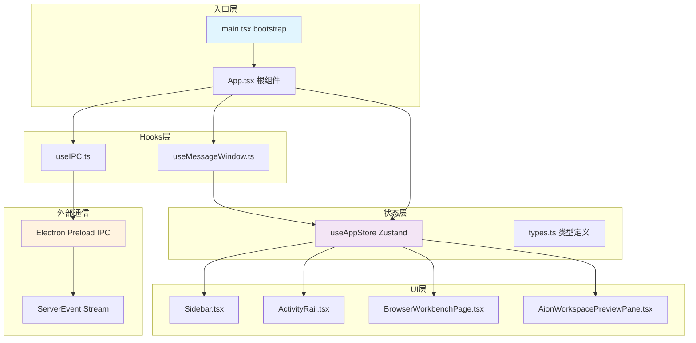

# 前端 Shell 与组件总览

<cite>
**本文引用的文件**
- [src/ui/App.tsx](file://src/ui/App.tsx)
- [src/ui/App.css](file://src/ui/App.css)
- [src/ui/components/ActivityRail.tsx](file://src/ui/components/ActivityRail.tsx)
- [src/ui/components/ActivityWorkspaceTabs.tsx](file://src/ui/components/ActivityWorkspaceTabs.tsx)
- [src/ui/components/AionWorkspacePreviewPane.css](file://src/ui/components/AionWorkspacePreviewPane.css)
- [src/ui/components/AionWorkspacePreviewPane.tsx](file://src/ui/components/AionWorkspacePreviewPane.tsx)
- [src/ui/components/BrowserWorkbenchPage.tsx](file://src/ui/components/BrowserWorkbenchPage.tsx)
- [src/ui/components/ComposerContextCard.tsx](file://src/ui/components/ComposerContextCard.tsx)
- [src/ui/hooks/useIPC.ts](file://src/ui/hooks/useIPC.ts)
- [src/ui/hooks/useMessageWindow.ts](file://src/ui/hooks/useMessageWindow.ts)
- [src/ui/store/useAppStore.ts](file://src/ui/store/useAppStore.ts)
- [src/ui/types.ts](file://src/ui/types.ts)
- [src/ui/components/Sidebar.tsx](file://src/ui/components/Sidebar.tsx)
- [src/ui/main.tsx](file://src/ui/main.tsx)
- [src/ui/index.css](file://src/ui/index.css)
- [src/ui/components/git/index.ts](file://src/ui/components/git/index.ts)
</cite>

---

## 目录

- [1. 模块定位与职责边界](#1-模块定位与职责边界)
- [2. 入口文件与启动链路](#2-入口文件与启动链路)
- [3. 核心组件协作图](#3-核心组件协作图)
- [4. 状态管理层（Zustand Store）](#4-状态管理层zustand-store)
- [5. IPC 通信桥接](#5-ipc-通信桥接)
- [6. 消息窗口与历史分页](#6-消息窗口与历史分页)
- [7. 工作区预览面板](#7-工作区预览面板)
- [8. 浏览器工作台](#8-浏览器工作台)
- [9. ActivityRail 时序轴](#9-activityrail-时序轴)
- [10. 扩展点与常见改造路径](#10-扩展点与常见改造路径)
- [11. Agent 改代码地图](#11-agent-改代码地图)
- [12. 验证与排障命令](#12-验证与排障命令)

---

## 1. 模块定位与职责边界

`module-ui-shell` 是 tech-cc-hub 的前端呈现层，负责：

1. **会话管理 UI**：侧边栏会话列表、新建/归档/删除会话
2. **消息渲染**：流式消息卡片、过程折叠组（`ProcessGroupCard`）
3. **ActivityRail**：执行时序轴、上下文用量面板、计划进度面板
4. **工作区预览**：Monaco 编辑器集成、文件系统浏览器
5. **浏览器工作台**：本地开发服务器探测、截图标注
6. **IPC 桥接**：Electron 主进程通信、WebSocket 事件订阅

该模块不包含 Agent 执行逻辑，仅负责状态展示和用户交互代理。

---

## 2. 入口文件与启动链路

```
main.tsx (bootstrap)
  └─> App.tsx (根组件)
        ├─> Sidebar.tsx         ← 会话列表侧边栏
        ├─> ActivityRail.tsx    ← 右侧时序轴面板
        ├─> BrowserWorkbenchPage.tsx ← 浏览器标签页
        ├─> useIPC()            ← IPC 事件订阅
        └─> useMessageWindow() ← 消息窗口分页
```

**关键符号**（来源：[src/ui/main.tsx#L5](file://src/ui/main.tsx#L5)）：

| 符号 | 位置 | 职责 |
|------|------|------|
| `bootstrap()` | main.tsx:5 | 异步初始化函数，开发模式加载 `dev-electron-shim` |
| `App` | App.tsx:326 | 根组件，整合所有子模块 |
| `MIN_SIDEBAR_WIDTH` | App.tsx:39 | 侧边栏最小宽度 250px |
| `MIN_ACTIVITY_RAIL_WIDTH` | App.tsx:40 | ActivityRail 最小宽度 400px |

启动时序：
1. `bootstrap()` 检测 `import.meta.env.DEV`，加载 `dev-electron-shim`
2. `createRoot(document.getElementById('root')!)` 挂载 React 树
3. `App` 组件初始化 Zustand store、IPC 订阅、消息窗口状态

---

## 3. 核心组件协作图



**协作说明**：

- `App` 通过 `useAppStore` 读取/写入全局状态（会话列表、活跃会话、浏览器工作台状态）
- `useIPC` 订阅 `window.electron.onServerEvent`，将 `ServerEvent` 派发给 `App.handleServerEvent`
- `useMessageWindow` 管理消息窗口的虚拟滚动，支持历史分页加载

---

## 4. 状态管理层（Zustand Store）

**核心文件**：[src/ui/store/useAppStore.ts](file://src/ui/store/useAppStore.ts)

### 4.1 主要状态切片

```typescript
interface AppState {
  sessions: Record<string, SessionView>;           // 会话映射表
  archivedSessions: Record<string, SessionView>;   // 归档会话
  activeSessionId: string | null;                 // 当前活跃会话
  browserWorkbenchBySessionId: Record<string, BrowserWorkbenchSessionState>;
  codeReferencesBySessionId: Record<string, CodeReferenceDraft[]>;
  messageReferencesBySessionId: Record<string, MessageReferenceDraft[]>;
  fileReferencesBySessionId: Record<string, FileReferenceDraft[]>;
  apiConfigSettings: ApiConfigSettings;            // 模型配置
  runtimeModel: string;                            // 当前模型
  reasoningMode: RuntimeReasoningMode;             // 推理模式
  permissionMode: RuntimePermissionMode;          // 权限模式
}
```

### 4.2 SessionView 数据结构

来源：[useAppStore.ts#L32-L56](file://src/ui/store/useAppStore.ts#L32-L56)

| 字段 | 类型 | 说明 |
|------|------|------|
| `id` | `string` | 会话唯一 ID |
| `title` | `string` | 会话标题 |
| `status` | `"idle" \| "running" \| "completed" \| "error"` | 会话状态 |
| `messages` | `StreamMessage[]` | 消息列表 |
| `permissionRequests` | `PermissionRequest[]` | 待审批权限请求 |
| `workflowState` | `SessionWorkflowState` | 工作流状态 |
| `latestPlan` | `SessionPlanSnapshot` | 最新计划快照 |
| `hasMoreHistory` | `boolean` | 是否还有历史消息 |

### 4.3 关键操作函数

| 函数 | 位置 | 职责 |
|------|------|------|
| `createSession(id)` | useAppStore.ts:170 | 创建空会话视图 |
| `handleServerEvent(event)` | useAppStore.ts:167 | 处理后端推送事件 |
| `appendMessagesToSession()` | useAppStore.ts:370 | 追加流式消息 |
| `mergeMessages()` | useAppStore.ts:271 | 合并历史消息 |
| `trimMessagesToRecent()` | useAppStore.ts:350 | 裁剪消息至容量限制 |
| `deriveLatestPlanSnapshot()` | useAppStore.ts:340 | 从消息中提取计划快照 |

**MAX_RENDERER_HISTORY_MESSAGES**：单会话最大保留消息数（来源：[useAppStore.ts#L238](file://src/ui/store/useAppStore.ts#L238)）

---

## 5. IPC 通信桥接

**核心文件**：[src/ui/hooks/useIPC.ts](file://src/ui/hooks/useIPC.ts)

### 5.1 通信架构

```typescript
// useIPC.ts 核心逻辑
export function useIPC(onEvent: (event: ServerEvent) => void) {
  const [connected, setConnected] = useState(false);
  const unsubscribeRef = useRef<(() => void) | null>(null);

  useEffect(() => {
    const unsubscribe = window.electron.onServerEvent((event: ServerEvent) => {
      onEvent(event);  // 转发给 App.handleServerEvent
    });
    unsubscribeRef.current = unsubscribe;
    setConnected(true);
  }, [onEvent]);

  const sendEvent = useCallback((event: ClientEvent) => {
    window.electron.sendClientEvent(event);  // 发往主进程
  }, []);

  return { connected, sendEvent };
}
```

### 5.2 双向通道

| 方向 | 方法 | 来源 |
|------|------|------|
| 服务端→渲染 | `window.electron.onServerEvent` | useIPC.ts:10 |
| 渲染→服务端 | `window.electron.sendClientEvent` | useIPC.ts:27 |
| RPC 调用 | `electron.invoke(channel, args)` | App.tsx:49,60 |

**IPC Channel 清单**：

| Channel | 调用点 | 用途 |
|---------|--------|------|
| `sessions:list` | App.tsx:49 | 获取会话列表 |
| `shell:openExternal` | App.tsx:60 | 外部链接打开 |

### 5.3 Source of Truth 边界

- **运行时刷新**：Electron IPC 推送的 `ServerEvent` 直接写入 `useAppStore`
- **重启边界**：渲染进程重启后，通过 `sessions:list` RPC 重新 hydrate 会话状态
- **测试入口**：直接调用 `useAppStore.getState()` 读取当前状态快照

---

## 6. 消息窗口与历史分页

**核心文件**：[src/ui/hooks/useMessageWindow.ts](file://src/ui/hooks/useMessageWindow.ts)

### 6.1 虚拟滚动策略

```typescript
const INITIAL_VISIBLE_MESSAGE_LIMIT = 160;  // 初始可见消息数
const LOAD_MORE_MESSAGE_STEP = 120;          // 每次加载增量

// 可见窗口计算
const windowStart = Math.max(0, messages.length - visibleLimit);
const hasMoreLocalHistory = windowStart > 0;
const hasMoreHistory = hasMoreLocalHistory || hasPersistedHistory;
```

### 6.2 状态返回

来源：[useMessageWindow.ts#L69-L79](file://src/ui/hooks/useMessageWindow.ts#L69-L79)

```typescript
return {
  visibleMessages,        // 当前可见消息片段
  hasMoreHistory,         // 是否还有历史
  isLoadingHistory,       // 是否正在加载
  isAtBeginning,          // 是否已到最旧消息
  loadMoreMessages(),    // 触发历史加载
  resetToLatest(),       // 滚回最新
  totalMessages,
  visibleUserInputs,     // 可见的用户输入计数
};
```

### 6.3 滚动锚定

- 底部锚点类名：`.chat-bottom-anchor`（来源：[index.css#L135-L138](file://src/ui/index.css#L135-L138)）
- 滚动容器类名：`.chat-scroll`（来源：[index.css#L127-L129](file://src/ui/index.css#L127-L129)）

---

## 7. 工作区预览面板

**核心文件**：[src/ui/components/AionWorkspacePreviewPane.tsx](file://src/ui/components/AionWorkspacePreviewPane.tsx)

### 7.1 组件层级

```
AionWorkspacePreviewPane
  ├─ NativeExplorer     ← 文件系统树
  │     ├─ loadDirectory()     ← 异步加载目录
  │     └─ directoryCacheRef  ← 目录缓存
  ├─ PreviewSurface     ← Monaco 编辑器
  │     └─ configurePreviewMonacoDefaults()
  └─ QuickOpenPalette   ← 快速打开文件
```

### 7.2 Monaco Worker 配置

来源：[AionWorkspacePreviewPane.tsx#L47-L68](file://src/ui/components/AionWorkspacePreviewPane.tsx#L47-L68)

```typescript
const monacoGlobal = self as MonacoWorkerEnvironment;
if (!monacoGlobal.MonacoEnvironment?.getWorker) {
  monacoGlobal.MonacoEnvironment = {
    getWorker(_: string, label: string) {
      if (label === 'json') return new Worker(...json.worker.js);
      if (label === 'css') return new Worker(...css.worker.js);
      if (label === 'html') return new Worker(...html.worker.js);
      if (label === 'typescript') return new Worker(...ts.worker.js);
      return new Worker(...editor.worker.js);
    },
  };
}
```

### 7.3 文件内容类型推断

来源：[AionWorkspacePreviewPane.tsx#L142-L150](file://src/ui/components/AionWorkspacePreviewPane.tsx#L142-L150)

| 类型 | 判断条件 | 渲染方式 |
|------|----------|----------|
| `image` | `data:image/*` 前缀 | `` |
| `html` | `.html/.htm` 且非运行时壳 | `<iframe>` |
| `code` | 其他所有文件 | Monaco 编辑器 |

**关键函数**：`inferContentType(filePath, content)`、`isRuntimeHtmlShell(content)`

---

## 8. 浏览器工作台

**核心文件**：[src/ui/components/BrowserWorkbenchPage.tsx](file://src/ui/components/BrowserWorkbenchPage.tsx)

### 8.1 本地服务器探测

来源：[BrowserWorkbenchPage.tsx#L59-L74](file://src/ui/components/BrowserWorkbenchPage.tsx#L59-L74)

```typescript
async function probeLocalTarget(url: string, timeoutMs = 1400): Promise<LocalTargetStatus> {
  const controller = new AbortController();
  const timeout = window.setTimeout(() => controller.abort(), timeoutMs);
  try {
    await fetch(url, { cache: "no-store", mode: "no-cors", signal: controller.signal });
    return "online";
  } catch {
    return "offline";
  } finally {
    window.clearTimeout(timeout);
  }
}
```

**探测端口列表**：`[3000, 4173, 5173, 8000, 8001, 8080]`

### 8.2 截图捕获

来源：[BrowserWorkbenchPage.tsx#L155-L185](file://src/ui/components/BrowserWorkbenchPage.tsx#L155-L185)

- 函数：`capturePreviewFrameVisible(frame)`
- 输出：SVG 序列化的 data URL
- 附件名：`browser-screenshot-{YYYYMMDDHHmmss}.png`

---

## 9. ActivityRail 时序轴

**核心文件**：[src/ui/components/ActivityRail.tsx](file://src/ui/components/ActivityRail.tsx)

### 9.1 节点类型枚举

来源：[ActivityRail.tsx#L24-L44](file://src/ui/components/ActivityRail.tsx#L24-L44)

| nodeKind | 中文标签 | 说明 |
|----------|----------|------|
| `context` | 上下文 | 上下文注入事件 |
| `plan` | AI 计划 | 计划生成事件 |
| `assistant_output` | AI 输出 | 模型响应 |
| `tool_input` | 工具调用 | 工具输入参数 |
| `terminal` | 终端/校验 | 终端命令/验证 |
| `file_read` | 读文件 | 文件读取事件 |
| `file_write` | 写文件 | 文件写入事件 |
| `mcp` | MCP | MCP 工具调用 |
| `error` | 错误 | 错误事件 |
| `permission` | 人工确认 | 权限审批 |

### 9.2 Stage 分组

来源：[ActivityRail.tsx#L46-L54](file://src/ui/components/ActivityRail.tsx#L46-L54)

```typescript
const STAGE_ORDER = ["inspect", "implement", "verify", "deliver"] as const;
const STAGE_LABELS = {
  inspect: "检查与理解",
  implement: "实施与修改",
  verify: "验证与确认",
  deliver: "整理与输出",
};
```

### 9.3 ContextUsagePanel 数据来源

来源：[ActivityRail.tsx#L383](file://src/ui/components/ActivityRail.tsx#L383)

- 调用 `buildContextUsageBreakdown()` 计算用量分布
- 调用 `buildSegmentedContextUsageCells()` 渲染 token 统计

---

## 10. 扩展点与常见改造路径

### 10.1 新增 ActivityRail 节点类型

1. 在 `NODE_KIND_LABELS` 添加枚举映射（ActivityRail.tsx:24-44）
2. 在 `buildActivityRailModel` 中补充节点生成逻辑
3. 在 `toneClasses` 中添加色调映射（ActivityRail.tsx:78-91）

### 10.2 新增 Sidebar 操作

1. 在 `SidebarProps` 添加新回调签名（Sidebar.tsx:7-20）
2. 在 `App` 组件中绑定回调实现
3. 在 JSX 中添加对应按钮

### 10.3 扩展 IPC 事件

1. 在 `types.ts` 的 `ServerEvent` 联合类型中添加新事件类型
2. 在 `useAppStore.handleServerEvent` 中添加 `event.type` 分支
3. 在 `useIPC.ts` 的 `onEvent` 回调中验证类型安全

### 10.4 修改消息渲染规则

1. 修改 `isProcessMessage()` 过滤逻辑（App.tsx:61-79）
2. 修改 `ProcessGroupCard` 组件渲染逻辑
3. 修改 `CompactProcessRow` 展开详情

---

## 11. Agent 改代码地图

### 11.1 先读文件顺序

```
1. src/ui/types.ts              ← 类型定义，了解数据结构
2. src/ui/store/useAppStore.ts  ← 状态管理层，理解状态更新逻辑
3. src/ui/App.tsx              ← 根组件，理解组件树结构
4. src/ui/hooks/useIPC.ts       ← IPC 通信层，理解前后端桥接
5. 目标组件文件                 ← 具体业务组件
```

### 11.2 关键符号速查表

| 符号 | 文件位置 | 用途 |
|------|----------|------|
| `useAppStore` | useAppStore.ts:1 | Zustand store hook |
| `SessionView` | useAppStore.ts:32 | 会话状态类型 |
| `StreamMessage` | types.ts:277 | 消息联合类型 |
| `ServerEvent` | types.ts:281+ | 后端推送事件 |
| `useIPC` | useIPC.ts:4 | IPC 订阅 hook |
| `useMessageWindow` | useMessageWindow.ts:24 | 消息窗口 hook |
| `ActivityRail` | ActivityRail.tsx:115 | 时序轴渲染组件 |
| `AionWorkspacePreviewPane` | AionWorkspacePreviewPane.tsx:1091 | 文件预览面板 |
| `BrowserWorkbenchPage` | BrowserWorkbenchPage.tsx:319 | 浏览器工作台 |
| `Sidebar` | Sidebar.tsx:22 | 侧边栏组件 |

### 11.3 IPC / MCP / Tool 调用

| 调用路径 | 参数 | 返回 |
|----------|------|------|
| `electron.invoke('sessions:list')` | - | `SessionInfo[]` |
| `electron.invoke('shell:openExternal', url)` | `string` | - |
| `window.electron.listPreviewDirectory({ cwd, path })` | `{ cwd: string, path: string }` | `{ success: boolean, entries?: PreviewEntry[] }` |
| `window.electron.onServerEvent(callback)` | `(event: ServerEvent) => void` | `unsubscribe()` |

### 11.4 修改入口点

| 改造类型 | 修改文件 | 入口函数/组件 |
|----------|----------|--------------|
| 会话列表 UI | `Sidebar.tsx` | `Sidebar` 组件 |
| 消息渲染 | `App.tsx` | `ProcessGroupCard`, `CompactProcessRow` |
| IPC 事件处理 | `useAppStore.ts` | `handleServerEvent` |
| 预览面板 | `AionWorkspacePreviewPane.tsx` | `NativeExplorer`, `PreviewSurface` |
| 浏览器探测 | `BrowserWorkbenchPage.tsx` | `probeLocalTarget` |
| 时序轴节点 | `ActivityRail.tsx` | `TimelineItemRow`, `NODE_KIND_LABELS` |

### 11.5 验证命令

```bash
# TypeScript 类型检查
npx tsc --noEmit -p tsconfig.json

# ESLint 检查
npx eslint src/ui --ext .tsx,.ts

# 开发模式启动
npm run dev

# 构建验证
npm run build

# Playwright 截图回归（需先启动 dev）
npx playwright test --grep "ActivityRail"
```

### 11.6 常见回归风险

| 风险点 | 影响范围 | 规避建议 |
|--------|----------|----------|
| 修改 `StreamMessage` 联合类型 | 所有消息渲染组件 | 运行 `npm run type-check` |
| 修改 `useAppStore` 状态结构 | Sidebar、ActivityRail | 验证 store 测试用例 |
| 修改 Monaco Worker 配置 | 预览面板语法高亮 | 在 `AionWorkspacePreviewPane` 中测试多文件类型 |
| 修改 IPC 事件格式 | 实时状态更新 | 模拟 `ServerEvent` 进行单元测试 |
| 修改 `useMessageWindow` 窗口大小 | 历史消息加载 | 验证长会话（>200 条消息）加载 |

---

## 12. 验证与排障命令

### 12.1 开发环境验证

```bash
# 验证 Electron IPC 通道可用性
# 打开 DevTools Console 执行：
window.electron && console.log('IPC ready') || console.log('IPC missing')
```

### 12.2 状态快照检查

```bash
# 在 React DevTools 或 Console 中执行：
# 获取当前会话列表
Object.keys(window.__zustand_store__.getState?.()?.sessions || {})

# 获取活跃会话 ID
window.__zustand_store__.getState?.()?.activeSessionId
```

### 12.3 常见故障排查

| 症状 | 排查命令/位置 | 可能原因 |
|------|---------------|----------|
| IPC 未连接 | 检查 `useIPC.ts` 返回 `connected` | Electron preload 未加载 |
| 消息窗口空白 | 检查 `messages.length` vs `visibleLimit` | 历史分页未触发 |
| Monaco 加载失败 | 检查 `MonacoEnvironment.getWorker` | Web Worker 路径错误 |
| 本地服务器未探测到 | 检查 `probeLocalTarget` 超时设置 | CORS 或防火墙阻止 |
| ActivityRail 无节点 | 检查 `buildActivityRailModel` 输入 | 后端事件未推送 |

### 12.4 日志埋点建议

在关键路径添加 `console.debug` 或使用 `zustand/middleware` 的 logger：

```typescript
import { create } from 'zustand';
import { devtools } from 'zustand/middleware';

export const useAppStore = create<AppState>()(
  devtools(
    (set, get) => ({ /* ... */ }),
    { name: 'tech-cc-hub-store' }
  )
);
```

---

**图表来源**：组件协作图基于 [src/ui/App.tsx](file://src/ui/App.tsx)、[src/ui/hooks/useIPC.ts](file://src/ui/hooks/useIPC.ts)、[src/ui/store/useAppStore.ts](file://src/ui/store/useAppStore.ts) 文件依赖关系生成。

**章节来源**：
- 入口链路：[src/ui/main.tsx#L5-L16](file://src/ui/main.tsx#L5-L16)
- 状态管理：[src/ui/store/useAppStore.ts#L103-L168](file://src/ui/store/useAppStore.ts#L103-L168)
- IPC 通信：[src/ui/hooks/useIPC.ts#L1-L31](file://src/ui/hooks/useIPC.ts#L1-L31)
- 消息窗口：[src/ui/hooks/useMessageWindow.ts#L1-L81](file://src/ui/hooks/useMessageWindow.ts#L1-L81)
- 工作区预览：[src/ui/components/AionWorkspacePreviewPane.tsx#L70-L100](file://src/ui/components/AionWorkspacePreviewPane.tsx#L70-L100)
- 浏览器工作台：[src/ui/components/BrowserWorkbenchPage.tsx#L20-L60](file://src/ui/components/BrowserWorkbenchPage.tsx#L20-L60)
- ActivityRail：[src/ui/components/ActivityRail.tsx#L1-L50](file://src/ui/components/ActivityRail.tsx#L1-L50)