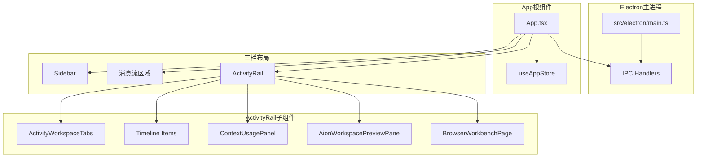

# 前端 Shell 与组件总览

<cite>

**本文引用的文件**

- [src/ui/App.tsx](file://src/ui/App.tsx)
- [src/ui/App.css](file://src/ui/App.css)
- [src/ui/components/ActivityRail.tsx](file://src/ui/components/ActivityRail.tsx)
- [src/ui/components/ActivityWorkspaceTabs.tsx](file://src/ui/components/ActivityWorkspaceTabs.tsx)
- [src/ui/components/AionWorkspacePreviewPane.css](file://src/ui/components/AionWorkspacePreviewPane.css)
- [src/ui/components/AionWorkspacePreviewPane.tsx](file://src/ui/components/AionWorkspacePreviewPane.tsx)
- [src/ui/components/BrowserWorkbenchPage.tsx](file://src/ui/components/BrowserWorkbenchPage.tsx)
- [src/ui/components/ComposerContextCard.tsx](file://src/ui/components/ComposerContextCard.tsx)
- [src/electron/main.ts](file://src/electron/main.ts)

</cite>

---

## 目录

- [概述：Shell 职责划分](#概述shell-职责划分)
- [组件协作总览](#组件协作总览)
- [App 根组件](#app-根组件)
- [ActivityRail 活动轨道](#activityrail-活动轨道)
- [ActivityWorkspaceTabs 标签页](#activityworkspacetabs-标签页)
- [AionWorkspacePreviewPane 预览窗格](#aionworkspacepreviewpane-预览窗格)
- [BrowserWorkbenchPage 浏览器工作台](#browserworkbenchpage-浏览器工作台)
- [ComposerContextCard 上下文卡片](#composercontextcard-上下文卡片)
- [样式体系与主题变量](#样式体系与主题变量)
- [扩展点与改造路径](#扩展点与改造路径)
- [常见问题排查](#常见问题排查)
- [验证命令](#验证命令)

---

## 概述：Shell 职责划分

`src/ui` 目录是整个前端应用的 Shell 层，采用**单页应用 + 三栏布局**结构：

- **左栏**：会话侧边栏（Sidebar），负责会话列表和会话切换
- **中栏**：消息流区域，展示 AI 响应、工具调用和过程详情
- **右栏**：ActivityRail（活动轨道），展示执行追踪、上下文用量和计划进度

核心文件职责：

| 文件 | 职责 | 关键类型/常量 |
|------|------|---------------|
| `App.tsx` | 根组件，协调三栏布局，管理会话状态和 IPC 通信 | `StreamMessage`, `useAppStore` |
| `App.css` | 全局主题变量，定义 light/dark 两套色板 | CSS Custom Properties |
| `ActivityRail.tsx` | 右侧活动轨道主体，渲染时间线和用量面板 | `ActivityTimelineItem` |
| `ActivityWorkspaceTabs.tsx` | 工作区标签页切换（browser/trace/usage/git） | `ActivityWorkspaceTab` |
| `AionWorkspacePreviewPane.tsx` | 文件预览面板，集成 Monaco Editor | `ActivePreviewFile` |
| `BrowserWorkbenchPage.tsx` | 本地浏览器工作台，支持截图和注解 | `LocalBrowserTarget` |
| `ComposerContextCard.tsx` | 上下文附件卡片（代码/文件/浏览器引用） | `ComposerContextTone` |
| `electron/main.ts` | Electron 主进程，处理 IPC 调度和系统级操作 | `BrowserWorkbenchManager` |

章节来源：[src/ui/App.tsx#L327-L370](file://src/ui/App.tsx#L327-L370)（App 组件状态定义）

---

## 组件协作总览



**数据流向**：

1. 用户操作 → App.tsx 捕获事件 → 通过 `useIPC` 发送 IPC 到 Electron 主进程
2. 主进程处理后发送 `ServerEvent` → App.tsx 接收并更新 `useAppStore`
3. Store 变化触发 ActivityRail 重新渲染，展示时间线和指标
4. 用户点击时间线项 → 右侧预览窗格加载对应文件内容

章节来源：[src/ui/App.tsx#L6-L16](file://src/ui/App.tsx#L6-L16)（导入链）

---

## App 根组件

### 核心职责

`App.tsx` 是整个前端应用的入口点，承担以下职责：

1. **会话管理**：管理多会话状态、切换活跃会话、历史消息加载
2. **IPC 通信桥接**：通过 `useIPC` hook 连接 Electron 主进程
3. **布局控制**：管理三栏宽度、面板显隐、滚动行为
4. **消息流渲染**：将 `StreamMessage` 转换为可折叠的过程组卡片

### 关键状态

```typescript
// 核心布局状态 - 行 354-367
const [sidebarWidth, setSidebarWidth] = useState(320);
const [activityRailWidth, setActivityRailWidth] = useState(420);
const [resizingPane, setResizingPane] = useState<"sidebar" | "activityRail" | null>(null);

// 工作区视图状态 - 行 349-350
const [workspaceViewBySessionId, setWorkspaceViewBySessionId] = useState<Record<string, WorkspaceView>>({});
// WorkspaceView = "chat" | "browser"

// 运行时源检测 - 行 351
const [runtimeSource, setRuntimeSource] = useState<DevElectronRuntimeSource>(() => getDevElectronRuntimeSource());
```

### 消息渲染分组

`App.tsx` 将连续的工具调用消息聚合为可折叠的 `ProcessGroupCard`：

```typescript
// 行 61-79: 判断是否为过程消息
function isProcessMessage(message: StreamMessage): boolean {
  if (message.type === "assistant") {
    return contentItems.every((item) => 
      isRecord(item) && item.type === "tool_use" && item.name !== "AskUserQuestion"
    );
  }
  if (message.type === "user") {
    return contentItems.every((item) => isRecord(item) && item.type === "tool_result");
  }
  return false;
}
```

### 入口条件

```typescript
// 行 35-40: 布局尺寸约束
const MIN_CENTER_WIDTH = 300;
const MIN_SIDEBAR_WIDTH = 250;
const MIN_ACTIVITY_RAIL_WIDTH = 400;
```

章节来源：[src/ui/App.tsx#L327-L368](file://src/ui/App.tsx#L327-L368)（App 组件状态定义）

---

## ActivityRail 活动轨道

### 职责

ActivityRail 是右侧活动面板的核心组件，负责：

1. **时间线展示**：按阶段（inspect/implement/verify/deliver）分组显示执行事件
2. **上下文用量可视化**：展示 Token 消耗和上下文窗口占用
3. **附件与材料状态**：追踪 Figma REST、节点锚点、对比结果等
4. **计划进度**：显示 AI 生成的任务计划完成状态

### 时间线数据结构

```typescript
// 行 24-44: 节点类型标签
const NODE_KIND_LABELS: Record<ActivityTimelineItem["nodeKind"], string> = {
  context: "上下文",
  plan: "AI 计划",
  assistant_output: "AI 输出",
  tool_input: "工具调用",
  retrieval: "检索",
  file_read: "读文件",
  file_write: "写文件",
  terminal: "终端",
  browser: "浏览器",
  memory: "Memory",
  mcp: "MCP",
  handoff: "子 Agent",
  error: "错误",
  lifecycle: "生命周期",
  permission: "人工确认",
};

// 行 46-54: 阶段顺序和标签
const STAGE_ORDER = ["inspect", "implement", "verify", "deliver"] as const;
const STAGE_LABELS: Record<string, string> = {
  inspect: "检查与理解",
  implement: "实施与修改",
  verify: "验证与确认",
  deliver: "整理与输出",
};
```

### 时间线渲染逻辑

```typescript
// 行 164-210: 按阶段分组渲染
function renderTimelineWithStages(timeline, selectedId, onSelect) {
  const stageGroups = [];
  // 按 stageKind 分组
  for (const item of timeline) {
    const stage = item.stageKind;
    if (stage !== currentStage && currentGroup.length > 0) {
      stageGroups.push({ stage: currentStage, items: currentGroup });
      currentGroup = [];
    }
    currentStage = stage;
    currentGroup.push(item);
  }
  return stageGroups.map((group) => (
    <div key={group.stage}>
      {/* 主阶段显示完整，其他阶段淡化 */}
      <div className={isMainStage ? "" : "opacity-60"}>
        {/* 阶段标题 + 分隔线 */}
        <span className="text-[10px] font-bold uppercase tracking-[0.18em]">
          {STAGE_LABELS[group.stage] ?? group.stage}
        </span>
        {/* 时间线项列表 */}
        {group.items.map((item) => (
          <TimelineItemRow key={item.id} item={item} ... />
        ))}
      </div>
    </div>
  ));
}
```

### 附件状态检测

```typescript
// 行 280-358: 构建材料状态项
function buildMaterialStatusItems(model, partialMessage) {
  // 检测 Figma 相关工具
  const figmaToolNames = Array.from(new Set(
    model.timeline
      .map((item) => item.toolName)
      .filter((toolName) => /figma/i.test(toolName ?? ""))
  ));

  // 检测锚点字段
  const anchorFieldNames = [
    "nodeId", "nodeIds", "node-id", "fileKey", "fileKeyOrUrl", "node_anchor"
  ].filter((field) => timelineText.includes(field));

  // 检测对比结果有效性
  const compareInvalid = compareDetected && /invalid|failed|error|mismatch/i.test(timelineText);

  return [
    { id: "attachment-read", label: "附件", tone: latestAttachments.length > 0 ? "success" : "neutral" },
    { id: "figma-rest-read", label: "Figma REST", tone: figmaEvidence ? "info" : "neutral" },
    { id: "figma-node-anchor", label: "节点锚点", tone: anchorDetected ? "success" : "warning" },
    { id: "figma-compare", label: "对比结果", tone: compareInvalid ? "error" : "success" },
  ];
}
```

章节来源：[src/ui/components/ActivityRail.tsx#L1-L55](file://src/ui/components/ActivityRail.tsx#L1-L55)（类型定义）

---

## ActivityWorkspaceTabs 标签页

### 职责

简单的标签页切换组件，控制 ActivityRail 内部的视图切换。

### 标签定义

```typescript
// 从 ../utils/activity-workspace-tabs 导入
import { buildActivityWorkspaceTabs, shouldShowCreateBrowserTab } from "../utils/activity-workspace-tabs";

// 行 81: 构建可见标签
const tabs = buildActivityWorkspaceTabs({ activeTab, showBrowserTab }).filter((tab) => tab.visible);
```

### 图标映射

```typescript
// 行 18-60: 每个 tab 类型对应一个 SVG 图标
function iconForTab(tab: ActivityWorkspaceTab) {
  if (tab === "browser") {
    // 圆形浏览器图标
    return <svg>...</svg>; // globe icon
  }
  if (tab === "trace") {
    // 三横线图标
    return <svg>...</svg>; // list icon
  }
  if (tab === "usage") {
    // 柱状图图标
    return <svg>...</svg>; // bar chart icon
  }
  if (tab === "git") {
    // Git 分支图标
    return <svg>...</svg>; // git icon
  }
  // 默认：文档图标
}
```

### Props 接口

```typescript
// 行 7-16
type ActivityWorkspaceTabsProps = {
  activeTab: ActivityWorkspaceTab;
  showBrowserTab: boolean;
  showLabels?: boolean;
  browserLabel?: string;
  showCreateBrowserTab?: boolean;
  onSelectTab: (tab: ActivityWorkspaceTab) => void;
  onCloseBrowserTab?: () => void;
  onCreateBrowserTab?: () => void;
};
```

章节来源：[src/ui/components/ActivityWorkspaceTabs.tsx#L1-L81](file://src/ui/components/ActivityWorkspaceTabs.tsx#L1-L81)

---

## AionWorkspacePreviewPane 预览窗格

### 职责

文件预览面板，集成 Monaco Editor 支持代码高亮和语法提示，同时支持：

1. **NativeExplorer**：目录树导航
2. **QuickOpenPalette**：快速文件搜索（`Ctrl+P`）
3. **PreviewSurface**：预览内容展示（代码/HTML/图片）
4. **MonacoEditor**：代码编辑器（读取模式）

### 关键数据结构

```typescript
// 行 82-116: 核心类型
type PreviewEntry = {
  name: string;
  path: string;
  relativePath: string;
  type: 'directory' | 'file';
  size?: number;
};

type ActivePreviewFile = {
  path: string;
  fileName: string;
  relativePath: string;
  content: string;
  contentType: 'code' | 'html' | 'image';
  language?: string;
  loading?: boolean;
  error?: string;
  revealLine?: number;
};

type PreviewContentType = 'code' | 'html' | 'image';
```

### Monaco 配置

```typescript
// 行 47-68: Web Worker 配置
if (!monacoGlobal.MonacoEnvironment?.getWorker) {
  monacoGlobal.MonacoEnvironment = {
    getWorker(_: string, label: string) {
      if (label === 'json') {
        return new Worker(new URL('monaco-editor/esm/vs/language/json/json.worker.js', import.meta.url), { type: 'module' });
      }
      if (label === 'typescript' || label === 'javascript') {
        return new Worker(new URL('monaco-editor/esm/vs/language/typescript/ts.worker.js', import.meta.url), { type: 'module' });
      }
      // ...
    },
  };
}
```

### 内容类型推断

```typescript
// 行 142-158: 判断预览方式
function inferContentType(filePath: string, content?: string): PreviewContentType {
  // Base64 图片直接识别
  if (content?.startsWith('data:image/')) return 'image';
  
  // HTML 文件特殊处理：检查是否为运行时外壳
  const extension = getFileExtension(filePath);
  if (extension === 'html' || extension === 'htm') {
    if (isRuntimeHtmlShell(content)) return 'code'; // 用 Monaco 预览
    return 'html'; // 用 iframe 预览
  }
  return 'code';
}

function isRuntimeHtmlShell(content?: string) {
  return (
    /<div\s+id=["'](?:root|app)["'][^>]*>\s*<\/div>/i.test(content) &&
    /<script[^>]+type=["']module["'][^>]+src=["'][^"']*(?:\/src\/|\/assets\/|\.tsx?|\.jsx?)/i.test(content)
  );
}
```

### 目录加载 IPC 调用

```typescript
// 行 220-255: 加载目录内容
const loadDirectory = useCallback(async (path: string, force = false) => {
  const result = await window.electron.listPreviewDirectory({ cwd: workspace, path });
  if (!result.success || !result.entries) {
    setDirectoryCache((current) => ({
      ...current,
      [path]: { entries: [], loading: false, error: result.error || '目录读取失败。' }
    }));
    return [];
  }
  // ...
}, [workspace]);
```

章节来源：[src/ui/components/AionWorkspacePreviewPane.tsx#L75-L175](file://src/ui/components/AionWorkspacePreviewPane.tsx#L75-L175)

---

## BrowserWorkbenchPage 浏览器工作台

### 职责

嵌入式的本地浏览器预览，支持：

1. **本地服务器探测**：自动检测 localhost 常见端口（3000, 5173, 8080 等）
2. **iframe 预览**：在应用内加载网页
3. **截图捕获**：使用 SVG+foreignObject 方案生成页面快照
4. **截图附件**：将截图附加到当前会话

### 关键状态

```typescript
// 行 23-30: 浏览器状态
const defaultBrowserState: BrowserWorkbenchState = {
  url: "",
  title: "",
  loading: false,
  canGoBack: false,
  canGoForward: false,
  annotationMode: false,
};

// 行 43-50: 本地目标类型
type LocalBrowserTarget = {
  id: string;
  title: string;
  host: string;
  url: string;
  current?: boolean;
  recent?: boolean;
};
```

### 本地目标探测

```typescript
// 行 52-74: 探测本地服务可用性
const COMMON_LOCAL_BROWSER_PORTS = [3000, 4173, 5173, 8000, 8001, 8080];

async function probeLocalTarget(url: string, timeoutMs = 1400): Promise<LocalTargetStatus> {
  const controller = new AbortController();
  const timeout = window.setTimeout(() => controller.abort(), timeoutMs);
  try {
    await fetch(url, { cache: "no-store", mode: "no-cors", signal: controller.signal });
    return "online";
  } catch {
    return "offline";
  } finally {
    window.clearTimeout(timeout);
  }
}

// 行 267-287: 构建本地目标列表
function buildLocalBrowserTargets(workspaceKey: string): LocalBrowserTarget[] {
  const targets = new Map<string, LocalBrowserTarget>();
  
  // 1. 当前应用 URL（如果是本地）
  addTarget(toBrowserPageTarget(window.location.href, { localOnly: true }));
  
  // 2. localStorage 中的最近访问
  for (const target of readRecentLocalBrowserTargets(workspaceKey)) {
    addTarget(target);
  }
  
  // 3. 常见本地端口
  for (const port of COMMON_LOCAL_BROWSER_PORTS) {
    addTarget(toBrowserPageTarget(`http://localhost:${port}/`, { localOnly: true }));
  }
  
  return Array.from(targets.values()).slice(0, MAX_LOCAL_BROWSER_TARGETS);
}
```

### 截图捕获方案

```typescript
// 行 155-206: 使用 SVG foreignObject 捕获 iframe 内容
async function capturePreviewFrameVisible(frame: HTMLIFrameElement): Promise<string | null> {
  const documentRef = frame.contentDocument;
  if (!documentRef || !documentRef.documentElement) return null;

  // 克隆 DOM 并移除脚本
  const clone = sourceHtml.cloneNode(true) as HTMLElement;
  clone.querySelectorAll("script").forEach((script) => script.remove());

  // 序列化为 SVG
  const svg = `
    <svg xmlns="http://www.w3.org/2000/svg" width="${width}" height="${height}" viewBox="0 0 ${width} ${height}">
      <foreignObject width="100%" height="100%">${serialized}</foreignObject>
    </svg>
  `;
  
  // 渲染到 Canvas 并输出 PNG
  const image = await new Promise<HTMLImageElement>((resolve, reject) => {
    const img = new Image();
    img.onload = () => resolve(img);
    img.onerror = () => reject(new Error("render failed"));
    img.src = URL.createObjectURL(new Blob([svg], { type: "image/svg+xml" }));
  });
  
  context.drawImage(image, 0, 0);
  return canvas.toDataURL("image/png");
}
```

章节来源：[src/ui/components/BrowserWorkbenchPage.tsx#L20-L154](file://src/ui/components/BrowserWorkbenchPage.tsx#L20-L154)

---

## ComposerContextCard 上下文卡片

### 职责

展示当前输入框附加的上下文引用，包括代码引用、文件引用、浏览器截图等。

### Props 接口

```typescript
// 行 1-13
export type ComposerContextTone = "code" | "browser" | "file" | "message";

export type ComposerContextCardProps = {
  index: number;           // 编号徽章
  tone: ComposerContextTone; // 视觉主题
  label: string;           // 类型标签
  title: string;           // 主标题
  meta?: string;          // 副标题/元信息
  detail?: string;         // Tooltip 详情
  onOpen?: () => void;     // 点击打开回调
  onRemove: () => void;    // 移除回调
  onCopy?: () => void;     // 复制回调
};
```

### 样式映射

```typescript
// 行 26-33: 根据 tone 应用不同配色
const toneClass = tone === "code"
  ? "border-[#d0d7de] bg-white text-[#0969da]"      // GitHub 蓝
  : tone === "browser"
    ? "border-accent/16 bg-white text-accent"        // 主题橙色
    : tone === "file"
      ? "border-black/8 bg-white text-ink-800"       // 墨色
      : "border-accent/18 bg-[rgba(253,244,241,0.86)] text-ink-800"; // 暖白

const badgeClass = tone === "code" ? "bg-[#0969da]" : "bg-accent";
```

### 视觉结构

```
┌─────────────────────────────────────────────────────┐
│ [1] [文件] api-handler.ts · 120 行    ⧉    ✕       │
└─────────────────────────────────────────────────────┘
  │    │      │              │    │    │    │
  │    │      │              │    │    │    └─ 移除按钮
  │    │      │              │    │    └──── 复制按钮（可选）
  │    │      │              │    └───────── 元信息
  │    │      │              └────────────── 标题（可点击）
  │    │      └───────────────────────────── 标签
  │    └───────────────────────────────────── 编号徽章
  └────────────────────────────────────────── 配色条
```

章节来源：[src/ui/components/ComposerContextCard.tsx#L1-L77](file://src/ui/components/ComposerContextCard.tsx#L1-L77)

---

## 样式体系与主题变量

### CSS 变量定义

```css
/* src/ui/App.css 行 7-91 */

/* 亮色主题 */
:root {
  --background: #F8F9FB;
  --foreground: #16181D;
  --primary: #D26A3D;      /* 主题橙 */
  --accent: #D26A3D;       /* 强调色 */
  --muted: #F3F4F6;        /* 灰色背景 */
  --border: #E6EAF0;       /* 边框色 */
  --chart-1: #D26A3D;      /* 图表配色方案 */
  --chart-2: #2563EB;
  --chart-3: #16A34A;
}

/* 暗色主题 */
.dark {
  --background: #16181D;
  --foreground: #F8F9FB;
  --primary: #F2C2AD;      /* 亮色模式下橙色变浅 */
  --accent: #F2C2AD;
  --muted: #3D4450;
  --border: #3D4450;
  --chart-1: #F2C2AD;
  --chart-2: #93C5FD;
  --chart-3: #86EFAC;
}

/* 圆角系统 */
--radius: 0.6rem;          /* 基础圆角 */
--radius-sm: calc(var(--radius) - 4px);
--radius-md: calc(var(--radius) - 2px);
--radius-lg: var(--radius);
--radius-xl: calc(var(--radius) + 4px);
```

### Tailwind 集成

```css
/* 行 93-101: Tailwind base layer */
@layer base {
  * {
    @apply border-border outline-ring/50;
  }

  body {
    @apply bg-background text-foreground;
  }
}
```

### Aion 工作台样式（独立命名空间）

```css
/* src/ui/components/AionWorkspacePreviewPane.css 行 1-18 */
/* 使用独立变量避免污染全局主题 */
.aion-workbench {
  --aion-paper: #ffffff;
  --aion-sidebar: #f3f3f3;
  --aion-line: #d8dee4;
  --aion-ink: #24292f;
  --aion-muted: #6e7781;
  --aion-accent: #0969da;
  --aion-accent-soft: #ddf4ff;
}
```

章节来源：[src/ui/App.css#L1-L117](file://src/ui/App.css#L1-L117)

---

## 扩展点与改造路径

### 1. 添加新的 ActivityRail 面板内容

**场景**：需要展示新的分析指标或追踪数据

**步骤**：

1. 在 `ActivityRail.tsx` 中定义新的渲染函数
2. 导入对应模型类型（如 `buildActivityRailModel`）
3. 挂载到时间线区域或作为独立面板

```typescript
// 示例：添加新的指标面板
function MetricsStrip({ model }: { model: ReturnType<typeof buildActivityRailModel> }) {
  const metrics = model.executionMetrics;
  return (
    <div className="flex gap-4">
      <span>成功: {metrics.successCount}</span>
      <span>失败: {metrics.failureCount}</span>
      <span>总计: {metrics.totalCount}</span>
    </div>
  );
}
```

### 2. 添加新的浏览器工作台功能

**场景**：需要支持新的浏览器内工具或截图注解

**步骤**：

1. 在 `BrowserWorkbenchPage.tsx` 中扩展 `BrowserWorkbenchAnnotation` 类型
2. 添加新的注解渲染逻辑
3. 通过 `setSessionBrowserAnnotations` 更新状态

```typescript
// 添加标注工具类型
type AnnotationTool = "screenshot" | "page" | "highlight"; // 新增 highlight

// 扩展状态处理
const handleAnnotationAdd = (tool: AnnotationTool, data: unknown) => {
  // 根据 tool 类型处理不同数据格式
};
```

### 3. 添加新的 WorkspaceTab

**场景**：需要在 ActivityRail 中添加新的视图选项卡

**步骤**：

1. 在 `src/ui/utils/activity-workspace-tabs.ts` 中添加新的 tab 定义
2. 在 `ActivityWorkspaceTabs.tsx` 中添加对应图标
3. 在对应页面组件中处理新 tab 的渲染逻辑

```typescript
// 在 activity-workspace-tabs.ts 中
export type ActivityWorkspaceTab = "browser" | "trace" | "usage" | "git" | "custom";

// 添加构建逻辑
export function buildActivityWorkspaceTabs(props: Props): ActivityWorkspaceTabConfig[] {
  // ... 现有逻辑
  return [
    // ... 现有 tabs
    { id: "custom", label: "自定义", visible: true, active: props.activeTab === "custom" }
  ];
}
```

### 4. 修改 Monaco Editor 配置

**场景**：需要调整代码高亮规则或添加新语言支持

**步骤**：

1. 修改 `AionWorkspacePreviewPane.tsx` 中的 `configurePreviewMonacoDefaults`
2. 或直接在组件中设置 `Editor` 的 `options` prop

```typescript
// 在 load 或 beforeMount 回调中配置
loader.config({
  paths: { vs: '...' },
  'editor.defaultLanguage': 'typescript',
  'editor.tokenizer': { /* 自定义规则 */ }
});
```

章节来源：[src/ui/components/ActivityRail.tsx#L384-L411](file://src/ui/components/ActivityRail.tsx#L384-L411)（ContextUsagePanel 示例）

---

## 常见问题排查

### 问题 1：ActivityRail 不显示时间线项

**排查步骤**：

1. 确认 `useAppStore` 中该会话的 `timelineItems` 是否为空
2. 检查事件流是否正确发送 `timeline-item` 事件
3. 验证 `buildActivityRailModel` 能否正确解析事件

```typescript
// 在 DevTools Console 中执行
const state = window.__APP_STORE__?.getState?.();
console.log('Timeline:', state?.sessions?.[sessionId]?.timelineItems);
console.log('Model:', buildActivityRailModel(state?.sessions?.[sessionId]?.timelineItems));
```

### 问题 2：Monaco Editor 加载失败

**排查步骤**：

1. 检查 Web Worker 配置是否正确（行 47-68）
2. 确认 `import.meta.url` 在打包环境中的可用性
3. 检查 Monaco 包是否正确安装

```typescript
// 降级为 CDN 加载模式
loader.config({
  paths: { vs: 'https://cdn.jsdelivr.net/npm/monaco-editor@0.45.0/min/vs' }
});
```

### 问题 3：浏览器工作台无法加载本地页面

**排查步骤**：

1. 确认 Electron 是否正确注入 `openBrowserWorkbench` 方法
2. 检查 `DEV_BROWSER_PREVIEW_FLAG` 是否被正确传递
3. 验证 iframe 的 `sandbox` 属性允许加载目标

```typescript
// 检查浏览器运行时检测
const isPreview = isBrowserPreviewRuntime(); // 行 32-35
const hasRuntime = hasBrowserWorkbenchRuntime(); // 行 37-41
console.log({ isPreview, hasRuntime });
```

### 问题 4：样式变量不生效

**排查步骤**：

1. 确认 CSS 文件已正确导入
2. 检查是否有其他样式覆盖（检查 DevTools Elements 面板）
3. 确认 `@layer base` 规则未被其他 CSS 打断

```bash
# 检查构建后的 CSS 变量
grep -r "var(--primary)" dist/
```

章节来源：[src/ui/components/AionWorkspacePreviewPane.tsx#L47-L68](file://src/ui/components/AionWorkspacePreviewPane.tsx#L47-L68)（Monaco Worker 配置）

---

## 验证命令

### 前端构建验证

```bash
# 检查 TypeScript 类型
cd src/ui && npx tsc --noEmit

# 启动开发服务器
npm run dev

# 打包检查
npm run build
```

### 组件渲染测试

```bash
# 使用 Playwright 截图验证布局
npx playwright test --grep "ActivityRail"

# 检查特定组件挂载
node -e "
const { JSDOM } = require('jsdom');
const dom = new JSDOM('<div id=root></div>');
global.document = dom.window.document;
require('./src/ui/components/ActivityRail.tsx');
"
```

### Electron IPC 测试

```bash
# 检查 preload 是否正确注入
npm run electron:dev -- --check-preload

# 验证 IPC 通道
node -e "
const { ipcRenderer } = require('electron');
console.log('Channels:', Object.keys(ipcRenderer._events));
"
```

### 样式验证

```bash
# 检查 CSS 变量定义完整性
grep -c "^--" src/ui/App.css

# 验证 Tailwind 类名有效
npm run lint:tailwind

# 检查深色模式切换
node -e "
document.documentElement.classList.toggle('dark');
const bg = getComputedStyle(document.documentElement).getPropertyValue('--background').trim();
console.log('Background:', bg);
"
```

---

**文档版本**：v1.0  
**最后更新**：基于当前 `src/ui` 源码分析  
**相关文档**：[前端信息架构](file://doc/30-operations/30-前端信息架构.md) | [组件索引](file://doc/40-product/1.0.0/48-组件索引.md)