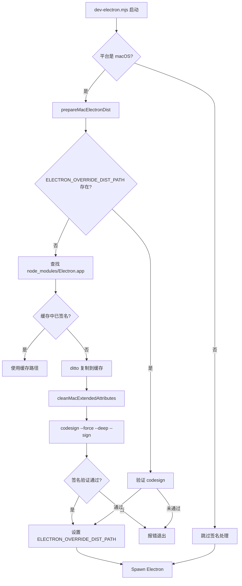
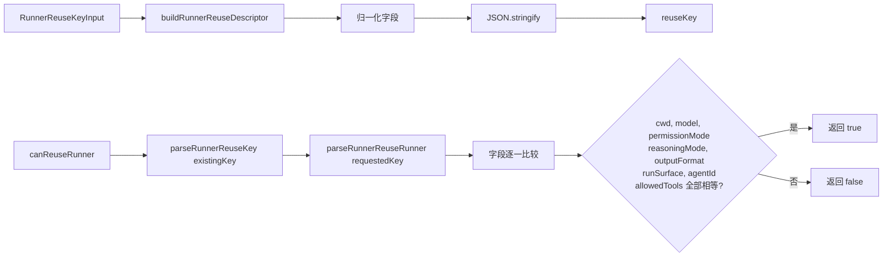

# 发布包与分发配置总览

<cite>
**本文引用的文件**
- [package/README.md](file://package/README.md)
- [package/package.json](file://package/package.json)
- [package/LICENSE.md](file://package/LICENSE.md)
- [package/agentSdkTypes.d.ts](file://package/agentSdkTypes.d.ts)
- [package/assistant.d.ts](file://package/assistant.d.ts)
- [package/bridge.d.ts](file://package/bridge.d.ts)
- [package/browser-sdk.d.ts](file://package/browser-sdk.d.ts)
- [package/manifest.json](file://package/manifest.json)
- [src/electron/libs/runner.ts](file://src/electron/libs/runner.ts)
- [src/electron/libs/runner-reuse.ts](file://src/electron/libs/runner-reuse.ts)
- [src/electron/main.ts](file://src/electron/main.ts)
- [src/electron/preload.cts](file://src/electron/preload.cts)
- [src/electron/libs/system-prompt-presets.ts](file://src/electron/libs/system-prompt-presets.ts)
- [package/manifest.zst.json](file://package/manifest.zst.json)
- [scripts/dev-electron.mjs](file://scripts/dev-electron.mjs)
- [scripts/github-release.mjs](file://scripts/github-release.mjs)
</cite>

# 发布包与分发配置总览

> **模块定位**：`module-package` 是 tech-cc-hub 的分发层，负责将 SDK、Electron 应用、平台二进制产物打包并发布到 npm、GitHub Release 和终端用户。本文档面向开发者解释分发架构、关键入口、调用链和改造扩展点。

---

## 目录

1. [职责边界与组件定位](#1-职责边界与组件定位)
2. [package/ 目录结构与 SDK 分发](#2-package-目录结构与-sdk-分发)
3. [manifest.json / manifest.zst.json 数据结构](#3-manifestjson--manifestzstjson-数据结构)
4. [Electron 应用分发入口](#4-electron-应用分发入口)
5. [Runner 调用链与 SDK 集成](#5-runner-调用链与-sdk-集成)
6. [IPC 桥接与前后端通信](#6-ipc-桥接与前后端通信)
7. [常见失败模式与排障](#7-常见失败模式与排障)
8. [扩展点与改造路径](#8-扩展点与改造路径)
9. [Agent 改代码地图](#9-agent-改代码地图)
10. [验证命令速查](#10-验证命令速查)

---

## 1. 职责边界与组件定位

tech-cc-hub 的分发层分为两条独立的线：

| 分发线 | 产物 | 入口文件 | 目标用户 |
|--------|------|----------|----------|
| **SDK 分发** | `@anthropic-ai/claude-agent-sdk` npm 包 | `package/package.json` | 第三方开发者集成 Claude Code 能力 |
| **Electron 应用分发** | 可安装的桌面客户端 | `scripts/github-release.mjs`, `scripts/dev-electron.mjs` | 终端用户 / CI 环境 |

**SDK 分发的核心职责**：
- 提供 TypeScript/JavaScript SDK，让外部项目能调用 Claude Code 的 agent 能力
- 通过 `package.json` 的 `exports` 字段暴露多个子入口：`/`、`/browser`、`/bridge`、`/assistant`、`/sdk-tools`
- 通过 `optionalDependencies` 声明平台特定二进制（可选本地加速）

**Electron 应用分发的核心职责**：
- 将 Electron 应用打包为 `.app` / `.exe` / `.AppImage`
- 管理版本号、changelog、GitHub Release 自动化发布
- 处理 macOS 代码签名（`codesign --verify`）和 extended attributes 清理

章节来源：[package/package.json#L1-L29](file://package/package.json#L1-L29)

---

## 2. package/ 目录结构与 SDK 分发

### 2.1 多入口 export 配置

`package.json` 通过 `exports` 字段定义子模块入口，这是 SDK 风格的关键设计：

```typescript
// 入口点映射关系
exports: {
  ".":            { types: "./sdk.d.ts", default: "./sdk.mjs" },           // 核心 SDK
  "./browser":    { types: "./browser-sdk.d.ts", default: "./browser-sdk.js" },
  "./bridge":     { types: "./bridge.d.ts", default: "./bridge.mjs" },
  "./assistant":  { types: "./assistant.d.ts", default: "./assistant.mjs" },
  "./sdk-tools":  { types: "./sdk-tools.d.ts" }
}
```

**为什么需要多入口？**
- `/assistant` 面向 assistant worker 场景（长时间运行的 agent）
- `/bridge` 面向远程会话桥接（连接 claude.ai 的 code session）
- `/browser` 面向 Web 端 WebSocket 查询

章节来源：[package/package.json#L6-L28](file://package/package.json#L6-L28)

### 2.2 平台可选依赖

```json
"optionalDependencies": {
  "@anthropic-ai/claude-agent-sdk-linux-x64": "0.2.137",
  "@anthropic-ai/claude-agent-sdk-linux-arm64": "0.2.137",
  "@anthropic-ai/claude-agent-sdk-darwin-x64": "0.2.137",
  "@anthropic-ai/claude-agent-sdk-darwin-arm64": "0.2.137",
  "@anthropic-ai/claude-agent-sdk-win32-x64": "0.2.137",
  "@anthropic-ai/claude-agent-sdk-win32-arm64": "0.2.137"
}
```

平台特定包提供本地编译的二进制加速。当这些包安装失败时，SDK 仍可工作（回退到网络调用）。

章节来源：[package/package.json#L57-L66](file://package/package.json#L57-L66)

### 2.3 发布文件清单

```json
"files": [
  "sdk.mjs", "sdk.d.ts", "sdk-tools.d.ts",
  "agentSdkTypes.d.ts",
  "bridge.mjs", "bridge.d.ts",
  "assistant.mjs", "assistant.d.ts",
  "browser-sdk.js", "browser-sdk.d.ts",
  "manifest.json", "manifest.zst.json"
]
```

注意：不包含 TypeScript 源码（`.ts`），只发布编译后的 `.mjs`/`.d.ts` 文件。

章节来源：[package/package.json#L67-L80](file://package/package.json#L67-L80)

---

## 3. manifest.json / manifest.zst.json 数据结构

### 3.1 核心数据结构

**manifest.json**：未压缩的二进制分发清单

```json
{
  "version": "2.1.137",
  "commit": "88a017e5d1d4c7de4e6de6a496ac08c9c1b77d79",
  "buildDate": "2026-05-08T23:09:27Z",
  "platforms": {
    "darwin-arm64": {
      "binary": "claude",
      "checksum": "6d91ce741b8aa...（sha256）",
      "size": 205062416
    },
    "linux-x64": {
      "binary": "claude",
      "checksum": "ae29f87fdee2d...（sha256）",
      "size": 230577872
    },
    "win32-x64": {
      "binary": "claude.exe",
      "checksum": "4bb6443d1362...（sha256）",
      "size": 226494112
    }
  }
}
```

**manifest.zst.json**：Zstd 压缩格式的清单，包含额外的 `bundle` 字段

```json
{
  "darwin-arm64": {
    "binary": "claude.zst",
    "checksum": "b381dc330330a...（sha256）",
    "size": 42514413,
    "bundle": {
      "checksum": "b498ae41fb58a...",
      "size": 42522515
    }
  }
}
```

**关键字段说明**：

| 字段 | 含义 |
|------|------|
| `version` | SDK/CLI 版本号，语义化版本 |
| `commit` | 对应源代码 commit SHA |
| `buildDate` | 构建时间戳 |
| `binary` | 可执行文件名（平台约定） |
| `checksum` | SHA256 校验和，用于完整性验证 |
| `size` | 文件字节数 |
| `bundle`（zst） | 包含完整分发包的校验信息 |

章节来源：[package/manifest.json#L1-L46](file://package/manifest.json#L1-L46)，[package/manifest.zst.json#L1-L56](file://package/manifest.zst.json#L1-L56)

### 3.2 使用场景

| 场景 | 使用哪个 manifest |
|------|-------------------|
| 下载未压缩二进制 | `manifest.json` |
| 传输体积优化（压缩包） | `manifest.zst.json` |
| 校验下载完整性 | 比较 `checksum` 字段 |

**典型校验流程**：
```typescript
// 伪代码示例
const manifest = await fetch(`${BASE_URL}/manifest.json`).then(r => r.json());
const platform = `${os}-${arch}`; // e.g. "linux-x64"
const { binary, checksum, size } = manifest.platforms[platform];
```

---

## 4. Electron 应用分发入口

### 4.1 开发启动脚本 `scripts/dev-electron.mjs`

**职责**：启动本地 Electron 开发环境，处理 macOS 代码签名和缓存。

**关键流程图**：



**关键函数**：

| 函数 | 行号 | 职责 |
|------|------|------|
| `electronVersionLabel()` | 47-52 | 从 `package.json` 读取 Electron 版本号 |
| `cleanMacExtendedAttributes()` | 55-70 | 清理 macOS 扩展属性（FinderInfo、quarantine 等） |
| `prepareMacElectronDist()` | 72-108 | 管理 Electron.app 缓存和签名 |
| `verifyCodesign()` | 34-41 | 调用 `codesign --verify --deep --strict` 验证签名 |

章节来源：[scripts/dev-electron.mjs#L47-L108](file://scripts/dev-electron.mjs#L47-L108)

### 4.2 GitHub Release 脚本 `scripts/github-release.mjs`

**职责**：自动化 GitHub Release 发布流程，包括版本号管理、changelog 生成、tag 创建、GitHub API 调用。

**核心函数**：

| 函数 | 行号 | 职责 |
|------|------|------|
| `bumpVersion()` | 143-166 | 计算新版本号（major/minor/patch） |
| `ensureCleanWorktree()` | 187-196 | 检查 git 工作区是否干净 |
| `ensureTagDoesNotExist()` | 199-212 | 防止重复 tag |
| `getGithubToken()` | 235-252 | 从环境变量或 git credential 获取 token |
| `githubApiRequest()` | 254-? | 封装 GitHub REST API 请求 |
| `getCommitsSinceTag()` | 301-? | 获取上次 tag 后的 commits |
| `createReleaseBody()` | 318-? | 生成 Release body |

**使用方式**：
```bash
# 标准发布流程
npm run release:github -- patch

# 指定版本
npm run release:github -- minor

# dry-run 预览
npm run release:github -- patch --dry-run

# 跳过 push
npm run release:github -- patch --no-push

# 允许 dirty worktree
npm run release:github -- patch --allow-dirty
```

**前置检查**：
1. 确保是 git 仓库
2. 确保 worktree 干净（或传 `--allow-dirty`）
3. 确保本地和远程都没有同名 tag
4. 确保 origin 指向 lst016/tech-cc-hub

章节来源：[scripts/github-release.mjs#L1-L100](file://scripts/github-release.mjs#L1-L100)

---

## 5. Runner 调用链与 SDK 集成

### 5.1 Runner 在 Electron 中的角色

`runner.ts` 是 Electron 主进程中调用 `@anthropic-ai/claude-agent-sdk` 的核心模块。它负责：

1. 构建发送给 Claude 的查询选项（`buildQueryOptions`）
2. 配置 MCP 服务器
3. 处理工具调用权限
4. 管理会话状态

**类型定义**：

```typescript
// RunnerOptions - 启动 Runner 的输入参数
export type RunnerOptions = {
  prompt: string;
  attachments?: PromptAttachment[];
  runtime?: RuntimeOverrides;
  session: Session;
  resumeSessionId?: string;
  onEvent: (event: ServerEvent) => void;
  onSessionUpdate?: (updates: Partial<Session>) => void;
};

// RunnerHandle - Runner 实例句柄
export type RunnerHandle = {
  abort: () => void;
  appendPrompt: (prompt: string, attachments?: PromptAttachment[]) => Promise<void>;
  isClosed: () => boolean;
  reuseKey?: string;
};
```

章节来源：[src/electron/libs/runner.ts#L90-L105](file://src/electron/libs/runner.ts#L90-L105)

### 5.2 Runner 复用机制 `runner-reuse.ts`

**目的**：避免重复创建 Claude Code 子进程，根据请求参数决定是否可以复用已有 runner。

**复用键构建流程**：



**关键函数**：

| 函数 | 行号 | 职责 |
|------|------|------|
| `buildRunnerReuseKey()` | 29-31 | 生成复用键 |
| `canReuseRunner()` | 33-49 | 判断两个键是否可复用 |
| `buildRunnerReuseDescriptor()` | 52-74 | 构建完整描述符 |

**复用判断字段**（`RunnerReuseDescriptor`）：

```typescript
{
  cwd: string;
  model: string;
  permissionMode: string;
  reasoningMode: string;
  outputFormat: string;
  runSurface: AgentRunSurface;  // "development" | "maintenance"
  agentId: string;
  allowedTools: string;
  runtimeProfile: string;
  builtinMcpServers: BuiltinMcpServerName[];
}
```

章节来源：[src/electron/libs/runner-reuse.ts#L1-L118](file://src/electron/libs/runner-reuse.ts#L1-L118)

### 5.3 工具集过滤

**内置 MCP 服务器名**（`runner-reuse.ts`）：

```typescript
const BUILTIN_MCP_SERVERS = [
  "tech-cc-hub-browser",
  "tech-cc-hub-admin",
  "tech-cc-hub-design",
  "tech-cc-hub-figma",
  "tech-cc-hub-cron",
  "tech-cc-hub-idea",
  "tech-cc-hub-plan"
];
```

**SDK 内置 Cron 工具屏蔽**：

```typescript
const SDK_BUILTIN_CRON_TOOLS = new Set(["CronCreate", "CronDelete", "CronList"]);

function isSdkBuiltinCronTool(toolName: string): boolean {
  return SDK_BUILTIN_CRON_TOOLS.has(toolName);
}
```

tech-cc-hub 使用自己的 MCP cron 工具替代 SDK 内置的 cron 工具，以提供持久化存储、执行历史和重试机制。

章节来源：[src/electron/libs/runner.ts#L154-160](file://src/electron/libs/runner.ts#L154-L160)

### 5.4 System Prompt 预设组合

`system-prompt-presets.ts` 组合多个 prompt 片段：

| 函数 | 行号 | 内容方向 |
|------|------|----------|
| `buildBrowserWorkbenchPromptAppend()` | 12-19 | BrowserView 工具使用规则 |
| `buildAdminConfigPromptAppend()` | 21-26 | admin MCP 工具使用规范 |
| `buildToolCallOptimizationPromptAppend()` | 28-43 | 工具调用优化指南 |
| `buildFeishuDocumentFetchPromptAppend()` | 53-79 | 飞书文档直读规则 |
| `buildBuiltinMcpRegistryPromptAppend()` | 117-119 | 内置 MCP 服务器提示 |
| `buildDesignParityPromptAppend()` | 125-? | 设计还原规则 |

章节来源：[src/electron/libs/system-prompt-presets.ts#L1-L176](file://src/electron/libs/system-prompt-presets.ts#L1-L176)

---

## 6. IPC 桥接与前后端通信

### 6.1 Preload 脚本暴露的 API

`preload.cts` 通过 `contextBridge.exposeInMainWorld` 向渲染进程暴露 API：

| API 名称 | 行号 | 类型 | 描述 |
|----------|------|------|------|
| `sendClientEvent` | 12-14 | `send` | 发送客户端事件到主进程 |
| `onServerEvent` | 15-26 | `on` | 监听服务器事件 |
| `invoke` | 70-71 | `invoke` | 通用 IPC 调用 |
| `getApiConfig` / `saveApiConfig` | 35-38 | `invoke` | API 配置读写 |
| `getGlobalConfig` / `saveGlobalConfig` | 62-65 | `invoke` | 全局配置读写 |
| `git:*` 系列 | 78-107 | `invoke` | Git 操作 IPC |

章节来源：[src/electron/preload.cts#L1-L154](file://src/electron/preload.cts#L1-L154)

### 6.2 主进程 IPC 处理

`main.ts` 中的 IPC handler 列表：

```typescript
// preview 相关
ipcMain.handle: preview-list-directory
ipcMain.handle: preview-list-files

// session 相关
ipcMain.handle: sessions:list

// slash commands
ipcMain.handle: slash-commands:list

// plugin 管理
ipcMain.handle: plugins:getOpenComputerUseStatus
ipcMain.handle: plugins:checkOpenComputerUseUpdate
ipcMain.handle: plugins:installOpenComputerUse
ipcMain.handle: plugins:updateOpenComputerUse
ipcMain.handle: plugins:getFigmaOfficialStatus
ipcMain.handle: plugins:installFigmaOfficial
ipcMain.handle: plugins:connectFigmaOfficial
ipcMain.handle: plugins:connectFigmaCodexOfficial
```

**插件状态检查函数**：

| 函数 | 行号 | 职责 |
|------|------|------|
| `getOpenComputerUsePluginStatus()` | 297-? | 获取 Open Computer Use 插件状态 |
| `checkOpenComputerUsePluginUpdate()` | 315-? | 检查更新 |
| `updateOpenComputerUsePlugin()` | 340-? | 更新插件 |
| `getFigmaOfficialPluginStatusFromConfig()` | 445-? | 获取 Figma 插件状态 |
| `fetchFigmaPatProfile()` | 529-? | 获取 Figma PAT profile |

章节来源：[src/electron/main.ts#L1-L100](file://src/electron/main.ts#L1-L100)

### 6.3 Source-of-Truth 与运行时边界

| 数据 | Source of Truth | 运行时刷新 | 重启边界 |
|------|-----------------|-----------|----------|
| API 配置 | `config-store.json` | 热重载 via IPC | 需要重启 |
| 全局运行时配置 | `agent-runtime.json` | `mcp__tech-cc-hub-admin__set_global_runtime_config` | 热生效 |
| MCP 服务器列表 | `builtin-mcp-registry.ts` | 随应用重启 | 需重启 |
| Git 状态 | `.git/` 目录 | 实时读取 | N/A |
| Figma OAuth Token | `figma-official-plugin.ts` 内存/持久化 | 需要重新认证 | 依赖 token 过期时间 |

---

## 7. 常见失败模式与排障

### 7.1 SDK 包安装失败

**症状**：`@anthropic-ai/claude-agent-sdk` 可安装但缺少平台二进制

**排查步骤**：
```bash
# 检查 platform 标识
node -p "process.platform + '-' + process.arch"

# 检查 optional dependency 是否安装
ls node_modules/@anthropic-ai/claude-agent-sdk-linux-x64 2>/dev/null && echo "installed" || echo "missing"

# 检查 manifest.json 是否存在
cat node_modules/@anthropic-ai/claude-agent-sdk/manifest.json | jq '.version'
```

章节来源：[package/manifest.json#L1-L10](file://package/manifest.json#L1-L10)

### 7.2 macOS 代码签名失败

**症状**：`codesign --verify` 返回非零

**常见原因**：
1. 签名证书过期或被撤销
2. Extended attributes 未清理（quarantine、com.apple.FinderInfo）
3. `prepareMacElectronDist()` 缓存损坏

**排障步骤**：
```bash
# 清理缓存重新签名
rm -rf ~/Library/Caches/tech-cc-hub/electron-*/dist

# 手动清理扩展属性
xattr -cr /path/to/Electron.app

# 重新签名
codesign --force --deep --sign "Developer ID Application: ..." /path/to/Electron.app
```

章节来源：[scripts/dev-electron.mjs#L55-70](file://scripts/dev-electron.mjs#L55-L70)

### 7.3 Runner 复用失败

**症状**：每次请求都创建新的 Claude Code 子进程

**排查**：检查 `canReuseRunner()` 返回值，追踪 `reuseKey` 变化

```typescript
// 在 runner-reuse.ts 中添加调试日志
console.log('[runner-reuse] existing:', existing);
console.log('[runner-reuse] requested:', requested);
```

章节来源：[src/electron/libs/runner-reuse.ts#L33-49](file://src/electron/libs/runner-reuse.ts#L33-L49)

### 7.4 GitHub Release 失败

**常见错误**：

| 错误 | 原因 | 解决方案 |
|------|------|----------|
| `working tree is dirty` | 有未提交更改 | `git commit` 或传 `--allow-dirty` |
| `local tag already exists` | 重复发布 | `git tag -d <tag>` 删除本地 tag |
| `remote tag already exists` | 远程已有 tag | 确认是否重复发布 |
| `GitHub token not found` | 缺少 `GITHUB_TOKEN` | 设置环境变量或配置 git credential |

章节来源：[scripts/github-release.mjs#L183-212](file://scripts/github-release.mjs#L183-L212)

---

## 8. 扩展点与改造路径

### 8.1 添加新的 SDK 子入口

**场景**：需要暴露一个新的 SDK 模块（如 `/vision`）

**步骤**：
1. 在 `src/` 下创建新模块，导出 TypeScript 类型
2. 使用 `scripts/build-ant-sdk-typings.sh` 生成 `.d.ts` 文件
3. 在 `package/package.json` 的 `exports` 中添加：
   ```json
   "./vision": {
     "types": "./vision-sdk.d.ts",
     "default": "./vision.mjs"
   }
   ```
4. 在 `package.json` 的 `files` 中添加新文件

### 8.2 添加新平台支持

**场景**：支持新平台（如 `linux-riscv64`）

**步骤**：
1. 在 `manifest.json` 和 `manifest.zst.json` 的 `platforms` 中添加条目
2. 更新 CI/CD 脚本以构建该平台的二进制
3. 在 `package.json` 的 `optionalDependencies` 中添加对应包

### 8.3 自定义 Runner 复用策略

**场景**：需要根据额外字段（如 `env.VAR_NAME`）决定复用

**修改文件**：`src/electron/libs/runner-reuse.ts`

```typescript
// 在 RunnerReuseDescriptor 中添加新字段
type RunnerReuseDescriptor = {
  // ... 现有字段
  envVars?: string; // 自定义：关键环境变量的哈希
};

// 在 buildRunnerReuseDescriptor 中计算
function buildRunnerReuseDescriptor(input: RunnerReuseKeyInput): RunnerReuseDescriptor {
  // ... 现有逻辑
  const keyEnvVars = extractKeyEnvVars(input.runtime?.env);
  return {
    // ... 现有字段
    envVars: keyEnvVars,
  };
}
```

### 8.4 扩展 System Prompt 预设

**场景**：需要添加新的 prompt 规则

**修改文件**：`src/electron/libs/system-prompt-presets.ts`

```typescript
export function buildMyCustomPromptAppend(): string {
  return [
    "自定义规则1：...",
    "自定义规则2：...",
  ].join("\n");
}

// 在 runner.ts 中组合调用
const promptParts = [
  buildBrowserWorkbenchPromptAppend(),
  buildMyCustomPromptAppend(),  // 新增
  // ... 其他预设
];
```

章节来源：[src/electron/libs/system-prompt-presets.ts#L1-L50](file://src/electron/libs/system-prompt-presets.ts#L1-L50)

---

## 9. Agent 改代码地图

### 9.1 先读文件清单

| 优先级 | 文件 | 读哪些行 | 为什么读 |
|--------|------|----------|----------|
| P0 | `src/electron/libs/runner.ts` | 90-120, 150-200 | RunnerOptions 和工具过滤逻辑 |
| P0 | `src/electron/libs/runner-reuse.ts` | 1-80 | 复用键结构和判断逻辑 |
| P1 | `src/electron/libs/system-prompt-presets.ts` | 1-120 | Prompt 预设组合 |
| P1 | `src/electron/preload.cts` | 1-80 | IPC API 暴露清单 |
| P2 | `scripts/github-release.mjs` | 1-150 | 发布流程和版本管理 |
| P2 | `scripts/dev-electron.mjs` | 70-110 | macOS 签名逻辑 |

### 9.2 关键符号速查

| 符号名 | 文件:行号 | 类型 | 用途 |
|--------|-----------|------|------|
| `RunnerOptions` | `runner.ts:90` | Type | Runner 输入参数 |
| `RunnerHandle` | `runner.ts:100` | Type | Runner 句柄 |
| `runClaude` | `runner.ts:212` | Function | 核心执行函数 |
| `buildEffectiveAllowedToolSet` | `runner.ts:828` | Function | 构建工具集 |
| `isSdkBuiltinCronTool` | `runner.ts:157` | Function | 判断是否 SDK cron 工具 |
| `buildRunnerReuseKey` | `runner-reuse.ts:29` | Function | 生成复用键 |
| `canReuseRunner` | `runner-reuse.ts:33` | Function | 判断是否可复用 |
| `RunnerReuseDescriptor` | `runner-reuse.ts:16` | Type | 复用描述符 |
| `buildBrowserWorkbenchPromptAppend` | `system-prompt-presets.ts:12` | Function | 浏览器工作台 prompt |
| `buildToolCallOptimizationPromptAppend` | `system-prompt-presets.ts:28` | Function | 工具调用优化 prompt |
| `ipcMain.handle` | `main.ts:1-100` | IPC | 主进程 handler 注册 |
| `electron.contextBridge.exposeInMainWorld` | `preload.cts:3` | Bridge | 前端 API 暴露 |

### 9.3 修改入口

| 改动类型 | 入口文件 | 关键修改点 |
|----------|----------|------------|
| 新增 Runner 选项 | `runner.ts` | `RunnerOptions` 类型 + `runClaude()` 函数体 |
| 改复用策略 | `runner-reuse.ts` | `buildRunnerReuseDescriptor()` + `canReuseRunner()` |
| 改 Prompt 预设 | `system-prompt-presets.ts` | 添加/修改 `build*PromptAppend()` 函数 |
| 新增 IPC API | `preload.cts` + `main.ts` | `exposeInMainWorld` + `ipcMain.handle` |
| 改发布流程 | `github-release.mjs` | `bumpVersion()` / `createReleaseBody()` |
| 改签名逻辑 | `dev-electron.mjs` | `prepareMacElectronDist()` |

### 9.4 验证命令

| 改动类型 | 验证命令 | 期望结果 |
|----------|----------|----------|
| Runner 改动 | `npm run dev` 启动 Electron，观察日志 | 无报错，session 可正常创建 |
| 复用逻辑 | 发送两次相同参数请求 | 第二次请求复用（reuseKey 相同） |
| Prompt 改动 | 发送测试 prompt，检查输出行为 | Prompt 规则生效 |
| IPC API | 渲染进程调用新 API | 正常返回结果 |
| 发布脚本 | `npm run release:github -- patch --dry-run` | 显示预览，不实际发布 |

### 9.5 常见回归风险

| 风险 | 触发场景 | 缓解措施 |
|------|----------|----------|
| Runner 复用误判 | 修改 `RunnerReuseDescriptor` 后忘记同步 `canReuseRunner()` | 单元测试：相同键返回 true，不同键返回 false |
| Prompt 规则冲突 | 两个预设的规则相互矛盾 | 手动测试：观察 Agent 行为是否符合预期 |
| IPC API 签名不匹配 | `preload.cts` 暴露的 API 与 `main.ts` handler 参数不一致 | TypeScript 类型检查 |
| macOS 签名失败 | 修改 Electron 版本或路径 | CI 中添加 `codesign --verify` 检查 |
| GitHub Release 污染 | `--allow-dirty` 发布后工作区仍 dirty | 明确告知用户手动 commit |

---

## 10. 验证命令速查

```bash
# 1. 检查 SDK 版本和 manifest
cat package/manifest.json | jq '.version, .commit'

# 2. 检查平台二进制清单完整性
cat package/manifest.json | jq '.platforms | keys'

# 3. 运行 Electron 开发环境（macOS）
npm run dev:electron

# 4. dry-run GitHub Release
npm run release:github -- patch --dry-run

# 5. 检查 codesign 验证（macOS）
codesign --verify --deep --strict --verbose=2 /path/to/Electron.app

# 6. 清理 Electron 缓存并重启
rm -rf ~/Library/Caches/tech-cc-hub
npm run dev:electron

# 7. 验证 SDK 包结构
ls -la node_modules/@anthropic-ai/claude-agent-sdk/

# 8. 检查 git 工作区状态
git status --porcelain

# 9. 检查 tag 是否存在
git tag -l | grep "v0.2.137"

# 10. 确认 GitHub token
echo ${GITHUB_TOKEN:0:4}...${GITHUB_TOKEN: -4}
```

---

## 附录：相关规范参考

| 规范 | 位置 | 关联内容 |
|------|------|----------|
| Electron IPC 规范 | `doc/40-engineering/electron-ipc/spec.md` | IPC channel 定义 |
| MCP 服务器注册 | `doc/20-contracts/config/spec.md` | builtin-mcp-registry |
| 事件模型规范 | `doc/20-contracts/events/spec.md` | ServerEvent 类型 |
| Electron QA Runbook | `doc/80-operations/electron-client-qa-runbook.md` | 端到端测试 |

---

> **文档版本**：1.0
> **最后更新**：基于代码证据地图生成
> **
