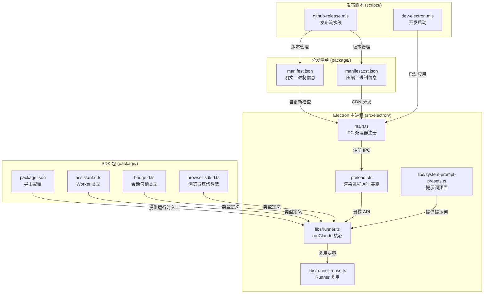

# 发布包与分发配置总览

<cite>

**本文引用的文件**

- [package/README.md](file://package/README.md)
- [package/package.json](file://package/package.json)
- [package/LICENSE.md](file://package/LICENSE.md)
- [package/agentSdkTypes.d.ts](file://package/agentSdkTypes.d.ts)
- [package/assistant.d.ts](file://package/assistant.d.ts)
- [package/bridge.d.ts](file://package/bridge.d.ts)
- [package/browser-sdk.d.ts](file://package/browser-sdk.d.ts)
- [package/manifest.json](file://package/manifest.json)
- [src/electron/libs/runner.ts](file://src/electron/libs/runner.ts)
- [src/electron/libs/runner-reuse.ts](file://src/electron/libs/runner-reuse.ts)
- [src/electron/main.ts](file://src/electron/main.ts)
- [src/electron/preload.cts](file://src/electron/preload.cts)
- [src/electron/libs/system-prompt-presets.ts](file://src/electron/libs/system-prompt-presets.ts)
- [package/manifest.zst.json](file://package/manifest.zst.json)
- [scripts/dev-electron.mjs](file://scripts/dev-electron.mjs)
- [scripts/github-release.mjs](file://scripts/github-release.mjs)

</cite>

---

## 目录

1. [职责定位](#1-职责定位)
2. [入口文件与启动链路](#2-入口文件与启动链路)
3. [包结构与导出配置](#3-包结构与导出配置)
4. [二进制分发清单](#4-二进制分发清单)
5. [Electron 主进程与 IPC 桥接](#5-electron-主进程与-ipc-桥接)
6. [Runner 运行模型](#6-runner-运行模型)
7. [系统提示词预置体系](#7-系统提示词预置体系)
8. [开发与发布脚本](#8-开发与发布脚本)
9. [扩展点与配置注入](#9-扩展点与配置注入)
10. [Agent 改代码地图](#10-agent-改代码地图)

---

## 1. 职责定位

`module-package` 负责 tech-cc-hub 的发布包构建与多平台二进制分发。整个模块由三部分组成：

| 子模块 | 职责 | 核心文件 |
|--------|------|----------|
| **SDK 包** | npm 包发布，提供 API 类型和运行时入口 | `package/package.json`, `package/*.d.ts` |
| **二进制分发** | 平台特定 Claude CLI 二进制打包与校验 | `package/manifest.json`, `package/manifest.zst.json` |
| **Electron 客户端** | 桌面应用主进程、预加载脚本、Runner 调用链 | `src/electron/main.ts`, `src/electron/preload.cts` |
| **发布流水线** | GitHub Release 版本管理与自动更新 | `scripts/github-release.mjs`, `scripts/dev-electron.mjs` |

本章来源：[package/README.md#L1-L9](file://package/README.md#L1-L9)、[src/electron/main.ts#L1-L96](file://src/electron/main.ts#L1-L96)

---

## 2. 入口文件与启动链路

### 2.1 Electron 应用主入口

`src/electron/main.ts` 是 Electron 主进程的入口文件，负责初始化窗口、注册 IPC 处理器、启动后端桥接和系统工作区。

关键初始化序列：

```typescript
// src/electron/main.ts 简化启动流程
import { app, BrowserWindow, ipcMain } from "electron";
import { startChannelBridge } from "./libs/channel-bridge.js";
import { ensureSystemWorkspace } from "./libs/system-workspace.js";

// 主进程启动时序
// 1. app.whenReady() 触发主进程就绪
// 2. ensureSystemWorkspace() 确保 .tech-cc-hub 系统目录存在
// 3. startChannelBridge() 启动前后端通信桥接
// 4. registerIpcHandlers() 注册所有 IPC 通道
```

### 2.2 预加载脚本桥接

`src/electron/preload.cts` 通过 `contextBridge.exposeInMainWorld` 向渲染进程暴露安全的 IPC 调用接口：

```typescript
// src/electron/preload.cts 核心暴露
electron.contextBridge.exposeInMainWorld("electron", {
    // 客户端事件
    sendClientEvent: (event) => ipcRenderer.send("client-event", event),
    onServerEvent: (callback) => ipcOn("server-event", callback),

    // 会话管理
    generateSessionTitle: (userInput, options) =>
        ipcInvoke("generate-session-title", userInput, options),
    getRecentCwds: (limit) => ipcInvoke("get-recent-cwds", limit),

    // 配置读写
    getApiConfig: () => ipcInvoke("get-api-config"),
    saveApiConfig: (config) => ipcInvoke("save-api-config", config),

    // 文件预览
    readPreviewFile: (payload) => ipcInvoke("preview-read-file", payload),
    listPreviewDirectory: (payload) => ipcInvoke("preview-list-directory", payload),

    // 浏览器工作台
    openBrowserWorkbench: (url, sessionId) => ipcInvoke("browser-open", url, sessionId),
    closeBrowserWorkbench: (sessionId) => ipcInvoke("browser-close", sessionId),
});
```

本章来源：[src/electron/preload.cts#L1-L153](file://src/electron/preload.cts#L1-L153)

---

## 3. 包结构与导出配置

### 3.1 package.json 导出映射

`package/package.json` 定义了 SDK 的多入口导出结构，每个导出点对应独立的类型定义文件：

```json
// package/package.json 导出配置
{
  "name": "@anthropic-ai/claude-agent-sdk",
  "version": "0.2.137",
  "exports": {
    ".": { "types": "./sdk.d.ts", "default": "./sdk.mjs" },
    "./browser": { "types": "./browser-sdk.d.ts", "default": "./browser-sdk.js" },
    "./bridge": { "types": "./bridge.d.ts", "default": "./bridge.mjs" },
    "./assistant": { "types": "./assistant.d.ts", "default": "./assistant.mjs" },
    "./sdk-tools": { "types": "./sdk-tools.d.ts" }
  },
  "files": [
    "sdk.mjs", "sdk.d.ts", "assistant.mjs", "assistant.d.ts",
    "bridge.mjs", "bridge.d.ts", "browser-sdk.js", "browser-sdk.d.ts",
    "manifest.json", "manifest.zst.json"
  ],
  "optionalDependencies": {
    "@anthropic-ai/claude-agent-sdk-linux-x64": "0.2.137",
    "@anthropic-ai/claude-agent-sdk-darwin-arm64": "0.2.137",
    "@anthropic-ai/claude-agent-sdk-win32-x64": "0.2.137"
  }
}
```

### 3.2 类型定义协作关系

类型定义文件采用"代理重导出"模式，确保编译后的 `.d.ts` 只有单一导入路径：

```typescript
// package/assistant.d.ts 注释说明设计意图
/**
 * API surface definition for @anthropic-ai/claude-agent-sdk/assistant.
 * Source of truth for the /assistant export's public types.
 * Imports ONLY from agentSdkTypes.ts so the compiled .d.ts has exactly
 * one import to rewrite (./agentSdkTypes → ./sdk) for the flat package layout.
 */
import type { CanUseTool, ConnectRemoteControlOptions,
                InboundPrompt, Options, PermissionResult,
                SDKMessage, SDKUserMessage } from './agentSdkTypes.js';

export type WorkerState = {
    claudeSessionId?: string;
    lastSSESequenceNum?: number;
    bridgeSessionId?: string;
};

export type AssistantWorkerOptions = {
    bridge: ConnectRemoteControlOptions;
    sandboxed?: boolean;
    scheduling?: { dir: string; horizonMs?: number; leadMs?: number; };
    buildQueryOptions: (base: Options) => Options | Promise<Options>;
    canUseToolPreFilter?: (toolName: string, input: Record<string, unknown>, ctx: CanUseToolContext) => Promise<PermissionResult | undefined>;
    stateAdapter?: WorkerStateAdapter;
    signal: AbortSignal;
};

export type AssistantWorkerHandle = {
    readonly sessionUrl: string;
    readonly bridgeSessionId: string;
    pushPrompt(content: string | SDKUserMessage['message']['content']): void;
    interrupt(): Promise<void>;
    teardown(): Promise<void>;
};
```

### 3.3 Bridge 会话句柄

`package/bridge.d.ts` 定义了 CCR（Claude Code Runner）会话桥接的核心类型：

```typescript
// package/bridge.d.ts 关键类型
export type SessionState = 'idle' | 'running' | 'requires_action';

export type BridgeSessionHandle = {
    readonly sessionId: string;
    getSequenceNum(): number;           // SSE 高水位标记
    isConnected(): boolean;
    write(msg: SDKMessage): void;
    sendResult(): void;                // 回合边界信号
    sendControlRequest(req: SDKControlRequest): void;   // 权限请求
    sendControlResponse(res: SDKControlResponse): void; // 权限响应
    reconnectTransport(opts: { ingressToken: string; apiBaseUrl: string; epoch?: number; }): Promise<void>;
    reportState(state: SessionState): void;
    reportMetadata(metadata: Record<string, unknown>): void;
    close(): void;
};

export type AttachBridgeSessionOptions = {
    sessionId: string;
    ingressToken: string;
    apiBaseUrl: string;
    epoch?: number;
    initialSequenceNum?: number;
    outboundOnly?: boolean;
    onInboundMessage?: (msg: SDKMessage) => void | Promise<void>;
    onPermissionResponse?: (res: SDKControlResponse) => void;
    onClose?: (code?: number) => void;
};
```

### 3.4 Browser SDK 类型

`package/browser-sdk.d.ts` 为浏览器环境提供 WebSocket 传输的查询接口：

```typescript
// package/browser-sdk.d.ts
export type OAuthCredential = { type: 'oauth'; token: string; };
export type AuthMessage = { type: 'auth'; credential: OAuthCredential; };
export type WebSocketOptions = { url: string; headers?: Record<string, string>; authMessage?: AuthMessage; };
export type BrowserQueryOptions = {
    prompt: AsyncIterable<SDKUserMessage>;
    websocket: WebSocketOptions;
    abortController?: AbortController;
    canUseTool?: CanUseTool;
    hooks?: Partial<Record<HookEvent, HookCallbackMatcher[]>>;
    mcpServers?: Record<string, McpServerConfig>;
    jsonSchema?: Record<string, unknown>;
    onElicitation?: OnElicitation;
};

export declare function query(options: BrowserQueryOptions): Query;
```

本章来源：[package/package.json#L1-L82](file://package/package.json#L1-L82)、[package/assistant.d.ts#L1-L135](file://package/assistant.d.ts#L1-L135)、[package/bridge.d.ts#L1-L231](file://package/bridge.d.ts#L1-L231)、[package/browser-sdk.d.ts#L1-L53](file://package/browser-sdk.d.ts#L1-L53)

---

## 4. 二进制分发清单

### 4.1 明文分发清单

`package/manifest.json` 记录各平台的二进制信息，用于自更新检查：

```json
{
  "version": "2.1.137",
  "commit": "88a017e5d1d4c7de4e6de6a496ac08c9c1b77d79",
  "buildDate": "2026-05-08T23:09:27Z",
  "platforms": {
    "darwin-arm64": { "binary": "claude", "checksum": "6d91ce74...", "size": 205062416 },
    "darwin-x64": { "binary": "claude", "checksum": "bc71e270...", "size": 207568336 },
    "linux-x64": { "binary": "claude", "checksum": "ae29f87f...", "size": 230577872 },
    "win32-x64": { "binary": "claude.exe", "checksum": "4bb6443d...", "size": 226494112 }
  }
}
```

### 4.2 Zstd 压缩分发清单

`package/manifest.zst.json` 记录 Zstd 压缩后的二进制信息，适用于 CDN 分发：

```json
{
  "version": "2.1.137",
  "commit": "88a017e5d1d4c7de4e6de6a496ac08c9c1b77d79",
  "buildDate": "2026-05-08T23:16:16Z",
  "platforms": {
    "darwin-arm64": {
      "binary": "claude.zst",
      "checksum": "b381dc33...",
      "size": 42514413,
      "bundle": { "checksum": "b498ae41...", "size": 42522515 }
    },
    "linux-x64": { "binary": "claude.zst", "checksum": "f2870788...", "size": 50919636 }
  }
}
```

**两个清单的关系**：自更新服务先查询 `manifest.json` 获取完整二进制信息；若使用 CDN 加速下载，则使用 `manifest.zst.json` 中的压缩包校验信息。

本章来源：[package/manifest.json#L1-L47](file://package/manifest.json#L1-L47)、[package/manifest.zst.json#L1-L55](file://package/manifest.zst.json#L1-L55)

---

## 5. Electron 主进程与 IPC 桥接

### 5.1 IPC 通道注册

`src/electron/main.ts` 通过 `ipcMain.handle` 注册所有主进程处理器：

```typescript
// src/electron/main.ts IPC 通道示例
ipcMain.handle("preview-list-directory", handler);
ipcMain.handle("preview-list-files", handler);
ipcMain.handle("sessions:list", handler);
ipcMain.handle("slash-commands:list", handler);
ipcMain.handle("plugins:getOpenComputerUseStatus", handler);
ipcMain.handle("plugins:checkOpenComputerUseUpdate", handler);
ipcMain.handle("plugins:installOpenComputerUse", handler);
ipcMain.handle("plugins:getFigmaOfficialStatus", handler);
ipcMain.handle("plugins:installFigmaOfficial", handler);
ipcMain.handle("plugins:connectFigmaOfficial", handler);
ipcMain.handle("plugins:connectFigmaCodexOfficial", handler);
```

### 5.2 知识库频道白名单

```typescript
// src/electron/main.ts 知识库 IPC 频道
const KNOWLEDGE_UI_CHANNELS = [
  "knowledge:list",
  "knowledge:sync-workspaces",
  "knowledge:add-workspace",
  "knowledge:remove-workspace",
  "knowledge:update-generation",
  "knowledge:complete-generation",
  "knowledge:run-generation",
  "knowledge:list-documents",
  "knowledge:read-document",
  "knowledge:overview",
] as const;
```

### 5.3 前后端桥接启动

```typescript
// src/electron/main.ts 桥接初始化
let channelBridgeController: ChannelBridgeController | null = null;

async function initialize() {
    channelBridgeController = await startChannelBridge({
        port: DEV_BACKEND_BRIDGE_PORT,
        onClientConnect: (clientId) => {
            // 新客户端连接回调
        },
    });
}
```

本章来源：[src/electron/main.ts#L119-L157](file://src/electron/main.ts#L119-L157)

---

## 6. Runner 运行模型

### 6.1 Runner 核心类型

`src/electron/libs/runner.ts` 导出三个核心类型和函数：

```typescript
// src/electron/libs/runner.ts
export type RunnerOptions = {
    prompt: string;
    attachments?: PromptAttachment[];
    runtime?: RuntimeOverrides;
    session: Session;
    resumeSessionId?: string;
    onEvent: (event: ServerEvent) => void;
    onSessionUpdate?: (updates: Partial<Session>) => void;
};

export type RunnerHandle = {
    abort: () => void;
    appendPrompt: (prompt: string, attachments?: PromptAttachment[]) => Promise<void>;
    isClosed: () => boolean;
    reuseKey?: string;
};

export function runClaude(opts: RunnerOptions): RunnerHandle;
export function createPromptSource(): PromptSource;
```

### 6.2 Runner 复用决策

`src/electron/libs/runner-reuse.ts` 实现会话级 Runner 复用逻辑：

```typescript
// src/electron/libs/runner-reuse.ts
export type RunnerReuseKeyInput = {
    cwd?: string;
    model?: string;
    allowedTools?: string;
    runSurface?: AgentRunSurface;
    agentId?: string;
    runtime?: RuntimeOverrides;
    prompt: string;
    attachments?: readonly PromptAttachment[];
};

export function buildRunnerReuseKey(input: RunnerReuseKeyInput): string {
    return JSON.stringify(buildRunnerReuseDescriptor(input));
}

export function canReuseRunner(existingKey: string | undefined, requestedKey: string): boolean {
    const existing = parseRunnerReuseKey(existingKey);
    const requested = parseRunnerReuseKey(requestedKey);
    if (!existing || !requested) return false;

    return (
        existing.cwd === requested.cwd &&
        existing.model === requested.model &&
        existing.permissionMode === requested.permissionMode &&
        existing.reasoningMode === requested.reasoningMode &&
        existing.outputFormat === requested.outputFormat &&
        existing.runSurface === requested.runSurface &&
        existing.agentId === requested.agentId &&
        existing.allowedTools === requested.allowedTools
    );
}
```

**复用维度**：cwd、model、permissionMode、reasoningMode、outputFormat、runSurface、agentId、allowedTools。builtinMcpServers 作为辅助参考。

### 6.3 内置 MCP 服务器枚举

```typescript
// src/electron/libs/runner-reuse.ts 有效内置 MCP 服务器名称
function isBuiltinMcpServerName(value: unknown): value is BuiltinMcpServerName {
    return (
        value === "tech-cc-hub-browser" ||
        value === "tech-cc-hub-admin" ||
        value === "tech-cc-hub-design" ||
        value === "tech-cc-hub-figma" ||
        value === "tech-cc-hub-cron" ||
        value === "tech-cc-hub-idea" ||
        value === "tech-cc-hub-plan"
    );
}
```

### 6.4 工具过滤规则

```typescript
// src/electron/libs/runner.ts
// SDK 内置 Cron 工具被禁用，替换为 tech-cc-hub MCP cron 工具
const SDK_BUILTIN_CRON_TOOLS = new Set(["CronCreate", "CronDelete", "CronList"]);

// 始终允许的工具
const ALWAYS_ALLOWED_TOOLS = new Set([
    "AskUserQuestion",
    ...BUILTIN_MCP_TOOL_NAMES,
]);

// Windows PowerShell 工具被阻止
const BLOCKED_SHELL_TOOL_NAMES = new Set(["mcp__windows__Powershell-Tool"]);
```

本章来源：[src/electron/libs/runner.ts#L90-L160](file://src/electron/libs/runner.ts#L90-L160)、[src/electron/libs/runner-reuse.ts#L1-L118](file://src/electron/libs/runner-reuse.ts#L1-L118)

---

## 7. 系统提示词预置体系

`src/electron/libs/system-prompt-presets.ts` 负责构建各场景的系统提示词追加内容：

### 7.1 预置函数列表

| 函数名 | 用途 | 章节来源 |
|--------|------|----------|
| `buildBrowserWorkbenchPromptAppend` | 浏览器工作台使用规则 | [L12-L19](file://src/electron/libs/system-prompt-presets.ts#L12-L19) |
| `buildAdminConfigPromptAppend` | 全局配置持久化规则 | [L21-L26](file://src/electron/libs/system-prompt-presets.ts#L21-L26) |
| `buildToolCallOptimizationPromptAppend` | 工具调用优化指南 | [L28-L43](file://src/electron/libs/system-prompt-presets.ts#L28-L43) |
| `buildFeishuDocumentFetchPromptAppend` | 飞书文档直读规则 | [L53-L79](file://src/electron/libs/system-prompt-presets.ts#L53-L79) |
| `buildGlobalRuntimeSystemPromptExtAppend` | 全局 System Prompt 扩展 | [L81-L91](file://src/electron/libs/system-prompt-presets.ts#L81-L91) |
| `buildBuiltinMcpRegistryPromptAppend` | 内置 MCP 注册提示 | [L117-L119](file://src/electron/libs/system-prompt-presets.ts#L117-L119) |
| `buildDesignParityPromptAppend` | 设计还原规则 | [L125-L130](file://src/electron/libs/system-prompt-presets.ts#L125-L130) |
| `buildTechCCHubSystemPromptSources` | Tech-CC-Hub 系统提示词来源 | [L135](file://src/electron/libs/system-prompt-presets.ts#L135) |

### 7.2 飞书文档 URL 提取

```typescript
// src/electron/libs/system-prompt-presets.ts
const FEISHU_DOC_URL_PATTERN = /https?:\/\/[^\s<>"'`]*feishu\.cn\/(?:wiki|docx|docs)\/[^\s<>"'`]* gi;
const MAX_FEISHU_DOC_URL_HINTS = 3;

export function extractFeishuDocumentUrls(text: string): string[] {
    const matches = text.match(FEISHU_DOC_URL_PATTERN) ?? [];
    const urls = matches
        .map((url) => url.replace(FEISHU_DOC_URL_TRAILING_PUNCTUATION, ""))
        .filter(Boolean);
    return Array.from(new Set(urls)).slice(0, MAX_FEISHU_DOC_URL_HINTS);
}

export function buildFeishuDocumentFetchPromptAppend(
    prompt: string,
    runtimeEnv: Record<string, string | undefined>,
): string | undefined {
    const urls = extractFeishuDocumentUrls(prompt);
    if (urls.length === 0) return undefined;

    const hasLarkCliCommand = Boolean(runtimeEnv.LARK_CLI_COMMAND?.trim());
    const hasLarkCliProfile = Boolean(runtimeEnv.LARK_CLI_PROFILE?.trim());
    if (!hasLarkCliCommand || !hasLarkCliProfile) return undefined;

    // 生成 lark-cli 文档读取命令
    const commands = urls.map((url) =>
        `- \`$LARK_CLI_COMMAND --profile $LARK_CLI_PROFILE docs +fetch --doc "${url}" --format pretty 2>&1\``
    );
    return [...].join("\n");
}
```

本章来源：[src/electron/libs/system-prompt-presets.ts#L1-L176](file://src/electron/libs/system-prompt-presets.ts#L1-L176)

---

## 8. 开发与发布脚本

### 8.1 Electron 开发启动脚本

`scripts/dev-electron.mjs` 负责本地开发环境的 Electron 启动：

```javascript
// scripts/dev-electron.mjs 核心流程
function prepareMacElectronDist() {
    if (process.platform !== "darwin") return null;

    // 1. 检查是否有缓存的已签名 Electron.app
    const existingOverride = process.env.ELECTRON_OVERRIDE_DIST_PATH;
    if (existingOverride && verifyCodesign(path.join(existingOverride, "Electron.app"))) {
        return existingOverride;
    }

    // 2. 从 node_modules 复制并清理扩展属性
    const cacheDist = path.join(homedir(), "Library", "Caches", "tech-cc-hub", `electron-${version}-dist`);
    rmSync(cacheDist, { recursive: true, force: true });
    run("ditto", ["--norsrc", sourceDist, cacheDist]);
    cleanMacExtendedAttributes(cacheApp);

    // 3. 代码签名验证
    run("codesign", ["--force", "--deep", "--sign", "-", cacheApp]);
    if (!verifyCodesign(cacheApp)) {
        throw new Error("Prepared Electron.app did not pass codesign verification");
    }

    return cacheDist;
}
```

**签名验证失败场景**：

- macOS 下 Electron.app 未找到 → 需先运行 `npm install`
- 代码签名缺失 → 需配置有效的 Apple Developer 证书
- 扩展属性残留 → 触发 Gatekeeper 拒绝

### 8.2 GitHub Release 发布脚本

`scripts/github-release.mjs` 实现半自动化 GitHub Release 流程：

```javascript
// scripts/github-release.mjs 关键函数
function bumpVersion(current, mode) {
    // 支持 major/minor/patch 以及显式 vX.Y.Z
    if (mode === "major") return `${version.major + 1}.0.0`;
    if (mode === "minor") return `${version.major}.${version.minor + 1}.0`;
    if (mode === "patch") return `${version.major}.${version.minor}.${version.patch + 1}`;
}

async function githubApiRequest(method, endpoint, token, payload) {
    const body = payload ? JSON.stringify(payload) : undefined;
    const response = await fetch(`${GITHUB_API_BASE}${endpoint}`, {
        method,
        headers: {
            "Authorization": `token ${token}`,
            "Content-Type": "application/json",
        },
        body,
    });
    return response.json();
}

// 发布前检查清单
function ensureCleanWorktree() { /* 检查 git status */ }
function ensureTagDoesNotExist(tag) { /* 检查本地和远程 tag */ }
function ensureOriginRemote() { /* 验证 GitHub lst016/tech-cc-hub */ }
```

**常用命令**：

```bash
# 标准发布
npm run release:github -- patch

# 干跑验证
npm run release:github -- minor --dry-run

# 跳过 git push
npm run release:github -- patch --no-push

# 自定义标题模板
npm run release:github -- patch --release-title-template "## {tag} 版本更新"
```

本章来源：[scripts/dev-electron.mjs#L1-L149](file://scripts/dev-electron.mjs#L1-L149)、[scripts/github-release.mjs#L1-L444](file://scripts/github-release.mjs#L1-L444)

---

## 9. 扩展点与配置注入

### 9.1 全局运行时配置

`RuntimeOverrides` 是 Runner 的配置注入点：

```typescript
// src/electron/libs/runner.ts
export type RuntimeOverrides = {
    permissionMode?: "bypassPermissions" | "low" | "medium" | "high";
    reasoningMode?: string;
    outputFormat?: string;
    runSurface?: AgentRunSurface;
    agentId?: string;
    // MCP 服务器配置
    mcpServers?: Record<string, McpServerConfig>;
    // OAuth 回调配置
    mcpAuthenticate?: (serverName: string, redirectUri?: string) => Promise<unknown>;
};
```

### 9.2 工具调用优化预置内容

```typescript
// src/electron/libs/system-prompt-presets.ts buildToolCallOptimizationPromptAppend
export function buildToolCallOptimizationPromptAppend(): string {
    return [
        "Tool-call budget: use tools only when the answer depends on current external state.",
        "Before the first tool call, group the needed evidence.",
        "Use the built-in `Task` tool for parallel investigation only when work splits into 2+ independent code paths.",
        "Default file reads should stay under 200 lines.",
        "Batch read-only work when safe; keep writes, deletes, moves in separate calls.",
        "For scheduled tasks use the persistent tech-cc-hub cron MCP tools, not SDK CronCreate/CronDelete/CronList.",
    ].join("\n");
}
```

### 9.3 MCP 认证扩展

```typescript
// src/electron/libs/runner.ts
type QueryWithMcpOAuth = Query & {
    mcpAuthenticate: (serverName: string, redirectUri?: string) => Promise<unknown>;
};
```

OAuth 认证在 `maybeRunFigmaGuideOAuth` 函数中处理，用于 Figma MCP 服务器的 OAuth 流程。

### 9.4 工具集解析

```typescript
// src/electron/libs/runner.ts
function parseAllowedTools(allowedTools: string | undefined): string[] | undefined {
    // 支持逗号分隔的工具名称列表
}

function parseAllowedToolList(toolList: string): string[] {
    // 解析空格分隔的工具名称列表
}

function isAlwaysAllowedTool(toolName: string): boolean {
    return ALWAYS_ALLOWED_TOOLS.has(toolName) || isSdkBuiltinCronTool(toolName);
}
```

本章来源：[src/electron/libs/runner.ts#L828-L979](file://src/electron/libs/runner.ts#L828-L979)、[src/electron/libs/system-prompt-presets.ts#L28-L43](file://src/electron/libs/system-prompt-presets.ts#L28-L43)

---

## 10. Agent 改代码地图

### 10.1 改动范围判定清单

| 改动类型 | 优先读取文件 | 关键符号/IPC 通道 | 修改入口 | 验证命令 |
|----------|--------------|-------------------|----------|----------|
| **SDK 包升级** | `package/package.json` | version, exports, optionalDependencies | 改 version 字段 | `npm run build:sdk` |
| **二进制分发更新** | `package/manifest.json`, `manifest.zst.json` | version, commit, buildDate, platforms | 更新 platforms 下对应平台条目 | `node scripts/verify-manifest.mjs` |
| **Electron IPC 通道增删** | `src/electron/main.ts` | ipcMain.handle 列表 | 在 main.ts 添加/删除处理器 | 启动客户端测试通道 |
| **Preload API 暴露** | `src/electron/preload.cts` | contextBridge.exposeInMainWorld | 添加 `electron.xxx` 属性 | 渲染进程 `window.electron.xxx` 调用测试 |
| **Runner 复用策略** | `src/electron/libs/runner-reuse.ts` | buildRunnerReuseKey, canReuseRunner, RunnerReuseDescriptor | 修改 canReuseRunner 条件或 buildRunnerReuseDescriptor 字段 | 启动两个相同配置任务观察是否复用 |
| **系统提示词新增** | `src/electron/libs/system-prompt-presets.ts` | build*PromptAppend 函数 | 新增 `buildXxxPromptAppend` 并在调用处引入 | 观察 Agent 首轮行为变化 |
| **GitHub Release 流程** | `scripts/github-release.mjs` | bumpVersion, githubApiRequest, release note template | 修改对应函数或模板 | `npm run release:github -- patch --dry-run` |
| **Electron 开发签名** | `scripts/dev-electron.mjs` | prepareMacElectronDist, verifyCodesign, cleanMacExtendedAttributes | 修改缓存路径或签名参数 | `npm run dev:electron` 观察终端签名日志 |
| **Bridge 会话类型** | `package/bridge.d.ts` | BridgeSessionHandle, AttachBridgeSessionOptions | 修改类型定义 | TypeScript 编译检查 |
| **Assistant Worker 类型** | `package/assistant.d.ts` | AssistantWorkerOptions, AssistantWorkerHandle | 修改类型定义 | TypeScript 编译检查 |

### 10.2 关键调用链



图表来源：[src/electron/main.ts#L1-L96](file://src/electron/main.ts#L1-L96)、[src/electron/libs/runner.ts#L90-L160](file://src/electron/libs/runner.ts#L90-L160)、[src/electron/libs/runner-reuse.ts#L1-L118](file://src/electron/libs/runner-reuse.ts#L1-L118)

### 10.3 数据结构速查

| 结构名 | 定义位置 | 用途 | 关键字段 |
|--------|----------|------|----------|
| `RunnerOptions` | runner.ts:90 | Runner 初始化参数 | prompt, runtime, session, onEvent |
| `RunnerHandle` | runner.ts