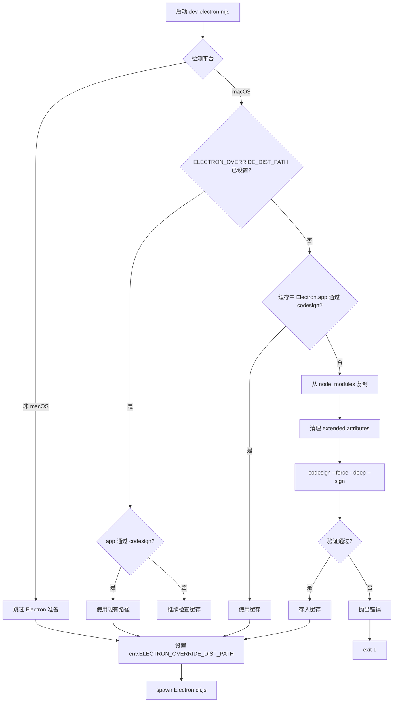

# 发布包与分发配置总览

<cite>

**本文引用的文件**

- [package/README.md](file://package/README.md)
- [package/package.json](file://package/package.json)
- [package/LICENSE.md](file://package/LICENSE.md)
- [package/agentSdkTypes.d.ts](file://package/agentSdkTypes.d.ts)
- [package/assistant.d.ts](file://package/assistant.d.ts)
- [package/bridge.d.ts](file://package/bridge.d.ts)
- [package/browser-sdk.d.ts](file://package/browser-sdk.d.ts)
- [package/manifest.json](file://package/manifest.json)
- [scripts/dev-electron.mjs](file://scripts/dev-electron.mjs)

</cite>

# 发布包与分发配置总览

本章节描述 `tech-cc-hub` 项目中 `package/` 目录的职责、入口文件、调用链、数据结构和扩展点。该模块承担 SDK 发布包的组织与平台二进制分发的配置功能。

## 目录

- [模块职责与边界](#模块职责与边界)
- [入口文件与导出映射](#入口文件与导出映射)
- [SDK 子路径导出详解](#sdk-子路径导出详解)
- [manifest.json 平台二进制清单](#manifestjson-平台二进制清单)
- [可选平台依赖管理](#可选平台依赖管理)
- [Electron 开发环境准备脚本](#electron-开发环境准备脚本)
- [核心数据类型解析](#核心数据类型解析)
- [常见改造路径](#常见改造路径)
- [验证与排障命令](#验证与排障命令)

---

## 模块职责与边界

`package/` 是 SDK 发布包的源码目录，而非构建产物。它的核心职责是：

1. **定义 SDK 导出结构**：通过 `package.json` 的 `exports` 字段将单一 npm 包拆分为多个子路径（`/assistant`、`/bridge`、`/browser`、`/sdk-tools`）。
2. **声明类型声明文件**：所有 `.d.ts` 文件作为 TypeScript 编译时的 API 契约。
3. **提供平台二进制元数据**：`manifest.json` 记录各平台可执行文件的版本、校验和与大小，供运行时按需下载。
4. **承载许可证信息**：`LICENSE.md` 声明法律约束。

[章节来源](file://package/README.md#L1-L10)

---

## 入口文件与导出映射

### 顶层入口

```text
package.json
├── main: sdk.mjs          → Node.js 环境导入
├── types: sdk.d.ts       → TypeScript 类型声明
└── exports: { ... }      → 条件导出映射
```

`package.json` 定义了模块的导出入口。`exports` 字段使用条件导出（Conditional Exports），在不同环境下提供不同路径：

| 条件字段 | 类型文件 | 运行文件 | 适用场景 |
|---------|---------|---------|---------|
| `"types"` | `sdk.d.ts` | — | TypeScript 编译器解析类型 |
| `"default"` | — | `sdk.mjs` | Node.js / bundler 运行时导入 |

[章节来源](file://package/package.json#L4-L9)

### 子路径导出

```mermaid
flowchart TD
    A[@anthropic-ai/claude-agent-sdk] --> B["/assistant<br/>assistant.d.ts + assistant.mjs"]
    A --> C["/bridge<br/>bridge.d.ts + bridge.mjs"]
    A --> D["/browser<br/>browser-sdk.d.ts + browser-sdk.js"]
    A --> E["/sdk-tools<br/>sdk-tools.d.ts"]
    
    B --> F[WorkerState / AssistantWorkerOptions]
    C --> G[BridgeSessionHandle / SessionState]
    D --> H[BrowserQueryOptions / WebSocketOptions]
    
    A --> I["根路径<br/>sdk.d.ts + sdk.mjs"]
    I --> J[核心工具类型]
```

所有子路径的 `.d.ts` 文件仅从 `agentSdkTypes.ts` 导入类型，通过构建脚本（`scripts/build-ant-sdk-typings.sh`）将 `import './agentSdkTypes'` 改写为 `import './sdk'`，适配扁平包布局。

[图表来源](file://package/package.json#L6-L29)

---

## SDK 子路径导出详解

### `/assistant` — 后台工作者入口

**文件**：`assistant.d.ts` + `assistant.mjs`

**职责**：提供长时间运行的 Assistant Worker，适合需要后台调度、状态持久化的场景。

**核心类型**：

```typescript
// 来自 assistant.d.ts 的关键类型
export type AssistantWorkerOptions = {
    bridge: ConnectRemoteControlOptions;        // 连接 CCR 的配置
    sandboxed?: boolean;                        // 是否在沙箱环境运行
    scheduling?: { dir: string; ... };          // 定时任务配置
    buildQueryOptions: (base: Options) => Options | Promise<Options>;
    stateAdapter?: WorkerStateAdapter;          // 状态持久化适配器
    signal: AbortSignal;                        // 中断信号
};

export type AssistantWorkerHandle = {
    readonly sessionUrl: string;
    pushPrompt(content: string | SDKUserMessage['message']['content']): void;
    interrupt(): Promise<void>;
    done: Promise<void>;                        // 风扇入口循环退出时 resolved
    teardown(): Promise<void>;
};
```

**典型调用链**：

```
runAssistantWorker(opts)
  → connectRemoteControl(opts.bridge)           // 建立 CCR 连接
  → spawn child process (query)
  → load stateAdapter.load()                   // 恢复会话状态
  → on each turn: buildQueryOptions(base)
  → despawn on idle (userIdleMs)
```

[章节来源](file://package/assistant.d.ts#L55-L135)

### `/bridge` — Bridge 会话管理

**文件**：`bridge.d.ts` + `bridge.mjs`

**职责**：管理到 claude.ai 的 Bridge Session，提供写通道、会话状态上报、权限请求转发等功能。

**核心类型**：

```typescript
export type SessionState = 'idle' | 'running' | 'requires_action';

export type BridgeSessionHandle = {
    readonly sessionId: string;
    getSequenceNum(): number;                  // SSE 序列号高水位
    write(msg: SDKMessage): void;              // 写入 SDK 消息
    sendResult(): void;                        // 标记 turn 边界
    sendControlRequest(req: SDKControlRequest): void;  // 请求权限
    reconnectTransport(opts): Promise<void>;   // JWT 刷新时重连
    reportState(state: SessionState): void;     // 上报工作状态
    flush(): Promise<void>;                    // 交付前清空写队列
    close(): void;
};
```

**会话创建流程**：

```
createCodeSession(baseUrl, accessToken, title, ...)
  → POST /v1/code/sessions
  → returns sessionId (cse_*)

fetchRemoteCredentials(sessionId, baseUrl, accessToken, ...)
  → POST /v1/code/sessions/{id}/bridge
  → returns { worker_jwt, api_base_url, worker_epoch }

attachBridgeSession({ sessionId, ingressToken, apiBaseUrl, epoch?, ... })
  → createV2ReplTransport (SSETransport + CCRClient)
  → registerWorker
  → returns BridgeSessionHandle
```

[章节来源](file://package/bridge.d.ts#L22-L232)

### `/browser` — 浏览器端 SDK

**文件**：`browser-sdk.d.ts` + `browser-sdk.js`

**职责**：通过 WebSocket 在浏览器环境中运行 Claude Code 查询。

**核心类型**：

```typescript
export type WebSocketOptions = {
    url: string;                               // WebSocket 端点
    headers?: Record<string, string>;
    authMessage?: AuthMessage;                 // OAuth 凭据
};

export type BrowserQueryOptions = {
    prompt: AsyncIterable<SDKUserMessage>;      // 异步消息流
    websocket: WebSocketOptions;
    abortController?: AbortController;
    canUseTool?: CanUseTool;
    hooks?: Partial<Record<HookEvent, HookCallbackMatcher[]>>;
    mcpServers?: Record<string, McpServerConfig>;
    onElicitation?: OnElicitation;
};
```

**使用示例**：

```typescript
import { query } from '@anthropic-ai/claude-agent-sdk/browser';

const messages = query({
    prompt: messageStream,
    websocket: { url: 'wss://api.example.com/claude' },
});
for await (const message of messages) {
    console.log(message);
}
```

[章节来源](file://package/browser-sdk.d.ts#L27-L53)

---

## manifest.json 平台二进制清单

**文件**：`package/manifest.json`

**职责**：记录每个平台的二进制文件版本、 SHA-256 校验和与文件大小，供自动更新和校验使用。

**数据结构**：

```json
{
  "version": "2.1.137",
  "commit": "88a017e5d1d4c7de4e6de6a496ac08c9c1b77d79",
  "buildDate": "2026-05-08T23:09:27Z",
  "platforms": {
    "darwin-arm64": { "binary": "claude", "checksum": "...", "size": 205062416 },
    "darwin-x64": { "binary": "claude", "checksum": "...", "size": 207568336 },
    "linux-arm64": { "binary": "claude", "checksum": "...", "size": 230471304 },
    "linux-x64": { "binary": "claude", "checksum": "...", "size": 230577872 },
    "linux-arm64-musl": { "binary": "claude", "checksum": "...", "size": 223326040 },
    "linux-x64-musl": { "binary": "claude", "checksum": "...", "size": 224971824 },
    "win32-x64": { "binary": "claude.exe", "checksum": "...", "size": 226494112 },
    "win32-arm64": { "binary": "claude.exe", "checksum": "...", "size": 222451872 }
  }
}
```

**关键字段说明**：

| 字段 | 含义 |
|------|------|
| `version` | SDK 版本，与 npm 包版本对齐 |
| `commit` | 对应的源代码 commit SHA |
| `buildDate` | 构建时间戳（ISO 8601） |
| `platforms.*.binary` | 可执行文件名（Windows 带 `.exe`） |
| `platforms.*.checksum` | SHA-256 校验和（十六进制） |
| `platforms.*.size` | 文件大小（字节） |

`manifest.zst.json` 可能是压缩版本（Zstandard），用于减小发布包体积。

[章节来源](file://package/manifest.json#L1-L47)

---

## 可选平台依赖管理

**文件**：`package/package.json` 第 57-66 行

**职责**：声明 8 个平台特定的可选依赖，供 npm 在对应平台自动安装。

```json
"optionalDependencies": {
    "@anthropic-ai/claude-agent-sdk-linux-x64": "0.2.137",
    "@anthropic-ai/claude-agent-sdk-linux-arm64": "0.2.137",
    "@anthropic-ai/claude-agent-sdk-linux-x64-musl": "0.2.137",
    "@anthropic-ai/claude-agent-sdk-linux-arm64-musl": "0.2.137",
    "@anthropic-ai/claude-agent-sdk-darwin-x64": "0.2.137",
    "@anthropic-ai/claude-agent-sdk-darwin-arm64": "0.2.137",
    "@anthropic-ai/claude-agent-sdk-win32-x64": "0.2.137",
    "@anthropic-ai/claude-agent-sdk-win32-arm64": "0.2.137"
}
```

**行为**：

- `npm install` 时，根据当前平台自动安装匹配的子包，忽略其他平台。
- 如果子包安装失败（平台不匹配或网络问题），安装继续（因为是 `optionalDependencies`）。
- 子包通常包含平台特定的二进制文件，可被 SDK 运行时发现和使用。

**版本一致性**：所有可选依赖版本必须与主包版本（`0.2.137`）保持同步，否则运行时可能出现版本错配。

[章节来源](file://package/package.json#L57-L66)

---

## Electron 开发环境准备脚本

**文件**：`scripts/dev-electron.mjs`

**职责**：在 macOS 开发环境中准备签名且通过 `codesign` 验证的 Electron 运行时代码库，并启动 Electron 应用。

### 执行流程



### 关键函数

| 函数 | 作用 |
|------|------|
| `electronVersionLabel()` | 从 `package.json` 读取 `electron` 版本号并规范化 |
| `verifyCodesign(appPath)` | 执行 `codesign --verify --deep --strict` 验证签名 |
| `cleanMacExtendedAttributes(appPath)` | 移除 macOS 扩展属性（FinderInfo, provenance, quarantine 等） |
| `prepareMacElectronDist()` | 协调 Electron.app 的缓存、复制、签名和验证 |

### 环境变量

| 变量 | 来源 | 作用 |
|------|------|------|
| `ELECTRON_OVERRIDE_DIST_PATH` | `prepareMacElectronDist()` 设置 | 指示 Electron 使用指定路径的运行时代码库 |
| `NODE_ENV` | 默认 `"development"` | 标记运行环境 |

### 常见失败模式

| 错误信息 | 原因 | 处理 |
|---------|------|------|
| `Electron.app not found` | 未执行 `npm install` | 确保 `node_modules/electron/dist/Electron.app` 存在 |
| `codesign verification failed` | 代码签名过期或损坏 | 运行 `scripts/dev-electron.mjs` 重新签名 |
| `xattr` 错误（不影响主流程） | 权限不足 | 忽略，脚本使用 `runOptional` 吞掉错误 |

[章节来源](file://scripts/dev-electron.mjs#L1-L150)

---

## 核心数据类型解析

### WorkerState — 工作者持久化状态

```typescript
// 来自 assistant.d.ts
export type WorkerState = {
    claudeSessionId?: string;      // Claude 会话 ID
    lastSSESequenceNum?: number;   // SSE 序列号（断点恢复）
    bridgeSessionId?: string;      // Bridge 会话 ID
};
```

**用途**：在 worker 重启或 bridge 重连时，通过 `stateAdapter` 恢复上下文，避免从头开始。

[章节来源](file://package/assistant.d.ts#L22-L26)

### AttachBridgeSessionOptions — Bridge 连接配置

```typescript
// 来自 bridge.d.ts
export type AttachBridgeSessionOptions = {
    sessionId: string;                    // cse_* 形式
    ingressToken: string;                 // worker JWT
    apiBaseUrl: string;
    epoch?: number;                       // 可选，服务器端已 bump
    initialSequenceNum?: number;          // SSE 断点恢复
    heartbeatIntervalMs?: number;         // 默认 20s（服务器 TTL 60s）
    outboundOnly?: boolean;               // 仅转发模式（镜像场景）
    onInboundMessage?: (msg: SDKMessage) => void | Promise<void>;
    onPermissionResponse?: (res: SDKControlResponse) => void;
    onClose?: (code?: number) => void;
};
```

[章节来源](file://package/bridge.d.ts#L89-L159)

### RemoteCredentials — Worker 认证凭据

```typescript
// 来自 bridge.d.ts
export type RemoteCredentials = {
    worker_jwt: string;
    api_base_url: string;
    expires_in: number;
    worker_epoch: number;
};

export type CredentialsFailure = {
    terminal: true;
    reason: 'untrusted_device' | 'session_stale_relogin';
};
```

**终端失败（`CredentialsFailure`）**：
- `untrusted_device`：设备未注册或令牌被撤销，需要重新注册。
- `session_stale_relogin`：OAuth 会话过期，需要重新认证。

[章节来源](file://package/bridge.d.ts#L177-L194)

---

## 常见改造路径

### 1. 新增 SDK 子路径

1. 在 `src/` 下创建新的入口模块（例如 `src/myFeature/index.ts`）。
2. 在 `package.json` 的 `exports` 中添加映射：
   ```json
   "./my-feature": {
     "types": "./my-feature.d.ts",
     "default": "./my-feature.mjs"
   }
   ```
3. 编写 `my-feature.d.ts`，从 `agentSdkTypes.ts` 导入共享类型。
4. 运行 `scripts/build-ant-sdk-typings.sh` 生成类型声明。
5. 在 `files` 字段中添加新文件名。

### 2. 添加新平台支持

1. 在 `manifest.json` 的 `platforms` 下添加新条目。
2. 创建对应的可选依赖（在 `package.json` 中声明）。
3. 更新构建脚本，确保生成新平台的二进制和校验和。

### 3. 修改 Electron 开发流程

- **更换 Electron 版本**：修改根目录 `package.json` 的 `devDependencies.electron`。
- **跳过代码签名**：设置 `SKIP_CODESIGN=1` 环境变量（需自行承担风险）。
- **使用本地 Electron 缓存**：设置 `ELECTRON_OVERRIDE_DIST_PATH` 指向缓存目录。

---

## 验证与排障命令

### 验证 SDK 导出结构

```bash
# 查看 package.json 的 exports 字段
cat package/package.json | jq '.exports'

# 检查 npm 包元数据
npm view @anthropic-ai/claude-agent-sdk
```

### 验证 Electron 签名

```bash
# macOS only：验证 Electron.app 代码签名
codesign --verify --deep --strict --verbose=2 "/path/to/Electron.app"

# 检查签名标识
codesign --display --verbose=2 "/path/to/Electron.app"
```

### 验证 manifest.json 完整性

```bash
# 验证所有平台条目存在
cat package/manifest.json | jq '.platforms | keys'

# 计算本地二进制校验和（macOS/Linux）
sha256sum path/to/claude
```

### 调试 Electron 启动问题

```bash
# 设置调试模式
DEBUG=electron:* node scripts/dev-electron.mjs

# 查看 Electron 使用的运行时代码库路径
ELECTRON_OVERRIDE_DIST_PATH=/tmp/electron-dist node scripts/dev-electron.mjs
```

### 检查可选依赖安装状态

```bash
# 查看已安装的平台特定依赖
ls -la node_modules/@anthropic-ai/

# 检查当前平台的可选依赖
npm ls @anthropic-ai/claude-agent-sdk-darwin-arm64 2>/dev/null || echo "Not installed"
```

---

## 总结

`package/` 目录通过 `package.json` 的条件导出实现了单一 npm 包的多入口架构，支撑 Node.js（`/sdk`）、浏览器（`/browser`）、后台工作者（`/assistant`）和 Bridge 会话（`/bridge`）四种场景。`manifest.json` 提供平台二进制元数据，`scripts/dev-electron.mjs` 处理 Electron 开发环境的签名验证。改造时需注意类型声明文件与运行时文件的同步，以及可选依赖版本与主包版本的一致性。