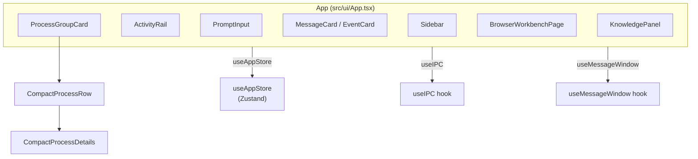
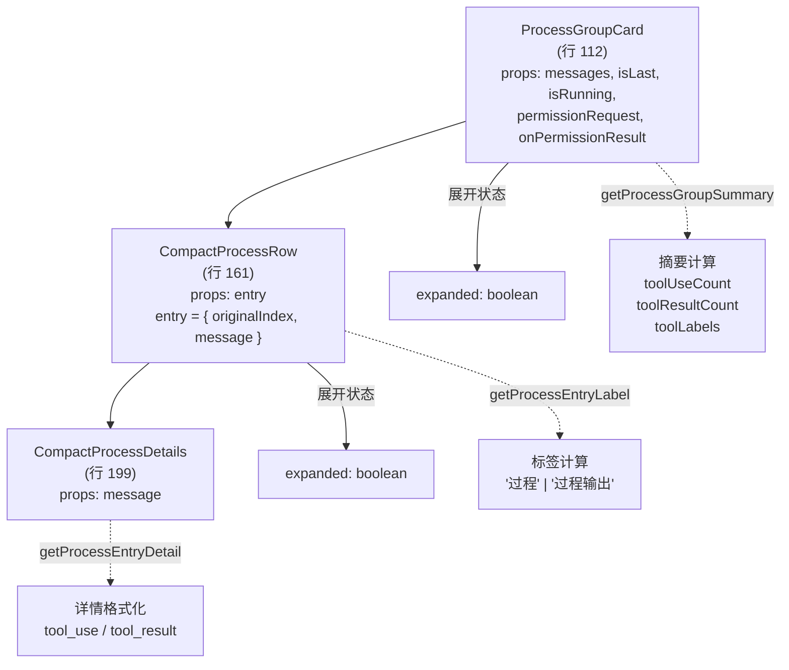
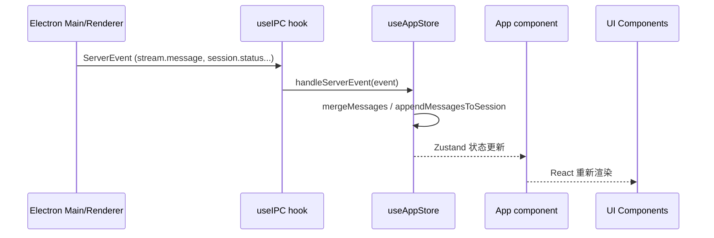
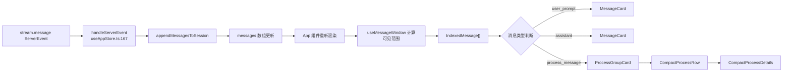
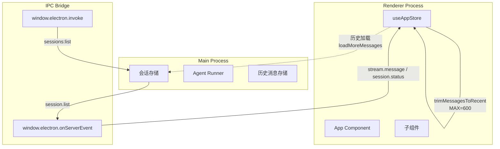

# 工作台 UI 组件架构

## 概述

本文档描述 `tech-cc-hub` 工作台（Workbench）UI 组件的架构设计，重点覆盖 `App` 根组件下的组件树结构、状态管理、消息处理链路和 IPC 通信机制。文档面向前端开发者和代码 Agent，既可作为人类可读的开发指南，也支持 AI 辅助代码修改时的检索。

> **前置阅读建议**：本文假设读者已了解 React 组件化基础、Zustand 状态管理模式和 Electron IPC 架构。如不熟悉，可先阅读 `doc/40-engineering/electron-ipc/spec.md` 了解 Electron IPC 规范。

---

## 目录

- [概述](#概述)
- [组件树结构](#组件树结构)
- [核心状态管理](#核心状态管理)
- [消息处理链路](#消息处理链路)
- [IPC 通信机制](#ipc-通信机制)
- [关键类型定义](#关键类型定义)
- [组件使用示例](#组件使用示例)
- [工作台与浏览器集成](#工作台与浏览器集成)
- [状态刷新与边界](#状态刷新与边界)
- [Agent 改代码地图](#agent-改代码地图)

---

## 组件树结构

### 顶层结构概览



### ProcessGroupCard 组件层级

根据 `src/ui/App.tsx` 第 112-211 行，`ProcessGroupCard` 及其子组件形成三级折叠结构：



### 组件职责矩阵

| 组件 | 文件位置 | 职责 | 状态来源 |
|------|----------|------|----------|
| `App` | `src/ui/App.tsx:327` | 根容器，聚合所有子组件，协调全局状态 | `useAppStore` |
| `Sidebar` | `src/ui/components/Sidebar.tsx:22` | 会话列表，工作区分组，会话操作 | `useAppStore.sessions` |
| `ProcessGroupCard` | `src/ui/App.tsx:112` | 折叠过程组，渲染摘要 | `StreamMessage[]` 过滤后传入 |
| `CompactProcessRow` | `src/ui/App.tsx:161` | 单条过程事件行，可展开详情 | 单条 `IndexedMessage` |
| `CompactProcessDetails` | `src/ui/App.tsx:199` | 渲染过程详情 JSON/文本 | `StreamMessage` |
| `ActivityRail` | `src/ui/components/ActivityRail.tsx` | 右侧 Activity 工作区面板 | `useAppStore` |
| `BrowserWorkbenchPage` | `src/ui/components/BrowserWorkbenchPage.tsx:319` | 浏览器预览工作台 | `useAppStore.browserWorkbenchBySessionId` |
| `KnowledgePanel` | `src/ui/components/KnowledgePanel.tsx` | 知识库面板 | IPC 调用后状态 |
| `useIPC` | `src/ui/hooks/useIPC.ts:3` | Electron IPC 事件订阅 | `window.electron.onServerEvent` |
| `useMessageWindow` | `src/ui/hooks/useMessageWindow.ts:23` | 消息窗口虚拟化 | `StreamMessage[]` |

**章节来源**：`src/ui/App.tsx#L112-L211`、`src/ui/components/Sidebar.tsx#L22-L501`

---

## 核心状态管理

### Zustand Store 架构

`src/ui/store/useAppStore.ts` 是全局状态的核心 Source-of-Truth，采用 Zustand 管理。关键状态结构：

```typescript
// src/ui/store/useAppStore.ts 第 103-127 行
interface AppState {
  sessions: Record<string, SessionView>;           // 会话映射
  archivedSessions: Record<string, SessionView>;   // 归档会话
  activeSessionId: string | null;                  // 当前活动会话
  prompt: string;                                  // 输入框内容
  browserAnnotations: BrowserWorkbenchAnnotation[];
  browserWorkbenchBySessionId: Record<string, BrowserWorkbenchSessionState>;
  codeReferencesBySessionId: Record<string, CodeReferenceDraft[]>;
  messageReferencesBySessionId: Record<string, MessageReferenceDraft[]>;
  fileReferencesBySessionId: Record<string, FileReferenceDraft[]>;
  cwd: string;
  apiConfigSettings: ApiConfigSettings;
  runtimeModel: string;
  reasoningMode: RuntimeReasoningMode;
  permissionMode: RuntimePermissionMode;
  // ...
}
```

### SessionView 结构

根据 `src/ui/store/useAppStore.ts` 第 32-56 行：

```typescript
export type SessionView = {
  id: string;
  title: string;
  status: SessionStatus;           // "idle" | "running" | "completed" | "error"
  model?: string;
  cwd?: string;
  slashCommands?: string[];
  messages: StreamMessage[];       // 消息列表
  permissionRequests: PermissionRequest[];
  lastPrompt?: string;
  workflowMarkdown?: string;
  workflowState?: SessionWorkflowState;
  latestPlan?: SessionPlanSnapshot;
  hydrated: boolean;
  hasMoreHistory: boolean;
  historyCursor?: SessionHistoryCursor;
};
```

### 状态流转模式



### 关键状态操作函数

| 函数 | 位置 | 职责 |
|------|------|------|
| `handleServerEvent` | `useAppStore.ts:167` | 分发 ServerEvent 到对应处理逻辑 |
| `appendMessagesToSession` | `useAppStore.ts:371` | 追加消息到会话，支持去重 |
| `mergeMessages` | `useAppStore.ts:272` | 合并消息，基于 `getMessageStableKey` 去重 |
| `trimMessagesToRecent` | `useAppStore.ts:351` | 裁剪消息防止内存溢出（MAX_RENDERER_HISTORY_MESSAGES=600） |
| `getMessageStableKey` | `useAppStore.ts:256` | 生成消息唯一标识：`history:{id}` / `uuid:{uuid}` / `user:{capturedAt}:{prompt}` |
| `deriveLatestPlanSnapshot` | `useAppStore.ts:341` | 从消息中提取最新计划快照 |

**章节来源**：`src/ui/store/useAppStore.ts#L32-L370`

---

## 消息处理链路

### 消息分类判断

`src/ui/App.tsx` 第 61-79 行实现 `isProcessMessage` 函数，识别"过程消息"：

```typescript
function isProcessMessage(message: StreamMessage): boolean {
  if (!isRecord(message)) return false;
  const contentItems = getMessageContentItems(message);  // 行 54-59

  // assistant 消息：所有 content item 都是 tool_use（排除 AskUserQuestion）
  if (message.type === "assistant") {
    return contentItems.every((item) => (
      isRecord(item) &&
      item.type === "tool_use" &&
      item.name !== "AskUserQuestion"
    ));
  }

  // user 消息：所有 content item 都是 tool_result
  if (message.type === "user") {
    return contentItems.every((item) => isRecord(item) && item.type === "tool_result");
  }

  return false;
}
```

### 过程组摘要计算

`getProcessGroupSummary`（行 81-110）统计过程组内的工具调用：

```typescript
function getProcessGroupSummary(groupMessages: Array<{ message: StreamMessage }>): string {
  let toolUseCount = 0;
  let toolResultCount = 0;
  const toolLabels = new Map<string, number>();

  for (const item of groupMessages) {
    for (const content of getMessageContentItems(item.message)) {
      if (content.type === "tool_use") {
        toolUseCount += 1;
        const name = content.name ?? "tool";
        toolLabels.set(name, (toolLabels.get(name) ?? 0) + 1);
      }
      if (content.type === "tool_result") {
        toolResultCount += 1;
      }
    }
  }

  // 格式："{toolUseCount} 个工具调用 · {toolResultCount} 条工具返回 · {前4个工具名}"
  const labelPreview = Array.from(toolLabels.entries())
    .slice(0, 4)
    .map(([name, count]) => `${name} ${count}`)
    .join(" · ");

  return parts.join(" · ") || `${groupMessages.length} 条过程事件`;
}
```

### 消息内容项提取

`getMessageContentItems`（行 54-59）解包消息 envelope：

```typescript
function getMessageContentItems(message: StreamMessage): unknown[] {
  const envelope = message as { message?: unknown };
  if (!isRecord(envelope.message)) return [];
  const content = envelope.message.content;
  return Array.isArray(content) ? content : content ? [content] : [];
}
```

### 完整渲染链路



**章节来源**：`src/ui/App.tsx#L54-L110`

---

## IPC 通信机制

### useIPC Hook

`src/ui/hooks/useIPC.ts` 是前端与 Electron 通信的核心桥接：

```typescript
// src/ui/hooks/useIPC.ts 完整代码
export function useIPC(onEvent: (event: ServerEvent) => void) {
  const [connected, setConnected] = useState(false);
  const unsubscribeRef = useRef<(() => void) | null>(null);

  useEffect(() => {
    const unsubscribe = window.electron.onServerEvent((event: ServerEvent) => {
      onEvent(event);  // 事件分发到 App
    });

    unsubscribeRef.current = unsubscribe;
    setConnected(true);

    return () => {
      if (unsubscribeRef.current) {
        unsubscribeRef.current();
        unsubscribeRef.current = null;
      }
      setConnected(false);
    };
  }, [onEvent]);

  const sendEvent = useCallback((event: ClientEvent) => {
    window.electron.sendClientEvent(event);
  }, []);

  return { connected, sendEvent };
}
```

### 事件类型定义

根据 `src/ui/types.ts` 第 327-363 行，`ServerEvent` 包括：

| 事件类型 | payload 结构 | 触发场景 |
|----------|--------------|----------|
| `stream.message` | `{ sessionId, message }` | 消息流推送 |
| `stream.user_prompt` | `{ sessionId, prompt, attachments? }` | 用户输入 |
| `session.status` | `{ sessionId, status, title?, cwd? }` | 会话状态变更 |
| `session.history` | `{ sessionId, messages, mode, hasMore }` | 历史消息加载 |
| `permission.request` | `{ sessionId, toolUseId, toolName, input }` | 权限请求 |
| `runner.error` | `{ sessionId?, message }` | Runner 错误 |
| `session.workflow` | `{ sessionId, markdown?, sourceLayer? }` | 工作流更新 |

### ClientEvent 发送

组件通过 `sendEvent` 发送客户端事件：

```typescript
// 发送示例（由 App 组件调用）
sendEvent({ type: "session.start", payload: { title, prompt, cwd } });
sendEvent({ type: "session.continue", payload: { sessionId, prompt } });
sendEvent({ type: "session.workflow.set", payload: { sessionId, workflowId } });
```

### Electron API 调用

某些场景直接调用 `window.electron.invoke`：

```typescript
// BrowserWorkbenchPage.tsx 行 181-190
async function invokeKnowledge<T>(channel: string, payload?: unknown): Promise<T> {
  const electronApi = window.electron as typeof window.electron & {
    invoke?: <Result>(channel: string, ...args: unknown[]) => Promise<Result>;
  };
  if (typeof electronApi.invoke !== "function") {
    throw new Error("当前运行环境不支持知识库 IPC。");
  }
  return payload === undefined
    ? electronApi.invoke<T>(channel)
    : electronApi.invoke<T>(channel, payload);
}
```

**章节来源**：`src/ui/hooks/useIPC.ts#L1-L32`、`src/ui/types.ts#L327-L363`

---

## 关键类型定义

### StreamMessage 联合类型

根据 `src/ui/types.ts` 第 277-280 行：

```typescript
export type StreamMessage = (SDKMessage | UserPromptMessage | PromptLedgerMessage) & {
  capturedAt?: number;    // 捕获时间戳
  historyId?: string;     // 历史记录 ID
};
```

### IndexedMessage

`useMessageWindow` 返回的消息包装类型（`src/ui/hooks/useMessageWindow.ts` 第 7-10 行）：

```typescript
export interface IndexedMessage {
  originalIndex: number;  // 在原始 messages 数组中的索引
  message: StreamMessage;
}
```

### MessageWindowState

消息窗口状态接口（`useMessageWindow.ts` 第 12-22 行）：

```typescript
export interface MessageWindowState {
  visibleMessages: IndexedMessage[];    // 当前可见消息
  hasMoreHistory: boolean;              // 是否还有更多历史
  isLoadingHistory: boolean;            // 是否正在加载历史
  isAtBeginning: boolean;               // 是否已到达最旧消息
  loadMoreMessages: () => void;         // 加载更多消息回调
  resetToLatest: () => void;            // 滚动到最新消息
  totalMessages: number;                // 消息总数
  totalUserInputs: number;              // 用户输入总数
  visibleUserInputs: number;           // 可见用户输入数
}
```

### RenderEntry 联合类型

App 组件内部用于渲染分组的类型（`src/ui/App.tsx` 第 45-48 行）：

```typescript
type RenderEntry =
  | { type: "separator"; key: string; roundNumber: number }
  | { type: "message"; key: string; originalIndex: number; message: StreamMessage }
  | { type: "process_group"; key: string; originalIndex: number; messages: Array<{ originalIndex: number; message: StreamMessage }> };
```

### PermissionRequest

会话权限请求类型（`useAppStore.ts` 第 26-30 行）：

```typescript
export type PermissionRequest = {
  toolUseId: string;
  toolName: string;
  input: unknown;
};
```

### 常量定义

| 常量 | 值 | 位置 | 用途 |
|------|-----|------|------|
| `INITIAL_VISIBLE_MESSAGE_LIMIT` | 160 | `useMessageWindow.ts:4` | 初始可见消息数 |
| `LOAD_MORE_MESSAGE_STEP` | 120 | `useMessageWindow.ts:5` | 每次加载增量 |
| `INITIAL_HISTORY_LIMIT` | 400 | `App.tsx:36` | 初始历史限制 |
| `HISTORY_PAGE_LIMIT` | 200 | `App.tsx:37` | 分页加载大小 |
| `MAX_RENDERER_HISTORY_MESSAGES` | 600 | `useAppStore.ts:239` | 渲染进程最大保留消息 |
| `STREAM_MESSAGE_BATCH_DELAY_MS` | 32 | `useAppStore.ts:240` | 消息批处理延迟 |
| `SCROLL_THRESHOLD` | 50 | `App.tsx:35` | 滚动阈值 |

**章节来源**：`src/ui/types.ts#L277-L280`、`src/ui/hooks/useMessageWindow.ts#L4-L22`

---

## 组件使用示例

### 消息窗口集成

```tsx
// 在 App 组件中集成 useMessageWindow
import { useMessageWindow } from "./hooks/useMessageWindow";
import { useAppStore } from "./store/useAppStore";

function App() {
  const sessions = useAppStore((state) => state.sessions);
  const activeSessionId = useAppStore((state) => state.activeSessionId);
  const activeSession = activeSessionId ? sessions[activeSessionId] : null;

  const {
    visibleMessages,
    hasMoreHistory,
    isLoadingHistory,
    loadMoreMessages,
    totalUserInputs,
    visibleUserInputs,
  } = useMessageWindow(
    activeSession?.messages ?? [],
    {
      hasMoreHistory: activeSession?.hasMoreHistory ?? false,
      isLoadingHistory: false,
      onLoadMore: () => { /* 调用 loadHistory API */ },
    }
  );

  // 使用 visibleMessages 渲染
  return (
    <div className="chat-scroll">
      {/* 加载历史按钮 */}
      {hasMoreHistory && (
        <button onClick={loadMoreMessages} disabled={isLoadingHistory}>
          {isLoadingHistory ? "加载中..." : "加载更多消息"}
        </button>
      )}

      {/* 消息列表 */}
      {visibleMessages.map((item) => (
        <MessageItem key={item.originalIndex} {...item} />
      ))}
    </div>
  );
}
```

### ProcessGroupCard 集成

```tsx
// 渲染过程组（参考 App.tsx 行 150-155）
<ProcessGroupCard
  messages={groupedMessages}
  isLast={isLastGroup}
  isRunning={isRunning}
  permissionRequest={permissionRequest}
  onPermissionResult={handlePermissionResult}
/>

// 内部展开逻辑（自动，无需外部控制）
// - expanded 状态由组件内部 useState 管理
// - 点击按钮切换展开/折叠
// - 展开后渲染 CompactProcessRow 列表
```

### Sidebar 会话管理

```tsx
// src/ui/components/Sidebar.tsx 使用模式
import { Sidebar } from "./components/Sidebar";
import { useAppStore } from "./store/useAppStore";

function AppLayout() {
  const sessions = useAppStore((state) => state.sessions);
  const archivedSessions = useAppStore((state) => state.archivedSessions);
  const activeSessionId = useAppStore((state) => state.activeSessionId);
  const setActiveSessionId = useAppStore((state) => state.setActiveSessionId);

  return (
    <Sidebar
      connected={isConnected}
      onNewSession={(cwd?: string) => {
        /* 调用 session.create */
      }}
      onArchiveSession={(sessionId: string) => {
        /* 调用 session.archive */
      }}
      onDeleteSession={(sessionId: string) => {
        /* 调用 session.delete */
      }}
      onDeleteWorkspace={(sessionIds: string[], workspaceName: string) => {
        /* 批量删除会话 */
      }}
      onOpenSettings={(pageId?: SettingsPageId) => {
        /* 打开设置页面 */
      }}
      width={320}  // 可自定义宽度
    />
  );
}
```

### IPC 事件订阅

```tsx
// 在任意组件中订阅 ServerEvent
import { useIPC } from "./hooks/useIPC";
import type { ServerEvent } from "./types";

function MyComponent() {
  const handleServerEvent = useCallback((event: ServerEvent) => {
    switch (event.type) {
      case "stream.message":
        console.log("收到消息:", event.payload.message);
        break;
      case "session.status":
        console.log("会话状态:", event.payload.status);
        break;
      case "permission.request":
        console.log("权限请求:", event.payload.toolName);
        break;
    }
  }, []);

  const { connected, sendEvent } = useIPC(handleServerEvent);

  // 使用 connected 显示连接状态
  return <div>{connected ? "已连接" : "未连接"}</div>;
}
```

**章节来源**：`src/ui/App.tsx#L327-L341`、`src/ui/hooks/useMessageWindow.ts#L24-L80`

---

## 工作台与浏览器集成

### BrowserWorkbenchPage 架构

`src/ui/components/BrowserWorkbenchPage.tsx` 提供本地浏览器预览能力：

```typescript
// 关键函数位置
probeLocalTarget@59       // 探测本地目标可用性
LocalTargetPreview@75     // 本地目标预览组件
isCurrentAppUrl@93        // 判断是否指向当前应用
toBrowserWorkbenchUrl@288 // 构建工作台 URL
```

### 核心配置

| 配置项 | 值 | 用途 |
|--------|-----|------|
| `RECENT_LOCAL_BROWSER_TARGETS_KEY` | `tech-cc-hub:browser-workbench:recent-local-targets` | localStorage key |
| `COMMON_LOCAL_BROWSER_PORTS` | `[3000, 4173, 5173, 8000, 8001, 8080]` | 常用端口探测 |
| `MAX_LOCAL_BROWSER_TARGETS` | 5 | 最大本地目标数 |
| `PROBE_TIMEOUT_MS` | 1400 | 探测超时时间 |

### 运行时检测

```typescript
// 行 32-41
const isBrowserPreviewRuntime = () => (
  typeof window !== "undefined" &&
  (!/Electron/i.test(window.navigator.userAgent) || getDevElectronRuntimeSource() !== "electron")
);

const hasBrowserWorkbenchRuntime = () => (
  typeof window !== "undefined" &&
  typeof window.electron?.openBrowserWorkbench === "function" &&
  typeof window.electron?.setBrowserWorkbenchBounds === "function"
);
```

**章节来源**：`src/ui/components/BrowserWorkbenchPage.tsx#L21-L74`

---

## 状态刷新与边界

### Source-of-Truth 定义

| 数据类型 | Source-of-Truth | 运行时刷新边界 |
|----------|------------------|----------------|
| 会话列表 | Electron Main (`sessions:list`) | 启动时加载，事件驱动更新 |
| 消息列表 | `useAppStore.sessions[id].messages` | 流式追加，裁剪后保留 600 条 |
| 会话状态 | `useAppStore.sessions[id].status` | 事件驱动变更 |
| 权限请求 | `useAppStore.sessions[id].permissionRequests` | `permission.request` 事件添加 |
| 工作流 | `useAppStore.sessions[id].workflowState` | `session.workflow` 事件更新 |
| 计划快照 | `useAppStore.sessions[id].latestPlan` | 从 `update_plan` / `TodoWrite` 工具调用派生 |

### 运行时刷新边界



### 重启边界

| 场景 | 行为 | 边界 |
|------|------|------|
| 会话创建 | `session.create` → Main 创建 → `session.list` 更新 → Store 刷新 | App 重启后丢失，需持久化 |
| 消息追加 | 流式推送 → `appendMessagesToSession` → 去重合并 | 渲染进程重启后从 `historyCursor` 恢复 |
| 历史加载 | `session.history` → `mode: "prepend"` → 向前追加 | `hasMoreHistory` 控制是否可继续加载 |
| 权限请求 | `permission.request` → 弹窗 → `resolvePermissionRequest` → 回调 Runner | 超时 5 分钟自动拒绝 |

### 测试入口

| 测试类型 | 入口文件 | 说明 |
|----------|----------|------|
| Hook 测试 | `src/ui/hooks/*.test.ts` | 测试 `useIPC`、`useMessageWindow` |
| Store 测试 | `src/ui/store/*.test.ts` | 测试状态操作函数 |
| 组件测试 | `src/ui/components/*.test.tsx` | 测试组件渲染逻辑 |
| IPC 集成 | `src/__tests__/ipc-*.test.ts` | 测试 IPC 通信 |

**章节来源**：`src/ui/store/useAppStore.ts#L239-L370`、`src/ui/hooks/useIPC.ts#L1-L32`

---

## Agent 改代码地图

### 1. 先读文件

修改工作台 UI 组件前，必须先阅读以下核心文件：

| 优先级 | 文件路径 | 理由 |
|--------|----------|------|
| 必须 | `src/ui/App.tsx` | 组件树根，ProcessGroupCard 定义位置 |
| 必须 | `src/ui/store/useAppStore.ts` | 全局状态定义，SessionView 类型 |
| 必须 | `src/ui/types.ts` | StreamMessage、ServerEvent 类型定义 |
| 必须 | `src/ui/hooks/useIPC.ts` | IPC 通信桥接 |
| 必须 | `src/ui/hooks/useMessageWindow.ts` | 消息窗口虚拟化逻辑 |
| 推荐 | `src/ui/components/Sidebar.tsx` | 会话列表组件 |
| 推荐 | `src/ui/components/BrowserWorkbenchPage.tsx` | 浏览器工作台组件 |

### 2. 关键符号速查

| 符号类型 | 符号名 | 位置 | 用途 |
|----------|--------|------|------|
| 函数 | `isProcessMessage` | `App.tsx:61` | 判断是否为过程消息 |
| 函数 | `getProcessGroupSummary` | `App.tsx:80` | 计算过程组摘要 |
| 函数 | `getMessageContentItems` | `App.tsx:53` | 解包消息 content |
| 函数 | `getProcessEntryLabel` | `App.tsx:213` | 过程项标签 |
| 函数 | `getProcessEntryDetail` | `App.tsx:220` | 过程项详情格式化 |
| 函数 | `formatProcessDetailValue` | `App.tsx:269` | 值格式化 JSON |
| 函数 | `isRecord` | `App.tsx:49` | 类型守卫 |
| 组件 | `ProcessGroupCard` | `App.tsx:112` | 过程组卡片 |
| 组件 | `CompactProcessRow` | `App.tsx:161` | 紧凑过程行 |
| 组件 | `CompactProcessDetails` | `App.tsx:199` | 过程详情 |
| Hook | `useIPC` | `hooks/useIPC.ts:3` | IPC 事件订阅 |
| Hook | `useMessageWindow` | `hooks/useMessageWindow.ts:23` | 消息窗口管理 |
| Store | `useAppStore` | `store/useAppStore.ts` | Zustand store |
| 类型 | `IndexedMessage` | `hooks/useMessageWindow.ts:6` | 索引消息 |
| 类型 | `StreamMessage` | `types.ts:277` | 消息联合类型 |
| 类型 | `ServerEvent` | `types.ts:327` | 服务端事件 |
| 类型 | `SessionView` | `store/useAppStore.ts:32` | 会话视图 |
| IPC Channel | `sessions:list` | `App.tsx` (运行时) | 加载会话列表 |
| IPC Channel | `shell:openExternal` | `App.tsx` (运行时) | 打开外部链接 |

### 3. 修改入口

#### 修改 ProcessGroupCard 渲染逻辑

**入口点**：`src/ui/App.tsx:112-158`

```typescript
// 要修改展开行为，修改这里
const [expanded, setExpanded] = useState(false);

// 要修改摘要计算，修改 getProcessGroupSummary（行 81-110）
// 或修改调用处（行 122）
const summary = useMemo(() => getProcessGroupSummary(messages), [messages]);
```

#### 修改消息分类规则

**入口点**：`src/ui/App.tsx:61-79`

```typescript
function isProcessMessage(message: StreamMessage): boolean {
  // 修改这里改变哪些消息被识别为过程消息
  // 例如：排除特定工具名称
  if (message.type === "assistant") {
    return contentItems.every((item) => (
      isRecord(item) &&
      item.type === "tool_use" &&
      item.name !== "AskUserQuestion"  // 修改排除列表
    ));
  }
}
```

#### 修改 IPC 事件处理

**入口点**：`src/ui/store/useAppStore.ts:167`

```typescript
handleServerEvent: (event: ServerEvent) => void;
// 实现位于 useAppStore 内部的 handleServerEvent action
// 搜索 "case" 查看所有事件处理分支
```

### 4. 验证命令

| 验证目标 | 命令 | 说明 |
|----------|------|------|
| 类型检查 | `pnpm run typecheck` | 检查 TypeScript 类型 |
| ESLint | `pnpm run lint` | 检查代码规范 |
| 单元测试 | `pnpm test` | 运行所有测试 |
| 组件测试 | `pnpm test -- src/ui/components` | 只测试组件 |
| Storybook | `pnpm storybook` | 可视化组件调试 |
| 开发模式 | `pnpm dev` | 启动开发服务器 |

### 5. 常见回归风险

| 风险点 | 预防措施 | 回滚方案 |
|--------|----------|----------|
| 修改 `isProcessMessage` 导致消息不显示 | 确保 `getMessageContentItems` 返回空数组时有兜底 | revert 代码并检查消息结构 |
| 修改 `getProcessGroupSummary` 格式 | 保持模板格式 `{n} 个工具调用 · ...` | 检查 summary 字符串长度 |
| 修改 `useAppStore` 状态结构 | 添加新字段时保持向后兼容 | 使用可选链 `?.` 访问新字段 |
| 修改 IPC 事件类型 | 修改 `ServerEvent` union 时同步更新类型消费者 | 搜索 `event.type ===` 检查覆盖 |
| 修改消息裁剪阈值 | `MAX_RENDERER_HISTORY_MESSAGES` 过小导致历史丢失 | 设置为合理值（当前 600） |
| 修改 `useMessageWindow` 虚拟化参数 | `INITIAL_VISIBLE_MESSAGE_LIMIT` 影响首屏性能 | 保持 100-200 范围内 |

### 6. MCP/IPC 桥接点

| 桥接点 | 说明 | 边界 |
|--------|------|------|
| `window.electron.onServerEvent` | Main → Renderer 事件推送 | 单向，不可回复 |
| `window.electron.invoke` | Renderer → Main 双向调用 | 返回 Promise，可携带参数 |
| `window.electron.sendClientEvent` | Renderer → Main 事件发送 | 异步，无返回值 |

**图表来源**：组件树结构图基于 `src/ui/App.tsx:112-211` 绘制；状态流转图基于 `src/ui/store/useAppStore.ts` 架构绘制；IPC 边界图基于 `src/ui/hooks/useIPC.ts` 逻辑绘制。

---

## 附录：CSS 样式约定

### 关键样式文件

| 文件 | 用途 |
|------|------|
| `src/ui/index.css` | 全局样式，Tailwind 主题定义 |