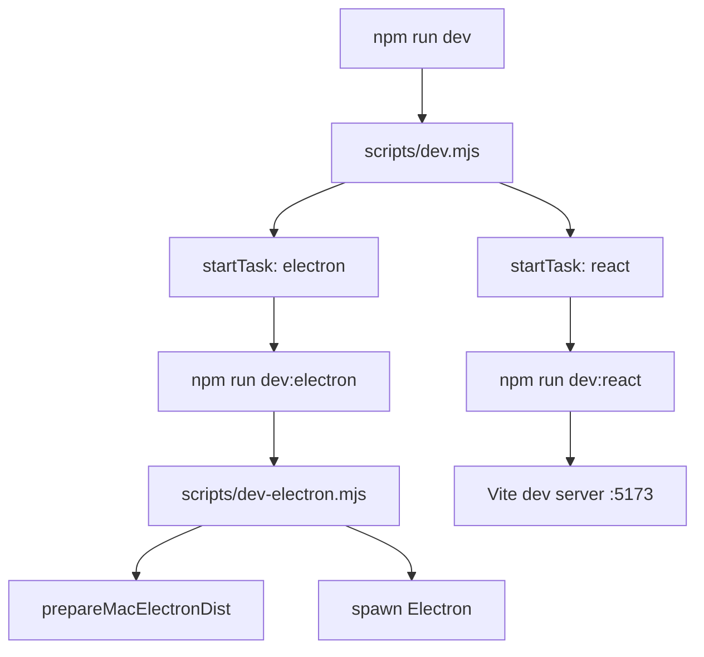
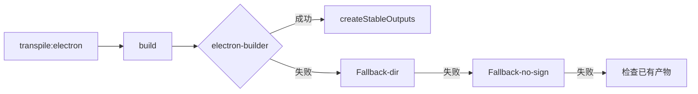
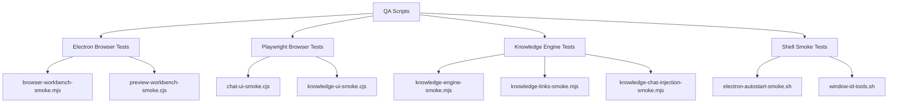

# 工程脚本总览

<cite>
**本文引用的文件**
- [scripts/after-pack-win-icon.cjs](file://scripts/after-pack-win-icon.cjs)
- [scripts/codex-oauth-setup.mjs](file://scripts/codex-oauth-setup.mjs)
- [scripts/dev-electron.mjs](file://scripts/dev-electron.mjs)
- [scripts/dev.mjs](file://scripts/dev.mjs)
- [scripts/package-win-safe.mjs](file://scripts/package-win-safe.mjs)
- [scripts/sync-claude-code-compat.mjs](file://scripts/sync-claude-code-compat.mjs)
- [scripts/qa/browser-workbench-smoke.mjs](file://scripts/qa/browser-workbench-smoke.mjs)
- [scripts/qa/chat-ui-smoke.cjs](file://scripts/qa/chat-ui-smoke.cjs)
- [scripts/github-release.mjs](file://scripts/github-release.mjs)
- [scripts/qa/knowledge-chat-injection-smoke.mjs](file://scripts/qa/knowledge-chat-injection-smoke.mjs)
- [scripts/qa/knowledge-links-smoke.mjs](file://scripts/qa/knowledge-links-smoke.mjs)
- [scripts/qa/knowledge-engine-smoke.mjs](file://scripts/qa/knowledge-engine-smoke.mjs)
- [scripts/qa/knowledge-ui-smoke.cjs](file://scripts/qa/knowledge-ui-smoke.cjs)
- [skills/tech-cc-hub-release-deploy/scripts/publish-release.mjs](file://skills/tech-cc-hub-release-deploy/scripts/publish-release.mjs)
- [scripts/qa/preview-workbench-smoke.cjs](file://scripts/qa/preview-workbench-smoke.cjs)
- [pro-workflow/scripts/cwd-changed.js](file://pro-workflow/scripts/cwd-changed.js)
- [scripts/qa/electron-autostart-smoke.sh](file://scripts/qa/electron-autostart-smoke.sh)
- [scripts/qa/window-id-tools.sh](file://scripts/qa/window-id-tools.sh)
</cite>

## 目录

- [职责总览与脚本分类](#职责总览与脚本分类)
- [开发链路脚本](#开发链路脚本)
- [打包与构建脚本](#打包与构建脚本)
- [发布与部署脚本](#发布与部署脚本)
- [QA 冒烟测试体系](#qa-冒烟测试体系)
- [Electron IPC 与前后端桥接](#electron-ipc-与前后端桥接)
- [Pro-Workflow 自动化](#pro-workflow-自动化)
- [Agent 改代码地图](#agent-改代码地图)
- [常见问题与排障指南](#常见问题与排障指南)

---

## 职责总览与脚本分类

`tech-cc-hub` 的工程脚本分布在 `scripts/` 和 `pro-workflow/scripts/` 目录下，按职责可分为四类：

| 类别 | 脚本 | 职责 |
|------|------|------|
| **开发链路** | `dev.mjs`, `dev-electron.mjs` | 启动 React + Electron 联合开发环境 |
| **打包构建** | `package-win-safe.mjs`, `after-pack-win-icon.cjs`, `sync-claude-code-compat.mjs` | Windows 打包、图标注入、Claude Code 兼容性同步 |
| **发布部署** | `github-release.mjs`, `publish-release.mjs` | GitHub Release 创建、API 文件树发布 |
| **QA 测试** | `qa/` 目录下 9 个冒烟测试脚本 | 验证浏览器、聊天 UI、知识引擎、Electron 自启动等核心功能 |
| **Pro-Workflow** | `cwd-changed.js` | 工作目录切换检测与项目类型识别 |

### 脚本入口点

所有脚本均通过 `npm run <script-name>` 或直接 `node scripts/xxx.mjs` 调用。核心入口在 `package.json` 的 `scripts` 字段中定义。`scripts/dev.mjs` 是开发链路的主入口，`scripts/package-win-safe.mjs` 是 Windows 打包的主入口。

---

## 开发链路脚本

### `scripts/dev.mjs` — 双进程启动器

**职责**：同时启动 React (Vite) 开发服务器和 Electron 主进程，统一管理两者的生命周期。

**入口**：执行 `npm run dev` 时调用，作为主进程守护者。

**关键数据结构**：

```javascript
const children = new Map();  // name -> child process
let shuttingDown = false;
```

`children` Map 存储各子进程引用，`shuttingDown` 标志位防止重复退出。

**调用链**：



**关键符号**（来源 [file://scripts/dev.mjs#L22-L35](file://scripts/dev.mjs#L22-L35)）：

- `startTask(name, args)` — 启动子进程，Windows 使用 `cmd.exe /c`，Unix 使用 `spawn`
- `stopAll(exitCode)` — SIGINT/SIGTERM 回调，杀死所有子进程
- 子进程退出码非零时自动传播退出码

**失败模式**：

- Vite 启动失败 → 立即 `stopAll(1)`，Electron 同时终止
- Electron 启动失败 → 退出码来自 `dev-electron.mjs` 的 `process.exit(1)`
- macOS 上 `xattr` 清理失败 → `runOptional` 静默忽略，继续执行

### `scripts/dev-electron.mjs` — Electron 运行时准备

**职责**：Mac 平台签名验证、Electron.app 缓存路径设置、`ELECTRON_OVERRIDE_DIST_PATH` 环境变量注入。

**关键函数**（来源 [file://scripts/dev-electron.mjs#L72-L108](file://scripts/dev-electron.mjs#L72-L108)）：

- `prepareMacElectronDist()` — 核心逻辑，返回缓存路径或 `null`
- `verifyCodesign(appPath)` — 调用 `codesign --verify --deep --strict` 验证签名
- `electronVersionLabel()` — 从 `package.json` 提取 Electron 版本号
- `cleanMacExtendedAttributes(appPath)` — 移除 `com.apple.quarantine` 等属性

**缓存机制**：

```
node_modules/electron/dist/Electron.app
    ↓ ditto copy + xattr cleanup + codesign sign
~/Library/Caches/tech-cc-hub/electron-{version}-dist/Electron.app
    ↓ set ELECTRON_OVERRIDE_DIST_PATH
Electron runtime uses cached signed app
```

**数据流**：版本号 → 缓存目录 → codesign 验证 → 环境变量注入 → `spawn(process.execPath, [electronCli, ...])`

---

## 打包与构建脚本

### `scripts/package-win-safe.mjs` — Windows 多策略打包

**职责**：执行 `transpile:electron` → `build` → `electron-builder` 三阶段构建，失败时尝试降级策略。

**入口**：`npm run package:win` 或 CI/CD 流水线直接调用。

**关键数据结构**（来源 [file://scripts/package-win-safe.mjs#L7-L14](file://scripts/package-win-safe.mjs#L7-L14)）：

```javascript
const cwd = process.cwd();
const distDir = path.join(cwd, "dist");
const stamp = new Date().toISOString().slice(0, 10).replace(/-/g, "");  // 格式: 20240115
const noSignEnv = {
  CSC_IDENTITY_AUTO_DISCOVERY: "false",
  SIGNTOOL_PATH: "",
  WCT_CSC_KEY_PASSWORD: "",
};
```

**三阶段降级策略**（来源 [file://scripts/package-win-safe.mjs#L154-L166](file://scripts/package-win-safe.mjs#L154-L166)）：

1. **Primary**：`--win --x64` + `--config.win.forceCodeSigning=false`
2. **Fallback-dir**：增加 `--dir` 参数输出未打包目录
3. **Fallback-no-sign-flag**：尝试 `--config.asar=true`

**调用链**：



**输出产物命名**：

- `tech-cc-hub-win-x64-{stamp}.exe` — NSIS 安装包
- `tech-cc-hub-win-unpacked-{stamp}.zip` — 未打包 zip
- `tech-cc-hub-win-x64-{stamp}.zip` — 可移植 zip

### `scripts/after-pack-win-icon.cjs` — Windows 图标注入

**职责**：Electron 打包完成后，使用 `rcedit.exe` 将 `build/icon.ico` 注入到生成的 exe 文件中。

**入口**：作为 electron-builder 的 `afterPack` hook 自动调用，**无需手动执行**。

**关键路径解析**（来源 [file://scripts/after-pack-win-icon.cjs#L10-L20](file://scripts/after-pack-win-icon.cjs#L10-L20)）：

```javascript
const projectDir = context.packager.projectDir;
const appOutDir = context.appOutDir;
const iconPath = path.join(projectDir, "build", "icon.ico");
const rceditPath = path.join(projectDir, "node_modules", "electron-winstaller", "vendor", "rcedit.exe");
const candidates = [
  path.join(appOutDir, `${productFilename}.exe`),
  path.join(appOutDir, "tech-cc-hub.exe"),
  path.join(appOutDir, "electron.exe"),
];
```

**exe 文件名探测顺序**：`productFilename > "tech-cc-hub.exe" > "electron.exe"`。

**失败模式**：

- 缺少 `build/icon.ico` → 静默跳过，输出 `[after-pack-win-icon] skipped: missing exe, icon, or rcedit`
- `rcedit.exe` 路径错误 → `spawnSync` 返回 `result.error`，抛出异常中断打包

### `scripts/sync-claude-code-compat.mjs` — Claude Code 兼容性同步

**职责**：从 `https://claudelog.com/claude-code-changelog/` 抓取变更日志，生成 TypeScript 兼容注册表。

**入口**：`node scripts/sync-claude-code-compat.mjs` 或 CI 自动触发。

**输出文件**：`src/electron/libs/claude-code-compat-registry.ts`

**导出的符号**（来源 [file://scripts/sync-claude-code-compat.mjs#L178-L187](file://scripts/sync-claude-code-compat.mjs#L178-L187)）：

```typescript
export const CLAUDE_CODE_COMPAT_REGISTRY: ClaudeCodeCompatRegistry
export const CLAUDE_CODE_COMPAT_COMMAND_ITEMS = CLAUDE_CODE_COMPAT_REGISTRY.commandItems
export function buildClaudeCodeCompatPromptAppend(): string
```

**数据结构**：

```typescript
type ClaudeCodeCompatRegistry = {
  sourceUrl: string;
  sourceVersion: string;
  sourceDate: string;
  generatedAt: string;
  commandItems: SlashCommandItem[];  // 从 /xxx 命令提取
  promptHints: string[];             // 特性映射到 tech-cc-hub 的行为说明
};
```

---

## 发布与部署脚本

### `scripts/github-release.mjs` — GitHub Release 创建

**职责**：版本号提升、Release Note 生成、Git tag 创建、GitHub API 发布。

**入口**：`npm run release:github -- [patch|minor|major|vX.Y.Z] [flags]`

**命令行参数**（来源 [file://scripts/github-release.mjs#L37-L43](file://scripts/github-release.mjs#L37-L43)）：

| 参数 | 说明 |
|------|------|
| `patch/minor/major/vX.Y.Z` | 版本号提升模式 |
| `--dry-run` | 不执行实际变更 |
| `--no-push` | 不推送 git commit/tag |
| `--allow-dirty` | 允许 dirty worktree |
| `--no-release` | 只创建 commit/tag，不调用 GitHub API |
| `--release-title-template` | Release 标题模板 |
| `--release-note-template` | 自定义 Release Note 模板路径 |

**核心调用链**（来源 [file://scripts/github-release.mjs#L183-L252](file://scripts/github-release.mjs#L183-L252)）：

1. `ensureGitRepository()` — 验证 git 仓库
2. `ensureCleanWorktree()` — 检查无未提交变更
3. `bumpVersion(current, mode)` — 计算新版本号
4. `ensureTagDoesNotExist(tag)` — 避免重复 tag
5. `getGithubToken()` — 优先 `GITHUB_TOKEN` > `GH_TOKEN` > git credential
6. `githubApiRequest(method, endpoint, token, payload)` — 调用 GitHub REST API
7. `getCommitsSinceTag(tag)` / `getFilesSinceTag(tag)` — 生成变更列表

### `skills/tech-cc-hub-release-deploy/scripts/publish-release.mjs` — API 文件树发布

**职责**：通过 GitHub API 将 release commit 的文件树与远程同步，支持 `--api-only` 模式。

**入口**：`node skills/tech-cc-hub-release-deploy/scripts/publish-release.mjs --tag=vX.Y.Z --notes=path/to/notes.md`

**Git 核心操作**（来源 [file://skills/tech-cc-hub-release-deploy/scripts/publish-release.mjs#L213-L250](file://skills/tech-cc-hub-release-deploy/scripts/publish-release.mjs#L213-L250)）：

- `parseNameStatus(raw)` — 解析 `git diff --name-status -z` 输出
- `readTreeMode(ref, filePath)` — 读取文件权限
- `createApiTreeForCommit(token, baseTreeSha, parentRef, commitRef)` — 构建 GitHub Tree 对象
- `publishViaApi(token, tag, treeSha, parentCommitSha)` — 创建 commit 并更新 tag ref

---

## QA 冒烟测试体系

### 测试架构概览



### Electron Browser 测试

#### `scripts/qa/browser-workbench-smoke.mjs`

**职责**：验证 `BrowserWorkbenchManager` 类的核心功能：页面打开、DOM 提取、控制台日志、截图、坐标检查、导航历史。

**Source-of-truth**：从 `dist-electron/electron/browser-manager.js` 导入 `BrowserWorkbenchManager`。

**测试用例列表**（来源 [file://scripts/qa/browser-workbench-smoke.mjs#L71-L167](file://scripts/qa/browser-workbench-smoke.mjs#L71-L167)）：

| 测试名 | 验证内容 |
|--------|----------|
| `open_page` | `manager.open(fixture.firstUrl)` 成功加载 |
| `get_state` | `manager.getState()` 返回 title |
| `extract_page` | `manager.extractPageSnapshot()` 返回 text/links/images |
| `console_logs` | `manager.getConsoleLogs(20)` 获取控制台输出 |
| `capture_visible` | `manager.captureVisible()` 返回 base64 PNG |
| `inspect_at_point` | `manager.inspectAtPoint({x:80, y:80})` 返回 DOM 提示 |
| `annotation_mode` | `manager.setAnnotationMode(true/false)` 切换 |
| `back_forward` | `manager.goBack()` / `manager.goForward()` |
| `close_page` | `manager.close()` 清理页面状态 |

#### `scripts/qa/preview-workbench-smoke.cjs`

**职责**：验证 Monaco 编辑器 + Explorer 的预览工作台功能。

**关键断言**（来源 [file://scripts/qa/preview-workbench-smoke.cjs#L44-L51](file://scripts/qa/preview-workbench-smoke.cjs#L44-L51)）：

```javascript
// 代码引用应渲染为 chip，不应泄漏到 textarea
if (textareaValues.some((value) => value.includes('<code_references>'))) {
  throw new Error('Code reference block leaked into textarea instead of staying as UI chip');
}
```

### Playwright UI 测试

#### `scripts/qa/chat-ui-smoke.cjs`

**职责**：验证聊天输入区的 `@` 文件提及和 `/` 命令面板。

**关键流程**（来源 [file://scripts/qa/chat-ui-smoke.cjs#L19-L46](file://scripts/qa/chat-ui-smoke.cjs#L19-L46)）：

1. 定位 `<textarea>` 并聚焦
2. 输入 `@src` 触发文件提及
3. 等待 " `@ 文件提及` " 可见
4. 验证 bodyText 包含 "路径引用"
5. 检查 textarea 中不包含 `<file_references>` 或 `<message_references>` XML 片段

#### `scripts/qa/knowledge-ui-smoke.cjs`

**职责**：验证知识库 UI 的文档生成、标签切换、折叠/展开功能。

**Mermaid 渲染验证**（来源 [file://scripts/qa/knowledge-ui-smoke.cjs#L85-L89](file://scripts/qa/knowledge-ui-smoke.cjs#L85-L89)）：

```javascript
// 断言：Mermaid 代码块不应以 <pre> 原样显示
const rawMermaidCodeBlocks = await page.locator('pre').filter({ hasText: /flowchart|sequenceDiagram/ }).count();
if (rawMermaidCodeBlocks > 0) {
  throw new Error(`Knowledge UI still renders Mermaid diagrams as raw code blocks`);
}
```

### 知识引擎测试

#### `scripts/qa/knowledge-engine-smoke.mjs`

**职责**：验证 Repo Wiki 索引完整性、元数据质量、sqlite-vec 向量库就绪状态。

**Source-of-truth**：从应用数据目录读取 SQLite 数据库文件。

**数据路径**（来源 [file://scripts/qa/knowledge-engine-smoke.mjs#L6-L43](file://scripts/qa/knowledge-engine-smoke.mjs#L6-L43)）：

```javascript
const appDataRoot = process.env.TECH_CC_HUB_APP_DATA || (darwin ? "~/Library/Application Support/tech-cc-hub" : "~/.tech-cc-hub");
const indexDbPath = latestKnowledgeDb();  // 找最新的 knowledge.sqlite
const uiDbPath = path.join(appDataRoot, "knowledge/knowledge-ui.sqlite");
const wikiRoot = path.join(workspaceRoot, ".tech/repowiki/zh/content");
const metadataPath = path.join(workspaceRoot, ".tech/repowiki/zh/meta/repowiki-metadata.json");
```

**关键质量阈值**（来源 [file://scripts/qa/knowledge-engine-smoke.mjs#L66-L120](file://scripts/qa/knowledge-engine-smoke.mjs#L66-L120)）：

| 指标 | 最低值 | 最高值 | 说明 |
|------|--------|--------|------|
| `indexedDocuments` | 60 | - | 足够覆盖主要功能模块 |
| `indexedChunks` | 300 | - | 支持深度代码理解 |
| `generatedFiles` | 60 | - | Wiki 页面数量 |
| `wikiCatalogs.length` | 40 | 80 | 适中，避免过度碎片化 |
| `mermaidPages` | 25% | - | 至少 1/4 页面有图表 |
| `agentMapPages` | 50% | - | 至少 1/2 页面有改代码地图 |

#### `scripts/qa/knowledge-links-smoke.mjs`

**职责**：验证 Repo Wiki 内部链接的有效性。

**Source-of-truth**：扫描 `.tech/repowiki/` 目录下的 Markdown 文件。

**链接类型处理**（来源 [file://scripts/qa/knowledge-links-smoke.mjs#L242-L244](file://scripts/qa/knowledge-links-smoke.mjs#L242-L244)）：

```javascript
function isSoftEvidenceReference(value) {
  return isCommandReference(value)      // npm:xxx
      || isBareModuleSpecifier(value)  // @scope/pkg, node:fs
      || isRelativeImportSpecifier(value);  // ./foo, ../bar
}
```

#### `scripts/qa/knowledge-chat-injection-smoke.mjs`

**职责**：端到端验证知识概览注入到 Agent 运行时的链路。

**前后端桥接点**（来源 [file://scripts/qa/knowledge-chat-injection-smoke.mjs#L26-L36](file://scripts/qa/knowledge-chat-injection-smoke.mjs#L26-L36)）：

```javascript
async function callBridge(method, ...args) {
  const response = await fetch(`${BRIDGE_ORIGIN}/rpc/${encodeURIComponent(method)}`, {
    method: "POST",
    headers: { "Content-Type": "application/json" },
    body: JSON.stringify({ args }),
  });
  const payload = await response.json();
  return payload.result;
}
```

- **BRIDGE_ORIGIN**：`http://127.0.0.1:4317`（开发环境）或 `TECH_CC_HUB_DEV_BRIDGE_ORIGIN` 环境变量
- **RPC 方法**：`invoke`, `knowledge:overview`, `sendClientEvent`
- **SSE 事件流**：`/events/server` 返回 `session.status`, `runner.error`, `stream.message`

### Shell 测试

#### `scripts/qa/electron-autostart-smoke.sh`

**职责**：端到端验证 Electron 自启动功能，从 `bun run dev:react` 到 session 完成。

**数据库轮询逻辑**（来源 [file://scripts/qa/electron-autostart-smoke.sh#L53-L76](file://scripts/qa/electron-autostart-smoke.sh#L53-L76)）：

```bash
# 查询 sessions 表直到 status=completed
sqlite3 "$DB_PATH" "select status || '|' || claude_session_id from sessions where last_prompt = '$expected_prompt' order by updated_at desc limit 1;"
```

**环境变量**：

- `SMOKE_TIMEOUT_SECONDS`：超时阈值（默认 60 秒）
- `SMOKE_AUTOSTART_CWD`：启动工作目录

---

## Electron IPC 与前后端桥接

### BrowserWorkbenchManager 桥接

`BrowserWorkbenchManager` 是 Electron 主进程与渲染进程之间的核心桥接类，位于 `dist-electron/electron/browser-manager.js`。

**IPC 通道类型**：

| 方法 | 返回类型 | 说明 |
|------|----------|------|
| `getState()` | `{url, title, loading, canGoBack}` | 当前页面状态 |
| `extractPageSnapshot()` | `{success, snapshot: {title, text, links, images, headings}}` | 完整 DOM 快照 |
| `captureVisible()` | `{success, dataUrl}` | Base64 PNG 截图 |
| `inspectAtPoint({x, y})` | `{tagName, selector, text}` | DOM 元素信息 |
| `setAnnotationMode(enabled)` | `{annotationMode}` | 标注模式切换 |

### 知识引擎桥接

**Dev Bridge Server**（来源 [file://scripts/qa/knowledge-chat-injection-smoke.mjs#L26-L36](file://scripts/qa/knowledge-chat-injection-smoke.mjs#L26-L36)）：

- **协议**：HTTP REST + Server-Sent Events
- **Base URL**：`http://127.0.0.1:4317`
- **RPC 端点**：`/rpc/{methodName}`（POST）
- **SSE 端点**：`/events/server`（GET）

**刷新/重启边界**：

- 知识索引变更 → 需要重启 Electron 主进程
- Repo Wiki 文件变更 → 自动触发热更新，无需重启
- `knowledge.sqlite` 更新 → 需要等待索引任务完成后才能读取

---

## Pro-Workflow 自动化

### `pro-workflow/scripts/cwd-changed.js`

**职责**：工作目录切换时检测项目类型，写入 `PRO_WORKFLOW_PROJECT_TYPE` 环境变量。

**入口**：Claude Code 的 ProWorkflow 插件触发。

**项目类型检测**（来源 [file://pro-workflow/scripts/cwd-changed.js#L22-L27](file://pro-workflow/scripts/cwd-changed.js#L22-L27)）：

```javascript
const type = hasPackageJson ? 'node'
  : fs.existsSync(path.join(newCwd, 'Cargo.toml')) ? 'rust'
  : fs.existsSync(path.join(newCwd, 'go.mod')) ? 'go'
  : fs.existsSync(path.join(newCwd, 'pyproject.toml')) ? 'python'
  : null;
```

**文件检测优先级**：

1. `.git` — Git 仓库
2. `package.json` — Node.js 项目
3. `CLAUDE.md` / `.claude` — Claude Code 指令文件

---

## Agent 改代码地图

### 先读文件

| 优先级 | 文件 | 说明 |
|--------|------|------|
| 1 | `scripts/package-win-safe.mjs` | 打包主入口，理解构建流程 |
| 2 | `scripts/dev-electron.mjs` | Electron 运行时，理解签名机制 |
| 3 | `scripts/qa/browser-workbench-smoke.mjs` | BrowserWorkbenchManager 使用方式 |
| 4 | `scripts/qa/knowledge-chat-injection-smoke.mjs` | Dev Bridge RPC 调用模式 |

### 关键符号 / IPC / MCP 工具

**BrowserWorkbenchManager**：

- 类名：`BrowserWorkbenchManager`
- 导入路径：`../../dist-electron/electron/browser-manager.js`
- 实例化：`new BrowserWorkbenchManager(window)`

**Dev Bridge RPC**：

- `callBridge(method, ...args)` — HTTP POST 到 `/rpc/{method}`
- `subscribeServerEvents(onEvent, signal)` — SSE 订阅

**Electron 环境变量**：

- `ELECTRON_OVERRIDE_DIST_PATH` — 覆盖 Electron.app 路径
- `TECH_CC_HUB_DEV_BRIDGE_ORIGIN` — Dev Bridge Server 地址
- `TECH_CC_HUB_APP_DATA` — 应用数据根目录

### 修改入口

**添加新 QA 测试**：

1. 在 `scripts/qa/` 下创建新脚本
2. 遵循命名规范：`{feature}-smoke.mjs` 或 `{feature}-smoke.cjs`
3. 导出 JSON 结构：`{ok: boolean, checks: [{name, ok, detail}]}`
4. 错误时调用 `fail(message)` 并 `process.exit(1)`

**修改打包流程**：

1. 编辑 `scripts/package-win-safe.mjs`
2. 在 `strategies` 数组添加新策略
3. 修改 `createStableOutputs()` 调整产物命名

**添加 Claude Code 兼容命令**：

1. 运行 `node scripts/sync-claude-code-compat.mjs --version=2.1.X`
2. 检查 `src/electron/libs/claude-code-compat-registry.ts` 输出
3. 如需自定义行为，在 `promptHints` 数组添加映射说明

### 验证命令

```bash
# 开发链路验证
npm run dev

# Windows 打包（本地）
npm run package:win

# Windows 打包（CI，多策略降级）
node scripts/package-win-safe.mjs

# Playwright UI 测试
CHAT_UI_QA_URL=http://localhost:4173/ node scripts/qa/chat-ui-smoke.cjs
KNOWLEDGE_UI_QA_URL=http://localhost:4173/ node scripts/qa/knowledge-ui-smoke.cjs

# 知识引擎验证
KNOWLEDGE_QA_WORKSPACE=$(pwd) node scripts/qa/knowledge-engine-smoke.mjs
node scripts/qa/knowledge-links-smoke.mjs

# Electron 自启动验证
bash scripts/qa/electron-autostart-smoke.sh "请只回复：SMOKE_OK"

# GitHub Release
npm run release:github -- patch --dry-run
npm run release:github -- minor --no-push --allow-dirty

# Claude Code 兼容性同步
node scripts/sync-claude-code-compat.mjs --version=2.1.18
```

### 常见回归风险

| 风险点 | 触发场景 | 回滚方案 |
|--------|----------|----------|
| `ELECTRON_OVERRIDE_DIST_PATH` 指向未签名 app | macOS 打包验证失败 | 删除该环境变量，重新 `npm install` |
| `rcedit.exe` 路径变更 | Electron 版本升级 | 更新 `after-pack-win-icon.cjs` 第 14 行 |
| Dev Bridge 端口冲突 | `4317` 被占用 | 设置 `TECH_CC_HUB_DEV_BRIDGE_ORIGIN` 为其他端口 |
| Vite 启动慢导致超时 | CI 环境性能差 | 增加 `wait_for_vite` 的 deadline（默认 20s） |
| 知识索引 SQLite 锁定 | 并发读写 `knowledge.sqlite` | 确保顺序执行，先读后写 |

---

## 常见问题与排障指南

### 打包失败：`no usable artifact found`

**原因**：`electron-builder` 所有策略均失败，且 `dist/win-unpacked` 也被清理。

**排查步骤**（来源 [file://scripts/package-win-safe.mjs#L34-L62](file://scripts/package-win-safe.mjs#L34-L62)）：

```bash
# 1. 检查 transpile 是否成功
npm run transpile:electron

# 2. 检查 build 是否成功
npm run build

# 3. 手动执行 electron-builder 查看详细错误
npx electron-builder --win --x64 --dir --verbose

# 4. 检查 win-unpacked 是否存在
ls -la dist/win-unpacked/
```

### macOS Electron 签名失败

**原因**：`codesign --verify --deep --strict` 失败。

**排查步骤**（来源 [file://scripts/dev-electron.mjs#L91-L107](file://scripts/dev-electron.mjs#L91-L107)）：

```bash
# 1. 检查缓存目录
ls -la ~/Library/Caches/tech-cc-hub/

# 2. 手动验证签名
codesign --verify --deep --strict --verbose=2 ~/Library/Caches/tech-cc-hub/electron-*/Electron.app

# 3. 清除缓存重新生成
rm -rf ~/Library/Caches/tech-cc-hub/electron-*-dist
npm run dev:electron
```

### QA 测试超时

**常见超时来源**：

| 测试 | 默认超时 | 调整方式 |
|------|----------|----------|
| `electron-autostart-smoke.sh` | 60s | `SMOKE_TIMEOUT_SECONDS=120` |
| `knowledge-chat-injection-smoke.mjs` | 150s | `KNOWLEDGE_CHAT_QA_TIMEOUT_MS=300000` |
| Playwright 页面加载 | 15s | 修改脚本内 `waitUntil` 参数 |

### knowledge-engine-smoke 报告索引不足

**原因**：索引任务未完成或 Repo Wiki 生成质量不达标。

**排查路径**（来源 [file://scripts/qa/knowledge-engine-smoke.mjs#L66-L69](file://scripts/qa/knowledge-engine-smoke.mjs#L66-L69)）
