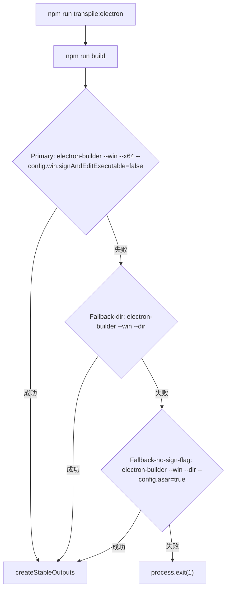
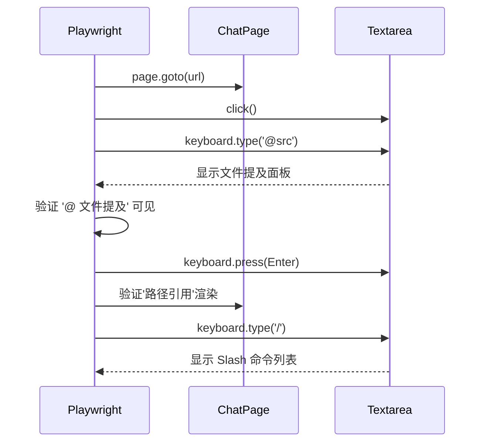

# 工程脚本总览

<cite>
**本文引用的文件**
- [scripts/after-pack-win-icon.cjs](file://scripts/after-pack-win-icon.cjs)
- [scripts/codex-oauth-setup.mjs](file://scripts/codex-oauth-setup.mjs)
- [scripts/dev-electron.mjs](file://scripts/dev-electron.mjs)
- [scripts/dev.mjs](file://scripts/dev.mjs)
- [scripts/package-win-safe.mjs](file://scripts/package-win-safe.mjs)
- [scripts/sync-claude-code-compat.mjs](file://scripts/sync-claude-code-compat.mjs)
- [scripts/qa/browser-workbench-smoke.mjs](file://scripts/qa/browser-workbench-smoke.mjs)
- [scripts/qa/chat-ui-smoke.cjs](file://scripts/qa/chat-ui-smoke.cjs)
- [scripts/github-release.mjs](file://scripts/github-release.mjs)
</cite>

## 目录

- [概述与职责边界](#概述与职责边界)
- [开发时脚本链](#开发时脚本链)
- [Windows 打包链路](#windows-打包链路)
- [Codex OAuth 初始化](#codex-oauth-初始化)
- [Claude Code 兼容性同步](#claude-code-兼容性同步)
- [QA 冒烟测试](#qa-冒烟测试)
- [GitHub Release 自动化](#github-release-自动化)
- [调用关系图与状态流](#调用关系图与状态流)
- [扩展点与常见改造路径](#扩展点与常见改造路径)
- [验证命令速查表](#验证命令速查表)

---

## 概述与职责边界

`scripts/` 目录下的脚本是 tech-cc-hub 项目工程基础设施的重要组成部分。它们承担了开发调试、打包发布、认证集成、兼容性同步和自动化测试五大职责。与业务代码分离，脚本之间通过约定好的数据结构和文件系统路径协作，形成一条可观测、可复现的工程流水线。

**脚本职责矩阵**

| 脚本 | 职责域 | 触发时机 | 输出产物 |
|------|--------|----------|----------|
| `dev.mjs` | 开发时编排 | `npm run dev` | 启动 React + Electron 并发进程 |
| `dev-electron.mjs` | Electron 运行时准备 | `dev.mjs` 调用 | 签名后的 Electron.app 路径 |
| `package-win-safe.mjs` | Windows 打包 | `npm run pack:win` | `.exe` + `.zip` 产物 |
| `after-pack-win-icon.cjs` | Windows 图标注入 | `electron-builder` afterPack hook | 带图标的 exe |
| `codex-oauth-setup.mjs` | Codex 认证配置 | `npm run setup:codex` | `api-config.json` 中的 profile |
| `sync-claude-code-compat.mjs` | Claude Code 兼容注册表 | `npm run sync:compat` | `claude-code-compat-registry.ts` |
| `browser-workbench-smoke.mjs` | 浏览器工作台冒烟 | CI / 本地调试 | JSON 检查报告 |
| `chat-ui-smoke.cjs` | Chat UI 冒烟 | CI / 本地调试 | `CHAT_UI_QA_OK` |
| `github-release.mjs` | GitHub Release | `npm run release:github` | git tag + GitHub Release |

**章节来源**：[scripts/after-pack-win-icon.cjs#L1-L5](file://scripts/after-pack-win-icon.cjs#L1-L5)、[scripts/dev.mjs#L1-L3](file://scripts/dev.mjs#L1-L3)

---

## 开发时脚本链

### dev.mjs — 并发进程编排器

**职责**：作为开发时入口脚本，同时启动 React 前端开发服务器和 Electron 主进程。`dev.mjs` 不直接执行构建，而是通过 `npm run` 调用子任务，通过平台差异化命令实现跨 OS 兼容。

**关键数据结构**：

```javascript
// children: Map<string, ChildProcess> — 按名称追踪子进程
// shuttingDown: boolean — 优雅关闭标志
// 平台差异化处理：
//   - Windows: cmd.exe /d /s /c <command>
//   - Unix: npm <args>
```

**入口参数**：`dev.mjs` 本身不接受参数，直接启动两个任务：

```javascript
startTask("react", ["run", "dev:react"]);
startTask("electron", ["run", "dev:electron"]);
```

**优雅退出机制**：收到 `SIGINT` 或 `SIGTERM` 时，遍历 `children` Map 并逐个 `kill()`，500ms 后强制退出进程。

**章节来源**：[scripts/dev.mjs#L1-L65](file://scripts/dev.mjs#L1-L65)

### dev-electron.mjs — Electron 运行时准备

**职责**：在 macOS 上，Electron.app 需要代码签名才能正常开发和测试。`dev-electron.mjs` 在启动 Electron 前完成以下工作：

1. **版本读取**：从 `package.json` 的 `devDependencies.electron` 提取版本号
2. **签名验证**：使用 `codesign --verify --deep --strict` 检查现有缓存
3. **缓存管理**：将签名后的 Electron.app 缓存在 `~/Library/Caches/tech-cc-hub/electron-<version>-dist`
4. **签名执行**：通过 `codesign --force --deep --sign -` 自签名
5. **xattr 清理**：移除 macOS 扩展属性（FinderInfo、quarantine 等）

**ELECTRON_OVERRIDE_DIST_PATH**：设置此环境变量后，Electron 使用指定路径的 app bundle 而非 `node_modules/electron/dist`。

**失败模式**：
- `Electron.app not found at ...` — 未运行 `npm install`
- `Prepared Electron.app did not pass codesign verification` — 签名失败，权限问题常见

**章节来源**：[scripts/dev-electron.mjs#L46-L108](file://scripts/dev-electron.mjs#L46-L108)

---

## Windows 打包链路

### package-win-safe.mjs — 打包策略降级

**职责**：作为 Windows 打包主脚本，按优先级尝试多种 electron-builder 调用策略，确保最终产出可用产物。

**策略降级序列**：



**关键配置**：`noSignEnv` 将三个环境变量设为禁用代码签名状态（`CSC_IDENTITY_AUTO_DISCOVERY: "false"` 等）。

**稳定产物命名**：使用日期戳生成稳定输出文件名：

```javascript
// stamp = "20251219" 格式
tech-cc-hub-win-x64-<stamp>.exe
tech-cc-hub-win-unpacked-<stamp>.zip
tech-cc-hub-win-x64-<stamp>.zip
```

**章节来源**：[scripts/package-win-safe.mjs#L1-L186](file://scripts/package-win-safe.mjs#L1-L186)

### after-pack-win-icon.cjs — Electron Builder afterPack Hook

**职责**：在 electron-builder 完成 Windows 打包后，使用 `rcedit.exe` 将 `build/icon.ico` 注入到 exe 文件中。此脚本作为 [afterPack 钩子](file://scripts/after-pack-win-icon.cjs#L5) 被 electron-builder 调用。

**执行条件**（任一缺失则跳过）：
- Windows 平台（`context.electronPlatformName === "win32"`）
- 存在 `build/icon.ico`
- 存在 `node_modules/electron-winstaller/vendor/rcedit.exe`
- 存在目标 exe

**exe 路径候选**：按优先级查找：

```javascript
// productFilename.exe → tech-cc-hub.exe → electron.exe
candidates.find((candidate) => existsSync(candidate))
```

**章节来源**：[scripts/after-pack-win-icon.cjs#L1-L39](file://scripts/after-pack-win-icon.cjs#L1-L39)

---

## Codex OAuth 初始化

### codex-oauth-setup.mjs — 官方 Codex 登录到应用配置的桥梁

**职责**：读取官方 `codex login` 生成的 `~/.codex/auth.json`，将其转换为 tech-cc-hub 的 `api-config.json` profile 格式。

**数据转换流程**：

```
~/.codex/auth.json (token格式)
        │
        ▼ codexAuthToCredential()
token结构标准化 { access_token, id_token, refresh_token, account_id, email }
        │
        ▼ normalizeExpiry() / jwtExpiresAt()
过期时间标准化为 ISO 8601 格式
        │
        ▼ buildCodexProfile()
Profile对象 { id, name, apiKey, baseURL, model, expertModel, smallModel, models[] }
        │
        ▼ saveCodexProfile()
写入 api-config.json (profiles 数组)
```

**关键数据结构 — Credential**：

```javascript
{
  id_token: string | undefined,
  access_token: string,
  refresh_token: string | undefined,
  account_id: string,
  email: string | undefined,
  type: "codex",
  expired: string | undefined,  // ISO 8601
  last_refresh: string          // ISO 8601
}
```

**默认模型配置**：

| 模型字段 | 默认值 |
|----------|--------|
| `model` | `gpt-5.5` |
| `expertModel` | `gpt-5.5` |
| `smallModel` | `gpt-5.3-codex-spark` |
| `analysisModel` | `gpt-5.3-codex-spark` |

**配置路径优先级**：

```javascript
// 1. 环境变量 2. Windows APPDATA 3. macOS Application Support 4. XDG_CONFIG_HOME
TECH_CC_HUB_API_CONFIG → %APPDATA%/tech-cc-hub/api-config.json → ...
```

**用法**：

```bash
# 标准用法：读取 ~/.codex/auth.json，写入默认配置路径
node scripts/codex-oauth-setup.mjs

# 指定配置路径和 profile 名称
node scripts/codex-oauth-setup.mjs --configPath /path/to/api-config.json --profile-name "My Codex"

# 跳过 codex login（仅从已有 auth.json 读取）
node scripts/codex-oauth-setup.mjs --noLogin
```

**章节来源**：[scripts/codex-oauth-setup.mjs#L67-L139](file://scripts/codex-oauth-setup.mjs#L67-L139)

---

## Claude Code 兼容性同步

### sync-claude-code-compat.mjs — 从官方 Changelog 生成兼容注册表

**职责**：抓取 [Claude Code 官方 Changelog](https://claudelog.com/claude-code-changelog/)，解析版本变更和命令列表，生成 TypeScript 类型的兼容注册表文件。

**输出文件**：`src/electron/libs/claude-code-compat-registry.ts`

**注册表数据结构**：

```typescript
export type ClaudeCodeCompatRegistry = {
  sourceUrl: string;           // 原始 URL
  sourceVersion: string;       // e.g. "2.1.89"
  sourceDate: string;         // e.g. "Dec 19, 2025"
  generatedAt: string;         // ISO 8601
  commandItems: SlashCommandItem[];  // 解析出的命令项
  promptHints: string[];       // 功能映射提示
};
```

**命令项数据结构**：

```javascript
{ name: string, description: string }
// 例如: { name: "agents", description: "claude agents / agent view is a session-and-agent overview" }
```

**版本匹配逻辑**：支持精确版本和版本范围匹配，`2.0.x` 版本号自动映射到 `2.1.x` 格式（`normalizeVersion` 函数）。

**Prompt Hints**：针对关键功能生成映射提示，如 `/goal` 命令的完整描述映射到 tech-cc-hub 中的实现方式。

**用法**：

```bash
# 同步最新版本
node scripts/sync-claude-code-compat.mjs

# 指定版本
node scripts/sync-claude-code-compat.mjs --version=2.1.85
node scripts/sync-claude-code-compat.mjs -v 2.1.85
```

**章节来源**：[scripts/sync-claude-code-compat.mjs#L1-L35](file://scripts/sync-claude-code-compat.mjs#L1-L35)

---

## QA 冒烟测试

### browser-workbench-smoke.mjs — Electron 浏览器工作台冒烟

**职责**：在 Electron 环境中实例化 `BrowserWorkbenchManager`，验证核心浏览器功能：页面加载、快照提取、控制台日志、截图、元素检查、标注模式、导航。

**测试用例清单**：

| 用例 | 验证内容 |
|------|----------|
| `open_page` | 页面导航完成，URL 正确 |
| `get_state` | 状态读取包含标题 |
| `extract_page` | 快照提取文本、链接、图片 |
| `console_logs` | 捕获浏览器控制台输出 |
| `capture_visible` | 可见区域截图生成 |
| `inspect_at_point` | 坐标点 DOM 元素查询 |
| `annotation_mode` | 标注模式开关 |
| `reload` | 页面重载状态恢复 |
| `back_forward` | 浏览器历史（前进/后退） |
| `close_page` | 页面关闭状态清理 |

**输出格式**：JSON 结构化报告，包含 `ok` 布尔值和每个 `check` 的详情：

```javascript
{ ok: boolean, checks: [{ name, ok, detail?, error? }] }
```

**依赖**：通过 `dist-electron/electron/browser-manager.js` 导入 `BrowserWorkbenchManager`，需要先完成构建。

**章节来源**：[scripts/qa/browser-workbench-smoke.mjs#L55-L177](file://scripts/qa/browser-workbench-smoke.mjs#L55-L177)

### chat-ui-smoke.cjs — Playwright Chat UI 冒烟

**职责**：使用 Playwright 对 React 构建产物（`http://localhost:4173/`）进行冒烟测试，验证文件提及、Slash 命令等交互功能。

**测试流程**：



**致命日志过滤**：以下日志条目会触发测试失败：

```javascript
// 致命模式 (pageerror / console:error)
'[pageerror]', '[console:error]', 'prompt.startsWith is not a function'
```

**环境变量**：

| 变量 | 默认值 | 说明 |
|------|--------|------|
| `CHAT_UI_QA_URL` | `http://localhost:4173/` | 测试目标 URL |
| `CHROME_PATH` | `/Applications/Google Chrome.app/...` | macOS Chrome 路径 |

**章节来源**：[scripts/qa/chat-ui-smoke.cjs#L1-L63](file://scripts/qa/chat-ui-smoke.cjs#L1-L63)

---

## GitHub Release 自动化

### github-release.mjs — 完整的 Release 流水线

**职责**：自动化执行版本号更新、git commit/tag、GitHub Release 创建的完整流程。

**参数解析**：

| 参数 | 类型 | 说明 |
|------|------|------|
| `patch`/`minor`/`major`/`<vX.Y.Z>` | positional | 版本递增模式 |
| `--dry-run` | flag | 不执行实际操作 |
| `--no-push` | flag | 仅本地创建 tag |
| `--allow-dirty` | flag | 允许未提交的工作区 |
| `--no-release` | flag | 跳过 GitHub API 调用 |
| `--release-title-template` | option | Release 标题模板 |
| `--release-note-template` | option | 自定义 changelog 模板路径 |

**前置检查**：

1. `ensureGitRepository()` — 确认在 git 工作区
2. `ensureOriginRemote()` — 验证 origin 指向 `lst016/tech-cc-hub`
3. `ensureCleanWorktree()` — 检查无未提交变更（除非 `--allow-dirty`）
4. `ensureTagDoesNotExist(tag)` — 防止 tag 重复创建

**GitHub Token 获取优先级**：

```javascript
// 1. 环境变量 2. git credential fill
GITHUB_TOKEN → GH_TOKEN → GITHUB_API_TOKEN → git credential fill
```

**Release Body 模板变量**：

| 变量 | 说明 |
|------|------|
| `{{title}}` | Release 标题 |
| `{{tag}}` | 标签名 |
| `{{commits}}` | 提交列表（最多 40 条） |
| `{{files}}` | 变更文件列表 |
| `{{generated_at}}` | ISO 8601 时间戳 |
| `{{source}}` | 固定值 "脚本生成的提交日志与差异" |

**典型用法**：

```bash
# 常规 release：minor 版本递增
npm run release:github -- minor

# dry-run 验证
npm run release:github -- patch --dry-run

# 仅本地 tag，不 push
npm run release:github -- patch --no-push

# 自定义标题模板
npm run release:github -- patch --release-title-template="## {tag} 正式版发布"
```

**排障**：

- `working tree is dirty` — 提交或 stash 变更后重试
- `local tag already exists` — 已存在 tag，需手动清理
- `GitHub API ... failed with 404` — Token 权限不足或网络问题
- `could not parse GitHub owner/repo` — origin URL 格式异常

**章节来源**：[scripts/github-release.mjs#L37-L444](file://scripts/github-release.mjs#L37-L444)

---

## 调用关系图与状态流

### 脚本间调用关系

```mermaid
flowchart TB
    subgraph dev["开发时"]
        A["npm run dev"] --> B["scripts/dev.mjs"]
        B --> C["npm run dev:react"]
        B --> D["npm run dev:electron"]
        D --> E["scripts/dev-electron.mjs"]
        E --> F["codesign --sign"]
        E --> G["xattr -dr"]
    end

    subgraph pack["打包时"]
        H["npm run pack:win"] --> I["scripts/package-win-safe.mjs"]
        I --> J["electron-builder afterPack"]
        J --> K["scripts/after-pack-win-icon.cjs"]
        K --> L["rcedit --set-icon"]
    end

    subgraph setup["配置时"]
        M["npm run setup:codex"] --> N["scripts/codex-oauth-setup.mjs"]
        N --> O["~/.codex/auth.json"]
        N --> P["api-config.json"]
        Q["npm run sync:compat"] --> R["scripts/sync-claude-code-compat.mjs"]
        R --> S["claudelog.com/changelog"]
        R --> T["claude-code-compat-registry.ts"]
    end

    subgraph qa["测试时"]
        U["npm run qa:browser-workbench"] --> V["scripts/qa/browser-workbench-smoke.mjs"]
        W["npm run qa:chat-ui"] --> X["scripts/qa/chat-ui-smoke.cjs"]
        V --> Y["BrowserWorkbenchManager"]
        X --> Z["Playwright Chromium"]
    end

    subgraph release["发布时"]
        AA["npm run release:github"] --> AB["scripts/github-release.mjs"]
        AB --> AC["npm version"]
        AB --> AD["git commit/tag/push"]
        AB --> AE["GitHub API /repos/{owner}/{repo}/releases"]
    end

    style dev fill:#e8f5e9
    style pack fill:#fff3e0
    style setup fill:#e3f2fd
    style qa fill:#fce4ec
    style release fill:#f3e5f5
```



### 关键状态流

**Electron 开发启动流程**：

```
dev-electron.mjs 启动
        │
        ▼ platform === "darwin"?
    ┌───┴───┐
    │ 是    │ 否
    ▼       ▼
  签名检查    直接使用 node_modules/electron/cli.js
    │
    ▼ ELECTRON_OVERRIDE_DIST_PATH 存在且签名通过?
    ┌───┴───┐
    │ 是    │ 否
    ▼       ▼
  返回缓存   复制到缓存 + xattr 清理 + codesign --sign + 验证
    │       │
    └───────┘
          │
          ▼ 设置 ELECTRON_OVERRIDE_DIST_PATH
          │
          ▼ spawn electron/cli.js
```

**图表来源**：[scripts/dev-electron.mjs#L72-L108](file://scripts/dev-electron.mjs#L72-L108)

---

## 扩展点与常见改造路径

### 1. 新增打包平台（macOS/Linux）

`package-win-safe.mjs` 目前仅针对 Windows。当前策略降级模式易于扩展：

```javascript
// 在 strategies 数组中新增 macOS 策略
const strategies = [
    // Windows 现有策略...
    ["Fallback-darwin", ["npx", "electron-builder", "--mac", "--x64"]],
];
```

### 2. 添加新的 QA 测试用例

**browser-workbench-smoke.mjs**：在 `checks` 数组中新增 `check()` 调用：

```javascript
await check("your_new_check", async () => {
    // 你的测试逻辑
    return { result: "success" };
});
```

**chat-ui-smoke.cjs**：在致命日志过滤条件中添加新的错误模式：

```javascript
const fatalLogs = logs.filter((line) => (
    // 现有条件...
    || line.includes('your-new-error-pattern')
));
```

### 3. Codex Profile 自定义字段

`codex-oauth-setup.mjs` 的 `buildCodexProfile` 函数是扩展点。如需新增字段：

```javascript
// 在 L83-115 的 buildCodexProfile 函数中新增
return {
    // ...现有字段
    yourNewField: args.yourNewField ?? previous?.yourNewField ?? "default",
};
```

### 4. Release Body 模板扩展

`github-release.mjs` 的 `DEFAULT_RELEASE_NOTE_TEMPLATE` 支持模板变量插值。要添加新变量：

1. 在 `createReleaseBody` 函数中添加数据源
2. 使用 `.replaceAll("{{new_var}}", value)` 处理

### 5. Claude Code 兼容命令扩展

`sync-claude-code-compat.mjs` 的 `extractCommandItems` 函数支持正则匹配。要捕获更多命令模式：

```javascript
// 添加新的命令模式匹配
if (/\bclaude\s+your-command\b/i.test(text)) {
    addCommand(commands, "your-command", text);
}
```

---

## 验证命令速查表

| 场景 | 验证命令 |
|------|----------|
| Electron 代码签名验证 | `codesign --verify --deep --strict --verbose=2 /path/to/Electron.app` |
| 缓存清理（macOS） | `rm -rf ~/Library/Caches/tech-cc-hub` |
| Windows 打包验证 | `node scripts/package-win-safe.mjs && ls dist/*.exe` |
| 图标注入验证 | 在 Windows 上运行 exe，右键属性查看图标 |
| Codex OAuth 配置验证 | `cat ~/.config/tech-cc-hub/api-config.json` |
| Claude Code 兼容性同步 | `node scripts/sync-claude-code-compat.mjs && cat src/electron/libs/claude-code-compat-registry.ts` |
| 浏览器工作台冒烟 | `npm run build && node scripts/qa/browser-workbench-smoke.mjs` |
| Chat UI 冒烟 | `npm run build && npm run preview && node scripts/qa/chat-ui-smoke.cjs` |
| Release dry-run | `node scripts/github-release.mjs patch --dry-run` |
| Git Tag 检查 | `git tag --list 'v*' --sort=-creatordate \| head -5` |
| GitHub Token 验证 | `curl -H "Authorization: token $GITHUB_TOKEN" https://api.github.com/user` |

**常见失败排查**：

| 症状 | 可能原因 | 解决方案 |
|------|----------|----------|
| `codesign verification failed` | macOS 签名过期或权限缺失 | 重新运行 `dev-electron.mjs` 刷新签名 |
| Windows exe 无图标 | `build/icon.ico` 不存在或 `rcedit.exe` 路径错误 | 检查文件路径 |
| `api-config.json` 未生成 | `~/.codex/auth.json` 不存在 | 先运行 `codex login` |
| Release tag 冲突 | 之前 release 失败留下 tag | `git tag -d <tag>` 并重新执行 |
| Playwright 测试超时 | Chrome 路径错误或端口占用 | 检查 `CHAT_UI_QA_URL` 和 `CHROME_PATH` |

**章节来源**：[scripts/dev-electron.mjs#L34-L41](file://scripts/dev-electron.mjs#L34-L41)、[scripts/after-pack-win-icon.cjs#L22-L25](file://scripts/after-pack-win-icon.cjs#L22-L25)

---

> **文档版本**：本文档与 `tech-cc-hub` 源码同步维护，最后更新基于 `scripts/` 目录的当前状态。