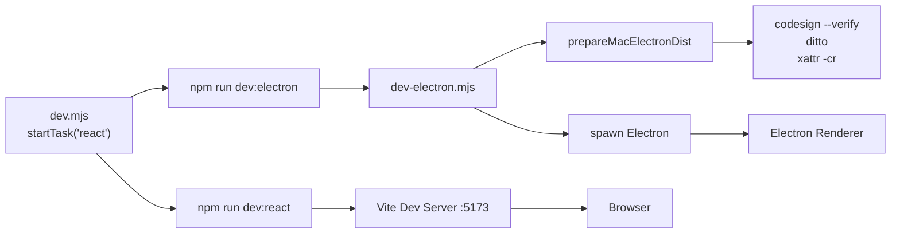
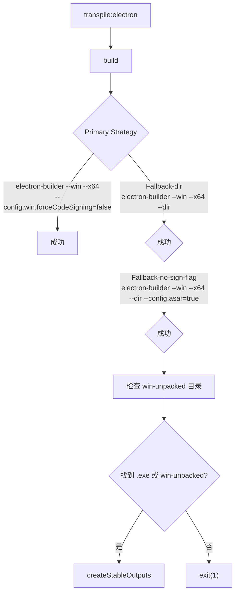

# 工程脚本总览

<cite>

**本文引用的文件**

- [scripts/after-pack-win-icon.cjs](file://scripts/after-pack-win-icon.cjs#L1-L40)
- [scripts/codex-oauth-setup.mjs](file://scripts/codex-oauth-setup.mjs#L1-L295)
- [scripts/dev-electron.mjs](file://scripts/dev-electron.mjs#L1-L150)
- [scripts/dev.mjs](file://scripts/dev.mjs#L1-L66)
- [scripts/package-win-safe.mjs](file://scripts/package-win-safe.mjs#L1-L186)
- [scripts/sync-claude-code-compat.mjs](file://scripts/sync-claude-code-compat.mjs#L1-L200)
- [scripts/qa/browser-workbench-smoke.mjs](file://scripts/qa/browser-workbench-smoke.mjs#L1-L183)
- [scripts/qa/chat-ui-smoke.cjs](file://scripts/qa/chat-ui-smoke.cjs#L1-L64)
- [scripts/github-release.mjs](file://scripts/github-release.mjs#L1-L444)
- [scripts/qa/knowledge-chat-injection-smoke.mjs](file://scripts/qa/knowledge-chat-injection-smoke.mjs#L1-L166)
- [scripts/qa/knowledge-engine-smoke.mjs](file://scripts/qa/knowledge-engine-smoke.mjs#L1-L205)
- [scripts/qa/knowledge-ui-smoke.cjs](file://scripts/qa/knowledge-ui-smoke.cjs#L1-L183)
- [scripts/qa/preview-workbench-smoke.mjs](file://scripts/qa/preview-workbench-smoke.mjs#L1-L70)
- [skills/tech-cc-hub-release-deploy/scripts/publish-release.mjs](file://skills/tech-cc-hub-release-deploy/scripts/publish-release.mjs#L1-L390)
- [pro-workflow/scripts/cwd-changed.js](file://pro-workflow/scripts/cwd-changed.js#L1-L40)
- [scripts/qa/electron-autostart-smoke.sh](file://scripts/qa/electron-autostart-smoke.sh#L1-L117)
- [scripts/qa/window-id-tools.sh](file://scripts/qa/window-id-tools.sh#L1-L51)
- [pro-workflow/scripts/drift-detector.js](file://pro-workflow/scripts/drift-detector.js#L1-L126)

</cite>

# 工程脚本总览

本页面记录 `tech-cc-hub` 仓库中所有工程脚本的职责边界、调用链路、数据结构、扩展点和常见改造路径。按生命周期分组，便于定位和修改。

---

## 目录

- [脚本分类地图](#脚本分类地图)
- [开发启动链路](#开发启动链路)
- [打包与构建](#打包与构建)
- [Claude Code 兼容性同步](#claude-code-兼容性同步)
- [Codex OAuth 配置](#codex-oauth-配置)
- [QA 烟雾测试套件](#qa-烟雾测试套件)
- [GitHub 发布流程](#github-发布流程)
- [ProWorkflow 辅助脚本](#proworkflow-辅助脚本)
- [Agent 改代码地图](#agent-改代码地图)
- [常见失败模式与排障](#常见失败模式与排障)

---

## 脚本分类地图

整个 `scripts/` 目录按职责分为三大类：

| 类别 | 入口脚本 | 依赖环境 |
|------|---------|----------|
| **开发启动** | `dev.mjs` + `dev-electron.mjs` | Node.js, npm |
| **打包构建** | `package-win-safe.mjs`, `after-pack-win-icon.cjs` | electron-builder |
| **发布流程** | `github-release.mjs`, `publish-release.mjs` | Git, GitHub API |
| **兼容性同步** | `sync-claude-code-compat.mjs` | 网络访问 |
| **QA 测试** | `qa/*.mjs`, `qa/*.cjs`, `qa/*.sh` | Playwright, sqlite3 |
| **ProWorkflow** | `cwd-changed.js`, `drift-detector.js` | Claude CLI 集成 |

> **图表来源**：[scripts/dev.mjs](file://scripts/dev.mjs#L22-L58) 定义 `startTask` 函数是所有开发入口的统一调用模式。

---

## 开发启动链路

### 入口：`scripts/dev.mjs`

这是并行启动 React + Electron 的总调度器，职责单一：**管理子进程生命周期**。



**关键符号**：
- `children` Map 存储活跃子进程 [L2-4](file://scripts/dev.mjs#L2-L4)
- `startTask(name, args)` spawns npm 子进程 [L22-L58](file://scripts/dev.mjs#L22-L58)
- `stopAll(exitCode)` 处理 SIGINT/SIGTERM [L6-L20](file://scripts/dev.mjs#L6-L20)
- 任何子进程非零退出都会触发全部终止 [L44-L51](file://scripts/dev.mjs#L44-L51)

**平台差异**：
- Windows：使用 `cmd.exe /d /s /c npm <args>` [L24-L29](file://scripts/dev.mjs#L24-L29)
- macOS/Linux：直接 spawn `npm <args>`

### Electron 预处理：`scripts/dev-electron.mjs`

在启动 Electron 前完成 macOS 代码签名和缓存。

**执行流程** [L72-L108](file://scripts/dev-electron.mjs#L72-L108)：

1. `electronVersionLabel()` 读取 `package.json` 中 `devDependencies.electron` 版本号 [L47-L53](file://scripts/dev-electron.mjs#L47-L53)
2. `prepareMacElectronDist()` 检查缓存路径 `~/Library/Caches/tech-cc-hub/electron-{version}-dist` [L89](file://scripts/dev-electron.mjs#L89)
3. 若缓存未签名：运行 `ditto --norsrc`、`xattr -cr`、`codesign --force --deep --sign -`
4. `verifyCodesign(appPath)` 使用 `codesign --verify --deep --strict` 验证 [L34-L41](file://scripts/dev-electron.mjs#L34-L41)
5. 设置 `ELECTRON_OVERRIDE_DIST_PATH` 环境变量后 spawn Electron CLI

**失败模式**：
- 未通过 codesign 验证会 throw Error [L103-L105](file://scripts/dev-electron.mjs#L103-L105)
- Electron.app 不存在会提示 `npm install` [L86](file://scripts/dev-electron.mjs#L86)

### 运行命令

```bash
# 并行启动 React + Electron
npm run dev

# 仅启动 Electron（已通过 prepareMacElectronDist）
npm run dev:electron
```

---

## 打包与构建

### Windows 安全打包：`scripts/package-win-safe.mjs`

处理 Windows x64 打包，采用分级降级策略确保产出物。

**策略链** [L154-L166](file://scripts/package-win-safe.mjs#L154-L166)：



**关键函数**：
- `run(cmd, args, options)` spawnSync 包装器 [L20-L32](file://scripts/package-win-safe.mjs#L20-L32)
- `cleanOldArtifacts()` 清理旧产物，保留 `win-unpacked` 和 `.icon-ico` 缓存 [L34-L63](file://scripts/package-win-safe.mjs#L34-L63)
- `findExeArtifact()` 查找 `tech-cc-hub*.exe` [L65-L70](file://scripts/package-win-safe.mjs#L65-L70)
- `createStableOutputs()` 生成带日期戳的稳定产物名 [L86-L119](file://scripts/package-win-safe.mjs#L86-L119)

**输出命名规则** [L92-L107](file://scripts/package-win-safe.mjs#L92-L107)：
- `tech-cc-hub-win-x64-{stamp}.exe`（单文件）
- `tech-cc-hub-win-unpacked-{stamp}.zip`（解压目录）
- `tech-cc-hub-win-x64-{stamp}.zip`（portable zip）

### Windows 图标注入：`scripts/after-pack-win-icon.cjs`

Electron-builder 的 `afterPack` 钩子，为 Windows 可执行文件注入 `build/icon.ico`。

**前提条件**：
- `build/icon.ico` 存在
- `node_modules/electron-winstaller/vendor/rcedit.exe` 存在
- `context.electronPlatformName === "win32"`

**exe 查找优先级** [L15-L19](file://scripts/after-pack-win-icon.cjs#L15-L19)：
1. `{productFilename}.exe`
2. `tech-cc-hub.exe`
3. `electron.exe`

**调用方式**：`rcedit.exe <exePath> --set-icon <iconPath>` [L27](file://scripts/after-pack-win-icon.cjs#L27)

---

## Claude Code 兼容性同步

### `scripts/sync-claude-code-compat.mjs`

从 `https://claudelog.com/claude-code-changelog/` 抓取 changelog，生成类型化的兼容注册表。

**输出文件**：`src/electron/libs/claude-code-compat-registry.ts`

**导出的类型与变量** [L163-L188](file://scripts/sync-claude-code-compat.mjs#L163-L188)：
```typescript
export type ClaudeCodeCompatRegistry = {
  sourceUrl: string;
  sourceVersion: string;
  sourceDate: string;
  generatedAt: string;
  commandItems: SlashCommandItem[];
  promptHints: string[];
};

export const CLAUDE_CODE_COMPAT_REGISTRY: ClaudeCodeCompatRegistry;
export const CLAUDE_CODE_COMPAT_COMMAND_ITEMS = ...;
export function buildClaudeCodeCompatPromptAppend(): string;
```

**抓取与解析流程**：
1. `fetchText(SOURCE_URL)` 带 UA `tech-cc-hub-claude-compat-sync/1.0` [L61-L70](file://scripts/sync-claude-code-compat.mjs#L61-L70)
2. `extractSections(html)` 将 HTML 转 Markdown，匹配 `### Claude Code v{version}` 段落 [L72-L104](file://scripts/sync-claude-code-compat.mjs#L72-L104)
3. `extractCommandItems(items)` 提取 `/command` 斜杠命令和特殊关键字（如 `claude agents`）[L107-L122](file://scripts/sync-claude-code-compat.mjs#L107-L122)
4. `buildPromptHints(items)` 为特定命令生成 tech-cc-hub 适配提示 [L132-L160](file://scripts/sync-claude-code-compat.mjs#L132-L160)

**运行命令**：
```bash
# 同步最新版本
node scripts/sync-claude-code-compat.mjs

# 同步指定版本
node scripts/sync-claude-code-compat.mjs --version=2.1.50
```

---

## Codex OAuth 配置

### `scripts/codex-oauth-setup.mjs`

将官方 `codex login` 的凭证迁移到 tech-cc-hub 的 `api-config.json` profiles 格式。

**凭证源**：`~/.codex/auth.json` [L67-L69](file://scripts/codex-oauth-setup.mjs#L67-L69)

**配置输出**：`api-config.json` 中的 profiles 数组 [L78-L81](file://scripts/codex-oauth-setup.mjs#L78-L81)

**JWT 解码** [L223-L235](file://scripts/codex-oauth-setup.mjs#L223-L235)：
- 支持 `payload.access_token` 和 `payload.id_token`
- 解析 `AUTH_CLAIM = "https://api.openai.com/auth"` 中的 `chatgpt_account_id`

**支持的模型列表** [L13-L28](file://scripts/codex-oauth-setup.mjs#L13-L28)：
- 基础模型：`gpt-5.5`, `gpt-5.4`, `gpt-5.4-mini`, `gpt-5.3-codex`, `gpt-5.3-codex-spark` 等
- Compact 变体：每个基础模型 + `-openai-compact` 后缀

**关键 Profile 字段** [L97-L115](file://scripts/codex-oauth-setup.mjs#L97-L115)：
```json
{
  "id": "uuid",
  "name": "Codex OAuth",
  "apiKey": "{id_token, access_token, refresh_token, account_id, ...}",
  "baseURL": "https://chatgpt.com",
  "model": "gpt-5.5",
  "expertModel": "gpt-5.5",
  "smallModel": "gpt-5.3-codex-spark",
  "analysisModel": "gpt-5.3-codex-spark",
  "models": [{name, contextWindow, compressionThresholdPercent}],
  "enabled": true,
  "provider": "codex"
}
```

**运行命令**：
```bash
# 交互式登录（启动 codex login 浏览器流程）
node scripts/codex-oauth-setup.mjs

# 指定 profile 名称
node scripts/codex-oauth-setup.mjs --profile-name="My Codex"

# 使用已有凭证（跳过登录）
node scripts/codex-oauth-setup.mjs --no-login

# 自定义配置文件路径
node scripts/codex-oauth-setup.mjs --configPath=/path/to/api-config.json
```

---

## QA 烟雾测试套件

测试分为三类：**BrowserWorkbench**、**ChatUI**、**Knowledge**，均使用 Playwright。

### 浏览器工作台测试：`scripts/qa/browser-workbench-smoke.mjs`

验证 `BrowserWorkbenchManager` 的核心能力。

**依赖**：`BrowserWorkbenchManager` from `dist-electron/electron/browser-manager.js` [L7](file://scripts/qa/browser-workbench-smoke.mjs#L7)

**测试清单** [L72-L167](file://scripts/qa/browser-workbench-smoke.mjs#L72-L167)：

| 测试项 | 验证内容 |
|--------|----------|
| `open_page` | `manager.open(url)` 加载 HTML |
| `get_state` | `manager.getState()` 返回 url/title/loading |
| `extract_page` | `manager.extractPageSnapshot()` 提取 DOM 结构 |
| `console_logs` | `manager.getConsoleLogs(20)` 获取控制台日志 |
| `capture_visible` | `manager.captureVisible()` 截图 |
| `inspect_at_point` | `manager.inspectAtPoint({x, y})` DOM 探测 |
| `annotation_mode` | `manager.setAnnotationMode(true/false)` 标注切换 |
| `back_forward` | `manager.goBack()` / `manager.goForward()` 导航历史 |

**运行命令**：
```bash
# 需要 Electron app 在测试环境中运行
CHROME_PATH=/Applications/Google\ Chrome.app/Contents/MacOS/Google\ Chrome \
node scripts/qa/browser-workbench-smoke.mjs
```

### Chat UI 测试：`scripts/qa/chat-ui-smoke.cjs`

验证聊天组件的提及和斜杠命令功能。

**关键检查点** [L23-L45](file://scripts/qa/chat-ui-smoke.cjs#L23-L45)：
1. `@src` 触发文件提及面板（验证 `@ 文件提及` 可见）
2. `<file_references>` 和 `<message_references>` 块**不应**泄露到 textarea
3. `/` 触发斜杠命令面板（验证 `可用 Slash 命令` 可见）

**致命日志过滤** [L47-L54](file://scripts/qa/chat-ui-smoke.cjs#L47-L54)：
```javascript
const fatalLogs = logs.filter((line) => (
  line.includes('[pageerror]')
  || line.includes('[console:error]')
  || line.includes('prompt.startsWith is not a function')  // 已知的崩溃模式
));
```

### Preview 工作台测试：`scripts/qa/preview-workbench-smoke.cjs`

验证 Monaco 编辑器与代码引用芯片的集成。

**关键路径** [L21-L51](file://scripts/qa/preview-workbench-smoke.cjs#L21-L51)：
1. 点击 `.native-explorer` 中的 `package.json`
2. Monaco 编辑器出现且无 `Loading...` 卡死
3. 鼠标拖选代码后点击 `粘贴到输入框`
4. 验证 `<code_references>` 块不泄露到 textarea

### Knowledge 引擎测试：`scripts/qa/knowledge-engine-smoke.mjs`

验证 Repo Wiki 生成的**质量标准**，而非功能正确性。

**数据源路径** [L38-L43](file://scripts/qa/knowledge-engine-smoke.mjs#L38-L43)：
- 索引报告：`{workspace}/.tech/reports/index-state.json`
- Wiki 内容：`{workspace}/.tech/repowiki/zh/content/**/*.md`
- Agent Cards：`{workspace}/.tech/repowiki/zh/agent-cards/`
- 元数据：`{workspace}/.tech/repowiki/zh/meta/repowiki-metadata.json`
- SQLite DB：`{appData}/knowledge/knowledge.sqlite`

**量化指标** [L66-L119](file://scripts/qa/knowledge-engine-smoke.mjs#L66-L119)：

| 指标 | 最低要求 | 来源符号 |
|------|----------|----------|
| `report.indexedDocuments` | ≥ 60 | `indexedDocuments` |
| `report.indexedChunks` | ≥ 300 | `indexedChunks` |
| Wiki 页面数 | 40-80 | `wikiFiles.length` |
| 目录项 | 40-80 | `wikiCatalogs.length` |
| 引用源码行数 | ≥ 50% | `sourceLineLinkedPages` |
| Mermaid 图 | ≥ 25% | `mermaidPages` |
| Agent 改代码地图 | ≥ 50% | `agentMapPages` |

**MCP 深度检查** [L122-L133](file://scripts/qa/knowledge-engine-smoke.mjs#L122-L133)：
验证 Repo Wiki 包含关键 MCP 符号：
- `BUILTIN_MCP_SERVERS`
- `BUILTIN_MCP_SERVER_FACTORIES`
- `getBuiltinMcpServers`
- `listBuiltinMcpToolNames`
- `ensureMcpServersForPrompt`

### Knowledge Chat 注入测试：`scripts/qa/knowledge-chat-injection-smoke.mjs`

验证知识库概览是否注入到 Runner prompt。

**IPC 桥接点** [L26-L37](file://scripts/qa/knowledge-chat-injection-smoke.mjs#L26-L37)：
- Bridge Origin：`http://127.0.0.1:4317`（可通过 `TECH_CC_HUB_DEV_BRIDGE_ORIGIN` 覆盖）
- 端点：`POST /rpc/{method}` 如 `/rpc/invoke`

**事件订阅** [L52-L76](file://scripts/qa/knowledge-chat-injection-smoke.mjs#L52-L76)：
- SSE 端点：`GET /events/server`
- 帧格式：`data:\n\n` 分隔的 JSON 事件

**关键验证**：
1. `invoke("knowledge:overview", {workspaceKey})` 返回包含 `<knowledge_overview>` 和 `<agent_cards>` 的字符串
2. Session 最终回复包含 `EXPECTED_REPLY = "KNOWLEDGE_INJECTION_OK"`

### Knowledge UI 测试：`scripts/qa/knowledge-ui-smoke.cjs`

验证浏览器端知识库面板渲染。

**检查项** [L79-L123](file://scripts/qa/knowledge-ui-smoke.cjs#L79-L123)：
- 生成完成标志：`"生成完成"` / `"已完成"`
- Mermaid 渲染：SVG 而非原始代码块
- 嵌套章节：`data-knowledge-section` 属性含 `/`
- 占位符文本：`后续接入真实`、`未生成正文` 等应不存在
- 交互式关闭：`关闭 {文档标题}` 按钮

---

## GitHub 发布流程

### 主发布脚本：`scripts/github-release.mjs`

完整的 GitHub Release 创建流程。

**参数解析** [L15-L35](file://scripts/github-release.mjs#L15-L35)：
```bash
npm run release:github -- [patch|minor|major|vX.Y.Z] \
  [--dry-run] [--no-push] [--allow-dirty] \
  [--no-release] \
  [--release-title-template "{tmpl}"] \
  [--release-note-template <path>]
```

**执行步骤**：
1. `parseVersion(requestedVersion)` 解析语义化版本 [L100-L112](file://scripts/github-release.mjs#L100-L112)
2. `bumpVersion(current, mode)` 计算新版本 [L143-L166](file://scripts/github-release.mjs#L143-L166)
3. `ensureCleanWorktree()` / `ensureTagDoesNotExist()` 前置检查
4. `run("git", ["tag", tag])` 创建本地标签
5. `run("git", ["push", "origin", tag])` 推送到远程
6. `getGithubToken()` 优先取 `GITHUB_TOKEN`/`GH_TOKEN`，降级到 `git credential fill`
7. `githubApiRequest("POST", ...)` 创建 GitHub Release

**GitHub API 端点**：
- `POST /repos/{owner}/{repo}/releases`
- `PATCH /repos/{owner}/{repo}/releases/{id}`

### 辅助发布脚本：`skills/tech-cc-hub-release-deploy/scripts/publish-release.mjs`

通过 GitHub API 提交文件系统变更，而非 git push。

**API 树创建** [L213-L250](file://skills/tech-cc-hub-release-deploy/scripts/publish-release.mjs#L213-L250)：
1. `git diff --name-status -z` 获取变更文件列表
2. `parseNameStatus(raw)` 解析 null 分隔的状态
3. `readTreeMode(ref, filePath)` 获取文件权限
4. 逐文件创建 blob，创建 tree，更新 commit

**参数**：
```bash
node scripts/publish-release.mjs \
  --tag=v1.0.0 \
  --notes=/path/to/release-notes.md \
  [--retag] [--delete-release] [--api-only] [--notes-only]
```

---

## ProWorkflow 辅助脚本

### 工作目录变更检测：`pro-workflow/scripts/cwd-changed.js`

Claude CLI 集成脚本，检测工作区切换并输出项目元数据。

**输入**：stdin JSON `{cwd: string}` [L10-L11](file://pro-workflow/scripts/cwd-changed.js#L10-L11)

**输出**：stdin JSON 回显 + stderr 诊断信息

**检测逻辑** [L13-L20](file://pro-workflow/scripts/cwd-changed.js#L13-L20)：
- `.git` 存在 → Git 仓库
- `package.json` 存在 → Node 项目
- `CLAUDE.md` 或 `.claude` 存在 → Claude 感知项目

**项目类型检测** [L23-L27](file://pro-workflow/scripts/cwd-changed.js#L23-L27)：
- `package.json` → `node`
- `Cargo.toml` → `rust`
- `go.mod` → `go`
- `pyproject.toml` → `python`

### 意图漂移检测：`pro-workflow/scripts/drift-detector.js`

防止 Agent 在长会话中偏离原始任务。

**状态文件**：`/tmp/pro-workflow/intent-{sessionId}` [L36](file://pro-workflow/scripts/drift-detector.js#L36)

**漂移判定** [L62-L67](file://pro-workflow/scripts/drift-detector.js#L62-L67)：
- `editsSinceLastTouch >= 6` **且** `intentKeywords` 与 `promptKeywords` 重叠率 < 20%
- 输出警告到 stderr：`[ProWorkflow] Drift check: {n} edits since original goal`

**新意图检测** [L112-L120](file://pro-workflow/scripts/drift-detector.js#L112-L120)：
模式包括：`now let's`、`switch to`、`forget`、`new task` 等

---

## Agent 改代码地图

### 先读文件（按修改目的）

| 修改目的 | 优先阅读文件 | 关键符号 |
|----------|-------------|----------|
| **改开发启动** | `scripts/dev.mjs` | `startTask`, `stopAll`, `children` |
| **改 Electron 签名** | `scripts/dev-electron.mjs` | `prepareMacElectronDist`, `verifyCodesign`, `cleanMacExtendedAttributes` |
| **改 Windows 打包** | `scripts/package-win-safe.mjs` | `runWithFallback`, `createStableOutputs`, `strategies` |
| **改 Windows 图标** | `scripts/after-pack-win-icon.cjs` | `exePath`, `rceditPath`, `candidates` |
| **改 Claude 兼容** | `scripts/sync-claude-code-compat.mjs` | `extractSections`, `extractCommandItems`, `CLAUDE_CODE_COMPAT_REGISTRY` |
| **改 Codex 配置** | `scripts/codex-oauth-setup.mjs` | `buildCodexProfile`, `codexAuthToCredential`, `saveCodexProfile` |
| **改 QA 流程** | `scripts/qa/browser-workbench-smoke.mjs` | `BrowserWorkbenchManager`, `waitForIdle`, `makeFixture` |
| **改 GitHub 发布** | `scripts/github-release.mjs` | `run`, `bumpVersion`, `githubApiRequest` |

### 修改入口与验证命令

#### 添加新 QA 测试项

1. **修改文件**：`scripts/qa/browser-workbench-smoke.mjs`
2. **插入位置**：在 `run()` 函数内的 `checks` 数组 [L70-L79](file://scripts/qa/browser-workbench-smoke.mjs#L70-L79)
3. **模式**：
   ```javascript
   await check("my_new_check", async () => {
     const result = await manager.someNewMethod();
     if (!result.success) throw new Error(result.error || "check failed");
     return { /* detail object */ };
   });
   ```
4. **验证**：`node scripts/qa/browser-workbench-smoke.mjs`（需 Electron 环境）

#### 添加打包策略

1. **修改文件**：`scripts/package-win-safe.mjs`
2. **插入位置**：`strategies` 数组 [L154-L158](file://scripts/package-win-safe.mjs#L154-L158)
3. **模式**：`["Label", ["npx", "electron-builder", ...args]]`
4. **验证**：`node scripts/package-win-safe.mjs && ls dist/tech-cc-hub*.exe`

#### 添加新的 Claude Code 命令

1. **修改文件**：`scripts/sync-claude-code-compat.mjs`
2. **插入位置**：`extractCommandItems()` 函数 [L107-L122](file://scripts/sync-claude-code-compat.mjs#L107-L122)
3. **模式**：添加新的 regex 或关键字匹配
4. **验证**：`node scripts/sync-claude-code-compat.mjs --version=2.1.x`

#### 添加新 Profile 字段

1. **修改文件**：`scripts/codex-oauth-setup.mjs`
2. **插入位置**：`buildCodexProfile()` 返回对象 [L97-L116](file://scripts/codex-oauth-setup.mjs#L97-L116)
3. **验证**：`node scripts/codex-oauth-setup.mjs && cat ~/.config/tech-cc-hub/api-config.json`

### 常见回归风险

| 风险 | 影响范围 | 缓解措施 |
|------|----------|----------|
| `prepareMacElectronDist` 返回 null 但未设置 `ELECTRON_OVERRIDE_DIST_PATH` | macOS Electron 无法启动 | `dev-electron.mjs` 顶部直接使用 `ELECTRON_OVERRIDE_DIST_PATH` 环境变量 |
| `package-win-safe.mjs` 的 `strategies` 顺序错误 | 降级策略不触发 | 策略必须按优先级从高到低排列 |
| `knowledge-engine-smoke.mjs` 的量化指标阈值过严 | CI 在正常情况失败 | 阈值需与知识引擎实际产出能力对齐 |
| `sync-claude-code-compat.mjs` 网络请求超时 | Registry 未更新 | 已有 fetch 超时处理（默认浏览器超时）|

---

## 常见失败模式与排障

### 开发启动失败

**症状**：`npm run dev` 后 React 启动但 Electron 报错

**排查步骤**：
```bash
# 1. 检查 Electron 缓存
ls ~/Library/Caches/tech-cc-hub/

# 2. 手动验证 codesign
codesign --verify --deep --strict ~/Library/Caches/tech-cc-hub/electron-*/Electron.app

# 3. 查看 dev-electron 输出
npm run dev:electron 2>&1 | head -50
```

**来源**：[scripts/dev-electron.mjs](file://scripts/dev-electron.mjs#L82-L107)

### Windows 打包失败

**症状**：`package-win-safe.mjs` 所有策略均失败

**排查步骤**：
```bash
# 1. 检查 electron-builder 配置
cat electron-builder.json

# 2. 临时禁用代码签名
CSC_IDENTITY_AUTO_DISCOVERY=false npx electron-builder --win --x64 --dir

# 3. 检查 win-unpacked 是否存在
ls dist/win-unpacked/
```

**来源**：[scripts/package-win-safe.mjs](file://scripts/package-win-safe.mjs#L121-L137)

### Knowledge 测试失败

**症状**：`knowledge-engine-smoke.mjs` 报告索引文档数不足

**排查步骤**：
```bash
# 1. 检查索引报告
cat .tech/reports/index-state.json

# 2. 检查 SQLite 索引
sqlite3 ~/Library/Application\ Support/tech-cc-hub/knowledge/*/knowledge.sqlite \
  "SELECT COUNT(*) FROM documents;"

# 3. 手动触发知识引擎重索引（如果有 CLI）
tech-cc-hub knowledge index --workspace .
```

**来源**：[scripts/qa/knowledge-engine-smoke.mjs](file://scripts/qa/knowledge-engine-smoke.mjs#L66-L68)

### GitHub Release Token 缺失

**症状**：`github-release.mjs` 报 `401 Unauthorized`

**排查**：
```bash
# 1. 检查环境变量
echo $GITHUB_TOKEN

# 2. 测试 git credential
git credential fill
# protocol=https
# host=github.com

# 3. 使用 --dry-run 验证
npm run release:github -- patch --dry-run
```

**来源**：[scripts/github-release.mjs](file://scripts/github-release.mjs#L235-L252)

---

## 扩展点

### 添加新的 Smoke 测试

1. 在 `scripts/qa/` 创建 `feature-smoke.cjs` 或 `feature-smoke.mjs`
2. 使用 Playwright API（参见 `chat-ui-smoke.cjs` 模式）
3. 在 `package.json` 添加 `qa:smoke` 脚本调用
4. 验证：`npm run qa:smoke`

### 添加新的打包策略

1. 在 `package-win-safe.mjs` 的 `strategies` 数组追加 `[label, command]`
2. 使用 `CSC_IDENTITY_AUTO_DISCOVERY=false` 禁用 macOS 代码签名
3. 验证：执行 `node scripts/package-win-safe.mjs` 后检查 `dist/`

### 添加新的 Profile Provider

1. 在 `codex-oauth-setup.mjs` 的 `buildCodexProfile()` 添加字段映射
2. 在 `codexAuthToCredential()` 添加新的凭证格式解析
3. 验证：`node scripts/codex-oauth-setup.mjs --no-login`

---

*最后更新：基于 `tech-cc-hub` v1.0.0 分支，引用行号均为源文件实际行号。*