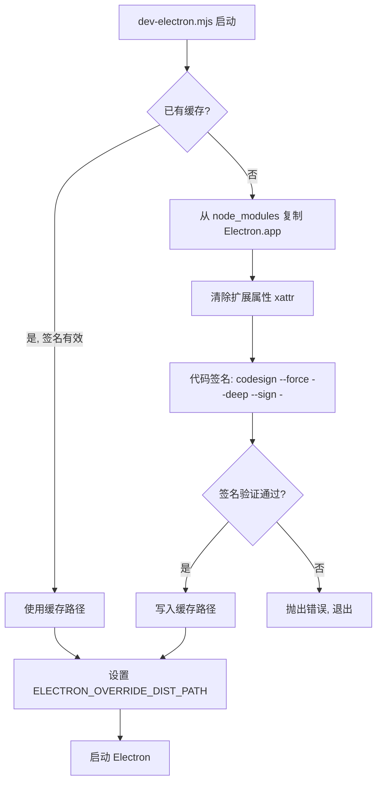
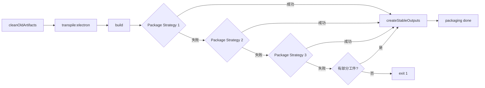
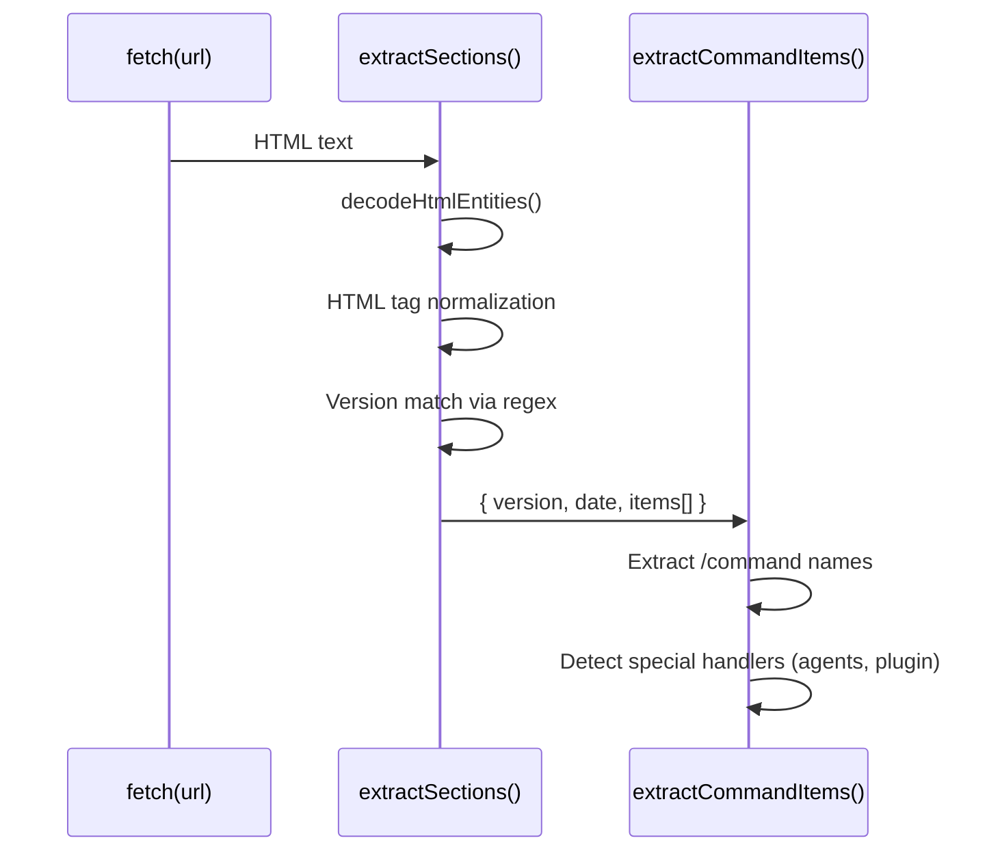
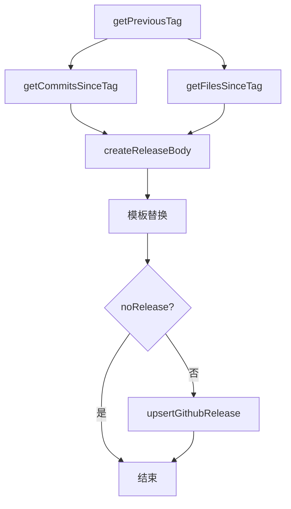

# 工程脚本总览

<cite>
**本文引用的文件**
- [scripts/after-pack-win-icon.cjs](file://scripts/after-pack-win-icon.cjs)
- [scripts/codex-oauth-setup.mjs](file://scripts/codex-oauth-setup.mjs)
- [scripts/dev-electron.mjs](file://scripts/dev-electron.mjs)
- [scripts/dev.mjs](file://scripts/dev.mjs)
- [scripts/package-win-safe.mjs](file://scripts/package-win-safe.mjs)
- [scripts/sync-claude-code-compat.mjs](file://scripts/sync-claude-code-compat.mjs)
- [scripts/qa/browser-workbench-smoke.mjs](file://scripts/qa/browser-workbench-smoke.mjs)
- [scripts/qa/chat-ui-smoke.cjs](file://scripts/qa/chat-ui-smoke.cjs)
- [scripts/github-release.mjs](file://scripts/github-release.mjs)
</cite>

## 目录

- [概述与设计哲学](#概述与设计哲学)
- [开发阶段脚本](#开发阶段脚本)
  - [dev.mjs：并行启动器](#devmjs并行启动器)
  - [dev-electron.mjs：Electron 运行时封装](#dev-electronmjselectron-运行时封装)
- [打包阶段脚本](#打包阶段脚本)
  - [package-win-safe.mjs：多策略 Windows 打包](#package-win-safemjs多策略-windows-打包)
  - [after-pack-win-icon.cjs：Windows 图标后处理](#after-pack-win-iconcjswindows-图标后处理)
- [配置与同步脚本](#配置与同步脚本)
  - [codex-oauth-setup.mjs：Codex 凭证迁移](#codex-oauth-setupmjscodex-凭证迁移)
  - [sync-claude-code-compat.mjs：兼容性命令同步](#sync-claude-code-compatmjs兼容性命令同步)
- [QA 冒烟测试](#qa-冒烟测试)
  - [browser-workbench-smoke.mjs：浏览器工作台验证](#browser-workbench-smokemjs浏览器工作台验证)
  - [chat-ui-smoke.cjs：聊天 UI 验证](#chat-ui-smokecjs聊天-ui-验证)
- [发布脚本](#发布脚本)
  - [github-release.mjs：GitHub Release 自动化](#github-releasemjsgithub-release-自动化)
- [调用链与协作关系](#调用链与协作关系)
- [扩展点与改造路径](#扩展点与改造路径)
- [排障速查表](#排障速查表)

---

## 概述与设计哲学

`scripts/` 目录下的脚本分为 **5 大职责域**：

| 职责域 | 脚本 | 触发时机 |
|--------|------|----------|
| 开发启动 | `dev.mjs`, `dev-electron.mjs` | `npm run dev` |
| 打包构建 | `package-win-safe.mjs`, `after-pack-win-icon.cjs` | `npm run pack:win` |
| 配置初始化 | `codex-oauth-setup.mjs` | 首次配置 / 凭证刷新 |
| 数据同步 | `sync-claude-code-compat.mjs` | CI 或手动触发 |
| 质量验证 | `qa/*.mjs`, `qa/*.cjs` | CI / 手动 QA |

脚本设计遵循以下原则：

- **幂等性**：除 `cleanOldArtifacts` 会清理 `dist/` 外，其他脚本可安全重复执行
- **平台感知**：通过 `process.platform` 判断 win32/darwin/Linux，采用不同工具链
- **错误回退**：`package-win-safe.mjs` 实现了三级打包策略递进
- **零配置优先**：所有脚本优先读取环境变量或检测默认路径，减少命令行参数负担

---

## 开发阶段脚本

### dev.mjs：并行启动器

**职责**：`dev.mjs` 是开发模式的统一入口，同时启动 React 前端和 Electron 主进程。

**核心数据结构**：

```javascript
// children: Map<name, ChildProcess>
// shuttingDown: boolean（防止重复 SIGINT 处理）
```

**调用链**：

```
npm run dev
  → dev.mjs
    → startTask("react", ["run", "dev:react"])  // Vite 开发服务器
    → startTask("electron", ["run", "dev:electron"])  // Electron 封装脚本
```

**关键行为**（[scripts/dev.mjs#L22-L58](file://scripts/dev.mjs#L22-L58)）：

- 任意子进程以 `code === 0` 退出时，其他进程也会被终止（正常完成场景）
- 任意子进程异常退出（`code !== 0`）时，整个 dev session 以非零码退出
- `SIGINT` / `SIGTERM` 信号统一触发 `stopAll(0)`

**Windows 特殊处理**（[scripts/dev.mjs#L24-L29](file://scripts/dev.mjs#L24-L29)）：

```javascript
// Windows 使用 cmd.exe /c 包装 npm 命令
spawn(process.env.ComSpec ?? "cmd.exe", ["/d", "/s", "/c", command], {
    windowsHide: true,
});
```

**排障**：

| 症状 | 检查点 |
|------|--------|
| React 启动失败 | `npm run dev:react` 是否能独立运行 |
| Electron 闪退 | 检查 `ELECTRON_OVERRIDE_DIST_PATH` 环境变量 |
| macOS 无法启动 | 运行 `codesign --verify` 验证签名 |

---

### dev-electron.mjs：Electron 运行时封装

**职责**：封装 Electron 启动流程，核心解决 **macOS 代码签名缓存**问题。

**macOS 签名流程图**：



**缓存路径规则**（[scripts/dev-electron.mjs#L89](file://scripts/dev-electron.mjs#L89)）：

```
~/Library/Caches/tech-cc-hub/electron-{version}-dist/Electron.app
```

**签名验证函数**（[scripts/dev-electron.mjs#L34-L41](file://scripts/dev-electron.mjs#L34-L41)）：

```javascript
function verifyCodesign(appPath) {
    const result = spawnSync("codesign", ["--verify", "--deep", "--strict", "--verbose=2", appPath], {
        cwd: repoRoot,
        encoding: "utf8",
        stdio: "pipe",
    });
    return result.status === 0;
}
```

**扩展属性清理**（[scripts/dev-electron.mjs#L55-L69](file://scripts/dev-electron.mjs#L55-L69)）：

清理 `com.apple.FinderInfo`、`com.apple.provenance`、`com.apple.quarantine` 等，防止 Gatekeeper 阻止运行。

**排障**：

| 症状 | 解决方案 |
|------|----------|
| `Electron.app not found` | 运行 `npm install` 确保 `node_modules/electron/dist/` 存在 |
| 签名验证失败 | 删除缓存目录后重试：`rm -rf ~/Library/Caches/tech-cc-hub/electron-*-dist` |
| macOS 无法打开 | 检查系统偏好设置中的"安全与隐私" |

---

## 打包阶段脚本

### package-win-safe.mjs：多策略 Windows 打包

**职责**：生成 Windows 安装包，提供三级打包回退策略，确保在各种环境下都能产出工件。

**三级回退策略**（[scripts/package-win-safe.mjs#L154-L158](file://scripts/package-win-safe.mjs#L154-L158)）：

| 策略 | 命令 | 特点 |
|------|------|------|
| Primary | `electron-builder --win --x64` | 标准打包，禁用签名 |
| Fallback-dir | `electron-builder --win --x64 --dir` | 生成 unpacked 目录 |
| Fallback-no-sign-flag | `electron-builder --win --x64 --dir --config.asar=true` | 激进禁用签名 |

**稳定输出命名**（[scripts/package-win-safe.mjs#L86-L108](file://scripts/package-win-safe.mjs#L86-L108)）：

```
dist/tech-cc-hub-win-x64-{YYYYMMDD}.exe      # 原始 exe 副本
dist/tech-cc-hub-win-unpacked-{YYYYMMDD}.zip # unpacked 压缩包
dist/tech-hub-win-x64-{YYYYMMDD}.zip          # 便携版 zip
```

**环境变量处理**（[scripts/package-win-safe.mjs#L10-L14](file://scripts/package-win-safe.mjs#L10-L14)）：

```javascript
const noSignEnv = {
  CSC_IDENTITY_AUTO_DISCOVERY: "false",  // 禁用 macOS 证书自动发现
  SIGNTOOL_PATH: "",                      // 禁用 Windows signtool
  WCT_CSC_KEY_PASSWORD: "",               // 禁用密钥密码
};
```

**执行流程**：



**章节来源**：[scripts/package-win-safe.mjs#L139-L183](file://scripts/package-win-safe.mjs#L139-L183)

---

### after-pack-win-icon.cjs：Windows 图标后处理

**职责**：Electron 打包完成后，通过 `rcedit.exe` 为 Windows 可执行文件注入自定义图标。

**触发方式**：通过 `electron-builder` 的 `afterPack` 钩子配置调用。

**入口函数签名**（[scripts/after-pack-win-icon.cjs#L5-L8](file://scripts/after-pack-win-icon.cjs#L5-L8)）：

```javascript
module.exports = async function applyWindowsIconAfterPack(context) {
  if (context.electronPlatformName !== "win32") {
    return;  // 非 Windows 平台直接跳过
  }
  // ...
};
```

**依赖路径解析**（[scripts/after-pack-win-icon.cjs#L10-L14](file://scripts/after-pack-win-icon.cjs#L10-L14)）：

```javascript
const projectDir = context.packager.projectDir;
const iconPath = path.join(projectDir, "build", "icon.ico");
const rceditPath = path.join(projectDir, "node_modules", "electron-winstaller", "vendor", "rcedit.exe");
```

**exe 查找候选**（[scripts/after-pack-win-icon.cjs#L15-L20](file://scripts/after-pack-win-icon.cjs#L15-L20)）：

```javascript
const candidates = [
  path.join(appOutDir, `${productFilename}.exe`),
  path.join(appOutDir, "tech-cc-hub.exe"),
  path.join(appOutDir, "electron.exe"),
];
const exePath = candidates.find((candidate) => existsSync(candidate));
```

**前置条件检查**（[scripts/after-pack-win-icon.cjs#L22-L25](file://scripts/after-pack-win-icon.cjs#L22-L25)）：

缺少 `exe`、`icon.ico` 或 `rcedit.exe` 时会以 `console.warn` 跳过，而非抛出异常，避免阻塞 CI。

**排障**：

```bash
# 检查图标文件是否存在
ls -la build/icon.ico

# 检查 rcedit 工具
ls -la node_modules/electron-winstaller/vendor/rcedit.exe

# 手动注入图标（调试用）
./node_modules/electron-winstaller/vendor/rcedit.exe \
  ./dist/win-unpacked/tech-cc-hub.exe \
  --set-icon ./build/icon.ico
```

---

## 配置与同步脚本

### codex-oauth-setup.mjs：Codex 凭证迁移

**职责**：将官方 `codex login` 生成的凭证（存储在 `~/.codex/auth.json`）迁移到 tech-cc-hub 的 `api-config.json` 配置文件中。

**配置文件路径**（[scripts/codex-oauth-setup.mjs#L56-L65](file://scripts/codex-oauth-setup.mjs#L56-L65)）：

```javascript
// Windows: %APPDATA%/tech-cc-hub/api-config.json
// macOS: ~/Library/Application Support/tech-cc-hub/api-config.json
// Linux: ~/.config/tech-cc-hub/api-config.json
// 可通过 TECH_CC_HUB_API_CONFIG 环境变量覆盖
```

**凭证解析逻辑**（[scripts/codex-oauth-setup.mjs#L154-L203](file://scripts/codex-oauth-setup.mjs#L154-L203)）：

`codexAuthToCredential` 函数按优先级尝试三种凭证来源：

1. `tokens.access_token` + `tokens.account_id`
2. `auth.access_token` + `auth.account_id`
3. 根级别的 `access_token` + `account_id`

**Profile 生成结构**（[scripts/codex-oauth-setup.mjs#L97-L116](file://scripts/codex-oauth-setup.mjs#L97-L116)）：

```javascript
{
  id: "<uuid>",
  name: "Codex OAuth",
  apiKey: JSON.stringify(credential),  // 包含 access_token, refresh_token, id_token
  baseURL: "https://chatgpt.com",
  model: "gpt-5.5",
  expertModel: "gpt-5.5",
  smallModel: "gpt-5.3-codex-spark",
  analysisModel: "gpt-5.3-codex-spark",
  models: [/* 28 个模型配置 */],
  enabled: true,
  provider: "codex",
  apiType: "anthropic",
}
```

**JWT 过期时间解析**（[scripts/codex-oauth-setup.mjs#L205-L221](file://scripts/codex-oauth-setup.mjs#L205-L221)）：

支持三种时间格式：秒级时间戳、毫秒级时间戳、ISO 8601 字符串。函数 `normalizeExpiry` 统一转换为 ISO 字符串存储。

**命令行用法**：

```bash
# 基本用法（需要先运行 codex login）
node scripts/codex-oauth-setup.mjs

# 指定配置路径
node scripts/codex-oauth-setup.mjs --configPath=/path/to/config.json

# 指定 Codex auth 文件路径
node scripts/codex-oauth-setup.mjs --codexAuthPath=~/.codex/auth.json

# 指定 profile 名称
node scripts/codex-oauth-setup.mjs --profileName="My Codex"

# 跳过自动登录（如果已有凭证）
node scripts/codex-oauth-setup.mjs --noLogin
```

**排障**：

| 症状 | 解决方案 |
|------|----------|
| `Unable to import Codex ChatGPT credentials` | 先运行 `npx codex login` 完成 OAuth 流程 |
| Profile 未启用 | 检查 `enabled: true` 和 `provider: "codex"` |
| 凭证过期 | 重新运行 `codex login` 后再执行本脚本 |

---

### sync-claude-code-compat.mjs：兼容性命令同步

**职责**：从 [claudelog.com](https://claudelog.com/claude-code-changelog/) 抓取 Claude Code 更新日志，提取命令列表和提示词增强，生成 TypeScript 兼容注册表。

**输出文件**：`src/electron/libs/claude-code-compat-registry.ts`

**抓取与解析流程**（[scripts/sync-claude-code-compat.mjs#L61-L104](file://scripts/sync-claude-code-compat.mjs#L61-L104)）：



**命令行用法**：

```bash
# 同步最新版本
node scripts/sync-claude-code-compat.mjs

# 指定版本
node scripts/sync-claude-code-compat.mjs --version=2.1.50
# 或
node scripts/sync-claude-code-compat.mjs -v=2.1.50
```

**生成的数据结构**（[scripts/sync-claude-code-compat.mjs#L24-L31](file://scripts/sync-claude-code-compat.mjs#L24-L31)）：

```typescript
export type ClaudeCodeCompatRegistry = {
  sourceUrl: string;
  sourceVersion: string;
  sourceDate: string;
  generatedAt: string;
  commandItems: SlashCommandItem[];
  promptHints: string[];
};
```

**promptHints 示例**（[scripts/sync-claude-code-compat.mjs#L142-L159](file://scripts/sync-claude-code-compat.mjs#L142-L159)）：

当检测到 `/goal`、`/scroll-speed`、`claude agents` 等命令时，会生成对应的提示词增强，帮助 tech-cc-hub 正确映射行为。

**章节来源**：[scripts/sync-claude-code-compat.mjs#L33-L34](file://scripts/sync-claude-code-compat.mjs#L33-L34)

---

## QA 冒烟测试

### browser-workbench-smoke.mjs：浏览器工作台验证

**职责**：验证 `BrowserWorkbenchManager` 的核心功能，包括页面加载、DOM 提取、截图、控制台捕获等。

**测试用例列表**（[scripts/qa/browser-workbench-smoke.mjs#L71-L167](file://scripts/qa/browser-workbench-smoke.mjs#L71-L167)）：

| 测试名称 | 验证内容 |
|----------|----------|
| `open_page` | 页面加载与 URL 更新 |
| `get_state` | 状态对象包含 title |
| `extract_page` | DOM 快照：标题、链接、图片、文本 |
| `console_logs` | 控制台日志捕获 |
| `capture_visible` | 可见区域截图 |
| `inspect_at_point` | 元素检测与选择器生成 |
| `annotation_mode` | 标注模式切换 |
| `reload` | 页面刷新 |
| `back_forward` | 浏览器历史导航 |
| `close_page` | 页面关闭 |

**测试夹具**（[scripts/qa/browser-workbench-smoke.mjs#L24-L53](file://scripts/qa/browser-workbench-smoke.mjs#L24-L53)）：

在 `tmpdir()` 下创建 `first.html` 和 `second.html`，通过 `pathToFileURL()` 加载本地文件。

**Idle 检测机制**（[scripts/qa/browser-workbench-smoke.mjs#L11-L22](file://scripts/qa/browser-workbench-smoke.mjs#L11-L22)）：

```javascript
const waitForIdle = async (manager, timeoutMs = 8000) => {
  const deadline = Date.now() + timeoutMs;
  while (Date.now() < deadline) {
    const state = manager.getState();
    if (state.url && !state.loading) {
      await sleep(150);  // 稳定 150ms 后返回
      return manager.getState();
    }
    await sleep(100);
  }
  return manager.getState();
};
```

**运行方式**：

```bash
# 开发时直接运行
node scripts/qa/browser-workbench-smoke.mjs

# 输出示例（成功）
{
  "ok": true,
  "checks": [
    { "name": "open_page", "ok": true, "detail": { "url": "...", "title": "..." } },
    ...
  ]
}
```

**章节来源**：[scripts/qa/browser-workbench-smoke.mjs#L55-L56](file://scripts/qa/browser-workbench-smoke.mjs#L55-L56)

---

### chat-ui-smoke.cjs：聊天 UI 验证

**职责**：通过 Playwright 验证聊天 UI 的关键交互，包括 `@` 文件提及、Slash 命令、错误日志检测。

**依赖**：需要 `@playwright/test` 包和 Chrome/Chromium 浏览器。

**环境变量**（[scripts/qa/chat-ui-smoke.cjs#L3-L4](file://scripts/qa/chat-ui-smoke.cjs#L3-L4)）：

```javascript
const DEFAULT_URL = process.env.CHAT_UI_QA_URL || 'http://localhost:4173/';
const CHROME_PATH = '/Applications/Google Chrome.app/Contents/MacOS/Google Chrome';
```

**测试流程**：

1. 启动 Chrome headless 模式
2. 访问 `http://localhost:4173/`
3. 找到最后一个 `<textarea>` 元素并点击
4. 输入 `@src` 触发文件提及面板
5. 验证面板出现后按 Enter
6. 检查页面是否渲染文件引用卡片
7. 验证结构化引用未泄露到 textarea 值中
8. 输入 `/` 触发 Slash 命令面板
9. 检查控制台无致命错误

**致命错误定义**（[scripts/qa/chat-ui-smoke.cjs#L47-L51](file://scripts/qa/chat-ui-smoke.cjs#L47-L51)）：

```javascript
const fatalLogs = logs.filter((line) => (
  line.includes('[pageerror]')
  || line.includes('[console:error]')
  || line.includes('prompt.startsWith is not a function')  // 已知 NPE
));
```

**运行方式**：

```bash
# 需要先启动生产预览服务
npm run build && npm run preview &
CHAT_UI_QA_URL=http://localhost:4173/ node scripts/qa/chat-ui-smoke.cjs

# 成功输出
CHAT_UI_QA_OK
```

**章节来源**：[scripts/qa/chat-ui-smoke.cjs#L56-L57](file://scripts/qa/chat-ui-smoke.cjs#L56-L57)

---

## 发布脚本

### github-release.mjs：GitHub Release 自动化

**职责**：自动化版本号递增、Git 提交/标签、GitHub Release 创建。

**命令行参数**（[scripts/github-release.mjs#L37-L43](file://scripts/github-release.mjs#L37-L43)）：

```bash
# 基本用法：递增 patch 版本
npm run release:github

# 指定版本类型
npm run release:github -- minor
npm run release:github -- major
npm run release:github -- v1.2.3

# 选项
--dry-run          # 模拟执行，不写入文件或调用 API
--no-push          # 仅本地创建 commit/tag，不推送到 origin
--allow-dirty      # 允许工作区有未提交更改
--no-release       # 跳过 GitHub Release API 调用
--release-title-template="## {tag} 更新"  # 自定义标题模板
--release-note-template=/path/to/template.md  # 自定义 changelog 模板
```

**版本递增逻辑**（[scripts/github-release.mjs#L143-L166](file://scripts/github-release.mjs#L143-L166)）：

```javascript
function bumpVersion(current, mode) {
  if (mode === "major") return `${version.major + 1}.0.0`;
  if (mode === "minor") return `${version.major}.${version.minor + 1}.0`;
  if (mode === "patch") return `${version.major}.${version.minor}.${version.patch + 1}`;
  // 支持直接指定 semver
}
```

**预检清单**（[scripts/github-release.mjs#L387-L404](file://scripts/github-release.mjs#L387-L404)）：

1. `ensureGitRepository()` - 确保在 git 工作区
2. `ensureOriginRemote()` - 验证 origin 指向正确仓库
3. `ensureCleanWorktree()` - 检查无未提交更改（除非 `--allow-dirty`）
4. `ensureTagDoesNotExist()` - 确保本地和远程均无同名标签

**Release Body 生成**（[scripts/github-release.mjs#L319-L346](file://scripts/github-release.mjs#L319-L346)）：



**默认模板**（[scripts/github-release.mjs#L46-L57](file://scripts/github-release.mjs#L46-L57)）：

```markdown
{{title}}

### 变更提交
{{commits}}

### 变更文件
{{files}}

### 说明
- 发布时间（自动生成）：{{generated_at}}
- 来源：{{source}}
```

**GitHub Token 获取优先级**（[scripts/github-release.mjs#L235-L252](file://scripts/github-release.mjs#L235-L252)）：

1. 环境变量 `GITHUB_TOKEN`
2. 环境变量 `GH_TOKEN`
3. 环境变量 `GITHUB_API_TOKEN`
4. `git credential fill` 交互式获取

**章节来源**：[scripts/github-release.mjs#L387-L439](file://scripts/github-release.mjs#L387-L439)

---

## 调用链与协作关系

```mermaid
flowchart TD
    subgraph 开发阶段
        A[npm run dev] --> B[dev.mjs]
        B --> C[dev:react]
        B --> D[dev-electron.mjs]
        D --> E[Electron 启动]
    end
    
    subgraph 打包阶段
        F[npm run pack:win] --> G[package-win-safe.mjs]
        G --> H[electron-builder]
        H --> I[after-pack-win-icon.cjs]
        I --> J[最终 exe]
    end
    
    subgraph 配置阶段
        K[首次启动] --> L[codex-oauth-setup.mjs]
        L --> M[api-config.json]
    end
    
    subgraph QA 阶段
        N[CI/手动] --> O[browser-workbench-smoke.mjs]
        N --> P[chat-ui-smoke.cjs]
    end
    
    subgraph 发布阶段
        Q[npm run release:github] --> R[github-release.mjs]
        R --> S[Git commit + tag]
        R --> T[GitHub Release API]
    end
```



---

## 扩展点与改造路径

| 脚本 | 常见改造需求 | 扩展方式 |
|------|--------------|----------|
| `dev.mjs` | 支持更多并行服务（如 mock server） | 在 `startTask` 调用链中添加新任务 |
| `dev-electron.mjs` | 切换签名密钥 | 修改 `codesign --sign` 参数或使用 `ELECTRON_SIGN_IDENTITY` |
| `package-win-safe.mjs` | 添加 NSIS 安装程序支持 | 在 `strategies` 数组中添加新 electron-builder 命令 |
| `after-pack-win-icon.cjs` | 支持 .icns（macOS 图标） | 克隆本脚本实现 macOS 版本，改用 `codesign` |
| `codex-oauth-setup.mjs` | 支持自定义 API 端点 | 扩展 `BASE_URL` 参数和 `--base-url` 选项 |
| `sync-claude-code-compat.mjs` | 定期自动同步 | 在 CI 中添加 cron job 或 webhook 触发 |
| `github-release.mjs` | 支持 GitLab/Gitea | 替换 `githubApiRequest` 为平台适配器 |

---

## 排障速查表

| 脚本 | 常见错误 | 排查命令 |
|------|----------|----------|
| `dev.mjs` | 子进程无法启动 | `npm run dev:react` 和 `npm run dev:electron` 单独运行 |
| `dev-electron.mjs` | macOS 签名失败 | `codesign --verify --deep --strict ./node_modules/electron/dist/Electron.app` |
| `package-win-safe.mjs` | electron-builder 超时 | 检查网络连接，尝试 `--config.electronDist`
| `after-pack-win-icon.cjs` | 图标未应用 | 手动运行 `rcedit.exe` 验证工具链 |
| `codex-oauth-setup.mjs` | 凭证解析失败 | 检查 `~/.codex/auth.json` 文件格式和权限 |
| `sync-claude-code-compat.mjs` | 网络请求失败 | `curl -v https://claudelog.com/claude-code-changelog/` |
| `browser-workbench-smoke.mjs` | 测试超时 | 调整 `waitForIdle` 的 `timeoutMs` 参数 |
| `chat-ui-smoke.cjs` | Playwright 无法启动 | 验证 Chrome 路径或设置 `executablePath` |
| `github-release.mjs` | Token 无效 | 验证 `GITHUB_TOKEN` 权限（repo 范围） |

---

**文档版本**：1.0.0  
**最后更新**：基于当前 `scripts/` 目录内容生成  
**维护者**：tech-cc-hub 团队