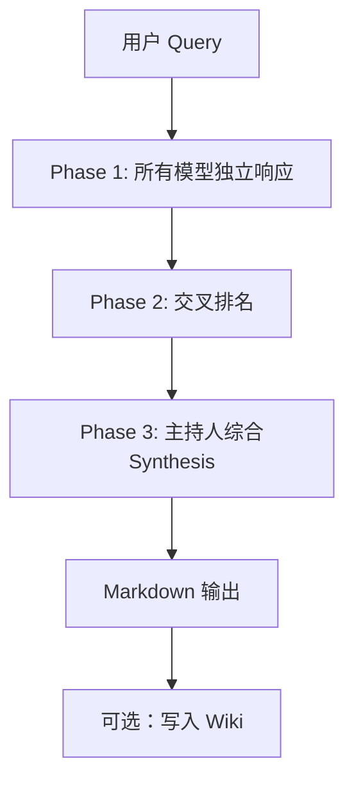
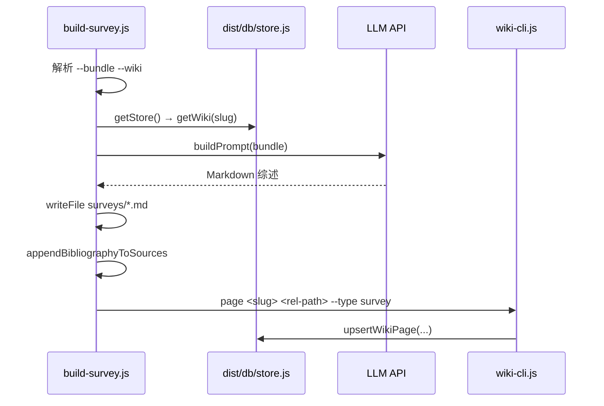
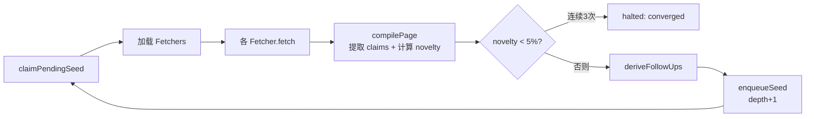
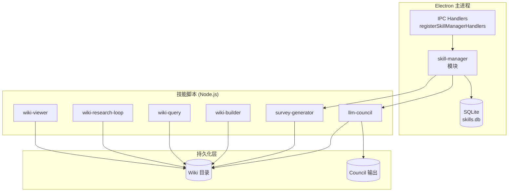

# 技能与插件系统总览

<cite>

**本文引用的文件**

- [src/electron/libs/skill-manager/index.ts](file://src/electron/libs/skill-manager/index.ts)
- [pro-workflow/skills/llm-council/scripts/council.js](file://pro-workflow/skills/llm-council/scripts/council.js)
- [pro-workflow/skills/survey-generator/scripts/build-survey.js](file://pro-workflow/skills/survey-generator/scripts/build-survey.js)
- [pro-workflow/skills/wiki-builder/scripts/init_wiki.sh](file://pro-workflow/skills/wiki-builder/scripts/init_wiki.sh)
- [pro-workflow/skills/wiki-builder/scripts/wiki-cli.js](file://pro-workflow/skills/wiki-builder/scripts/wiki-cli.js)
- [pro-workflow/skills/wiki-query/scripts/query.js](file://pro-workflow/skills/wiki-query/scripts/query.js)
- [pro-workflow/skills/wiki-research-loop/scripts/research-loop.js](file://pro-workflow/skills/wiki-research-loop/scripts/research-loop.js)
- [pro-workflow/skills/wiki-viewer/scripts/render.js](file://pro-workflow/skills/wiki-viewer/scripts/render.js)
- [src/electron/main.ts](file://src/electron/main.ts)
</cite>

---

## 目录

- [系统定位与职责边界](#系统定位与职责边界)
- [技能管理器（skill-manager）模块剖析](#技能管理器skill-manager模块剖析)
- [技能目录结构与存储布局](#技能目录结构与存储布局)
- [已安装技能详解](#已安装技能详解)
- [调用链路与数据流](#调用链路与数据流)
- [数据结构与数据库Schema](#数据结构与数据库schema)
- [Electron主进程集成点](#electron主进程集成点)
- [常见改造路径](#常见改造路径)
- [故障排查与验证命令](#故障排查与验证命令)

---

## 系统定位与职责边界

技能与插件系统是 tech-cc-hub 的**可扩展能力层**，它将 LLM 调用、文档生成、Wiki 管理等原子能力封装为独立技能（Skill），并通过统一的工具适配器（Tool Adapter）接入 Electron 主进程，使渲染进程可按需调用。

**核心职责：**

1. **技能注册与生命周期** — 安装、卸载、更新、启用/禁用技能 [file://src/electron/libs/skill-manager/index.ts#L1-L34](file://src/electron/libs/skill-manager/index.ts#L1-L34)
2. **场景编排（Scenario）** — 将多个技能组合为可切换的工作场景 [file://src/electron/libs/skill-manager/index.ts#L72-L83](file://src/electron/libs/skill-manager/index.ts#L72-L83)
3. **工具适配层** — 将技能脚本映射为 MCP 工具，使 Electron IPC 可调用 [file://src/electron/libs/skill-manager/index.ts#L38-L51](file://src/electron/libs/skill-manager/index.ts#L38-L51)
4. **Wiki 与知识管理** — 内置 wiki-builder、wiki-query、wiki-research-loop 等知识类技能

**不负责：** 聊天会话管理（由 ipc-handlers.ts 处理）、Agent 编排（由 AgentOS 规范约束）。

---

## 技能管理器（skill-manager）模块剖析

### 模块入口与导出结构

`src/electron/libs/skill-manager/index.ts` 是统一出口，按功能分为 6 个子模块：

| 子模块 | 职责 | 关键导出 |
|--------|------|----------|
| `db.js` | SQLite 数据库操作，技能/场景/标签的 CRUD | `getAllSkills`, `insertSkill`, `getAllScenarios` 等 |
| `tool-adapters.js` | 工具适配器注册、路径解析、已安装检测 | `defaultToolAdapters`, `findAdapter`, `isInstalled` |
| `sync-engine.js` | 技能同步、目标目录管理、状态检查 | `syncSkill`, `inferSkillName`, `isTargetCurrent` |
| `installer.js` | 从本地目录安装技能到目标位置 | `installFromLocal`, `installSkillDirToDestination` |
| `scanner.js` | 扫描本地技能目录，发现技能 ID | `scanLocalSkills`, `groupDiscovered`, `matchImportedSkillId` |
| `scenarios.js` | 场景管理（创建、切换、增删技能） | `createScenario`, `addSkillToScenarioAndSync`, `reorderScenarioList` |
| `central-repo.js` | 中央技能仓库路径管理 | `ensureCentralRepo`, `centralSkillsDir` |
| `marketplace.js` | 技能市场搜索与排行榜 | `fetchLeaderboard`, `searchSkillssh` |

[章节来源：file://src/electron/libs/skill-manager/index.ts#L1-L87](file://src/electron/libs/skill-manager/index.ts#L1-L87)

### 工具适配器机制

`tool-adapters.js` 定义了两类适配器路径：

```typescript
// 默认适配器（内置技能）
defaultToolAdapters / allToolAdapters

// 自定义工具（用户扩展）
customToolPaths / customTools
```

适配器发现逻辑为：**先检查 `skillsDir`（默认工具目录），再检查 `additionalExistingScanDirs`（额外扫描目录），最后检查 `customToolPaths`** [file://src/electron/libs/skill-manager/index.ts#L46-L50](file://src/electron/libs/skill-manager/index.ts#L46-L50)。

### IPC 集成

在 Electron 主进程 `main.ts` 中通过 `registerSkillManagerHandlers` 注册 IPC 处理器 [file://src/electron/main.ts#L64](file://src/electron/main.ts#L64)，渲染进程通过 `handleSkillManagerInvoke` 调用技能管理功能 [file://src/electron/main.ts#L64](file://src/electron/main.ts#L64)。

---

## 技能目录结构与存储布局

### 技能目录布局

```
pro-workflow/
└── skills/
    ├── llm-council/          # LLM 委员会（多模型审议）
    ├── survey-generator/     # 文献综述生成器
    ├── wiki-builder/         # Wiki 初始化与 CLI
    ├── wiki-query/          # Wiki 搜索与查询
    ├── wiki-research-loop/   # 研究循环（爬取+生成）
    └── wiki-viewer/          # Wiki HTML 渲染器
```

每个技能的典型结构：

```
<skill-name>/
├── scripts/                 # 可执行入口（CLI 脚本）
│   ├── <main>.js            # 主入口（如 council.js）
│   └── source-fetchers/     # 可选：数据抓取器（如 web/arxiv）
├── templates/               # 可选：模板文件（如 wiki-builder）
├── README.md
└── SPEC.md
```

### 存储位置

| 数据 | 路径 |
|------|------|
| 全局 Wiki | `~/.pro-workflow/wikis/` |
| 委员会输出 | `~/.pro-workflow/council/` |
| 项目 Wiki | `<project>/.claude/wikis/` |
| 技能数据库 | `~/.pro-workflow/` (SQLite) |

[章节来源：file://pro-workflow/skills/wiki-builder/scripts/init_wiki.sh#L49-L56](file://pro-workflow/skills/wiki-builder/scripts/init_wiki.sh#L49-L56)

---

## 已安装技能详解

### 1. llm-council — LLM 委员会审议

**职责：** 将同一查询分发给多个 LLM 模型，经两轮评议后由主持人综合输出。

**调用链（三阶段）：**



**核心参数：**

| 参数 | 含义 | 默认值 |
|------|------|--------|
| `--models` | 参与模型列表（逗号分隔） | 来自 provider.defaultModels |
| `--chairman` | 主持人模型 | 来自 provider.defaultChairman |
| `--provider` | API 提供者 | 自动检测环境变量 |
| `--wiki` | 写入的 Wiki slug | 不写入 |

**支持的 Provider：** `anthropic`、`openai`、`openrouter`、`fireworks`、`custom` [file://pro-workflow/skills/llm-council/scripts/council.js#L10-L50](file://pro-workflow/skills/llm-council/scripts/council.js#L10-L50)。

**输出结构：** `final_output.md` 包含 Phase1 响应、Phase2 排名、Phase3 综合结论 [file://pro-workflow/skills/llm-council/scripts/council.js#L210-L243](file://pro-workflow/skills/llm-council/scripts/council.js#L210-L243)。

**常见失败模式：**
- 环境变量未设置：`No provider env var set`
- 模型列表为空：`no models — pass --models`
- 自定义 provider 缺少 `LLM_COUNCIL_BASE_URL`：`requires LLM_COUNCIL_BASE_URL`

### 2. survey-generator — 文献综述生成

**职责：** 接收一个 bundle（含主题、参考文献、章节结构），调用 LLM 生成结构化文献综述。

**关键输入（bundle）：**

```json
{
  "topic": "...",
  "bibliography": [{ "key": "src-bib-xxx", "title": "...", "url": "..." }],
  "sections": [{ "title": "...", "papers": ["key1", "key2"] }]
}
```

**约束规则：**
- 每个 section 必须引用其 `papers` 列表中的每篇文献至少一次 [file://pro-workflow/skills/survey-generator/scripts/build-survey.js#L157-L161](file://pro-workflow/skills/survey-generator/scripts/build-survey.js#L157-L161)
- 引用格式为 `[^citation_id]`
- 禁止凭空捏造，只允许引用提供 bibliography 中的论文

**状态流：**



**验证命令：**

```bash
node skills/survey-generator/scripts/build-survey.js \
  --bundle /path/to/bundle.json \
  --wiki my-wiki \
  --provider anthropic \
  --model claude-opus-4-7
```

### 3. wiki-builder — Wiki 初始化与 CLI

**职责：** 创建 Wiki 目录骨架，提供 `wiki-cli.js` 作为 Wiki 的 CRUD 入口。

**init_wiki.sh 参数：**

| 参数 | 含义 | 有效值 |
|------|------|--------|
| `<slug>` | Wiki 唯一标识 | 小写字母+数字+连字符 |
| `--title` | 显示名称 | 任意字符串 |
| `--flavor` | Wiki 类型 | `research`/`paper`/`domain`/`product`/`person`/`organization`/`project`/`codebase`/`incident` |
| `--scope` | 作用域 | `global`（`~/.pro-workflow/wikis/`）/ `project`（`.claude/wikis/`） |

[file://pro-workflow/skills/wiki-builder/scripts/init_wiki.sh#L10-L47](file://pro-workflow/skills/wiki-builder/scripts/init_wiki.sh#L10-L47)

**目录骨架：** 无论何种 flavor，均创建 `raw/`、`wiki/`、`derived/`、`prompts/`、`logs/` 五个子目录，flavor 决定 `wiki/` 下的子目录结构 [file://pro-workflow/skills/wiki-builder/scripts/init_wiki.sh#L64-L74](file://pro-workflow/skills/wiki-builder/scripts/init_wiki.sh#L64-L74)。

**wiki-cli.js 子命令：**

| 命令 | 作用 |
|------|------|
| `init <slug>` | 创建并注册 Wiki |
| `list [--scope g|p]` | 列出 Wiki |
| `info <slug>` | 显示 Wiki 信息与页面数 |
| `page <slug> <rel-path>` | 注册或更新页面 |
| `reindex <slug>` | 扫描 `wiki/` 目录批量注册所有 .md |

[file://pro-workflow/skills/wiki-builder/scripts/wiki-cli.js#L207-L214](file://pro-workflow/skills/wiki-builder/scripts/wiki-cli.js#L207-L214)

### 4. wiki-query — Wiki 搜索与查询

**职责：** 在已注册的 Wiki 页面中进行全文检索、相关页面推荐、页面内容展示。

**子命令：**

| 命令 | 作用 |
|------|------|
| `search "<query>"` | 全文搜索 |
| `related <slug> <rel-path>` | 查找与指定页面相似的内容 |
| `show <slug> <rel-path>` | 输出页面原始内容 |

搜索通过 `store.searchWiki(query, { wikiSlug, limit })` 实现，结果按 rank 排序 [file://pro-workflow/skills/wiki-query/scripts/query.js#L32-L52](file://pro-workflow/skills/wiki-query/scripts/query.js#L32-L52)。

### 5. wiki-research-loop — 研究循环

**职责：** 从种子查询出发，自动爬取相关资料、提取 claims、生成新页面，并派生更多种子。

**核心循环逻辑：**



**停止条件：**
- `STOP` 文件存在：`halted: kill-switch`
- 预算耗尽：`halted: budget`
- 深度超限：`seed.depth > maxDepth`
- 连续 3 次 novelty < 5%：`halted: converged`

[file://pro-workflow/skills/wiki-research-loop/scripts/research-loop.js#L196-L267](file://pro-workflow/skills/wiki-research-loop/scripts/research-loop.js#L196-L267)

**Fetcher 加载路径：**
1. `skills/wiki-research-loop/scripts/source-fetchers/`（内置）
2. `~/.pro-workflow/fetchers/`（用户扩展）

每个 fetcher 必须导出 `match(query)` 和 `fetch(query, { limit })` 方法 [file://pro-workflow/skills/wiki-research-loop/scripts/research-loop.js#L36-L56](file://pro-workflow/skills/wiki-research-loop/scripts/research-loop.js#L36-L56)。

### 6. wiki-viewer — Wiki HTML 渲染

**职责：** 将 Wiki 内容渲染为单文件 HTML，含侧边导航、链接图谱、引用表、种子状态面板。

**渲染特性：**
- 内置 Markdown → HTML 解析器（支持代码高亮、表格、引用、列表）[file://pro-workflow/skills/wiki-viewer/scripts/render.js#L41-L129](file://pro-workflow/skills/wiki-viewer/scripts/render.js#L41-L129)
- 从 `[^citation_id]` 提取引用并生成来源表 [file://pro-workflow/skills/wiki-viewer/scripts/render.js#L186-L199](file://pro-workflow/skills/wiki-viewer/scripts/render.js#L186-L199)
- 从 Markdown 链接提取页面关系，生成环形 SVG 图谱 [file://pro-workflow/skills/wiki-viewer/scripts/render.js#L131-L156](file://pro-workflow/skills/wiki-viewer/scripts/render.js#L131-L156)
- 支持 light/dark 主题切换 [file://pro-workflow/skills/wiki-viewer/scripts/render.js#L225-L227](file://pro-workflow/skills/wiki-viewer/scripts/render.js#L225-L227)

---

## 调用链路与数据流

### 整体架构



### 从渲染进程触发的典型路径

1. **用户触发**：渲染进程通过 `window.postMessage` 或 IPC `invoke` 调用 `skill-manager:xxx`
2. **IPC 路由**：`main.ts` 中的 `handleSkillManagerInvoke` 接收并分发
3. **技能执行**：skill-manager 调用对应的工具适配器或脚本
4. **结果回传**：脚本输出 JSON/JSON Lines，通过 IPC 返回渲染进程

### 技能间协作示例

`survey-generator` → `wiki-builder` → `wiki-viewer` 链条：

1. `build-survey.js` 生成 `.md` 文件 [file://pro-workflow/skills/survey-generator/scripts/build-survey.js#L206-L216](file://pro-workflow/skills/survey-generator/scripts/build-survey.js#L206-L216)
2. 调用 `wiki-cli.js page` 注册页面 [file://pro-workflow/skills/survey-generator/scripts/build-survey.js#L218-L225](file://pro-workflow/skills/survey-generator/scripts/build-survey.js#L218-L225)
3. `wiki-viewer/render.js` 读取并渲染为 HTML

---

## 数据结构与数据库Schema

### 核心表

| 表名 | 用途 |
|------|------|
| `skills` | 技能元数据（id、名称、路径、版本、启用状态） |
| `scenarios` | 场景配置（id、名称、是否激活） |
| `scenario_skills` | 场景-技能关联表 |
| `targets` | 技能目标目录（用于同步） |
| `tags` | 技能标签 |
| `settings` | 全局设置（K/V） |
| `wiki_seeds` | 研究循环的种子队列 |
| `wiki_pages` | Wiki 页面索引 |

### 关键数据结构（TypeScript）

技能对象包含：

```typescript
{
  id: string,           // 唯一标识，如 "llm-council"
  name: string,          // 显示名称
  central_path: string,  // 中央仓库路径
  enabled: boolean,
  source: "central" | "custom",
  // ... 其他元数据
}
```

场景对象：

```typescript
{
  id: number,
  name: string,
  is_active: boolean,
  skill_ids: string[],
}
```

[章节来源：file://src/electron/libs/skill-manager/index.ts#L1-L33](file://src/electron/libs/skill-manager/index.ts#L1-L33)

### Store 访问模式

所有技能脚本均通过 `dist/db/store.js` 访问数据库：

```javascript
const distPath = path.join(PRO_WORKFLOW_ROOT, 'dist', 'db', 'store.js');
const { createStore } = require(distPath);
const store = createStore();
// ... 使用 store.getWiki(), store.upsertWikiPage() 等
store.close();
```

**注意：** 必须显式调用 `store.close()`，否则可能导致连接泄漏 [file://pro-workflow/skills/survey-generator/scripts/build-survey.js#L198-L200](file://pro-workflow/skills/survey-generator/scripts/build-survey.js#L198-L200)。

---

## Electron主进程集成点

### IPC 处理器注册

```typescript
// src/electron/main.ts#L64
import { handleSkillManagerInvoke, registerSkillManagerHandlers } from "./libs/skill-manager/ipc-handlers.js";

// 注册所有 skill-manager IPC 通道
registerSkillManagerHandlers(ipcMain);
```

### 插件状态管理

`main.ts` 实现了 Open Computer Use 插件的状态检测与安装逻辑，包括：
- 版本检测：`getOpenComputerUseVersion()` [file://src/electron/main.ts#L132-L140](file://src/electron/main.ts#L132-L140)
- 权限准备：`prepareOpenComputerUsePermissions()` [file://src/electron/main.ts#L187-L250](file://src/electron/main.ts#L187-L250)
- 安装与更新：`installOpenComputerUsePlugin()`、`updateOpenComputerUsePlugin()` [file://src/electron/main.ts#L252-L338](file://src/electron/main.ts#L252-L338)

### 工具宿主设置

```typescript
// 浏览器工具
setBrowserToolHost(...)

// 设计工具
setDesignToolHost(...)

// Cron 工具
setCronService(cronService)
```

---

## 常见改造路径

### 1. 新增一个技能

1. 在 `pro-workflow/skills/<skill-name>/scripts/` 下创建入口脚本
2. 脚本开头固定模板：

```javascript
#!/usr/bin/env node
const fs = require('fs');
const path = require('path');

const PRO_WORKFLOW_ROOT = path.resolve(__dirname, '..', '..', '..');

function getStore() {
  const distPath = path.join(PRO_WORKFLOW_ROOT, 'dist', 'db', 'store.js');
  if (!fs.existsSync(distPath)) {
    console.error(`[skill] built store missing at ${distPath}. Run: cd ${PRO_WORKFLOW_ROOT} && npm install && npm run build`);
    process.exit(1);
  }
  return require(distPath).createStore();
}
```

3. 在 `src/electron/libs/skill-manager/tool-adapters.js` 注册为工具适配器
4. 在 `src/electron/main.ts` 添加对应 IPC 通道

### 2. 新增 Provider 支持

在 `council.js` 的 `PROVIDERS` 对象中添加新条目：

```javascript
const PROVIDERS = {
  // ... 现有条目
  myprovider: {
    envKey: 'MYPROVIDER_API_KEY',
    baseUrl: 'https://api.myprovider.com/v1',
    defaultModels: ['model-a', 'model-b'],
    defaultChairman: 'model-a',
    call: callOpenAICompat, // 或自定义 call 函数
  },
};
```

[file://pro-workflow/skills/llm-council/scripts/council.js#L10-L50](file://pro-workflow/skills/llm-council/scripts/council.js#L10-L50)

### 3. 扩展 Wiki Research Loop 的 Fetcher

在 `skills/wiki-research-loop/scripts/source-fetchers/` 下创建 `<name>.js`：

```javascript
module.exports = {
  match(query) {
    // 返回 true 表示该 fetcher 愿意处理此查询
    return query.includes('arxiv') || query.includes('paper');
  },
  async fetch(query, { limit = 3 }) {
    // 返回 [{ title, url, content }]
    return [...];
  },
  estimateCost(query) {
    return { usd: 0.02 }; // 预算估算
  },
};
```

[file://pro-workflow/skills/wiki-research-loop/scripts/research-loop.js#L36-L56](file://pro-workflow/skills/wiki-research-loop/scripts/research-loop.js#L36-L56)

---

## 故障排查与验证命令

### 1. 技能管理器健康检查

```bash
# 检查 skill-manager 模块是否正常加载
node -e "const sm = require('./dist/electron/libs/skill-manager/index.js'); console.log(Object.keys(sm).slice(0,5))"

# 检查工具适配器
node -e "const { allToolAdapters } = require('./dist/electron/libs/skill-manager/tool-adapters.js'); console.log(allToolAdapters)"
```

### 2. Wiki 系统验证

```bash
# 初始化一个测试 Wiki
bash skills/wiki-builder/scripts/init_wiki.sh test-wiki --title "Test Wiki" --flavor research --scope global

# 列出所有 Wiki
node skills/wiki-builder/scripts/wiki-cli.js list

# 查看 Wiki 信息
node skills/wiki-builder/scripts/wiki-cli.js info test-wiki

# 重新索引 Wiki
node skills/wiki-builder/scripts/wiki-cli.js reindex test-wiki
```

### 3. 技能脚本直接执行

```bash
# LLM Council 测试
ANTHROPIC_API_KEY=sk-xxx node skills/llm-council/scripts/council.js run "什么是量子计算？" --provider anthropic --models claude-opus-4-7,claude-sonnet-4-6 --chairman claude-opus-4-7

# Wiki Query 测试
node skills/wiki-query/scripts/query.js search "量子计算" --wiki test-wiki --limit 5

# Research Loop 测试
node skills/wiki-research-loop/scripts/research-loop.js seed test-wiki "量子计算入门" --depth 0
node skills/wiki-research-loop/scripts/research-loop.js run test-wiki --max-pages 3 --max-depth 1

# Survey Generator 测试
node skills/survey-generator/scripts/build-survey.js \
  --bundle /path/to/bundle.json \
  --wiki test-wiki \
  --provider anthropic
```

### 4. 常见错误与解决

| 错误信息 | 原因 | 解决方案 |
|----------|------|----------|
| `built store missing at dist/db/store.js` | 未执行 `npm run build` | `cd <root> && npm install && npm run build` |
| `unknown wiki: xxx` | Wiki 未注册 | 先执行 `wiki-cli.js init xxx` |
| `no provider env var set` | API Key 环境变量未设置 | 设置 `ANTHROPIC_API_KEY` 或 `OPENAI_API_KEY` |
| `no usable fetchers among: ...` | Fetcher 加载失败 | 检查 `source-fetchers/` 目录，查看日志 |
| `rel-path escapes wiki root` | 路径遍历攻击防护 | 使用正确的相对路径，不要包含 `..` |
| `bundle missing topic or bibliography[]` | bundle 格式错误 | 检查 JSON 文件，确保包含 `topic` 和 `bibliography[]` |

### 5. 数据库直接查询

```bash
# 查看所有技能
sqlite3 ~/.pro-workflow/skills.db "SELECT id, name, enabled FROM skills;"

# 查看所有场景及关联技能
sqlite3 ~/.pro-workflow/skills.db "SELECT s.name, GROUP_CONCAT(sk.id) FROM scenarios s JOIN scenario_skills cs ON s.id=cs.scenario_id JOIN skills sk ON cs.skill_id=sk.id GROUP BY s.id;"

# 查看 Wiki 种子状态
sqlite3 ~/.pro-workflow/skills.db "SELECT wiki_slug, status, COUNT(*) FROM wiki_seeds GROUP BY wiki_slug, status;"
```

---

## 扩展点总结

| 扩展点 | 方法 | 示例 |
|--------|------|------|
| 新增技能 | 创建 `skills/<name>/scripts/*.js`，注册工具适配器 | 新增 `code-search` 技能 |
| 新增 LLM Provider | 扩展 `PROVIDERS` 对象 | 添加 `deepseek` 支持 |
| 新增 Fetcher | 在 `source-fetchers/` 下创建 `.js` | 添加 `huggingface` fetcher |
| 新增 Wiki Flavor | 修改 `init_wiki.sh` 的 case 分支 | 新增 `dataset` flavor |
| 新增 IPC 通道 | 在 `ipc-handlers.js` 注册新 handler | 添加 `skill-manager:report` |

[图表来源：file://pro-workflow/skills/wiki-builder/scripts/init_wiki.sh#L66-L74](file://pro-workflow/skills/wiki-builder/scripts/init_wiki.sh#L66-L74)

---

**章节来源：**

- [file://src/electron/libs/skill-manager/index.ts#L1-L87](file://src/electron/libs/skill-manager/index.ts#L1-L87)
- [file://pro-workflow/skills/llm-council/scripts/council.js#L1-L287](file://pro-workflow/skills/llm-council/scripts/council.js#L1-L287)
- [file://pro-workflow/skills/survey-generator/scripts/build-survey.js#L1-L240](file://pro-workflow/skills/survey-generator/scripts/build-survey.js#L1-L240)
- [file://pro-workflow/skills/wiki-builder/scripts/init_wiki.sh#L1-L101](file://pro-workflow/skills/wiki-builder/scripts/init_wiki.sh#L1-L101)
- [file://pro-workflow/skills/wiki-builder/scripts/wiki-cli.js#L1-L231](file://pro-workflow/skills/wiki-builder/scripts/wiki-cli.js#L1-L231)
- [file://pro-workflow/skills/wiki-query/scripts/query.js#L1-L111](file://pro-workflow/skills/wiki-query/scripts/query.js#L1-L111)
- [file://pro-workflow/skills/wiki-research-loop/scripts/research-loop.js#L1-L368](file://pro-workflow/skills/wiki-research-loop/scripts/research-loop.js#L1-L368)
- [file://pro-workflow/skills/wiki-viewer/scripts/render.js#L1-L579](file://pro-workflow/skills/wiki-viewer/scripts/render.js#L1-L579)
- [file://src/electron/main.ts#L64](file://src/electron/main.ts#L64)