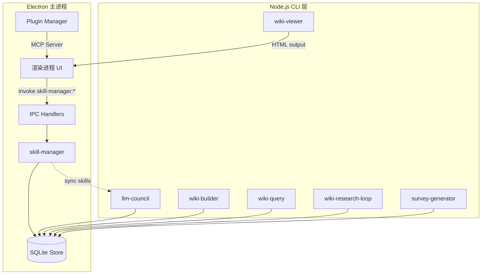
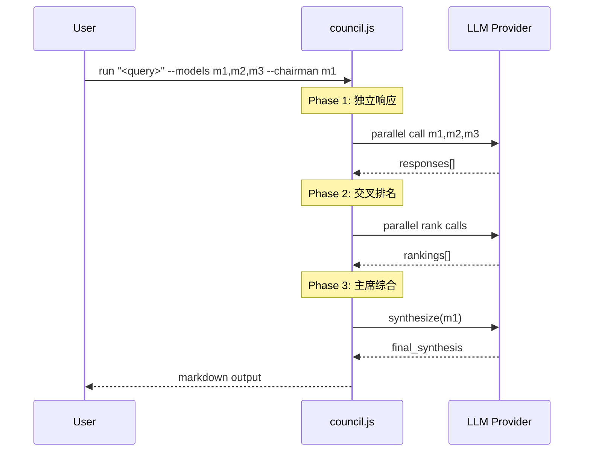
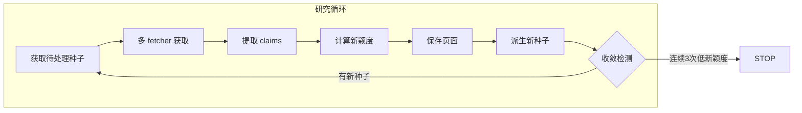

# 技能与插件系统总览

<cite>

**本文引用的文件**

- [src/electron/libs/skill-manager/index.ts](file://src/electron/libs/skill-manager/index.ts)
- [pro-workflow/skills/llm-council/scripts/council.js](file://pro-workflow/skills/llm-council/scripts/council.js)
- [pro-workflow/skills/survey-generator/scripts/build-survey.js](file://pro-workflow/skills/survey-generator/scripts/build-survey.js)
- [pro-workflow/skills/wiki-builder/scripts/init_wiki.sh](file://pro-workflow/skills/wiki-builder/scripts/init_wiki.sh)
- [pro-workflow/skills/wiki-builder/scripts/wiki-cli.js](file://pro-workflow/skills/wiki-builder/scripts/wiki-cli.js)
- [pro-workflow/skills/wiki-query/scripts/query.js](file://pro-workflow/skills/wiki-query/scripts/query.js)
- [pro-workflow/skills/wiki-research-loop/scripts/research-loop.js](file://pro-workflow/skills/wiki-research-loop/scripts/research-loop.js)
- [pro-workflow/skills/wiki-viewer/scripts/render.js](file://pro-workflow/skills/wiki-viewer/scripts/render.js)
- [src/electron/main.ts](file://src/electron/main.ts)
</cite>

---

## 目录

1. [系统定位与职责边界](#1-系统定位与职责边界)
2. [架构分层与调用链](#2-架构分层与调用链)
3. [Electron 端 skill-manager](#3-electron-端-skill-manager)
4. [pro-workflow/skills 技能脚本](#4-pro-workflowskills-技能脚本)
5. [共享数据存储层](#5-共享数据存储层)
6. [插件系统（Electron 进程）](#6-插件系统electron-进程)
7. [配置与扩展点](#7-配置与扩展点)
8. [常见失败模式与排障](#8-常见失败模式与排障)
9. [验证命令清单](#9-验证命令清单)

---

## 1. 系统定位与职责边界

技能与插件系统是 tech-cc-hub 项目的能力扩展中枢，负责以下职责：

| 组件 | 职责 | 运行位置 |
|------|------|----------|
| `skill-manager` | 管理技能的注册、场景关联、工具适配、生命周期 | Electron 主进程 |
| `pro-workflow/skills/*` | 提供预置的自动化脚本（wiki、research、survey 等） | Node.js CLI |
| 插件系统 | 管理 MCP 插件（Figma、Open Computer Use 等）的安装与连接 | Electron 主进程 |

**设计原则**：

- skill-manager 通过 `src/electron/libs/skill-manager/ipc-handlers.ts` 注册 IPC 通道，渲染进程通过 `invoke('skill-manager:*')` 调用
- 所有技能脚本独立运行，不依赖 Electron，通过共享的 SQLite store 交换数据
- 插件（Plugin）与技能（Skill）是两个正交概念：插件扩展 MCP 能力，技能扩展工作流自动化

（章节来源：[src/electron/libs/skill-manager/index.ts#L1-L4](file://src/electron/libs/skill-manager/index.ts#L1-L4)）

---

## 2. 架构分层与调用链

下图展示技能与插件系统的调用链路：



**调用链说明**：

1. **渲染进程 → skill-manager**：通过 IPC `invoke('skill-manager:*')` 调用，handler 在 `ipc-handlers.ts` 中注册
2. **skill-manager → SQLite**：所有持久化操作走 `db.js` 导出的函数
3. **CLI 脚本 → SQLite**：各技能脚本独立加载 `dist/db/store.js`，绕过 Electron 直接读写
4. **插件 → MCP**：插件通过 `@modelcontextprotocol/sdk` 接入，暴露为工具供渲染进程使用

（图表来源：[src/electron/main.ts#L23-L25](file://src/electron/main.ts#L23-L25)）

---

## 3. Electron 端 skill-manager

### 3.1 模块结构

`skill-manager` 是一个统一导出模块，内部划分为以下子模块：

| 子模块 | 导出函数示例 | 职责 |
|--------|-------------|------|
| `db.js` | `getAllSkills`, `insertSkill`, `getScenarioSkillToolToggles` | SQLite CRUD 操作 |
| `central-repo.js` | `ensureCentralRepo`, `skillsDir` | 中心仓库路径管理 |
| `tool-adapters.js` | `defaultToolAdapters`, `findAdapter`, `isInstalled` | 工具适配器发现与检测 |
| `sync-engine.js` | `syncSkill`, `parseSkillMd`, `is_valid_skill_dir` | 技能目录同步与验证 |
| `installer.js` | `installFromLocal`, `installSkillDirToDestination` | 技能安装 |
| `scanner.js` | `scanLocalSkills`, `groupDiscovered` | 本地技能扫描 |
| `scenarios.js` | `createScenario`, `addSkillToScenarioAndSync` | 场景（Scenario）管理 |
| `marketplace.js` | `fetchLeaderboard`, `searchSkillssh` | 市场 API |

### 3.2 IPC 注册入口

在 `src/electron/main.ts` 中，skill-manager 通过以下方式接入 Electron：

```typescript
import { handleSkillManagerInvoke, registerSkillManagerHandlers } from "./libs/skill-manager/ipc-handlers.js";

// 注册所有 handler
registerSkillManagerHandlers();

// IPC 路由
ipcMain.handle('skill-manager:*', handleSkillManagerInvoke);
```

（章节来源：[src/electron/main.ts#L64](file://src/electron/main.ts#L64)）

### 3.3 核心数据结构

**Skill 记录**（存储在 SQLite）：

```typescript
interface Skill {
  id: number;
  skill_id: string;          // 唯一标识，如 "wiki-builder"
  name: string;
  description: string;
  central_path: string;      // 技能目录路径
  source: 'central' | 'local' | 'installed';
  tool_count: number;
  created_at: string;
  updated_at: string;
}
```

**Scenario 记录**：

```typescript
interface Scenario {
  id: number;
  slug: string;               // 场景标识
  title: string;
  description: string;
  is_default: boolean;
  created_at: string;
}
```

**Target 记录**（技能 → 工具映射）：

```typescript
interface Target {
  id: number;
  skill_id: string;
  tool_name: string;
  target_dir: string;
  sync_mode: 'copy' | 'symlink' | 'reference';
}
```

（章节来源：[src/electron/libs/skill-manager/index.ts#L4-L33](file://src/electron/libs/skill-manager/index.ts#L4-L33)）

---

## 4. pro-workflow/skills 技能脚本

### 4.1 技能概览

| 技能目录 | 入口脚本 | 主要功能 |
|---------|---------|---------|
| `llm-council` | `council.js` | 多模型协商决策，三阶段投票+主席综合 |
| `survey-generator` | `build-survey.js` | 基于文献 bundle 生成调查文档 |
| `wiki-builder` | `init_wiki.sh`, `wiki-cli.js` | wiki 初始化、页面索引、重索引 |
| `wiki-query` | `query.js` | wiki 全文搜索、相关页面、读取 |
| `wiki-research-loop` | `research-loop.js` | 自动研究循环，种子队列管理 |
| `wiki-viewer` | `render.js` | wiki HTML 渲染、链接图、来源表 |

### 4.2 llm-council：三阶段协商流程

`council.js` 实现多模型协商决策，流程如下：



**参数说明**：

| 参数 | 含义 | 示例 |
|------|------|------|
| `--provider` | LLM 提供商 | `anthropic`, `openai`, `openrouter`, `fireworks`, `custom` |
| `--models` | 参与模型列表 | `claude-opus-4-7,gpt-4o` |
| `--chairman` | 主席模型（综合者） | `claude-opus-4-7` |
| `--wiki` | 可选，写入 wiki slug | `research-ai` |

**提供商环境变量**：

| 提供商 | 环境变量 |
|--------|---------|
| Anthropic | `ANTHROPIC_API_KEY` |
| OpenAI | `OPENAI_API_KEY` |
| OpenRouter | `OPENROUTER_API_KEY` |
| Fireworks | `FIREWORKS_API_KEY` |
| Custom | `LLM_COUNCIL_API_KEY`, `LLM_COUNCIL_BASE_URL` |

（章节来源：[pro-workflow/skills/llm-council/scripts/council.js#L52-L58](file://pro-workflow/skills/llm-council/scripts/council.js#L52-L58)）

### 4.3 survey-generator：文献调查生成

`build-survey.js` 从结构化 bundle 生成调查文档：

**输入格式**（`--bundle` 参数）：

```json
{
  "topic": "Generative Agents",
  "bibliography": [
    { "key": "park-2023-generative-agents", "title": "Generative Agents: Interactive Simulacra of Human Behavior", "url": "..." }
  ],
  "sections": [
    { "name": "Architecture", "papers": ["park-2023-generative-agents"] }
  ]
}
```

**输出**：

- `derived/surveys/<topic>-v{N}.md`：调查文档
- `sources.md`：追加的文献条目
- wiki 索引（通过 `wiki-cli.js page`）

**依赖链**：

```
build-survey.js
  └─> getStore() → dist/db/store.js
  └─> callProvider() → LLM API
  └─> wiki-cli.js page → 索引到 store
```

（章节来源：[pro-workflow/skills/survey-generator/scripts/build-survey.js#L131-L162](file://pro-workflow/skills/survey-generator/scripts/build-survey.js#L131-L162)）

### 4.4 wiki-builder：Wiki 生命周期管理

`init_wiki.sh` 创建 wiki 骨架，`wiki-cli.js` 管理页面索引。

**init_wiki.sh 用法**：

```bash
./init_wiki.sh <slug> --title "<title>" [--flavor research] [--scope global|project] [--root <path>]
```

**Flavor 与目录结构**：

| Flavor | 创建目录 |
|--------|---------|
| `research`, `paper` | `wiki/{concepts,papers,questions}`, `wiki/sections` |
| `product` | `wiki/{features,decisions,issues}` |
| `codebase` | `wiki/{modules,symbols,decisions}` |
| `incident` | `wiki/{timeline,signals,fixes}` |
| `project` | `wiki/{decisions,runbooks,questions}` |

**wiki-cli.js 子命令**：

| 命令 | 功能 |
|------|------|
| `init <slug> --title X` | 创建 wiki 并注册到 store |
| `list [--scope global|project]` | 列出所有 wiki |
| `info <slug>` | 显示 wiki 信息和页面列表 |
| `page <slug> <rel-path> [--type X]` | 注册/更新页面 |
| `reindex <slug>` | 重新扫描 wiki/ 目录并重建索引 |

（章节来源：[pro-workflow/skills/wiki-builder/scripts/init_wiki.sh#L64-L74](file://pro-workflow/skills/wiki-builder/scripts/init_wiki.sh#L64-L74)）

### 4.5 wiki-research-loop：自动化研究循环

`research-loop.js` 实现自驱动的 wiki 扩充：



**控制参数**：

| 参数 | 环境变量 | 默认值 | 含义 |
|------|---------|--------|------|
| `--max-pages` | `WIKI_LOOP_MAX_PAGES` | 5 | 单次运行最大页数 |
| `--max-depth` | `WIKI_LOOP_MAX_DEPTH` | 3 | 最大探索深度 |
| `--budget-usd` | `WIKI_LOOP_BUDGET_USD` | 0.50 | API 预算上限 |
| `--fetchers` | — | `web,arxiv,github` | 启用的 fetcher |

**Kill Switch**：

- 存在 `~/.pro-workflow/STOP` 文件时立即停止所有运行

**子命令**：

```bash
research-loop.js run <slug> [--force]        # 执行一轮研究
research-loop.js seed <slug> "<query>"       # 添加种子
research-loop.js seeds <slug> [--status pending]
research-loop.js cancel <slug>               # 取消所有 pending/active
research-loop.js status                      # 全局状态
```

（章节来源：[pro-workflow/skills/wiki-research-loop/scripts/research-loop.js#L161-L277](file://pro-workflow/skills/wiki-research-loop/scripts/research-loop.js#L161-L277)）

### 4.6 wiki-viewer：HTML 渲染

`render.js` 将 wiki 数据渲染为单页 HTML，包含：

- **侧边栏**：页面列表，支持类型过滤和搜索
- **链接图**：SVG 可视化页面间链接关系
- **来源表**：`sources.md` 解析后的文献列表
- **种子表**：research-loop 队列状态

**调用方式**（通常由 Electron 渲染进程调用）：

```javascript
const { render } = require('./render.js');
const html = render({ slug, theme: 'dark' });
```

（章节来源：[pro-workflow/skills/wiki-viewer/scripts/render.js#L206-L220](file://pro-workflow/skills/wiki-viewer/scripts/render.js#L206-L220)）

---

## 5. 共享数据存储层

### 5.1 Store 模块路径

所有 CLI 脚本通过相同路径加载 store：

```
PRO_WORKFLOW_ROOT/dist/db/store.js
```

加载模式：

```javascript
const distPath = path.join(PRO_WORKFLOW_ROOT, 'dist', 'db', 'store.js');
if (!fs.existsSync(distPath)) {
  die(`Built store missing. Run: cd ${PRO_WORKFLOW_ROOT} && npm run build`);
}
const { createStore } = require(distPath);
const store = createStore();
```

### 5.2 核心表结构

| 表名 | 关键字段 | 用途 |
|------|---------|------|
| `wikis` | `slug`, `title`, `root_path`, `flavor`, `scope` | wiki 元数据 |
| `wiki_pages` | `wiki_slug`, `rel_path`, `title`, `summary`, `page_type`, `content_hash` | 页面索引 |
| `wiki_seeds` | `wiki_slug`, `query`, `depth`, `status`, `parent_id` | 研究种子队列 |
| `skills` | `skill_id`, `name`, `central_path`, `source` | 技能注册表 |
| `scenarios` | `slug`, `title`, `is_default` | 技能场景 |
| `sources` | `wiki_slug`, `id`, `type`, `url`, `title` | 文献来源 |

### 5.3 Store 初始化前提

**前置条件**：

```bash
cd $PRO_WORKFLOW_ROOT
npm install
npm run build   # 生成 dist/db/store.js
```

缺失此步骤会导致所有 CLI 脚本报错：

```
[wiki-cli] Built store missing at dist/db/store.js. Run: cd ... && npm install && npm run build
```

（章节来源：[pro-workflow/skills/wiki-builder/scripts/wiki-cli.js#L10-L14](file://pro-workflow/skills/wiki-builder/scripts/wiki-cli.js#L10-L14)）

---

## 6. 插件系统（Electron 进程）

### 6.1 插件类型

| 插件 | 类型 | 协议 |
|------|------|------|
| Open Computer Use | MCP Tool | `npm install -g open-computer-use` |
| Figma Official | MCP Server | OAuth 2.0 + REST API |
| 自定义 MCP Server | MCP | Streamable HTTP |

### 6.2 Open Computer Use 插件

**状态检测**：

```typescript
// 检测已安装版本
const version = await getOpenComputerUseVersion();

// 检测 npm 最新版本
const latest = await getOpenComputerUseLatestVersion();
```

**权限要求**（macOS）：

| 权限 | 检测方式 | 系统设置 URL |
|------|---------|--------------|
| Accessibility | `systemPreferences.isTrustedAccessibilityClient()` | `x-apple.systempreferences:com.apple.preference.security?Privacy_Accessibility` |
| Screen Recording | `systemPreferences.getMediaAccessStatus("screen")` | `x-apple.systempreferences:com.apple.preference.security?Privacy_ScreenCapture` |

**安装流程**：

```typescript
await runExternalCli('npm', ['install', '-g', 'open-computer-use'], { timeout: 300_000 });
```

（章节来源：[src/electron/main.ts#L252-L295](file://src/electron/main.ts#L252-L295)）

### 6.3 Figma 插件

支持两种认证方式：

1. **Figma Desktop**：通过本地 MCP URL (`FIGMA_DESKTOP_MCP_URL`)
2. **Personal Access Token**：通过 REST API (`FIGMA_REST_API_URL`)

**OAuth 流程**（Desktop）：

```typescript
import { buildNextFigmaOfficialDesktopRuntimeConfig } from './libs/figma-official-plugin.js';
```

（章节来源：[src/electron/main.ts#L78-L92](file://src/electron/main.ts#L78-L92)）

---

## 7. 配置与扩展点

### 7.1 技能注册流程

```
本地技能目录 → scanner.scanLocalSkills() → skill-manager insertSkill()
                                              ↓
中心仓库 → tool-adapters 检测 → sync-engine 同步 → Target 记录
```

**扩展点：添加新技能**

1. 在 `pro-workflow/skills/<skill-name>/scripts/` 创建入口脚本
2. 脚本实现 `parseArgs`, `main` 模式
3. 脚本内部使用 `getStore()` 访问数据
4. 在 skill-manager 中添加适配器（如需要）

### 7.2 Fetcher 扩展

`wiki-research-loop` 支持动态加载 fetcher：

```javascript
function loadFetchers(names) {
  const dirs = [
    path.join(SKILL_ROOT, 'scripts', 'source-fetchers'),
    path.join(os.homedir(), '.pro-workflow', 'fetchers'),
  ];
  // 从目录加载 *.js 文件
}
```

**Fetcher 接口**：

```typescript
interface Fetcher {
  match(query: string): boolean;       // 是否处理此查询
  fetch(query: string, opts: { limit }): Promise<Source[]>;  // 获取数据
  estimateCost?(query: string): { usd: number };  // 成本估算
}
```

### 7.3 Wiki Config 扩展

每个 wiki 根目录的 `wiki.config.md` 支持 frontmatter 配置：

```yaml
---
auto_research:
  enabled: true
  fetchers:
    - web
    - arxiv
    - github
  max_pages_per_run: 5
  max_depth: 3
  budget_usd: 0.50
private: false
---
```

（章节来源：[pro-workflow/skills/wiki-research-loop/scripts/research-loop.js#L58-L80](file://pro-workflow/skills/wiki-research-loop/scripts/research-loop.js#L58-L80)）

---

## 8. 常见失败模式与排障

### 8.1 Store 未构建

**症状**：所有 CLI 脚本启动时报错 `Built store missing`

**排查**：

```bash
ls -la dist/db/store.js
# 如果不存在：
cd $PRO_WORKFLOW_ROOT && npm install && npm run build
```

### 8.2 LLM API Key 未设置

**症状**：`council.js run` 报错 `No provider env var set`

**排查**：

```bash
# 检查已设置的 key
node skills/llm-council/scripts/council.js providers
# 输出示例：
# [
#   { "name": "anthropic", "has_key": true, ... },
#   { "name": "openai", "has_key": false, ... }
# ]
```

### 8.3 Wiki 不存在

**症状**：`wiki-cli.js page` 或 `build-survey.js` 报错 `unknown wiki: <slug>`

**排查**：

```bash
# 列出已注册的 wiki
node skills/wiki-builder/scripts/wiki-cli.js list

# 如果未注册，先初始化
./skills/wiki-builder/scripts/init_wiki.sh <slug> --title "My Wiki"
node skills/wiki-builder/scripts/wiki-cli.js init <slug> --title "My Wiki"
```

### 8.4 Research Loop 假死

**症状**：`research-loop.js run` 长时间无输出

**排查**：

```bash
# 1. 检查 kill switch
ls -la ~/.pro-workflow/STOP

# 2. 检查种子队列
node skills/wiki-research-loop/scripts/research-loop.js seeds <slug> --status pending

# 3. 手动取消
node skills/wiki-research-loop/scripts/research-loop.js cancel <slug>

# 4. 重置后再运行
node skills/wiki-research-loop/scripts/research-loop.js run <slug> --force
```

### 8.5 MCP 插件权限问题

**症状**：Open Computer Use 已安装但 `connected: false`

**排查**（macOS）：

```bash
# 检查权限状态（在 Electron 中调用 getOpenComputerUsePluginStatus）
# 需要用户授权：
# - System Settings → Privacy & Security → Accessibility
# - System Settings → Privacy & Security → Screen Recording
```

（章节来源：[src/electron/main.ts#L187-L250](file://src/electron/main.ts#L187-L250)）

---

## 9. 验证命令清单

### 9.1 Skill Manager 验证

```bash
# 列出所有技能（Electron IPC）
# invoke('skill-manager:getAllSkills')

# 检查中心仓库
ls -la ~/.pro-workflow/central-skills/
```

### 9.2 Wiki 系统验证

```bash
# 1. 初始化测试 wiki
./skills/wiki-builder/scripts/init_wiki.sh test-verify --title "Verification" --flavor research

# 2. 注册到 store
node skills/wiki-builder/scripts/wiki-cli.js init test-verify --title "Verification"

# 3. 列出所有 wiki
node skills/wiki-builder/scripts/wiki-cli.js list

# 4. 重索引
node skills/wiki-builder/scripts/wiki-cli.js reindex test-verify

# 5. 搜索测试
node skills/wiki-query/scripts/query.js search "test" --wiki test-verify

# 6. 渲染验证
node skills/wiki-viewer/scripts/render.js test-verify > /tmp/wiki-test.html
```

### 9.3 Research Loop 验证

```bash
# 1. 添加测试种子
node skills/wiki-research-loop/scripts/research-loop.js seed test-verify "AI agents" --depth 0

# 2. 查看种子状态
node skills/wiki-research-loop/scripts/research-loop.js seeds test-verify

# 3. 执行一轮（使用 --force 覆盖 auto_research.enabled）
node skills/wiki-research-loop/scripts/research-loop.js run test-verify --force --max-pages 2

# 4. 查看全局状态
node skills/wiki-research-loop/scripts/research-loop.js status
```

### 9.4 Council 验证

```bash
# 1. 检查提供商
node skills/llm-council/scripts/council.js providers

# 2. 执行测试（需要 API key）
ANTHROPIC_API_KEY=sk-xxx node skills/llm-council/scripts/council.js run "What is 2+2?" --models claude-haiku-4-5-20251001 --chairman claude-haiku-4-5-20251001 --provider anthropic
```

### 9.5 端到端验证

```bash
# 1. 构建 store
cd $PRO_WORKFLOW_ROOT && npm run build

# 2. 初始化 wiki
./skills/wiki-builder/scripts/init_wiki.sh e2e-test --title "E2E Test" --flavor research
node skills/wiki-builder/scripts/wiki-cli.js init e2e-test --title "E2E Test"

# 3. 添加研究种子
node skills/wiki-research-loop/scripts/research-loop.js seed e2e-test "machine learning"

# 4. 运行研究循环
node skills/wiki-research-loop/scripts/research-loop.js run e2e-test --force --max-pages 1

# 5. 渲染输出
node skills/wiki-viewer/scripts/render.js e2e-test > /tmp/e2e.html

# 6. 搜索
node skills/wiki-query/scripts/query.js search "machine" --wiki e2e-test
```

---

## 附录：文件职责速查

| 文件 | 职责摘要 |
|------|---------|
| `src/electron/libs/skill-manager/index.ts` | 统一导出模块，聚合所有子模块 |
| `src/electron/libs/skill-manager/db.js` | SQLite 核心 CRUD |
| `src/electron/libs/skill-manager/ipc-handlers.ts` | Electron IPC 路由 |
| `src/electron/main.ts` | 插件安装、权限管理、启动入口 |
| `pro-workflow/skills/llm-council/scripts/council.js` | 多模型协商 |
| `pro-workflow/skills/survey-generator/scripts/build-survey.js` | 文献调查生成 |
| `pro-workflow/skills/wiki-builder/scripts/init_wiki.sh` | Wiki 目录创建 |
| `pro-workflow/skills/wiki-builder/scripts/wiki-cli.js` | Wiki CLI 管理 |
| `pro-workflow/skills/wiki-query/scripts/query.js` | Wiki 搜索 |
| `pro-workflow/skills/wiki-research-loop/scripts/research-loop.js` | 自动研究 |
| `pro-workflow/skills/wiki-viewer/scripts/render.js` | HTML 渲染 |