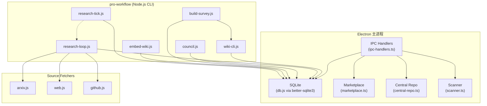
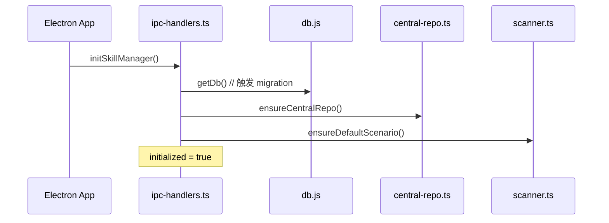
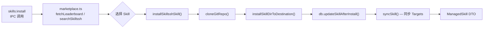
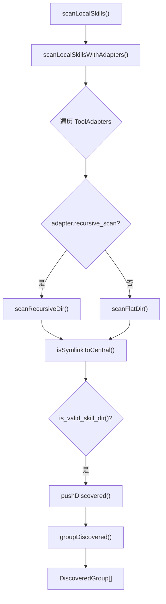
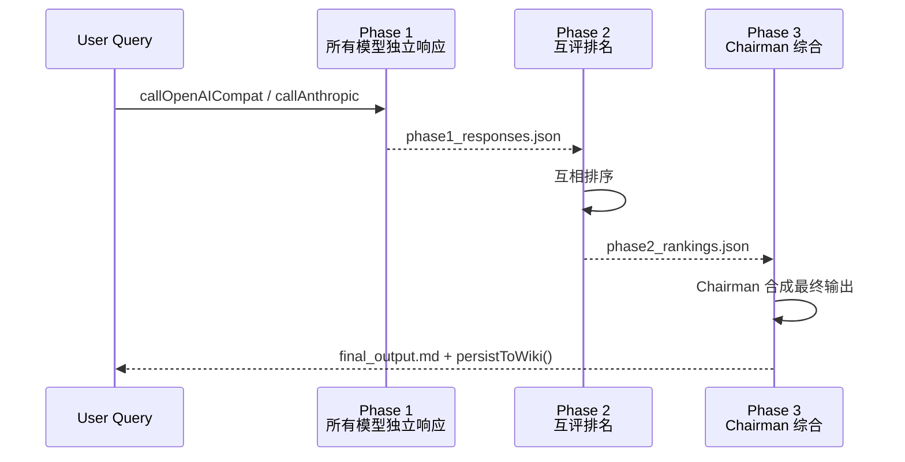

# 技能与插件系统总览

<cite>
**本文引用的文件**
- [src/electron/libs/skill-manager/index.ts](file://src/electron/libs/skill-manager/index.ts)
- [src/electron/libs/skill-manager/ipc-handlers.ts](file://src/electron/libs/skill-manager/ipc-handlers.ts#L1-L118)
- [src/electron/libs/skill-manager/types.ts](file://src/electron/libs/skill-manager/types.ts#L1-L181)
- [src/electron/libs/skill-manager/marketplace.ts](file://src/electron/libs/skill-manager/marketplace.ts#L1-L232)
- [src/electron/libs/skill-manager/central-repo.ts](file://src/electron/libs/skill-manager/central-repo.ts#L1-L104)
- [src/electron/libs/skill-manager/scanner.ts](file://src/electron/libs/skill-manager/scanner.ts#L1-L269)
- [pro-workflow/skills/llm-council/scripts/council.js](file://pro-workflow/skills/llm-council/scripts/council.js#L1-L287)
- [pro-workflow/skills/survey-generator/scripts/build-survey.js](file://pro-workflow/skills/survey-generator/scripts/build-survey.js#L1-L240)
- [pro-workflow/skills/wiki-builder/scripts/init_wiki.sh](file://pro-workflow/skills/wiki-builder/scripts/init_wiki.sh#L1-L101)
- [pro-workflow/skills/wiki-builder/scripts/wiki-cli.js](file://pro-workflow/skills/wiki-builder/scripts/wiki-cli.js#L1-L231)
- [pro-workflow/skills/wiki-query/scripts/query.js](file://pro-workflow/skills/wiki-query/scripts/query.js#L1-L111)
- [pro-workflow/skills/wiki-research-loop/scripts/research-loop.js](file://pro-workflow/skills/wiki-research-loop/scripts/research-loop.js#L1-L368)
- [pro-workflow/skills/wiki-viewer/scripts/render.js](file://pro-workflow/skills/wiki-viewer/scripts/render.js#L1-L579)
- [pro-workflow/skills/wiki-research-loop/scripts/source-fetchers/arxiv.js](file://pro-workflow/skills/wiki-research-loop/scripts/source-fetchers/arxiv.js#L1-L57)
- [pro-workflow/skills/wiki-research-loop/scripts/source-fetchers/web.js](file://pro-workflow/skills/wiki-research-loop/scripts/source-fetchers/web.js#L1-L92)
- [pro-workflow/skills/wiki-research-loop/scripts/source-fetchers/github.js](file://pro-workflow/skills/wiki-research-loop/scripts/source-fetchers/github.js#L1-L53)
- [pro-workflow/scripts/research-tick.js](file://pro-workflow/scripts/research-tick.js#L1-L77)
- [pro-workflow/scripts/embed-wiki.js](file://pro-workflow/scripts/embed-wiki.js#L1-L123)
</cite>

---

## 目录

- [系统职责与边界](#1-系统职责与边界)
- [核心数据结构](#2-核心数据结构)
- [Electron 端调用链](#3-electron-端调用链)
- [CLI 技能端调用链](#4-cli-技能端调用链)
- [IPC 通道与命令](#5-ipc-通道与命令)
- [数据库 Schema 与持久化](#6-数据库-schema-与持久化)
- [扩展点：新增 Fetcher](#7-扩展点新增-fetcher)
- [扩展点：新增 CLI 技能](#8-扩展点新增-cli-技能)
- [常见失败模式与排障](#9-常见失败模式与排障)
- [Agent 改代码地图](#10-agent-改代码地图)

---

## 1. 系统职责与边界

### 1.1 职责定位

技能与插件系统是 `tech-cc-hub` 的**能力编排层**，负责三件事：

| 职责 | 说明 | 代表模块 |
|------|------|---------|
| **发现** | 扫描本地工具（Claude、Cursor 等）下的 skills 目录 | `scanner.ts` |
| **管理** | 增删改查、版本追踪、安装来源记录 | `ipc-handlers.ts` + SQLite |
| **执行** | 提供 CLI 脚本供 Agent 调用（wiki 构建、研究循环等） | `pro-workflow/skills/*/` |

**不属于本系统的职责**（由其他层处理）：
- LLM 调用本身（由 `llm-council` 等 skill 自行封装）
- 向量嵌入的生成逻辑（由 `embed-wiki.js` 调用外部 provider）
- Electron 渲染进程 UI（由前端组件订阅 IPC 事件）

### 1.2 架构层级总览



**图表来源**：`file://src/electron/libs/skill-manager/ipc-handlers.ts#L106-L118`（init 调用链）

---

## 2. 核心数据结构

### 2.1 ManagedSkill（全量技能记录）

```typescript
// file://src/electron/libs/skill-manager/types.ts#L14-L38
interface ManagedSkill {
  id: string;                    // UUID
  name: string;
  description: string | null;
  source_type: 'git' | 'skillssh' | 'local' | 'import';
  source_ref: string | null;    // Git URL 或本地路径
  source_ref_resolved: string | null;
  source_subpath: string | null;
  source_branch: string | null;
  source_revision: string | null;
  remote_revision: string | null;
  central_path: string;         // 中央仓库路径
  content_hash: string | null;  // SHA256
  enabled: boolean;
  created_at: number;
  updated_at: number;
  status: string;               // "ok"
  update_status: string;        // "up_to_date" | "update_available" | "local_only" | "source_missing"
  last_checked_at: number | null;
  last_check_error: string | null;
  targets: SkillTarget[];       // 每个工具的安装目标
  scenario_ids: string[];
  tags: string[];
}
```

### 2.2 SkillTarget（安装目标）

```typescript
// file://src/electron/libs/skill-manager/types.ts#L39-L48
interface SkillTarget {
  id: string;
  skill_id: string;
  tool: string;                 // "claude" | "cursor" 等
  target_path: string;          // 符号链接或复制目标路径
  mode: 'symlink' | 'copy';
  status: 'ok';
  synced_at: number | null;
}
```

### 2.3 Scenario（技能组合）

```typescript
// file://src/electron/libs/skill-manager/types.ts#L72-L82
interface Scenario {
  id: string;
  name: string;
  description: string | null;
  icon: string | null;
  sort_order: number;
  skill_count: number;
  created_at: number;
  updated_at: number;
}
```

**章节来源**：`file://src/electron/libs/skill-manager/types.ts#L14-L82`

---

## 3. Electron 端调用链

### 3.1 启动初始化



**关键符号**：
- `initSkillManager()` — 幂等初始化，调用 `getDb()` 触发 SQLite 迁移
- `registerSkillIpcHandler(channel, handler)` — 注册 IPC 通道

[章节来源](file://src/electron/libs/skill-manager/ipc-handlers.ts#L106-L118)

### 3.2 技能安装流程（skills.sh）



**关键函数**：
- `installSkillsshSkill(skillId)` — 从 skills.sh 下载 Git repo
- `cloneGitRepo(url, dest)` — 执行 `git clone`
- `installSkillDirToDestination(src, name, dest)` — 复制到中央仓库

[章节来源](file://src/electron/libs/skill-manager/ipc-handlers.ts#L256-L400)

### 3.3 本地扫描流程



**跳过目录**（`RECURSIVE_SCAN_SKIP_DIRS`）：`.hub`, `.git`, `node_modules`, `target`, `dist`, `build`, `.next`, `.turbo`, `vendor`, `.venv`, `__pycache__`, `.cache`, `.nuxt`, `.output`

[章节来源](file://src/electron/libs/skill-manager/scanner.ts#L25-L195)

---

## 4. CLI 技能端调用链

### 4.1 Wiki 构建技能（wiki-builder）

```
wiki-cli.js init <slug> --title "X" [--flavor research]
        │
        └──→ init_wiki.sh (创建目录结构 + 渲染模板)
        └──→ store.upsertWiki() — 注册到 DB
```

```javascript
// file://pro-workflow/skills/wiki-builder/scripts/wiki-cli.js#L52-L72
function cmdInit(args) {
  const slug = args._[0];
  const initSh = path.join(__dirname, 'init_wiki.sh');
  const dest = execFileSync('bash', [initSh, slug, ...], { encoding: 'utf8' }).trim();
  const store = getStore();
  store.upsertWiki({ slug, title, flavor, root_path: dest, scope });
}
```

**入口脚本**：`init_wiki.sh` — 根据 `--flavor` 渲染不同目录结构：
| Flavor | 子目录 |
|--------|--------|
| `paper` | `wiki/sections` |
| `domain` / `research` | `wiki/{concepts,papers,questions}` |
| `product` | `wiki/{features,decisions,issues}` |
| `codebase` | `wiki/{modules,symbols,decisions}` |

[章节来源](file://pro-workflow/skills/wiki-builder/scripts/init_wiki.sh#L64-L74)

### 4.2 研究循环技能（wiki-research-loop）

```
research-loop.js run <slug> [options]
        │
        ├──→ loadFetchers(['web','arxiv','github'])  // 动态加载 fetcher
        ├──→ readWikiConfig()  // 解析 wiki.config.md frontmatter
        ├──→ store.claimPendingSeed()  // 取出待处理 seed
        ├──→ fetcher.fetch(query)  // 调用各 fetcher
        ├──→ compilePage()  // 生成 claims + novelty 评估
        ├──→ store.upsertWikiPage()  // 写回 DB
        └──→ deriveFollowUps()  // 追加新 seeds
```

**停止机制**：检查 `~/.pro-workflow/STOP` 文件存在则中止

[章节来源](file://pro-workflow/skills/wiki-research-loop/scripts/research-loop.js#L161-L200)

### 4.3 LLM Council 技能（llm-council）

三阶段协商流程：



**支持的 Provider**：`anthropic`, `openai`, `openrouter`, `fireworks`, `custom`

[章节来源](file://pro-workflow/skills/llm-council/scripts/council.js#L183-L244)

### 4.4 文献调查技能（survey-generator）

```
build-survey.js --bundle <path> --wiki <slug> [--provider anthropic]
        │
        ├──→ 验证 bundle.json 结构（bibliography[], sections[]）
        ├──→ buildPrompt(bundle)  // 构建带引用格式的 prompt
        ├──→ callProvider()  // 调用 LLM
        ├──→ 写入 derived/surveys/<topic>-v{N}.md
        ├──→ appendBibliographyToSources()  // 追加 sources.md
        └──→ wiki-cli.js page <slug> --type survey  // 索引到 DB
```

**Prompt 约束**：
- 使用 `[^src-bib-key]` 格式内联引用
- 每个 section 必须引用其 `paper_citation_ids` 中的每篇论文
- 禁止引用 bibliography 之外的论文

[章节来源](file://pro-workflow/skills/survey-generator/scripts/build-survey.js#L131-L162)

---

## 5. IPC 通道与命令

### 5.1 已注册通道

| Channel | 处理函数 | 说明 |
|---------|---------|------|
| `skills:scan` | `handleSkillManagerInvoke` | 触发本地 skills 扫描 |
| `skills:install-ssh` | `installSkillsshSkill` | 从 skills.sh 安装 |
| `skills:install-git` | `installGitSkillSelection` | 从 Git URL 安装 |
| `skills:list` | `getAllSkills` | 列出所有技能 |
| `skills:get` | `managedSkillById` | 按 ID 获取详情 |
| `scenarios:list` | `getAllScenarioDtos` | 列出所有场景 |
| `scenarios:create` | `createScenario` | 创建新场景 |

[章节来源](file://src/electron/libs/skill-manager/ipc-handlers.ts#L91-L104)

### 5.2 中央仓库路径

```
~/.skills-manager/              # DEFAULT_CENTRAL_REPO_DIR
├── skills/
│   ├── <skill-name>/          # 每个 skill 的中央副本
│   └── ...
└── settings.json              # 通过 db.js settings 表管理
```

可通过 `getSetting("central_repo_path")` 覆盖。

[章节来源](file://src/electron/libs/skill-manager/central-repo.ts#L9-L28)

---

## 6. 数据库 Schema 与持久化

### 6.1 核心表

| 表名 | 关键字段 | 说明 |
|------|---------|------|
| `skills` | id, name, source_type, source_ref, central_path, content_hash, update_status | 主技能表 |
| `skill_targets` | id, skill_id, tool, target_path, mode, status, synced_at | 目标路径映射 |
| `scenarios` | id, name, sort_order, icon | 技能组合 |
| `scenario_skills` | scenario_id, skill_id, sort_order | 场景-技能关联 |
| `skill_tags` | skill_id, tag | 标签 |
| `wiki_pages` | id, wiki_slug, rel_path, title, summary, content_hash, page_type | wiki 页面索引 |
| `wiki_seeds` | id, wiki_slug, query, status, depth | 研究种子队列 |
| `wiki_embeddings` | page_id, model, embedding (BLOB) | 向量索引 |
| `settings` | key, value | 键值配置 |

### 6.2 前端刷新边界

| 数据 | Source of Truth | 刷新机制 |
|------|----------------|---------|
| 技能列表 | `skills` 表 | 需重新调用 `skills:list` IPC |
| 场景 | `scenarios` 表 | 需重新调用 `scenarios:list` IPC |
| Wiki 页面 | `wiki_pages` 表 + 文件系统 | `store.js` 实时读写，需 `store.close()` |
| 配置 | `wiki.config.md` | 读文件，未缓存 |

**前后端桥接**：通过 `ipcRenderer.invoke('skills:xxx', ...args)` 异步调用，结果通过 Promise 返回。

[章节来源](file://src/electron/libs/skill-manager/ipc-handlers.ts#L96-L104)

---

## 7. 扩展点：新增 Fetcher

### 7.1 协议

在 `pro-workflow/skills/wiki-research-loop/scripts/source-fetchers/` 下放置 `.js` 文件，导出：

```javascript
module.exports = {
  name: 'fetcher-name',          // 唯一标识符
  match: () => true,             // () => boolean，是否启用
  estimateCost: () => ({ usd: 0, tokens: 0 }),  // 成本估算
  async fetch(query, opts = {}) {
    // opts.limit, opts[q]
    // 返回: Array<{ title, content, url, fetched_at }>
    return [];
  }
};
```

### 7.2 注册方式

`research-loop.js` 在运行时通过 `loadFetchers()` 动态加载，目录：

1. `SKILL_ROOT/scripts/source-fetchers/` — 内置 fetchers（`arxiv.js`, `web.js`, `github.js`）
2. `~/.pro-workflow/fetchers/` — 用户自定义 fetchers

[章节来源](file://pro-workflow/skills/wiki-research-loop/scripts/research-loop.js#L36-L56)

### 7.3 内置 Fetcher 对比

| Fetcher | API | 认证 | 成本 |
|---------|-----|------|------|
| `arxiv.js` | `export.arxiv.org/api/query` | 无 | 免费 |
| `web.js` | `lite.duckduckgo.com/lite/` | 无 | 免费 |
| `github.js` | `api.github.com/search/repositories` | `GH_TOKEN` 可选 | 免费 |

[章节来源](file://pro-workflow/skills/wiki-research-loop/scripts/source-fetchers/arxiv.js#L40-L56)

---

## 8. 扩展点：新增 CLI 技能

### 8.1 目录结构约定

```
pro-workflow/skills/<skill-name>/
├── scripts/
│   ├── main-script.js          # 入口 CLI
│   └── ...
├── templates/                  # 可选：模板文件
└── README.md                   # 可选：技能说明
```

### 8.2 必须遵守的约定

| 约定 | 说明 |
|------|------|
| Shebang | `#!/usr/bin/env node` |
| `parseArgs()` | 统一参数解析（`--key value` 或 `--flag`） |
| `getStore()` | 通过 `dist/db/store.js` 访问 DB |
| 错误处理 | `die(msg)` + `process.exit(1)` |
| 帮助文本 | `usage()` + `process.exit(1)` |

### 8.3 示例：新 skill 的 DB 访问

```javascript
const PRO_WORKFLOW_ROOT = path.resolve(__dirname, '..', '..', '..');
const distPath = path.join(PRO_WORKFLOW_ROOT, 'dist', 'db', 'store.js');
const { createStore } = require(distPath);
const store = createStore();
try {
  const wiki = store.getWiki(slug);
  // ...
} finally {
  store.close();
}
```

---

## 9. 常见失败模式与排障

### 9.1 症状与排查步骤

| 症状 | 常见原因 | 排查命令 |
|------|---------|---------|
| `built store missing` | 未执行 `npm run build` | `ls dist/db/store.js` |
| `wiki not found` | 未执行 `wiki-cli.js init` | `wiki-cli.js list` |
| `no usable fetchers` | fetcher 文件语法错误或缺失 | `ls source-fetchers/` |
| `skills.sh search error` | 网络或代理问题 | 检查 `HTTPS_PROXY` 环境变量 |
| `git clone timeout` | 网络或 Git URL 无效 | `git ls-remote <url>` |
| `STOP file present` | 研究循环被人为中止 | `ls ~/.pro-workflow/STOP` |
| `private wiki with non-local fetcher` | private wiki 配置冲突 | 检查 `wiki.config.md` 的 `private: true` |

### 9.2 验证命令速查

```bash
# 验证 Electron 端
cd src/electron && npm run build
node -e "require('./libs/skill-manager').getAllSkills()" 2>&1 | head -20

# 验证 wiki-cli
node pro-workflow/skills/wiki-builder/scripts/wiki-cli.js list
node pro-workflow/skills/wiki-builder/scripts/wiki-cli.js info <slug>

# 验证研究循环
node pro-workflow/skills/wiki-research-loop/scripts/research-loop.js status <slug>
node pro-workflow/skills/wiki-research-loop/scripts/research-loop.js seeds <slug>

# 验证 Council
node pro-workflow/skills/llm-council/scripts/council.js providers

# 验证嵌入
node pro-workflow/scripts/embed-wiki.js search "test query" --limit 5

# 验证 Tick
node pro-workflow/scripts/research-tick.js
cat ~/.pro-workflow/tick.log
```

[章节来源](file://pro-workflow/scripts/research-tick.js#L44-L73)

---

## 10. Agent 改代码地图

### 10.1 修改入口速查

| 改动目标 | 先读文件 | 修改函数/符号 | 验证命令 |
|---------|---------|--------------|---------|
| **新增 DB 表/字段** | `src/electron/libs/skill-manager/index.ts` | 在 `db.js` 中加 `CREATE TABLE` / `ALTER TABLE` | `npm run build && node -e "require('./libs/skill-manager').getDb()"` |
| **新增 IPC 通道** | `src/electron/libs/skill-manager/ipc-handlers.ts` | `registerSkillIpcHandler("skills:xxx", handler)` | `grep -r "skills:xxx" src/` |
| **新增 Skill 类型** | `src/electron/libs/skill-manager/types.ts` | `SkillRecord` / `ManagedSkill` 接口 | `tsc --noEmit` |
| **修改 Marketplace 解析** | `src/electron/libs/skill-manager/marketplace.ts` | `normalizeSkills()` / `parseLeaderboardHtml()` | `node -e "require('./libs/skill-manager/marketplace').searchSkillssh('test')"` |
| **修改中央仓库路径** | `src/electron/libs/skill-manager/central-repo.ts` | `centralRepoBaseDir()` + `DEFAULT_CENTRAL_REPO_DIR` | `node -e "console.log(require('./libs/skill-manager/central-repo').skillsDir())"` |
| **新增 Fetcher** | `pro-workflow/skills/wiki-research-loop/scripts/source-fetchers/*.js` | 导出 `name`, `fetch()` 方法 | `node research-loop.js run <slug> --fetchers <name>` |
| **新增 CLI 技能** | `pro-workflow/skills/<name>/scripts/` | 参考 `wiki-builder` 结构 | 独立运行 `node main-script.js --help` |
| **修改 Wiki 配置解析** | `pro-workflow/skills/wiki-research-loop/scripts/research-loop.js` | `readWikiConfig()` frontmatter 解析 | `node research-loop.js status <slug>` |
| **修改 LLM Council 调用** | `pro-workflow/skills/llm-council/scripts/council.js` | `callOpenAICompat()` / `callAnthropic()` | `node council.js run "test" --models gpt-4o` |
| **修改 Survey 格式** | `pro-workflow/skills/survey-generator/scripts/build-survey.js` | `buildPrompt()` | `node build-survey.js --bundle test.json --wiki <slug>` |

### 10.2 关键符号表

| 符号 | 文件 | 行号 | 用途 |
|------|------|------|------|
| `getDb` | `index.ts` | 6 | 获取 SQLite 连接 |
| `managedSkillToDto` | `ipc-handlers.ts` | 121 | Skill 记录转 DTO |
| `installSkillsshSkill` | `ipc-handlers.ts` | 256 | 安装 skills.sh skill |
| `installGitSkillSelection` | `ipc-handlers.ts` | 489 | 安装 Git skill |
| `scanLocalSkillsWithAdapters` | `scanner.ts` | 155 | 扫描本地 skills |
| `groupDiscovered` | `scanner.ts` | 196 | 分组扫描结果 |
| `fetchLeaderboard` | `marketplace.ts` | 41 | 获取 skills.sh 排行榜 |
| `searchSkillssh` | `marketplace.ts` | 72 | 搜索 skills.sh |
| `createStore` | `dist/db/store.js` | — | 获取 DB store（运行时） |
| `pickProvider` | `council.js` | 52 | 选择 LLM provider |
| `loadFetchers` | `research-loop.js` | 35 | 动态加载 fetchers |
| `compilePage` | `research-loop.js` | 109 | 生成研究页面 |

### 10.3 常见回归风险

| 风险 | 缓解措施 |
|------|---------|
| 修改 `types.ts` 后 Electron 重启不生效 | 需重新 `npm run build` 编译 TypeScript |
| 修改 `central-repo.ts` 路径逻辑 | 测试 `skillsDir()` 和 `centralRepoBaseDir()` 独立输出 |
| 修改 Fetcher 但 `loadFetchers()` 加载旧缓存 | 删除 `~/.pro-workflow/` 下相关缓存或重启进程 |
| 修改 Wiki frontmatter 解析破坏 `readWikiConfig()` | 用已知 `wiki.config.md` 样本跑 `research-loop.js status` |
| 修改 `ipc-handlers.ts` 后 IPC channel 不匹配 | 检查 `handleSkillManagerInvoke` 的 `channel.startsWith("skills:")` 前缀 |
| 修改 `store.js` 但前端持有旧引用 | 确认所有调用路径都有 `store.close()` |

### 10.4 测试入口

- **Electron 单元测试**：`src/electron/` 下各 `.ts` 文件可直接 `node -e "require('./libs/skill-manager/xxx')"`
- **CLI 脚本测试**：直接运行 `node <script>.js --help` 或带 `--json` 参数输出结构化结果
- **集成测试**：执行 `research-tick.js` 触发完整 wiki → research → embed 链路

---

## 附录：关键文件路径速查

| 功能 | 文件路径 |
|------|---------|
| Electron 技能管理器入口 | `src/electron/libs/skill-manager/index.ts` |
| IPC 处理器 | `src/electron/libs/skill-manager/ipc-handlers.ts` |
| 类型定义 | `src/electron/libs/skill-manager/types.ts` |
| 中央仓库管理 | `src/electron/libs/skill-manager/central-repo.ts` |
| 本地 skills 扫描 | `src/electron/libs/skill-manager/scanner.ts` |
| Marketplace API | `src/electron/libs/skill-manager/marketplace.ts` |
| Wiki CLI | `pro-workflow/skills/wiki-builder/scripts/wiki-cli.js` |
| Wiki 初始化 | `pro-workflow/skills/wiki-builder/scripts/init_wiki.sh` |
| 研究循环 | `pro-workflow/skills/wiki-research-loop/scripts/research-loop.js` |
| LLM Council | `pro-workflow/skills/llm-council/scripts/council.js` |
| 文献调查 | `pro-workflow/skills/survey-generator/scripts/build-survey.js` |
| Wiki 查询 | `pro-workflow/skills/wiki-query/scripts/query.js` |
| Wiki 渲染 | `pro-workflow/skills/wiki-viewer/scripts/render.js` |
| 嵌入生成 | `pro-workflow/scripts/embed-wiki.js` |
| 定时 tick | `pro-workflow/scripts/research-tick.js` |