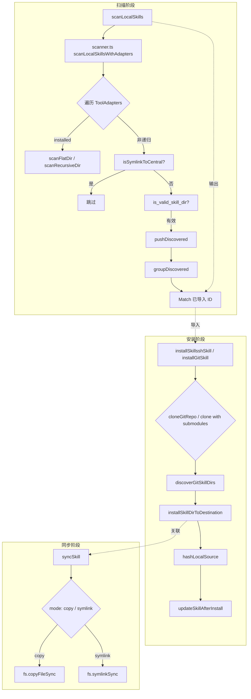
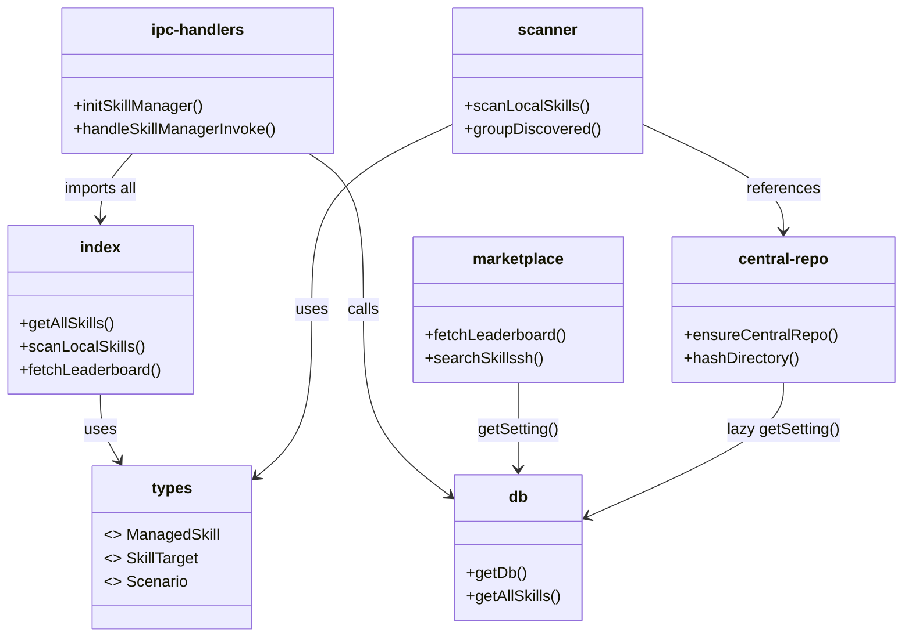

# 技能与插件系统总览

<cite>
**本文引用的文件**
- [src/electron/libs/skill-manager/index.ts](file://src/electron/libs/skill-manager/index.ts)
- [pro-workflow/skills/llm-council/scripts/council.js](file://pro-workflow/skills/llm-council/scripts/council.js)
- [pro-workflow/skills/survey-generator/scripts/build-survey.js](file://pro-workflow/skills/survey-generator/scripts/build-survey.js)
- [pro-workflow/skills/wiki-builder/scripts/init_wiki.sh](file://pro-workflow/skills/wiki-builder/scripts/init_wiki.sh)
- [pro-workflow/skills/wiki-builder/scripts/wiki-cli.js](file://pro-workflow/skills/wiki-builder/scripts/wiki-cli.js)
- [pro-workflow/skills/wiki-query/scripts/query.js](file://pro-workflow/skills/wiki-query/scripts/query.js)
- [pro-workflow/skills/wiki-research-loop/scripts/research-loop.js](file://pro-workflow/skills/wiki-research-loop/scripts/research-loop.js)
- [pro-workflow/skills/wiki-viewer/scripts/render.js](file://pro-workflow/skills/wiki-viewer/scripts/render.js)
- [src/electron/libs/skill-manager/marketplace.ts](file://src/electron/libs/skill-manager/marketplace.ts)
- [src/electron/libs/skill-manager/ipc-handlers.ts](file://src/electron/libs/skill-manager/ipc-handlers.ts)
- [src/electron/libs/skill-manager/types.ts](file://src/electron/libs/skill-manager/types.ts)
- [src/electron/libs/skill-manager/central-repo.ts](file://src/electron/libs/skill-manager/central-repo.ts)
- [src/electron/libs/skill-manager/scanner.ts](file://src/electron/libs/skill-manager/scanner.ts)
- [pro-workflow/skills/wiki-research-loop/scripts/source-fetchers/arxiv.js](file://pro-workflow/skills/wiki-research-loop/scripts/source-fetchers/arxiv.js)
- [pro-workflow/skills/wiki-research-loop/scripts/source-fetchers/web.js](file://pro-workflow/skills/wiki-research-loop/scripts/source-fetchers/web.js)
- [pro-workflow/skills/wiki-research-loop/scripts/source-fetchers/github.js](file://pro-workflow/skills/wiki-research-loop/scripts/source-fetchers/github.js)
- [pro-workflow/scripts/research-tick.js](file://pro-workflow/scripts/research-tick.js)
- [pro-workflow/scripts/embed-wiki.js](file://pro-workflow/scripts/embed-wiki.js)
</cite>

## 目录

- [系统职责](#系统职责)
- [入口文件与模块关系](#入口文件与模块关系)
- [数据结构与类型定义](#数据结构与类型定义)
- [IPC 通信通道](#ipc-通信通道)
- [Skill 生命周期与调用链](#skill-生命周期与调用链)
- [市场与安装流程](#市场与安装流程)
- [扩展点：Fetcher 机制](#扩展点fetcher-机制)
- [持久化与 Source of Truth](#持久化与-source-of-truth)
- [Agent 改代码地图](#agent-改代码地图)
- [常见失败模式与排障](#常见失败模式与排障)
- [验证命令清单](#验证命令清单)

---

## 系统职责

技能与插件系统是 `tech-cc-hub` 的能力扩展中枢，负责：

1. **发现与扫描** — 自动扫描本地工具（Cline/Claude）的 skills 目录，将发现结果与已管理技能比对去重
2. **安装与同步** — 支持从 skills.sh 市场、Git 仓库、本地目录三种来源安装技能
3. **编排与执行** — 通过 IPC 调用 Electron 主进程的 handler，或直接 `spawnSync` 执行 skill 内置脚本
4. **场景化分组** — 将技能组织为 Scenario（场景），支持按场景开关工具、切换激活状态
5. **目标部署** — 将技能以 `symlink` 或 `copy` 模式部署到各工具的 skills 目录

> 图表来源：types.ts#L14-L38 定义了核心职责对象 `ManagedSkill`、`SkillTarget`、`Scenario`

---

## 入口文件与模块关系

### Electron 主进程侧

| 文件 | 职责 | 关键导出 |
|------|------|----------|
| `index.ts` | 统一导出层，对外暴露所有子模块 API | `getAllSkills`, `scanLocalSkills`, `fetchLeaderboard` |
| `ipc-handlers.ts` | 注册 `ipcMain.handle` 通道，路由前端调用 | `handleSkillManagerInvoke`, `registerSkillManagerHandlers` |
| `types.ts` | TypeScript 接口定义 | `ManagedSkill`, `SkillTarget`, `Scenario`, `SkillToolToggle` |
| `scanner.ts` | 扫描 `~/.claude/skills`、`~/.claude/agents/*/skills` 等路径 | `scanLocalSkills`, `scanLocalSkillsWithAdapters`, `groupDiscovered` |
| `marketplace.ts` | 与 skills.sh、SkillsMP API 交互 | `fetchLeaderboard`, `searchSkillssh`, `searchSkillsmp` |
| `central-repo.ts` | 管理中央技能仓库 `~/.skills-manager/skills` | `ensureCentralRepo`, `hashDirectory`, `hashLocalSource` |

### Skill 脚本侧（pro-workflow）

| Skill | 入口脚本 | 职责 |
|-------|----------|------|
| `llm-council` | `council.js` | 多模型评议：Phase1 各模型独立回答 → Phase2 互相评分 → Phase3 主席综合 |
| `survey-generator` | `build-survey.js` | 读取 JSON bundle（topic + bibliography + sections），调用 LLM 生成文献综述 |
| `wiki-builder` | `wiki-cli.js` + `init_wiki.sh` | CLI 工具：创建/索引 wiki、upsert WikiPage、reindex 全文 |
| `wiki-query` | `query.js` | 通过 `store.searchWiki()` 全文搜索或找相关页面 |
| `wiki-research-loop` | `research-loop.js` | 消费 `wiki_seeds` 队列，抓取 arxiv/web/github，提取 claim 生成研究页面 |
| `wiki-viewer` | `render.js` | 自举 Markdown → HTML 渲染器 + SVG 页面关系图 |

### 调度脚本

| 文件 | 职责 |
|------|------|
| `research-tick.js` | 定时任务：查找 `auto_research.enabled=true` 的 wiki，执行 research-loop 单次迭代 |
| `embed-wiki.js` | 向量嵌入：生成 embedding 并写入 `wiki_embeddings` 表，支持 hybrid search |

> 章节来源：`ipc-handlers.ts#L4-L82` 导入所有子模块并声明 channel 注册逻辑

---

## 数据结构与类型定义

### ManagedSkill（核心实体）

```typescript
// types.ts#L14-L38
interface ManagedSkill {
  id: string;                    // UUID，由 scanner 分配
  name: string;
  description: string | null;
  source_type: string;           // "git" | "skillssh" | "local" | "import"
  source_ref: string | null;     // git URL 或本地路径
  source_ref_resolved: string | null;
  source_subpath: string | null; // Git 子目录安装
  source_branch: string | null;
  source_revision: string | null;
  remote_revision: string | null;
  central_path: string;          // ~/.skills-manager/skills/<name>
  content_hash: string | null;   // SHA-256 of skill directory
  enabled: boolean;
  status: string;                // "ok" | ...
  update_status: string;         // "up_to_date" | "update_available" | ...
  last_checked_at: number | null;
  last_check_error: string | null;
  targets: SkillTarget[];        // 部署目标列表
  scenario_ids: string[];        // 所属场景
  tags: string[];
}
```

### SkillTarget（部署目标）

```typescript
// types.ts#L40-L48
interface SkillTarget {
  id: string;
  skill_id: string;
  tool: string;           // "claude" | "cline" | ...
  target_path: string;    // 例如 ~/.claude/skills/<name>
  mode: string;           // "symlink" | "copy"
  status: string;         // "ok"
  synced_at: number | null;
}
```

### Scenario（场景）

```typescript
// types.ts#L73-L82
interface Scenario {
  id: string;
  name: string;
  description: string | null;
  icon: string | null;
  sort_order: number;
  skill_count: number;    // 动态计算
  created_at: number;
  updated_at: number;
}
```

### ToolInfo（工具适配器信息）

```typescript
// types.ts#L4-L13
interface ToolInfo {
  key: string;           // "claude" | "cline" | ...
  display_name: string;
  installed: boolean;
  skills_dir: string;    // 工具的 skills 目录路径
  enabled: boolean;
  is_custom: boolean;
  has_path_override: boolean;
  project_relative_skills_dir: string | null;
}
```

> 章节来源：`types.ts` 完整接口定义

---

## IPC 通信通道

### Channel 前缀约定

所有 skill manager 通道以 `skills:` 开头，由 `handleSkillManagerInvoke` 统一路由：

```typescript
// ipc-handlers.ts#L92-L104
function registerSkillIpcHandler(channel: string, handler: SkillIpcHandler) {
  skillIpcHandlers.set(channel, handler);
  ipcMain.handle(channel, (_event: any, ...args: any[]) => handler(...args));
}

export async function handleSkillManagerInvoke(channel: string, ...args: unknown[]): Promise<unknown> {
  initSkillManager();
  const handler = skillIpcHandlers.get(channel);
  if (!handler || !channel.startsWith("skills:")) {
    throw new Error(`Unsupported skill manager channel: ${channel}`);
  }
  return await handler(...args);
}
```

### 典型调用流程

```
Renderer (React)
  → window.electron.invoke("skills:scan-local")
  → ipcMain.handle("skills:scan-local", ...)
  → handleSkillManagerInvoke("skills:scan-local")
  → skillIpcHandlers.get("skills:scan-local")()
  → scanLocalSkills()
  → 返回 ScanResult { tools_scanned, skills_found, groups }
```

### 初始化顺序

```typescript
// ipc-handlers.ts#L106-L118
export function initSkillManager(): void {
  if (initialized) return;
  try {
    getDb();              // 触发 SQLite 迁移
    ensureCentralRepo();  // 创建 ~/.skills-manager
    ensureDefaultScenario(); // 创建默认场景
    initialized = true;
  } catch (err) {
    console.error("[skill-manager] init failed:", err);
  }
}
```

> 章节来源：`ipc-handlers.ts#L84-L118` 初始化与路由逻辑

---

## Skill 生命周期与调用链

### 完整生命周期图



### 各 Skill 的调用链路

#### llm-council（多模型评议）

```
council.js cmdRun
  ├─ pickProvider()  → 检测环境变量选择 provider
  ├─ Phase1: Promise.allSettled(models.map(m => provider.call()))
  ├─ Phase2: 匿名化 Phase1 结果，各模型互相评分
  ├─ Phase3: Chairman 模型综合 → final_output.md
  └─ persistToWiki() → 写入 store.upsertWikiPage()
```

关键函数：
- `callOpenAICompat` — OpenAI-compatible `/chat/completions`
- `callAnthropic` — Anthropic `/v1/messages`
- `PROVIDERS` 配置支持 `anthropic`、`openai`、`openrouter`、`fireworks`、`custom`

#### wiki-research-loop（自动研究）

```
research-loop.js cmdRun
  ├─ store.claimPendingSeed(slug)  → 获取待处理种子
  ├─ loadFetchers(names) → 动态 require arxiv/web/github.js
  ├─ fetcher.fetch(query, opts) → 抓取结果 []
  ├─ compilePage(seed, docs, prevPages)
  │   ├─ jaccardNovelty() → 计算内容新颖度
  │   └─ 提取 claim，生成 # Query 页面
  ├─ deriveFollowUps() → 从 claim 中提取新种子
  ├─ store.upsertWikiPage() → 写入页面
  └─ store.insertWikiSeed() → 入队后续查询
```

#### survey-generator（文献综述）

```
build-survey.js cmdRun
  ├─ 验证 JSON bundle（topic + bibliography[] + sections[]）
  ├─ callProvider() → LLM 生成 markdown
  ├─ appendBibliographyToSources() → 追加到 sources.md 表格
  ├─ 写入 derived/surveys/<topic>-v<n>.md
  └─ execFileSync(wiki-cli.js page ...) → 索引页面
```

> 章节来源：`council.js#L159-L244` Phase 执行；`research-loop.js#L161-L210` runOne 循环；`build-survey.js#L164-L226` 综述生成

---

## 市场与安装流程

### Skills.sh 市场集成

```typescript
// marketplace.ts#L41-L67
export async function fetchLeaderboard(board: string): Promise<SkillsShSkill[]> {
  const cacheKey = `leaderboard_${board}`;
  const cached = getCache(cacheKey, LEADERBOARD_CACHE_TTL_MS); // 5min TTL
  if (cached) return JSON.parse(cached);

  const url = leaderboardUrl(board); // hot / trending / alltime
  const response = await fetchWithProxy(url); // 支持 proxy_url 设置
  const skills = parseLeaderboardHtml(await response.text());
  setCache(cacheKey, JSON.stringify(skills));
  return skills;
}
```

搜索流程：
```
searchSkillssh(query) → GET /api/search?q=...&limit=300
  → normalizeSkills() → 统一字段名
  → 返回 SkillsShSkill[]
```

### Git 安装流程

```typescript
// ipc-handlers.ts#L347-L363
function cloneGitRepo(url, tempDir, branch?) {
  // execFileSync: git clone --depth 1 [--branch <branch>] <url> <tempDir>
}

function discoverGitSkillDirs(clonePath) {
  // 递归搜索 is_valid_skill_dir() 的目录
  // 返回 GitSkillPreview[] { dir_name, name, description }
}

function previewGitInstall(url) → GitPreviewResult {
  // 临时克隆 → 发现子 skill → 返回预览列表
}

function installGitSkillSelection(preview, skillId) {
  // 从预览选择 → 移动到 central_path
  // updateSkillAfterInstall() 更新 DB
}
```

> 章节来源：`marketplace.ts#L41-L67`、`ipc-handlers.ts#L336-L489`

---

## 扩展点：Fetcher 机制

Wiki-research-loop 采用**插件化 Fetcher**架构，允许在运行时动态加载 `.js` 模块：

```javascript
// research-loop.js#L36-L56
function loadFetchers(names) {
  const fetchers = {};
  const dirs = [
    path.join(SKILL_ROOT, 'scripts', 'source-fetchers'),     // 内置
    path.join(os.homedir(), '.pro-workflow', 'fetchers'),    // 用户扩展
  ];
  for (const dir of dirs) {
    for (const f of fs.readdirSync(dir)) {
      if (!f.endsWith('.js')) continue;
      const name = path.basename(f, '.js');
      if (names && !names.includes(name)) continue;
      fetchers[name] = require(path.join(dir, f));
    }
  }
  return fetchers;
}
```

### Fetcher 接口约定

每个 Fetcher 必须导出：

```javascript
module.exports = {
  name: 'arxiv',        // 唯一标识
  match: () => true,     // 是否匹配（可按 query 内容过滤）
  estimateCost: () => ({ usd: 0, tokens: 0 }),
  async fetch(query, opts = {}) {
    // opts.limit, opts.offset, ...
    // 返回: Array<{ title, content, url, fetched_at }>
  }
};
```

### 内置 Fetcher

| Fetcher | 实现文件 | 数据源 | 认证 |
|---------|----------|--------|------|
| `arxiv` | `source-fetchers/arxiv.js` | `https://export.arxiv.org/api/query` | 无 |
| `web` | `source-fetchers/web.js` | DuckDuckGo Lite (`lite.duckduckgo.com/lite`) | 无 |
| `github` | `source-fetchers/github.js` | `api.github.com/search/repositories` | `GH_TOKEN` / `GITHUB_TOKEN` |

> 章节来源：`arxiv.js#L40-L55`、`web.js#L76-L90`、`github.js#L26-L51` Fetcher 导出格式

---

## 持久化与 Source of Truth

### SQLite 数据库

所有结构化数据存储在 `dist/db/store.js`（编译产物），表结构包括：

| 表名 | 关键字段 | 用途 |
|------|----------|------|
| `skills` | id, name, source_type, source_ref, central_path, content_hash | ManagedSkill 主表 |
| `skill_targets` | id, skill_id, tool, target_path, mode, status | 部署目标 |
| `scenarios` | id, name, sort_order | 场景分组 |
| `scenario_skills` | scenario_id, skill_id | 多对多关系 |
| `skill_tags` | skill_id, tag | 标签 |
| `wiki_seeds` | id, wiki_slug, query, depth, status | 研究队列 |
| `wiki_pages` | id, wiki_slug, rel_path, title, content_hash | 页面索引 |
| `wiki_embeddings` | page_id, model, vector | 向量嵌入 |

> source-of-truth：`getStore()` 创建的 SQLite 连接，所有脚本通过 `store.db.prepare()` 直接访问

### 运行时刷新边界

| 操作 | 刷新方式 |
|------|----------|
| 新增 skill | 调用 `scanLocalSkills` → `groupDiscovered` → 对比已知 `managedPaths` |
| 安装 skill | `installSkillDirToDestination` → `updateSkillAfterInstall` 写 DB |
| 删除 skill | `deleteSkill` → 软删或物理删 |
| 同步 target | `syncSkill(mode)` → 直接操作文件系统 |
| Wiki 内容 | 读写 `wiki_pages` 表 + `wiki_embeddings` 表 |

> 前端通过 `ipcRenderer.invoke("skills:...")` 获取最新数据，Electron 进程重启时 DB 状态保留

---

## Agent 改代码地图

### 1. 修改扫描逻辑（发现新技能）

**先读文件：**
- `scanner.ts` — 核心扫描算法
- `tool-adapters.ts` — 工具适配器配置
- `types.ts` — `ScanResult`、`DiscoveredGroup` 接口

**关键符号：**
- `scanLocalSkillsWithAdapters(managedPaths, adapters)` — 入口函数
- `is_valid_skill_dir(path)` — 判断是否为有效 skill 目录
- `RECURSIVE_SCAN_SKIP_DIRS` 数组 — 控制跳过哪些目录
- `groupDiscovered(records)` — 按名称/指纹归组

**修改入口：**
- 若新增工具支持：在 `tool-adapters.ts` 添加 `ToolAdapter` 配置
- 若修改扫描深度：在 `scanner.ts` 的 `scanRecursiveDir` 中调整递归逻辑

**验证命令：**
```bash
node -e "
  const { scanLocalSkills } = require('./dist/skill-manager/scanner.js');
  console.log(JSON.stringify(scanLocalSkills([]), null, 2));
"
```

**常见回归风险：**
- 误跳过有效 skill（`isSymlinkToCentral` 逻辑）
- `managedPaths` 未传入导致重复发现

---

### 2. 修改 IPC 通道

**先读文件：**
- `ipc-handlers.ts` — 所有 channel 注册点
- `index.ts` — 导出函数声明

**关键符号：**
- `registerSkillIpcHandler(channel, handler)` — 注册函数
- `handleSkillManagerInvoke(channel, ...args)` — 路由入口
- `initSkillManager()` — 初始化触发器

**修改入口：**
1. 在 `ipc-handlers.ts` 末尾添加 handler 函数
2. 调用 `registerSkillIpcHandler("skills:my-command", myHandler)`
3. 前端：`window.electron.invoke("skills:my-command", ...args)`

**验证命令：**
```bash
# 在 Electron 主进程日志中检查 "[skill-manager] init failed"
# 或在 DevTools Console:
# > window.electron.invoke("skills:get-all-skills").then(console.log)
```

**常见回归风险：**
- 未调用 `initSkillManager()` 导致 handler 未注册
- channel 不以 `skills:` 开头被 `handleSkillManagerInvoke` 拒绝

---

### 3. 修改市场搜索

**先读文件：**
- `marketplace.ts` — API 调用与缓存
- `types.ts` — `SkillsShSkill` 接口

**关键符号：**
- `fetchLeaderboard(board)` — board = "hot" | "trending" | "alltime"
- `searchSkillssh(query, limit?)` — skills.sh API 搜索
- `searchSkillsmp(query, ai?, page?, limit?)` — SkillsMP AI 搜索（需 API key）
- `getCache` / `setCache` — 5 分钟 TTL 的内存缓存

**修改入口：**
- 修改 `parseLeaderboardHtml` 正则以适配页面结构变更
- 修改 `normalizeSkills` 以处理新字段

**验证命令：**
```bash
SKILLSSH_API_KEY=xxx node -e "
  const { searchSkillssh } = require('./dist/skill-manager/marketplace.js');
  searchSkillssh('claude code').then(r => console.log(r.length + ' results'));
"
```

---

### 4. 修改 Wiki 研究循环

**先读文件：**
- `research-loop.js` — 主循环
- `source-fetchers/` — Fetcher 实现

**关键符号：**
- `runOne(slug, args)` — 单次研究迭代
- `store.claimPendingSeed(slug)` — 获取待处理种子
- `compilePage(seed, docs, prevPages)` — 页面生成
- `jaccardNovelty(newText, prevTexts)` — 新颖度评分
- `loadFetchers(names)` — Fetcher 动态加载

**修改入口：**
- 新增 Fetcher：在 `source-fetchers/` 添加 `<name>.js` 并导出 `{ name, match, estimateCost, fetch }`
- 修改页面模板：在 `compilePage` 中调整 `lines.push()` 内容

**验证命令：**
```bash
# 创建测试种子
node -e "
  const store = require('./dist/db/store.js').createStore();
  store.insertWikiSeed({ wiki_slug: 'test', query: 'LLM reasoning', depth: 0 });
  store.close();
"

# 执行单次迭代
node skills/wiki-research-loop/scripts/research-loop.js run test --max-pages 1 --force
```

**常见回归风险：**
- `STOP_FILE` 存在时循环直接退出
- `private: true` wiki 拒绝非 local fetcher

---

### 5. 修改 LLM Council 评议

**先读文件：**
- `council.js` — 完整三阶段实现

**关键符号：**
- `PROVIDERS` 对象 — 支持的 provider 配置
- `callOpenAICompat(provider, model, system, user)` — OpenAI-compatible 调用
- `callAnthropic(provider, model, system, user)` — Anthropic 专用
- `pickProvider(arg)` — 自动检测环境变量
- `settledToEntry(model, settled)` — 处理 Promise.allSettled 结果

**修改入口：**
- 新增 provider：在 `PROVIDERS` 添加条目并实现 `call` 函数
- 修改 prompt：在 Phase1/Phase2/Phase3 的 `sysIndep` / `sysRank` / `sysSynth` 变量中调整

**验证命令：**
```bash
ANTHROPIC_API_KEY=sk-xxx node council.js run "What is RAG?" \
  --models claude-opus-4-7,claude-sonnet-4-6 \
  --chairman claude-opus-4-7 \
  --provider anthropic
```

---

## 常见失败模式与排障

### 1. Skill 扫描返回 0

```
症状：scanLocalSkills() 返回 { skills_found: 0, tools_scanned: 0 }
排查：
1. 检查 ToolAdapter 是否正确注册（isInstalled() 返回 true）
2. 确认 skills 目录存在且非空
3. 检查目录名是否符合 is_valid_skill_dir() 校验规则
4. 检查 central symlink 是否被 scanner 跳过
```

> 参考：`scanner.ts#L44-L54` `isSymlinkToCentral` 逻辑

### 2. 市场搜索报错 401/403

```
症状：searchSkillsmp 抛出 "SkillsMP API key not configured"
排查：
1. 确认调用 getSetting("skillsmp_api_key") 返回非空值
2. 检查 SQLite settings 表中 key="skillsmp_api_key" 的记录
3. 前端通过 IPC 设置：invoke("skills:set-setting", key, value)
```

> 参考：`marketplace.ts#L182-L190`

### 3. Wiki research-loop 无进展

```
症状：research-tick.js 运行但 wiki_seeds 队列不变
排查：
1. 检查 STOP_FILE 是否存在：~/.pro-workflow/STOP
2. 确认 wiki.config.md 中 auto_research.enabled: true
3. 检查 fetcher 是否加载成功（research-loop 日志中 "failed to load fetcher"）
4. 验证 store.claimPendingSeed() 能返回非空结果
```

> 参考：`research-loop.js#L162-L165`、`research-loop.js#L197-L201`

### 4. Council Phase 超时

```
症状：callAnthropic / callOpenAICompat 抛出 "council request timeout"
排查：
1. 检查网络连通性
2. 检查 proxy_url 设置是否正确
3. 调整 postJSON 的 timeoutMs 参数（默认 120s）
4. 确认 API key 有额度
```

> 参考：`council.js#L60-L78`

### 5. 嵌入向量重复

```
症状：embed-wiki.js all 每次都重新生成 embedding
排查：
1. 检查 wiki_embeddings 表中 model 列格式是否为 "<name>:<model>"
2. 使用 --force 强制重写
3. 验证 provider.embed() 返回的向量维度一致
```

> 参考：`embed-wiki.js#L43-L44`

---

## 验证命令清单

### Skill 管理验证

```bash
# 扫描本地 skills
node -e "
  const { scanLocalSkills } = require('./dist/skill-manager/scanner.js');
  const r = scanLocalSkills([]);
  console.log(JSON.stringify(r, null, 2));
"

# 列出所有 managed skills（通过 IPC）
# Electron DevTools:
# await window.electron.invoke('skills:get-all-skills')

# 获取活跃场景
# await window.electron.invoke('skills:get-active-scenario-dto')
```

### Wiki 操作验证

```bash
# 初始化 wiki
bash pro-workflow/skills/wiki-builder/scripts/init_wiki.sh my-wiki \
  --title "My Research" --flavor research --scope global

# CLI 创建并索引
node pro-workflow/skills/wiki-builder/scripts/wiki-cli.js init my-wiki --title "X"

# 搜索页面
node pro-workflow/skills/wiki-query/scripts/query.js search "LLM reasoning" --wiki my-wiki

# 列出所有 wiki
node pro-workflow/skills/wiki-builder/scripts/wiki-cli.js list
```

### Research Loop 验证

```bash
# 插入测试种子
node -e "
  const s = require('./dist/db/store.js').createStore();
  s.insertWikiSeed({ wiki_slug: 'test', query: 'test', depth: 0 });
  s.close();
"

# 单次运行
node pro-workflow/skills/wiki-research-loop/scripts/research-loop.js run test --max-pages 1 --force

# 定时 tick（需先确保 build）
node pro-workflow/scripts/research-tick.js
```

### 向量嵌入验证

```bash
# 全部嵌入
node pro-workflow/scripts/embed-wiki.js all test --force

# 混合搜索
node pro-workflow/scripts/embed-wiki.js search "test" --wiki test --mode hybrid
```

### LLM Council 验证

```bash
# 列出可用 provider
node pro-workflow/skills/llm-council/scripts/council.js providers

# 运行评议
ANTHROPIC_API_KEY=sk-xxx \
  node pro-workflow/skills/llm-council/scripts/council.js run \
  "Explain transformer attention" \
  --models claude-opus-4-7,claude-sonnet-4-6 \
  --chairman claude-opus-4-7
```

> 所有验证需先执行 `npm install && npm run build` 以确保 `dist/` 产物存在

---

## 附录：模块依赖图



> 图表来源：`index.ts` 导出关系、`ipc-handlers.ts` 导入依赖
