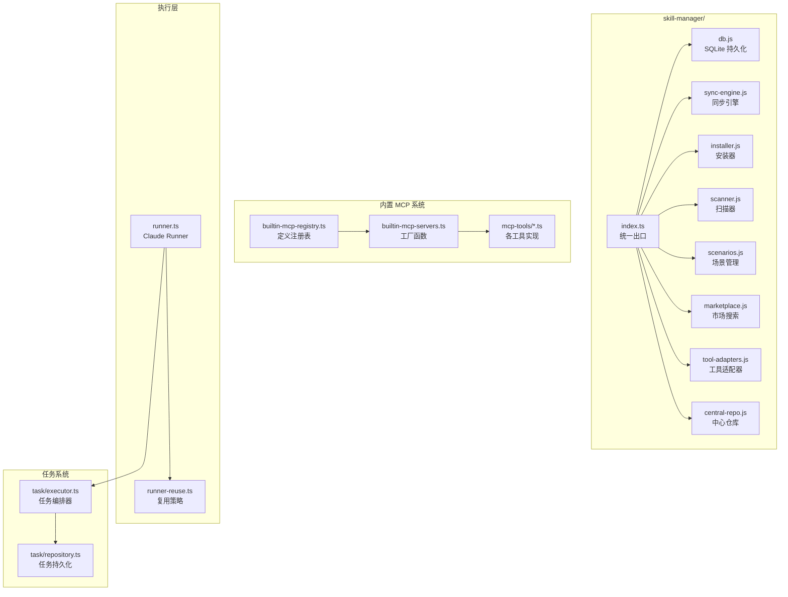
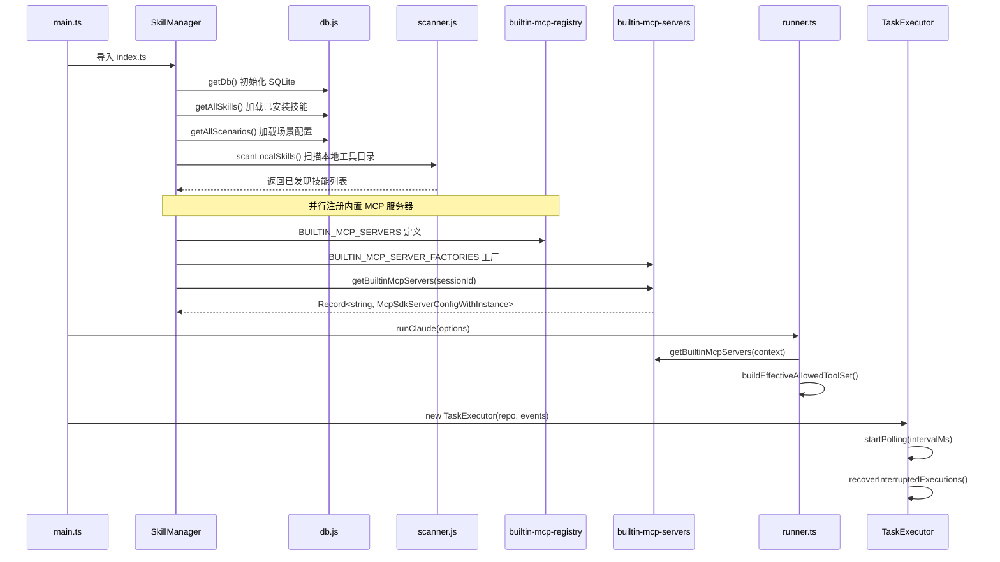

# 技能管理器架构

<cite>

**本文引用的文件**

- [src/electron/libs/skill-manager/index.ts](file://src/electron/libs/skill-manager/index.ts)
- [src/shared/builtin-mcp-registry.ts](file://src/shared/builtin-mcp-registry.ts#L1-L50)
- [src/electron/libs/builtin-mcp-servers.ts](file://src/electron/libs/builtin-mcp-servers.ts#L1-L67)
- [src/electron/libs/mcp-tools/README.md](file://src/electron/libs/mcp-tools/README.md)
- [src/electron/libs/mcp-tools/knowledge.ts](file://src/electron/libs/mcp-tools/knowledge.ts#L1-L413)
- [src/electron/libs/mcp-tools/plan.ts](file://src/electron/libs/mcp-tools/plan.ts#L1-L57)
- [src/electron/libs/mcp-tools/cron.ts](file://src/electron/libs/mcp-tools/cron.ts#L1-L221)
- [src/electron/libs/mcp-tools/browser.ts](file://src/electron/libs/mcp-tools/browser.ts#L1-L85)
- [src/electron/libs/mcp-tools/admin.ts](file://src/electron/libs/mcp-tools/admin.ts#L1-L75)
- [src/electron/libs/mcp-tools/tool-result.ts](file://src/electron/libs/mcp-tools/tool-result.ts#L1-L15)
- [src/electron/libs/runner.ts](file://src/electron/libs/runner.ts#L1-L105)
- [src/electron/libs/runner-reuse.ts](file://src/electron/libs/runner-reuse.ts#L1-L119)
- [src/electron/libs/system-prompt-presets.ts](file://src/electron/libs/system-prompt-presets.ts#L1-L44)
- [src/ui/components/settings/McpSettingsPage.tsx](file://src/ui/components/settings/McpSettingsPage.tsx#L1-L640)
- [test/electron/builtin-mcp-registry.test.ts](file://test/electron/builtin-mcp-registry.test.ts#L1-L50)
- [src/electron/libs/task/index.ts](file://src/electron/libs/task/index.ts)
- [src/electron/libs/task/executor.ts](file://src/electron/libs/task/executor.ts#L1-L117)

</cite>

---

## 目录

- [1. 核心职责](#1-核心职责)
- [2. 初始化流程图](#2-初始化流程图)
- [3. 技能配置数据结构](#3-技能配置数据结构)
- [4. 内置 MCP 工具体系](#4-内置-mcp-工具体系)
- [5. 执行与调度机制](#5-执行与调度机制)
- [6. 外部模块交互接口](#6-外部模块交互接口)
- [7. 状态流与故障排查](#7-状态流与故障排查)
- [8. Agent 改代码地图](#8-agent-改代码地图)

---

## 1. 核心职责

`src/electron/libs/skill-manager/index.ts` 是技能管理系统的统一出口模块，承担以下职责：

### 1.1 职责边界

| 职责 | 说明 | 关键符号 |
|------|------|----------|
| **技能持久化** | SQLite 数据库读写技能、场景、目标、标签 | `getDb`, `getAllSkills`, `insertSkill`, `deleteSkill` |
| **场景管理** | 技能场景的增删改查、默认场景切换 | `getAllScenarios`, `getActiveScenarioId`, `createScenario` |
| **技能同步** | 本地技能目录与中心仓库的同步 | `syncSkill`, `removeTarget`, `isTargetCurrent` |
| **技能安装** | 从本地目录或远程市场安装技能 | `installFromLocal`, `installSkillDirToDestination` |
| **工具适配器** | 统一管理内置/自定义工具路径 | `defaultToolAdapters`, `allToolAdapters`, `findAdapter` |
| **市场搜索** | 检索远程技能市场排行榜 | `fetchLeaderboard`, `searchSkillssh` |

### 1.2 模块依赖关系



**章节来源**: [src/electron/libs/skill-manager/index.ts#L4-L87](file://src/electron/libs/skill-manager/index.ts#L4-L87)

---

## 2. 初始化流程图

技能管理器的初始化分为三个阶段：**配置加载 → 技能注册 → 生命周期管理**。

### 2.1 启动时序



**图表来源**: [src/electron/libs/builtin-mcp-servers.ts#L45-L59](file://src/electron/libs/builtin-mcp-servers.ts#L45-L59)

### 2.2 内置 MCP 服务器注册时序

内置 MCP 服务器通过 `BUILTIN_MCP_SERVER_FACTORIES` 工厂模式注册，每个服务器根据上下文（`sessionId`、`cwd`）决定是否需要实例级状态：

```typescript
// 工厂注册表 (builtin-mcp-servers.ts#L23-L32)
export const BUILTIN_MCP_SERVER_FACTORIES: Record<BuiltinMcpServerName, BuiltinMcpFactory> = {
  "tech-cc-hub-browser": ({ sessionId }) => getBrowserMcpServer(sessionId),
  "tech-cc-hub-admin": () => getAdminMcpServer(),                    // 无状态
  "tech-cc-hub-design": ({ sessionId }) => getDesignMcpServer(sessionId),
  "tech-cc-hub-figma": () => getFigmaRestMcpServer(),                // 无状态
  "tech-cc-hub-cron": () => getCronMcpServer(),                       // 需要 setCronService 注入
  "tech-cc-hub-idea": () => getIdeaMcpServer(),
  "tech-cc-hub-plan": () => getPlanMcpServer(),
  "tech-cc-hub-knowledge": ({ cwd }) => getKnowledgeMcpServer(cwd), // 需要 workspaceRoot
};
```

### 2.3 CronService 注入边界

`tech-cc-hub-cron` 服务器依赖外部注入的 `CronService` 实例：

```typescript
// cron.ts#L26-L28
let cronServiceRef: CronService | null = null;

export function setCronService(service: CronService): void {
  cronServiceRef = service;
}
```

**章节来源**: [src/electron/libs/mcp-tools/cron.ts#L23-L28](file://src/electron/libs/mcp-tools/cron.ts#L23-L28)

---

## 3. 技能配置数据结构

### 3.1 核心类型定义

技能配置由以下数据结构组成：

#### 3.1.1 BuiltinMcpServerDefinition

```typescript
// builtin-mcp-registry.ts#L33-L50
export type BuiltinMcpServerDefinition = {
  name: BuiltinMcpServerName;           // 如 "tech-cc-hub-browser"
  type: "builtin";
  command: "builtin";
  args: string[];
  envKeys: string[];                    // 允许 AI 读取的环境变量前缀白名单
  enabled: boolean;
  iconKey: BuiltinMcpIconKey;
  description: string;
  iconClassName: string;
  highlights: string[];
  workflow?: Array<{ label: string; description: string }>;
  toolGroups: BuiltinMcpToolGroup[];
  promptHints?: string[];
};
```

#### 3.1.2 BuiltinMcpToolGroup

```typescript
// builtin-mcp-registry.ts#L27-L31
export type BuiltinMcpToolGroup = {
  title: string;                        // 工具组标题，如 "Navigation and page state"
  summary?: string;
  tools: BuiltinMcpToolInfo[];          // 工具列表
};

export type BuiltinMcpToolInfo = {
  name: string;                         // 工具名，如 "browser_open_page"
  description: string;
  tag?: string;
  intent?: string;
};
```

### 3.2 内置服务器清单

| 服务器名 | iconKey | 工具数 | 工具组 |
|----------|---------|--------|--------|
| `tech-cc-hub-browser` | `activity` | ~35 | 导航/读取/交互/截图/诊断 |
| `tech-cc-hub-admin` | `settings` | 1 | 运行配置 |
| `tech-cc-hub-design` | `sparkles` | 8 | 视觉还原 |
| `tech-cc-hub-figma` | `figma` | ~20 | Figma REST |
| `tech-cc-hub-cron` | `timer` | 3 | 定时任务 |
| `tech-cc-hub-idea` | `code` | 4 | IDE 交互 |
| `tech-cc-hub-plan` | `list` | 1 | 计划更新 |
| `tech-cc-hub-knowledge` | `activity` | 5 | 知识搜索 |

**章节来源**: [src/shared/builtin-mcp-registry.ts#L52-L227](file://src/shared/builtin-mcp-registry.ts#L52-L227)

### 3.3 工具名称常量

```typescript
// 各 mcp-tools 文件导出的工具名常量
export const BROWSER_TOOL_NAMES = [                             // browser.ts#L42-L85
  "http_ping", "diagnose_port", "bash_batch",
  "browser_open_page", "browser_close_page", "browser_get_state",
  "browser_navigate", "browser_reload", "browser_extract_page",
  "browser_capture_visible", "browser_save_screenshot", "browser_save_pdf",
  "browser_cookies", "browser_storage", "browser_console_logs",
  "browser_get_dom_stats", "browser_snapshot_interactive",
  "browser_click_element", "browser_dblclick_element", "browser_focus_element",
  "browser_hover_element", "browser_type_element", "browser_fill_element",
  "browser_select_element", "browser_check_element", "browser_uncheck_element",
  "browser_scroll_into_view", "browser_get_element", "browser_eval",
  "browser_press_key", "browser_key_down", "browser_key_up",
  "browser_keyboard_type", "browser_keyboard_insert_text",
  "browser_mouse", "browser_scroll_page", "browser_wait_for",
  "browser_query_nodes", "browser_inspect_styles", "browser_apply_styles",
  "browser_inspect_at_point", "browser_set_annotation_mode",
] as const;

export const ADMIN_TOOL_NAMES = ["set_global_runtime_config"] as const;  // admin.ts#L14

export const CRON_TOOL_NAMES = [                                // cron.ts#L14-L18
  "create_scheduled_task", "list_scheduled_tasks", "delete_scheduled_task",
] as const;

export const PLAN_TOOL_NAMES = ["update_plan"] as const;        // plan.ts#L9-L11

export const KNOWLEDGE_TOOL_NAMES = [                           // knowledge.ts#L20-L26
  "knowledge_search", "knowledge_read", "knowledge_explore",
  "knowledge_index", "memory_update",
] as const;
```

---

## 4. 内置 MCP 工具体系

### 4.1 设计原则

根据 `src/electron/libs/mcp-tools/README.md` 的设计原则：

1. **host 边界**：每个工具不直接操作 React UI，只通过 Host 接口访问主进程维护的状态
2. **摘要输出**：返回给模型的内容尽量是摘要、路径和结构化 JSON，避免塞入大图或密钥明文
3. **安全边界**：涉及写入磁盘或配置的工具必须有字段 allowlist 和体积上限

### 4.2 BrowserWorkbenchToolHost 接口

```typescript
// browser.ts#L88-L160
export type BrowserWorkbenchToolHost = {
  open: (sessionId: string, url: string) => BrowserWorkbenchState;
  close: (sessionId: string) => BrowserWorkbenchState;
  setBounds: (sessionId: string, bounds: BrowserWorkbenchBounds) => BrowserWorkbenchState;
  reload: (sessionId: string) => BrowserWorkbenchState;
  goBack: (sessionId: string) => BrowserWorkbenchState;
  goForward: (sessionId: string) => BrowserWorkbenchState;
  getState: (sessionId: string) => BrowserWorkbenchState;
  // ... 更多方法
};
```

### 4.3 工具结果序列化

所有 MCP 工具通过 `toTextToolResult` 或 `toPlainTextToolResult` 封装返回结果：

```typescript
// tool-result.ts#L3-L15
export function toTextToolResult(payload: unknown, isError = false): CallToolResult {
  return {
    isError,
    content: [{ type: "text" as const, text: JSON.stringify(payload, null, 2) }],
  };
}

export function toPlainTextToolResult(text: string, isError = false): CallToolResult {
  return {
    isError,
    content: [{ type: "text" as const, text }],
  };
}
```

**章节来源**: [src/electron/libs/mcp-tools/tool-result.ts#L3-L15](file://src/electron/libs/mcp-tools/tool-result.ts#L3-L15)

### 4.4 Admin 工具的安全限制

```typescript
// admin.ts#L19-L28
const MAX_ENV_KEY_LENGTH = 128;
const MAX_ENV_VALUE_LENGTH = 4096;
const MAX_ENV_ENTRIES = 120;
const MAX_SKILL_NAME_LENGTH = 128;
const MAX_SKILL_CREDENTIAL_ENTRIES = 80;
const MAX_DELETE_ITEMS = 80;
const MAX_SYSTEM_PROMPT_EXT_LINES = 40;
const MAX_SYSTEM_PROMPT_EXT_LINE_LENGTH = 2000;
const MAX_CHANNEL_FIELD_LENGTH = 4096;
```

环境变量 Key 过滤规则：

```typescript
// admin.ts#L79-L92
function isAllowedEnvKey(key: string): boolean {
  const normalized = key.trim();
  if (!normalized || normalized.length > MAX_ENV_KEY_LENGTH) {
    return false;
  }
  if (!/^[_A-Za-z][_A-Za-z0-9]*$/.test(normalized)) {
    return false;
  }
  // ANTHROPIC_* 是主运行时通道配置，禁止写入
  if (normalized.toUpperCase().startsWith("ANTHROPIC_")) {
    return false;
  }
  return true;
}
```

**章节来源**: [src/electron/libs/mcp-tools/admin.ts#L19-L92](file://src/electron/libs/mcp-tools/admin.ts#L19-L92)

---

## 5. 执行与调度机制

### 5.1 Runner 入口

`runner.ts` 是技能执行的入口点，提供以下接口：

```typescript
// runner.ts#L90-L105
export type RunnerOptions = {
  prompt: string;
  attachments?: PromptAttachment[];
  runtime?: RuntimeOverrides;
  session: Session;
  resumeSessionId?: string;
  onEvent: (event: ServerEvent) => void;
  onSessionUpdate?: (updates: Partial<Session>) => void;
};

export type RunnerHandle = {
  abort: () => void;
  appendPrompt: (prompt: string, attachments?: PromptAttachment[]) => Promise<void>;
  isClosed: () => boolean;
  reuseKey?: string;
};
```

### 5.2 Runner 复用策略

`runner-reuse.ts` 实现了 Runner 实例复用机制，通过比对关键参数决定是否可以复用：

```typescript
// runner-reuse.ts#L29-L50
export function buildRunnerReuseKey(input: RunnerReuseKeyInput): string {
  return JSON.stringify(buildRunnerReuseDescriptor(input));
}

export function canReuseRunner(existingKey: string | undefined, requestedKey: string): boolean {
  const existing = parseRunnerReuseKey(existingKey);
  const requested = parseRunnerReuseKey(requestedKey);
  if (!existing || !requested) {
    return false;
  }
  return (
    existing.cwd === requested.cwd &&
    existing.model === requested.model &&
    existing.permissionMode === requested.permissionMode &&
    existing.reasoningMode === requested.reasoningMode &&
    existing.outputFormat === requested.outputFormat &&
    existing.runSurface === requested.runSurface &&
    existing.agentId === requested.agentId &&
    existing.allowedTools === requested.allowedTools
  );
}
```

**章节来源**: [src/electron/libs/runner-reuse.ts#L29-L50](file://src/electron/libs/runner-reuse.ts#L29-L50)

### 5.3 内置工具集构建

```typescript
// runner.ts#L828-L850
function buildEffectiveAllowedToolSet(
  runtime: RuntimeOverrides | undefined,
  runtimeConfig: GlobalRuntimeConfig,
  serverEventEmitter: ServerEventEmitter | undefined,
  runnerHandle: RunnerHandle,
): Set<string> {
  // 1. 收集 always-allowed 内置工具
  // 2. 合并 runtime.allowedTools
  // 3. 合并 runtimeConfig 中的技能工具
  // 4. 过滤 SDK 内置 cron 工具（用 tech-cc-hub MCP cron 替代）
}
```

### 5.4 任务编排器

`TaskExecutor` 负责同步、自动执行、并发控制、重试、恢复和日志事件：

```typescript
// task/executor.ts#L89-L116
export class TaskExecutor {
  private repo: TaskRepository;
  private events: TaskExecutorEvents;
  private sessionStore?: SessionStore;
  private emitServerEvent?: (event: ServerEvent) => void;
  private workflow: TaskWorkflowConfig;
  private settings: TaskWorkflowSettings;
  private userDataPath?: string;
  private pollTimer: ReturnType<typeof setInterval> | null = null;
  private polling = false;
  private executingTasks = new Set<string>();
  private runningExecutions = new Map<string, RunningExecution>();
  private retryTimers = new Map<string, ReturnType<typeof setTimeout>>();

  constructor(repo: TaskRepository, events: TaskExecutorEvents = {}, options: TaskExecutorOptions = {}) {
    // 初始化 workflow 配置
    // 加载 task settings
  }
}
```

关键执行参数：

```typescript
// task/executor.ts#L84-L87
const INTERRUPTED_EXECUTION_ERROR = "应用已重启，上一轮任务执行进程已中断。";
const DEFAULT_EXECUTION_TIMEOUT_MS = 30 * 60 * 1000;  // 30 分钟超时
const DEFER_RETRY_MS = 5000;                           // 5 秒重试延迟
const MAX_ARTIFACTS = 80;                             // 最大产物数量
```

**章节来源**: [src/electron/libs/task/executor.ts#L84-L116](file://src/electron/libs/task/executor.ts#L84-L116)

---

## 6. 外部模块交互接口

### 6.1 与 UI 层交互

`McpSettingsPage.tsx` 是设置页面的入口组件，提供内置/外部 MCP 服务器的管理界面：

```typescript
// McpSettingsPage.tsx#L306-L345
export function McpSettingsPage({ e }: { e: McpSettingsPageProps }) {
  // 通过 IPC 与主进程通信
  const electron = getElectron();
  const [expandedServers, setExpandedServers] = useState<Set<string>>(new Set());

  useEffect(() => {
    // 订阅内置服务器元数据
    const unsubscribe = electron.on("mcp:builtin-server-meta", (evt, meta) => {
      setBuiltinServerMeta(meta);
    });
    return () => unsubscribe();
  }, []);

  // 切换展开状态
  function toggleExpand(serverName: string) {
    setExpandedServers((prev) => {
      const next = new Set(prev);
      if (next.has(serverName)) {
        next.delete(serverName);
      } else {
        next.add(serverName);
      }
      return next;
    });
  }
}
```

**章节来源**: [src/ui/components/settings/McpSettingsPage.tsx#L306-L345](file://src/ui/components/settings/McpSettingsPage.tsx#L306-L345)

### 6.2 与系统提示交互

`system-prompt-presets.ts` 提供系统提示增强模块，用于在运行时注入额外指令：

```typescript
// system-prompt-presets.ts#L12-L18
export function buildBrowserWorkbenchPromptAppend(): string {
  return [
    "BrowserView rule: for current-page browsing, scraping, debugging, annotations, screenshots, cookies, storage, console logs, URL checks, and DOM inspection, use the built-in tech-cc-hub browser MCP tools instead of external browser skills.",
    "Use focused browser helpers when possible: http_ping/diagnose_port for service checks...",
    // ...
  ].join("\n");
}

// system-prompt-presets.ts#L21-L26
export function buildAdminConfigPromptAppend(): string {
  return [
    "运行配置持久化规则：如需向 `agent-runtime.json` 写入通用配置（如 `env`、`skillCredentials`、`closeSidebarOnBrowserOpen`），应优先使用 `mcp__tech-cc-hub-admin__set_global_runtime_config` 工具。",
    "工具只做合规持久化更新，不应回显任何密钥明文；返回值按字段名统计变化即可。",
  ].join("\n");
}
```

### 6.3 IPC 通道清单

| 通道名 | 方向 | 用途 |
|--------|------|------|
| `mcp:builtin-server-meta` | 主进程 → 渲染层 | 推送内置服务器元数据 |
| `mcp:builtin-tool-groups` | 主进程 → 渲染层 | 推送工具组定义 |
| `mcp:toggle-server` | 渲染层 → 主进程 | 切换服务器启用状态 |
| `mcp:scan-external` | 渲染层 → 主进程 | 扫描外部 MCP 服务器 |

---

## 7. 状态流与故障排查

### 7.1 关键状态

| 状态 | 含义 | 判断依据 |
|------|------|----------|
| `cronMcpServer` | Cron MCP 服务器单例 | `cron.ts#L24` |
| `knowledgeMcpServers` | Knowledge 服务器 Map | `knowledge.ts#L30` |
| `planMcpServer` | Plan 服务器单例 | `plan.ts#L16` |
| `adminMcpServer` | Admin 服务器单例 | `admin.ts#L74` |

### 7.2 常见失败模式

#### 7.2.1 CronService 未注入

**症状**: `create_scheduled_task` 返回 `{"success":false,"error":"CronService 未初始化"}`

**排查步骤**:
1. 检查 `main.ts` 是否调用 `setCronService(cronServiceInstance)`
2. 确认 `cronServiceRef` 不为 `null`

```typescript
// cron.ts#L97-L99
export function getCronMcpServer(): McpSdkServerConfigWithInstance {
  if (cronMcpServer) {
    return cronMcpServer;
  }
  // ...
}
```

#### 7.2.2 Knowledge Engine 未启用

**症状**: `knowledge_search` 报错 `sqlite-vec 扩展不可用`

**排查步骤**:
1. 检查 `assertEmbeddingConfigured()` 是否通过
2. 确认 `repo.isVectorStoreReady()` 返回 `true`

```typescript
// knowledge.ts#L107-L109
if (!repo.isVectorStoreReady()) {
  repo.close();
  throw new Error("Knowledge Engine 未启用：sqlite-vec 扩展不可用。");
}
```

#### 7.2.3 Runner 复用失败

**症状**: 每次请求都创建新的 Runner 实例

**排查步骤**:
1. 检查 `canReuseRunner(existingKey, requestedKey)` 返回值
2. 确认 `buildRunnerReuseDescriptor` 的关键字段一致

**章节来源**: [src/electron/libs/mcp-tools/cron.ts#L97-L109](file://src/electron/libs/mcp-tools/cron.ts#L97-L109)

---

## 8. Agent 改代码地图

### 8.1 先读文件清单

| 优先级 | 文件 | 读哪几行 | 原因 |
|--------|------|----------|------|
| ★★★ | `src/shared/builtin-mcp-registry.ts` | L1-L50, L52-L227 | 新增/修改内置 MCP 服务器定义 |
| ★★★ | `src/electron/libs/builtin-mcp-servers.ts` | L1-L67 | 注册新服务器到工厂 |
| ★★★ | `src/electron/libs/mcp-tools/*.ts` | 工具实现文件 | 添加新工具或修改逻辑 |
| ★★☆ | `src/electron/libs/runner.ts` | L90-L160 | 修改工具集构建逻辑 |
| ★★☆ | `src/electron/libs/task/executor.ts` | L84-L300 | 修改任务编排器行为 |
| ★☆☆ | `src/ui/components/settings/McpSettingsPage.tsx` | L420-L550 | UI 展示逻辑变更 |

### 8.2 关键符号速查

#### 8.2.1 新增内置 MCP 服务器

```typescript
// 1. 在 builtin-mcp-registry.ts 添加定义
export type BuiltinMcpServerName = "tech-cc-hub-new-server" | ...;

// 2. 在 BUILTIN_MCP_SERVERS 数组添加条目
{
  name: "tech-cc-hub-new-server",
  type: "builtin",
  command: "builtin",
  args: [],
  envKeys: [],
  enabled: true,
  iconKey: "sparkles",
  description: "...",
  iconClassName: "...",
  highlights: [...],
  toolGroups: [...],
};

// 3. 在 builtin-mcp-servers.ts 添加工厂
export const BUILTIN_MCP_SERVER_FACTORIES: Record<BuiltinMcpServerName, BuiltinMcpFactory> = {
  "tech-cc-hub-new-server": ({ sessionId }) => getNewMcpServer(sessionId),
};

// 4. 添加 BUILTIN_MCP_TOOL_NAMES 映射
export const BUILTIN_MCP_TOOL_NAMES: Record<BuiltinMcpServerName, readonly string[]> = {
  "tech-cc-hub-new-server": NEW_TOOL_NAMES,
};
```

#### 8.2.2 新增 MCP 工具

```typescript
// mcp-tools/new-tool.ts
import {
  createSdkMcpServer,
  tool,
  type McpSdkServerConfigWithInstance,
} from "@anthropic-ai/claude-agent-sdk";
import { z } from "zod";
import { toTextToolResult } from "./tool-result.js";

export const NEW_TOOL_NAMES = ["new_tool_action"] as const;

const NEW_MCP_SERVER_NAME = "tech-cc-hub-new-server";
const NEW_MCP_SERVER_VERSION = "1.0.0";

export function getNewMcpServer(sessionId: string): McpSdkServerConfigWithInstance {
  const handler = tool(
    "new_tool_action",
    "工具描述...",
    { /* input schema */ },
    async (input) => {
      try {
        // 工具逻辑
        return toTextToolResult({ success: true, data: "..." });
      } catch (error) {
        return toTextToolResult({
          success: false,
          error: error instanceof Error ? error.message : String(error),
        }, true);
      }
    },
  );

  return createSdkMcpServer({
    name: NEW_MCP_SERVER_NAME,
    version: NEW_MCP_SERVER_VERSION,
    tools: [handler],
  });
}
```

### 8.3 修改入口

| 修改目标 | 入口文件 | 关键符号 |
|----------|----------|----------|
| 添加新内置服务器 | `builtin-mcp-registry.ts` | `BUILTIN_MCP_SERVERS` 数组 |
| 注册新服务器工厂 | `builtin-mcp-servers.ts` | `BUILTIN_MCP_SERVER_FACTORIES` |
| 添加新工具 | `mcp-tools/new-tool.ts` | 新建文件 + `BUILTIN_MCP_TOOL_NAMES` |
| 修改 Runner 复用策略 | `runner-reuse.ts` | `canReuseRunner`, `buildRunnerReuseDescriptor` |
| 修改工具集构建 | `runner.ts` | `buildEffectiveAllowedToolSet` |
| 修改任务编排 | `task/executor.ts` | `TaskExecutor` 类 |

### 8.4 验证命令

```bash
# 单元测试
pnpm test src/shared/builtin-mcp-registry.test.ts

# 集成测试（内置 MCP 工具）
pnpm test src/electron/libs/mcp-tools/

# 类型检查
pnpm tsc --noEmit

# 构建验证
pnpm build
```

### 8.5 常见回归风险

| 风险点 | 触发条件 | 检查点 |
|--------|----------|--------|
| 工具名冲突 | 新工具名已在其他服务器注册 | 运行 `test/builtin-mcp-registry.test.ts` 确认 `uniqueToolNames` |
| Runner 复用失效 | 修改 `RunnerReuseKeyInput` 结构 | 确认 `canReuseRunner` 返回预期值 |
| CronService 空指针 | `setCronService` 未在 main.ts 调用 | 确认 `cronServiceRef !== null` |
| Knowledge Engine 崩溃 | `sqlite-vec` 未加载 | 检查 `isVectorStoreReady()` |
| UI 展示不一致 | 修改 `BUILTIN_MCP_SERVERS` 但未更新 UI | 检查 `McpSettingsPage.tsx` 的 `BUILTIN_TOOL_GROUPS` |

### 8.6 测试入口

```typescript
// test/electron/builtin-mcp-registry.test.ts
test("built-in MCP registry drives the settings list", () => {
  const serverInfos = listBuiltinMcpServerInfos();
  const registryNames = BUILTIN_MCP_SERVERS.map((server) => server.name);
  assert.deepEqual(serverInfos.map((server) => server.name), registryNames);
});

test("built-in MCP registry tool names stay unique", () => {
  const toolNames = listBuiltinMcpToolNames();
  const uniqueToolNames = new Set(toolNames);
  assert.equal(uniqueToolNames.size, toolNames.length);
});
```

**章节来源**: [test/electron/builtin-mcp-registry.test.ts#L11-L41](file://test/electron/builtin-mcp-registry.test.ts#L11-L41)

---

## 附录：工具完整清单

| 服务器 | 工具名 | 用途 |
|--------|--------|------|
| tech-cc-hub-browser | `http_ping` | URL 健康检测 |
| tech-cc-hub-browser | `diagnose_port` | Windows 端口诊断 |
| tech-cc-hub-browser | `bash_batch` | 受限 shell 命令 |
| tech-cc-hub-browser | `browser_open_page` | 打开 BrowserView URL |
| tech-cc-hub-browser | `browser_close_page` | 关闭页面 |
| tech-cc-hub-browser | `browser_get_state` | 读取页面状态 |
| tech-cc-hub-browser | `browser_navigate` | 前进/后退 |
| tech-cc-hub-browser | `browser_reload` | 刷新页面 |
| tech-cc-hub-browser | `browser_extract_page` | 提取页面摘要 |
| tech-cc-hub-browser | `browser_capture_visible` | 截图 |
| tech-cc-hub-browser | `browser_save_screenshot` | 保存截图文件 |
| tech-cc-hub-browser | `browser_save_pdf` | 保存 PDF |
| tech