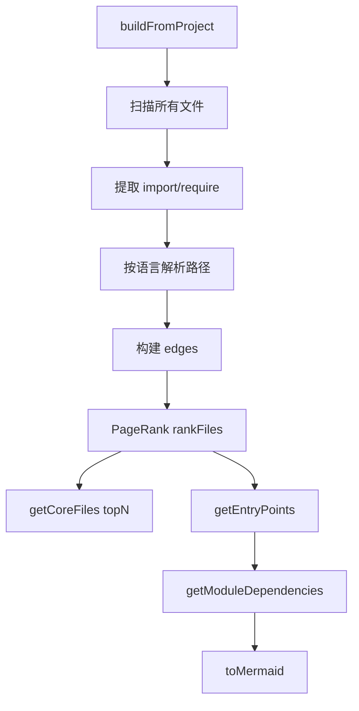
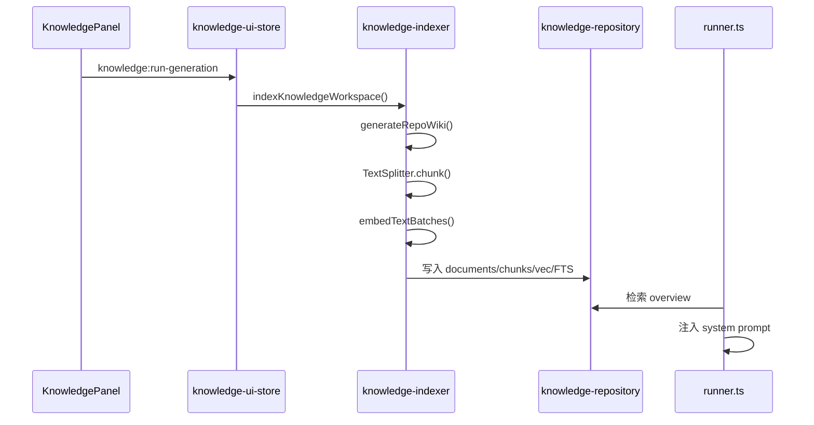
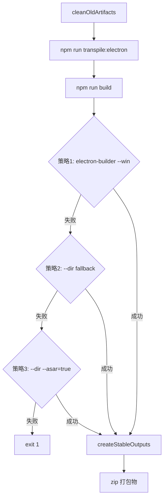
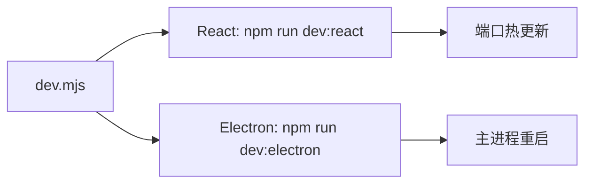
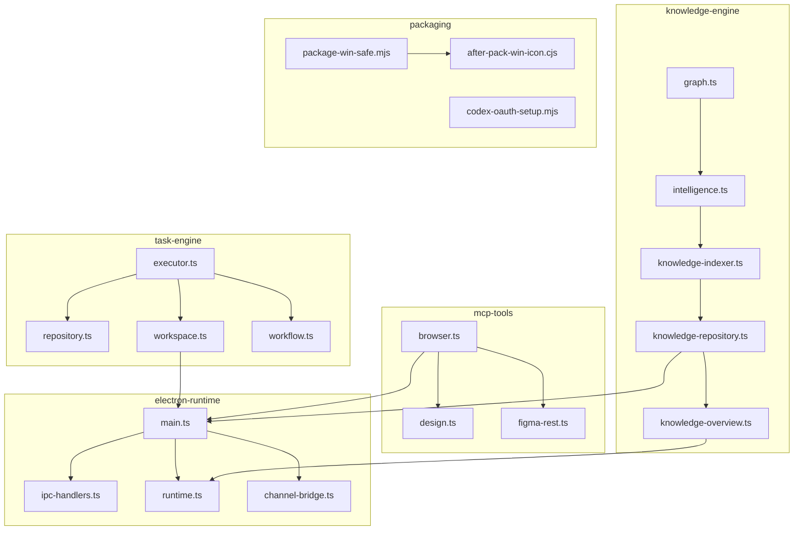

# 核心模块规格

**文档标识**: core-module-specs
**适用版本**: tech-cc-hub (全版本)
**最后更新**: 基于代码证据地图 2024

---

<cite>
**本文引用的文件**

- [src/electron/main.ts](file://src/electron/main.ts)
- [src/electron/libs/knowledge/repowiki/graph.ts](file://src/electron/libs/knowledge/repowiki/graph.ts)
- [src/electron/libs/knowledge/repowiki/intelligence.ts](file://src/electron/libs/knowledge/repowiki/intelligence.ts)
- [src/electron/libs/git/README.md](file://src/electron/libs/git/README.md)
- [src/electron/libs/mcp-tools/README.md](file://src/electron/libs/mcp-tools/README.md)
- [src/electron/libs/task/README.md](file://src/electron/libs/task/README.md)
- [scripts/package-win-safe.mjs](file://scripts/package-win-safe.mjs)
- [scripts/knowledge/run-repowiki.py](file://scripts/knowledge/run-repowiki.py)
- [scripts/after-pack-win-icon.cjs](file://scripts/after-pack-win-icon.cjs)
- [scripts/codex-oauth-setup.mjs](file://scripts/codex-oauth-setup.mjs)
- [scripts/dev-electron.mjs](file://scripts/dev-electron.mjs)
- [scripts/dev.mjs](file://scripts/dev.mjs)
- [test/electron/image-preprocessor-core.test.ts](file://test/electron/image-preprocessor-core.test.ts)
- [test/electron/pathResolverCore.test.ts](file://test/electron/pathResolverCore.test.ts)
</cite>

---

## 目录

- [1. Electron 主进程入口 (electron-runtime)](#1-electron-主进程入口-electron-runtime)
- [2. 知识库引擎 (knowledge-engine)](#2-知识库引擎-knowledge-engine)
- [3. MCP 工具面 (mcp-tools)](#3-mcp-工具面-mcp-tools)
- [4. 任务编排引擎 (task-engine)](#4-任务编排引擎-task-engine)
- [5. Git 工作台 (git-workbench)](#5-git-工作台-git-workbench)
- [6. 打包与构建 (packaging)](#6-打包与构建-packaging)
- [7. 开发环境 (development)](#7-开发环境-development)
- [8. 测试入口 (testing)](#8-测试入口-testing)
- [9. Agent 改代码地图](#9-agent-改代码地图)

---

## 1. Electron 主进程入口 (electron-runtime)

### 1.1 职责边界

`src/electron/main.ts` 是 Electron 主进程的唯一入口，负责：

- 窗口创建与管理 (`BrowserWindow`)
- IPC handler 注册（会话、MCP、预览、知识库、插件）
- 系统托盘、右键菜单、快捷键注册
- OAuth 流程编排（Figma、Codex）
- 插件安装与权限管理（Open Computer Use）

**不属于本模块**：UI 渲染逻辑、业务状态管理（由 `src/ui/store/` 处理）。

[章节来源](file://src/electron/main.ts#L1-L50)

### 1.2 关键 IPC Handler

| Channel | Handler 函数 | 职责 |
|---------|-------------|------|
| `sessions:list` | `ipc-handlers.ts` | 列出持久化会话 |
| `plugins:getOpenComputerUseStatus` | `getOpenComputerUsePluginStatus`@298 | 检查 OCU 状态 |
| `plugins:installOpenComputerUse` | `installOpenComputerUsePlugin`@252 | 安装 OCU |
| `plugins:connectFigmaOfficial` | `connectFigmaDesktopOfficialPlugin`@471 | 接入 Figma MCP |
| `preview-list-directory` | `preview-list-directory` | 目录预览（上限 300 条） |
| `knowledge:run-generation` | `knowledge-ui-store` | 触发知识库生成 |

[章节来源](file://src/electron/main.ts#L119-L130)

### 1.3 数据结构

```typescript
type OpenComputerUsePluginStatus = PluginUpdateSummary & {
  installed: boolean;
  connected: boolean;
  version?: string;
  permissions: OpenComputerUsePermissionStatus;
};

type OpenComputerUsePermissionStatus = {
  platform: NodeJS.Platform;
  required: boolean;
  accessibility: "granted" | "missing" | "not-required" | "unknown";
  screenRecording: "granted" | "missing" | "not-required" | "unknown";
  needsUserAction: boolean;
  openedSystemSettings: boolean;
};
```

[章节来源](file://src/electron/main.ts#L168-L179)

### 1.4 常见改造路径

**添加新 IPC Channel**：
```typescript
// 1. 在 main.ts 定义 handler
ipcMainHandle('my-domain:action', async (event, args) => {
  return await myHandler(args);
});

// 2. 在 renderer 端用 window.electron.invoke('my-domain:action', args) 调用
```

**改造插件安装流程**：
参考 `installOpenComputerUsePlugin`@252，增加 pre-check → install → post-connect 三阶段。

### 1.5 失败模式与排障

| 症状 | 可能原因 | 排查命令 |
|------|----------|----------|
| OCU 状态显示 "missing" | macOS 权限未授权 | `systemPreferences.isTrustedAccessibilityClient()` |
| 插件安装超时 | npm 网络问题/代理 | 检查 `runExternalCli` 超时参数 |
| Figma MCP 连接失败 | PAT 无效或过期 | 验证 `fetchFigmaPatProfile`@529 返回 |

[章节来源](file://src/electron/main.ts#L186-L250)

---

## 2. 知识库引擎 (knowledge-engine)

### 2.1 模块组成

| 文件 | 职责 |
|------|------|
| `repowiki/graph.ts` | 依赖图构建、PageRank 排序、入度入口点识别 |
| `repowiki/intelligence.ts` | 提取代码情报（scripts、IPC、信号、MCP 工具） |
| `knowledge-repository.ts` | SQLite/FTS5/vec 存储与检索 |
| `knowledge-indexer.ts` | Markdown 生成、切块、embedding 写入 |
| `knowledge-overview.ts` | 聊天 system prompt 注入 |

[章节来源](file://src/electron/libs/knowledge/repowiki/graph.ts#L1-L32)

### 2.2 依赖图构建流程



**关键符号**：

- `RepoWikiDependencyGraph.buildFromProject`@38：静态工厂方法
- `graph.rankFiles()`@66：返回 `Array<[path, score]>` 排序数组
- `graph.getEntryPoints()`@99：入度 ≤1 的节点视为入口
- `graph.getModuleDependencies()`@111：跨模块依赖 Map

[图表来源](file://src/electron/libs/knowledge/repowiki/graph.ts#L38-L124)

### 2.3 模块命名规则

`getModuleName`@185 硬编码路径前缀映射：

```typescript
// 高优先级规则
if (path === "src/electron/main.ts") return "electron-runtime";
if (path.startsWith("src/electron/libs/knowledge/")) return "knowledge-engine";
if (path.startsWith("src/electron/libs/mcp-tools/")) return "mcp-tools";
if (path.startsWith("src/electron/libs/task/")) return "task-engine";
if (path.startsWith("src/electron/libs/git/")) return "git-workbench";

// 兜底规则：取 src/{first}/ 的 first
```

[章节来源](file://src/electron/libs/knowledge/repowiki/graph.ts#L186-L213)

### 2.4 代码情报提取

`buildRepoWikiIntelligence`@50 产出结构：

```typescript
const intelligence = {
  scripts: RepoWikiScriptInfo[],      // npm scripts（取前 28 个）
  dependencies: RepoWikiDependencyInfo[], // 关键依赖（前 36 个）
  ipcChannels: RepoWikiFileSignal[],   // ipcMain.handle（取前 80 个）
  uiIpcCalls: RepoWikiFileSignal[],   // renderer 调用（取前 80 个）
  mcpTools: RepoWikiFileSignal[],     // MCP 工具（取前 120 个）
  databaseTables: RepoWikiFileSignal[], // SQLite 表（取前 80 个）
  highValueFiles: RepoWikiHighValueFile[], // 高价值文件（取前 140 个）
  runtimeFlows: RepoWikiRuntimeFlow[], // 关键运行时流程
  agentQuestions: RepoWikiAgentQuestion[], // 预设问答
};
```

[章节来源](file://src/electron/libs/knowledge/repowiki/intelligence.ts#L50-L92)

### 2.5 运行时流程



[图表来源](file://src/electron/libs/knowledge/repowiki/intelligence.ts#L254-L274)

### 2.6 常见改造路径

**添加新情报类别**：
在 `buildRepoWikiIntelligence` 中增加 filter 逻辑，并在 `formatRepoWikiIntelligenceForPrompt` 中格式化输出。

**自定义模块映射**：
修改 `getModuleName`@185，增加路径前缀判断。

**扩展 Mermaid 输出**：
在 `toMermaid`@126 中修改 `graph TD` 定义。

---

## 3. MCP 工具面 (mcp-tools)

### 3.1 目录结构

```
src/electron/libs/mcp-tools/
├── browser.ts      # BrowserView 导航、截图、DOM 查询
├── design.ts       # 截图语义分析、对比、热点区域
├── figma-rest.ts   # Figma PAT 只读工具
├── admin.ts        # 全局运行参数写入
└── cron.ts         # Cron 调度能力
```

[章节来源](file://src/electron/libs/mcp-tools/README.md#L1-L23)

### 3.2 设计工具触发时机

| 场景 | 首选工具 |
|------|----------|
| 用户给截图要求生成 UI | `design_inspect_image` |
| 已有候选图需对比 | `design_compare_screenshots` |
| 页面和参考图不一致 | `design_compare_screenshots` + `ignoreRegions` |
| 恢复历史证据 | `design_list_artifacts` → `design_read_comparison_report` |

**参数说明**：

- `ignoreRegions`: 动态区域（时间、头像、动画帧）用此参数排除
- `maxDifferenceRatio`: 验收结论阈值
- `ignoreAntialiasing`: 文字抗锯齿噪声多时开启

[章节来源](file://src/electron/libs/mcp-tools/README.md#L16-L22)

### 3.3 审阅要点

- 工具不直接操作 React UI，只返回摘要/路径/JSON
- 涉及磁盘写入的工具必须有 `allowlist` 和体积上限
- 暴露的 tool name 须与 `src/shared/builtin-mcp-registry.ts` 注册一致

[章节来源](file://src/electron/libs/mcp-tools/README.md#L10-L14)

### 3.4 Browser 工具能力

| 工具 | 能力 |
|------|------|
| `browser_navigate` | 导航 URL |
| `browser_screenshot` | 截图 + 摘要 |
| `browser_query_dom` | DOM 查询 |
| `browser_check_styles` | 样式检查 |
| `browser_annotation_mode` | 标注模式 |

[章节来源](file://src/electron/libs/mcp-tools/README.md#L5)

---

## 4. 任务编排引擎 (task-engine)

### 4.1 模块边界

```
src/electron/libs/task/
├── types.ts           # 领域类型、IPC payload
├── provider-registry.ts # Provider 注册表
├── providers/         # 外部任务源适配器（如 Lark）
├── repository.ts      # SQLite schema、状态持久化
├── workflow.ts        # workflow 配置、轮询、重试参数
├── workspace.ts       # 独立 workspace 创建
├── executor.ts        # 编排器：同步、自动执行、并发控制
└── index.ts          # 对外统一出口
```

[章节来源](file://src/electron/libs/task/README.md#L1-L14)

### 4.2 执行器职责

`executor.ts` 是唯一调度入口：

- 任务同步与自动执行
- 并发控制（避免多个任务同时操作同一资源）
- 重试与 stall 检测
- 恢复（crash 后从 repository 恢复状态）
- 日志事件触发

[章节来源](file://src/electron/libs/task/README.md#L20)

### 4.3 运行原则

| 原则 | 说明 |
|------|------|
| Provider 只做映射 | `ExternalTask` 转换，不直接改 UI |
| Repository 只持久化 | 不启动 runner |
| Executor 唯一调度 | 所有执行路径必须经过 |
| 独立 workspace | 任务间隔离避免污染 |

[章节来源](file://src/electron/libs/task/README.md#L16-L21)

### 4.4 数据持久化

Repository 负责 SQLite schema 管理，包含：
- 任务状态表
- 执行记录表
- 日志表

**注意**：旧任务库数据允许丢弃，schema 变化优先保持代码简单。

[章节来源](file://src/electron/libs/task/README.md#L12)

---

## 5. Git 工作台 (git-workbench)

### 5.1 模块边界

```
src/electron/libs/git/
├── types.ts         # Git 领域类型、IPC payload
├── errors.ts        # Git 错误归一化
├── service.ts       # 唯一 Git 操作入口
├── history.ts       # commit history parser
├── graph.ts         # lightweight graph lane
├── operation-log.ts # 高影响操作日志
├── ipc.ts           # Electron IPC handler 注册
└── index.ts         # 对外统一出口
```

[章节来源](file://src/electron/libs/git/README.md#L1-L14)

### 5.2 第一版允许的操作

| 操作 | 说明 |
|------|------|
| status / diff | 工作区状态和差异 |
| stage / unstage | 暂存区管理 |
| commit | 提交 |
| push | 普通推送 |
| create / checkout branch | 分支管理 |
| stash save / apply / drop | 暂存管理 |
| recent history / graph | 历史和图查看 |

[章节来源](file://src/electron/libs/git/README.md#L16-L24)

### 5.3 第一版禁止的操作

- reset、rebase、cherry-pick
- force push、amend、squash、interactive rebase

**原因**：这些操作风险高，且与"安全操作确认"规范冲突。

[章节来源](file://src/electron/libs/git/README.md#L26-L34)

### 5.4 IPC 调用限制

Renderer 只能通过 IPC 调用，不直接执行 git 命令。
所有高影响操作需记录到 `operation-log.ts`。

[章节来源](file://src/electron/libs/git/README.md#L3)

---

## 6. 打包与构建 (packaging)

### 6.1 Windows 打包流程



[图表来源](file://scripts/package-win-safe.mjs#L139-L182)

### 6.2 关键函数

| 函数 | 行号 | 说明 |
|------|------|------|
| `cleanOldArtifacts` | 33 | 清理旧打包物（保留 win-unpacked 用于 fallback） |
| `findExeArtifact` | 64 | 查找 `tech-cc-hub*.exe` |
| `hasUnpackedArtifact` | 71 | 检查 `dist/win-unpacked` |
| `makeZipFromDir` | 80 | 使用 tar 创建 zip |
| `createStableOutputs` | 85 | 生成带日期戳的稳定产物 |
| `runWithFallback` | 120 | 三策略 fallback 执行 |

[章节来源](file://scripts/package-win-safe.mjs#L33-L136)

### 6.3 产物命名

| 产物 | 命名模式 |
|------|----------|
| 稳定 EXE | `tech-cc-hub-win-x64-{YYYYMMDD}.exe` |
| unpacked zip | `tech-cc-hub-win-unpacked-{YYYYMMDD}.zip` |
| portable zip | `tech-cc-hub-win-x64-{YYYYMMDD}.zip` |

[章节来源](file://scripts/package-win-safe.mjs#L86-L108)

### 6.4 Windows 图标注入

`scripts/after-pack-win-icon.cjs` 是 electron-builder afterPack hook：

```javascript
// 注入时机：打包完成后、签名前
// 目标：tech-cc-hub.exe / electron.exe
// 工具：rcedit.exe --set-icon
```

候选 EXE 路径优先级：`${productFilename}.exe` → `tech-cc-hub.exe` → `electron.exe`

[章节来源](file://scripts/after-pack-win-icon.cjs#L1-L40)

### 6.5 Codex OAuth 配置

`scripts/codex-oauth-setup.mjs` 负责：

1. 读取 `~/.codex/auth.json` 或环境变量
2. 解析 JWT payload 提取 `account_id`
3. 转换为 `api-config.json` profile 格式
4. 写入 `api-config.json`（跨平台路径适配）

**关键字段**：
- `baseURL`: `https://chatgpt.com`
- `provider`: `codex`
- `model`: `gpt-5.5`（默认）

[章节来源](file://scripts/codex-oauth-setup.mjs#L1-L100)

---

## 7. 开发环境 (development)

### 7.1 开发启动流程

`scripts/dev.mjs` 同时启动 React 和 Electron：



[图表来源](file://scripts/dev.mjs#L1-L65)

### 7.2 Electron 开发特殊处理

`scripts/dev-electron.mjs` 完成：

1. **Mac 代码签名**：检查或准备 `Electron.app` 的 `ELECTRON_OVERRIDE_DIST_PATH`
2. **清理扩展属性**：`xattr -cr` 移除 quarantine
3. **签名验证**：`codesign --verify --deep`

**缓存路径**：
```
~/Library/Caches/tech-cc-hub/electron-{version}-dist/Electron.app
```

[章节来源](file://scripts/dev-electron.mjs#L55-L108)

### 7.3 关键开发命令

| 命令 | 脚本 | 说明 |
|------|------|------|
| `npm run dev` | `dev.mjs` | 并行启动 React + Electron |
| `npm run dev:electron` | `dev-electron.mjs` | 单独 Electron |
| `npm run transpile:electron` | - | 转译 Electron TS |
| `npm run build` | - | Vite 生产构建 |

[章节来源](file://scripts/dev.mjs#L63-L64)

### 7.4 进程管理

- SIGINT / SIGTERM 触发 `stopAll`
- 子进程非零退出码导致整体退出
- Windows 使用 `cmd.exe /c` 包装

[章节来源](file://scripts/dev.mjs#L4-L58)

---

## 8. 测试入口 (testing)

### 8.1 现有测试文件

| 测试文件 | 测试目标 |
|----------|----------|
| `test/electron/image-preprocessor-core.test.ts` | 图片预处理核心逻辑 |
| `test/electron/pathResolverCore.test.ts` | 路径解析生产路径隔离 |

[章节来源](file://test/electron/image-preprocessor-core.test.ts#L1-L41)

### 8.2 图片预处理测试

测试用例：图片模型返回空 summary 时，`preprocessImageAttachmentsCore` 仍保留附件并降级为文件名描述。

```typescript
// 关键断言
assert.equal(result.success, true);
assert.equal(result.attachments.length, 1);
assert.equal(result.attachments[0].data, "file:///D:/tmp/image.png");
assert.match(result.attachments[0].summaryText ?? "", /not return a usable summary/i);
```

[章节来源](file://test/electron/image-preprocessor-core.test.ts#L33-L39)

### 8.3 路径解析测试

验证生产环境下资源路径在应用根目录下：

```typescript
const resolved = resolveAppAssetPath("D:\\tool\\tech-cc-hub", "dist-electron/electron/preload.cjs");
// 期望：D:\\tool\\tech-cc-hub\dist-electron\electron\preload.cjs
```

[章节来源](file://test/electron/pathResolverCore.test.ts#L6-L9)

### 8.4 运行测试

```bash
node --test test/electron/*.test.ts
```

---

## 9. Agent 改代码地图

### 9.1 Electron 主进程 (electron-runtime)

**先读文件**：
- `src/electron/main.ts`（2917 行，主入口）
- `src/electron/ipc-handlers.ts`（IPC 编排）

**关键符号**：
- `ipcMainHandle` / `ipcMain.handle` 注册 channel
- `BrowserWindow` 创建窗口
- `systemPreferences` 获取 macOS 权限
- `prepareOpenComputerUsePermissions`@187
- `connectOpenComputerUsePlugin`@408

**修改入口**：
- 添加新 IPC：找同类 channel，在 `main` 函数中追加 `ipcMainHandle`
- 改造插件流程：找到 `install*Plugin` 函数修改三阶段逻辑

**验证命令**：
```bash
npm run dev:electron
# 检查 DevTools Console 无 Uncaught 错误
```

**常见回归风险**：
- 忘记在 `cleanupAllSessions` 中清理新资源
- IPC channel 命名冲突

### 9.2 知识库引擎 (knowledge-engine)

**先读文件**：
- `src/electron/libs/knowledge/repowiki/graph.ts`
- `src/electron/libs/knowledge/repowiki/intelligence.ts`

**关键符号**：
- `RepoWikiDependencyGraph.buildFromProject`@38
- `graph.rankFiles()`@66（PageRank 排序）
- `getModuleName`@185（模块映射硬编码）
- `buildRepoWikiIntelligence`@50

**修改入口**：
- 扩展模块映射：修改 `getModuleName`
- 调整信号采集：修改 `IMPORTANT_DEPENDENCIES`@13 或 `HIGH_VALUE_PATHS`@32

**验证命令**：
```bash
# 本地生成测试知识库
python scripts/knowledge/run-repowiki.py --help
```

**常见回归风险**：
- 修改 `rankFiles` 影响其他模块的依赖排序
- 新增信号类别但未在 `formatRepoWikiIntelligenceForPrompt` 中格式化

### 9.3 MCP 工具 (mcp-tools)

**先读文件**：
- `src/electron/libs/mcp-tools/README.md`
- 对应工具文件（如 `browser.ts`）

**关键工具名**：
- `design_inspect_image`、`design_compare_screenshots`
- `browser_navigate`、`browser_screenshot`
- `figma_rest_*` 系列

**修改入口**：
- 新增工具：在工具文件中实现，导出函数注册到 registry
- 修改参数：更新 README 的参数说明表

**验证命令**：
```bash
# 检查工具暴露
grep -r "mcp_tool" src/electron/libs/mcp-tools/
```

**常见回归风险**：
- 工具返回大图或密钥明文
- allowlist 遗漏新路径

### 9.4 任务引擎 (task-engine)

**先读文件**：
- `src/electron/libs/task/executor.ts`
- `src/electron/libs/task/repository.ts`

**关键符号**：
- `CronJobExecutor`、`CronBusyGuard`
- `initializeTaskExecutor`（IPC 初始化入口）
- SQLite schema 表名

**修改入口**：
- 新增 Provider：在 `providers/` 目录创建适配器
- 修改调度逻辑：在 `executor.ts` 调整重试/并发控制

**验证命令**：
```bash
# 任务执行日志（查看 electron 日志）
tail -f ~/Library/Logs/tech-cc-hub/main.log
```

**常见回归风险**：
- 并发控制失效导致任务重复执行
- crash 后恢复状态不一致

### 9.5 打包脚本 (packaging)

**先读文件**：
- `scripts/package-win-safe.mjs`
- `scripts/after-pack-win-icon.cjs`

**关键符号**：
- `cleanOldArtifacts`@33
- `findExeArtifact`@64
- `runWithFallback`@120（三策略 fallback）

**修改入口**：
- 增加打包策略：在 `strategies` 数组追加
- 修改产物命名：调整 `createStableOutputs`@85

**验证命令**：
```bash
node scripts/package-win-safe.mjs
# 检查 dist/ 目录产物
ls -la dist/*.exe dist/*.zip
```

**常见回归风险**：
- fallback 策略顺序错误导致产物命名不一致
- 图标注入在签名后执行导致图标丢失

---

## 附录：模块依赖关系



[图表来源](file://src/electron/libs/knowledge/repowiki/graph.ts#L126-L141)（依赖图生成逻辑）

---

**文档版本**: 1.0
**维护者**: tech-cc-hub 工程团队
**下次审查**: 每次核心模块变更后
