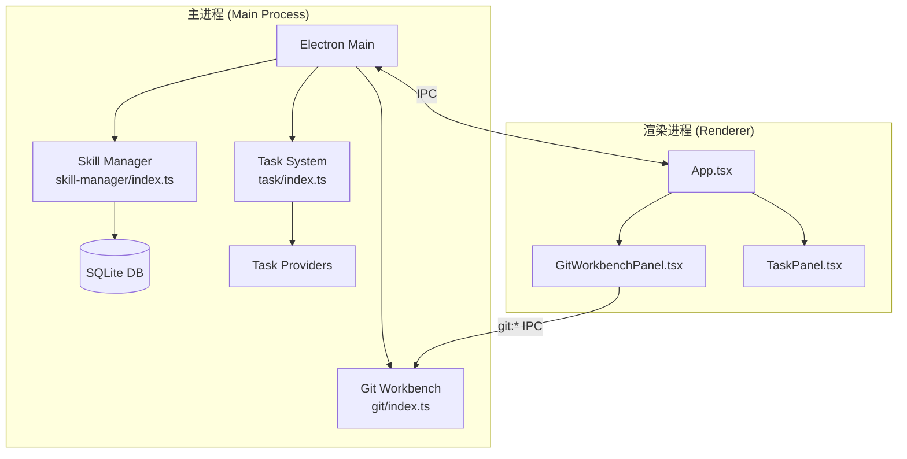
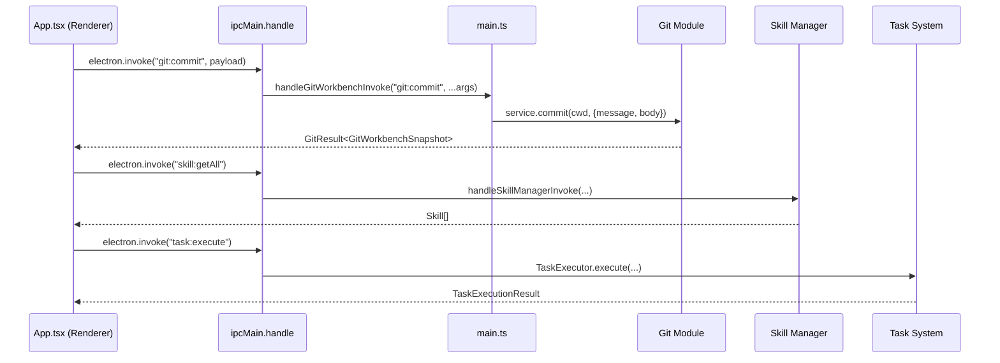

# 核心模块规格

<cite>

**本文引用的文件**

- [src/electron/main.ts](file://src/electron/main.ts)
- [src/ui/App.tsx](file://src/ui/App.tsx)
- [src/electron/libs/skill-manager/index.ts](file://src/electron/libs/skill-manager/index.ts)
- [src/electron/libs/task/index.ts](file://src/electron/libs/task/index.ts)
- [src/electron/libs/git/index.ts](file://src/electron/libs/git/index.ts)
- [src/electron/libs/git/README.md](file://src/electron/libs/git/README.md)
- [src/electron/libs/git/commit-message.ts](file://src/electron/libs/git/commit-message.ts)
- [src/electron/libs/git/errors.ts](file://src/electron/libs/git/errors.ts)
- [src/electron/libs/git/graph.ts](file://src/electron/libs/git/graph.ts)
- [src/electron/libs/git/history.ts](file://src/electron/libs/git/history.ts)
- [src/electron/libs/git/ipc.ts](file://src/electron/libs/git/ipc.ts)
- [src/electron/libs/git/operation-log.ts](file://src/electron/libs/git/operation-log.ts)
- [src/electron/libs/git/service.ts](file://src/electron/libs/git/service.ts)
- [src/electron/libs/git/types.ts](file://src/electron/libs/git/types.ts)
- [src/ui/components/git/index.ts](file://src/ui/components/git/index.ts)
- [src/ui/components/git/GitBranchStashPanel.tsx](file://src/ui/components/git/GitBranchStashPanel.tsx)
- [src/ui/components/git/GitChangesList.tsx](file://src/ui/components/git/GitChangesList.tsx)
- [src/ui/components/git/GitCommitBox.tsx](file://src/ui/components/git/GitCommitBox.tsx)

</cite>

# 核心模块规格

核心模块规格总览，提供模块索引。

---

## 目录

- [1. 模块总览与依赖关系图](#1-模块总览与依赖关系图)
- [2. Electron 主进程](#2-electron-主进程)
- [3. 工作台 UI (App)](#3-工作台-ui-app)
- [4. 技能管理器 (Skill Manager)](#4-技能管理器-skill-manager)
- [5. 任务系统 (Task System)](#5-任务系统-task-system)
- [6. Git 集成 (Git Workbench)](#6-git-集成-git-workbench)
- [7. 模块间 IPC 通道一览](#7-模块间-ipc-通道一览)
- [8. 状态流与数据边界](#8-状态流与数据边界)
- [9. 失败模式与排障步骤](#9-失败模式与排障步骤)
- [10. Agent 改代码地图](#10-agent-改代码地图)

---

## 1. 模块总览与依赖关系图

tech-cc-hub 的核心模块分为 **5 大领域**，均运行在 Electron 主进程（Main Process）上，通过 IPC 与 Renderer 层通信。



**依赖方向**：`Electron Main → 各 Library 模块 → SQLite / 文件系统 / Git CLI`

**跨进程边界**：Renderer 仅能通过 `electron.invoke()` 调用已注册的 IPC 通道，不能直接访问主进程文件系统。

> 图表来源：[src/electron/main.ts#L66](file://src/electron/main.ts#L66) — `registerGitWorkbenchIpcHandlers` 注册入口

---

## 2. Electron 主进程

### 2.1 职责

Electron 主进程 (`src/electron/main.ts`) 是整个应用的入口，负责：

| 职责 | 具体实现 |
|------|----------|
| 窗口管理 | `BrowserWindow` 创建、生命周期 |
| IPC 注册 | 聚合所有模块的 `ipcMain.handle` |
| 插件管理 | Open Computer Use、Figma 官方插件的安装/连接/状态检查 |
| 外部 CLI | `runExternalCli` 执行 npm/git 等命令 |
| MCP 桥接 | `startChannelBridge` 建立 MCP 协议通道 |

### 2.2 关键符号

| 符号 | 行号 | 用途 |
|------|------|------|
| `getOpenComputerUseVersion()` | 132 | 读取已安装的 OCU 版本 |
| `installOpenComputerUsePlugin()` | 252 | 安装 npm 包并写入 MCP 配置 |
| `prepareOpenComputerUsePermissions()` | 187 | 检查 macOS Accessibility/Screen Recording 权限 |
| `registerGitWorkbenchIpcHandlers()` | 66 | 初始化 Git 模块 IPC |
| `registerSkillManagerHandlers()` | 64 | 初始化 Skill Manager IPC |
| `startChannelBridge()` | 42 | 启动 MCP 频道桥接 |
| `runExternalCli()` | 76 | 封装 child_process.spawn 执行外部命令 |

### 2.3 运行时信号（Runtime IPC Channels）

主进程注册的所有 `ipcMain.handle` 通道：

```typescript
// 文件: src/electron/main.ts
// 行: 47-96（部分）
ipcMain.handle: "preview-list-directory"
ipcMain.handle: "preview-list-files"
ipcMain.handle: "sessions:list"
ipcMain.handle: "slash-commands:list"
ipcMain.handle: "plugins:getOpenComputerUseStatus"
ipcMain.handle: "plugins:installOpenComputerUse"
ipcMain.handle: "plugins:connectFigmaOfficial"
ipcMain.handle: "knowledge:list"  // knowledge-ui-store
// Git IPC channels 由 git/ipc.ts 注册
```

### 2.4 入口点

```typescript
// src/electron/main.ts — 应用启动入口
import { app, BrowserWindow, ipcMain } from "electron";
import { handleGitWorkbenchInvoke, registerGitWorkbenchIpcHandlers } from "./libs/git/index.js";
```

> 章节来源：[src/electron/main.ts#L1-L97](file://src/electron/main.ts#L1-L97)

---

## 3. 工作台 UI (App)

### 3.1 职责

`src/ui/App.tsx` 是 React 主组件，负责：

- **消息流渲染**：将 `StreamMessage` 数组渲染为对话卡片
- **过程折叠**：识别 `assistant` + `user` 的 tool_use/tool_result 模式，折叠为 `ProcessGroupCard`
- **实时滚动**：自动跟随新消息，手动滚动时暂停自动滚动
- **会话历史**：支持分页加载历史消息（`HISTORY_PAGE_LIMIT = 200`）

### 3.2 关键符号

| 符号 | 行号 | 类型 | 用途 |
|------|------|------|------|
| `App` | 326 | React 组件 | 主入口 |
| `ProcessGroupCard` | 111 | React 组件 | 折叠过程卡片 |
| `CompactProcessRow` | 160 | React 组件 | 单条过程展开行 |
| `isProcessMessage()` | 60 | 工具函数 | 判断是否为 tool_use 消息组 |
| `getProcessGroupSummary()` | 80 | 工具函数 | 汇总工具调用标签 |
| `getToolUseCount()` | 298 | 工具函数 | 统计工具调用数量 |

### 3.3 调用链

```
App (useIPC)
  → electron.invoke("sessions:list")  // 获取会话列表
  → 渲染 MessageCard / ProcessGroupCard
  → electron.invoke("shell:openExternal")  // 外部链接
```

### 3.4 依赖关系

```typescript
// src/ui/App.tsx — 关键 import
import { useIPC } from "./hooks/useIPC";
import { useAppStore } from "./store/useAppStore";
import { GitWorkbenchPanel } from "./components/git/index";  // Git 面板入口
```

> 章节来源：[src/ui/App.tsx#L1-L34](file://src/ui/App.tsx#L1-L34)

---

## 4. 技能管理器 (Skill Manager)

### 4.1 职责

技能管理器负责 **技能的安装、发现、场景编排、工具适配器管理**。

### 4.2 关键导出（Exports）

文件：`src/electron/libs/skill-manager/index.ts`

| 导出 | 来源文件 | 用途 |
|------|----------|------|
| `getAllSkills`, `getSkillById` | `db.js` | 从 SQLite 读取技能元数据 |
| `insertSkill`, `updateSkillAfterInstall` | `db.js` | 写入技能记录 |
| `getAllScenarios`, `getActiveScenarioId` | `db.js` | 场景管理 |
| `ensureCentralRepo`, `skillsDir` | `central-repo.js` | Central Repository 路径 |
| `findAdapter`, `isInstalled` | `tool-adapters.js` | 工具适配器查找 |
| `inferSkillName`, `parseSkillMd` | `sync-engine.js` | 同步引擎解析 |
| `installFromLocal` | `installer.js` | 本地安装 |
| `scanLocalSkills`, `groupDiscovered` | `scanner.js` | 技能发现扫描 |
| `createScenario`, `applyScenarioToDefault` | `scenarios.js` | 场景创建与激活 |

### 4.3 数据模型

SQLite 表（通过 `getDb()` 获取）：

- `skills` — 技能主表
- `scenarios` — 场景配置
- `targets` — 技能目标
- `tags` — 标签关联

### 4.4 IPC 入口

```typescript
// src/electron/main.ts#L64
import { handleSkillManagerInvoke, registerSkillManagerHandlers } from "./libs/skill-manager/ipc-handlers.js";
```

> 章节来源：[src/electron/libs/skill-manager/index.ts#L1-L88](file://src/electron/libs/skill-manager/index.ts#L1-L88)

---

## 5. 任务系统 (Task System)

### 5.1 职责

任务系统负责 **任务的执行、编排、多 Provider 支持、工作流配置持久化**。

### 5.2 关键导出（Exports）

文件：`src/electron/libs/task/index.ts`

| 导出 | 类型 | 用途 |
|------|------|------|
| `TaskExecutor` | 类 | 任务执行引擎 |
| `TaskRepository` | 类 | 任务持久化 |
| `registerTaskProvider` | 函数 | 注册 Provider |
| `getTaskProvider` | 函数 | 获取指定 Provider |
| `listTaskProviders` | 函数 | 列出所有 Provider |
| `loadTaskWorkflowConfig` | 函数 | 加载工作流配置 |
| `computeRetryDueAt` | 函数 | 计算重试时间 |
| `loadTaskSettings`, `saveTaskSettings` | 函数 | 任务设置持久化 |

### 5.3 内置 Provider

| Provider | 文件 | 用途 |
|----------|------|------|
| `LarkTaskProvider` | `providers/lark-provider.js` | 飞书任务 |
| `TbTaskProvider` | `providers/tb-provider.js` | Trello/看板 |
| `FeishuProjectTaskProvider` | `providers/feishu-project-provider.js` | 飞书项目 |

### 5.4 类型定义

```typescript
// src/electron/libs/task/index.ts — 类型导出
export type {
  ExternalTask, ExternalTaskStatus, LocalTaskStatus,
  TaskProvider, TaskProviderCapability, TaskProviderState,
  TaskWorkflowSettings, TaskFilter, TaskPriority,
  TaskExecution, TaskExecutionOptions, TaskArtifact,
};
```

> 章节来源：[src/electron/libs/task/index.ts#L1-L37](file://src/electron/libs/task/index.ts#L1-L37)

---

## 6. Git 集成 (Git Workbench)

### 6.1 模块边界

Git 模块只允许在 **主进程** 执行 Git 操作，Renderer 通过 IPC 调用。

```
Renderer                    Main Process
  │                              │
  ▼                              ▼
GitWorkbenchPanel      →   GitWorkbenchService
  │                              │
  ├── GitBranchStashPanel        ├── service.ts (核心)
  ├── GitChangesList             ├── ipc.ts (IPC 路由)
  ├── GitCommitBox               ├── commit-message.ts (AI 生成)
  └── GitHistoryPanel            ├── history.ts / graph.ts / errors.ts
```

### 6.2 允许操作 vs 禁止操作

**第一版允许**：
- status / diff / stage / unstage
- commit / push / pull
- create/checkout branch / stash save/apply/drop
- recent history / lightweight graph

**第一版禁止**：
- reset / rebase / cherry-pick / force push / amend / squash / interactive rebase

> 章节来源：[src/electron/libs/git/README.md#L16-L34](file://src/electron/libs/git/README.md#L16-L34)

### 6.3 IPC 通道定义

文件：`src/electron/libs/git/ipc.ts`

```typescript
// 行: 5-20
export type GitWorkbenchIpcChannel =
  | "git:snapshot"       // 获取快照（全部状态）
  | "git:diff"           // 获取文件 diff
  | "git:commitDetail"   // 获取 commit 详情
  | "git:stage"          // 暂存文件
  | "git:unstage"        // 取消暂存
  | "git:commit"         // 提交
  | "git:generateCommitMessageFast"  // 快速生成（fallback）
  | "git:generateCommitMessage"      // AI 生成提交信息
  | "git:pull"           // 拉取
  | "git:push"           // 推送
  | "git:createBranch"   // 创建分支
  | "git:checkoutBranch" // 切换分支
  | "git:stashSave"      // 保存 stash
  | "git:stashApply"     // 应用 stash
  | "git:stashDrop";     // 删除 stash
```

### 6.4 核心类型（types.ts）

| 类型 | 行号 | 用途 |
|------|------|------|
| `GitWorkbenchErrorCode` | 1 | 错误码枚举 |
| `GitWorkbenchError` | 15 | 错误对象 `{ code, message, detail? }` |
| `GitResult<T>` | 22 | 结果联合类型 `{ success: true, data } \| { success: false, error }` |
| `GitChangedFile` | 34 | 文件变更 `{ path, status, staged, additions?, deletions? }` |
| `GitRepoStatus` | 43 | 仓库状态（分支、领先/落后计数等） |
| `GitCommitNode` | 72 | commit 节点（含 `graphLane` 用于渲染） |
| `GitWorkbenchSnapshot` | 104 | 完整快照（status + files + branches + stashes + history + operationLog） |
| `GitCommitMessageSuggestion` | 130 | 提交信息建议 `{ message, body?, source: "ai"|"fallback", model? }` |

### 6.5 GitWorkbenchService 核心方法

文件：`src/electron/libs/git/service.ts`

| 方法 | 行号 | 功能 |
|------|------|------|
| `getSnapshot(cwd)` | 25 | 获取完整 Git 快照（status + files + branches + history） |
| `getDiff(request)` | 73 | 获取文件 diff（支持 untracked 文件） |
| `getCommitDetail(request)` | 94 | 获取 commit 详情（body + files + diff） |
| `stageFiles(cwd, paths)` | 124 | 暂存文件 |
| `unstageFiles(cwd, paths)` | 130 | 取消暂存 |
| `commit(cwd, { message, body? })` | 136 | 提交 |
| `generateCommitMessage(cwd, language?)` | 151 | AI 生成提交信息 |
| `generateFallbackCommitMessage(cwd)` | 177 | 规则引擎生成提交信息 |
| `push(cwd)` | 188 | 推送 |
| `pull(cwd)` | - | 拉取 |
| `createBranch(cwd, name, checkout)` | - | 创建分支 |
| `checkoutBranch(cwd, name)` | - | 切换分支 |
| `stashSave(cwd, message?)` | - | 保存 stash |
| `stashApply(cwd, ref)` | - | 应用 stash |
| `stashDrop(cwd, ref)` | - | 删除 stash |

### 6.6 AI 提交信息生成

文件：`src/electron/libs/git/commit-message.ts`

```typescript
// 行: 10-62
export async function generateCommitMessageSuggestion(input: {
  files: GitChangedFile[];
  stat: string;
  nameStatus: string;
  diff: string;
  language?: string;
}): Promise<GitCommitMessageSuggestion>

// 关键参数限制
MAX_AI_DIFF_CHARS = 6_000      // diff 最大字符
MAX_AI_CONTEXT_CHARS = 8_000   // 上下文最大字符
MAX_AI_FILE_LINES = 80         // 最大文件数
MAX_BODY_CHARS = 500           // body 最大字符
AI_COMMIT_MESSAGE_TIMEOUT_MS = 6_000  // 超时时间

// 生成逻辑：
// 1. 调用 @anthropic-ai/claude-agent-sdk 的 query()
// 2. 解析 JSON 返回（支持去除 ```json 包装）
// 3. 失败时 fallback 到规则引擎
// 4. 结果格式: { message: "feat(git): 描述", body: "可选的详细说明", source: "ai"|"fallback" }
```

### 6.7 错误归一化

文件：`src/electron/libs/git/errors.ts`

```typescript
// 行: 3-15 — 错误模式匹配表
const PATTERNS: Array<[GitWorkbenchErrorCode, RegExp, string]> = [
  ["git_not_found", /not found|ENOENT|spawn git/i, "没有找到 Git，请先安装 Git。"],
  ["not_a_repo", /not a git repository/i, "当前工作区不是 Git 仓库。"],
  ["auth_required", /authentication failed|permission denied|403|401/i, "Git 认证失败。"],
  ["dirty_worktree", /local changes.*would be overwritten/i, "请先 commit 或 stash。"],
  ["conflict", /CONFLICT|merge conflict/i, "Git 操作产生冲突。"],
  ["no_remote", /No configured push destination/i, "当前仓库没有可用 remote。"],
  ["no_upstream", /no upstream branch/i, "当前分支没有 upstream。"],
  ["nothing_to_commit", /nothing to commit/i, "没有可提交的改动。"],
  ["branch_exists", /already exists/i, "分支已存在。"],
  ["branch_not_found", /not a commit|pathspec.*did not match/i, "分支不存在。"],
];

// 行: 17-28 — normalizeGitError 函数
export function normalizeGitError(error: unknown): GitWorkbenchError
```

### 6.8 UI 组件

| 组件 | 文件 | 用途 |
|------|------|------|
| `GitWorkbenchPanel` | `src/ui/components/git/index.ts` | 主容器，导出入口 |
| `GitBranchStashPanel` | `GitBranchStashPanel.tsx` | 分支/Stash 管理 |
| `GitChangesList` | `GitChangesList.tsx` | 文件列表（含搜索、暂存/取消暂存） |
| `GitCommitBox` | `GitCommitBox.tsx` | 提交框（含 AI 生成按钮） |

**GitBranchStashPanel Props**：

```typescript
// 行: 8-29
{
  branches: UiGitBranch[];
  stashes: UiGitStashEntry[];
  currentBranch?: string | null;
  actionBusy: string | null;
  initialMode?: "branches" | "stashes";
  onCreateBranch: (name: string, checkout: boolean) => MaybePromise<unknown>;
  onCheckoutBranch: (name: string) => MaybePromise<unknown>;
  onStashSave: (message?: string) => MaybePromise<unknown>;
  onStashApply: (ref: string) => MaybePromise<unknown>;
  onStashDrop: (ref: string) => MaybePromise<unknown>;
}
```

**GitCommitBox Props**：

```typescript
// 行: 8-23
{
  snapshot: UiGitWorkbenchSnapshot | null;
  actionBusy: string | null;
  onCommit: (message: string, body?: string) => MaybePromise<boolean | void>;
  onGenerateMessage?: () => Promise<UiGitCommitMessageSuggestion | null>;
  onGenerateMessageRefined?: () => Promise<UiGitCommitMessageSuggestion | null>;
  onPush: () => MaybePromise<boolean | void>;
  compact?: boolean;
}
```

> 章节来源：[src/electron/libs/git/types.ts#L1-L141](file://src/electron/libs/git/types.ts#L1-L141)、[src/ui/components/git/GitCommitBox.tsx#L8-L23](file://src/ui/components/git/GitCommitBox.tsx#L8-L23)

---

## 7. 模块间 IPC 通道一览



### IPC 通道注册点

| 模块 | 注册函数 | 位置 |
|------|----------|------|
| Git | `registerGitWorkbenchIpcHandlers()` | `src/electron/libs/git/ipc.ts:43` |
| Skill Manager | `registerSkillManagerHandlers()` | `src/electron/libs/skill-manager/ipc-handlers.ts` |
| Task | 通过 `ipc-handlers.js` | `src/electron/ipc-handlers.js` |
| Knowledge | `handleKnowledgeUiInvoke` | `src/electron/libs/knowledge/knowledge-ui-store.js` |

---

## 8. 状态流与数据边界

### 8.1 Source-of-Truth 边界

| 数据域 | Source of Truth | 运行时刷新 |
|--------|-----------------|------------|
| Git 仓库状态 | `GitWorkbenchService` + `simple-git` | 每次调用 `getSnapshot` 实时读取 |
| 技能元数据 | SQLite (`skills`, `scenarios` 表) | `skill-manager/db.js` 写入后立即可读 |
| 任务状态 | `TaskRepository` + 外部 Provider | 轮询或事件驱动刷新 |
| UI 状态 | `useAppStore` (Zustand) | 本地内存，需手动 sync |
| 会话历史 | 主进程 `sessions` Map | IPC `sessions:list` 获取 |

### 8.2 前端/后端桥接点

| 桥接类型 | 实现 | 文件 |
|----------|------|------|
| Preload 暴露 | `contextBridge.exposeInMainWorld('electron', {...})` | preload 脚本 |
| useIPC hook | 封装 `electron.invoke()` | `src/ui/hooks/useIPC.ts` |
| Store 同步 | `useAppStore` Zustand store | `src/ui/store/useAppStore.ts` |

### 8.3 测试入口

| 层级 | 测试文件 | 覆盖范围 |
|------|----------|----------|
| Git Service | `src/electron/libs/git/__tests__/` | `GitWorkbenchService` 单元测试 |
| Git IPC | - | 集成测试需 mock `ipcMain` |
| UI 组件 | `src/ui/components/git/__tests__/` | React Testing Library |

---

## 9. 失败模式与排障步骤

### 9.1 Git 模块失败

**症状 1**：调用 `git:*` IPC 返回 `{ success: false, error: { code: "git_not_found" } }`

```
排查步骤：
1. 检查系统是否安装 Git: git --version
2. 检查 PATH 环境变量是否包含 Git
3. 检查 main.ts 中 runExternalCli 执行权限
```

**症状 2**：`getSnapshot` 返回 `not_a_repo`

```
排查步骤：
1. 确认 cwd 参数指向正确的 Git 仓库根目录
2. 确认 .git 目录存在
3. 检查权限：ls -la .git
```

**症状 3**：`push` 返回 `auth_required`

```
排查步骤：
1. 运行 git config --list 检查 remote URL
2. 确认 credential helper 配置
3. 检查 SSH key 或 token 有效期
```

### 9.2 AI 生成提交信息失败

**症状**：`generateCommitMessage` 超时或返回 `fallback`

```
排查步骤：
1. 检查 API Key 配置: getCurrentApiConfig()
2. 检查模型配置: apiConfig.smallModel / apiConfig.analysisModel
3. 查看日志: console.warn("[git] failed to generate commit message")
4. 确认 timeout 设置: AI_COMMIT_MESSAGE_TIMEOUT_MS = 6000ms
```

> 章节来源：[src/electron/libs/git/errors.ts#L1-L40](file://src/electron/libs/git/errors.ts#L1-L40)

---

## 10. Agent 改代码地图

### 10.1 先读文件（修改前必读）

| 优先级 | 文件 | 理由 |
|--------|------|------|
| 🔴 必须 | `src/electron/libs/git/types.ts` | 类型定义是一切的基础 |
| 🔴 必须 | `src/electron/libs/git/service.ts` | 核心逻辑，所有 git 操作在此 |
| 🔴 必须 | `src/electron/libs/git/ipc.ts` | IPC 通道定义和路由 |
| 🟡 推荐 | `src/electron/libs/git/errors.ts` | 错误模式表，修改错误码必读 |
| 🟡 推荐 | `src/ui/components/git/GitCommitBox.tsx` | 提交框 UI，接入新字段必读 |
| 🟡 推荐 | `src/electron/main.ts` | IPC 注册入口，新增通道需在此注册 |

### 10.2 关键符号索引

| 符号 | 文件:行 | 用途 |
|------|---------|------|
| `GitWorkbenchService` | `service.ts:22` | 核心类 |
| `handleGitWorkbenchInvoke` | `ipc.ts:58` | IPC 调度函数 |
| `registerGitWorkbenchIpcHandlers` | `ipc.ts:43` | IPC 注册入口 |
| `GitWorkbenchIpcChannel` | `ipc.ts:5` | 通道类型枚举 |
| `GitResult<T>` | `types.ts:22` | 结果类型（必须返回） |
| `normalizeGitError` | `errors.ts:17` | 错误归一化 |
| `generateCommitMessageSuggestion` | `commit-message.ts:10` | AI 生成函数 |
| `GitWorkbenchPanel` | `ui/components/git/index.ts:1` | UI 入口 |

### 10.3 IPC 通道新增步骤

如果要新增一个 Git IPC 通道（如 `git:rebase`）：

1. 在 `types.ts` 添加 `GitWorkbenchIpcChannel` 联合类型成员
2. 在 `ipc.ts` 的 `CHANNELS` 数组添加通道名
3. 在 `handleGitWorkbenchInvoke` 的 `switch` 添加 `case "git:rebase"`
4. 在 `GitWorkbenchService` 实现 `rebase()` 方法
5. 在 UI 组件调用 `electron.invoke("git:rebase", { cwd, ... })`

### 10.4 修改入口

| 场景 | 修改文件 |
|------|----------|
| 新增 Git 操作 | `service.ts` + `ipc.ts` |
| 修改类型定义 | `types.ts` |
| 修改错误处理 | `errors.ts` 的 `PATTERNS` 表 |
| 修改 AI 生成逻辑 | `commit-message.ts` |
| 修改 UI 组件 | `src/ui/components/git/` |

### 10.5 验证命令

```bash
# TypeScript 类型检查
npx tsc --noEmit

# 运行测试
npm test -- --grep "GitWorkbench"

# 手动验证 IPC（devtools console）
const result = await window.electron.invoke("git:snapshot", { cwd: process.cwd() })
console.log(result)
```

### 10.6 常见回归风险

| 风险 | 预防措施 |
|------|----------|
| 新增 IPC 通道忘记在 `main.ts` 注册 | 搜索 `registerGitWorkbenchIpcHandlers` 确认调用 |
| `GitResult<T>` 返回格式错误 | 始终返回 `{ success: true, data }` 或 `{ success: false, error: { code, message } }` |
| 忘记处理 `normalizeGitError` | 所有 catch 块必须调用 `normalizeGitError()` |
| AI 超时不处理 fallback | 确保 `generateCommitMessageSuggestion` 有 fallback 分支 |
| UI 类型与后端不一致 | 检查 `src/ui/types.ts` 中的 `UiGit*` 类型是否与 `types.ts` 对齐 |

---

**文档版本**：1.0
**最后更新**：基于当前代码基线
**维护者**：Core Team