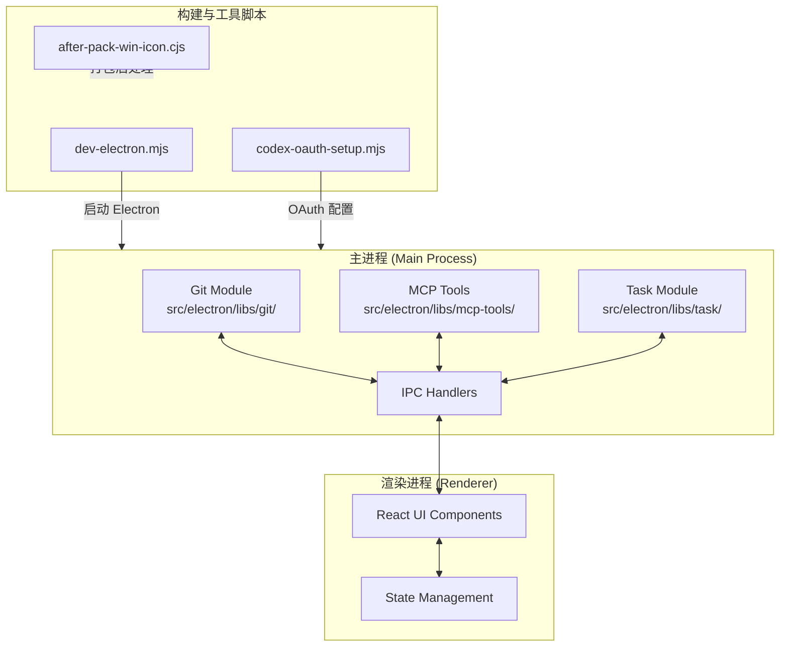
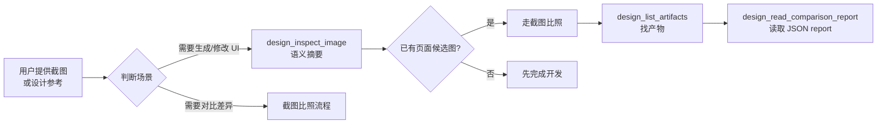
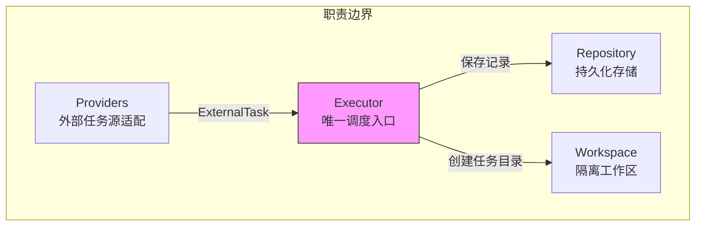
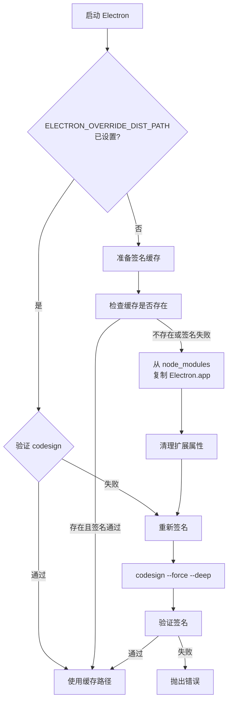
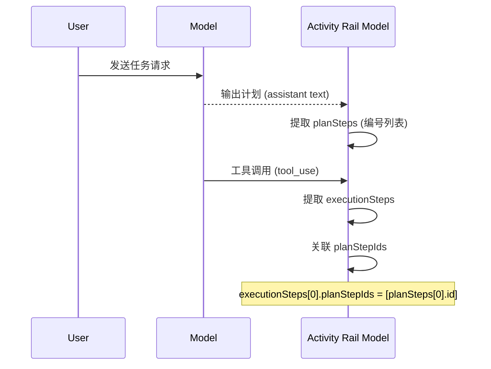

# 核心模块规格

> **目录描述**: `core-module-specs`

---

<cite>

**本文引用的文件**

- [src/electron/libs/git/README.md](file://src/electron/libs/git/README.md)
- [src/electron/libs/mcp-tools/README.md](file://src/electron/libs/mcp-tools/README.md)
- [src/electron/libs/task/README.md](file://src/electron/libs/task/README.md)
- [scripts/after-pack-win-icon.cjs](file://scripts/after-pack-win-icon.cjs)
- [scripts/codex-oauth-setup.mjs](file://scripts/codex-oauth-setup.mjs)
- [scripts/dev-electron.mjs](file://scripts/dev-electron.mjs)
- [test/electron/tsconfig.json](file://test/electron/tsconfig.json)
- [test/electron/activity-rail-dual-steps.test.ts](file://test/electron/activity-rail-dual-steps.test.ts)
- [test/electron/activity-rail-model.test.ts](file://test/electron/activity-rail-model.test.ts)

</cite>

---

## 目录

- [1. 模块概览](#1-模块概览)
- [2. Git 工作台模块](#2-git-工作台模块)
- [3. MCP 工具模块](#3-mcp-工具模块)
- [4. 任务系统模块](#4-任务系统模块)
- [5. Electron 开发环境](#5-electron-开发环境)
- [6. Codex OAuth 认证](#6-codex-oauth-认证)
- [7. 构建与打包](#7-构建与打包)
- [8. 活动轨迹模型（Activity Rail）](#8-活动轨迹模型activity-rail)
- [9. Prompt Ledger](#9-prompt-ledger)
- [10. 测试配置](#10-测试配置)
- [11. 常见问题与排障](#11-常见问题与排障)

---

## 1. 模块概览

`tech-cc-hub` 是一个基于 Electron 的桌面应用，核心职责是作为 AI 编程助手的工作台。项目采用主进程（Main Process）+ 渲染进程（Renderer Process）架构，通过 IPC 进行通信。

### 1.1 模块分层结构



**图表来源**: 根据 `scripts/dev-electron.mjs` 和模块目录结构综合分析。

### 1.2 主进程职责边界

| 模块 | 职责 | Renderer 访问方式 |
|------|------|------------------|
| `git` | Git 操作代理 | IPC 调用 `git:*` 通道 |
| `mcp-tools` | 内置工具暴露 | IPC 调用 `mcp-tools:*` 通道 |
| `task` | 任务编排与执行 | IPC 调用 `task:*` 通道 |

**关键约束**: Renderer **禁止**直接执行 git 命令或访问文件系统，必须通过 IPC 委托给主进程。

---

## 2. Git 工作台模块

### 2.1 模块边界

位置：`src/electron/libs/git/`

| 文件 | 职责 |
|------|------|
| `types.ts` | Git 工作台领域类型和 IPC payload/result |
| `errors.ts` | Git 错误归一化 |
| `service.ts` | 唯一 Git 操作入口 |
| `history.ts` | Commit history parser |
| `graph.ts` | Lightweight graph lane 生成 |
| `operation-log.ts` | 本地高影响操作日志 |
| `ipc.ts` | Electron IPC handler 注册 |
| `index.ts` | 对外统一出口 |

**章节来源**: [src/electron/libs/git/README.md#L1-L14](file://src/electron/libs/git/README.md#L1-L14)

### 2.2 第一版允许的操作

```typescript
// 允许的操作清单（基于 README.md）
type AllowedOperation = 
  | 'status'      // 查看状态
  | 'diff'        // 查看差异
  | 'stage'       // 暂存文件
  | 'unstage'     // 取消暂存
  | 'commit'      // 提交
  | 'push'        // 推送（普通推送）
  | 'branch'      // 创建/切换分支
  | 'stash'       // 暂存工作区
  | 'history'     // 最近提交历史
  | 'graph';      // 轻量图
```

### 2.3 第一版禁止的操作

- `reset` - 重置
- `rebase` - 变基
- `cherry-pick` - 选樱桃
- `force push` - 强制推送
- `amend` - 修改提交
- `squash` - 压缩提交
- `interactive rebase` - 交互式变基

**章节来源**: [src/electron/libs/git/README.md#L16-L33](file://src/electron/libs/git/README.md#L16-L33)

### 2.4 调用示例

```typescript
// Renderer 端通过 IPC 调用
import { ipcRenderer } from 'electron';

// 查看 Git 状态
const status = await ipcRenderer.invoke('git:status', { cwd: '/path/to/repo' });

// 查看 Diff
const diff = await ipcRenderer.invoke('git:diff', { 
  cwd: '/path/to/repo',
  file?: 'src/index.ts'  // 可选，指定文件
});

// 提交
const commit = await ipcRenderer.invoke('git:commit', {
  cwd: '/path/to/repo',
  message: 'feat: add new feature'
});
```

---

## 3. MCP 工具模块

### 3.1 模块边界

位置：`src/electron/libs/mcp-tools/`

| 工具文件 | 能力描述 |
|----------|----------|
| `browser.ts` | BrowserView 工作台能力：导航、截图摘要、DOM 查询、样式检查、标注模式 |
| `design.ts` | 截图语义分析、截图比照、设计还原能力 |
| `figma-rest.ts` | Figma Personal Access Token 只读工具面 |
| `admin.ts` | 受控管理能力，写入全局运行参数 |

**章节来源**: [src/electron/libs/mcp-tools/README.md#L1-L8](file://src/electron/libs/mcp-tools/README.md#L1-L8)

### 3.2 设计工具默认触发场景



**图表来源**: [src/electron/libs/mcp-tools/README.md#L16-L21](file://src/electron/libs/mcp-tools/README.md#L16-L21)

### 3.3 设计工具关键参数

```typescript
// design.ts 关键参数
interface DesignInspectOptions {
  imagePath: string;           // 图片路径
  ignoreRegions?: Rect[];      // 忽略区域（动态内容）
  maxDifferenceRatio?: number; // 差异阈值
  ignoreAntialiasing?: boolean; // 忽略抗锯齿噪声
}

// 使用示例
const summary = await mcpTools.design_inspect_image({
  imagePath: '/path/to/screenshot.png',
  ignoreRegions: [{ x: 0, y: 0, width: 100, height: 50 }], // 时间、头像区域
  ignoreAntialiasing: true,  // 文字锯齿多时开启
});
```

### 3.4 审阅重点

- 每个工具应有明确 host 边界，不直接操作 React UI
- 返回内容尽量是摘要、路径和结构化 JSON，避免大图或密钥明文
- 涉及写入磁盘或配置的工具必须有字段 allowlist 和体积上限

**章节来源**: [src/electron/libs/mcp-tools/README.md#L10-L15](file://src/electron/libs/mcp-tools/README.md#L10-L15)

---

## 4. 任务系统模块

### 4.1 模块边界

位置：`src/electron/libs/task/`

| 文件 | 职责 |
|------|------|
| `types.ts` | 任务、执行记录、IPC payload 的领域类型 |
| `provider-registry.ts` | Provider 注册表和 fallback provider |
| `providers/` | 外部任务源适配器（目前包含 Lark） |
| `repository.ts` | SQLite schema、任务状态、执行记录和日志持久化 |
| `workflow.ts` | Symphony-style workflow 配置、轮询、重试和 stall 默认参数 |
| `workspace.ts` | 每个任务的独立 workspace 创建和路径安全 |
| `executor.ts` | 编排器，负责同步、自动执行、并发控制、重试、恢复和日志事件 |
| `index.ts` | 对外统一出口 |

**章节来源**: [src/electron/libs/task/README.md#L5-L14](file://src/electron/libs/task/README.md#L5-L14)

### 4.2 运行原则



**核心约束**:
- Provider 只负责把第三方任务映射成 `ExternalTask`，不直接改 UI 或会话
- Repository 只做持久化，不启动 runner
- Executor 是**唯一调度入口**，所有自动/手动执行都经过这里
- 任务执行使用独立 workspace，避免多个任务互相污染

**章节来源**: [src/electron/libs/task/README.md#L16-L22](file://src/electron/libs/task/README.md#L16-L22)

### 4.3 Executor 职责详解

```typescript
// executor.ts 核心能力（基于 README.md 描述）
interface TaskExecutor {
  // 编排执行
  schedule(task: Task): Promise<void>;
  
  // 同步状态
  sync(taskId: string): Promise<TaskStatus>;
  
  // 自动执行
  autoExecute(taskId: string): Promise<void>;
  
  // 并发控制
  setConcurrency(limit: number): void;
  
  // 重试机制
  retry(taskId: string, options?: RetryOptions): Promise<void>;
  
  // 恢复
  resume(taskId: string): Promise<void>;
  
  // 日志事件
  onLog(callback: (event: LogEvent) => void): void;
}
```

---

## 5. Electron 开发环境

### 5.1 开发启动脚本

位置：`scripts/dev-electron.mjs`

**功能**: 启动 Electron 开发环境，处理 macOS 代码签名缓存。

```javascript
// 核心流程
const overrideDistPath = prepareMacElectronDist();
if (overrideDistPath) {
  env.ELECTRON_OVERRIDE_DIST_PATH = overrideDistPath;
}

const child = spawn(process.execPath, [electronCli, ...electronArgs], {
  cwd: repoRoot,
  env,
  stdio: 'inherit',
});
```

**章节来源**: [scripts/dev-electron.mjs#L115-L136](file://scripts/dev-electron.mjs#L115-L136)

### 5.2 macOS Electron 签名缓存机制



**图表来源**: [scripts/dev-electron.mjs#L72-L108](file://scripts/dev-electron.mjs#L72-L108)

### 5.3 启动命令

```bash
# 基本启动
node scripts/dev-electron.mjs

# 带参数启动
node scripts/dev-electron.mjs ./path/to/app

# 查看 Electron 版本
# 脚本会自动从 package.json 读取 electron 版本
```

### 5.4 缓存路径（macOS）

```javascript
// macOS 缓存路径
const cacheDist = path.join(
  homedir(), 
  'Library', 
  'Caches', 
  'tech-cc-hub', 
  `electron-${version}-dist`
);
```

**章节来源**: [scripts/dev-electron.mjs#L89](file://scripts/dev-electron.mjs#L89)

---

## 6. Codex OAuth 认证

### 6.1 配置脚本

位置：`scripts/codex-oauth-setup.mjs`

**功能**: 从官方 Codex login 导入 OAuth 凭证到 tech-cc-hub 配置。

```javascript
// 核心流程
async function main() {
  const configPath = getConfigPath();
  const authPath = getCodexAuthPath();
  
  let credential = loadCodexCredential(authPath);
  if (!credential && !args.noLogin) {
    await runCodexLogin();  // 启动官方 codex login
    credential = loadCodexCredential(authPath);
  }
  
  const profile = saveCodexProfile(configPath, credential, args);
}
```

**章节来源**: [scripts/codex-oauth-setup.mjs#L268-L289](file://scripts/codex-oauth-setup.mjs#L268-L289)

### 6.2 配置文件路径

| 平台 | 路径 |
|------|------|
| Windows | `%APPDATA%\tech-cc-hub\api-config.json` |
| macOS | `~/Library/Application Support/tech-cc-hub/api-config.json` |
| Linux | `~/.config/tech-cc-hub/api-config.json` |

可通过 `TECH_CC_HUB_API_CONFIG` 环境变量覆盖。

**章节来源**: [scripts/codex-oauth-setup.mjs#L56-L65](file://scripts/codex-oauth-setup.mjs#L56-L65)

### 6.3 支持的模型列表

```javascript
const BASE_MODELS = [
  'gpt-5.5', 'gpt-5.4', 'gpt-5.4-mini',
  'gpt-5.3-codex', 'gpt-5.3-codex-spark',
  'gpt-5.2', 'gpt-5', 'gpt-5-codex', 'gpt-5-codex-mini',
  'gpt-5.1', 'gpt-5.1-codex', 'gpt-5.1-codex-max', 'gpt-5.1-codex-mini',
  'gpt-5.2-codex',
];

// 紧凑模型（带 -openai-compact 后缀）
const COMPACT_MODEL_SUFFIX = '-openai-compact';
```

**章节来源**: [scripts/codex-oauth-setup.mjs#L7-L32](file://scripts/codex-oauth-setup.mjs#L7-L32)

### 6.4 命令行用法

```bash
# 基本导入
node scripts/codex-oauth-setup.mjs

# 指定配置路径
node scripts/codex-oauth-setup.mjs --configPath=/path/to/config.json

# 指定 profile 名称
node scripts/codex-oauth-setup.mjs --profileName="My Profile"

# 跳过 codex login（仅从现有凭证读取）
node scripts/codex-oauth-setup.mjs --noLogin
```

---

## 7. 构建与打包

### 7.1 Windows 图标处理

位置：`scripts/after-pack-win-icon.cjs`

**功能**: 打包后修改 Windows exe 图标。

```javascript
module.exports = async function applyWindowsIconAfterPack(context) {
  if (context.electronPlatformName !== 'win32') {
    return;  // 仅 Windows 生效
  }

  const iconPath = path.join(projectDir, 'build', 'icon.ico');
  const candidates = [
    path.join(appOutDir, `${productFilename}.exe`),
    path.join(appOutDir, 'tech-cc-hub.exe'),
    path.join(appOutDir, 'electron.exe'),
  ];
  const exePath = candidates.find((candidate) => existsSync(candidate));

  // 使用 rcedit 修改图标
  spawnSync(rceditPath, [exePath, '--set-icon', iconPath], {
    cwd: projectDir,
    stdio: 'inherit',
  });
};
```

**章节来源**: [scripts/after-pack-win-icon.cjs#L1-L31](file://scripts/after-pack-win-icon.cjs#L1-L31)

### 7.2 失败条件

```javascript
// 以下任一条件缺失则跳过
if (!exePath || !existsSync(iconPath) || !existsSync(rceditPath)) {
  console.warn('[after-pack-win-icon] skipped: missing exe, icon, or rcedit');
  return;
}
```

### 7.3 排障检查清单

| 检查项 | 路径 |
|--------|------|
| 图标文件 | `build/icon.ico` |
| rcedit | `node_modules/electron-winstaller/vendor/rcedit.exe` |
| exe 位置 | `out/${platform}/${productFilename}.exe` |

---

## 8. 活动轨迹模型（Activity Rail）

### 8.1 核心函数

```typescript
// 入口函数
import { buildActivityRailModel } from '../../src/shared/activity-rail-model.js';

// 基础用法
const model = buildActivityRailModel(session, [], '');
```

**章节来源**: [test/electron/activity-rail-dual-steps.test.ts#L4](file://test/electron/activity-rail-dual-steps.test.ts#L4)

### 8.2 模型输出结构

```typescript
interface ActivityRailModel {
  // 步骤分类
  planSteps: PlanStep[];        // 计划步骤（来自 assistant text）
  executionSteps: ExecutionStep[]; // 执行步骤（来自 tool_use）
  
  // 标签
  taskSectionTitle: string;     // 默认: "任务步骤"
  executionSectionTitle: string; // 默认: "步骤汇总"
  
  // Prompt 分析
  promptAnalysis: PromptAnalysis;
  
  // 时间线
  timeline: TimelineItem[];
  
  // 上下文分布
  contextDistribution: ContextBucket[];
}
```

**章节来源**: [test/electron/activity-rail-model.test.ts#L100-L163](file://test/electron/activity-rail-model.test.ts#L100-L163)

### 8.3 计划与执行步骤分离



**图表来源**: [test/electron/activity-rail-dual-steps.test.ts#L124-L128](file://test/electron/activity-rail-dual-steps.test.ts#L124-L128)

### 8.4 状态枚举

```typescript
type StepStatus = 
  | 'pending'    // 等待执行
  | 'running'    // 执行中
  | 'completed'  // 已完成
  | 'failed';    // 失败
```

### 8.5 生命周期事件

```typescript
// 识别重复 init 事件为 runner reuse
const lifecycleItems = model.timeline.filter((item) => item.nodeKind === 'lifecycle');

// 第一轮: "初始化执行环境"
// 第二轮: "复用执行环境"
```

**章节来源**: [test/electron/activity-rail-model.test.ts#L210-214](file://test/electron/activity-rail-model.test.ts#L210-214)

---

## 9. Prompt Ledger

### 9.1 核心函数

```typescript
import { buildPromptLedgerMessage } from '../../src/shared/prompt-ledger.js';

const ledger = buildPromptLedgerMessage({
  phase: 'continue',
  model: 'GLM-5.1-FP8',
  cwd: 'D:/workspace/project',
  prompt: '继续修复问题',
  promptSources: [...],
  memorySources: [...],
  historyMessages: [...],
});
```

**章节来源**: [test/electron/activity-rail-model.test.ts#L5](file://test/electron/activity-rail-model.test.ts#L5)

### 9.2 Prompt 来源分类

```typescript
type SourceKind = 'system' | 'project' | 'skill' | 'memory';

interface PromptSource {
  id: string;
  label: string;
  sourceKind: SourceKind;
  chars: number;
  text?: string;
  sample?: string;
}
```

### 9.3 Bucket 结构

```typescript
interface LedgerBucket {
  id: string;           // 如 'project-agents', 'skill-doc', 'current-prompt'
  sourceKind: SourceKind;
  label: string;
  chars: number;
}
```

### 9.4 特殊 Bucket ID

| Bucket ID | 含义 |
|-----------|------|
| `current-prompt` | 当前用户输入 |
| `current-attachments` | 当前附件 |
| `history-tool-output` | 历史工具输出 |
| `history-tool-input` | 历史工具输入 |
| `summary` | 滚动摘要 |

**章节来源**: [test/electron/activity-rail-model.test.ts#L53-62](file://test/electron/activity-rail-model.test.ts#L53-62)

---

## 10. 测试配置

### 10.1 Electron 测试 tsconfig

位置：`test/electron/tsconfig.json`

```json
{
  "compilerOptions": {
    "strict": true,
    "target": "ESNext",
    "module": "NodeNext",
    "outDir": "../../dist-test",
    "rootDir": "../..",
    "jsx": "react-jsx",
    "skipLibCheck": true,
    "types": ["node", "../../types"]
  },
  "include": ["./**/*.test.ts"]
}
```

**章节来源**: [test/electron/tsconfig.json#L1-L18](file://test/electron/tsconfig.json#L1-L18)

### 10.2 测试运行

```bash
# 运行所有测试
node --test test/electron/*.test.ts

# 运行特定测试
node --test test/electron/activity-rail-model.test.ts
```

---

## 11. 常见问题与排障

### 11.1 macOS Electron 启动失败

**症状**: `Electron.app not found` 或 codesign 验证失败

**排查步骤**:
1. 确认 `npm install` 已执行
2. 检查 `node_modules/electron/dist/Electron.app` 是否存在
3. 清理缓存: `rm -rf ~/Library/Caches/tech-cc-hub`
4. 重新安装: `rm -rf node_modules && npm install`

### 11.2 Codex OAuth 导入失败

**症状**: `Unable to import Codex ChatGPT credentials`

**排查步骤**:
1. 确认已执行 `codex login` 并完成浏览器登录
2. 检查 `~/.codex/auth.json` 是否存在
3. 验证 auth.json 包含 `access_token` 和 `account_id`
4. 可用 `--noLogin` 跳过自动登录尝试

### 11.3 Windows 图标未更新

**症状**: 打包后 exe 图标仍是默认 Electron 图标

**排查步骤**:
1. 确认 `build/icon.ico` 存在
2. 检查 `node_modules/electron-winstaller/vendor/rcedit.exe` 存在
3. 手动运行验证:
   ```bash
   ./node_modules/electron-winstaller/vendor/rcedit.exe ^
     out/win-unpacked/tech-cc-hub.exe --set-icon build/icon.ico
   ```

### 11.4 Activity Rail 模型为空

**症状**: `planSteps` 或 `executionSteps` 长度为 0

**排查步骤**:
1. 确认 session 包含 `type: 'user_prompt'` 消息
2. 确认 assistant 消息包含文本内容或 tool_use
3. 检查 planSteps 提取逻辑依赖 assistant 消息的 text 内容中的编号格式

---

## 附录：关键文件速查

| 用途 | 文件路径 |
|------|----------|
| Git 工作台入口 | `src/electron/libs/git/index.ts` |
| MCP 工具入口 | `src/electron/libs/mcp-tools/{browser,design,figma-rest,admin}.ts` |
| 任务系统入口 | `src/electron/libs/task/index.ts` |
| Electron 启动 | `scripts/dev-electron.mjs` |
| OAuth 配置 | `scripts/codex-oauth-setup.mjs` |
| 图标打包 | `scripts/after-pack-win-icon.cjs` |
| Activity Rail | `src/shared/activity-rail-model.js` |
| Prompt Ledger | `src/shared/prompt-ledger.js` |

---

**文档版本**: 1.0  
**维护者**: 工程团队  
**最后更新**: 基于当前代码库分析