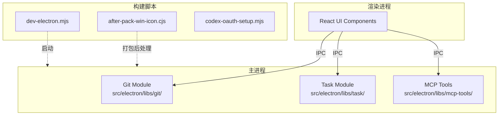
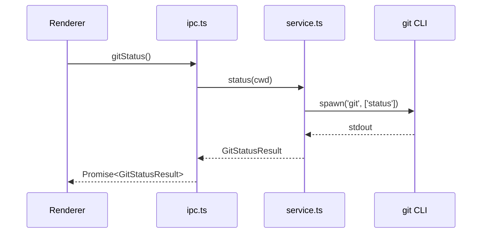
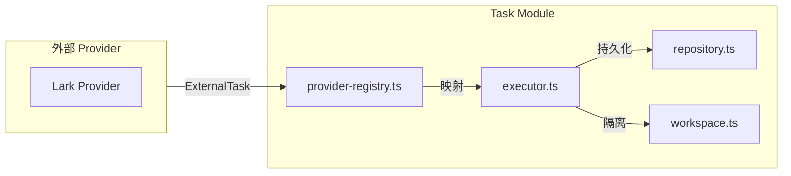
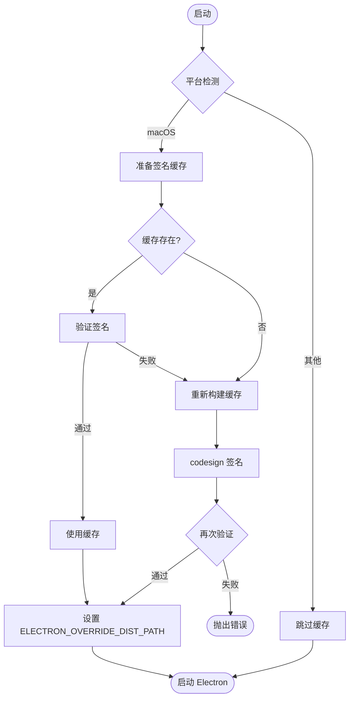
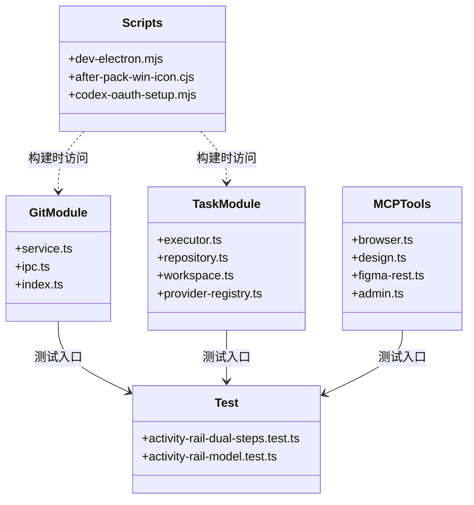

# 核心模块规格

<cite>
**本文引用的文件**
- [src/electron/libs/git/README.md](file://src/electron/libs/git/README.md)
- [src/electron/libs/mcp-tools/README.md](file://src/electron/libs/mcp-tools/README.md)
- [src/electron/libs/task/README.md](file://src/electron/libs/task/README.md)
- [scripts/after-pack-win-icon.cjs](file://scripts/after-pack-win-icon.cjs)
- [scripts/codex-oauth-setup.mjs](file://scripts/codex-oauth-setup.mjs)
- [scripts/dev-electron.mjs](file://scripts/dev-electron.mjs)
- [test/electron/tsconfig.json](file://test/electron/tsconfig.json)
- [test/electron/activity-rail-dual-steps.test.ts](file://test/electron/activity-rail-dual-steps.test.ts)
- [test/electron/activity-rail-model.test.ts](file://test/electron/activity-rail-model.test.ts)
</cite>

---

## 目录

- [1. 模块架构总览](#1-模块架构总览)
- [2. Git 工作台模块](#2-git-工作台模块)
- [3. MCP 工具模块](#3-mcp-工具模块)
- [4. Task 任务系统模块](#4-task-任务系统模块)
- [5. 构建与打包脚本](#5-构建与打包脚本)
- [6. 测试配置与模块](#6-测试配置与模块)
- [7. 模块间依赖关系](#7-模块间依赖关系)
- [8. 常见改造路径](#8-常见改造路径)
- [9. 验证与排障](#9-验证与排障)

---

## 1. 模块架构总览

`tech-cc-hub` 是一个基于 Electron 的桌面应用，采用主进程（Main Process）与渲染进程（Renderer）分离架构。核心业务逻辑集中在 `src/electron/libs/` 目录下的各模块中，Renderer 通过 IPC 与主进程通信。



**架构原则**：
- Renderer 禁止直接执行 git 或调用系统命令，必须走 IPC 路由到主进程
- 每个模块有独立的 `index.ts` 统一出口，外部模块优先从 `index` 导入
- 主进程模块不直接操作 React UI，工具返回给模型的内容应是摘要和结构化 JSON

---

## 2. Git 工作台模块

### 2.1 职责边界

Git 模块是右侧 Git 工作台的主进程模块，负责所有 git 操作执行。**Renderer 只能通过 IPC 调用，不直接执行 git 命令**。

**文件结构**：
| 文件 | 职责 |
|------|------|
| `types.ts` | Git 工作台领域类型和 IPC payload/result |
| `errors.ts` | Git 错误归一化 |
| `service.ts` | 唯一 Git 操作入口 |
| `history.ts` | Commit history parser |
| `graph.ts` | Lightweight graph lane 生成 |
| `operation-log.ts` | 本地高影响操作日志 |
| `ipc.ts` | Electron IPC handler 注册 |
| `index.ts` | 对外统一出口 |

### 2.2 功能范围

**第一版允许的操作**：
- `status` / `diff` — 文件状态和差异查看
- `stage` / `unstage` — 暂存与取消暂存
- `commit` — 提交变更
- `ordinary push` — 普通推送
- `create` / `checkout branch` — 分支创建与切换
- `stash save` / `apply` / `drop` — 暂存操作
- `recent history` / `lightweight graph` — 历史查看和图谱

**第一版禁止的操作**（高风险）：
- `reset`、`rebase`、`cherry-pick`、`force push`、`amend`、`squash`、`interactive rebase`

[章节来源](file://src/electron/libs/git/README.md#L16-L34)

### 2.3 入口与调用链



### 2.4 扩展点

- 新增 git 命令支持：在 `service.ts` 中添加新方法，在 `ipc.ts` 中注册对应 handler
- 自定义错误归一化：在 `errors.ts` 中扩展 `GitError` 类型

---

## 3. MCP 工具模块

### 3.1 职责边界

MCP 工具目录集中存放暴露给 Agent 的内置 MCP 工具，避免 `libs` 根目录随工具增多变得难审。

**文件结构**：
| 文件 | 职责 |
|------|------|
| `browser.ts` | 右侧 BrowserView 工作台能力：导航、截图摘要、DOM 查询、样式检查、标注模式 |
| `design.ts` | 截图语义分析、截图比照、设计还原能力 |
| `figma-rest.ts` | Figma Personal Access Token 只读工具面 |
| `admin.ts` | 受控管理能力，写入 `agent-runtime.json` 的 `env`、`skillCredentials` |

[章节来源](file://src/electron/libs/mcp-tools/README.md#L1-L14)

### 3.2 设计工具触发条件

当用户给出截图、Figma 图、页面参考图并要求生成或修改 UI/前端代码时，默认触发设计工具：

1. **单张用户截图**：先走 `design_inspect_image` 做语义摘要
2. **已有页面候选图**：再走截图比照，避免同一张图自己和自己比较
3. **动态区域**（时间、头像、动画帧）：用 `ignoreRegions`
4. **验收结论**：传 `maxDifferenceRatio`
5. **文字抗锯齿噪声多**：开启 `ignoreAntialiasing`

后续轮次恢复证据时：
1. 先用 `design_list_artifacts` 找最近产物
2. 再用 `design_read_comparison_report` 读取 JSON report

[章节来源](file://src/electron/libs/mcp-tools/README.md#L16-L22)

### 3.3 审阅重点

- 每个工具应有明确的 host 边界，不直接操作 React UI
- 工具返回给模型的内容要尽量是摘要、路径和结构化 JSON，避免塞入大图或密钥明文
- 涉及写入磁盘或配置的工具必须有字段 allowlist 和体积上限

### 3.4 工具调用示例

```typescript
// 设计截图分析
await mcp_tools.design_inspect_image({
  imagePath: "/path/to/screenshot.png",
  ignoreRegions: [{ x: 0, y: 0, w: 100, h: 20 }],  // 忽略动态时间区域
  maxDifferenceRatio: 0.05,  // 5% 差异阈值
  ignoreAntialiasing: true,
});

// 截图比照
await mcp_tools.design_compare_images({
  referenceImage: "/path/to/reference.png",
  candidateImage: "/path/to/candidate.png",
  outputFormat: "json",
});
```

---

## 4. Task 任务系统模块

### 4.1 职责边界

任务系统主进程代码统一收在这个目录，避免 `src/electron/libs` 根目录继续散落 `task-*` 文件。

**文件结构**：
| 文件 | 职责 |
|------|------|
| `types.ts` | 任务、执行记录、IPC payload 的领域类型 |
| `provider-registry.ts` | Provider 注册表和 fallback provider |
| `providers/` | 外部任务源适配器，目前包含 Lark |
| `repository.ts` | SQLite schema、任务状态、执行记录和日志持久化 |
| `workflow.ts` | Symphony-style workflow 配置、轮询、重试和 stall 默认参数 |
| `workspace.ts` | 每个任务的独立 workspace 创建和路径安全 |
| `executor.ts` | 编排器，负责同步、自动执行、并发控制、重试、恢复和日志事件 |
| `index.ts` | 对外统一出口 |

[章节来源](file://src/electron/libs/task/README.md#L5-L14)

### 4.2 运行原则



**核心原则**：
- **外部 provider**：只负责把第三方任务映射成 `ExternalTask`，不直接改 UI 或会话
- **Repository**：只做持久化，不启动 runner
- **Executor**：是唯一调度入口，所有自动/手动执行都经过这里
- **Workspace**：任务执行使用独立 workspace，避免多个任务互相污染
- **Schema 变化**：旧任务库数据允许丢弃，优先保持代码简单

[章节来源](file://src/electron/libs/task/README.md#L16-L22)

### 4.3 Workflow 配置参数

`workflow.ts` 中定义 Symphony-style workflow 配置：
- 轮询间隔（poll interval）
- 重试次数（retry count）
- Stall 默认参数（超时阈值）

```typescript
interface WorkflowConfig {
  pollInterval: number;      // 毫秒
  maxRetries: number;
  stallTimeout: number;     // 任务超时毫秒
}
```

---

## 5. 构建与打包脚本

### 5.1 开发启动脚本 `dev-electron.mjs`

**功能**：准备 Electron 运行时环境并启动应用。

**关键流程**：


**核心函数**：

| 函数 | 位置 | 功能 |
|------|------|------|
| `prepareMacElectronDist()` | 第 72-108 行 | macOS Electron 分发包签名和缓存 |
| `verifyCodesign(path)` | 第 34-41 行 | 验证 Electron.app 代码签名 |
| `electronVersionLabel()` | 第 47-53 行 | 从 package.json 读取 Electron 版本 |

**缓存路径**：
- macOS: `~/Library/Caches/tech-cc-hub/electron-{version}-dist`

**失败模式**：
- Electron.app 不存在 → 抛出 `"Run npm install first."`
- 签名验证失败 → 抛出 `"did not pass codesign verification"`

[章节来源](file://scripts/dev-electron.mjs#L72-L107)

### 5.2 Windows 图标打包脚本 `after-pack-win-icon.cjs`

**功能**：Electron 打包后为 Windows 可执行文件设置自定义图标。

**触发时机**：Electron Packager 的 `afterPack` 钩子

**前置条件**：
1. 目标 exe 存在
2. `build/icon.ico` 存在
3. `node_modules/electron-winstaller/vendor/rcedit.exe` 存在

**关键参数**：
| 参数 | 说明 |
|------|------|
| `projectDir` | 项目根目录 |
| `productFilename` | 产品文件名，默认 `tech-cc-hub` |
| `appOutDir` | 打包输出目录 |
| `iconPath` | `build/icon.ico` |

**exe 查找候选**：
1. `{productFilename}.exe`
2. `tech-cc-hub.exe`
3. `electron.exe`

[章节来源](file://scripts/after-pack-win-icon.cjs#L5-L25)

### 5.3 Codex OAuth 配置脚本 `codex-oauth-setup.mjs`

**功能**：从官方 Codex 登录导入凭据并保存为 API 配置。

**配置路径**（按平台）：

| 平台 | 路径 |
|------|------|
| Windows | `%APPDATA%/tech-cc-hub/api-config.json` |
| macOS | `~/Library/Application Support/tech-cc-hub/api-config.json` |
| Linux | `$XDG_CONFIG_HOME/tech-cc-hub/api-config.json` |

**关键函数**：

| 函数 | 行号 | 功能 |
|------|------|------|
| `loadCodexCredential()` | 141-152 | 从 `~/.codex/auth.json` 读取凭据 |
| `codexAuthToCredential()` | 154-203 | JWT payload 解析和字段提取 |
| `saveCodexProfile()` | 118-138 | 保存 Profile 到 api-config.json |
| `runCodexLogin()` | 237-253 | 触发官方 `codex login` 交互 |

**凭据数据结构**：
```typescript
interface CodexCredential {
  id_token?: string;
  access_token: string;
  refresh_token?: string;
  account_id: string;
  email?: string;
  type: "codex";
  expired: string;  // ISO8601
  last_refresh: string;
}
```

**支持的模型列表**（含 compact 变体）：
- `gpt-5.5`, `gpt-5.4`, `gpt-5.4-mini`
- `gpt-5.3-codex`, `gpt-5.3-codex-spark`
- `gpt-5.2`, `gpt-5`, `gpt-5-codex`, `gpt-5-codex-mini`
- `gpt-5.1`, `gpt-5.1-codex`, `gpt-5.1-codex-max`, `gpt-5.1-codex-mini`
- `gpt-5.2-codex`
- 以上每个追加 `-openai-compact` 后缀

[章节来源](file://scripts/codex-oauth-setup.mjs#L8-L32)

---

## 6. 测试配置与模块

### 6.1 测试 TypeScript 配置

`test/electron/tsconfig.json` 配置：

```json
{
  "compilerOptions": {
    "strict": true,
    "target": "ESNext",
    "module": "NodeNext",
    "outDir": "../../dist-test",
    "rootDir": "../..",
    "jsx": "react-jsx",
    "skipLibCheck": true,
    "types": ["node", "../../types"]
  },
  "include": ["./**/*.test.ts"]
}
```

**关键配置**：
- `strict: true` — 启用全部严格类型检查
- `module: NodeNext` — ESM 模块系统
- `outDir: ../../dist-test` — 输出到项目根目录的 dist-test
- `skipLibCheck: true` — 跳过库类型检查加速编译

### 6.2 Activity Rail 模型测试

`buildActivityRailModel` 是核心函数，负责从会话消息构建活动轨迹模型。

**测试覆盖的场景**：

| 测试用例 | 验证点 |
|----------|--------|
| `dual-steps.test.ts:plan-vs-execution` | 计划步骤与执行步骤分离 |
| `dual-steps.test.ts:section-labels` | "任务步骤" 与 "步骤汇总" 标题 |
| `dual-steps.test.ts:pending-steps` | 未执行步骤状态为 pending |
| `model.test.ts:prompt-ledger` | Prompt 来源分离优化 |
| `model.test.ts:prompt-analysis` | Prompt 分析面板数据 |
| `model.test.ts:runtime-reuse` | 重复 init 事件标记为"复用执行环境" |
| `model.test.ts:task-steps` | 任务步骤与 timelineIds 关联 |

**核心数据结构**：

```typescript
interface ActivityRailModel {
  planSteps: PlanStep[];      // 计划步骤（文本列表）
  executionSteps: Step[];    // 执行步骤（实际执行）
  taskSteps: TaskStep[];    // 任务步骤（带 timelineIds）
  promptAnalysis: PromptAnalysis;
  contextDistribution: Distribution;
  timeline: TimelineItem[];
}
```

**验证方式**：
```typescript
// 计划与执行分离
assert.equal(model.planSteps.length, 3);
assert.equal(model.executionSteps.length, 3);

// 步骤状态
assert.equal(model.planSteps[0]?.status, "pending");

// 标题本地化
assert.equal(model.taskSectionTitle, "任务步骤");
assert.equal(model.executionSectionTitle, "步骤汇总");
```

[章节来源](file://test/electron/activity-rail-dual-steps.test.ts#L6-L129)

---

## 7. 模块间依赖关系



**依赖规则**：
- **MCP Tools** → **Git Module**：设计工具可能需要 git 工作区状态
- **Task Module** → **Git Module**：任务执行可能涉及代码仓库操作
- **Scripts** 不依赖业务模块，仅在打包时处理二进制文件

---

## 8. 常见改造路径

### 8.1 新增 Git 操作

**步骤**：
1. 在 `service.ts` 添加方法（如 `gitRebase()`）
2. 在 `types.ts` 定义 Payload 和 Result 类型
3. 在 `ipc.ts` 注册 handler
4. 在 `index.ts` 导出
5. 添加测试用例

### 8.2 新增 MCP 工具

**步骤**：
1. 在 `src/electron/libs/mcp-tools/` 下创建 `newtool.ts`
2. 定义工具输入输出类型
3. 在工具文件中实现业务逻辑（不直接操作 UI）
4. 注册到 MCP server
5. 遵守审阅重点：返回摘要/路径/JSON，禁止塞入大图或密钥明文

### 8.3 新增 Task Provider

**步骤**：
1. 在 `providers/` 下创建 `newprovider.ts`
2. 实现 `ExternalTask` 接口映射
3. 在 `provider-registry.ts` 注册
4. 确保不直接改 UI 或会话

### 8.4 修改打包流程

**Windows 图标**：
- 修改 `after-pack-win-icon.cjs` 中的 `candidates` 数组
- 或修改 `iconPath` 默认值

**macOS 签名**：
- 修改 `dev-electron.mjs` 中的 `cleanMacExtendedAttributes` 清理列表
- 或修改缓存目录结构

---

## 9. 验证与排障

### 9.1 常见失败场景

| 场景 | 排查命令 |
|------|----------|
| macOS 启动失败 | 检查 `codesign --verify --deep --strict` |
| Windows 图标未应用 | 检查 `build/icon.ico` 和 `rcedit.exe` 存在 |
| Codex 登录失败 | 检查 `~/.codex/auth.json` 格式 |
| Electron 版本不匹配 | 检查 `package.json` 中 `devDependencies.electron` |

### 9.2 验证检查表

- [ ] `src/electron/libs/*/index.ts` 统一出口存在
- [ ] 新增工具返回格式为摘要/路径/JSON
- [ ] Git 操作通过 IPC 调用，不在 Renderer 直接执行
- [ ] Task Executor 是唯一调度入口
- [ ] Workspace 隔离验证
- [ ] 测试覆盖 plan/execution 分离场景

### 9.3 日志位置

| 平台 | 日志路径 |
|------|----------|
| Windows | `%APPDATA%/tech-cc-hub/logs/` |
| macOS | `~/Library/Logs/tech-cc-hub/` |
| Linux | `~/.config/tech-cc-hub/logs/` |

---

## 修改日志

| 日期 | 版本 | 修改内容 |
|------|------|----------|
| 2025-01 | v1.0 | 初始版本 |

---

**文档版本**: v1.0
**维护者**: tech-cc-hub team
**下次审查**: 2025-04