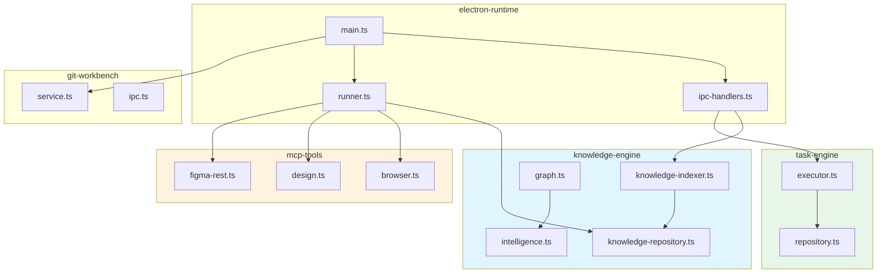

# 核心模块规格

> **本文档目录 ID**：`core-module-specs`
>
> **目的**：为新加入 `tech-cc-hub` 项目的开发者和代码 Agent 提供可检索的模块规格参考，涵盖职责边界、入口文件、依赖关系、常见改造路径和验证方式。

<cite>

**本文引用的文件**

- [src/electron/main.ts](file://src/electron/main.ts)
- [src/electron/libs/knowledge/repowiki/graph.ts](file://src/electron/libs/knowledge/repowiki/graph.ts)
- [src/electron/libs/knowledge/repowiki/intelligence.ts](file://src/electron/libs/knowledge/repowiki/intelligence.ts)
- [src/electron/libs/git/README.md](file://src/electron/libs/git/README.md)
- [src/electron/libs/mcp-tools/README.md](file://src/electron/libs/mcp-tools/README.md)
- [src/electron/libs/task/README.md](file://src/electron/libs/task/README.md)
- [scripts/package-win-safe.mjs](file://scripts/package-win-safe.mjs)
- [scripts/knowledge/run-repowiki.py](file://scripts/knowledge/run-repowiki.py)
- [scripts/after-pack-win-icon.cjs](file://scripts/after-pack-win-icon.cjs)
- [scripts/codex-oauth-setup.mjs](file://scripts/codex-oauth-setup.mjs)
- [scripts/dev-electron.mjs](file://scripts/dev-electron.mjs)
- [scripts/dev.mjs](file://scripts/dev.mjs)
- [test/electron/image-preprocessor-core.test.ts](file://test/electron/image-preprocessor-core.test.ts)
- [test/electron/pathResolverCore.test.ts](file://test/electron/pathResolverCore.test.ts)

</cite>

## 目录

- [1. Electron 主进程入口](#1-electron-主进程入口)
- [2. RepoWiki 知识引擎](#2-repowiki-知识引擎)
- [3. Git 工作台模块](#3-git-工作台模块)
- [4. MCP 工具模块](#4-mcp-工具模块)
- [5. Task 任务引擎](#5-task-任务引擎)
- [6. 打包与构建脚本](#6-打包与构建脚本)
- [7. 开发启动脚本](#7-开发启动脚本)
- [8. Codex OAuth 配置模块](#8-codex-oauth-配置模块)
- [9. 知识库生成器](#9-知识库生成器)
- [10. Agent 改代码地图](#10-agent-改代码地图)

---

## 1. Electron 主进程入口

### 1.1 职责边界

`src/electron/main.ts` 是 Electron 主进程的唯一起口（2918 行），负责：

- **窗口生命周期**：创建 `BrowserWindow`、菜单、快捷键、全局剪贴板
- **IPC handler 注册**：接收 renderer 进程的 invoke 调用
- **插件管理**：Open Computer Use 和 Figma Official 插件的安装、状态检查、OAuth 连接
- **开发桥接**：启动 `dev-backend-bridge`（`DEV_BACKEND_BRIDGE_PORT`）和 channel bridge
- **知识库通道**：注册 `KNOWLEDGE_UI_CHANNELS` 数组中的 12 个 IPC channel

### 1.2 关键符号

| 符号 | 行号 | 职责 |
|------|------|------|
| `getOpenComputerUseVersion` | 132 | 读取已安装插件版本 |
| `getOpenComputerUseLatestVersion` | 150 | 查询 npm registry 最新版本 |
| `installOpenComputerUsePlugin` | 252 | npm 全局安装 + 权限申请 |
| `prepareOpenComputerUsePermissions` | 188 | macOS Accessibility/Screen Recording 授权状态检测 |
| `connectOpenComputerUsePlugin` | 409 | 写入 MCP 配置并激活 |
| `getFigmaOfficialPluginStatus` | 446 | 从 `agent-runtime.json` 读取 Figma 连接状态 |
| `installFigmaOfficialPlugin` | 466 | 安装 Figma MCP server |
| `connectFigmaPatOfficialPlugin` | 492 | 使用 Personal Access Token 连接 |
| `fetchFigmaPatProfile` | 530 | 验证 PAT 有效性并获取用户信息 |
| `parseJsonResponse` | 554 | 统一错误解析 |
| `macPrivacyPaneUrl` | 181 | 生成 macOS 系统隐私设置 URL |

### 1.3 IPC channels（runtime signals）

| Channel | 触发方 | 后端处理文件 |
|---------|--------|--------------|
| `preview-list-directory` | renderer | `main.ts` 内联处理 |
| `preview-list-files` | renderer | `main.ts` 内联处理 |
| `sessions:list` | renderer | `ipc-handlers.ts` |
| `slash-commands:list` | renderer | `ipc-handlers.ts` |
| `plugins:getOpenComputerUseStatus` | UI | `main.ts` L298 |
| `plugins:checkOpenComputerUseUpdate` | UI | `main.ts` L316 |
| `plugins:installOpenComputerUse` | UI | `main.ts` L252 |
| `plugins:updateOpenComputerUse` | UI | `main.ts` L341 |
| `plugins:getFigmaOfficialStatus` | UI | `main.ts` L446 |
| `plugins:installFigmaOfficial` | UI | `main.ts` L466 |
| `plugins:connectFigmaOfficial` | UI | `main.ts` L472/L492 |

### 1.4 关键导入依赖

```typescript
// 来自 ./ipc-handlers.ts
import { handleClientEvent, sessions, cleanupAllSessions,
         setChannelReplySender, listStoredSessionsForRenderer,
         initializeTaskExecutor, initializeNoteRepository } from "./ipc-handlers.js";

// 来自 ./libs/
import { loadApiConfigSettings, saveApiConfigSettings } from "./libs/config-store.js";
import { preprocessImageAttachments } from "./libs/image-preprocessor.js";
import { setBrowserToolHost } from "./libs/mcp-tools/browser.js";
import { startChannelBridge } from "./libs/channel-bridge.js";
import { ensureSystemWorkspace } from "./libs/system-workspace.js";
```

### 1.5 常见改造路径

1. **新增 IPC handler**：在 `main.ts` 用 `ipcMain.handle("channel:name", ...)` 注册，或在对应 libs 模块的 `ipc-handlers.ts` 注册
2. **插件能力扩展**：参考 `installOpenComputerUsePlugin` 模式，调用 `runExternalCli` 执行 npm install，再用 MCP SDK 的 `Client` 连接
3. **平台差异化**：用 `process.platform === "darwin"` 判断，macOS 特有逻辑放在 `prepareOpenComputerUsePermissions` 等函数中

### 1.6 验证方式

```bash
# 开发模式启动
npm run dev:electron

# 查看注册的 IPC channels
grep -n "ipcMain.handle" src/electron/main.ts
```

> **章节来源**：[src/electron/main.ts#L27-L96](file://src/electron/main.ts#L27-L96) 导入块

---

## 2. RepoWiki 知识引擎

### 2.1 职责边界

RepoWiki 是本项目的"代码证据地图"生成系统，包含两个核心模块：

- **`graph.ts`**（218 行）：基于 import 语句构建依赖图，执行 PageRank 风格的文件排序
- **`intelligence.ts`**（370 行）：从项目文件中提取 scripts、dependencies、IPC signals、MCP tools、database schema 等结构化情报

### 2.2 关键类和函数

#### `RepoWikiDependencyGraph`

```typescript
// 构造
static buildFromProject(project: RepoWikiProjectContext): RepoWikiDependencyGraph

// 核心方法
rankFiles(): Array<[string, number]>           // PageRank 排序
getCoreFiles(topN = 10): string[]              // Top N 核心文件
getEntryPoints(): string[]                     // 入度 ≤ 1 的文件（入口候选）
getModuleDependencies(): Map<string, Set<string>>  // 模块级依赖
toMermaid(): string                            // 导出 Mermaid 语法
```

#### `buildRepoWikiIntelligence`

```typescript
buildRepoWikiIntelligence(
  project: RepoWikiProjectContext,
  graph: RepoWikiDependencyGraph,
): RepoWikiProjectIntelligence

// 返回结构
{
  scripts: RepoWikiScriptInfo[],           // package.json scripts（最多 28 条）
  dependencies: RepoWikiDependencyInfo[],  // 关键依赖（electron/react/vite 等）
  entrypoints: RepoWikiHighValueFile[],     // 入口文件
  ipcChannels: RepoWikiFileSignal[],        // ipcMain.handle / ipcRenderer.invoke
  mcpTools: RepoWikiFileSignal[],           // MCP tool 定义
  databaseTables: RepoWikiFileSignal[],     // SQLite schema
  runtimeFlows: RepoWikiRuntimeFlow[],      // 运行时流程描述
  agentQuestions: RepoWikiAgentQuestion[],  // 预生成的 Agent 问答对
}
```

### 2.3 模块名映射（`getModuleName`）

| 模块名 | 路径前缀 | 说明 |
|--------|----------|------|
| `electron-runtime` | `src/electron/main.ts`, `ipc-handlers.ts`, `libs/runner.ts` 等 | 主进程核心 |
| `knowledge-engine` | `src/electron/libs/knowledge/` | 知识库引擎 |
| `knowledge-ui` | `src/ui/components/KnowledgePanel.tsx` | 知识库 UI |
| `mcp-tools` | `src/electron/libs/mcp-tools/` | MCP 工具 |
| `task-engine` | `src/electron/libs/task/` | 任务编排 |
| `git-workbench` | `src/electron/libs/git/` | Git 工作台 |
| `ui-state` | `src/ui/store/` | UI 状态 |
| `shared-contracts` | `src/shared/` | 共享契约 |

> **图表来源**：[src/electron/libs/knowledge/repowiki/graph.ts#L33-L141](file://src/electron/libs/knowledge/repowiki/graph.ts#L33-L141)

### 2.4 Mermaid 模块依赖图



> **图表来源**：[src/electron/libs/knowledge/repowiki/graph.ts#L111-L124](file://src/electron/libs/knowledge/repowiki/graph.ts#L111-L124) `getModuleDependencies`

### 2.5 验证方式

```bash
# 运行 RepoWiki 生成（需要 Python 环境）
python scripts/knowledge/run-repowiki.py --help

# 测试 graph 排名
node -e "
import('./src/electron/libs/knowledge/repowiki/graph.js').then(m => {
  console.log(m.getModuleName('src/electron/main.ts'));
  console.log(m.getModuleName('src/electron/libs/mcp-tools/browser.ts'));
})
"
```

> **章节来源**：[src/electron/libs/knowledge/repowiki/intelligence.ts#L50-L93](file://src/electron/libs/knowledge/repowiki/intelligence.ts#L50-L93)

---

## 3. Git 工作台模块

### 3.1 职责边界

右侧 Git 工作台的主进程模块，通过 IPC 向 renderer 提供 git 操作能力。

### 3.2 模块结构

```
src/electron/libs/git/
├── types.ts         # 领域类型、IPC payload/result schema
├── errors.ts        # 错误归一化
├── service.ts       # 唯一 Git 操作入口（使用 simple-git）
├── history.ts       # commit history parser
├── graph.ts         # lightweight graph lane 生成
├── operation-log.ts # 本地高影响操作日志
├── ipc.ts           # Electron IPC handler 注册
└── index.ts         # 对外统一出口
```

### 3.3 IPC 入口

- 注册：`registerGitWorkbenchIpcHandlers` 在 `main.ts` L66 被调用
- 触发：`handleGitWorkbenchInvoke` 处理 renderer 请求

### 3.4 第一版允许的操作

| 操作 | 说明 |
|------|------|
| `status` | 工作区状态 |
| `diff` | 差异查看 |
| `stage` / `unstage` | 暂存区操作 |
| `commit` | 提交 |
| `push` | 普通推送 |
| `branch` create/checkout | 分支管理 |
| `stash` save/apply/drop | 暂存栈 |
| `history` / `graph` | 历史可视化 |

### 3.5 第一版禁止的操作

`reset`、`rebase`、`cherry-pick`、`force push`、`amend`、`squash`、interactive rebase。

> **章节来源**：[src/electron/libs/git/README.md#L1-L34](file://src/electron/libs/git/README.md#L1-L34)

---

## 4. MCP 工具模块

### 4.1 职责边界

集中存放暴露给 Agent 的内置 MCP 工具，避免 `libs` 根目录膨胀。所有工具不直接操作 React UI，返回给模型的内容为摘要、路径和结构化 JSON。

### 4.2 工具清单

| 工具文件 | 主要工具 | 触发场景 |
|---------|----------|----------|
| `browser.ts` | 导航、截图摘要、DOM 查询、样式检查、标注模式 | 用户需要浏览器操作 |
| `design.ts` | `design_inspect_image`、`design_compare_screenshots`、`design_list_artifacts`、`design_read_comparison_report`、`ignoreRegions`、`maxDifferenceRatio`、`ignoreAntialiasing` | UI 还原、设计比对 |
| `figma-rest.ts` | 文件/节点读取、设计树、token 提取、导出图、评论、变量、Dev Resources | Figma 接入 |
| `admin.ts` | 写入 `agent-runtime.json` 的 `env`、`skillCredentials` 等全局参数 | 管理员操作 |

### 4.3 Host 初始化

```typescript
// main.ts L39-40
import { setBrowserToolHost } from "./libs/mcp-tools/browser.js";
import { setDesignToolHost } from "./libs/mcp-tools/design.js";

// 工具的 tool name 暴露在 src/shared/builtin-mcp-registry.ts
```

### 4.4 设计工具默认触发流程

1. 用户给截图/Figma 图并要求生成或修改 UI 代码 → 触发设计工具
2. 单张截图先走 `design_inspect_image` 做语义摘要
3. 已有页面候选图后走 `design_compare_screenshots` 比对
4. 动态区域用 `ignoreRegions`、用 `maxDifferenceRatio` 控制验收阈值

> **章节来源**：[src/electron/libs/mcp-tools/README.md#L1-L23](file://src/electron/libs/mcp-tools/README.md#L1-L23)

---

## 5. Task 任务引擎

### 5.1 职责边界

任务系统主进程代码统一存放在 `src/electron/libs/task/`，负责第三方任务源的编排、执行、持久化和工作区隔离。

### 5.2 模块结构

```
src/electron/libs/task/
├── types.ts              # 任务、IPC payload 领域类型
├── provider-registry.ts  # Provider 注册表和 fallback
├── providers/            # 外部任务源适配器（目前含 Lark）
├── repository.ts         # SQLite schema、任务状态持久化
├── workflow.ts           # Symphony-style workflow 配置
├── workspace.ts          # 任务独立 workspace 创建
├── executor.ts           # 编排器：同步、自动执行、并发、重试、恢复
└── index.ts              # 对外统一出口
```

### 5.3 Executor 核心职责

- 同步、自动执行、并发控制
- 重试（带 stall 检测）
- 恢复（从 checkpoint 继续）
- 日志事件发射
- 会话归档触发

### 5.4 运行原则

| 原则 | 说明 |
|------|------|
| Provider 隔离 | 只负责第三方任务映射，不改 UI 或会话 |
| Repository 隔离 | 只做持久化，不启动 runner |
| Executor 唯一调度 | 所有执行路径必须经过 executor |
| Workspace 隔离 | 每个任务独立 workspace，避免互相污染 |

> **章节来源**：[src/electron/libs/task/README.md#L1-L23](file://src/electron/libs/task/README.md#L1-L23)

---

## 6. 打包与构建脚本

### 6.1 `package-win-safe.mjs`

Windows 打包主脚本（186 行），实现三级降级策略：

| 策略 | 命令 | 说明 |
|------|------|------|
| Primary | `electron-builder --win --x64` | 完整打包（.exe + .zip） |
| Fallback-dir | `electron-builder --win --x64 --dir` | 目录输出 |
| Fallback-no-sign-flag | `electron-builder --win --x64 --dir --config.asar=true` | 禁用签名 |

**关键流程**：

```javascript
// L139-183 main 函数
cleanOldArtifacts()           // 清理旧的 win-unpacked 和 exe
run("npm run transpile:electron")  // 预编译 Electron 代码
run("npm run build")           // 主构建
runWithFallback(...)           // 依次尝试三个策略
createStableOutputs()          // 生成时间戳命名的稳定产物
// 产物命名：tech-cc-hub-win-x64-{YYYYMMDD}.exe
```

**环境变量**：
```javascript
CSC_IDENTITY_AUTO_DISCOVERY: "false"  // 禁用代码签名
SIGNTOOL_PATH: ""                      // 清空签名工具路径
```

### 6.2 `after-pack-win-icon.cjs`

Electron-builder afterPack hook，用于在打包完成后替换 Windows exe 图标。

```javascript
// 依赖 rcedit.exe 修改 PE 文件图标
const rceditPath = path.join(projectDir, "node_modules", "electron-winstaller", "vendor", "rcedit.exe");
spawnSync(rceditPath, [exePath, "--set-icon", iconPath]);
```

### 6.3 验证方式

```bash
# Windows 打包
node scripts/package-win-safe.mjs

# 检查产物
ls dist/tech-cc-hub-win-x64-*.exe
ls dist/tech-cc-hub-win-unpacked-*.zip
```

> **章节来源**：[scripts/package-win-safe.mjs#L138-L183](file://scripts/package-win-safe.mjs#L138-L183)

---

## 7. 开发启动脚本

### 7.1 `dev.mjs`

Node.js 并行任务管理器（66 行），同时启动 React 和 Electron 开发服务：

```javascript
startTask("react", ["run", "dev:react"]);    // npm run dev:react
startTask("electron", ["run", "dev:electron"]); // npm run dev:electron
```

- 任意子进程以 code 0 退出 → 全部终止（正常退出）
- 任意子进程以非零 code 退出 → 全部以相同 code 终止
- 捕获 `SIGINT` / `SIGTERM` → `stopAll(0)`

### 7.2 `dev-electron.mjs`

Electron 特殊准备脚本（150 行），解决 macOS 代码签名问题：

| 函数 | 职责 |
|------|------|
| `prepareMacElectronDist()` | 检查/缓存/重新签名 `Electron.app` |
| `cleanMacExtendedAttributes()` | 清除 `com.apple.FinderInfo` 等扩展属性避免 Gatekeeper 问题 |
| `verifyCodesign()` | 用 `codesign --verify --deep` 验证签名 |
| `electronVersionLabel()` | 从 `package.json` 提取 Electron 版本 |

**签名缓存路径**：`~/Library/Caches/tech-cc-hub/electron-{version}-dist`

### 7.3 验证方式

```bash
# 完整开发启动
npm run dev

# 或分别启动
npm run dev:react    # 启动 Vite 开发服务器
npm run dev:electron # 启动 Electron（走 dev-electron.mjs）
```

> **章节来源**：[scripts/dev.mjs#L1-L66](file://scripts/dev.mjs#L1-L66) 和 [scripts/dev-electron.mjs#L72-L108](file://scripts/dev-electron.mjs#L72-L108)

---

## 8. Codex OAuth 配置模块

### 8.1 职责边界

`scripts/codex-oauth-setup.mjs`（295 行）是 Codex（ChatGPT）OAuth 认证的配置管理脚本，负责：

- 读取/写入 `api-config.json`
- 将 `.codex/auth.json` 凭证转换为内联 API 配置
- 支持多 profile 管理

### 8.2 关键配置路径

| 平台 | 默认路径 |
|------|----------|
| Windows | `%APPDATA%/tech-cc-hub/api-config.json` |
| macOS | `~/Library/Application Support/tech-cc-hub/api-config.json` |
| Linux | `$XDG_CONFIG_HOME/tech-cc-hub/api-config.json` |
| Codex auth | `~/.codex/auth.json` |

### 8.3 支持的模型

```javascript
const BASE_MODELS = [
  "gpt-5.5", "gpt-5.4", "gpt-5.4-mini",
  "gpt-5.3-codex", "gpt-5.3-codex-spark",
  "gpt-5", "gpt-5-codex", "gpt-5-codex-mini",
  "gpt-5.1", "gpt-5.1-codex", "gpt-5.1-codex-max", "gpt-5.1-codex-mini",
  "gpt-5.2", "gpt-5.2-codex",
];
// 每个模型还生成一个 -openai-compact 后缀变体
```

### 8.4 凭证转换

```javascript
codexAuthToCredential(parsed): {
  id_token?, access_token, refresh_token?,
  account_id, email?, type: "codex",
  expired?, last_refresh: ISO8601
}
```

### 8.5 验证方式

```bash
# 交互式 OAuth 设置
node scripts/codex-oauth-setup.mjs

# 指定 profile 名称
node scripts/codex-oauth-setup.mjs --profileName="My Codex"
```

> **章节来源**：[scripts/codex-oauth-setup.mjs#L56-L139](file://scripts/codex-oauth-setup.mjs#L56-L139)

---

## 9. 知识库生成器

### 9.1 职责边界

`scripts/knowledge/run-repowiki.py`（1983 行）是 RepoWiki 生成管道的 Python 适配器，调用 vendored 的 `he-yufeng/RepoWiki` 引擎。

### 9.2 核心流程

```python
# L33-40 导入 vendored 引擎
from repowiki.core.analyzer import Analyzer
from repowiki.core.cache import Cache
from repowiki.core.graph import DependencyGraph
from repowiki.core.wiki_builder import WikiBuilder
from repowiki.export.markdown import export_markdown
from repowiki.ingest.local import ingest_local
from repowiki.llm.client import LLMClient
```

**增量生成策略**：

1. `_project_source_hash()` → 计算当前源码哈希
2. `_read_previous_metadata()` → 读取上次 `meta/repowiki-metadata.json`
3. `_diff_file_hashes()` → 对比 added/modified/deleted 文件
4. `_catalog_depends_on_changed_files()` → 判断哪些 catalog 需要重写

### 9.3 文件过滤规则

```python
# 排除目录
".git/", ".tech/", ".qoder/", ".venv/", "node_modules/", "dist/", "third_party/", ...

# 排除扩展名
".png", ".jpg", ".lock", ".sqlite", ".wasm", ".ttf", ...
```

### 9.4 关键常量

| 常量 | 值 | 说明 |
|------|-----|------|
| `DEFAULT_INCREMENTAL_MAX_CHANGED_FILES` | 40 | 增量模式最大变更文件数 |
| `DEFAULT_INCREMENTAL_CHANGE_RATIO` | 0.25 | 变更比例阈值 |
| `DEFAULT_REPOWIKI_MAX_PAGES` | 96 | 单次生成最大页数 |
| `ESTIMATED_OUTPUT_TOKENS_PER_PAGE` | 7000 | 每页 token 估算 |

### 9.5 验证方式

```bash
# 全量生成
python scripts/knowledge/run-repowiki.py

# 增量生成（只处理变更文件）
python scripts/knowledge/run-repowiki.py --incremental

# 查看生成产物
ls doc/repowiki/
```

> **章节来源**：[scripts/knowledge/run-repowiki.py#L1-L112](file://scripts/knowledge/run-repowiki.py#L1-L112)

---

## 10. Agent 改代码地图

### 10.1 先读文件清单

| 优先级 | 文件 | 理由 |
|--------|------|------|
| P0 | `src/electron/main.ts` | 主进程入口，IPC 必读 |
| P0 | `src/electron/libs/knowledge/repowiki/graph.ts` | 模块名映射、依赖图构建 |
| P0 | `src/electron/libs/knowledge/repowiki/intelligence.ts` | 情报提取逻辑 |
| P1 | `scripts/dev.mjs` | 开发启动流程 |
| P1 | `scripts/package-win-safe.mjs` | 打包流程 |
| P2 | `src/electron/libs/git/README.md` | Git 模块边界 |
| P2 | `src/electron/libs/mcp-tools/README.md` | MCP 工具边界 |
| P2 | `src/electron/libs/task/README.md` | Task 模块边界 |

### 10.2 关键符号速查表

#### IPC channels（source-of-truth = `src/electron/main.ts`）

| Channel | 方向 | 处理函数 |
|---------|------|----------|
| `preview-list-directory` | renderer→main | 内联 L119+ |
| `sessions:list` | renderer→main | `ipc-handlers.ts` |
| `plugins:installOpenComputerUse` | renderer→main | `main.ts` L252 |
| `plugins:connectFigmaOfficial` | renderer→main | `main.ts` L472/L492 |
| `knowledge:run-generation` | renderer→main | `knowledge-ui-store.ts` |

#### MCP tools（source-of-truth = `src/electron/libs/mcp-tools/` + `src/shared/builtin-mcp-registry.ts`）

| Tool | 定义文件 | 用途 |
|------|----------|------|
| `design_inspect_image` | `mcp-tools/design.ts` | 单张截图语义摘要 |
| `design_compare_screenshots` | `mcp-tools/design.ts` | 两张图比对 |
| `design_list_artifacts` | `mcp-tools/design.ts` | 列出比对产物 |
| `browser_navigate` | `mcp-tools/browser.ts` | 浏览器导航 |

#### 数据库表（source-of-truth = `src/electron/libs/knowledge/knowledge-repository.ts`）

| 表/索引 | 类型 |
|---------|------|
| `documents` | SQLite |
| `chunks` | SQLite |
| `documents_fts` | FTS5 |
| `chunks_vec` | sqlite-vec |

### 10.3 修改入口

#### 新增 IPC handler

```typescript
// 1. 在 main.ts 注册（短流程）
ipcMain.handle("my:channel", async (event, ...args) => {
  // 处理逻辑
});

// 或在对应模块的 ipc-handlers.ts 注册（复杂逻辑）
// 然后在 main.ts 调用 registerXxxHandlers()
```

#### 新增 MCP tool

```typescript
// 1. 在 src/electron/libs/mcp-tools/ 新建 xxx.ts
// 2. 在 main.ts 调用 setXxxToolHost()
// 3. 在 src/shared/builtin-mcp-registry.ts 注册 tool metadata
```

#### 新增 knowledge 通道

```typescript
// 1. 在 main.ts L119 KNOWLEDGE_UI_CHANNELS 数组添加 channel 名
// 2. 在 knowledge-ui-store.ts 实现 handler
```

### 10.4 验证命令

| 场景 | 命令 |
|------|------|
| Electron 启动 | `npm run dev:electron` |
| 全量开发启动 | `npm run dev` |
| 单元测试 | `npm test` |
| 特定测试文件 | `node --test test/electron/pathResolverCore.test.ts` |
| Windows 打包 | `node scripts/package-win-safe.mjs` |
| RepoWiki 生成 | `python scripts/knowledge/run-repowiki.py` |
| 检查 IPC 注册 | `grep "ipcMain.handle" src/electron/main.ts` |

### 10.5 常见回归风险

| 风险点 | 症状 | 排查方式 |
|--------|------|----------|
| `process.platform` 分支遗漏 | macOS 功能在 Windows 上报错 | 搜索所有 `darwin`/`win32` 判断 |
| IPC channel 未注册 | renderer invoke 返回 `channel not found` | 检查 `KNOWLEDGE_UI_CHANNELS` 和 `ipcMain.handle` |
| MCP tool host 未设置 | tool 调用时无响应 | 检查 `main.ts` 的 `setXxxToolHost()` 调用 |
| 代码签名缓存失效 | macOS 启动失败 | 删除 `~/Library/Caches/tech-cc-hub/` |
| sqlite-vec 未加载 | 向量检索返回空 | 检查 `better-sqlite3` 和 `sqlite-vec` 是否正确构建 |
| knowledge workspace 未同步 | 新增文件不在索引中 | 运行 `python scripts/knowledge/run-repowiki.py --incremental` |

### 10.6 运行时刷新边界

| 组件 | 变更后是否需要重启 |
|------|-------------------|
| `src/electron/main.ts` | 必须重启 Electron |
| `src/electron/libs/`（大多数） | 必须重启 Electron |
| `src/ui/`（React 组件） | Vite HMR 自动生效 |
| `src/ui/store/` | 需要刷新页面 |
| `scripts/` | 下次运行脚本时生效 |
| `doc/`（文档） | 下次 RepoWiki 生成时生效 |
| `package.json` scripts | 下次 `npm install` 时生效 |

---

## 附录：测试文件速查

| 测试文件 | 被测函数 | 关键断言 |
|----------|----------|----------|
| `test/electron/image-preprocessor-core.test.ts` | `preprocessImageAttachmentsCore` | 图片摘要为空时保留 dispatchable attachment |
| `test/electron/pathResolverCore.test.ts` | `resolveAppAssetPath` | 生产环境资源路径保持在 app root 内 |

> **章节来源**：[test/electron/pathResolverCore.test.ts#L6-L9](file://test/electron/pathResolverCore.test.ts#L6-L9)
</details>
