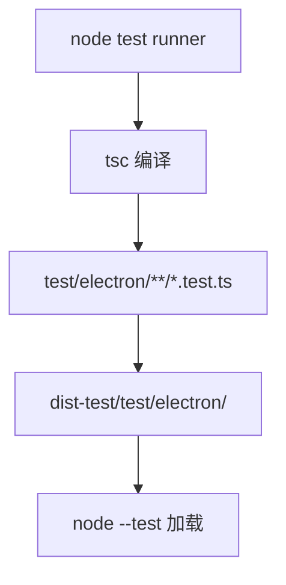
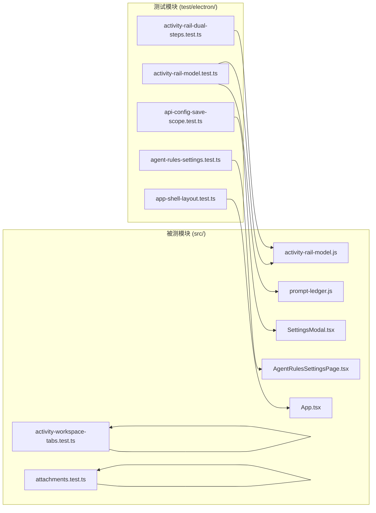
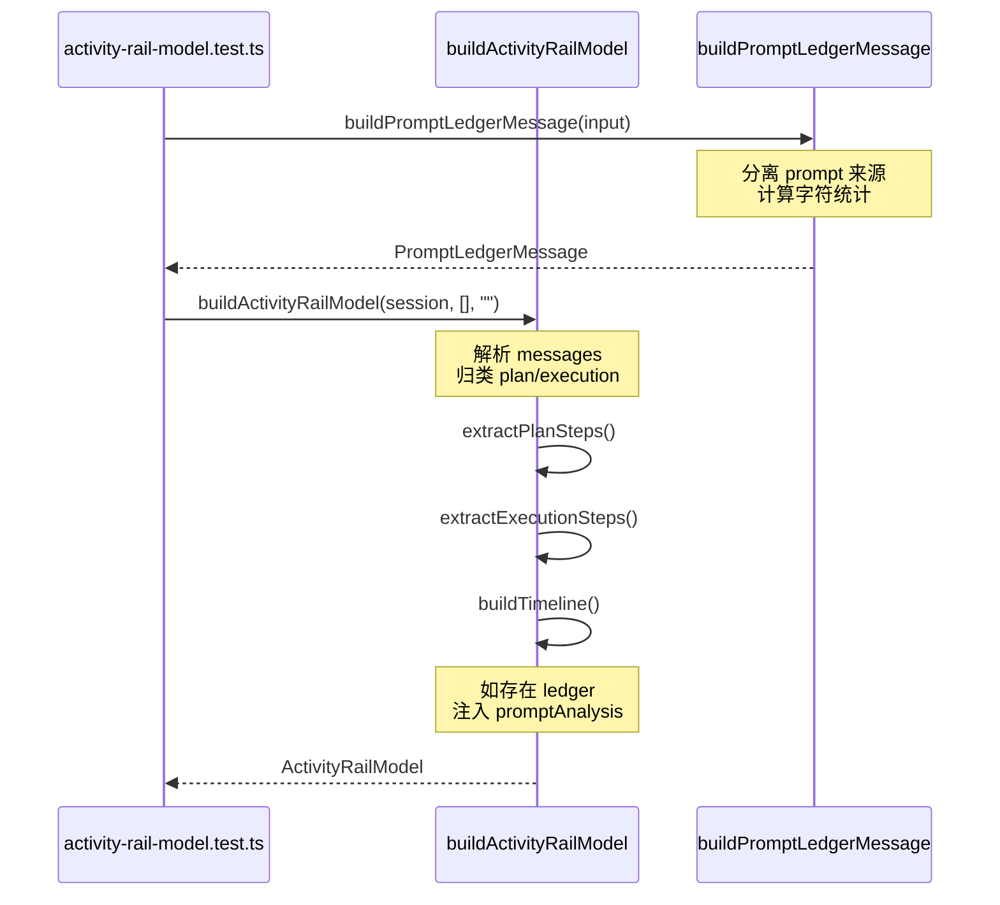
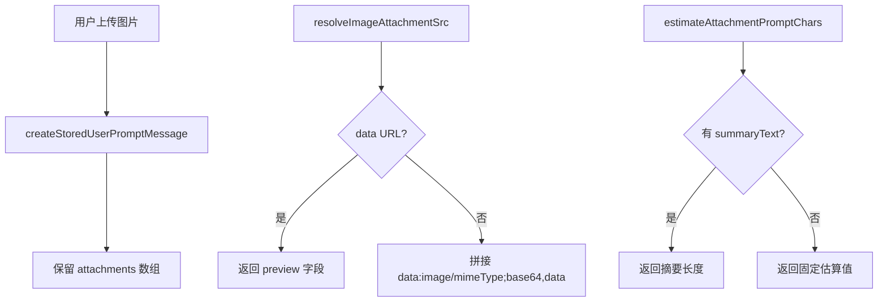
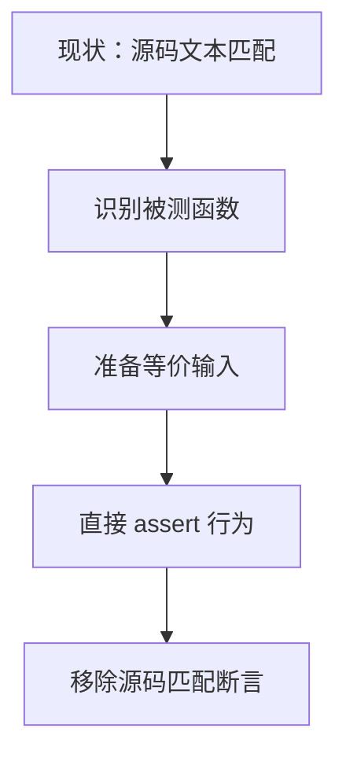

# 测试体系总览

<cite>
**本文引用的文件**

- [test/electron/tsconfig.json](file://test/electron/tsconfig.json)
- [test/electron/activity-rail-dual-steps.test.ts](file://test/electron/activity-rail-dual-steps.test.ts)
- [test/electron/activity-rail-model.test.ts](file://test/electron/activity-rail-model.test.ts)
- [test/electron/activity-workspace-tabs.test.ts](file://test/electron/activity-workspace-tabs.test.ts)
- [test/electron/agent-rules-settings.test.ts](file://test/electron/agent-rules-settings.test.ts)
- [test/electron/api-config-save-scope.test.ts](file://test/electron/api-config-save-scope.test.ts)
- [test/electron/app-shell-layout.test.ts](file://test/electron/app-shell-layout.test.ts)
- [test/electron/attachments.test.ts](file://test/electron/attachments.test.ts)
- [src/electron/libs/git/README.md](file://src/electron/libs/git/README.md)
</cite>

## 目录

- [职责定位](#职责定位)
- [入口与配置](#入口与配置)
- [测试模块协作图](#测试模块协作图)
- [核心测试数据结构](#核心测试数据结构)
- [调用链与依赖关系](#调用链与依赖关系)
- [扩展点分析](#扩展点分析)
- [常见失败模式](#常见失败模式)
- [验证命令](#验证命令)
- [改造路径指南](#改造路径指南)

---

## 职责定位

`tech-cc-hub` 的测试体系位于 `test/electron/` 目录，采用 **Node.js 原生 test runner**（`node:test`）而非 Jest/Vitest。这一设计选择直接影响测试的编写模式、断言风格和模块边界。

**职责边界**：

| 模块 | 职责 |
|------|------|
| `activity-rail-model.test.ts` | 验证 ActivityRail 数据模型构建逻辑，包括计划步骤/执行步骤分离、Prompt 分析、生命周期事件归类 |
| `activity-rail-dual-steps.test.ts` | 专项验证"双步骤"模式（plan + execution 分离展示）的正确性 |
| `activity-workspace-tabs.test.ts` | 验证工作区标签页的可见性规则和默认状态 |
| `agent-rules-settings.test.ts` | 验证 Agent 规则设置页的文档刷新行为 |
| `api-config-save-scope.test.ts` | 验证 API 配置的脏检查逻辑，防止不必要的写入 |
| `app-shell-layout.test.ts` | 验证应用布局的 CSS 类名和响应式断点 |
| `attachments.test.ts` | 验证附件的序列化、路径解析和字符估算 |

**不在测试范围内的模块**：

- `src/electron/libs/git/`：Git 操作在主进程执行，目前无对应测试（见 [Git README](file://src/electron/libs/git/README.md#L1-L4)）
- E2E 测试：当前测试套件为单元级，页面交互由手动验收覆盖

---

## 入口与配置

### tsconfig.json 入口

测试入口配置文件为 `test/electron/tsconfig.json`，关键配置如下：

```json
{
  "compilerOptions": {
    "strict": true,
    "target": "ESNext",
    "module": "NodeNext",
    "outDir": "../../dist-test",
    "rootDir": "../..",
    "jsx": "react-jsx",
    "skipLibCheck": true,
    "types": ["node", "../../types"]
  },
  "include": ["./**/*.test.ts"]
}
```

**配置解读**：

- `strict: true`：启用全部严格类型检查，测试必须提供完整的类型声明（见 [activity-rail-dual-steps.test.ts#L43](file://test/electron/activity-rail-dual-steps.test.ts#L43) 的 `as never` 用法）
- `module: NodeNext`：使用 Node.js ESM 模式，导入需要 `.js` 后缀
- `jsx: react-jsx`：允许测试文件内联 JSX（用于源码字符串匹配）
- `include` 限定只扫描 `**/*.test.ts`，避免意外编译其他文件

章节来源：[test/electron/tsconfig.json#L1-L18](file://test/electron/tsconfig.json#L1-L18)

### 测试发现机制



测试通过 `node --test` 或 `npm test` 发现，Node.js test runner 默认递归扫描 `.test.ts` 文件。

---

## 测试模块协作图



**协作特点**：

- **直接导入型**：大多数测试直接 `import` 被测函数，如 `buildActivityRailModel`、`buildPromptLedgerMessage`
- **源码匹配型**：部分测试使用 `readFileSync` 读取源文件，通过 `assert.match` 验证实现细节（如布局、CSS 类名）
- **无跨进程测试**：所有测试运行在 Node.js 环境，不涉及 Electron 渲染进程

章节来源：基于测试文件 import 语句分析

---

## 核心测试数据结构

### ActivityRailModel 的测试数据

`buildActivityRailModel` 接收的输入结构决定了测试的组织方式：

```typescript
// 最小输入示例
{
  id: "session-1",
  title: "Trace Session",
  status: "completed",
  messages: [
    { type: "user_prompt", prompt: "修复右侧执行分析面板" },
    { type: "assistant", uuid: "assistant-1", message: { /* ... */ } },
    { type: "user", uuid: "user-1", message: { role: "user", content: [/* ... */] } },
  ]
}
```

**关键测试场景**（见 [activity-rail-model.test.ts#L66-L163](file://test/electron/activity-rail-model.test.ts#L66-L163)）：

| 场景 | 输入特征 | 验证断言 |
|------|----------|----------|
| Prompt 分析 | 包含 `prompt_ledger` 类型的 message | `model.promptAnalysis` 存在且包含 buckets |
| 生命周期复用 | 两个 `init` 系统消息同一 session | 第二个 `lifecycle` 项标题为"复用执行环境" |
| 上下文分布 | 带 attachments 和多 prompt | `contextDistribution.buckets` 包含 `sourceKind` |

### PromptLedger 的测试数据

`buildPromptLedgerMessage` 的输入结构（见 [activity-rail-model.test.ts#L8-L62](file://test/electron/activity-rail-model.test.ts#L8-L62)）：

```typescript
{
  phase: "continue",
  model: "GLM-5.1-FP8",
  cwd: "D:/workspace/ligu",
  prompt: "继续修复 OMG 报表",
  attachments: [{ name: "需求截图.png", kind: "image", chars: 4096 }],
  promptSources: [
    { id: "system-preset", label: "Claude Code preset", sourceKind: "system", ... },
    { id: "project-agents", label: "项目 AGENTS.md", sourceKind: "project", ... },
  ],
  memorySources: [
    { id: "summary", label: "滚动摘要", sourceKind: "memory", ... },
  ],
  historyMessages: [/* ... */]
}
```

**输出验证点**：

- `ledger.type === "prompt_ledger"`
- `ledger.buckets` 按 `sourceKind` 归类
- `ledger.segments` 包含 `history_tool_input` 和 `history_tool_output` 类型
- `ledger.totalChars > 4096`（包含历史输入）

---

## 调用链与依赖关系

### ActivityRail 模型构建链



### 附件处理链

`attachments.test.ts` 验证的调用链（见 [attachments.test.ts#L29-L46](file://test/electron/attachments.test.ts#L29-L46)）：



---

## 扩展点分析

### 新增测试文件

**步骤 1**：在 `test/electron/` 创建 `*.test.ts` 文件

```typescript
import test from "node:test";
import assert from "node:assert/strict";

// 导入被测模块
import { someFunction } from "../../src/shared/some-module.js";

test("feature description", () => {
  const result = someFunction(input);
  assert.equal(result.expected, result.actual);
});
```

**步骤 2**：确保 tsconfig.json 的 `include` 模式覆盖新文件（当前为 `**/*.test.ts`，通常自动覆盖）

**步骤 3**：运行 `node --test test/electron/new-file.test.ts` 验证

### 扩展现有测试模式

**场景 A**：添加新的 ActivityRail 输入类型

```typescript
// 在 activity-rail-model.test.ts 中添加
test("handles new message type", () => {
  const model = buildActivityRailModel({
    id: "session-new-type",
    messages: [
      { type: "user_prompt", prompt: "test" },
      { type: "new_type", subtype: "custom", /* ... */ },
    ]
  });
  assert.ok(model.timeline.some(item => item.nodeKind === "custom"));
});
```

**场景 B**：验证新的 UI 组件布局

在 `app-shell-layout.test.ts` 中添加源码匹配：

```typescript
test("new component respects responsive bounds", () => {
  const appSource = readFileSync(join(process.cwd(), "src/ui/App.tsx"), "utf8");
  assert.match(appSource, /NewComponent.*className=.*clamp\(/);
});
```

章节来源：[app-shell-layout.test.ts#L6-L20](file://test/electron/app-shell-layout.test.ts#L6-L20)

---

## 常见失败模式

### 1. 类型断言不完整

**症状**：`TypeScript error: Property 'xxx' does not exist on type`

**原因**：测试使用 `as never` 简化类型，但遗漏了必需字段

```typescript
// 错误示例
{ type: "assistant", message: {} }  // 缺少 role, content 等

// 正确示例（参考 activity-rail-dual-steps.test.ts#L46-L66）
{
  type: "assistant",
  uuid: "assistant-read",
  message: {
    id: "assistant-read",
    role: "assistant",
    type: "message",
    content: [{ type: "tool_use", id: "tool-read", name: "Read", input: {} }],
  } as never,
}
```

### 2. 脏检查逻辑误判

**症状**：`apiConfigDirty` 始终为 `false`，导致配置不保存

**诊断**：检查 `api-config-save-scope.test.ts` 中的匹配模式是否覆盖所有 setter 调用

```typescript
// 需要验证所有修改 dirty 状态的路径
assert.match(source, /setApiConfigDirty\(true\)/);  // 任意修改都设 dirty
```

章节来源：[api-config-save-scope.test.ts#L8-L13](file://test/electron/api-config-save-scope.test.ts#L8-L13)

### 3. 路径解析在 CI 环境失败

**症状**：`readFileSync` 找不到源文件

**原因**：`process.cwd()` 在不同执行环境返回不同路径

**修复**：使用 `import.meta.dirname` 或显式相对路径

```typescript
import { fileURLToPath } from "node:url";
const __dirname = fileURLToPath(new URL(".", import.meta.url));
const appSource = readFileSync(join(__dirname, "../../src/ui/App.tsx"), "utf8");
```

参考：[app-shell-layout.test.ts#L4-L9](file://test/electron/app-shell-layout.test.ts#L4-L9)

---

## 验证命令

### 运行全部测试

```bash
node --test test/electron/*.test.ts
```

或通过 npm scripts（需确认 `package.json` 配置）：

```bash
npm test
```

### 运行单个测试文件

```bash
node --test test/electron/activity-rail-model.test.ts
```

### 运行包含特定关键词的测试

```bash
node --test --test-name-pattern="prompt ledger" test/electron/*.test.ts
```

### TypeScript 类型检查（独立于测试）

```bash
npx tsc --project test/electron/tsconfig.json --noEmit
```

### 调试输出

```bash
NODE_OPTIONS="--inspect" node --test test/electron/attachments.test.ts
```

---

## 改造路径指南

### 从源码匹配转向直接测试

**现状**：部分测试依赖 `readFileSync` 匹配源码文本（如 `agent-rules-settings.test.ts`）

**改造目标**：将间接验证改为直接函数调用测试



**示例**：

```typescript
// 改造前
test("agent rules tabs reload", () => {
  const pageSource = readFileSync("src/ui/components/settings/AgentRulesSettingsPage.tsx", "utf8");
  assert.match(pageSource, /onRefreshDocuments/);
});

// 改造后（如有导出的 handler）
test("agent rules tabs reload", async () => {
  const mockRefresh = vi.fn().mockResolvedValue(undefined);
  render(<AgentRulesSettingsPage onRefreshDocuments={mockRefresh} />);
  // 模拟 tab 切换
  expect(mockRefresh).toHaveBeenCalled();
});
```

### 添加 Git 模块测试

根据 [Git README](file://src/electron/libs/git/README.md#L1-L4) 的说明，Git 操作在主进程，测试需要：

1. **模拟 IPC**：由于无渲染进程环境，使用 Mock 或 Stub
2. **或者**：将纯函数逻辑抽取到 `src/shared/` 目录，直接导入测试

```typescript
// 方案 A：测试纯函数
import { parseGitStatus } from "../../src/electron/libs/git/parser.js";

test("parseGitStatus extracts staged files", () => {
  const raw = "M  file1.ts\nM  file2.ts\n?? untracked.txt";
  const result = parseGitStatus(raw);
  assert.equal(result.staged.length, 2);
  assert.equal(result.untracked[0], "untracked.txt");
});
```

### 扩展 PromptLedger 覆盖

当前 `buildPromptLedgerMessage` 测试覆盖了：
- 基础字段（phase, model, cwd）
- 多种 promptSources（system, project, skill, memory）
- historyMessages（assistant, user 类型）

**待补充场景**：
- 空的 promptSources
- 超长附件（>1MB）
- 多轮对话历史（>10 条）
- 含错误结果的 tool_result

---

## 附录：测试模式速查

| 模式 | 适用场景 | 示例 |
|------|----------|------|
| `assert.equal` | 精确值比对 | `assert.equal(model.planSteps.length, 3)` |
| `assert.deepEqual` | 对象/数组比对 | `assert.deepEqual(visibleTabs, ["preview", "trace"])` |
| `assert.match` | 正则匹配源码 | `assert.match(appSource, /clamp\(/)` |
| `assert.ok` | 布尔条件 | `assert.ok(chars < 1_000)` |
| `assert.doesNotMatch` | 负面断言 | `assert.doesNotMatch(appSource, /showFeedbackDialog/)` |
| `as never` | 跳过类型检查 | `{ type: "assistant" } as never` |

---

**文档版本**：1.0.0
**最后更新**：基于 `test/electron/` 目录当前状态
**维护者**：项目开发者