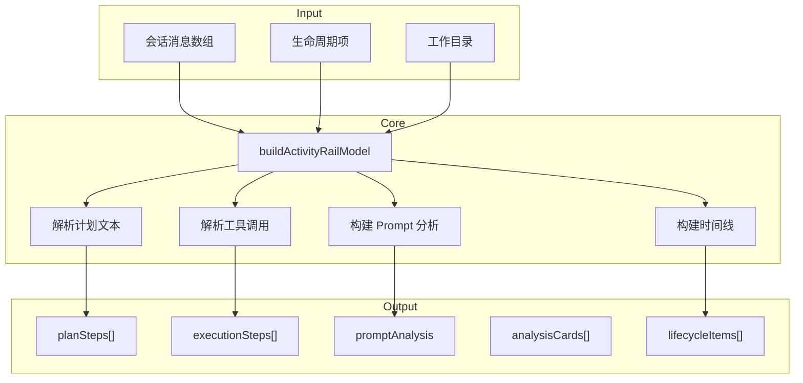
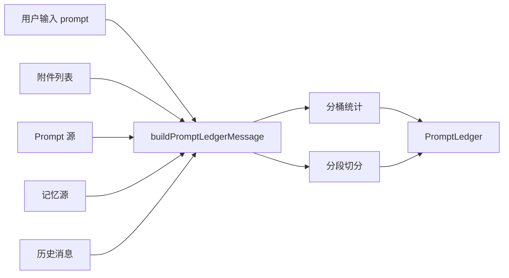
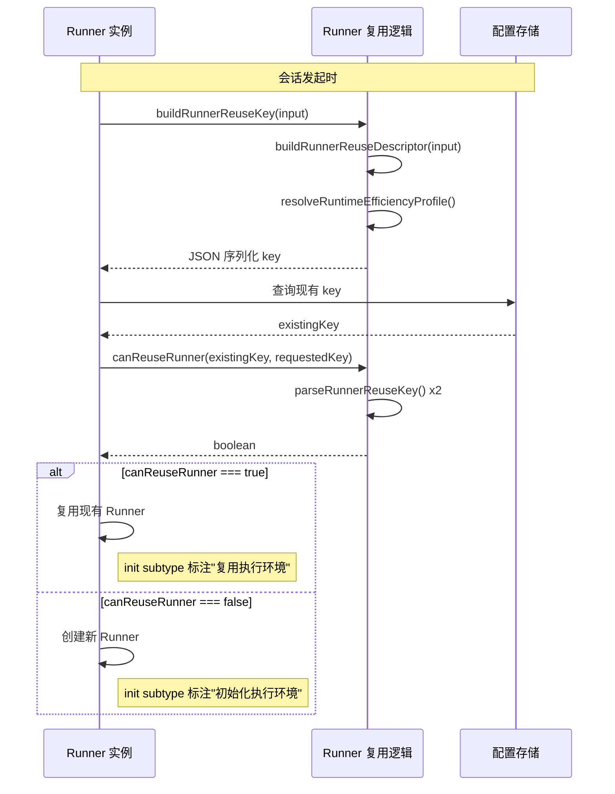
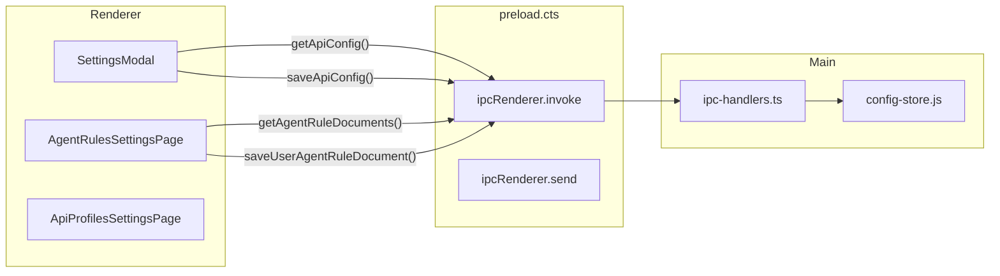

# 测试体系总览

<cite>

**本文引用的文件**

- [test/electron/tsconfig.json](file://test/electron/tsconfig.json)
- [test/electron/activity-rail-dual-steps.test.ts](file://test/electron/activity-rail-dual-steps.test.ts)
- [test/electron/activity-rail-model.test.ts](file://test/electron/activity-rail-model.test.ts)
- [test/electron/activity-workspace-tabs.test.ts](file://test/electron/activity-workspace-tabs.test.ts)
- [test/electron/agent-rules-settings.test.ts](file://test/electron/agent-rules-settings.test.ts)
- [test/electron/api-config-save-scope.test.ts](file://test/electron/api-config-save-scope.test.ts)
- [test/electron/app-shell-layout.test.ts](file://test/electron/app-shell-layout.test.ts)
- [test/electron/attachments.test.ts](file://test/electron/attachments.test.ts)
- [src/electron/libs/runner.ts](file://src/electron/libs/runner.ts#L1-L106)
- [src/electron/libs/runner-reuse.ts](file://src/electron/libs/runner-reuse.ts#L1-L119)
- [src/electron/main.ts](file://src/electron/main.ts#L1-L131)
- [src/electron/preload.cts](file://src/electron/preload.cts#L1-L206)
- [src/electron/libs/system-prompt-presets.ts](file://src/electron/libs/system-prompt-presets.ts#L1-L176)
- [src/ui/components/settings/AboutPage.tsx](file://src/ui/components/settings/AboutPage.tsx#L1-L314)
- [src/ui/components/settings/AgentRulesSettingsPage.tsx](file://src/ui/components/settings/AgentRulesPage.tsx#L1-L115)
- [src/ui/components/settings/ApiProfilesSettingsPage.tsx](file://src/ui/components/settings/ApiProfilesSettingsPage.tsx#L1-L959)
- [src/ui/components/settings/ChannelsSettingsPage.tsx](file://src/ui/components/settings/ChannelsSettingsPage.tsx#L1-L792)
- [src/ui/components/settings/CodeEditor.tsx](file://src/ui/components/settings/CodeEditor.tsx#L1-L98)

</cite>

## 目录

- [1. 职责与设计目标](#1-职责与设计目标)
- [2. 入口与执行环境](#2-入口与执行环境)
- [3. 调用链总览](#3-调用链总览)
- [4. 核心数据结构](#4-核心数据结构)
- [5. 测试模块详解](#5-测试模块详解)
- [6. 前后端桥接与 IPC](#6-前后端桥接与-ipc)
- [7. 扩展点与 Hook 机制](#7-扩展点与-hook-机制)
- [8. 常见改造路径](#8-常见改造路径)
- [9. 验证命令](#9-验证命令)
- [10. Agent 改代码地图](#10-agent-改代码地图)

---

## 1. 职责与设计目标

`module-tests` 负责验证 tech-cc-hub 的会话状态建模、UI 布局行为、设置页脏检查逻辑和附件处理流程。测试不覆盖 Runner 与模型的集成，而是通过纯函数单元测试确保：

1. **`buildActivityRailModel`** 能从会话消息中提取 `planSteps`、`executionSteps`、`promptAnalysis`、`analysisCards` 等模型字段
2. **`buildActivityWorkspaceTabs`** 能根据 `activeTab` 和 `showBrowserTab` 计算可见标签列表
3. **`SettingsModal`** 中的脏检查和保存范围逻辑正确
4. **附件处理** 函数能正确估算 token 而非使用原始字节数
5. **布局规则**（最大宽度、响应式 clamp）符合设计规范

> **章节来源**：[test/electron/tsconfig.json#L1-L18](file://test/electron/tsconfig.json#L1-L18) — 测试编译配置使用 `NodeNext` 模块和 `strict` 模式

---

## 2. 入口与执行环境

### 2.1 测试执行入口

测试使用 Node.js 内置的 `node:test` 模块，无需外部测试框架。配置位于 `test/electron/tsconfig.json`：

```json
{
  "compilerOptions": {
    "strict": true,
    "target": "ESNext",
    "module": "NodeNext",
    "outDir": "../../dist-test",
    "rootDir": "../..",
    "jsx": "react-jsx",
    "skipLibCheck": true,
    "types": ["node", "../../types"]
  },
  "include": ["./**/*.test.ts"]
}
```

执行方式：

```bash
# 单个测试文件
node --test test/electron/activity-rail-model.test.ts

# 批量执行（需 tsx 或 ts-node）
npx tsx --test test/electron/**/*.test.ts
```

### 2.2 依赖的源代码模块

| 测试文件 | 被测模块 | 源文件 |
|---------|---------|--------|
| `activity-rail-dual-steps.test.ts` | `buildActivityRailModel` | `src/shared/activity-rail-model.js` |
| `activity-rail-model.test.ts` | `buildActivityRailModel`, `buildPromptLedgerMessage` | `src/shared/activity-rail-model.js`, `src/shared/prompt-ledger.js` |
| `activity-workspace-tabs.test.ts` | `buildActivityWorkspaceTabs`, `shouldShowCreateBrowserTab` | `src/ui/utils/activity-workspace-tabs.js` |
| `agent-rules-settings.test.ts` | `AgentRulesSettingsPage` | `src/ui/components/settings/AgentRulesSettingsPage.tsx` |
| `api-config-save-scope.test.ts` | `SettingsModal` 脏检查逻辑 | `src/ui/components/SettingsModal.tsx` |
| `app-shell-layout.test.ts` | `App.tsx`, `ActivityRail.tsx`, `PromptInput.tsx` | `src/ui/App.tsx` 等 |
| `attachments.test.ts` | `createStoredUserPromptMessage`, `estimateAttachmentPromptChars`, `resolveImageAttachmentSrc` | `src/shared/attachments.js` |

> **章节来源**：[test/electron/activity-rail-model.test.ts#L1-L7](file://test/electron/activity-rail-model.test.ts#L1-L7) — 导入被测模块的典型模式

---

## 3. 调用链总览

### 3.1 ActivityRailModel 构建流程



### 3.2 PromptLedger 构建流程



### 3.3 Runner 复用决策链



> **图表来源**：[src/electron/libs/runner-reuse.ts#L29-L74](file://src/electron/libs/runner-reuse.ts#L29-L74)

---

## 4. 核心数据结构

### 4.1 `ActivityRailModel`

```typescript
type ActivityRailModel = {
  id: string;
  title: string;
  status: "running" | "completed" | "error";

  // 计划步骤（从编号列表文本提取）
  planSteps: PlanStep[];
  taskSectionTitle: string;  // 默认"任务步骤"

  // 执行步骤（从 tool_use 提取）
  executionSteps: ExecutionStep[];
  executionSectionTitle: string;  // 默认"步骤汇总"

  // Prompt 分析（来自 PromptLedger）
  promptAnalysis: {
    title: string;  // "Prompt 分析"
    totalChars: number;
    buckets: PromptBucket[];
    segments: PromptSegment[];
    ledgers: PromptLedger[];
  };

  // 分析卡片（如 prompt-hotspot）
  analysisCards: AnalysisCard[];

  // 时间线（含 lifecycle 事件）
  timeline: TimelineItem[];
};
```

**关键字段说明**：

| 字段 | 类型 | 来源 | 说明 |
|-----|------|-----|------|
| `planSteps` | `PlanStep[]` | assistant message 文本中的编号列表 | 包含 `indexLabel`（如 "Step 1"）和 `planStepIds` |
| `executionSteps` | `ExecutionStep[]` | tool_use 消息 | 包含 `title`（工具名称）和 `planStepIds` 映射 |
| `promptAnalysis` | `object` | PromptLedger 嵌入 | 分析 prompt 组成和 token 分布 |

### 4.2 `PromptLedger`

```typescript
type PromptLedger = {
  type: "prompt_ledger";
  phase: "continue" | "start";
  model: string;
  buckets: PromptBucket[];
  segments: PromptSegment[];
  totalChars: number;
};

type PromptBucket = {
  id: string;  // 如 "current-prompt", "project-agents", "skill-doc", "memory"
  sourceKind: "project" | "skill" | "memory" | "system" | "history";
  chars: number;
  label?: string;
  text?: string;
};

type PromptSegment = {
  segmentKind: "current_prompt" | "history_tool_input" | "history_tool_output" | "history_assistant_output";
  toolName?: string;
  round?: number;
  nodeId?: string;
};
```

### 4.3 `RunnerReuseDescriptor`

```typescript
type RunnerReuseDescriptor = {
  cwd: string;
  model: string;
  permissionMode: string;
  reasoningMode: string;
  outputFormat: string;
  runSurface: "development" | "maintenance";
  agentId: string;
  allowedTools: string;
  runtimeProfile: string;
  builtinMcpServers: BuiltinMcpServerName[];
};
```

### 4.4 `ApiConfigProfile` 与脏检查

```typescript
// SettingsModal 中的脏检查状态
const [apiConfigDirty, setApiConfigDirty] = useState(false);

// 保存逻辑（仅当 dirty 时写入）
const profileError = apiConfigDirty ? validateProfiles(normalizedProfiles) : null;
if (apiConfigDirty) {
  window.electron.saveApiConfig({ profiles: nextProfiles });
  setApiConfigDirty(false);
}
```

> **章节来源**：[test/electron/api-config-save-scope.test.ts#L5-L14](file://test/electron/api-config-save-scope.test.ts#L5-L14)

---

## 5. 测试模块详解

### 5.1 `activity-rail-dual-steps.test.ts`

**职责**：验证 `buildActivityRailModel` 能正确分离计划步骤和执行步骤。

**测试场景**：

| 测试名 | 验证点 |
|-------|--------|
| `buildActivityRailModel exposes plan steps separately from execution steps` | `planSteps.length === 3`, `executionSteps.length === 3`, 两者通过 `planStepIds` 关联 |
| `buildActivityRailModel exposes labels for plan and execution sections` | `taskSectionTitle === "任务步骤"`, `executionSectionTitle === "步骤汇总"` |
| `buildActivityRailModel keeps pending plan-driven execution steps` | pending 状态下 `planSteps` 和 `executionSteps` 的 `status === "pending"` |

**关键断言**：

```typescript
assert.equal(model.planSteps.length, 3);
assert.equal(model.executionSteps.length, 3);
assert.equal(model.planSteps[0]?.indexLabel, "Step 1");
assert.equal(model.executionSteps[0]?.title, "Inspect current panel");
assert.deepEqual(model.executionSteps[0]?.planStepIds, [model.planSteps[0]?.id]);
```

### 5.2 `activity-rail-model.test.ts`

**职责**：验证 ActivityRailModel 的 Prompt 分析、lifecycle 标注、任务步骤提取等核心功能。

**测试场景**：

| 测试名 | 验证点 |
|-------|--------|
| `buildPromptLedgerMessage separates prompt sources` | buckets 中 `sourceKind` 分类正确（`project`, `skill`, `memory`） |
| `buildActivityRailModel exposes prompt analysis` | `promptAnalysis.title === "Prompt 分析"`, 包含 buckets 和 segments |
| `buildActivityRailModel marks repeated init events as runner reuse` | 第二轮 `init` 的 lifecycle title 为 "复用执行环境"，statusLabel 为 "已复用" |
| `buildActivityRailModel exposes task-level steps and context distribution` | 包含附件时正确计算 `chars` |

**Runner 复用测试的关键逻辑**：

```typescript
// 会话包含两个 init 事件（相同 session_id）
const model = buildActivityRailModel({ /* ... */ }, [], "");

// 验证 lifecycle 标注
const lifecycleItems = model.timeline.filter((item) => item.nodeKind === "lifecycle");
assert.equal(lifecycleItems.find((item) => item.round === 1)?.title, "初始化执行环境");
assert.equal(lifecycleItems.find((item) => item.round === 2)?.title, "复用执行环境");
```

> **章节来源**：[test/electron/activity-rail-model.test.ts#L165-L213](file://test/electron/activity-rail-model.test.ts#L165-L213)

### 5.3 `activity-workspace-tabs.test.ts`

**职责**：验证工作区标签页的可见性和默认状态计算。

**测试场景**：

| 测试名 | 验证点 |
|-------|--------|
| `keeps non-browser tabs visible when no browser tab exists` | 无 browser tab 时可见：`["preview", "trace", "usage", "git"]` |
| `keeps preview first when the browser tab is visible` | 有 browser tab 时顺序：`["preview", "trace", "usage", "git", "browser"]` |
| `defaults the activity rail to preview in app state` | App 默认 `activityRailTabBySessionId[activeSessionId] ?? "preview"` |
| `preserves preview and browser runtime state` | workspaceView === "browser" 时 ActivityRail 设置 `className="hidden"` |

### 5.4 `agent-rules-settings.test.ts`

**职责**：验证 Agent 规则设置页的文档刷新逻辑。

**测试断言**：

```typescript
// AgentRulesSettingsPage 触发刷新的条件
assert.match(pageSource, /onRefreshDocuments\?: \(\) => Promise<void>/);
assert.match(pageSource, /void onRefreshDocuments\?\.\(\);/);
assert.match(pageSource, /onClick=\{\(\) => handleTabChange\("user"\)\}/);

// SettingsModal 中的刷新实现
assert.match(modalSource, /const refreshAgentRuleDocuments = useCallback\(async \(\) =>/);
assert.match(modalSource, /await electronApi\.getAgentRuleDocuments\(\)/);
assert.match(modalSource, /setUserAgentMarkdown\(normalizedRuleDocuments\.userAgentsMarkdown\)/);
```

> **章节来源**：[test/electron/agent-rules-settings.test.ts#L1-L18](file://test/electron/agent-rules-settings.test.ts#L1-L18)

### 5.5 `api-config-save-scope.test.ts`

**职责**：验证 SettingsModal 中的脏检查逻辑，避免不必要的 API 配置写入。

**测试断言**：

```typescript
// 脏检查状态机
assert.match(source, /const \[apiConfigDirty, setApiConfigDirty\] = useState\(false\)/);
assert.match(source, /setApiConfigDirty\(false\);/);
assert.match(source, /setApiConfigDirty\(true\);/);

// 条件保存
assert.match(source, /apiConfigDirty\s+\?\s+window\.electron\.saveApiConfig\(\{ profiles: nextProfiles \}\)/);
```

### 5.6 `app-shell-layout.test.ts`

**职责**：验证应用布局的响应式规则和功能按钮行为。

**测试断言**：

```typescript
// 移除固定宽度上限
assert.equal(appSource.includes("max-w-[920px]"), false);
assert.equal(promptInputSource.includes("lg:max-w-[900px]"), false);

// 使用 clamp 实现响应式
assert.match(appSource, /clamp\(/);
assert.match(promptInputSource, /clamp\(/);

// Feedback 按钮直接跳转
assert.match(appSource, /github\.com\/lst016\/tech-cc-hub\/issues\/new/);
assert.match(appSource, /window\.open\(/);
```

> **章节来源**：[test/electron/app-shell-layout.test.ts#L1-L30](file://test/electron/app-shell-layout.test.ts#L1-L30)

### 5.7 `attachments.test.ts`

**职责**：验证附件的存储、路径解析和 token 估算逻辑。

**测试场景**：

| 测试名 | 验证点 |
|-------|--------|
| `createStoredUserPromptMessage preserves attachments` | 返回的 message 包含 attachments 数组 |
| `resolveImageAttachmentSrc keeps existing data URL` | 有 preview 时返回 `preview`，否则从 data 构建 |
| `estimateAttachmentPromptChars counts summary` | 有 `summaryText` 时使用摘要字符数，而非原始字节 |

**关键逻辑**：

```typescript
// 大文件图片使用存储路径摘要
const chars = estimateAttachmentPromptChars({
  kind: "image",
  name: "large-reference.png",
  data: "tech-cc-hub://prompt-attachments/session-id/image.png",
  storageUri: "tech-cc-hub://prompt-attachments/session-id/image.png",
  size: 4_800_000,
  summaryText: "Local image asset; use design_inspect_image with the saved path.",
});

assert.ok(chars < 1_000);  // 远小于 4.8MB
```

---

## 6. 前后端桥接与 IPC

### 6.1 Preload IPC 暴露的 API

`src/electron/preload.cts` 暴露的 `window.electron` API 供渲染进程使用：

| API | 用途 |
|-----|------|
| `sendClientEvent(event)` | 发送客户端事件到主进程 |
| `onServerEvent(callback)` | 订阅服务端事件流 |
| `generateSessionTitle(userInput, options?)` | 生成会话标题 |
| `getApiConfig()` / `saveApiConfig(config)` | API 配置读写 |
| `getGlobalConfig()` / `saveGlobalConfig(config)` | 全局配置读写 |
| `getAgentRuleDocuments()` / `saveUserAgentRuleDocument(markdown)` | Agent 规则文档读写 |
| `preprocessImageAttachments(payload)` | 图片附件预处理 |
| `git:*` 系列 | Git 操作 IPC |

### 6.2 SettingsModal 与 Electron 的交互



### 6.3 Main 进程注册的 IPC Handler

`src/electron/main.ts` 中注册的 IPC handlers：

```typescript
// 文件预览
ipcMain.handle: preview-list-directory
ipcMain.handle: preview-list-files
ipcMain.handle: preview-read-file

// 会话管理
ipcMain.handle: sessions:list

// 插件管理
ipcMain.handle: plugins:getOpenComputerUseStatus
ipcMain.handle: plugins:installOpenComputerUse
ipcMain.handle: plugins:getFigmaOfficialStatus
ipcMain.handle: plugins:installFigmaOfficial

// Git 操作
ipcMain.handle: git:snapshot
ipcMain.handle: git:commit
// ... 更多 git 相关 handlers
```

> **章节来源**：[src/electron/main.ts#L119-L130](file://src/electron/main.ts#L119-L130) — `KNOWLEDGE_UI_CHANNELS` 常量定义

---

## 7. 扩展点与 Hook 机制

### 7.1 Learning Hooks

`src/electron/libs/runner.ts` 导入的 learning hooks（在 Runner 内部注册）：

| Hook | 用途 |
|-----|------|
| `createLearnCaptureHook` | 学习内容捕获 |
| `createCorrectionDetectionHook` | 修正检测 |
| `createCorrectionTrackingHook` | 修正跟踪 |
| `createQualityGateHook` | 质量门禁 |
| `createSecretScanHook` | 密钥扫描 |
| `createGitBlastRadiusHook` | Git 影响范围 |
| `createCommitValidateHook` | 提交验证 |
| `createToolCallBudgetHook` | 工具调用预算 |
| `createDriftDetectorHook` | 漂移检测 |
| `createReadBeforeWriteHook` | 读前写检查 |

### 7.2 System Prompt Presets

`src/electron/libs/system-prompt-presets.ts` 提供的 prompt 追加函数：

```typescript
// 浏览器工作台规则
buildBrowserWorkbenchPromptAppend(): string

// 管理配置规则
buildAdminConfigPromptAppend(): string

// 工具调用优化
buildToolCallOptimizationPromptAppend(): string

// 飞书文档直读
buildFeishuDocumentFetchPromptAppend(prompt, runtimeEnv): string | undefined

// 全局 System Prompt 扩展
buildGlobalRuntimeSystemPromptExtAppend(globalRuntimeConfig): string | undefined

// 内置 MCP 注册提示
buildBuiltinMcpRegistryPromptAppend(enabledServerNames): string

// Claude Code 2.139 特性提示
buildClaudeCode2139FeaturePromptAppend(): string

// 设计还原规则
buildDesignParityPromptAppend(): string
```

> **章节来源**：[src/electron/libs/system-prompt-presets.ts#L12-L79](file://src/electron/libs/system-prompt-presets.ts#L12-L79)

### 7.3 Runner 复用 Key

复用决策基于 `RunnerReuseDescriptor`，比较字段：

- `cwd` — 工作目录
- `model` — 模型名称
- `permissionMode` — 权限模式
- `reasoningMode` — 推理模式
- `outputFormat` — 输出格式
- `runSurface` — 运行面（`development` / `maintenance`）
- `agentId` — Agent ID
- `allowedTools` — 允许的工具列表
- `runtimeProfile` — 效率配置
- `builtinMcpServers` — 内置 MCP 服务器列表

---

## 8. 常见改造路径

### 8.1 在 ActivityRailModel 中新增分析卡片

**步骤**：

1. 在 `src/shared/activity-rail-model.js` 中添加新的分析逻辑函数
2. 在 `test/electron/activity-rail-model.test.ts` 中添加测试用例
3. 验证 `analysisCards` 数组包含新卡片的 `id` 和 `title`

**示例**：

```typescript
// test/electron/activity-rail-model.test.ts
assert.ok(model.analysisCards.some((card) => card.id === "new-card-id"));
```

### 8.2 修改 PromptLedger 的分桶逻辑

**步骤**：

1. 修改 `src/shared/prompt-ledger.js` 中的 `buildPromptLedgerMessage` 函数
2. 更新 `test/electron/activity-rail-model.test.ts` 中对 `buckets` 的断言
3. 验证 `ledger.segments` 中新 segment 的 `segmentKind`

### 8.3 添加新的 Settings 脏检查字段

**步骤**：

1. 在 `src/ui/components/SettingsModal.tsx` 中添加 `useState(false)` 状态
2. 在变更处调用 `setXxxDirty(true)`
3. 在保存逻辑中条件判断 `if (xxxDirty)`
4. 在 `test/electron/api-config-save-scope.test.ts` 中添加源码正则断言

### 8.4 扩展工作区标签页

**步骤**：

1. 修改 `src/ui/utils/activity-workspace-tabs.js` 中的 `buildActivityWorkspaceTabs`
2. 更新 `test/electron/activity-workspace-tabs.test.ts` 中的 `visibleTabs` 断言
3. 检查 `App.tsx` 中的默认 tab 值是否需要调整

---

## 9. 验证命令

### 9.1 运行单个测试文件

```bash
node --test test/electron/activity-rail-model.test.ts
```

### 9.2 运行所有测试

```bash
# 使用 tsx 执行 TypeScript 测试
npx tsx --test test/electron/**/*.test.ts

# 或使用 find 配合 node --test
find test/electron -name "*.test.ts" -exec node --test {} \;
```

### 9.3 验证测试覆盖 ActivityRailModel 核心路径

```bash
node --test test/electron/activity-rail-model.test.ts && \
node --test test/electron/activity-rail-dual-steps.test.ts
```

### 9.4 验证脏检查逻辑

```bash
node --test test/electron/api-config-save-scope.test.ts
```

### 9.5 TypeScript 类型检查

```bash
npx tsc --project test/electron/tsconfig.json --noEmit
```

---

## 10. Agent 改代码地图

### 10.1 先读文件清单

| 优先级 | 文件 | 用途 |
|-------|------|------|
| P0 | `test/electron/activity-rail-model.test.ts` | 理解模型预期行为 |
| P0 | `src/shared/activity-rail-model.js` | 被测核心函数实现 |
| P1 | `test/electron/api-config-save-scope.test.ts` | 理解脏检查模式 |
| P1 | `src/ui/components/SettingsModal.tsx` | 脏检查状态所在文件 |
| P2 | `src/electron/libs/runner-reuse.ts` | Runner 复用决策逻辑 |
| P2 | `src/electron/libs/system-prompt-presets.ts` | 扩展 prompt 追加 |

### 10.2 关键符号与 IPC

| 符号类型 | 名称 | 位置 | 说明 |
|---------|------|------|------|
| 函数 | `buildActivityRailModel` | `src/shared/activity-rail-model.js` | 核心建模函数 |
| 函数 | `buildPromptLedgerMessage` | `src/shared/prompt-ledger.js` | Prompt 分桶函数 |
| 函数 | `buildActivityWorkspaceTabs` | `src/ui/utils/activity-workspace-tabs.js` | 标签页计算 |
| 函数 | `buildRunnerReuseKey` | `src/electron/libs/runner-reuse.ts` | 复用 key 生成 |
| 函数 | `canReuseRunner` | `src/electron/libs/runner-reuse.ts` | 复用决策 |
| IPC | `window.electron.getAgentRuleDocuments()` | `preload.cts` | 获取 Agent 规则 |
| IPC | `window.electron.saveApiConfig()` | `preload.cts` | 保存 API 配置 |
| 状态 | `apiConfigDirty` | `SettingsModal.tsx` | 脏检查状态 |

### 10.3 修改入口

| 场景 | 修改文件 | 修改位置 |
|-----|---------|---------|
| 添加分析卡片 | `src/shared/activity-rail-model.js` | `buildActivityRailModel` 函数末尾 |
| 修改分桶逻辑 | `src/shared/prompt-ledger.js` | `buildPromptLedgerMessage` 内 |
| 添加脏检查 | `src/ui/components/SettingsModal.tsx` | `useState` 定义 + 保存逻辑 |
| 修改标签页 | `src/ui/utils/activity-workspace-tabs.js` | `buildActivityWorkspaceTabs` |

### 10.4 验证命令

```bash
# ActivityRailModel 相关测试
node --test test/electron/activity-rail-model.test.ts
node --test test/electron/activity-rail-dual-steps.test.ts

# Settings 相关测试
node --test test/electron/agent-rules-settings.test.ts
node --test test/electron/api-config-save-scope.test.ts

# UI 布局测试
node --test test/electron/app-shell-layout.test.ts
node --test test/electron/activity-workspace-tabs.test.ts

# 附件测试
node --test test/electron/attachments.test.ts
```

### 10.5 常见回归风险

| 风险项 | 影响范围 | 预防措施 |
|-------|---------|---------|
| `planSteps` 解析错误 | ActivityRail 计划区域 | 确保正则匹配 `1.` 编号列表 |
| `executionSteps` 丢失 `planStepIds` | 计划与执行关联 | 验证关联数组非空 |
| 脏检查遗漏 | API 配置被意外覆盖 | 检查所有 `onChange` 处是否设置 dirty |
| 图片 token 超估算 | Prompt 上下文溢出 | 验证 `estimateAttachmentPromptChars` 使用 summary |
| 标签页顺序错乱 | 用户体验 | 验证 `visibleTabs` 数组顺序 |
| Runner 复用误判 | 性能/状态隔离 | 验证 `canReuseRunner` 所有字段比较 |

### 10.6 快速定位清单

| 问题现象 | 定位文件 | 检查符号 |
|---------|---------|---------|
| 计划步骤不显示 | `src/shared/activity-rail-model.js` | `planSteps` 计算逻辑 |
| 执行步骤关联错误 | `src/shared/activity-rail-model.js` | `planStepIds` 赋值 |
| Prompt 分析为空 | `src/shared/prompt-ledger.js` | `buckets` 生成 |
| 保存后配置未生效 | `SettingsModal.tsx` | `saveApiConfig` 调用条件 |
| 标签页显示异常 | `src/ui/utils/activity-workspace-tabs.js` | `buildActivityWorkspaceTabs` 返回值 |
