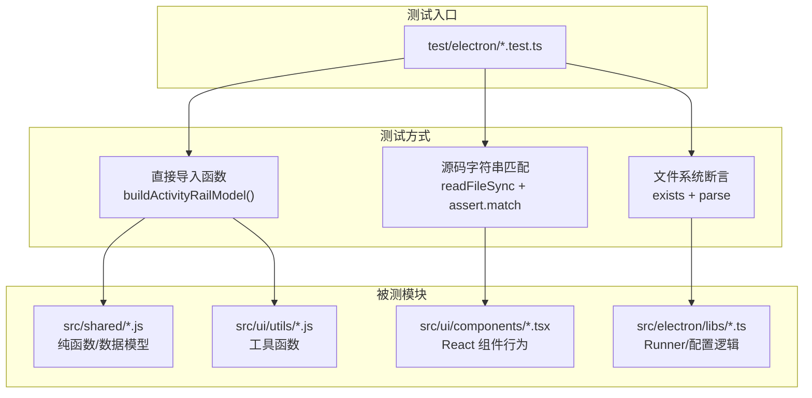
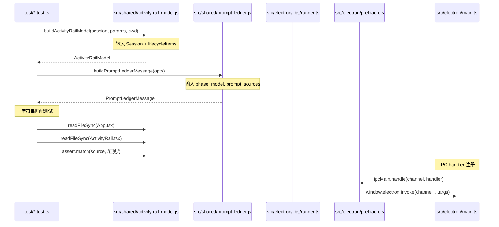
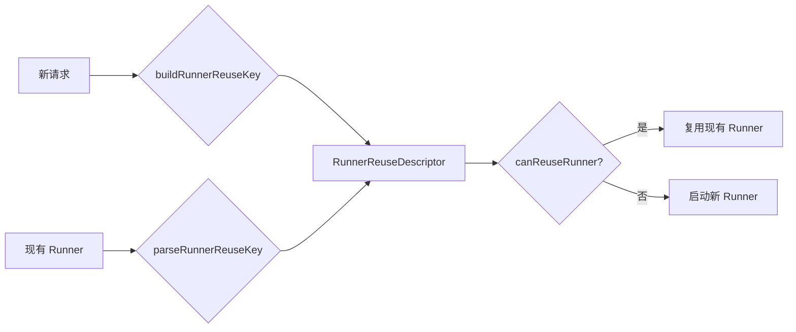

# 测试体系总览

<cite>

**本文引用的文件**

- [test/electron/tsconfig.json](file://test/electron/tsconfig.json)
- [test/electron/activity-rail-dual-steps.test.ts](file://test/electron/activity-rail-dual-steps.test.ts)
- [test/electron/activity-rail-model.test.ts](file://test/electron/activity-rail-model.test.ts)
- [test/electron/activity-workspace-tabs.test.ts](file://test/electron/activity-workspace-tabs.test.ts)
- [test/electron/agent-rules-settings.test.ts](file://test/electron/agent-rules-settings.test.ts)
- [test/electron/api-config-save-scope.test.ts](file://test/electron/api-config-save-scope.test.ts)
- [test/electron/app-shell-layout.test.ts](file://test/electron/app-shell-layout.test.ts)
- [test/electron/attachments.test.ts](file://test/electron/attachments.test.ts)
- [src/electron/libs/runner.ts](file://src/electron/libs/runner.ts)
- [src/electron/libs/runner-reuse.ts](file://src/electron/libs/runner-reuse.ts)
- [src/electron/main.ts](file://src/electron/main.ts)
- [src/electron/preload.cts](file://src/electron/preload.cts)
- [src/electron/libs/system-prompt-presets.ts](file://src/electron/libs/system-prompt-presets.ts)
- [src/ui/components/settings/AboutPage.tsx](file://src/ui/components/settings/AboutPage.tsx)
- [src/ui/components/settings/AgentRulesSettingsPage.tsx](file://src/ui/components/settings/AgentRulesSettingsPage.tsx)
- [src/ui/components/settings/ApiProfilesSettingsPage.tsx](file://src/ui/components/settings/ApiProfilesSettingsPage.tsx)
- [src/ui/components/settings/ChannelsSettingsPage.tsx](file://src/ui/components/settings/ChannelsSettingsPage.tsx)
- [src/ui/components/settings/CodeEditor.tsx](file://src/ui/components/settings/CodeEditor.tsx)

</cite>

# 测试体系总览

## 目录

- [职责与目标](#职责与目标)
- [测试目录结构](#测试目录结构)
- [核心数据结构与符号](#核心数据结构与符号)
- [调用链与入口点](#调用链与入口点)
- [Runner 重用机制](#runner-重用机制)
- [IPC 通道与前后端桥接](#ipc-通道与前后端桥接)
- [System Prompt 预设体系](#system-prompt-预设体系)
- [常见改造路径](#常见改造路径)
- [验证命令](#验证命令)
- [Agent 改代码地图](#agent-改代码地图)

---

## 职责与目标

`tech-cc-hub` 的测试体系分为两个层次：

1. **单元测试层**：位于 `test/electron/`，使用 Node.js 内置 `node:test` 框架，覆盖纯函数和数据转换逻辑。
2. **集成验证层**：通过源码字符串匹配（`readFileSync` + `assert.match`）验证 UI 组件的行为契约。

测试不依赖浏览器环境，而是直接读取源码文件进行断言。这种设计允许 CI 在无 GUI 环境中运行，同时确保关键行为（如布局约束、配置保存范围）不被意外破坏。

图表来源：[test/electron/tsconfig.json#L1-L18](file://test/electron/tsconfig.json#L1-L18)



---

## 测试目录结构

```
test/electron/
├── tsconfig.json              # 测试编译配置
├── activity-rail-dual-steps.test.ts   # 验证计划/执行步骤分离
├── activity-rail-model.test.ts        # 验证 Prompt Ledger、Runner 重用、分布图
├── activity-workspace-tabs.test.ts    # 验证工作区 Tab 显示逻辑
├── agent-rules-settings.test.ts       # 验证 Agent 规则切换与刷新
├── api-config-save-scope.test.ts      # 验证 API 配置脏值检测
├── app-shell-layout.test.ts           # 验证布局约束（无固定宽度上限）
├── attachments.test.ts               # 验证附件处理函数
└── (其他待扩展)
```

**编译配置**：`test/electron/tsconfig.json`

- 目标：`ESNext`，模块系统：`NodeNext`
- 输出目录：`../../dist-test`
- 包含所有 `*.test.ts` 文件

图表来源：[test/electron/tsconfig.json#L1-L18](file://test/electron/tsconfig.json#L1-L18)

---

## 核心数据结构与符号

### 1. ActivityRailModel

**来源**：[src/shared/activity-rail-model.js](file://src/shared/activity-rail-model.js)（由测试文件导入）

**关键输出字段**：

| 字段 | 类型 | 含义 |
|------|------|------|
| `planSteps` | `ActivityRailStep[]` | 计划步骤列表 |
| `executionSteps` | `ActivityRailStep[]` | 执行步骤列表 |
| `taskSectionTitle` | `string` | 任务步骤标题（默认 "任务步骤"） |
| `executionSectionTitle` | `string` | 步骤汇总标题（默认 "步骤汇总"） |
| `timeline` | `TimelineItem[]` | 时间线事件，含 `lifecycle` 节点 |
| `promptAnalysis` | `PromptAnalysisResult` | Prompt 分析结果，含 buckets 和 segments |
| `analysisCards` | `AnalysisCard[]` | 分析卡片，如 `prompt-hotspot` |

**测试用例**：模型分离验证

- [activity-rail-dual-steps.test.ts#L124-L128](file://test/electron/activity-rail-dual-steps.test.ts#L124-L128) - 验证 `planSteps` 和 `executionSteps` 分别计数
- [activity-rail-dual-steps.test.ts#L175-L176](file://test/electron/activity-rail-dual-steps.test.ts#L175-L176) - 验证标题文案

### 2. PromptLedgerMessage

**来源**：[src/shared/prompt-ledger.js](file://src/shared/prompt-ledger.js)

**关键输出字段**：

| 字段 | 含义 |
|------|------|
| `type` | 固定值 `"prompt_ledger"` |
| `buckets` | Prompt 来源桶，含 `project`、`skill`、`memory` 等 |
| `segments` | 分段信息，含 `segmentKind`（如 `history_tool_input`、`history_tool_output`） |
| `totalChars` | 总字符数 |

**测试用例**：[activity-rail-model.test.ts#L7-L62](file://test/electron/activity-rail-model.test.ts#L7-L62) - 验证 Prompt 来源分离和工具调用历史分段

### 3. RunnerReuseKey / RunnerReuseDescriptor

**来源**：[src/electron/libs/runner-reuse.ts](file://src/electron/libs/runner-reuse.ts)

```typescript
type RunnerReuseDescriptor = {
  cwd: string;
  model: string;
  permissionMode: string;
  reasoningMode: string;
  outputFormat: string;
  runSurface: AgentRunSurface;
  agentId: string;
  allowedTools: string;
  runtimeProfile: string;
  builtinMcpServers: BuiltinMcpServerName[];
};
```

**导出函数**：

| 函数 | 职责 |
|------|------|
| `buildRunnerReuseKey(input)` | 将输入序列化为 JSON 字符串 |
| `canReuseRunner(existing, requested)` | 比较两个 key 是否可复用 |
| `parseRunnerReuseKey(value)` | 从 JSON 反序列化，验证 `builtinMcpServers` 为数组 |

**测试用例**：[activity-rail-model.test.ts#L165-L214](file://test/electron/activity-rail-model.test.ts#L165-L214) - 验证重复 `init` 事件标记为 "复用执行环境" 而非 "初始化执行环境"

---

## 调用链与入口点

### 测试执行入口

```bash
# 运行所有测试
node --test test/electron/*.test.ts

# 或使用 npm scripts（参见 package.json）
```

### 关键调用链



### 各测试文件的调用模式

| 测试文件 | 测试模式 | 被测函数/源码 |
|---------|---------|--------------|
| `activity-rail-dual-steps.test.ts` | 直接导入 | `buildActivityRailModel()` |
| `activity-rail-model.test.ts` | 直接导入 | `buildActivityRailModel()`, `buildPromptLedgerMessage()` |
| `activity-workspace-tabs.test.ts` | 直接导入 + 源码匹配 | `buildActivityWorkspaceTabs()`, `shouldShowCreateBrowserTab()` |
| `agent-rules-settings.test.ts` | 源码匹配 | `AgentRulesSettingsPage.tsx`, `SettingsModal.tsx` |
| `api-config-save-scope.test.ts` | 源码匹配 | `SettingsModal.tsx`, `claude-settings.ts` |
| `app-shell-layout.test.ts` | 源码匹配 | `App.tsx`, `ActivityRail.tsx`, `PromptInput.tsx` |
| `attachments.test.ts` | 直接导入 | `createStoredUserPromptMessage()`, `resolveImageAttachmentSrc()`, `estimateAttachmentPromptChars()` |

---

## Runner 重用机制

### 核心逻辑

`runner-reuse.ts` 负责判断当前请求是否可复用已有 Runner 进程，避免重复初始化环境。

**复用条件**（`canReuseRunner` 函数）：
- `cwd` 相同
- `model` 相同
- `permissionMode` 相同
- `reasoningMode` 相同
- `outputFormat` 相同
- `runSurface` 相同（`development` / `maintenance`）
- `agentId` 相同
- `allowedTools` 相同

图表来源：[runner-reuse.ts#L33-L49](file://src/electron/libs/runner-reuse.ts#L33-L49)



### BuiltinMcpServers 验证

`parseRunnerReuseKey` 要求 `builtinMcpServers` 必须是数组，否则返回 `null`：

```typescript
// runner-reuse.ts#L86-L89
const parsed = JSON.parse(value) as Partial<RunnerReuseDescriptor>;
if (!Array.isArray(parsed.builtinMcpServers)) {
  return null;
}
```

**有效值**：来自 `src/shared/builtin-mcp-registry.js`：

- `tech-cc-hub-browser`
- `tech-cc-hub-admin`
- `tech-cc-hub-design`
- `tech-cc-hub-figma`
- `tech-cc-hub-cron`
- `tech-cc-hub-idea`
- `tech-cc-hub-plan`

图表来源：[runner-reuse.ts#L108-L117](file://src/electron/libs/runner-reuse.ts#L108-L117)

---

## IPC 通道与前后端桥接

### preload.cts 暴露的 API

`src/electron/preload.cts` 通过 `contextBridge` 暴露 `window.electron` 对象：

| 方法 | IPC Channel | 用途 |
|------|-------------|------|
| `getApiConfig()` | `get-api-config` | 获取 API 配置 |
| `saveApiConfig(config)` | `save-api-config` | 保存 API 配置 |
| `getAgentRuleDocuments()` | `get-agent-rule-documents` | 获取 Agent 规则文档 |
| `saveUserAgentRuleDocument(md)` | `save-user-agent-rule-document` | 保存用户级规则 |
| `preprocessImageAttachments(payload)` | `preprocess-image-attachments` | 预处理图片附件 |
| `invoke(channel, ...args)` | 动态 | 通用 IPC 调用 |

图表来源：[src/electron/preload.cts#L35-L69](file://src/electron/preload.cts#L35-L69)

### main.ts 注册的 IPC handler

```typescript
// main.ts 中的 handler 注册（部分）
ipcMain.handle: "preview-list-directory"
ipcMain.handle: "preview-list-files"
ipcMain.handle: "sessions:list"
ipcMain.handle: "get-api-config"
ipcMain.handle: "save-api-config"
ipcMain.handle: "plugins:getOpenComputerUseStatus"
ipcMain.handle: "plugins:installOpenComputerUse"
ipcMain.handle: "plugins:getFigmaOfficialStatus"
ipcMain.handle: "plugins:connectFigmaOfficial"
```

图表来源：[src/electron/main.ts#L30](file://src/electron/main.ts#L30) 及相关行

### 测试中的状态验证模式

```typescript
// api-config-save-scope.test.ts#L8-L13
assert.match(source, /const \[apiConfigDirty, setApiConfigDirty\] = useState\(false\)/);
assert.match(source, /apiConfigDirty\s+\?\s+window\.electron\.saveApiConfig\(\{ profiles: nextProfiles \}\)/);
```

验证 `SettingsModal.tsx` 中的脏值追踪逻辑：只有 `apiConfigDirty` 为 true 时才调用 `saveApiConfig`。

---

## System Prompt 预设体系

### 预设函数列表

`src/electron/libs/system-prompt-presets.ts` 导出以下函数：

| 函数 | 用途 |
|------|------|
| `buildBrowserWorkbenchPromptAppend()` | Browser 工作台使用规则 |
| `buildAdminConfigPromptAppend()` | 全局配置持久化规则 |
| `buildToolCallOptimizationPromptAppend()` | 工具调用优化指南 |
| `extractFeishuDocumentUrls(text)` | 从 prompt 中提取飞书文档 URL |
| `buildFeishuDocumentFetchPromptAppend(prompt, env)` | 飞书文档读取指令 |
| `buildGlobalRuntimeSystemPromptExtAppend(config)` | 全局 System Prompt 扩展 |
| `buildBuiltinMcpRegistryPromptAppend(servers)` | 内置 MCP 注册提示 |
| `buildClaudeCode2139FeaturePromptAppend()` | Claude Code 2.139 特性兼容 |
| `buildDesignParityPromptAppend()` | 设计还原规则 |

图表来源：[system-prompt-presets.ts#L1-L10](file://src/electron/libs/system-prompt-presets.ts#L1-L10)

### 飞书文档 URL 提取

```typescript
// system-prompt-presets.ts#L8-L10
const FEISHU_DOC_URL_PATTERN = /https?:\/\/[^\s<>"'`]*feishu\.cn\/(?:wiki|docx|docs)\/[^\s<>"'`]*/gi;
const MAX_FEISHU_DOC_URL_HINTS = 3;
```

### lark-cli 条件检测

```typescript
// system-prompt-presets.ts#L62-L63
const hasLarkCliCommand = Boolean(runtimeEnv.LARK_CLI_COMMAND?.trim());
const hasLarkCliProfile = Boolean(runtimeEnv.LARK_CLI_PROFILE?.trim());
```

只有当环境变量 `LARK_CLI_COMMAND` 和 `LARK_CLI_PROFILE` 同时存在时，才生成飞书文档读取指令。

---

## 常见改造路径

### 1. 新增 ActivityRail 指标

**步骤**：

1. 在 `src/shared/activity-rail-model.js` 中添加新的计算逻辑
2. 在 `test/electron/activity-rail-model.test.ts` 中新增测试用例
3. 验证 `model.xxx` 字段存在且符合预期

**示例**：添加 `distributionLabels` 字段的验证

- [activity-rail-model.test.ts#L423](file://test/electron/activity-rail-model.test.ts#L423)

### 2. 修改 API 配置保存范围

**风险点**：

- 脏值追踪逻辑在 `SettingsModal.tsx` 中
- `apiConfigDirty` 控制是否调用 `saveApiConfig`

**验证方式**：

- [api-config-save-scope.test.ts#L8-L13](file://test/electron/api-config-save-scope.test.ts#L8-L13)
- 确保修改后测试仍通过

### 3. 添加新的工作区 Tab

**步骤**：

1. 在 `src/ui/utils/activity-workspace-tabs.js` 中添加 Tab 定义
2. 在 `test/electron/activity-workspace-tabs.test.ts` 中验证 `visibleTabs` 和 `active` 状态

**测试用例**：[activity-workspace-tabs.test.ts#L12-L30](file://test/electron/activity-workspace-tabs.test.ts#L12-L30)

### 4. 修改 Agent 规则刷新逻辑

**涉及文件**：

- `AgentRulesSettingsPage.tsx` - 页面组件
- `SettingsModal.tsx` - 容器，管理 `refreshAgentRuleDocuments`

**验证点**：[agent-rules-settings.test.ts#L9-L17](file://test/electron/agent-rules-settings.test.ts#L9-L17)

### 5. 修改布局约束

**风险**：移除固定宽度上限可能影响多屏适配

**验证方式**：[app-shell-layout.test.ts#L11-L19](file://test/electron/app-shell-layout.test.ts#L11-L19)

- `max-w-[920px]` 必须不存在于 `App.tsx`
- `clamp()` 调用必须存在于布局中

---

## 验证命令

### 运行所有测试

```bash
node --test test/electron/*.test.ts
```

### 运行特定测试文件

```bash
node --test test/electron/activity-rail-model.test.ts
node --test test/electron/app-shell-layout.test.ts
```

### 验证测试覆盖率（需要额外工具）

```bash
# 查看 dist-test 输出
ls dist-test/electron/*.test.js

# 验证 TypeScript 编译
npx tsc --project test/electron/tsconfig.json --noEmit
```

### 验证关键行为

```bash
# 验证 Runner 重用逻辑
grep -n "canReuseRunner\|buildRunnerReuseKey" src/electron/libs/runner*.ts

# 验证 IPC 通道注册
grep -n "ipcMain.handle" src/electron/main.ts | head -20

# 验证 preload API 暴露
grep -n "electron.ipcRenderer.invoke\|ipcInvoke" src/electron/preload.cts | head -30
```

---

## Agent 改代码地图

### 先读文件

| 文件 | 优先级 | 原因 |
|------|--------|------|
| `test/electron/tsconfig.json` | 高 | 了解测试编译配置 |
| `test/electron/activity-rail-model.test.ts` | 高 | 核心测试用例，展示模型契约 |
| `src/electron/libs/runner-reuse.ts` | 高 | Runner 重用逻辑 |
| `src/electron/preload.cts` | 中 | IPC API 暴露清单 |
| `src/electron/main.ts` | 中 | IPC handler 注册位置 |

### 关键符号 / IPC 通道

| 符号 | 文件 | 行号 |
|------|------|------|
| `buildActivityRailModel` | `src/shared/activity-rail-model.js` | - |
| `buildPromptLedgerMessage` | `src/shared/prompt-ledger.js` | - |
| `buildRunnerReuseKey` | `src/electron/libs/runner-reuse.ts` | 29 |
| `canReuseRunner` | `src/electron/libs/runner-reuse.ts` | 33 |
| `parseRunnerReuseKey` | `src/electron/libs/runner-reuse.ts` | 79 |
| `getApiConfig` / `saveApiConfig` | `src/electron/preload.cts` | 35-38 |
| `apiConfigDirty` | `src/ui/components/SettingsModal.tsx` | - |
| `buildActivityWorkspaceTabs` | `src/ui/utils/activity-workspace-tabs.js` | - |
| `createStoredUserPromptMessage` | `src/shared/attachments.js` | - |
| `resolveImageAttachmentSrc` | `src/shared/attachments.js` | - |
| `estimateAttachmentPromptChars` | `src/shared/attachments.js` | - |

### 修改入口

| 场景 | 修改文件 | 注意事项 |
|------|----------|----------|
| 添加新 ActivityRail 指标 | `src/shared/activity-rail-model.js` | 同步更新测试 |
| 修改 API 保存范围 | `src/ui/components/SettingsModal.tsx` | 检查 `apiConfigDirty` 逻辑 |
| 修改工作区 Tab | `src/ui/utils/activity-workspace-tabs.js` | 验证默认 Tab 和可见性 |
| 修改 Agent 规则刷新 | `src/ui/components/settings/AgentRulesSettingsPage.tsx` | 检查 `onRefreshDocuments` 调用 |
| 修改布局约束 | `src/ui/App.tsx`, `src/ui/components/PromptInput.tsx` | 验证无固定宽度上限 |
| 修改 Runner 重用条件 | `src/electron/libs/runner-reuse.ts` | 确保 `builtinMcpServers` 数组验证 |
| 添加新 System Prompt 预设 | `src/electron/libs/system-prompt-presets.ts` | 导出函数并在 runner.ts 中使用 |

### 验证命令

```bash
# 运行所有测试
node --test test/electron/*.test.ts

# 验证特定测试
node --test test/electron/activity-rail-model.test.ts
node --test test/electron/api-config-save-scope.test.ts

# 验证源码字符串匹配测试
node --test test/electron/app-shell-layout.test.ts
node --test test/electron/agent-rules-settings.test.ts

# TypeScript 类型检查
npx tsc --noEmit
```

### 常见回归风险

| 风险 | 预防措施 |
|------|----------|
| ActivityRail 指标计算错误 | 添加/扩展测试用例，验证边界情况 |
| API 配置误触发保存 | 检查 `apiConfigDirty` 条件逻辑 |
| 布局固定宽度上限回归 | 确保 `app-shell-layout.test.ts` 通过 |
| Runner 复用条件过严/过松 | 验证 `canReuseRunner` 的每个字段比较 |
| Agent 规则刷新失效 | 检查 `onRefreshDocuments` 调用时机 |

---

## 附录：测试文件对应关系

| 测试文件 | 被测源码 | 验证内容 |
|----------|----------|----------|
| `activity-rail-dual-steps.test.ts` | `src/shared/activity-rail-model.js` | 计划/执行步骤分离 |
| `activity-rail-model.test.ts` | `src/shared/activity-rail-model.js`<br/>`src/shared/prompt-ledger.js` | Prompt 分析、Runner 重用、分布图 |
| `activity-workspace-tabs.test.ts` | `src/ui/utils/activity-workspace-tabs.js`<br/>`src/ui/App.tsx`<br/>`src/ui/components/ActivityRail.tsx` | Tab 显示逻辑、默认 Tab |
| `agent-rules-settings.test.ts` | `src/ui/components/settings/AgentRulesSettingsPage.tsx`<br/>`src/ui/components/SettingsModal.tsx` | 规则切换与刷新 |
| `api-config-save-scope.test.ts` | `src/ui/components/SettingsModal.tsx`<br/>`src/electron/libs/claude-settings.ts` | 脏值追踪、保存范围 |
| `app-shell-layout.test.ts` | `src/ui/App.tsx`<br/>`src/ui/components/ActivityRail.tsx`<br/>`src/ui/components/PromptInput.tsx` | 布局约束 |
| `attachments.test.ts` | `src/shared/attachments.js` | 附件处理、数据 URL 转换 |