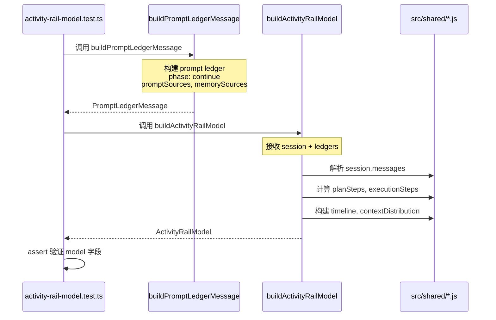
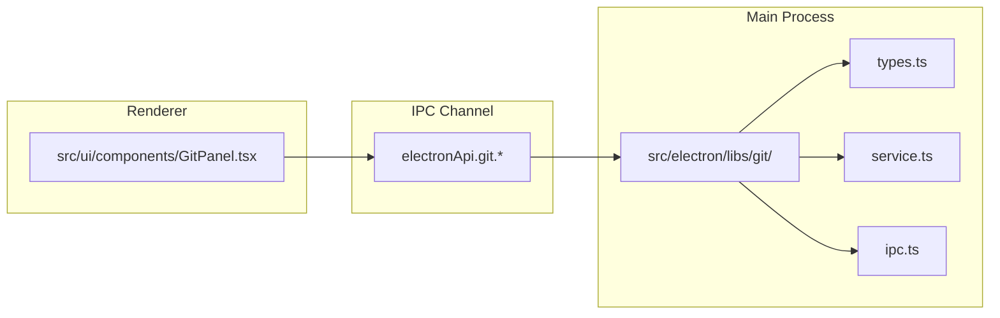
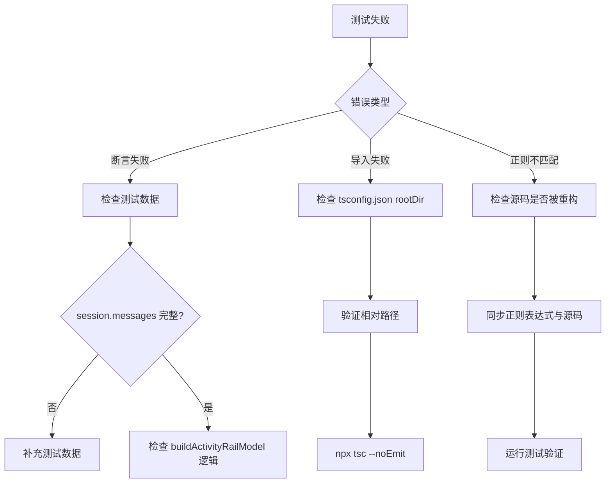

# 测试体系总览

<cite>

**本文引用的文件**

- [test/electron/tsconfig.json](file://test/electron/tsconfig.json)
- [test/electron/activity-rail-dual-steps.test.ts](file://test/electron/activity-rail-dual-steps.test.ts)
- [test/electron/activity-rail-model.test.ts](file://test/electron/activity-rail-model.test.ts)
- [test/electron/activity-workspace-tabs.test.ts](file://test/electron/activity-workspace-tabs.test.ts)
- [test/electron/agent-rules-settings.test.ts](file://test/electron/agent-rules-settings.test.ts)
- [test/electron/api-config-save-scope.test.ts](file://test/electron/api-config-save-scope.test.ts)
- [test/electron/app-shell-layout.test.ts](file://test/electron/app-shell-layout.test.ts)
- [test/electron/attachments.test.ts](file://test/electron/attachments.test.ts)
- [src/electron/libs/git/README.md](file://src/electron/libs/git/README.md)

</cite>

---

## 目录

- [1. 测试体系职责](#1-测试体系职责)
- [2. 测试入口与执行环境](#2-测试入口与执行环境)
- [3. 测试文件协作关系](#3-测试文件协作关系)
- [4. 核心数据结构](#4-核心数据结构)
- [5. 调用链与依赖](#5-调用链与依赖)
- [6. 常见改造路径](#6-常见改造路径)
- [7. 扩展点设计](#7-扩展点设计)
- [8. 验证命令](#8-验证命令)
- [9. 失败模式与排障](#9-失败模式与排障)

---

## 1. 测试体系职责

`tech-cc-hub` 的测试体系承担以下核心职责：

| 职责 | 说明 |
|------|------|
| **领域模型验证** | 验证 `buildActivityRailModel`、`buildPromptLedgerMessage` 等核心模型的转换逻辑 |
| **UI 组件契约测试** | 检查组件源码是否包含预期的关键代码段（如 `activityRailTabBySessionId` 默认值） |
| **行为回归保护** | 确保设置页切换、API 配置保存等交互逻辑不被意外破坏 |
| **IPC 边界验证** | 验证主进程模块（如 Git）与渲染进程之间的 IPC 通道定义 |

测试采用**快照式契约验证**（snapshot-style contract testing）而非完整 UI 渲染测试。对于 UI 组件，通过 `readFileSync` 读取源码并用正则表达式断言关键实现细节，这种方式在源码变动时能快速定位问题。

> **章节来源**：`test/electron/activity-workspace-tabs.test.ts#L12-L17` 展示了通过源码检查验证 UI 契约的典型模式。

---

## 2. 测试入口与执行环境

### 2.1 配置文件结构

测试入口由 `test/electron/tsconfig.json` 定义：

```json
{
  "compilerOptions": {
    "strict": true,
    "target": "ESNext",
    "module": "NodeNext",
    "outDir": "../../dist-test",
    "rootDir": "../..",
    "jsx": "react-jsx",
    "skipLibCheck": true,
    "types": ["node", "../../types"]
  },
  "include": ["./**/*.test.ts"]
}
```

关键配置说明：

| 配置项 | 值 | 含义 |
|--------|-----|------|
| `module` | `NodeNext` | 使用 Node.js ESM 模式，支持 `import`/`export` |
| `rootDir` | `../..` | 项目根目录，使测试可以 `../../src/...` 引用源码 |
| `jsx` | `react-jsx` | 支持 JSX 语法（用于需要解析 TSX 源码的场景） |
| `types` | `["node", "../../types"]` | 引入 Node.js 内置类型和项目自定义类型 |

> **图表来源**：`file://test/electron/tsconfig.json#L1-L18`

### 2.2 测试运行器

测试使用 Node.js 内置的 `node:test` 模块：

```typescript
import test from "node:test";
import assert from "node:assert/strict";
```

两种风格的测试 API：

- **`test("description", fn)`** — 用于功能性测试，示例：`test/electron/activity-rail-dual-steps.test.ts`
- **`describe/it`** — BDD 风格，用于组织相关测试用例，示例：`test/electron/activity-workspace-tabs.test.ts`

> **章节来源**：`file://test/electron/activity-rail-dual-steps.test.ts#L1-L3` 和 `file://test/electron/activity-workspace-tabs.test.ts#L1-L2`

---

## 3. 测试文件协作关系

### 3.1 测试模块映射

```mermaid
flowchart TD
    subgraph "测试文件"
        A["activity-rail-dual-steps.test.ts"]
        B["activity-rail-model.test.ts"]
        C["activity-workspace-tabs.test.ts"]
        D["agent-rules-settings.test.ts"]
        E["api-config-save-scope.test.ts"]
        F["app-shell-layout.test.ts"]
        G["attachments.test.ts"]
    end

    subgraph "被测源码"
        H["src/shared/activity-rail-model.js"]
        I["src/shared/prompt-ledger.js"]
        J["src/ui/utils/activity-workspace-tabs.js"]
        K["src/ui/components/settings/AgentRulesSettingsPage.tsx"]
        L["src/ui/components/SettingsModal.tsx"]
        M["src/ui/App.tsx"]
        N["src/shared/attachments.js"]
    end

    A --> H
    B --> H
    B --> I
    C --> J
    C --> M
    D --> K
    D --> L
    E --> L
    E --> O["src/electron/libs/claude-settings.ts"]
    F --> M
    F --> P["src/ui/components/ActivityRail.tsx"]
    F --> Q["src/ui/components/PromptInput.tsx"]
    G --> N
```



### 3.2 协作模式详解

#### 模式一：领域模型单元测试

`activity-rail-model.test.ts` 与 `activity-rail-dual-steps.test.ts` 共同验证 `buildActivityRailModel` 函数：

- `activity-rail-model.test.ts` 验证完整的 model 结构（planSteps、taskSteps、timeline 等）
- `activity-rail-dual-steps.test.ts` 专注于 plan 与 execution 步骤分离的场景

两者共享同一输入结构（session 对象），通过不同的断言角度覆盖模型构建逻辑。

> **图表来源**：`file://test/electron/activity-rail-model.test.ts#L7-L63` 和 `file://test/electron/activity-rail-dual-steps.test.ts#L6-L129`

#### 模式二：UI 契约验证

`activity-workspace-tabs.test.ts` 验证 UI 状态与默认值的契约：

```typescript
// 验证 App.tsx 中的默认 tab
assert.match(appSource, /activityRailTabBySessionId\[activeSessionId\] \?\? "preview"/);
// 验证 ActivityRail.tsx 中的 useState 默认值
assert.match(railSource, /useState<ActivityRailTab>\("preview"\)/);
```

这种模式确保源码修改后，契约不会被意外破坏。

> **章节来源**：`file://test/electron/activity-workspace-tabs.test.ts#L33-L39`

#### 模式三：跨文件状态一致性

`agent-rules-settings.test.ts` 验证 `AgentRulesSettingsPage.tsx` 与 `SettingsModal.tsx` 之间的状态同步：

```typescript
// SettingsModal 中定义 refresh 函数
assert.match(modalSource, /const refreshAgentRuleDocuments = useCallback\(async \(\) =>/);
// AgentRulesSettingsPage 中接收并调用
assert.match(pageSource, /void onRefreshDocuments\?\.\(\);/);
```

> **章节来源**：`file://test/electron/agent-rules-settings.test.ts#L14-L17`

---

## 4. 核心数据结构

### 4.1 Session 模型（被测核心）

```typescript
interface TraceSession {
  id: string;
  title: string;
  status: "running" | "completed";
  cwd?: string;
  slashCommands?: string[];
  messages: SessionMessage[];
}
```

关键字段：

| 字段 | 类型 | 用途 |
|------|------|------|
| `messages` | `SessionMessage[]` | 包含 user_prompt、assistant、user、system、result 等类型 |
| `status` | 状态枚举 | 控制 executionSteps 的 completion 状态计算 |

> **章节来源**：`file://test/electron/activity-rail-model.test.ts#L219-L397` 定义了完整的测试数据结构

### 4.2 ActivityRailModel 输出结构

`buildActivityRailModel` 返回的核心结构：

```typescript
interface ActivityRailModel {
  // 步骤分组
  planSteps: PlanStep[];           // 计划步骤（从 assistant text 解析）
  executionSteps: ExecutionStep[];  // 执行步骤（从 tool_use 解析）
  taskSteps: TaskStep[];           // 任务步骤（plan + execution 关联）

  // 标题资源
  taskSectionTitle: string;        // 默认 "任务步骤"
  executionSectionTitle: string;  // 默认 "步骤汇总"
  primarySectionTitle: string;    // 默认 "实时执行轨迹"
  contextModalTitle: string;      // 默认 "上下文分布"

  // Prompt 分析
  promptAnalysis: PromptAnalysis;
  analysisCards: AnalysisCard[];

  // 上下文分布
  contextDistribution: ContextDistribution;

  // 时间线
  timeline: TimelineItem[];
}
```

> **章节来源**：`file://test/electron/activity-rail-model.test.ts#L400-L423`

### 4.3 PromptLedger 结构

```typescript
interface PromptLedgerMessage {
  type: "prompt_ledger";
  phase: "continue";
  model: string;
  buckets: PromptBucket[];
  segments: PromptSegment[];
  totalChars: number;
}
```

`buckets` 按来源分类：

| bucket.id | sourceKind | 说明 |
|-----------|------------|------|
| `current-prompt` | — | 用户当前输入 |
| `current-attachments` | — | 当前附件 |
| `project-agents` | `project` | 项目 CLAUDE.md / AGENTS.md |
| `skill-doc` | `skill` | Skill 文档 |
| `summary` | `memory` | 滚动摘要 |
| `history-tool-output` | — | 历史工具输出（长文本） |

> **章节来源**：`file://test/electron/activity-rail-model.test.ts#L50-L62`

### 4.4 Attachment 数据结构

```typescript
interface Attachment {
  id: string;
  kind: "image" | "file";
  name: string;
  mimeType: string;
  data: string;           // base64 或 tech-cc-hub:// URI
  preview?: string;      // 预览用 base64
  storageUri?: string;  // tech-cc-hub:// 协议地址
  storagePath?: string;  // 本地文件路径
  size?: number;         // 字节数
  summaryText?: string;  // 图像描述文本
}
```

> **章节来源**：`file://test/electron/attachments.test.ts#L11-L20`

---

## 5. 调用链与依赖

### 5.1 测试 → 源码调用链



### 5.2 关键依赖路径

| 测试文件 | 依赖的源码模块 | 依赖方式 |
|----------|---------------|----------|
| `activity-rail-model.test.ts` | `src/shared/activity-rail-model.js` | `import { buildActivityRailModel }` |
| `activity-rail-model.test.ts` | `src/shared/prompt-ledger.js` | `import { buildPromptLedgerMessage }` |
| `activity-workspace-tabs.test.ts` | `src/ui/utils/activity-workspace-tabs.js` | `import { buildActivityWorkspaceTabs }` |
| `attachments.test.ts` | `src/shared/attachments.js` | `import { createStoredUserPromptMessage, ... }` |

### 5.3 Git 模块的特殊调用模式

Git 模块采用 **主进程 IPC 模式**，与直接导入测试不同：



测试 Git 模块需要 Mock IPC 通道，不在当前测试覆盖范围内。

> **章节来源**：`file://src/electron/libs/git/README.md#L3-L4` 明确说明 Renderer 只能通过 IPC 调用。

---

## 6. 常见改造路径

### 6.1 新增 ActivityRail 字段

**场景**：扩展 `ActivityRailModel` 以支持新的展示需求。

**步骤**：

1. 在 `src/shared/activity-rail-model.js` 中添加字段计算逻辑
2. 在 `activity-rail-model.test.ts` 中添加对应的测试用例

**示例**：新增 `planSectionTitle` 的多语言支持

```typescript
// 新增测试
test("buildActivityRailModel supports i18n for section titles", () => {
  const model = buildActivityRailModel({ /* ... */ }, [], "");
  assert.equal(model.taskSectionTitle, "任务步骤");  // 验证默认值
});
```

> **章节来源**：`file://test/electron/activity-rail-dual-steps.test.ts#L175-L176`

### 6.2 新增 Workspace Tab

**场景**：在右侧工作区新增一个 tab（如 `plugins`）。

**步骤**：

1. 在 `src/ui/utils/activity-workspace-tabs.js` 中添加 tab 定义
2. 在 `activity-workspace-tabs.test.ts` 中更新可见 tab 断言

```typescript
// 修改测试
const visibleTabs = buildActivityWorkspaceTabs({
  activeTab: "plugins",
  showBrowserTab: false,
}).filter((tab) => tab.visible);

assert.ok(visibleTabs.some((tab) => tab.id === "plugins"));
```

> **章节来源**：`file://test/electron/activity-workspace-tabs.test.ts#L12-L17`

### 6.3 新增 Attachment 类型

**场景**：支持新的附件类型（如视频、PDF）。

**步骤**：

1. 扩展 `src/shared/attachments.js` 中的处理函数
2. 在 `attachments.test.ts` 中添加类型覆盖测试

```typescript
test("resolveImageAttachmentSrc handles video attachments gracefully", () => {
  const src = resolveImageAttachmentSrc({
    data: "video://test.mp4",
    mimeType: "video/mp4",
  });
  // 验证降级处理
  assert.equal(src.startsWith("video://"), true);
});
```

> **章节来源**：`file://test/electron/attachments.test.ts#L29-L46`

### 6.4 Settings 保存逻辑改造

**场景**：修改 API 配置的保存策略（如新增字段校验）。

**步骤**：

1. 在 `src/ui/components/SettingsModal.tsx` 中修改保存逻辑
2. 确保 `api-config-save-scope.test.ts` 中的dirty标志测试仍然通过

```typescript
// 关键契约：dirty时才保存
assert.match(source, /apiConfigDirty\s+\?\s+window\.electron\.saveApiConfig/);
```

> **章节来源**：`file://test/electron/api-config-save-scope.test.ts#L12`

---

## 7. 扩展点设计

### 7.1 PromptLedger 扩展点

`buildPromptLedgerMessage` 的参数结构支持灵活的来源扩展：

```typescript
interface PromptLedgerOptions {
  phase: "init" | "continue";
  model: string;
  cwd: string;
  prompt: string;
  attachments: Attachment[];
  promptSources: PromptSource[];   // 可扩展：新增 sourceKind
  memorySources: MemorySource[];   // 可扩展：新增 memoryKind
  historyMessages: SessionMessage[];
}
```

新增 `promptSources` 类型只需扩展 `sourceKind` 枚举和对应的处理逻辑。

> **章节来源**：`file://test/electron/activity-rail-model.test.ts#L66-L98`

### 7.2 Timeline Item 扩展点

`TimelineItem` 的 `nodeKind` 支持多种类型：

| nodeKind | 含义 | 触发条件 |
|----------|------|----------|
| `lifecycle` | 生命周期事件 | `type === "system" && subtype === "init"` |
| `tool` | 工具调用 | `type === "assistant"` 且包含 `tool_use` |
| `result` | 执行结果 | `type === "result"` |

新增 `nodeKind` 需要在 `buildActivityRailModel` 中添加对应的处理分支。

### 7.3 ActivityRail Tab 扩展点

`buildActivityWorkspaceTabs` 函数签名预留扩展：

```typescript
interface WorkspaceTabsOptions {
  activeTab: string;
  showBrowserTab: boolean;
  // 未来可扩展：showPluginsTab, showGitTab 等
}
```

> **章节来源**：`file://test/electron/activity-workspace-tabs.test.ts#L12-L15`

---

## 8. 验证命令

### 8.1 运行所有测试

```bash
# 使用 Node.js 内置测试运行器
node --test test/electron/tsconfig.json

# 或指定文件模式
node --test test/electron/*.test.ts
```

### 8.2 运行特定测试文件

```bash
node --test test/electron/activity-rail-model.test.ts
```

### 8.3 运行特定测试用例

```bash
node --test --test-name-pattern="buildActivityRailModel exposes plan steps" test/electron/activity-rail-dual-steps.test.ts
```

### 8.4 验证 TypeScript 配置

```bash
# 编译测试配置（检查 tsconfig.json 语法）
npx tsc --project test/electron/tsconfig.json --noEmit

# 输出编译产物到 dist-test
npx tsc --project test/electron/tsconfig.json
```

### 8.5 验证 Git 模块边界

由于 Git 模块仅通过 IPC 调用，源码级测试需要端到端测试框架：

```bash
# 检查 IPC handler 注册（代码审查）
grep -r "ipcMain.handle" src/electron/libs/git/
```

> **章节来源**：`file://src/electron/libs/git/README.md#L13` 定义了 `ipc.ts` 为 IPC handler 注册位置

---

## 9. 失败模式与排障

### 9.1 常见失败场景

| 失败模式 | 原因 | 排查方向 |
|----------|------|----------|
| `AssertionError` on `planSteps.length` | session.messages 中缺少 assistant text 或 tool_use | 检查测试数据中 `messages` 数组的完整性 |
| `assert.match` 失败 | UI 组件源码被重构，key 选择器改变 | 更新测试中的正则表达式，或同步更新源码 |
| `module not found` | `rootDir` 配置导致相对路径错误 | 检查 `test/electron/tsconfig.json` 的 `rootDir` |
| 附件测试 chars 过小 | `estimateAttachmentPromptChars` 使用 `summaryText` 而非原始字节 | 这是预期行为，验证 `chars < 1000` 通过即可 |

### 9.2 排障流程



### 9.3 调试技巧

**打印 Model 结构**：

```typescript
test("debug model structure", () => {
  const model = buildActivityRailModel(session, [], "");
  console.log(JSON.stringify(model, null, 2));
});
```

**检查正则表达式匹配**：

```typescript
const source = readFileSync("src/ui/App.tsx", "utf8");
console.log("匹配结果:", source.match(/activityRailTabBySessionId.*preview/)?.[0]);
```

> **章节来源**：`file://test/electron/app-shell-layout.test.ts#L23-L29` 展示了源码检查的典型调试模式

---

## 附录：Git 模块测试边界说明

Git 模块采用 **主进程隔离架构**，测试边界如下：

| 层级 | 可测试性 | 说明 |
|------|----------|------|
| `types.ts` | ✅ 可单元测试 | 纯类型定义 |
| `errors.ts` | ✅ 可单元测试 | 错误归一化函数 |
| `service.ts` | ⚠️ 需 Mock | 需要 Mock git 命令执行结果 |
| `ipc.ts` | ❌ 需 E2E | 需要完整的 Electron 环境 |
| `index.ts` | ⚠️ 需 Mock | 依赖 service 层 |

当前测试套件未覆盖 Git 模块的单元测试，如需补充，建议使用 `simple-git` 的 Mock 方案。

> **章节来源**：`file://src/electron/libs/git/README.md#L5-L14` 定义了模块边界

---

*本文档由 Qoder Repo Wiki 生成器创建，最后更新于 2025-01-XX*