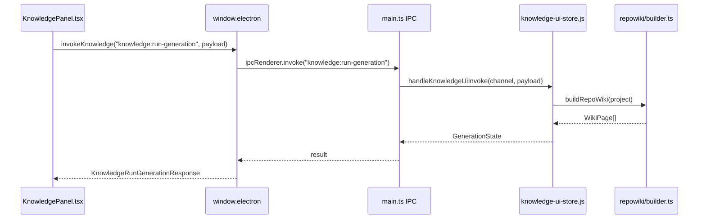

# 知识库前端交互总览

<cite>
**本文引用的文件**
- [src/ui/components/KnowledgePanel.tsx](file://src/ui/components/KnowledgePanel.tsx)
- [scripts/codex-oauth-setup.mjs](file://scripts/codex-oauth-setup.mjs)
- [scripts/sync-claude-code-compat.mjs](file://scripts/sync-claude-code-compat.mjs)
- [src/electron/main.ts](file://src/electron/main.ts)
- [src/ui/App.tsx](file://src/ui/App.tsx)
- [src/ui/components/git/index.ts](file://src/ui/components/git/index.ts)
- [src/electron/libs/knowledge/agent-cards.ts](file://src/electron/libs/knowledge/agent-cards.ts)
- [src/electron/libs/knowledge/repowiki/analyzer.ts](file://src/electron/libs/knowledge/repowiki/analyzer.ts)
- [src/electron/libs/knowledge/repowiki/builder.ts](file://src/electron/libs/knowledge/repowiki/builder.ts)
</cite>

---

## 目录

1. [职责定位](#职责定位)
2. [入口与挂载点](#入口与挂载点)
3. [IPC 调用链](#ipc-调用链)
4. [核心数据结构](#核心数据结构)
5. [生成状态与 Git 绑定](#生成状态与-git-绑定)
6. [文档树构建逻辑](#文档树构建逻辑)
7. [知识库生成的幕后链路](#知识库生成的幕后链路)
8. [失败模式与排障](#失败模式与排障)
9. [扩展点](#扩展点)
10. [验证命令](#验证命令)

---

## 职责定位

知识库前端交互模块（module-knowledge-ui）负责三大职责：

1. **工作区与文档管理**：管理多个工作区的增删改查，展示文档树形结构。
2. **生成状态可视化**：实时显示 Repo Wiki 生成进度，绑定 Git commit 信息。
3. **IPC 桥接**：前端通过 `window.electron.invoke` 与主进程通信，触发后端知识库操作。

[章节来源](file://src/ui/components/KnowledgePanel.tsx#L1-L69)

---

## 入口与挂载点

### 前端入口

`App.tsx` 中通过 `KnowledgePanel` 组件挂载知识库面板：

```tsx
const [showKnowledgePanel, setShowKnowledgePanel] = useState(false);
// ...
<KnowledgePanel
  onBack={() => setShowKnowledgePanel(false)}
  onOpenSettings={openSettings}
/>
```

[章节来源](file://src/ui/App.tsx#L23#L342)

### 主进程 IPC 入口

`main.ts` 中注册了 `KNOWLEDGE_UI_CHANNELS` 常量，其中定义了 10 个 IPC 信道：

| 信道 | 用途 |
|---|---|
| `knowledge:list` | 列出工作区 |
| `knowledge:sync-workspaces` | 同步工作区 |
| `knowledge:add-workspace` | 添加工作区 |
| `knowledge:remove-workspace` | 移除工作区 |
| `knowledge:update-generation` | 更新生成状态 |
| `knowledge:complete-generation` | 完成生成 |
| `knowledge:run-generation` | 触发生成 |
| `knowledge:list-documents` | 列出文档 |
| `knowledge:read-document` | 读取文档 |
| `knowledge:overview` | 获取概览 |

[章节来源](file://src/electron/main.ts#L119-L130)

这些信道统一路由到 `handleKnowledgeUiInvoke` 处理函数。

### 组件层级

```
App.tsx
└── KnowledgePanel.tsx
    ├── workspace list (left panel)
    ├── document tree (buildDocumentTree)
    ├── generation progress (GenerationState)
    └── Git binding (KnowledgeGitState)
```

---

## IPC 调用链

### 调用模式

前端通过 `invokeKnowledge<T>` 发起调用，底层的 `window.electron.invoke` 是 Electron preload 暴露的方法：

```typescript
async function invokeKnowledge<T>(channel: string, payload?: unknown): Promise<T> {
  const electronApi = window.electron as typeof window.electron & {
    invoke?: <Result>(channel: string, ...args: unknown[]) => Promise<Result>;
  };
  if (typeof electronApi.invoke !== "function") {
    throw new Error("当前运行环境不支持知识库 IPC。");
  }
  return payload === undefined
    ? electronApi.invoke<T>(channel)
    : electronApi.invoke<T>(channel, payload);
}
```

[章节来源](file://src/ui/components/KnowledgePanel.tsx#L181-L191)

### 典型调用序列



[图表来源](file://src/electron/main.ts#L119-L130) + [file://src/ui/components/KnowledgePanel.tsx#L181-L191)

### 信道与响应类型映射

| 信道 | 响应类型 |
|---|---|
| `knowledge:list` | `KnowledgeListResponse` |
| `knowledge:run-generation` | `KnowledgeRunGenerationResponse` |
| `knowledge:list-documents` | `KnowledgeDocumentsResponse` |

[章节来源](file://src/ui/components/KnowledgePanel.tsx#L78-L108)

---

## 核心数据结构

### GenerationState

表示一次生成的完整状态机：

```typescript
type GenerationState = {
  status: "idle" | "generating" | "paused" | "completed";
  completed: number;
  total: number;
  processing: number;
  failed: number;
  phase?: string;
  commitId?: string;
  commitShortHash?: string;
  branch?: string | null;
  updatedAt?: number;
};
```

[章节来源](file://src/ui/components/KnowledgePanel.tsx#L30-L41)

状态转移：`idle` → `generating` → `completed`（或 `paused`）

### KnowledgeWorkspace

```typescript
type KnowledgeWorkspace = {
  key: string;          // workspace 唯一标识（cwd 或显式 key）
  cwd?: string;        // 工作目录路径
  name: string;        // 显示名称
  sessionCount: number;
  source: "session" | "manual";  // 来源：会话自动创建 or 用户手动添加
  updatedAt: number;
};
```

[章节来源](file://src/ui/components/KnowledgePanel.tsx#L43-L50)

### KnowledgeDocument

```typescript
type KnowledgeDocument = {
  id: string;
  workspaceKey: string;
  section: string;      // 路径分段，用于构建树形结构
  title: string;
  content: string;
  sortOrder: number;
  updatedAt: number;
};
```

[章节来源](file://src/ui/components/KnowledgePanel.tsx#L52-L60)

### WikiTreeNode

前端用于渲染文档树的内部结构：

```typescript
type WikiTreeNode = {
  key: string;
  title: string;
  sortOrder: number;
  children: WikiTreeNode[];
  documents: KnowledgeDocument[];
};
```

[章节来源](file://src/ui/components/KnowledgePanel.tsx#L70-L76)

### KnowledgeGitState

Git 分支和提交信息，用于绑定到生成状态：

```typescript
type KnowledgeGitState = {
  loading: boolean;
  hasGit: boolean;
  branch: string | null;
  commitId: string;
  commitShortHash: string;
  changedCount: number;
  error?: string;
};
```

[章节来源](file://src/ui/components/KnowledgePanel.tsx#L110-L118)

---

## 生成状态与 Git 绑定

### Git 状态解析

`resolveHeadFromSnapshot` 从 `UiGitWorkbenchSnapshot` 中提取 HEAD 提交信息：

```typescript
function resolveHeadFromSnapshot(snapshot: UiGitWorkbenchSnapshot): KnowledgeGitState {
  const currentBranch = snapshot.status.currentBranch;
  const headCommit = snapshot.history.find((commit) => (
    commit.refs.some((ref) => ref.startsWith("HEAD") || ...)
  )) ?? snapshot.history[0];

  return {
    loading: false,
    hasGit: true,
    branch: currentBranch,
    commitId: headCommit?.hash ?? "",
    commitShortHash: headCommit?.shortHash ?? (headCommit?.hash ? headCommit.hash.slice(0, 7) : ""),
    changedCount: snapshot.status.changedCount,
  };
}
```

[章节来源](file://src/ui/components/KnowledgePanel.tsx#L283-L297)

### Git 绑定到生成状态

`applyGitBinding` 将 Git 信息合并到 `GenerationState`：

```typescript
function applyGitBinding(state: GenerationState, git?: KnowledgeGitState): GenerationState {
  return {
    ...state,
    commitId: git?.commitId || state.commitId,
    commitShortHash: git?.commitShortHash || state.commitShortHash,
    branch: git?.branch ?? state.branch,
    updatedAt: Date.now(),
  };
}
```

[章节来源](file://src/ui/components/KnowledgePanel.tsx#L299-L307)

---

## 文档树构建逻辑

### sectionParts

将 section 路径按 `/` 分割，生成树节点层级：

```typescript
function sectionParts(section: string): string[] {
  const parts = section
    .split("/")
    .map((part) => part.trim())
    .filter(Boolean);
  return parts.length > 0 ? parts : ["生成文档"];
}
```

[章节来源](file://src/ui/components/KnowledgePanel.tsx#L313-L319)

### buildDocumentTree

递归构建树形结构，按 `sortOrder` 和中文 locale 排序：

```typescript
function buildDocumentTree(documents: KnowledgeDocument[]): WikiTreeNode[] {
  const root: WikiTreeNode = { key: "__root__", title: "", sortOrder: 0, children: [], documents: [] };
  const byKey = new Map<string, WikiTreeNode>();

  for (const document of documents) {
    const parts = sectionParts(document.section || "生成文档");
    let current = root;
    let key = "";
    for (const part of parts) {
      key = key ? `${key}/${part}` : part;
      // 创建或复用节点...
      current.children.push(node);
      current = node;
    }
    current.documents.push(document);
  }
  // 递归排序
  const sortNode = (node: WikiTreeNode) => {
    node.children.sort((a, b) => a.sortOrder - b.sortOrder || a.title.localeCompare(b.title, "zh-Hans-CN"));
    node.documents.sort((a, b) => a.sortOrder - b.sortOrder || a.title.localeCompare(b.title, "zh-Hans-CN"));
    node.children.forEach(sortNode);
  };
  sortNode(root);
  return root.children;
}
```

[章节来源](file://src/ui/components/KnowledgePanel.tsx#L321-L362)

---

## 知识库生成的幕后链路

### 整体流程图

```mermaid
flowchart TD
    subgraph Frontend["前端 UI"]
        KP[KnowledgePanel]
        BT[buildDocumentTree]
    end

    subgraph IPC["IPC 层"]
        INV[invokeKnowledge]
        CH[knowledge:run-generation]
    end

    subgraph Backend["后端生成"]
        SC[scanRepoWikiProject]
        GR[RepoWikiDependencyGraph.buildFromProject]
        BI[buildRepoWikiIntelligence]
        ANALYZER[RepoWikiAnalyzer.analyze]
        BUILDER[RepoWikiBuilder.build]
        CARDS[generateAgentKnowledgeCards]
    end

    subgraph Output["输出产物"]
        WP[WikiPage[]]
        AC[AgentKnowledgeCard[]]
        SG[SidebarItem[]]
    end

    KP -->|触发| INV
    INV -->|IPC| CH
    CH -->|analyze| ANALYZER
    ANALYZER -->|生成| BUILDER
    BUILDER -->|输出| WP
    BUILDER -->|生成侧边栏| SG
    SC -->|scan结果| GR
    GR -->|graph| BI
    BI -->|intelligence| CARDS
    CARDS -->|生成| AC
```

[图表来源](file://src/electron/libs/knowledge/agent-cards.ts#L50-L72) + [file://src/electron/libs/knowledge/repowiki/builder.ts#L15-L85)

### AgentKnowledgeCard 种类

| 种类 | 用途 |
|---|---|
| `runtime_flow` | 描述关键运行链路及证据文件 |
| `module` | 模块级改代码入口，高价值文件列表 |
| `entrypoint` | 启动入口与启动链路 |
| `mcp` | MCP 工具面与 Agent 能力入口 |
| `database` | SQLite/FTS/Vector 存储面 |
| `qa` | 验证命令与质量门槛 |
| `agent_question` | 已知问答，附带回答和证据文件 |

[章节来源](file://src/electron/libs/knowledge/agent-cards.ts#L15-L39)

### WikiPage 生成内容

| 页面 ID | 内容 |
|---|---|
| `index` | 项目概览（名称、一句话、描述、Agent 快速定位表、技术栈、关键工作流等） |
| `agent-playbook` | Agent 作业手册（常见任务路径、高价值文件表、可执行命令） |
| `architecture` | 架构图（mermaid_component、mermaid_sequence、组件、分层边界、集成点） |
| `runtime-flows` | 关键运行链路及证据文件列表 |
| `api-surface` | 接口与存储面 |
| `modules/{name}` | 各模块详情（文件、key_symbols、关系、关键概念、运行注意事项） |
| `reading-guide` | 阅读指南（步骤、按任务阅读路径） |
| `dependencies` | 依赖关系图（Mermaid） |

[章节来源](file://src/electron/libs/knowledge/repowiki/builder.ts#L19-L78)

### WikiData 生成器

`RepoWikiAnalyzer.analyze` 方法依次生成：

1. **Overview**（温度 0.2，最多 6144 tokens）：项目概述、技术栈、关键工作流
2. **Modules**（并发度默认 3，温度 0.22）：每个模块的文件列表、关键符号、数据契约
3. **Architecture**（温度 0.2）：组件图、序列图、数据流、分层边界
4. **Reading Guide**（温度 0.22）：步骤、任务路径、Tips

[章节来源](file://src/electron/libs/knowledge/repowiki/analyzer.ts#L50-L88)

---

## 失败模式与排障

### 1. IPC 不可用

**症状**：`window.electron` 未定义或 `invoke` 方法缺失。

**原因**：非 Electron 运行环境（如浏览器预览模式）。

**检查**：`invokeKnowledge` 在调用前会检查 `electronApi.invoke` 是否为 function，若不是则抛出 `"当前运行环境不支持知识库 IPC。"`。

[章节来源](file://src/ui/components/KnowledgePanel.tsx#L185-L187)

### 2. 生成卡在 `generating` 状态

**排查步骤**：
1. 检查 `generation.phase` 是否为空——可能 AI 模型调用卡住
2. 查看 `generation.failed` 计数是否为 0——失败重试可能已耗尽
3. 检查 `generation.total` 是否 > 0——若为 0，可能文档计数获取失败

[章节来源](file://src/ui/components/KnowledgePanel.tsx#L240-L262)

### 3. Git 信息绑定失败

**症状**：`KnowledgeGitState` 显示 `loading: true` 或 `hasGit: false`。

**排查**：
- 检查 `UiGitWorkbenchSnapshot` 是否正确传入
- 验证 `snapshot.history` 非空且有 HEAD 引用

[章节来源](file://src/ui/components/KnowledgePanel.tsx#L283-L297)

### 4. 本地存储解析失败

**症状**：工作区列表为空或显示异常。

**检查函数**：
- `readStoredWorkspacePaths`：解析 `KNOWLEDGE_WORKSPACES_STORAGE_KEY`
- `readStoredWorkspaceKeySet`：解析自定义 storage key
- `readStoredBooleanRecord`：解析布尔记录（如 auto-update 设置）

[章节来源](file://src/ui/components/KnowledgePanel.tsx#L193-L234)

### 5. placeholder 文档残留

**症状**：文档内容匹配正则 `/后续接入真实|当前没有真实 Repo Wiki 正文|预览壳|真实生成内容写入后|生成后会出现 Repo Wiki 目录/`。

**判断函数**：`isPlaceholderWikiDocument`

[章节来源](file://src/ui/components/KnowledgePanel.tsx#L309-L311)

---

## 扩展点

### 1. 新增 IPC 信道

在 `main.ts` 的 `KNOWLEDGE_UI_CHANNELS` 数组中添加信道名，并在 `knowledge-ui-store.js` 中实现处理函数。

### 2. 新增 AgentKnowledgeCard 种类

在 `agent-cards.ts` 的 `buildAgentQuestionCards` 之后添加新的 builder 函数：

```typescript
function buildNewCardType(intelligence: RepoWikiProjectIntelligence): AgentKnowledgeCard[] {
  // ... 构建逻辑
}
```

并在 `generateAgentKnowledgeCards` 中调用。

[章节来源](file://src/electron/libs/knowledge/agent-cards.ts#L50-L72)

### 3. 新增 WikiPage 页面类型

在 `builder.ts` 的 `RepoWikiBuilder.build` 方法中新增页面构建分支：

```typescript
if (project.intelligence?.newSignal) {
  pages.push({ id: "new-page", title: "新页面", content: buildNewPage(project), order: 5 });
  sidebar.push({ title: "新页面", pageId: "new-page", children: [] });
}
```

[章节来源](file://src/electron/libs/knowledge/repowiki/builder.ts#L14-L85)

### 4. 自定义文档 section 解析

修改 `sectionParts` 函数可以改变文档树的层级分割逻辑。

### 5. Git 状态绑定扩展

`applyGitBinding` 可以扩展以支持更多 Git 属性（如 `tag`、`author`）。

[章节来源](file://src/ui/components/KnowledgePanel.tsx#L299-L307)

---

## 验证命令

### 知识库整体验证

```bash
npm run build
npm run qa:knowledge
```

[章节来源](file://src/electron/libs/knowledge/agent-cards.ts#L342-L345)

### 知识库 + 聊天注入验证

```bash
npm run qa:knowledge-chat
```

[章节来源](file://src/electron/libs/knowledge/agent-cards.ts#L343)

### 知识库 UI 验证

```bash
npm run qa:knowledge-ui
```

[章节来源](file://src/electron/libs/knowledge/agent-cards.ts#L344)

### Claude Code 兼容性同步

```bash
node scripts/sync-claude-code-compat.mjs
node scripts/sync-claude-code-compat.mjs --version=2.1.45
```

[章节来源](file://scripts/sync-claude-code-compat.mjs#L9-L16)

### Codex OAuth 配置

```bash
node scripts/codex-oauth-setup.mjs
node scripts/codex-oauth-setup.mjs --profileName="My Codex"
```

[章节来源](file://scripts/codex-oauth-setup.mjs#L268-L288)

---

**模块：module-knowledge-ui** | **目录：module-knowledge-ui** | **最后更新：当前版本**